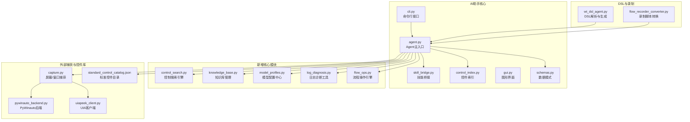
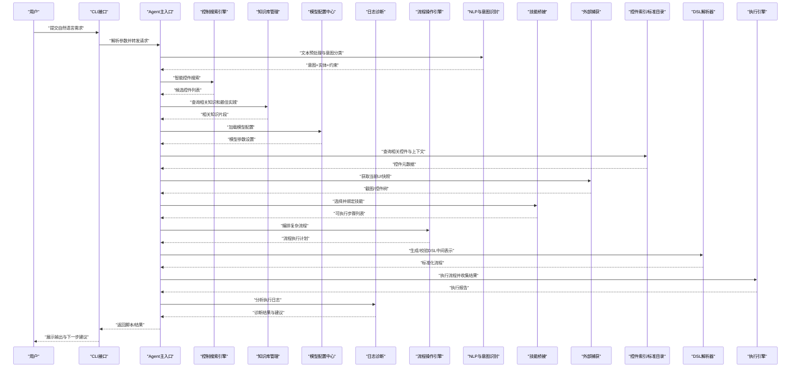
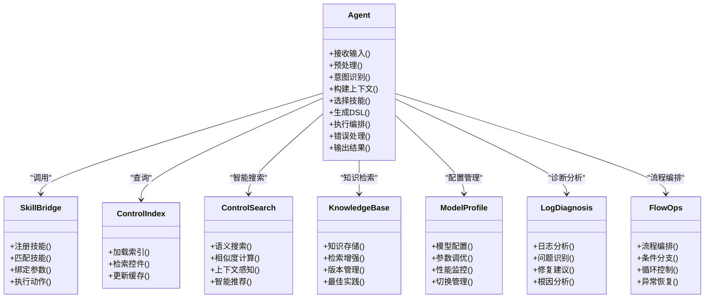
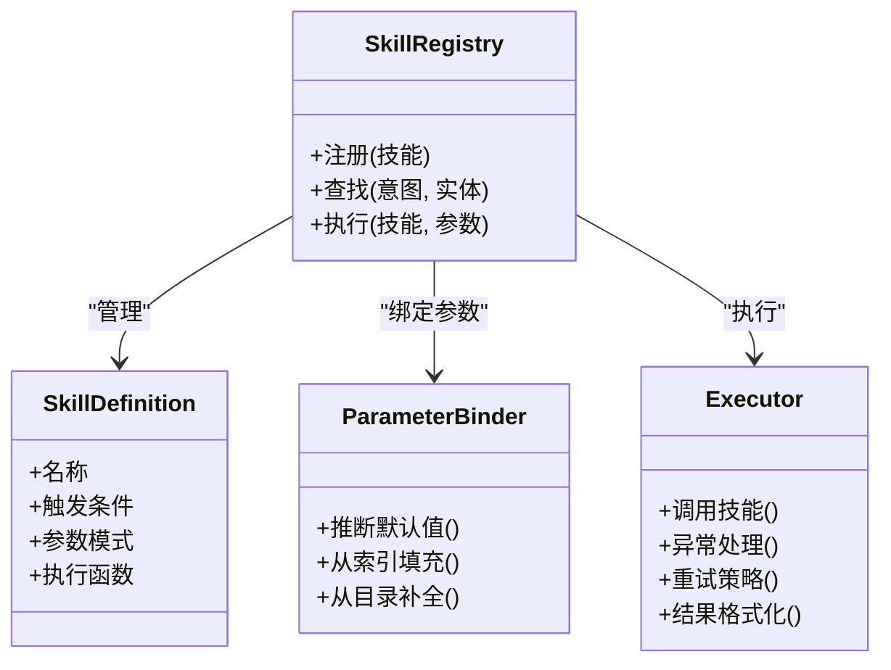
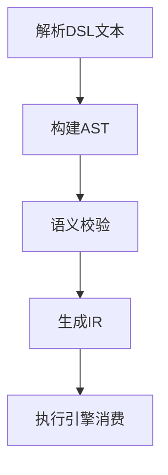
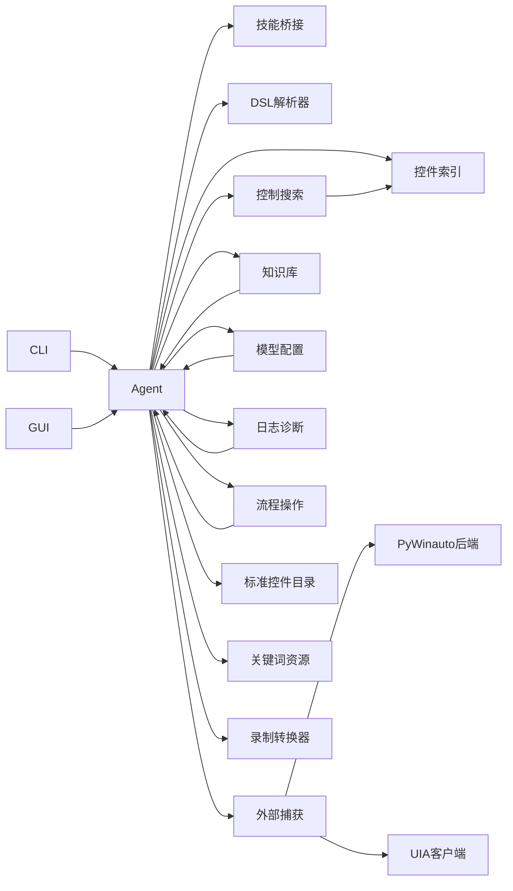

# AI辅助系统

<cite>
**本文引用的文件**   
- [WT_AUTOMATION_Agent/agent.py](file://WT_AUTOMATION_Agent/agent.py)
- [WT_AUTOMATION_Agent/cli.py](file://WT_AUTOMATION_Agent/cli.py)
- [WT_AUTOMATION_Agent/skill_bridge.py](file://WT_AUTOMATION_Agent/skill_bridge.py)
- [WT_AUTOMATION_Agent/control_index.py](file://WT_AUTOMATION_Agent/control_index.py)
- [WT_AUTOMATION_Agent/gui.py](file://WT_AUTOMATION_Agent/gui.py)
- [WT_AUTOMATION_Agent/schemas.py](file://WT_AUTOMATION_Agent/schemas.py)
- [WT_AUTOMATION_Agent/control_search.py](file://WT_AUTOMATION_Agent/control_search.py)
- [WT_AUTOMATION_Agent/knowledge_base.py](file://WT_AUTOMATION_Agent/knowledge_base.py)
- [WT_AUTOMATION_Agent/model_profiles.py](file://WT_AUTOMATION_Agent/model_profiles.py)
- [WT_AUTOMATION_Agent/log_diagnosis.py](file://WT_AUTOMATION_Agent/log_diagnosis.py)
- [WT_AUTOMATION_Agent/flow_ops.py](file://WT_AUTOMATION_Agent/flow_ops.py)
- [wt_dsl_agent.py](file://wt_dsl_agent.py)
- [flow_recorder_converter.py](file://flow_recorder_converter.py)
- [tools/external_capture/capture.py](file://tools/external_capture/capture.py)
- [tools/external_capture/pywinauto_backend.py](file://tools/external_capture/pywinauto_backend.py)
- [tools/external_capture/uiapeek_client.py](file://tools/external_capture/uiapeek_client.py)
- [resources/dispatch_keywords.resource](file://resources/dispatch_keywords.resource)
- [control_maps/standard_control_catalog.json](file://control_maps/standard_control_catalog.json)
- [samples/recorder_scripts/Skill/GM_add1.py](file://samples/recorder_scripts/Skill/GM_add1.py)
</cite>

## 更新摘要
**所做更改**
- 新增控制搜索模块，增强控件定位与智能匹配能力
- 引入知识库系统，支持AI技能与最佳实践的知识管理
- 添加模型配置文件管理，支持多模型切换与参数调优
- 集成日志诊断模块，提供自动化问题排查与修复建议
- 扩展流程操作模块，支持复杂业务流程编排与执行
- GUI界面大幅增强，提供更直观的交互体验

## 目录
1. [简介](#简介)
2. [项目结构](#项目结构)
3. [核心组件](#核心组件)
4. [架构总览](#架构总览)
5. [详细组件分析](#详细组件分析)
6. [依赖关系分析](#依赖关系分析)
7. [性能考虑](#性能考虑)
8. [故障排查指南](#故障排查指南)
9. [结论](#结论)
10. [附录](#附录)

## 简介
本文件面向WT自动化框架的AI辅助系统，系统性阐述Agent核心架构与工作原理、技能桥接扩展机制、CLI命令接口设计、DSL定义与解析流程、配置与自定义开发指南、自然语言到脚本的端到端示例、模型训练与微调方法，以及性能监控与优化策略。新版本引入了模块化架构，包括控制搜索、知识库管理、模型配置、日志诊断和流程操作等核心功能，大幅提升了系统的智能化水平和用户体验。

## 项目结构
WT自动化框架的AI辅助子系统经过重大重构，形成了更加模块化和可扩展的架构。新的结构包括核心Agent模块、控制搜索引擎、知识库管理系统、模型配置中心、日志诊断工具和流程操作引擎等组件。

**图表来源**
- [WT_AUTOMATION_Agent/agent.py](file://WT_AUTOMATION_Agent/agent.py)
- [WT_AUTOMATION_Agent/control_search.py](file://WT_AUTOMATION_Agent/control_search.py)
- [WT_AUTOMATION_Agent/knowledge_base.py](file://WT_AUTOMATION_Agent/knowledge_base.py)
- [WT_AUTOMATION_Agent/model_profiles.py](file://WT_AUTOMATION_Agent/model_profiles.py)
- [WT_AUTOMATION_Agent/log_diagnosis.py](file://WT_AUTOMATION_Agent/log_diagnosis.py)
- [WT_AUTOMATION_Agent/flow_ops.py](file://WT_AUTOMATION_Agent/flow_ops.py)
- [WT_AUTOMATION_Agent/cli.py](file://WT_AUTOMATION_Agent/cli.py)
- [WT_AUTOMATION_Agent/skill_bridge.py](file://WT_AUTOMATION_Agent/skill_bridge.py)
- [WT_AUTOMATION_Agent/control_index.py](file://WT_AUTOMATION_Agent/control_index.py)
- [WT_AUTOMATION_Agent/gui.py](file://WT_AUTOMATION_Agent/gui.py)
- [WT_AUTOMATION_Agent/schemas.py](file://WT_AUTOMATION_Agent/schemas.py)
- [wt_dsl_agent.py](file://wt_dsl_agent.py)
- [flow_recorder_converter.py](file://flow_recorder_converter.py)
- [tools/external_capture/capture.py](file://tools/external_capture/capture.py)
- [tools/external_capture/pywinauto_backend.py](file://tools/external_capture/pywinauto_backend.py)
- [tools/external_capture/uiapeek_client.py](file://tools/external_capture/uiapeek_client.py)
- [control_maps/standard_control_catalog.json](file://control_maps/standard_control_catalog.json)

**章节来源**
- [WT_AUTOMATION_Agent/agent.py](file://WT_AUTOMATION_Agent/agent.py)
- [WT_AUTOMATION_Agent/control_search.py](file://WT_AUTOMATION_Agent/control_search.py)
- [WT_AUTOMATION_Agent/knowledge_base.py](file://WT_AUTOMATION_Agent/knowledge_base.py)
- [WT_AUTOMATION_Agent/model_profiles.py](file://WT_AUTOMATION_Agent/model_profiles.py)
- [WT_AUTOMATION_Agent/log_diagnosis.py](file://WT_AUTOMATION_Agent/log_diagnosis.py)
- [WT_AUTOMATION_Agent/flow_ops.py](file://WT_AUTOMATION_Agent/flow_ops.py)
- [WT_AUTOMATION_Agent/cli.py](file://WT_AUTOMATION_Agent/cli.py)
- [WT_AUTOMATION_Agent/skill_bridge.py](file://WT_AUTOMATION_Agent/skill_bridge.py)
- [WT_AUTOMATION_Agent/control_index.py](file://WT_AUTOMATION_Agent/control_index.py)
- [WT_AUTOMATION_Agent/gui.py](file://WT_AUTOMATION_Agent/gui.py)
- [WT_AUTOMATION_Agent/schemas.py](file://WT_AUTOMATION_Agent/schemas.py)
- [wt_dsl_agent.py](file://wt_dsl_agent.py)
- [flow_recorder_converter.py](file://flow_recorder_converter.py)
- [tools/external_capture/capture.py](file://tools/external_capture/capture.py)
- [tools/external_capture/pywinauto_backend.py](file://tools/external_capture/pywinauto_backend.py)
- [tools/external_capture/uiapeek_client.py](file://tools/external_capture/uiapeek_client.py)
- [control_maps/standard_control_catalog.json](file://control_maps/standard_control_catalog.json)

## 核心组件
- Agent主入口：负责接收用户意图（自然语言或DSL）、调度NLP与意图识别、调用技能桥接执行具体动作、生成并输出可执行的自动化脚本或流程步骤。
- CLI命令接口：提供命令行工具，支持从终端直接驱动AI助手完成需求描述、脚本生成与执行。
- 技能桥接系统：将AI生成的抽象操作映射到具体UI控件或业务API，支持动态注册新技能与工具。
- 控件索引与标准目录：维护UI控件的结构化索引与标准控件目录，辅助AI进行精准定位与自修复。
- **控制搜索引擎**：基于语义理解和相似度计算，智能匹配目标控件，支持模糊搜索和上下文感知。
- **知识库管理系统**：存储和管理AI技能、最佳实践、错误案例等知识资产，支持版本控制和检索增强。
- **模型配置中心**：统一管理AI模型的配置文件，支持多模型切换、参数调优和性能监控。
- **日志诊断工具**：自动分析执行日志，识别常见问题并提供修复建议，支持根因分析和预测性维护。
- **流程操作引擎**：处理复杂的业务流程编排，支持条件分支、循环、并行执行和异常恢复。
- DSL解析器：将领域特定语言转换为内部中间表示，再交由Agent编排执行。
- 录制转换器：将录制的操作步骤转换为标准化流程定义，供AI学习与复用。
- 外部捕获与后端：通过屏幕截图、UIA/Win32等后端获取UI状态，为AI提供感知输入。

**章节来源**
- [WT_AUTOMATION_Agent/agent.py](file://WT_AUTOMATION_Agent/agent.py)
- [WT_AUTOMATION_Agent/cli.py](file://WT_AUTOMATION_Agent/cli.py)
- [WT_AUTOMATION_Agent/skill_bridge.py](file://WT_AUTOMATION_Agent/skill_bridge.py)
- [WT_AUTOMATION_Agent/control_index.py](file://WT_AUTOMATION_Agent/control_index.py)
- [WT_AUTOMATION_Agent/control_search.py](file://WT_AUTOMATION_Agent/control_search.py)
- [WT_AUTOMATION_Agent/knowledge_base.py](file://WT_AUTOMATION_Agent/knowledge_base.py)
- [WT_AUTOMATION_Agent/model_profiles.py](file://WT_AUTOMATION_Agent/model_profiles.py)
- [WT_AUTOMATION_Agent/log_diagnosis.py](file://WT_AUTOMATION_Agent/log_diagnosis.py)
- [WT_AUTOMATION_Agent/flow_ops.py](file://WT_AUTOMATION_Agent/flow_ops.py)
- [wt_dsl_agent.py](file://wt_dsl_agent.py)
- [flow_recorder_converter.py](file://flow_recorder_converter.py)
- [tools/external_capture/capture.py](file://tools/external_capture/capture.py)
- [tools/external_capture/pywinauto_backend.py](file://tools/external_capture/pywinauto_backend.py)
- [tools/external_capture/uiapeek_client.py](file://tools/external_capture/uiapeek_client.py)

## 架构总览
AI辅助系统的整体架构围绕"感知—理解—决策—执行—反馈"闭环构建，新版本增强了模块化设计和智能处理能力：
- 感知层：通过外部捕获模块采集UI截图与控件树信息，结合控件索引与标准目录，形成结构化上下文。
- 理解层：对自然语言进行分词、语义抽取与意图分类，必要时借助DSL进行结构化表达。
- **决策层**：基于意图与上下文，选择合适技能与工具，规划执行序列，支持知识库查询和模型推理。
- **执行层**：通过技能桥接调用具体UI操作或业务API，产出标准化流程步骤或脚本，支持复杂流程编排。
- **反馈层**：记录执行结果、错误与日志，用于自修复与模型优化，提供智能诊断和建议。

**图表来源**
- [WT_AUTOMATION_Agent/agent.py](file://WT_AUTOMATION_Agent/agent.py)
- [WT_AUTOMATION_Agent/control_search.py](file://WT_AUTOMATION_Agent/control_search.py)
- [WT_AUTOMATION_Agent/knowledge_base.py](file://WT_AUTOMATION_Agent/knowledge_base.py)
- [WT_AUTOMATION_Agent/model_profiles.py](file://WT_AUTOMATION_Agent/model_profiles.py)
- [WT_AUTOMATION_Agent/log_diagnosis.py](file://WT_AUTOMATION_Agent/log_diagnosis.py)
- [WT_AUTOMATION_Agent/flow_ops.py](file://WT_AUTOMATION_Agent/flow_ops.py)
- [WT_AUTOMATION_Agent/cli.py](file://WT_AUTOMATION_Agent/cli.py)
- [WT_AUTOMATION_Agent/skill_bridge.py](file://WT_AUTOMATION_Agent/skill_bridge.py)
- [WT_AUTOMATION_Agent/control_index.py](file://WT_AUTOMATION_Agent/control_index.py)
- [wt_dsl_agent.py](file://wt_dsl_agent.py)
- [tools/external_capture/capture.py](file://tools/external_capture/capture.py)
- [control_maps/standard_control_catalog.json](file://control_maps/standard_control_catalog.json)

## 详细组件分析

### Agent核心架构与工作原理
- 职责边界
  - 接收并规范化输入（自然语言、DSL片段、录制产物）。
  - 协调NLP与意图识别，提取关键实体与约束条件。
  - 结合控件索引与标准目录，进行上下文增强与定位预筛选。
  - 调用技能桥接，将抽象意图映射为具体UI操作或API调用。
  - 生成并校验DSL中间表示，确保可执行性与一致性。
  - 执行编排、错误处理与结果上报。
- 关键流程
  - 输入预处理：清洗、分句、实体抽取。
  - 意图分类：基于关键词与规则/模型进行分类。
  - 上下文构建：检索控件索引、加载标准目录、抓取UI快照。
  - 技能选择：根据意图与约束匹配技能模板。
  - 脚本生成：输出标准化步骤或脚本，支持回放与调试。
  - 执行与反馈：执行步骤、捕获异常、生成诊断信息。

**图表来源**
- [WT_AUTOMATION_Agent/agent.py](file://WT_AUTOMATION_Agent/agent.py)
- [WT_AUTOMATION_Agent/skill_bridge.py](file://WT_AUTOMATION_Agent/skill_bridge.py)
- [WT_AUTOMATION_Agent/control_index.py](file://WT_AUTOMATION_Agent/control_index.py)
- [WT_AUTOMATION_Agent/control_search.py](file://WT_AUTOMATION_Agent/control_search.py)
- [WT_AUTOMATION_Agent/knowledge_base.py](file://WT_AUTOMATION_Agent/knowledge_base.py)
- [WT_AUTOMATION_Agent/model_profiles.py](file://WT_AUTOMATION_Agent/model_profiles.py)
- [WT_AUTOMATION_Agent/log_diagnosis.py](file://WT_AUTOMATION_Agent/log_diagnosis.py)
- [WT_AUTOMATION_Agent/flow_ops.py](file://WT_AUTOMATION_Agent/flow_ops.py)
- [control_maps/standard_control_catalog.json](file://control_maps/standard_control_catalog.json)
- [tools/external_capture/capture.py](file://tools/external_capture/capture.py)
- [wt_dsl_agent.py](file://wt_dsl_agent.py)

**章节来源**
- [WT_AUTOMATION_Agent/agent.py](file://WT_AUTOMATION_Agent/agent.py)
- [WT_AUTOMATION_Agent/skill_bridge.py](file://WT_AUTOMATION_Agent/skill_bridge.py)
- [WT_AUTOMATION_Agent/control_index.py](file://WT_AUTOMATION_Agent/control_index.py)
- [WT_AUTOMATION_Agent/control_search.py](file://WT_AUTOMATION_Agent/control_search.py)
- [WT_AUTOMATION_Agent/knowledge_base.py](file://WT_AUTOMATION_Agent/knowledge_base.py)
- [WT_AUTOMATION_Agent/model_profiles.py](file://WT_AUTOMATION_Agent/model_profiles.py)
- [WT_AUTOMATION_Agent/log_diagnosis.py](file://WT_AUTOMATION_Agent/log_diagnosis.py)
- [WT_AUTOMATION_Agent/flow_ops.py](file://WT_AUTOMATION_Agent/flow_ops.py)
- [control_maps/standard_control_catalog.json](file://control_maps/standard_control_catalog.json)
- [tools/external_capture/capture.py](file://tools/external_capture/capture.py)
- [wt_dsl_agent.py](file://wt_dsl_agent.py)

### 控制搜索引擎与智能匹配
- 设计原理
  - 基于语义理解的控件搜索，支持模糊匹配和上下文感知。
  - 多维度相似度计算，综合考虑控件属性、位置、行为等因素。
  - 学习用户偏好和历史成功模式，提供个性化推荐。
- 核心功能
  - 语义搜索：将自然语言描述转换为控件查询条件。
  - 相似度评估：计算候选控件与目标的匹配程度。
  - 上下文感知：结合当前界面状态和用户意图进行智能排序。
  - 增量学习：从用户反馈中不断优化搜索算法。
- 应用场景
  - 复杂界面中的控件定位
  - 动态变化的UI元素识别
  - 跨应用的一致性操作

**章节来源**
- [WT_AUTOMATION_Agent/control_search.py](file://WT_AUTOMATION_Agent/control_search.py)

### 知识库管理系统
- 架构设计
  - 分层存储：基础技能、最佳实践、错误案例、用户经验等。
  - 检索增强：支持语义搜索、关键词匹配和关联推荐。
  - 版本控制：跟踪知识变更历史，支持回滚和对比。
- 知识类型
  - 技能知识：封装可复用的自动化技能和操作流程。
  - 领域知识：特定业务场景的最佳实践和专家经验。
  - 故障知识：常见问题的解决方案和预防措施。
  - 用户知识：个人化的使用习惯和偏好设置。
- 管理机制
  - 自动发现：从执行日志和用户交互中提取新知识。
  - 质量评估：基于使用频率和效果评分进行知识筛选。
  - 共享协作：支持团队间的知识分享和协同更新。

**章节来源**
- [WT_AUTOMATION_Agent/knowledge_base.py](file://WT_AUTOMATION_Agent/knowledge_base.py)

### 模型配置中心
- 配置管理
  - 多模型支持：同时管理多个AI模型及其配置文件。
  - 动态切换：根据任务类型和性能要求自动选择合适的模型。
  - 参数调优：提供可视化的参数调整界面和批量优化功能。
- 性能监控
  - 实时指标：监控模型响应时间、准确率和资源消耗。
  - 健康检查：定期检测模型状态和性能退化。
  - 告警通知：异常情况下的自动告警和处理建议。
- 部署策略
  - 本地部署：支持离线环境下的模型运行。
  - 云端服务：集成远程API服务，支持弹性扩展。
  - 混合模式：根据网络状况和性能需求动态选择部署方式。

**章节来源**
- [WT_AUTOMATION_Agent/model_profiles.py](file://WT_AUTOMATION_Agent/model_profiles.py)

### 日志诊断与智能修复
- 诊断能力
  - 自动分析：解析执行日志，识别错误模式和异常行为。
  - 根因定位：通过依赖关系分析确定问题的根本原因。
  - 影响评估：评估问题对业务流程的影响范围和严重程度。
- 修复建议
  - 自动修复：针对已知问题提供一键修复方案。
  - 手动指导：为复杂问题提供详细的修复步骤和注意事项。
  - 预防建议：基于历史数据提供预防措施和优化建议。
- 持续改进
  - 问题追踪：建立问题数据库，跟踪解决进度和效果。
  - 知识沉淀：将诊断经验和修复方案转化为知识库内容。
  - 模型优化：利用诊断数据优化AI模型的识别准确率。

**章节来源**
- [WT_AUTOMATION_Agent/log_diagnosis.py](file://WT_AUTOMATION_Agent/log_diagnosis.py)

### 流程操作引擎
- 编排能力
  - 可视化编排：提供拖拽式的流程设计界面。
  - 条件分支：支持基于条件的流程分支和合并。
  - 循环控制：实现迭代处理和批量操作。
  - 并行执行：支持多任务并发执行和资源调度。
- 执行管理
  - 状态监控：实时跟踪流程执行状态和进度。
  - 异常处理：提供灵活的错误恢复和重试机制。
  - 资源管理：合理分配和回收系统资源。
- 优化策略
  - 性能调优：基于执行历史优化流程执行效率。
  - 负载均衡：在多实例间合理分配任务负载。
  - 缓存策略：缓存常用数据和计算结果，提升响应速度。

**章节来源**
- [WT_AUTOMATION_Agent/flow_ops.py](file://WT_AUTOMATION_Agent/flow_ops.py)

### 自然语言处理、意图识别与脚本生成机制
- 自然语言处理
  - 文本清洗与分句：去除噪声、统一标点、按业务语义切分。
  - 实体抽取：识别目标对象、字段名、数值、路径等关键实体。
  - 语义归一化：同义词映射、单位换算、范围规范化。
- 意图识别
  - 基于关键词资源与规则的分类器，结合轻量模型进行置信度评估。
  - 多意图融合：复杂需求拆分为子意图，形成执行序列。
- 脚本生成
  - 将意图与实体映射为标准化的流程步骤或DSL节点。
  - 生成前后校验：结构完整性、参数合法性、控件存在性检查。
  - 输出形式：可执行脚本、流程图定义、调试日志。

**图表来源**
- [WT_AUTOMATION_Agent/agent.py](file://WT_AUTOMATION_Agent/agent.py)
- [resources/dispatch_keywords.resource](file://resources/dispatch_keywords.resource)
- [wt_dsl_agent.py](file://wt_dsl_agent.py)

**章节来源**
- [WT_AUTOMATION_Agent/agent.py](file://WT_AUTOMATION_Agent/agent.py)
- [resources/dispatch_keywords.resource](file://resources/dispatch_keywords.resource)
- [wt_dsl_agent.py](file://wt_dsl_agent.py)

### 技能桥接系统与扩展指南
- 设计要点
  - 技能注册：以声明式方式注册技能名称、触发条件、参数模式与执行函数。
  - 技能匹配：根据意图、实体与上下文选择最合适的技能。
  - 参数绑定：自动填充默认值、从控件索引推断、从标准目录补全。
  - 执行封装：统一异常处理、重试策略、结果格式化。
- 扩展新技能
  - 新增技能定义文件，包含元数据与实现函数。
  - 在桥接系统中注册技能，并提供测试用例验证。
  - 更新标准目录与控件索引，确保AI能正确定位目标控件。
- 工具集成
  - 将外部工具封装为技能，暴露统一接口。
  - 支持异步执行与超时控制，保证系统稳定性。

**图表来源**
- [WT_AUTOMATION_Agent/skill_bridge.py](file://WT_AUTOMATION_Agent/skill_bridge.py)
- [WT_AUTOMATION_Agent/control_index.py](file://WT_AUTOMATION_Agent/control_index.py)
- [control_maps/standard_control_catalog.json](file://control_maps/standard_control_catalog.json)

**章节来源**
- [WT_AUTOMATION_Agent/skill_bridge.py](file://WT_AUTOMATION_Agent/skill_bridge.py)
- [WT_AUTOMATION_Agent/control_index.py](file://WT_AUTOMATION_Agent/control_index.py)
- [control_maps/standard_control_catalog.json](file://control_maps/standard_control_catalog.json)

### CLI命令接口设计与使用
- 设计原则
  - 简洁直观：常用命令短小精悍，支持参数组合。
  - 幂等稳定：重复执行不产生副作用，失败可恢复。
  - 可观测：输出结构化日志与结果，便于自动化集成。
- 典型命令
  - 启动助手：进入交互模式，接受自然语言输入。
  - 生成脚本：根据需求描述生成标准化脚本或DSL。
  - 执行流程：运行已生成的流程并返回结果。
  - 调试模式：开启详细日志与断点，辅助问题定位。
- 使用示例
  - 通过命令行传入需求描述，输出可执行脚本路径与执行报告。
  - 结合环境变量切换不同模型或后端。

**章节来源**
- [WT_AUTOMATION_Agent/cli.py](file://WT_AUTOMATION_Agent/cli.py)

### DSL定义与解析机制
- DSL目标
  - 以结构化语言描述自动化流程，便于AI生成与人类编辑。
  - 支持条件分支、循环、参数化与错误处理。
- 解析流程
  - 语法解析：将DSL文本转换为AST。
  - 语义校验：检查节点类型、参数合法性与依赖关系。
  - IR生成：转换为内部表示，供执行引擎消费。
- 与Agent协作
  - Agent生成DSL片段，经解析器校验后纳入执行计划。
  - 录制转换器可将历史录制产物转为DSL，供AI学习。

**图表来源**
- [wt_dsl_agent.py](file://wt_dsl_agent.py)
- [flow_recorder_converter.py](file://flow_recorder_converter.py)

**章节来源**
- [wt_dsl_agent.py](file://wt_dsl_agent.py)
- [flow_recorder_converter.py](file://flow_recorder_converter.py)

### 外部捕获与控件定位
- 捕获策略
  - 屏幕截图：用于视觉匹配与漂移检测。
  - 控件树：通过UIA或Win32后端获取控件属性与层级。
- 后端选择
  - PyWinauto后端：适用于Win32/WPF控件。
  - UIA客户端：适用于现代UI框架与跨平台场景。
- 控件索引
  - 维护控件元数据与路径，加速AI定位与自修复。
  - 标准目录提供通用控件类型与行为约定。

**章节来源**
- [tools/external_capture/capture.py](file://tools/external_capture/capture.py)
- [tools/external_capture/pywinauto_backend.py](file://tools/external_capture/pywinauto_backend.py)
- [tools/external_capture/uiapeek_client.py](file://tools/external_capture/uiapeek_client.py)
- [WT_AUTOMATION_Agent/control_index.py](file://WT_AUTOMATION_Agent/control_index.py)
- [control_maps/standard_control_catalog.json](file://control_maps/standard_control_catalog.json)

### GUI与可视化辅助
- 功能概述
  - 提供图形界面，便于非技术用户输入需求与查看结果。
  - 集成日志面板、控件预览与调试工具。
  - 支持可视化流程编排和实时监控。
- 与CLI互补
  - GUI适合探索与演示，CLI适合批处理与CI集成。
  - 双入口设计满足不同用户群体的需求。

**章节来源**
- [WT_AUTOMATION_Agent/gui.py](file://WT_AUTOMATION_Agent/gui.py)

### 数据模式与校验
- 模式定义
  - 使用统一的数据模式描述输入输出结构，确保一致性。
- 校验策略
  - 运行时校验：在执行前检查必填字段与类型。
  - 容错处理：缺失字段时采用默认值或提示补充。

**章节来源**
- [WT_AUTOMATION_Agent/schemas.py](file://WT_AUTOMATION_Agent/schemas.py)

## 依赖关系分析
AI辅助系统的关键依赖包括：
- 内部依赖
  - Agent依赖技能桥接、控件索引、DSL解析器与外部捕获。
  - CLI与GUI作为前端入口，调用Agent完成核心逻辑。
  - 新增模块间相互协作，形成完整的智能处理链路。
- 外部依赖
  - UIA/Win32后端用于控件树与截图。
  - 标准控件目录与关键词资源用于意图识别与控件匹配。
  - 录制转换器用于历史数据复用。

**图表来源**
- [WT_AUTOMATION_Agent/cli.py](file://WT_AUTOMATION_Agent/cli.py)
- [WT_AUTOMATION_Agent/gui.py](file://WT_AUTOMATION_Agent/gui.py)
- [WT_AUTOMATION_Agent/agent.py](file://WT_AUTOMATION_Agent/agent.py)
- [WT_AUTOMATION_Agent/skill_bridge.py](file://WT_AUTOMATION_Agent/skill_bridge.py)
- [WT_AUTOMATION_Agent/control_index.py](file://WT_AUTOMATION_Agent/control_index.py)
- [WT_AUTOMATION_Agent/control_search.py](file://WT_AUTOMATION_Agent/control_search.py)
- [WT_AUTOMATION_Agent/knowledge_base.py](file://WT_AUTOMATION_Agent/knowledge_base.py)
- [WT_AUTOMATION_Agent/model_profiles.py](file://WT_AUTOMATION_Agent/model_profiles.py)
- [WT_AUTOMATION_Agent/log_diagnosis.py](file://WT_AUTOMATION_Agent/log_diagnosis.py)
- [WT_AUTOMATION_Agent/flow_ops.py](file://WT_AUTOMATION_Agent/flow_ops.py)
- [wt_dsl_agent.py](file://wt_dsl_agent.py)
- [tools/external_capture/capture.py](file://tools/external_capture/capture.py)
- [tools/external_capture/pywinauto_backend.py](file://tools/external_capture/pywinauto_backend.py)
- [tools/external_capture/uiapeek_client.py](file://tools/external_capture/uiapeek_client.py)
- [control_maps/standard_control_catalog.json](file://control_maps/standard_control_catalog.json)
- [resources/dispatch_keywords.resource](file://resources/dispatch_keywords.resource)
- [flow_recorder_converter.py](file://flow_recorder_converter.py)

**章节来源**
- [WT_AUTOMATION_Agent/cli.py](file://WT_AUTOMATION_Agent/cli.py)
- [WT_AUTOMATION_Agent/gui.py](file://WT_AUTOMATION_Agent/gui.py)
- [WT_AUTOMATION_Agent/agent.py](file://WT_AUTOMATION_Agent/agent.py)
- [WT_AUTOMATION_Agent/skill_bridge.py](file://WT_AUTOMATION_Agent/skill_bridge.py)
- [WT_AUTOMATION_Agent/control_index.py](file://WT_AUTOMATION_Agent/control_index.py)
- [WT_AUTOMATION_Agent/control_search.py](file://WT_AUTOMATION_Agent/control_search.py)
- [WT_AUTOMATION_Agent/knowledge_base.py](file://WT_AUTOMATION_Agent/knowledge_base.py)
- [WT_AUTOMATION_Agent/model_profiles.py](file://WT_AUTOMATION_Agent/model_profiles.py)
- [WT_AUTOMATION_Agent/log_diagnosis.py](file://WT_AUTOMATION_Agent/log_diagnosis.py)
- [WT_AUTOMATION_Agent/flow_ops.py](file://WT_AUTOMATION_Agent/flow_ops.py)
- [wt_dsl_agent.py](file://wt_dsl_agent.py)
- [tools/external_capture/capture.py](file://tools/external_capture/capture.py)
- [tools/external_capture/pywinauto_backend.py](file://tools/external_capture/pywinauto_backend.py)
- [tools/external_capture/uiapeek_client.py](file://tools/external_capture/uiapeek_client.py)
- [control_maps/standard_control_catalog.json](file://control_maps/standard_control_catalog.json)
- [resources/dispatch_keywords.resource](file://resources/dispatch_keywords.resource)
- [flow_recorder_converter.py](file://flow_recorder_converter.py)

## 性能考虑
- 缓存与索引
  - 控件索引与标准目录应定期更新并缓存，减少IO开销。
  - 截图与控件树缓存，避免重复采集。
  - 知识库查询结果缓存，提升检索效率。
- 并发与异步
  - 技能执行支持异步与超时控制，提高吞吐。
  - 批量任务采用队列与限流，防止资源争用。
  - 多模型并行推理，充分利用计算资源。
- 模型推理优化
  - 使用本地轻量模型或缓存推理结果，降低延迟。
  - 对高频意图进行预计算与模板化。
  - 模型热重载，支持在线更新和灰度发布。
- 监控与告警
  - 记录关键指标：响应时间、成功率、错误分布。
  - 设置阈值告警，及时发现问题。
  - 性能瓶颈分析，指导系统优化。

## 故障排查指南
- 常见问题
  - 控件定位失败：检查控件索引是否最新，确认标准目录覆盖目标控件类型。
  - 意图识别不准：扩充关键词资源与训练数据，调整分类阈值。
  - 执行异常：查看执行日志与断点信息，确认参数绑定是否正确。
  - 模型加载失败：检查模型配置文件和网络连接状态。
  - 知识库检索错误：验证知识格式和索引完整性。
- 调试技巧
  - 启用调试模式，输出详细日志与中间结果。
  - 使用录制转换器回放历史步骤，对比差异定位问题。
  - 通过GUI的控件预览与日志面板快速定位。
  - 利用日志诊断工具自动分析问题根因。
  - 使用模型配置中心的性能监控功能。

**章节来源**
- [WT_AUTOMATION_Agent/agent.py](file://WT_AUTOMATION_Agent/agent.py)
- [WT_AUTOMATION_Agent/cli.py](file://WT_AUTOMATION_Agent/cli.py)
- [WT_AUTOMATION_Agent/log_diagnosis.py](file://WT_AUTOMATION_Agent/log_diagnosis.py)
- [flow_recorder_converter.py](file://flow_recorder_converter.py)

## 结论
WT自动化框架的AI辅助系统经过重大升级，形成了更加完善和智能化的架构。新版本引入了控制搜索引擎、知识库管理系统、模型配置中心、日志诊断工具和流程操作引擎等核心模块，大幅提升了系统的智能化水平和用户体验。通过这些模块化设计，系统能够更好地处理复杂的自动化场景，提供更准确的意图识别和更稳定的执行效果。配合增强的GUI界面和CLI接口，既满足了专业用户的深度定制需求，也兼顾了普通用户的易用性。未来可通过持续优化各模块性能和扩展更多AI能力，进一步提升自动化效率和准确性。

## 附录

### 实际使用示例：用自然语言描述自动化需求
- 示例场景
  - 打开某软件窗口，选择指定菜单项，填写表单并提交。
- 端到端流程
  - 用户在CLI或GUI中输入自然语言描述。
  - Agent进行NLP与意图识别，提取目标窗口、菜单项与表单字段。
  - 控制搜索引擎智能匹配目标控件，知识库提供最佳实践参考。
  - 模型配置中心选择合适的AI模型进行处理。
  - 流程操作引擎编排复杂业务流程。
  - 执行流程并返回结果与报告。
- 参考路径
  - 自然语言输入与输出：[CLI接口](file://WT_AUTOMATION_Agent/cli.py)
  - 意图识别与脚本生成：[Agent主入口](file://WT_AUTOMATION_Agent/agent.py)
  - 智能控件搜索：[控制搜索引擎](file://WT_AUTOMATION_Agent/control_search.py)
  - 知识库查询：[知识库管理](file://WT_AUTOMATION_Agent/knowledge_base.py)
  - 模型配置：[模型配置中心](file://WT_AUTOMATION_Agent/model_profiles.py)
  - 流程编排：[流程操作引擎](file://WT_AUTOMATION_Agent/flow_ops.py)
  - DSL生成与校验：[DSL解析器](file://wt_dsl_agent.py)
  - 控件定位与索引：[控件索引](file://WT_AUTOMATION_Agent/control_index.py)、[标准控件目录](file://control_maps/standard_control_catalog.json)
  - 录制脚本参考：[GM_add1.py](file://samples/recorder_scripts/Skill/GM_add1.py)

**章节来源**
- [WT_AUTOMATION_Agent/cli.py](file://WT_AUTOMATION_Agent/cli.py)
- [WT_AUTOMATION_Agent/agent.py](file://WT_AUTOMATION_Agent/agent.py)
- [WT_AUTOMATION_Agent/control_search.py](file://WT_AUTOMATION_Agent/control_search.py)
- [WT_AUTOMATION_Agent/knowledge_base.py](file://WT_AUTOMATION_Agent/knowledge_base.py)
- [WT_AUTOMATION_Agent/model_profiles.py](file://WT_AUTOMATION_Agent/model_profiles.py)
- [WT_AUTOMATION_Agent/flow_ops.py](file://WT_AUTOMATION_Agent/flow_ops.py)
- [wt_dsl_agent.py](file://wt_dsl_agent.py)
- [WT_AUTOMATION_Agent/control_index.py](file://WT_AUTOMATION_Agent/control_index.py)
- [control_maps/standard_control_catalog.json](file://control_maps/standard_control_catalog.json)
- [samples/recorder_scripts/Skill/GM_add1.py](file://samples/recorder_scripts/Skill/GM_add1.py)

### AI模型的训练与微调方法
- 数据准备
  - 收集历史自然语言需求与对应脚本/DSL，构建指令-执行对。
  - 标注意图类别与实体，形成监督信号。
  - 利用知识库中的最佳实践和错误案例进行数据增强。
- 训练策略
  - 使用轻量模型进行意图分类与实体抽取的微调。
  - 引入领域词典与规则，提升鲁棒性。
  - 支持增量学习和在线学习，适应不断变化的需求。
- 评估与迭代
  - 以准确率、召回率与F1为指标评估模型效果。
  - 持续收集线上反馈，增量训练与版本管理。
  - 利用日志诊断数据进行模型优化和问题修复。

### 配置选项与自定义开发指南
- 配置项
  - 模型路径与参数：选择本地或远程模型，设置推理参数。
  - 技能注册表：声明式注册新技能与工具。
  - 控件索引与标准目录：维护路径与更新策略。
  - 知识库路径与检索策略：配置知识存储和访问方式。
  - 日志与监控：开关详细日志，配置指标上报。
- 自定义开发
  - 新增技能：定义元数据与实现函数，注册到桥接系统。
  - 扩展NLP：添加领域词典与规则，优化意图分类。
  - 集成外部工具：封装为技能，提供统一接口与错误处理。
  - 扩展知识库：添加新的知识类型和检索算法。
  - 自定义模型：支持第三方模型接入和配置管理。
  - 流程扩展：开发新的流程操作符和编排策略。

**章节来源**
- [WT_AUTOMATION_Agent/skill_bridge.py](file://WT_AUTOMATION_Agent/skill_bridge.py)
- [WT_AUTOMATION_Agent/control_index.py](file://WT_AUTOMATION_Agent/control_index.py)
- [WT_AUTOMATION_Agent/knowledge_base.py](file://WT_AUTOMATION_Agent/knowledge_base.py)
- [WT_AUTOMATION_Agent/model_profiles.py](file://WT_AUTOMATION_Agent/model_profiles.py)
- [WT_AUTOMATION_Agent/flow_ops.py](file://WT_AUTOMATION_Agent/flow_ops.py)
- [control_maps/standard_control_catalog.json](file://control_maps/standard_control_catalog.json)
- [resources/dispatch_keywords.resource](file://resources/dispatch_keywords.resource)