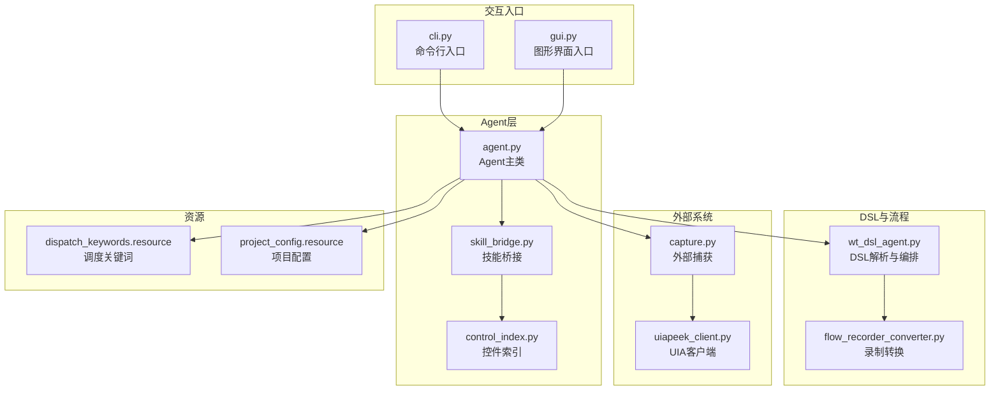
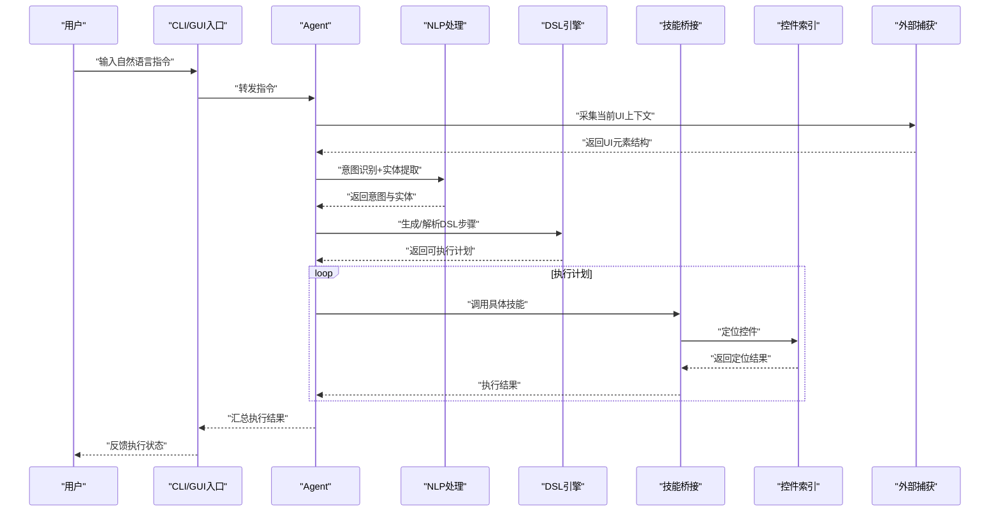
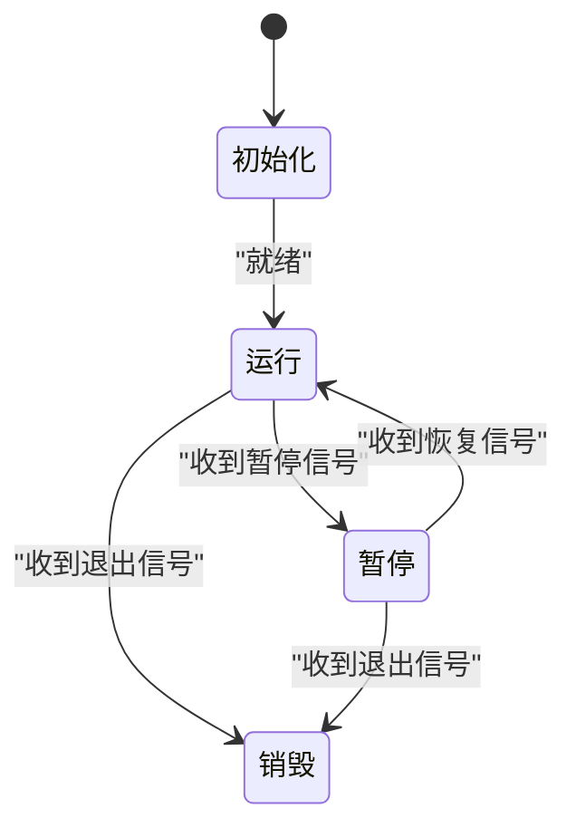
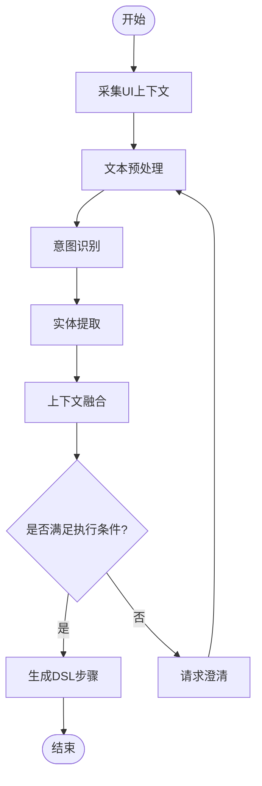
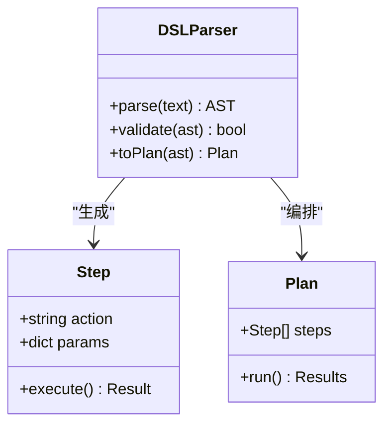
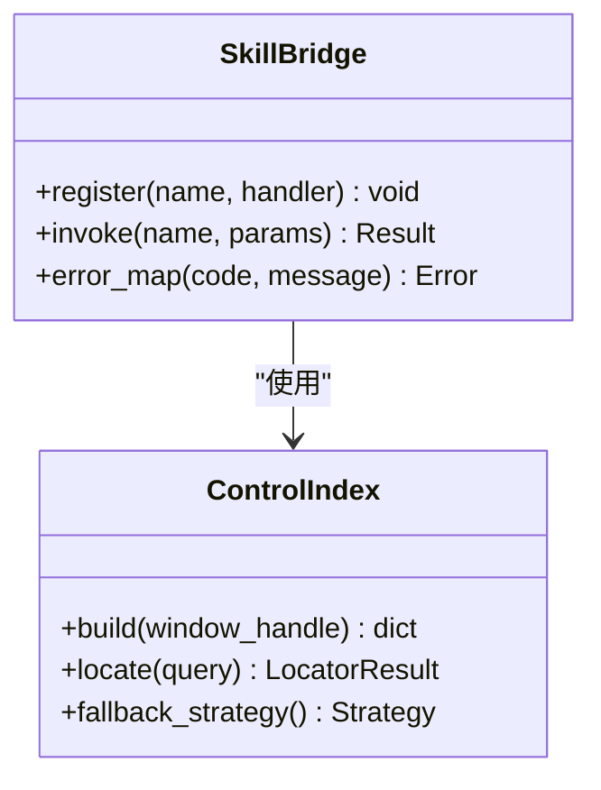
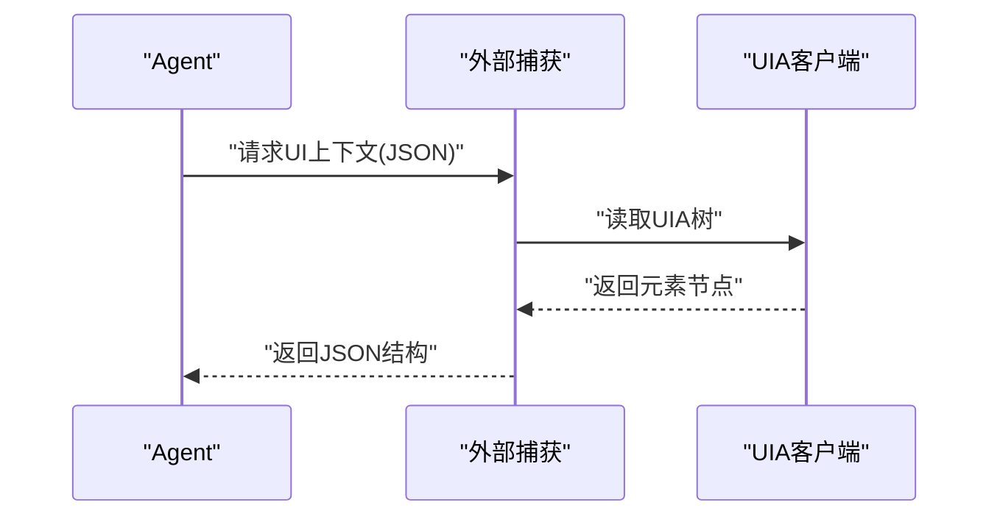
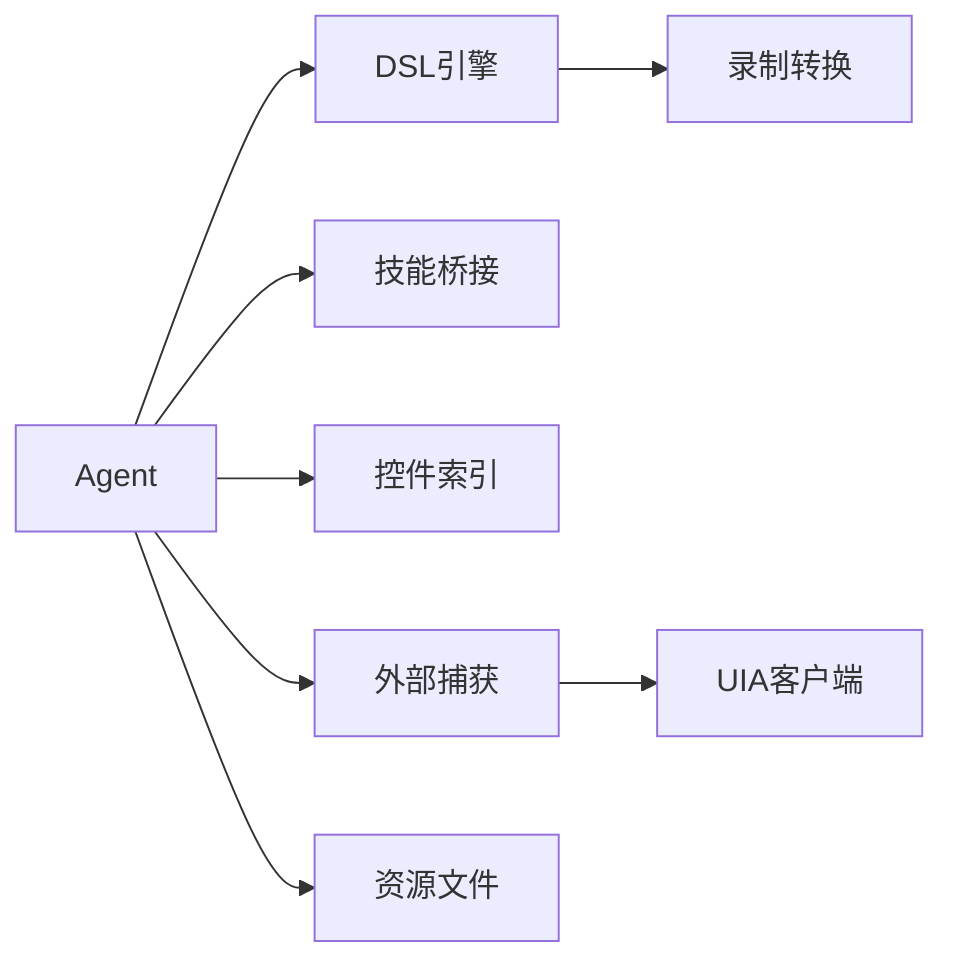

# Agent核心架构

<cite>
**本文引用的文件**   
- [WT_AUTOMATION_Agent/agent.py](file://WT_AUTOMATION_Agent/agent.py)
- [WT_AUTOMATION_Agent/cli.py](file://WT_AUTOMATION_Agent/cli.py)
- [WT_AUTOMATION_Agent/gui.py](file://WT_AUTOMATION_Agent/gui.py)
- [WT_AUTOMATION_Agent/skill_bridge.py](file://WT_AUTOMATION_Agent/skill_bridge.py)
- [WT_AUTOMATION_Agent/control_index.py](file://WT_AUTOMATION_Agent/control_index.py)
- [WT_AUTOMATION_Agent/examples/quickstart.py](file://WT_AUTOMATION_Agent/examples/quickstart.py)
- [wt_dsl_agent.py](file://wt_dsl_agent.py)
- [flow_recorder_converter.py](file://flow_recorder_converter.py)
- [tools/external_capture/capture.py](file://tools/external_capture/capture.py)
- [tools/external_capture/uiapeek_client.py](file://tools/external_capture/uiapeek_client.py)
- [resources/dispatch_keywords.resource](file://resources/dispatch_keywords.resource)
- [resources/project_config.resource](file://resources/project_config.resource)
</cite>

## 目录
1. [简介](#简介)
2. [项目结构](#项目结构)
3. [核心组件](#核心组件)
4. [架构总览](#架构总览)
5. [详细组件分析](#详细组件分析)
6. [依赖关系分析](#依赖关系分析)
7. [性能考虑](#性能考虑)
8. [故障排查指南](#故障排查指南)
9. [结论](#结论)
10. [附录](#附录)

## 简介
本文件聚焦于WT自动化框架中Agent核心架构的设计与实现，围绕以下目标展开：
- Agent生命周期管理、状态维护与消息处理机制
- 自然语言处理流程（意图识别、实体提取、上下文理解）
- DSL（领域特定语言）语法定义与解析器实现
- Agent与外部系统的通信协议与数据交换格式
- Agent配置选项与环境变量设置方法
- 实际代码示例展示如何初始化和使用Agent进行自动化任务处理

## 项目结构
WT自动化框架采用分层与模块化组织方式。Agent相关能力集中在WT_AUTOMATION_Agent子包内，同时DSL解析与执行逻辑位于根目录的wt_dsl_agent.py等文件中；UI交互通过CLI与GUI入口暴露；技能桥接与控件索引提供与底层UI自动化能力的对接；外部捕获工具用于跨进程UI元素抓取与解析。

图表来源
- [WT_AUTOMATION_Agent/agent.py](file://WT_AUTOMATION_Agent/agent.py)
- [WT_AUTOMATION_Agent/skill_bridge.py](file://WT_AUTOMATION_Agent/skill_bridge.py)
- [WT_AUTOMATION_Agent/control_index.py](file://WT_AUTOMATION_Agent/control_index.py)
- [wt_dsl_agent.py](file://wt_dsl_agent.py)
- [flow_recorder_converter.py](file://flow_recorder_converter.py)
- [WT_AUTOMATION_Agent/cli.py](file://WT_AUTOMATION_Agent/cli.py)
- [WT_AUTOMATION_Agent/gui.py](file://WT_AUTOMATION_Agent/gui.py)
- [tools/external_capture/capture.py](file://tools/external_capture/capture.py)
- [tools/external_capture/uiapeek_client.py](file://tools/external_capture/uiapeek_client.py)
- [resources/dispatch_keywords.resource](file://resources/dispatch_keywords.resource)
- [resources/project_config.resource](file://resources/project_config.resource)

章节来源
- [WT_AUTOMATION_Agent/agent.py](file://WT_AUTOMATION_Agent/agent.py)
- [wt_dsl_agent.py](file://wt_dsl_agent.py)
- [WT_AUTOMATION_Agent/cli.py](file://WT_AUTOMATION_Agent/cli.py)
- [WT_AUTOMATION_Agent/gui.py](file://WT_AUTOMATION_Agent/gui.py)
- [WT_AUTOMATION_Agent/skill_bridge.py](file://WT_AUTOMATION_Agent/skill_bridge.py)
- [WT_AUTOMATION_Agent/control_index.py](file://WT_AUTOMATION_Agent/control_index.py)
- [tools/external_capture/capture.py](file://tools/external_capture/capture.py)
- [tools/external_capture/uiapeek_client.py](file://tools/external_capture/uiapeek_client.py)
- [resources/dispatch_keywords.resource](file://resources/dispatch_keywords.resource)
- [resources/project_config.resource](file://resources/project_config.resource)

## 核心组件
- Agent主类：负责生命周期管理、状态维护、消息路由与调度、与DSL引擎和外部系统交互。
- DSL引擎：负责DSL语法定义、解析、语义校验与执行编排。
- 技能桥接：封装具体业务技能调用，屏蔽底层差异。
- 控件索引：维护UI控件树与定位策略，支持相对定位与自愈式查找。
- 外部捕获：跨进程获取UI元素信息，为意图识别与实体提取提供结构化输入。
- CLI/GUI入口：提供用户交互通道，接收自然语言指令并驱动Agent执行。
- 资源文件：包含调度关键词与项目配置，影响意图识别与行为参数。

章节来源
- [WT_AUTOMATION_Agent/agent.py](file://WT_AUTOMATION_Agent/agent.py)
- [wt_dsl_agent.py](file://wt_dsl_agent.py)
- [WT_AUTOMATION_Agent/skill_bridge.py](file://WT_AUTOMATION_Agent/skill_bridge.py)
- [WT_AUTOMATION_Agent/control_index.py](file://WT_AUTOMATION_Agent/control_index.py)
- [tools/external_capture/capture.py](file://tools/external_capture/capture.py)
- [tools/external_capture/uiapeek_client.py](file://tools/external_capture/uiapeek_client.py)
- [WT_AUTOMATION_Agent/cli.py](file://WT_AUTOMATION_Agent/cli.py)
- [WT_AUTOMATION_Agent/gui.py](file://WT_AUTOMATION_Agent/gui.py)
- [resources/dispatch_keywords.resource](file://resources/dispatch_keywords.resource)
- [resources/project_config.resource](file://resources/project_config.resource)

## 架构总览
下图展示了从用户输入到自动化执行的端到端流程，包括NLP处理、DSL解析、技能调用与UI操作。

图表来源
- [WT_AUTOMATION_Agent/agent.py](file://WT_AUTOMATION_Agent/agent.py)
- [wt_dsl_agent.py](file://wt_dsl_agent.py)
- [WT_AUTOMATION_Agent/skill_bridge.py](file://WT_AUTOMATION_Agent/skill_bridge.py)
- [WT_AUTOMATION_Agent/control_index.py](file://WT_AUTOMATION_Agent/control_index.py)
- [tools/external_capture/capture.py](file://tools/external_capture/capture.py)
- [tools/external_capture/uiapeek_client.py](file://tools/external_capture/uiapeek_client.py)
- [WT_AUTOMATION_Agent/cli.py](file://WT_AUTOMATION_Agent/cli.py)
- [WT_AUTOMATION_Agent/gui.py](file://WT_AUTOMATION_Agent/gui.py)

## 详细组件分析

### Agent主类与生命周期管理
- 生命周期阶段
  - 初始化：加载配置、注册技能、构建控件索引、启动外部捕获服务。
  - 运行：接收消息、进入消息循环、按优先级调度处理。
  - 暂停/恢复：支持中断与恢复，保持上下文一致。
  - 销毁：释放资源、关闭外部连接、持久化状态。
- 状态维护
  - 会话上下文：保存最近对话历史、中间变量、定位缓存。
  - 执行状态：记录当前任务ID、步骤进度、错误堆栈。
  - 资源句柄：管理UI窗口句柄、外部进程连接、模型实例。
- 消息处理机制
  - 消息类型：指令、查询、回调、心跳、错误上报。
  - 路由策略：基于意图与实体匹配处理器；失败重试与降级策略。
  - 并发控制：单线程顺序执行关键UI操作，避免竞态条件。

图表来源
- [WT_AUTOMATION_Agent/agent.py](file://WT_AUTOMATION_Agent/agent.py)

章节来源
- [WT_AUTOMATION_Agent/agent.py](file://WT_AUTOMATION_Agent/agent.py)

### 自然语言处理流程（意图识别、实体提取、上下文理解）
- 意图识别
  - 输入：用户文本 + UI上下文快照。
  - 输出：意图类别及置信度。
  - 依据：调度关键词资源与规则/模型组合。
- 实体提取
  - 输入：用户文本 + 控件索引。
  - 输出：实体键值对（如窗口名、控件名、数值）。
  - 依据：控件索引与正则/NER策略。
- 上下文理解
  - 输入：历史对话与当前UI结构。
  - 输出：消歧后的完整指令表示。
  - 依据：会话状态与最近操作轨迹。

图表来源
- [resources/dispatch_keywords.resource](file://resources/dispatch_keywords.resource)
- [WT_AUTOMATION_Agent/control_index.py](file://WT_AUTOMATION_Agent/control_index.py)
- [tools/external_capture/capture.py](file://tools/external_capture/capture.py)
- [wt_dsl_agent.py](file://wt_dsl_agent.py)

章节来源
- [resources/dispatch_keywords.resource](file://resources/dispatch_keywords.resource)
- [WT_AUTOMATION_Agent/control_index.py](file://WT_AUTOMATION_Agent/control_index.py)
- [tools/external_capture/capture.py](file://tools/external_capture/capture.py)
- [wt_dsl_agent.py](file://wt_dsl_agent.py)

### DSL语法定义与解析器实现
- 语法要点
  - 步骤序列：顺序执行，支持分支与循环。
  - 动作原子：点击、输入、选择、等待、断言等。
  - 参数绑定：从实体映射到动作参数。
- 解析流程
  - 词法分析：切分关键字与字面量。
  - 语法分析：构建AST。
  - 语义校验：检查参数完整性与类型。
  - 执行编排：转换为可执行计划。
- 与录制转换集成
  - 将录制脚本转换为DSL，便于复用与编辑。

图表来源
- [wt_dsl_agent.py](file://wt_dsl_agent.py)
- [flow_recorder_converter.py](file://flow_recorder_converter.py)

章节来源
- [wt_dsl_agent.py](file://wt_dsl_agent.py)
- [flow_recorder_converter.py](file://flow_recorder_converter.py)

### 技能桥接与控件索引
- 技能桥接
  - 统一接口：对外暴露标准化技能API。
  - 适配器模式：适配不同UI后端或第三方库。
  - 错误封装：将异常转换为统一错误码与消息。
- 控件索引
  - 索引构建：扫描窗口树，建立名称/类型/路径索引。
  - 定位策略：支持精确匹配、模糊匹配、相对位置与图像辅助。
  - 自愈机制：当控件属性变化时自动回退与重试。

图表来源
- [WT_AUTOMATION_Agent/skill_bridge.py](file://WT_AUTOMATION_Agent/skill_bridge.py)
- [WT_AUTOMATION_Agent/control_index.py](file://WT_AUTOMATION_Agent/control_index.py)

章节来源
- [WT_AUTOMATION_Agent/skill_bridge.py](file://WT_AUTOMATION_Agent/skill_bridge.py)
- [WT_AUTOMATION_Agent/control_index.py](file://WT_AUTOMATION_Agent/control_index.py)

### 外部系统通信协议与数据交换格式
- 通信协议
  - 本地进程间通信：通过Python模块调用或轻量RPC。
  - UIA客户端：通过UIA Peek客户端获取UI元素树。
- 数据交换格式
  - JSON：用于DSL、步骤计划、实体与结果序列化。
  - 资源文件：用于关键词与配置项声明。
- 安全与健壮性
  - 超时与重试：防止阻塞与死锁。
  - 幂等设计：重复执行不产生副作用。

图表来源
- [tools/external_capture/capture.py](file://tools/external_capture/capture.py)
- [tools/external_capture/uiapeek_client.py](file://tools/external_capture/uiapeek_client.py)

章节来源
- [tools/external_capture/capture.py](file://tools/external_capture/capture.py)
- [tools/external_capture/uiapeek_client.py](file://tools/external_capture/uiapeek_client.py)

### 配置选项与环境变量
- 配置来源
  - 资源文件：调度关键词与项目配置。
  - 环境变量：运行时开关（如调试日志、超时时间、重试次数）。
- 常见选项
  - 意图识别阈值、实体提取策略、控件定位容差、外部捕获超时。
- 加载顺序
  - 默认配置 → 资源文件 → 环境变量覆盖 → 运行时参数。

章节来源
- [resources/dispatch_keywords.resource](file://resources/dispatch_keywords.resource)
- [resources/project_config.resource](file://resources/project_config.resource)

### 初始化与使用示例
- 初始化步骤
  - 创建Agent实例，传入配置与资源路径。
  - 注册技能与构建控件索引。
  - 启动外部捕获服务。
- 执行流程
  - 接收自然语言指令。
  - 触发NLP与DSL解析。
  - 执行计划并返回结果。
- 参考示例
  - 快速入门脚本展示了完整的初始化与调用过程。

章节来源
- [WT_AUTOMATION_Agent/examples/quickstart.py](file://WT_AUTOMATION_Agent/examples/quickstart.py)
- [WT_AUTOMATION_Agent/agent.py](file://WT_AUTOMATION_Agent/agent.py)

## 依赖关系分析
- 内部依赖
  - Agent依赖DSL引擎、技能桥接、控件索引与外部捕获。
  - DSL引擎依赖录制转换器以支持从录制脚本生成DSL。
- 外部依赖
  - UIA客户端用于跨进程UI元素抓取。
  - 资源文件提供关键词与配置。
- 耦合与内聚
  - 通过技能桥接降低与具体UI后端的耦合。
  - 控件索引独立维护定位策略，提升内聚性。

图表来源
- [WT_AUTOMATION_Agent/agent.py](file://WT_AUTOMATION_Agent/agent.py)
- [wt_dsl_agent.py](file://wt_dsl_agent.py)
- [flow_recorder_converter.py](file://flow_recorder_converter.py)
- [WT_AUTOMATION_Agent/skill_bridge.py](file://WT_AUTOMATION_Agent/skill_bridge.py)
- [WT_AUTOMATION_Agent/control_index.py](file://WT_AUTOMATION_Agent/control_index.py)
- [tools/external_capture/capture.py](file://tools/external_capture/capture.py)
- [tools/external_capture/uiapeek_client.py](file://tools/external_capture/uiapeek_client.py)
- [resources/dispatch_keywords.resource](file://resources/dispatch_keywords.resource)

章节来源
- [WT_AUTOMATION_Agent/agent.py](file://WT_AUTOMATION_Agent/agent.py)
- [wt_dsl_agent.py](file://wt_dsl_agent.py)
- [flow_recorder_converter.py](file://flow_recorder_converter.py)
- [WT_AUTOMATION_Agent/skill_bridge.py](file://WT_AUTOMATION_Agent/skill_bridge.py)
- [WT_AUTOMATION_Agent/control_index.py](file://WT_AUTOMATION_Agent/control_index.py)
- [tools/external_capture/capture.py](file://tools/external_capture/capture.py)
- [tools/external_capture/uiapeek_client.py](file://tools/external_capture/uiapeek_client.py)
- [resources/dispatch_keywords.resource](file://resources/dispatch_keywords.resource)

## 性能考虑
- UI上下文采集频率：按需采集，避免频繁扫描导致卡顿。
- 控件定位优化：缓存命中优先，结合相对定位减少全树遍历。
- 并发与串行：关键UI操作串行执行，避免竞态；非UI计算可并行。
- 超时与重试：合理设置超时与重试次数，平衡稳定性与响应速度。
- 内存占用：及时释放大对象与句柄，避免长期运行内存泄漏。

## 故障排查指南
- 常见问题
  - 意图识别失败：检查调度关键词与阈值配置。
  - 实体提取不准确：核对控件索引与命名规范。
  - 控件定位失败：启用自愈策略与相对定位回退。
  - 外部捕获超时：调整UIA客户端超时与重试参数。
- 诊断手段
  - 开启调试日志，查看NLP与DSL解析中间结果。
  - 导出UI上下文快照，对比期望与实际结构。
  - 回放DSL计划，逐步定位失败步骤。

章节来源
- [resources/dispatch_keywords.resource](file://resources/dispatch_keywords.resource)
- [WT_AUTOMATION_Agent/control_index.py](file://WT_AUTOMATION_Agent/control_index.py)
- [tools/external_capture/capture.py](file://tools/external_capture/capture.py)
- [wt_dsl_agent.py](file://wt_dsl_agent.py)

## 结论
WT自动化框架的Agent核心架构通过清晰的分层与模块化设计，实现了从自然语言指令到UI自动化的端到端闭环。其优势在于：
- 生命周期与状态管理完善，具备暂停/恢复与稳健的错误处理。
- NLP与DSL解析解耦，易于扩展新意图与新动作。
- 技能桥接与控件索引提升了对不同UI后端的适配能力。
- 外部捕获与UIA客户端提供了可靠的上下文感知能力。
建议在生产环境中结合监控与日志，持续优化定位策略与性能参数。

## 附录
- 快速上手
  - 参考快速入门脚本，完成Agent初始化与首次调用。
- 扩展开发
  - 新增技能：在技能桥接中注册新处理器。
  - 新增意图：更新调度关键词与NLP规则。
  - 自定义DSL动作：在DSL引擎中添加新步骤类型。

章节来源
- [WT_AUTOMATION_Agent/examples/quickstart.py](file://WT_AUTOMATION_Agent/examples/quickstart.py)
- [WT_AUTOMATION_Agent/skill_bridge.py](file://WT_AUTOMATION_Agent/skill_bridge.py)
- [resources/dispatch_keywords.resource](file://resources/dispatch_keywords.resource)
- [wt_dsl_agent.py](file://wt_dsl_agent.py)