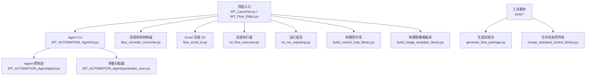
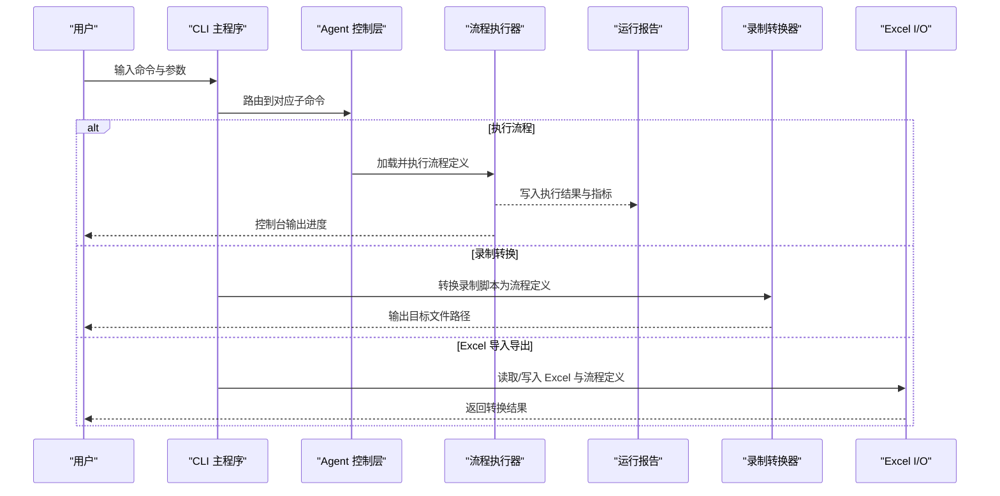
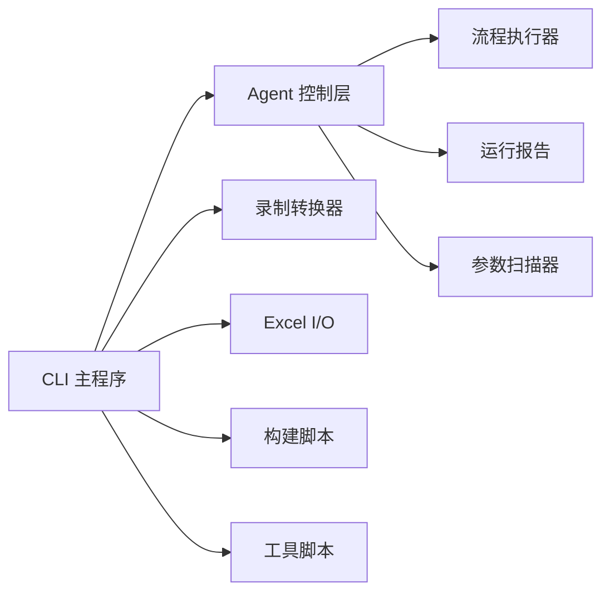

# 命令行接口

<cite>
**本文引用的文件**   
- [WT_Automation.robot](file://WT_Automation.robot)
- [WT_Flow_Editor.py](file://WT_Flow_Editor.py)
- [WT_Launcher.py](file://WT_Launcher.py)
- [cli.py](file://WT_AUTOMATION_Agent/cli.py)
- [agent.py](file://WT_AUTOMATION_Agent/agent.py)
- [parameter_scan.py](file://WT_AUTOMATION_Agent/parameter_scan.py)
- [flow_recorder_converter.py](file://flow_recorder_converter.py)
- [flow_excel_io.py](file://flow_excel_io.py)
- [wt_flow_executor.py](file://wt_flow_executor.py)
- [wt_run_reporting.py](file://wt_run_reporting.py)
- [build_control_map_library.py](file://build_control_map_library.py)
- [build_image_template_library.py](file://build_image_template_library.py)
- [generate_flow_package.py](file://tools/generate_flow_package.py)
- [merge_standard_control_library.py](file://tools/merge_standard_control_library.py)
- [PROJECT_ARCHITECTURE.md](file://PROJECT_ARCHITECTURE.md)
</cite>

## 目录
1. [简介](#简介)
2. [项目结构](#项目结构)
3. [核心组件](#核心组件)
4. [架构总览](#架构总览)
5. [详细组件分析](#详细组件分析)
6. [依赖关系分析](#依赖关系分析)
7. [性能与稳定性建议](#性能与稳定性建议)
8. [故障排查指南](#故障排查指南)
9. [结论](#结论)
10. [附录：常用命令组合与场景示例](#附录常用命令组合与场景示例)

## 简介
本文件面向使用 WT 自动化框架的工程师与运维人员，系统性介绍命令行接口（CLI）的设计与使用方法。内容覆盖：
- 所有可用的命令行参数、选项与子命令
- 通过 CLI 执行自动化任务、管理流程与监控系统状态
- 批处理模式与脚本化操作
- 常用命令组合与实际使用场景
- 错误处理与日志输出格式
- 与其他工具集成的方法与最佳实践

## 项目结构
仓库采用“顶层入口 + 领域模块”的组织方式：
- 顶层提供可执行的 Python 脚本与 Robot Framework 用例入口
- Agent 子包提供 CLI 主程序、Agent 控制逻辑、参数扫描等能力
- 工具目录提供辅助生成与合并脚本
- 资源与样本目录用于流程定义、模板与样例

图表来源
- [WT_Launcher.py](file://WT_Launcher.py)
- [WT_Flow_Editor.py](file://WT_Flow_Editor.py)
- [cli.py](file://WT_AUTOMATION_Agent/cli.py)
- [agent.py](file://WT_AUTOMATION_Agent/agent.py)
- [parameter_scan.py](file://WT_AUTOMATION_Agent/parameter_scan.py)
- [flow_recorder_converter.py](file://flow_recorder_converter.py)
- [flow_excel_io.py](file://flow_excel_io.py)
- [wt_flow_executor.py](file://wt_flow_executor.py)
- [wt_run_reporting.py](file://wt_run_reporting.py)
- [build_control_map_library.py](file://build_control_map_library.py)
- [build_image_template_library.py](file://build_image_template_library.py)
- [generate_flow_package.py](file://tools/generate_flow_package.py)
- [merge_standard_control_library.py](file://tools/merge_standard_control_library.py)

章节来源
- [PROJECT_ARCHITECTURE.md](file://PROJECT_ARCHITECTURE.md)

## 核心组件
- CLI 主程序：负责解析命令行参数、注册子命令、路由到具体功能模块
- Agent 控制层：封装对上层业务能力的调用，统一异常与日志
- 参数扫描器：支持批量参数组合执行，便于回归与对比
- 流程录制转换器：将录制脚本转换为可执行流程定义
- Excel 流程 I/O：在 Excel 与流程定义之间进行数据转换
- 流程执行器：加载并执行流程定义，驱动 UI 自动化
- 运行报告：汇总执行结果、指标与截图/日志
- 构建脚本：生成控件映射库与图像模板库，提升定位鲁棒性
- 工具脚本：生成流程包、合并标准控件库等

章节来源
- [cli.py](file://WT_AUTOMATION_Agent/cli.py)
- [agent.py](file://WT_AUTOMATION_Agent/agent.py)
- [parameter_scan.py](file://WT_AUTOMATION_Agent/parameter_scan.py)
- [flow_recorder_converter.py](file://flow_recorder_converter.py)
- [flow_excel_io.py](file://flow_excel_io.py)
- [wt_flow_executor.py](file://wt_flow_executor.py)
- [wt_run_reporting.py](file://wt_run_reporting.py)
- [build_control_map_library.py](file://build_control_map_library.py)
- [build_image_template_library.py](file://build_image_template_library.py)
- [generate_flow_package.py](file://tools/generate_flow_package.py)
- [merge_standard_control_library.py](file://tools/merge_standard_control_library.py)

## 架构总览
CLI 作为统一入口，将用户意图转化为内部工作流。典型调用链如下：

图表来源
- [cli.py](file://WT_AUTOMATION_Agent/cli.py)
- [agent.py](file://WT_AUTOMATION_Agent/agent.py)
- [wt_flow_executor.py](file://wt_flow_executor.py)
- [wt_run_reporting.py](file://wt_run_reporting.py)
- [flow_recorder_converter.py](file://flow_recorder_converter.py)
- [flow_excel_io.py](file://flow_excel_io.py)

## 详细组件分析

### CLI 主程序与子命令
- 职责
  - 解析全局参数与子命令
  - 注册并分发 run、convert、excel、scan、library、package、merge 等子命令
  - 统一日志初始化与退出码规范
- 关键设计点
  - 子命令模块化：每个子命令由独立函数或类实现，降低耦合
  - 参数校验：对必填项、类型与范围进行前置校验，失败即早返回
  - 日志与报告：所有子命令遵循统一的日志级别与输出路径约定
- 常见用法
  - 执行流程：run --flow <定义文件> [--env <环境>] [--report-dir <目录>]
  - 录制转换：convert --input <录制脚本> --output <流程定义>
  - Excel 导入导出：excel --mode import|export --src <源文件> --dst <目标文件>
  - 参数扫描：scan --flow <定义文件> --params <参数表> --parallel <并发数>
  - 构建控件库：library build --type control --input <源> --output <库>
  - 构建图像模板库：library build --type image --input <源> --output <库>
  - 生成流程包：package generate --flow <定义文件> --out <包目录>
  - 合并标准控件库：merge standard --in <库A> --in <库B> --out <合并库>

章节来源
- [cli.py](file://WT_AUTOMATION_Agent/cli.py)

### Agent 控制层
- 职责
  - 封装对执行器、报告器、扫描器等组件的调用
  - 统一异常捕获、重试策略与上下文传递
- 关键设计点
  - 上下文对象：携带配置、路径、环境变量、临时目录等
  - 生命周期钩子：开始/结束回调，便于埋点与清理
- 集成点
  - 与 CLI 子命令一一对应，提供一致的返回值与错误码

章节来源
- [agent.py](file://WT_AUTOMATION_Agent/agent.py)

### 参数扫描器
- 职责
  - 基于参数表生成多组参数组合，并行或串行执行流程
- 关键设计点
  - 参数插值：支持占位符替换与默认值回退
  - 并发控制：线程/进程池限制，避免资源争用
  - 结果聚合：按组合维度汇总成功/失败与耗时
- 典型用法
  - scan --flow <定义文件> --params <参数表.csv> --parallel 4

章节来源
- [parameter_scan.py](file://WT_AUTOMATION_Agent/parameter_scan.py)

### 录制转换器
- 职责
  - 将录制脚本转换为标准化的流程定义
- 关键设计点
  - 步骤规范化：去重、合并相邻同类步骤
  - 定位器增强：自动注入相对窗口、区域偏移等元信息
- 典型用法
  - convert --input <录制脚本> --output <流程定义>

章节来源
- [flow_recorder_converter.py](file://flow_recorder_converter.py)

### Excel 流程 I/O
- 职责
  - 在 Excel 表格与流程定义之间双向转换
- 关键设计点
  - 字段映射：列名与流程字段一一映射，支持别名
  - 批量处理：支持多工作表与分页读取
- 典型用法
  - excel --mode import --src <Excel> --dst <流程定义>
  - excel --mode export --src <流程定义> --dst <Excel>

章节来源
- [flow_excel_io.py](file://flow_excel_io.py)

### 流程执行器
- 职责
  - 加载流程定义，驱动 UI 自动化执行
- 关键设计点
  - 容错与重试：针对 UI 不稳定元素进行自适应重试
  - 断言与验证：内置断言点，失败时快速失败并记录快照
- 典型用法
  - run --flow <定义文件> [--env <环境>] [--report-dir <目录>]

章节来源
- [wt_flow_executor.py](file://wt_flow_executor.py)

### 运行报告
- 职责
  - 汇总执行结果、指标、截图与日志
- 关键设计点
  - 结构化输出：JSON/HTML 双格式
  - 增量更新：支持追加写入与历史对比
- 典型用法
  - 在执行参数中指定 report-dir，自动生成报告

章节来源
- [wt_run_reporting.py](file://wt_run_reporting.py)

### 构建脚本与工具
- 构建控件库
  - library build --type control --input <源> --output <库>
- 构建图像模板库
  - library build --type image --input <源> --output <库>
- 生成流程包
  - package generate --flow <定义文件> --out <包目录>
- 合并标准控件库
  - merge standard --in <库A> --in <库B> --out <合并库>

章节来源
- [build_control_map_library.py](file://build_control_map_library.py)
- [build_image_template_library.py](file://build_image_template_library.py)
- [generate_flow_package.py](file://tools/generate_flow_package.py)
- [merge_standard_control_library.py](file://tools/merge_standard_control_library.py)

### Robot Framework 集成
- 作用
  - 通过 Robot 用例编排 CLI 子命令，形成端到端测试套件
- 典型用法
  - 在 .robot 文件中调用系统命令执行 CLI，断言退出码与报告存在

章节来源
- [WT_Automation.robot](file://WT_Automation.robot)

## 依赖关系分析
- 组件内聚与耦合
  - CLI 仅负责参数解析与路由，业务逻辑下沉至 Agent 与各子模块
  - 执行器与报告器解耦，通过中间数据结构交换结果
- 外部依赖
  - UI 自动化后端（如 pywinauto）由执行器内部使用
  - Excel 读写依赖第三方库，I/O 模块负责适配
- 潜在循环依赖
  - 通过分层与接口隔离避免循环引用

图表来源
- [cli.py](file://WT_AUTOMATION_Agent/cli.py)
- [agent.py](file://WT_AUTOMATION_Agent/agent.py)
- [wt_flow_executor.py](file://wt_flow_executor.py)
- [wt_run_reporting.py](file://wt_run_reporting.py)
- [parameter_scan.py](file://WT_AUTOMATION_Agent/parameter_scan.py)
- [flow_recorder_converter.py](file://flow_recorder_converter.py)
- [flow_excel_io.py](file://flow_excel_io.py)
- [build_control_map_library.py](file://build_control_map_library.py)
- [build_image_template_library.py](file://build_image_template_library.py)
- [generate_flow_package.py](file://tools/generate_flow_package.py)
- [merge_standard_control_library.py](file://tools/merge_standard_control_library.py)

## 性能与稳定性建议
- 并发与资源
  - 合理设置扫描并发数，避免 UI 线程竞争
  - 对长耗时任务启用异步报告写入
- 定位与匹配
  - 优先使用控件映射库与图像模板库，减少纯坐标点击
  - 对动态元素采用相对定位与超时重试
- 日志与监控
  - 开启结构化日志，便于集中采集与分析
  - 关键节点埋点，统计成功率、P95/P99 耗时

[本节为通用指导，不直接分析具体文件]

## 故障排查指南
- 常见问题
  - 参数缺失或类型错误：检查必填项与取值范围
  - 流程定义无效：使用 validate 子命令或编辑器预检
  - UI 定位失败：更新控件库/图像模板库，调整等待与重试策略
  - 报告未生成：确认 report-dir 权限与磁盘空间
- 日志与退出码
  - 日志级别：DEBUG/INFO/WARNING/ERROR
  - 退出码：0 表示成功，非 0 表示失败；不同子命令可自定义细分码
- 快速定位
  - 结合报告中的截图与时间戳，回溯失败步骤
  - 使用最小复现用例隔离问题

章节来源
- [wt_run_reporting.py](file://wt_run_reporting.py)
- [cli.py](file://WT_AUTOMATION_Agent/cli.py)

## 结论
CLI 以“子命令 + 模块化”的方式组织，提供了从录制转换、流程执行、参数扫描到报告生成的完整闭环。通过构建控件与图像模板库，可显著提升 UI 自动化的稳定性与可维护性。配合 Robot Framework 与 CI/CD，可实现持续交付与质量门禁。

[本节为总结性内容，不直接分析具体文件]

## 附录：常用命令组合与场景示例
- 快速上手
  - 录制后转换：convert --input <录制脚本> --output <流程定义>
  - 执行并查看报告：run --flow <流程定义> --report-dir ./reports
- 批量回归
  - 参数扫描：scan --flow <流程定义> --params <参数表.csv> --parallel 4
  - 汇总报告：在扫描结束后合并各组合报告
- 数据驱动
  - Excel 导入：excel --mode import --src <Excel> --dst <流程定义>
  - Excel 导出：excel --mode export --src <流程定义> --dst <Excel>
- 工程化
  - 构建控件库：library build --type control --input <源> --output <库>
  - 构建图像模板库：library build --type image --input <源> --output <库>
  - 生成流程包：package generate --flow <流程定义> --out <包目录>
  - 合并标准控件库：merge standard --in <库A> --in <库B> --out <合并库>
- 与 CI/CD 集成
  - 在流水线中依次执行：convert -> build libraries -> run -> scan -> report
  - 将报告与产物归档，作为发布工件

[本节为概念性说明，不直接分析具体文件]