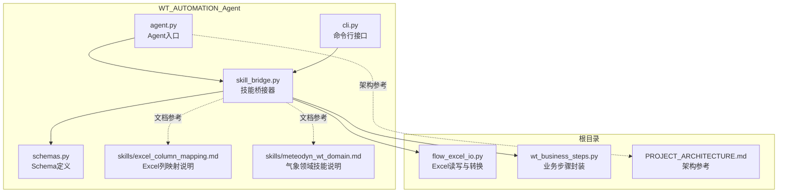
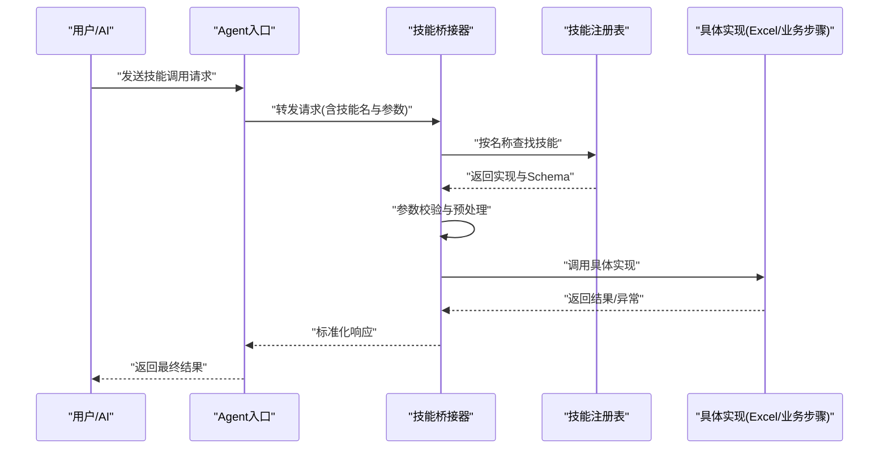
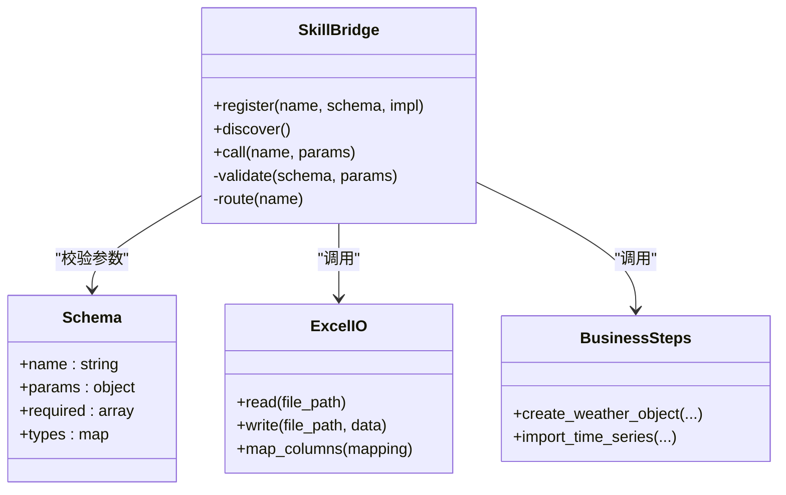
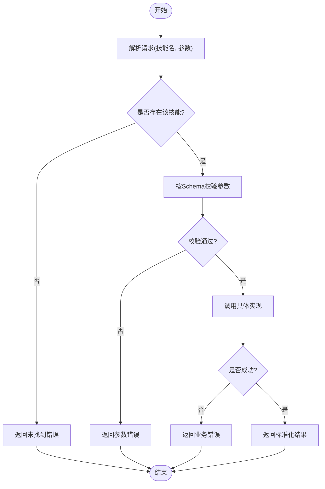
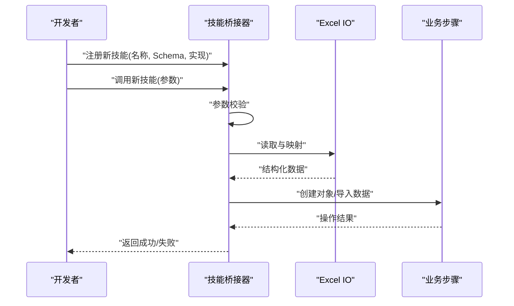
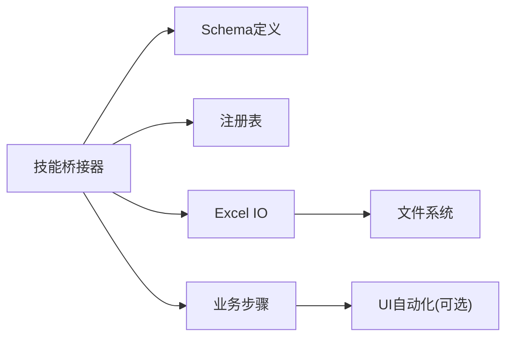

# 技能系统

<cite>
**本文引用的文件**   
- [skill_bridge.py](file://WT_AUTOMATION_Agent/skill_bridge.py)
- [agent.py](file://WT_AUTOMATION_Agent/agent.py)
- [cli.py](file://WT_AUTOMATION_Agent/cli.py)
- [schemas.py](file://WT_AUTOMATION_Agent/schemas.py)
- [excel_column_mapping.md](file://WT_AUTOMATION_Agent/skills/excel_column_mapping.md)
- [meteodyn_wt_domain.md](file://WT_AUTOMATION_Agent/skills/meteodyn_wt_domain.md)
- [flow_excel_io.py](file://flow_excel_io.py)
- [wt_business_steps.py](file://wt_business_steps.py)
- [PROJECT_ARCHITECTURE.md](file://PROJECT_ARCHITECTURE.md)
</cite>

## 目录
1. [简介](#简介)
2. [项目结构](#项目结构)
3. [核心组件](#核心组件)
4. [架构总览](#架构总览)
5. [详细组件分析](#详细组件分析)
6. [依赖关系分析](#依赖关系分析)
7. [性能考虑](#性能考虑)
8. [故障排查指南](#故障排查指南)
9. [结论](#结论)
10. [附录](#附录)

## 简介
本文件面向WT自动化框架的技能系统，聚焦以下目标：
- 解释技能桥接器的实现原理与职责边界，说明其如何连接AI模型与具体业务功能。
- 阐述技能的注册、发现与调用机制，包括配置驱动与运行时扩展点。
- 介绍内置技能的使用方法（如气象数据分析、Excel数据处理）。
- 提供自定义技能的开发流程与最佳实践。
- 给出技能配置文件的结构与参数定义。
- 通过实际示例展示如何创建新的业务技能并集成到系统中。

## 项目结构
围绕技能系统的核心代码与文档主要位于WT_AUTOMATION_Agent子包中，同时配套的业务执行与数据IO模块分布在仓库根目录。关键位置如下：
- 技能桥接器与Agent入口：WT_AUTOMATION_Agent/skill_bridge.py、WT_AUTOMATION_Agent/agent.py
- CLI与Schema：WT_AUTOMATION_Agent/cli.py、WT_AUTOMATION_Agent/schemas.py
- 内置技能说明文档：WT_AUTOMATION_Agent/skills/excel_column_mapping.md、WT_AUTOMATION_Agent/skills/meteodyn_wt_domain.md
- Excel数据处理能力：flow_excel_io.py
- 业务步骤封装：wt_business_steps.py
- 整体架构参考：PROJECT_ARCHITECTURE.md

图表来源
- [skill_bridge.py](file://WT_AUTOMATION_Agent/skill_bridge.py)
- [agent.py](file://WT_AUTOMATION_Agent/agent.py)
- [cli.py](file://WT_AUTOMATION_Agent/cli.py)
- [schemas.py](file://WT_AUTOMATION_Agent/schemas.py)
- [excel_column_mapping.md](file://WT_AUTOMATION_Agent/skills/excel_column_mapping.md)
- [meteodyn_wt_domain.md](file://WT_AUTOMATION_Agent/skills/meteodyn_wt_domain.md)
- [flow_excel_io.py](file://flow_excel_io.py)
- [wt_business_steps.py](file://wt_business_steps.py)
- [PROJECT_ARCHITECTURE.md](file://PROJECT_ARCHITECTURE.md)

章节来源
- [PROJECT_ARCHITECTURE.md](file://PROJECT_ARCHITECTURE.md)

## 核心组件
- 技能桥接器（Skill Bridge）
  - 职责：统一对外暴露“技能”的调用接口；负责解析技能描述、加载配置、路由到具体实现；管理输入输出校验与错误处理；与上层Agent或CLI交互。
  - 关键点：基于Schema进行参数校验；支持动态发现与注册；对底层业务函数或外部工具进行适配包装。
- Agent入口
  - 职责：作为AI侧的统一入口，接收自然语言或结构化指令，将其转换为技能调用请求，交由桥接器执行。
- CLI接口
  - 职责：提供命令行方式直接调用技能，便于测试与脚本化集成。
- Schema定义
  - 职责：集中定义技能元数据、参数类型、默认值、约束条件等，支撑注册与校验。
- 内置技能说明文档
  - 职责：为Excel列映射、气象领域等内置技能提供使用规范与字段约定。
- Excel数据处理能力
  - 职责：提供Excel读取、写入、列映射、格式转换等通用能力，供技能复用。
- 业务步骤封装
  - 职责：将复杂UI操作或领域逻辑封装为可复用的原子步骤，供技能组合调用。

章节来源
- [skill_bridge.py](file://WT_AUTOMATION_Agent/skill_bridge.py)
- [agent.py](file://WT_AUTOMATION_Agent/agent.py)
- [cli.py](file://WT_AUTOMATION_Agent/cli.py)
- [schemas.py](file://WT_AUTOMATION_Agent/schemas.py)
- [excel_column_mapping.md](file://WT_AUTOMATION_Agent/skills/excel_column_mapping.md)
- [meteodyn_wt_domain.md](file://WT_AUTOMATION_Agent/skills/meteodyn_wt_domain.md)
- [flow_excel_io.py](file://flow_excel_io.py)
- [wt_business_steps.py](file://wt_business_steps.py)

## 架构总览
技能系统采用“桥接器+注册表+Schema校验”的分层设计：
- AI/CLI层：通过Agent或CLI发起技能调用。
- 桥接层：解析请求、校验参数、选择实现、执行并返回结果。
- 业务层：Excel IO、业务步骤、领域逻辑等具体实现。
- 配置与文档：Schema与技能说明文档共同构成“声明式”配置。

图表来源
- [agent.py](file://WT_AUTOMATION_Agent/agent.py)
- [skill_bridge.py](file://WT_AUTOMATION_Agent/skill_bridge.py)
- [schemas.py](file://WT_AUTOMATION_Agent/schemas.py)
- [flow_excel_io.py](file://flow_excel_io.py)
- [wt_business_steps.py](file://wt_business_steps.py)

## 详细组件分析

### 技能桥接器（Skill Bridge）
- 设计要点
  - 注册与发现：维护一个以“技能名”为键的映射，支持在启动时扫描或显式注册。
  - 参数校验：依据Schema定义的字段、类型、必填项、枚举范围等进行校验，失败则快速返回错误信息。
  - 路由与执行：根据技能名选择对应实现，传入经校验的参数，捕获异常并转换为统一错误格式。
  - 扩展性：新增技能只需提供实现与Schema，并在注册表中登记即可被发现与调用。
- 典型流程
  - 接收请求 -> 解析技能名与参数 -> 查找Schema -> 校验 -> 调用实现 -> 返回结果或错误。

图表来源
- [skill_bridge.py](file://WT_AUTOMATION_Agent/skill_bridge.py)
- [schemas.py](file://WT_AUTOMATION_Agent/schemas.py)
- [flow_excel_io.py](file://flow_excel_io.py)
- [wt_business_steps.py](file://wt_business_steps.py)

章节来源
- [skill_bridge.py](file://WT_AUTOMATION_Agent/skill_bridge.py)
- [schemas.py](file://WT_AUTOMATION_Agent/schemas.py)

### 注册、发现与调用机制
- 注册
  - 通过桥接器提供的注册接口，将“技能名、Schema、实现函数/类方法”三者绑定。
  - 支持批量注册（例如从配置文件或插件目录扫描）。
- 发现
  - 启动阶段自动扫描已注册的实现，构建内部索引。
  - 也可按需延迟加载，减少启动开销。
- 调用
  - 由Agent或CLI发起，携带技能名与参数。
  - 桥接器完成校验后调用实现，并将结果标准化返回。

图表来源
- [skill_bridge.py](file://WT_AUTOMATION_Agent/skill_bridge.py)
- [schemas.py](file://WT_AUTOMATION_Agent/schemas.py)

章节来源
- [skill_bridge.py](file://WT_AUTOMATION_Agent/skill_bridge.py)
- [schemas.py](file://WT_AUTOMATION_Agent/schemas.py)

### 内置技能：Excel数据处理
- 能力概述
  - 读取Excel文件，支持多工作表与数据类型推断。
  - 写入Excel文件，支持追加与覆盖模式。
  - 列映射：将源列名映射为目标列名，支持缺失列处理与默认值填充。
- 使用建议
  - 明确输入输出路径与编码。
  - 使用列映射文档约定的字段名，避免后续清洗成本。
  - 大数据量场景下优先流式处理与分块写入。

章节来源
- [excel_column_mapping.md](file://WT_AUTOMATION_Agent/skills/excel_column_mapping.md)
- [flow_excel_io.py](file://flow_excel_io.py)

### 内置技能：气象数据分析（MeteoDyn WT领域）
- 能力概述
  - 针对风电场微尺度建模与风机类型管理的常用任务，提供数据导入、对象创建、曲线生成等能力。
  - 结合业务步骤封装，简化复杂UI操作的编排。
- 使用建议
  - 遵循领域文档中的字段约定与单位要求。
  - 对时间序列数据进行完整性检查后再入库。
  - 对大型数据集进行采样或降采样以提升性能。

章节来源
- [meteodyn_wt_domain.md](file://WT_AUTOMATION_Agent/skills/meteodyn_wt_domain.md)
- [wt_business_steps.py](file://wt_business_steps.py)

### 自定义技能开发流程与最佳实践
- 开发流程
  - 定义Schema：明确技能名、参数列表、类型、默认值、必填项与取值范围。
  - 编写实现：将业务逻辑封装为独立函数或类方法，保证幂等性与可重试性。
  - 注册技能：在桥接器中完成注册，确保名称唯一且与Schema一致。
  - 单元测试：覆盖正常路径、边界条件与异常分支。
  - 文档补充：更新技能说明文档，记录输入输出样例与注意事项。
- 最佳实践
  - 单一职责：每个技能只解决一个明确的业务问题。
  - 参数最小化：仅暴露必要参数，复杂对象通过配置引用。
  - 错误可观测：记录关键上下文信息，便于定位问题。
  - 幂等与回滚：对写操作提供幂等键或事务回滚策略。
  - 性能优化：缓存热点数据、批处理IO、异步执行耗时任务。

章节来源
- [skill_bridge.py](file://WT_AUTOMATION_Agent/skill_bridge.py)
- [schemas.py](file://WT_AUTOMATION_Agent/schemas.py)

### 技能配置文件结构与参数定义
- 配置目标
  - 以声明式方式描述技能元数据与默认参数，便于管理与版本控制。
- 关键字段（建议）
  - name：技能唯一标识
  - description：简要说明
  - version：版本号
  - params：参数定义数组，包含字段名、类型、默认值、是否必填、取值范围或枚举
  - tags：标签集合，用于分类与检索
  - examples：示例调用片段（可选）
- 校验规则
  - 类型匹配：字符串、数值、布尔、数组、对象等
  - 必填校验：缺少必填参数时报错
  - 范围校验：数值上下界、枚举白名单
  - 格式校验：日期、邮箱、正则表达式等

章节来源
- [schemas.py](file://WT_AUTOMATION_Agent/schemas.py)

### 实际示例：创建新业务技能并集成
- 场景：新增“批量导入测风塔与机位点”技能
- 步骤
  - 定义Schema：包含文件路径、坐标系、时间范围等参数。
  - 实现逻辑：读取Excel -> 列映射 -> 数据清洗 -> 调用业务步骤创建对象。
  - 注册技能：在桥接器中登记，指定名称与实现。
  - 测试验证：构造不同规模与异常用例，确保稳定。
  - 文档完善：更新领域文档，补充字段说明与样例。
- 流程图

图表来源
- [skill_bridge.py](file://WT_AUTOMATION_Agent/skill_bridge.py)
- [flow_excel_io.py](file://flow_excel_io.py)
- [wt_business_steps.py](file://wt_business_steps.py)

章节来源
- [skill_bridge.py](file://WT_AUTOMATION_Agent/skill_bridge.py)
- [flow_excel_io.py](file://flow_excel_io.py)
- [wt_business_steps.py](file://wt_business_steps.py)

## 依赖关系分析
- 组件耦合
  - 桥接器对Schema与注册表强依赖，对具体实现弱依赖（通过名称路由）。
  - Excel IO与业务步骤作为下游能力，被桥接器按需调用。
- 外部依赖
  - Excel处理库、UI自动化库（若涉及）、日志与配置库等。
- 潜在循环依赖
  - 应避免桥接器反向依赖具体实现，保持单向调用。

图表来源
- [skill_bridge.py](file://WT_AUTOMATION_Agent/skill_bridge.py)
- [schemas.py](file://WT_AUTOMATION_Agent/schemas.py)
- [flow_excel_io.py](file://flow_excel_io.py)
- [wt_business_steps.py](file://wt_business_steps.py)

章节来源
- [skill_bridge.py](file://WT_AUTOMATION_Agent/skill_bridge.py)
- [schemas.py](file://WT_AUTOMATION_Agent/schemas.py)
- [flow_excel_io.py](file://flow_excel_io.py)
- [wt_business_steps.py](file://wt_business_steps.py)

## 性能考虑
- 参数校验前置：尽早失败，减少无效调用。
- 批量与分页：对大文件与大数据集采用分批处理。
- 缓存与去重：对重复计算或IO结果进行缓存，设置合理过期策略。
- 异步与并发：对耗时任务采用线程池或协程，注意资源竞争与一致性。
- 日志与监控：记录关键指标（耗时、错误率、吞吐），便于容量规划与调优。

[本节为通用指导，不直接分析具体文件]

## 故障排查指南
- 常见问题
  - 技能未找到：检查注册表是否正确登记，名称是否一致。
  - 参数校验失败：核对Schema定义与实际传参的类型与必填项。
  - Excel读取失败：确认文件路径、权限、编码与工作表名称。
  - 业务步骤异常：查看上游数据质量与业务约束是否满足。
- 定位手段
  - 启用详细日志，记录入参、出参与关键中间状态。
  - 使用最小可复现用例隔离问题。
  - 对IO与网络操作增加超时与重试策略。

章节来源
- [skill_bridge.py](file://WT_AUTOMATION_Agent/skill_bridge.py)
- [schemas.py](file://WT_AUTOMATION_Agent/schemas.py)
- [flow_excel_io.py](file://flow_excel_io.py)
- [wt_business_steps.py](file://wt_business_steps.py)

## 结论
技能系统通过桥接器实现了AI与业务能力的解耦与统一接入，配合Schema驱动的注册与校验机制，具备良好的可扩展性与可维护性。内置技能覆盖了Excel数据处理与气象领域常见任务，开发者可按既定流程快速扩展新技能，并通过配置与文档提升协作效率。

[本节为总结性内容，不直接分析具体文件]

## 附录
- 术语
  - 技能：可被AI或CLI调用的业务单元，具备明确输入输出与行为契约。
  - 桥接器：连接上层调用与下层实现的适配层。
  - Schema：描述技能元数据与参数的声明式定义。
- 参考
  - 项目架构总览请参考架构文档。

章节来源
- [PROJECT_ARCHITECTURE.md](file://PROJECT_ARCHITECTURE.md)