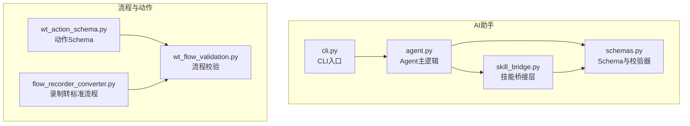
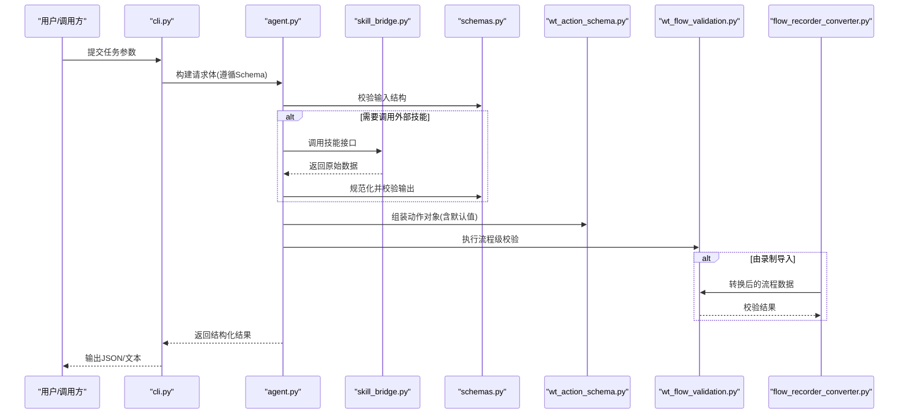
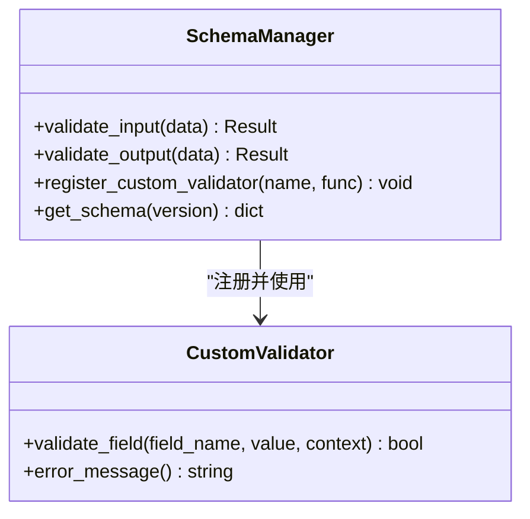
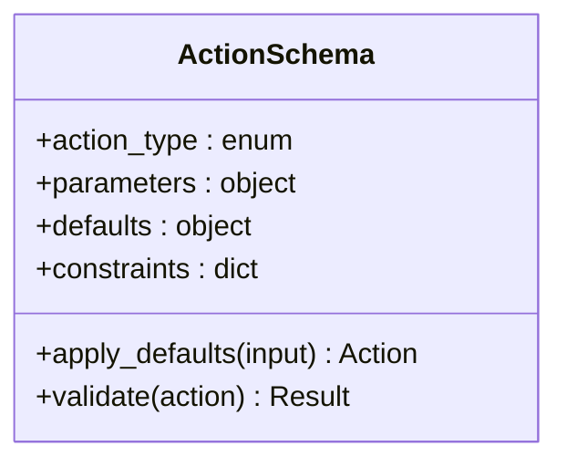
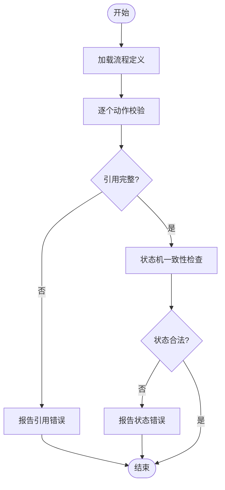
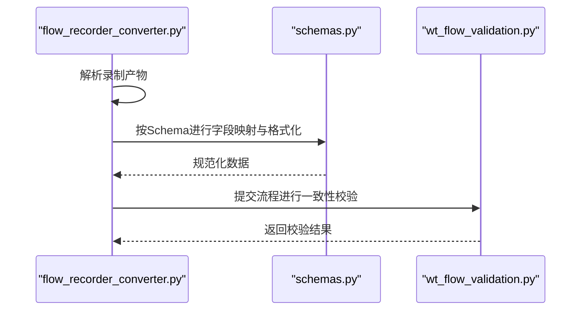
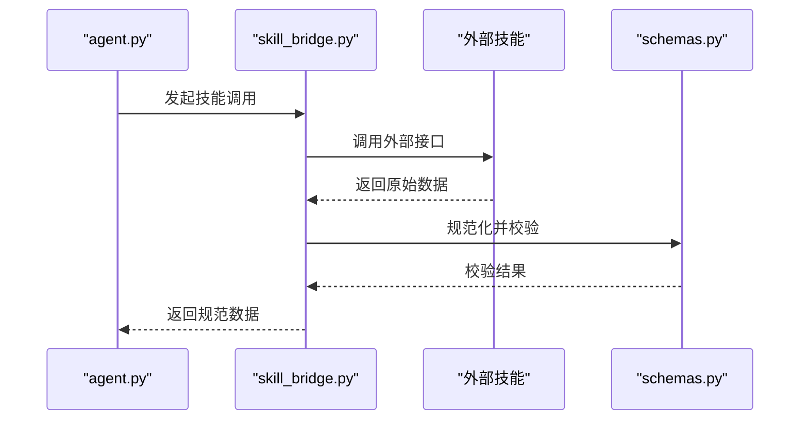
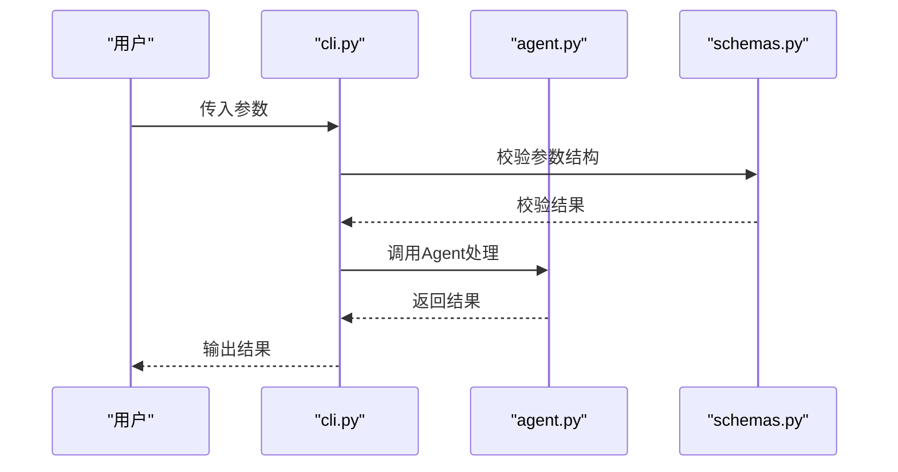
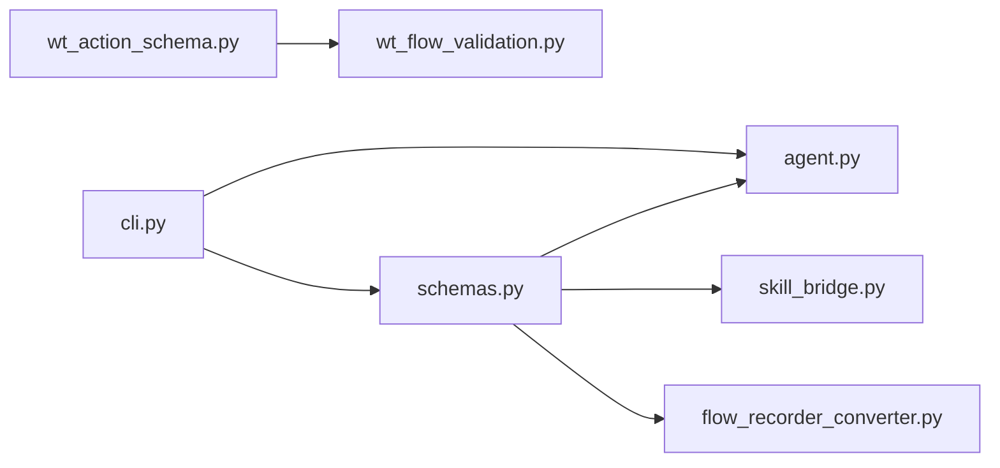

# 数据模式定义

<cite>
**本文引用的文件**   
- [schemas.py](file://WT_AUTOMATION_Agent/schemas.py)
- [agent.py](file://WT_AUTOMATION_Agent/agent.py)
- [skill_bridge.py](file://WT_AUTOMATION_Agent/skill_bridge.py)
- [cli.py](file://WT_AUTOMATION_Agent/cli.py)
- [wt_action_schema.py](file://wt_action_schema.py)
- [wt_flow_validation.py](file://wt_flow_validation.py)
- [flow_recorder_converter.py](file://flow_recorder_converter.py)
- [test_wt_action_validation.py](file://tests/test_wt_action_validation.py)
</cite>

## 目录
1. [简介](#简介)
2. [项目结构](#项目结构)
3. [核心组件](#核心组件)
4. [架构总览](#架构总览)
5. [详细组件分析](#详细组件分析)
6. [依赖关系分析](#依赖关系分析)
7. [性能考虑](#性能考虑)
8. [故障诊断指南](#故障诊断指南)
9. [结论](#结论)
10. [附录](#附录)

## 简介
本文件聚焦于WT自动化框架中AI辅助系统的数据模式定义与验证机制，覆盖以下主题：
- JSON Schema在Agent输入输出数据校验中的应用
- 自定义验证规则的实现方式
- Agent输入输出数据结构与字段说明
- 数据转换与格式化处理流程
- 数据验证错误的诊断与修复建议
- 实际数据示例与验证规则配置方法
- 数据模式的版本管理与向后兼容性策略

## 项目结构
围绕数据模式与验证的相关代码主要分布在如下位置：
- WT_AUTOMATION_Agent/schemas.py：集中定义JSON Schema、字段约束与校验器
- WT_AUTOMATION_Agent/agent.py：Agent主逻辑，负责接收用户意图、调用工具并生成结构化输出
- WT_AUTOMATION_Agent/skill_bridge.py：技能桥接层，对工具返回数据进行规范化与再校验
- WT_AUTOMATION_Agent/cli.py：命令行入口，负责参数解析与结果序列化
- wt_action_schema.py：动作（Action）层面的Schema定义与默认值
- wt_flow_validation.py：流程级校验逻辑，串联多步数据的完整性与一致性检查
- flow_recorder_converter.py：录制脚本到标准化流程的转换器，包含数据格式转换
- tests/test_wt_action_validation.py：针对动作校验的单元测试，体现错误场景与断言

图表来源
- [agent.py](file://WT_AUTOMATION_Agent/agent.py)
- [schemas.py](file://WT_AUTOMATION_Agent/schemas.py)
- [skill_bridge.py](file://WT_AUTOMATION_Agent/skill_bridge.py)
- [cli.py](file://WT_AUTOMATION_Agent/cli.py)
- [wt_action_schema.py](file://wt_action_schema.py)
- [wt_flow_validation.py](file://wt_flow_validation.py)
- [flow_recorder_converter.py](file://flow_recorder_converter.py)

章节来源
- [schemas.py](file://WT_AUTOMATION_Agent/schemas.py)
- [agent.py](file://WT_AUTOMATION_Agent/agent.py)
- [skill_bridge.py](file://WT_AUTOMATION_Agent/skill_bridge.py)
- [cli.py](file://WT_AUTOMATION_Agent/cli.py)
- [wt_action_schema.py](file://wt_action_schema.py)
- [wt_flow_validation.py](file://wt_flow_validation.py)
- [flow_recorder_converter.py](file://flow_recorder_converter.py)

## 核心组件
- 数据模式定义（schemas.py）
  - 使用JSON Schema描述Agent输入、输出及中间结构的字段类型、必填项、枚举范围等约束
  - 提供可复用的校验函数，支持对复杂嵌套对象进行逐层校验
- 动作Schema（wt_action_schema.py）
  - 定义“动作”级别的数据模型，包括动作类型、参数、默认值与业务约束
- 流程校验（wt_flow_validation.py）
  - 将多个动作组合为流程后，执行跨步骤的一致性校验（如引用完整性、状态机流转）
- 录制转换器（flow_recorder_converter.py）
  - 将录制产物转换为标准流程结构，并在转换过程中应用Schema进行二次校验
- 技能桥接（skill_bridge.py）
  - 对第三方工具或技能的原始返回进行规范化，确保符合内部Schema
- CLI入口（cli.py）
  - 负责从命令行读取参数、构造请求体、触发Agent处理并输出结构化结果

章节来源
- [schemas.py](file://WT_AUTOMATION_Agent/schemas.py)
- [wt_action_schema.py](file://wt_action_schema.py)
- [wt_flow_validation.py](file://wt_flow_validation.py)
- [flow_recorder_converter.py](file://flow_recorder_converter.py)
- [skill_bridge.py](file://WT_AUTOMATION_Agent/skill_bridge.py)
- [cli.py](file://WT_AUTOMATION_Agent/cli.py)

## 架构总览
下图展示了从用户输入到最终输出的端到端数据流，以及各阶段的模式校验点。

图表来源
- [cli.py](file://WT_AUTOMATION_Agent/cli.py)
- [agent.py](file://WT_AUTOMATION_Agent/agent.py)
- [skill_bridge.py](file://WT_AUTOMATION_Agent/skill_bridge.py)
- [schemas.py](file://WT_AUTOMATION_Agent/schemas.py)
- [wt_action_schema.py](file://wt_action_schema.py)
- [wt_flow_validation.py](file://wt_flow_validation.py)
- [flow_recorder_converter.py](file://flow_recorder_converter.py)

## 详细组件分析

### 组件A：数据模式与校验器（schemas.py）
- 职责
  - 定义Agent输入、输出、中间态的JSON Schema
  - 提供统一的校验入口，支持自定义验证规则扩展
- 关键设计
  - 字段类型与约束：字符串、数字、布尔、数组、对象、枚举、正则表达式等
  - 必填项与可选项：通过required与default区分
  - 嵌套对象：子对象的schema复用与组合
  - 自定义验证：在schema之外附加校验函数，用于业务规则（如数值区间、时间格式、跨字段依赖）
- 典型用法
  - 在Agent入口处对输入进行快速失败式校验
  - 在技能桥接层对返回数据进行规范化后再校验
  - 在CLI输出前对最终结果进行最终一致性校验

图表来源
- [schemas.py](file://WT_AUTOMATION_Agent/schemas.py)

章节来源
- [schemas.py](file://WT_AUTOMATION_Agent/schemas.py)

### 组件B：动作Schema与默认值（wt_action_schema.py）
- 职责
  - 定义动作（Action）的结构化模型，包括动作类型、参数集合、默认值与业务约束
- 关键设计
  - 动作类型枚举：限定合法的动作类别
  - 参数映射：将高层语义参数映射到底层实现所需字段
  - 默认值注入：缺失字段时自动填充默认值，保证下游执行稳定性
- 与校验的关系
  - 动作Schema作为流程校验的基础单元，被流程校验器聚合使用

图表来源
- [wt_action_schema.py](file://wt_action_schema.py)

章节来源
- [wt_action_schema.py](file://wt_action_schema.py)

### 组件C：流程校验（wt_flow_validation.py）
- 职责
  - 对由多个动作组成的流程进行整体校验，包括顺序依赖、状态机流转、资源引用完整性
- 关键设计
  - 步骤间引用检查：确保上游输出被下游正确消费
  - 状态一致性：根据动作类型推断状态变化，避免非法跳转
  - 批量校验：对大规模流程进行高效校验，减少重复计算
- 与录制转换器的协作
  - 录制转换器产出标准流程后，交由流程校验器进行最终一致性检查

图表来源
- [wt_flow_validation.py](file://wt_flow_validation.py)

章节来源
- [wt_flow_validation.py](file://wt_flow_validation.py)

### 组件D：录制转换器（flow_recorder_converter.py）
- 职责
  - 将录制脚本或录制产物转换为标准流程结构
- 关键设计
  - 字段映射：将录制字段映射为标准Schema字段
  - 格式转换：时间戳、路径、坐标等格式的规范化
  - 二次校验：转换完成后再次调用校验器，确保输出符合目标Schema
- 与流程校验的关系
  - 转换后的流程进入流程校验阶段，保障端到端一致性

图表来源
- [flow_recorder_converter.py](file://flow_recorder_converter.py)
- [schemas.py](file://WT_AUTOMATION_Agent/schemas.py)
- [wt_flow_validation.py](file://wt_flow_validation.py)

章节来源
- [flow_recorder_converter.py](file://flow_recorder_converter.py)

### 组件E：技能桥接层（skill_bridge.py）
- 职责
  - 封装对外部技能或工具的调用，并对返回数据进行规范化与校验
- 关键设计
  - 适配器模式：统一不同技能的返回格式
  - 容错处理：对异常返回进行降级或重试
  - 校验前置：在返回给上层之前完成Schema校验，避免脏数据传播
- 与Agent的协作
  - Agent在需要外部能力时调用技能桥接层，获取规范化后的数据

图表来源
- [skill_bridge.py](file://WT_AUTOMATION_Agent/skill_bridge.py)
- [agent.py](file://WT_AUTOMATION_Agent/agent.py)
- [schemas.py](file://WT_AUTOMATION_Agent/schemas.py)

章节来源
- [skill_bridge.py](file://WT_AUTOMATION_Agent/skill_bridge.py)

### 组件F：CLI入口（cli.py）
- 职责
  - 解析命令行参数，构造请求体，触发Agent处理，输出结构化结果
- 关键设计
  - 参数校验：在进入Agent前进行基础校验
  - 输出格式化：将结果序列化为JSON或人类可读文本
  - 错误上报：捕获并展示校验错误信息，便于定位问题

图表来源
- [cli.py](file://WT_AUTOMATION_Agent/cli.py)
- [agent.py](file://WT_AUTOMATION_Agent/agent.py)
- [schemas.py](file://WT_AUTOMATION_Agent/schemas.py)

章节来源
- [cli.py](file://WT_AUTOMATION_Agent/cli.py)

## 依赖关系分析
- 模块耦合
  - schemas.py为核心依赖，被agent.py、skill_bridge.py、flow_recorder_converter.py广泛使用
  - wt_action_schema.py为流程校验的基础单元，被wt_flow_validation.py聚合
  - cli.py作为入口，依赖agent.py与schemas.py
- 潜在循环依赖
  - 当前分层清晰，未见直接循环依赖；建议在新增校验规则时保持单向依赖
- 外部依赖
  - JSON Schema库用于模式校验
  - 第三方技能接口通过skill_bridge.py适配

图表来源
- [schemas.py](file://WT_AUTOMATION_Agent/schemas.py)
- [agent.py](file://WT_AUTOMATION_Agent/agent.py)
- [skill_bridge.py](file://WT_AUTOMATION_Agent/skill_bridge.py)
- [flow_recorder_converter.py](file://flow_recorder_converter.py)
- [wt_action_schema.py](file://wt_action_schema.py)
- [wt_flow_validation.py](file://wt_flow_validation.py)
- [cli.py](file://WT_AUTOMATION_Agent/cli.py)

章节来源
- [schemas.py](file://WT_AUTOMATION_Agent/schemas.py)
- [agent.py](file://WT_AUTOMATION_Agent/agent.py)
- [skill_bridge.py](file://WT_AUTOMATION_Agent/skill_bridge.py)
- [flow_recorder_converter.py](file://flow_recorder_converter.py)
- [wt_action_schema.py](file://wt_action_schema.py)
- [wt_flow_validation.py](file://wt_flow_validation.py)
- [cli.py](file://WT_AUTOMATION_Agent/cli.py)

## 性能考虑
- 校验开销控制
  - 对大型流程采用分块校验与缓存策略，减少重复计算
  - 在录制转换器中尽量早地进行字段裁剪，降低后续校验负担
- 并发与异步
  - 对于独立动作的校验可考虑并行执行，但需保证共享状态的安全访问
- 内存占用
  - 避免在Schema中保留不必要的元数据，按需加载与释放

[本节为通用指导，不直接分析具体文件]

## 故障诊断指南
- 常见错误类型
  - 字段缺失或类型不符：检查必填项与类型约束
  - 枚举值非法：核对允许的值列表
  - 跨字段依赖不满足：查看自定义验证规则的错误消息
  - 引用不完整：确认上游动作的输出是否被下游正确消费
- 定位方法
  - 启用详细日志，记录每个校验阶段的输入与输出
  - 使用单元测试用例（如测试动作校验）复现问题，缩小范围
- 修复建议
  - 修正输入数据以匹配Schema
  - 调整默认值或约束条件，确保业务合理性
  - 在技能桥接层增加容错与降级逻辑，提升鲁棒性

章节来源
- [test_wt_action_validation.py](file://tests/test_wt_action_validation.py)

## 结论
WT自动化框架的AI辅助系统在数据模式与验证方面形成了清晰的层次化设计：
- 以JSON Schema为核心的模式定义，贯穿输入、输出与中间态
- 通过自定义验证规则实现灵活的业务约束
- 借助技能桥接层与录制转换器，确保外部数据与历史录制的兼容性与一致性
- 流程校验保障多步骤组合的正确性与健壮性
- CLI入口提供友好的交互与错误反馈

[本节为总结性内容，不直接分析具体文件]

## 附录

### 数据示例与验证规则配置方法
- 输入示例要点
  - 包含所有必填字段，类型与取值范围符合Schema
  - 若存在跨字段依赖，需同时满足自定义验证规则
- 输出示例要点
  - 结构化字段完整，枚举值合法
  - 时间戳、路径等格式经过规范化
- 配置方法
  - 在Schema文件中添加新字段与约束
  - 注册新的自定义验证器，并在相关校验入口启用
  - 更新动作Schema与流程校验逻辑，确保端到端一致

[本节为概念性说明，不直接分析具体文件]

### 数据模式的版本管理与向后兼容性策略
- 版本标识
  - 在Schema顶层引入version字段，明确模式版本
- 向后兼容
  - 新增字段设为可选并提供默认值
  - 废弃字段保留一段时间并给出迁移提示
- 迁移策略
  - 提供迁移脚本，将旧版数据转换为新版Schema
  - 在录制转换器中增加版本检测与自动升级逻辑

[本节为概念性说明，不直接分析具体文件]