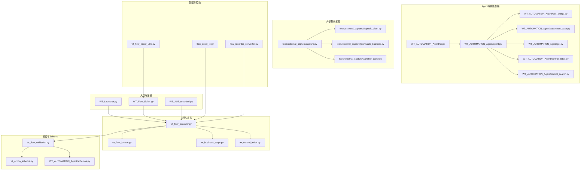
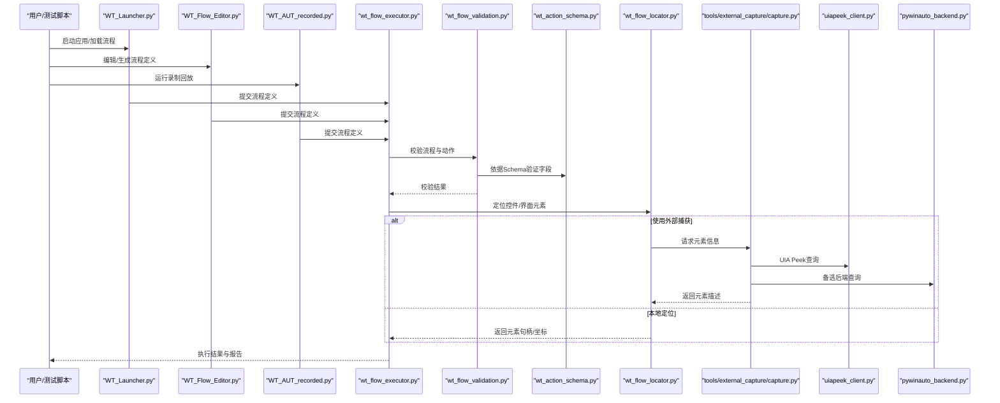
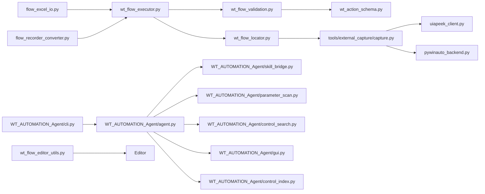

# API参考文档

<cite>
**本文档引用的文件**   
- [WT_AUT_recorded.py](file://WT_AUT_recorded.py)
- [WT_Flow_Editor.py](file://WT_Flow_Editor.py)
- [WT_Launcher.py](file://WT_Launcher.py)
- [wt_flow_executor.py](file://wt_flow_executor.py)
- [wt_flow_locator.py](file://wt_flow_locator.py)
- [wt_flow_validation.py](file://wt_flow_validation.py)
- [wt_action_schema.py](file://wt_action_schema.py)
- [schemas.py](file://WT_AUTOMATION_Agent/schemas.py)
- [cli.py](file://WT_AUTOMATION_Agent/cli.py)
- [agent.py](file://WT_AUTOMATION_Agent/agent.py)
- [skill_bridge.py](file://WT_AUTOMATION_Agent/skill_bridge.py)
- [capture.py](file://tools/external_capture/capture.py)
- [uiapeek_client.py](file://tools/external_capture/uiapeek_client.py)
- [pywinauto_backend.py](file://tools/external_capture/pywinauto_backend.py)
- [launcher_panel.py](file://tools/external_capture/launcher_panel.py)
- [flow_excel_io.py](file://flow_excel_io.py)
- [flow_recorder_converter.py](file://flow_recorder_converter.py)
- [wt_business_steps.py](file://wt_business_steps.py)
- [wt_control_index.py](file://wt_control_index.py)
- [control_index.py](file://WT_AUTOMATION_Agent/control_index.py)
- [parameter_scan.py](file://WT_AUTOMATION_Agent/parameter_scan.py)
- [gui.py](file://WT_AUTOMATION_Agent/gui.py)
- [control_search.py](file://WT_AUTOMATION_Agent/control_search.py)
- [wt_flow_editor_utils.py](file://wt_flow_editor_utils.py)
</cite>

## 更新摘要
**变更内容**   
- 新增Agent参数扫描API完整文档，支持Excel/CSV参数表读取和批量流程生成
- 增强控制搜索API，提供语义化控件检索和树结构索引功能
- 扩展流程编辑器工具接口，包含新的控件标准化和解析方法
- 更新CLI命令行接口，增加参数扫描和控制搜索相关命令
- 完善外部捕获桥接API的集成说明

## 目录
1. [简介](#简介)
2. [项目结构](#项目结构)
3. [核心组件](#核心组件)
4. [架构总览](#架构总览)
5. [详细组件分析](#详细组件分析)
6. [依赖关系分析](#依赖关系分析)
7. [性能考虑](#性能考虑)
8. [故障排查指南](#故障排查指南)
9. [结论](#结论)
10. [附录](#附录)

## 简介
本文件为WT自动化框架的完整API参考，覆盖Python API、CLI命令行接口、外部捕获桥接集成、JSON Schema与数据模型规范、错误码与处理策略、性能基准与限制、第三方集成最佳实践与安全注意事项。读者可据此快速上手并安全扩展框架能力。

**最新更新**：新增了强大的参数扫描API、智能控制搜索功能和增强的流程编辑器工具，为用户提供更高效的自动化构建体验。

## 项目结构
WT自动化框架采用分层与模块化组织：
- 顶层入口与编排：启动器、流程编辑器、录制回放主程序
- 执行与定位：流程执行器、控件定位器、业务步骤封装
- 校验与Schema：动作Schema定义、流程校验
- Agent与技能桥接：Agent CLI、GUI、参数扫描、技能桥接、控制搜索
- 外部捕获桥接：UIA Peek客户端、PyWinauto后端、捕获工具与面板
- Excel/Recorder转换：Excel导入导出、录制脚本转换
- 控制索引与库：控件索引构建与管理、流程编辑器工具



**图表来源**
- [WT_Launcher.py](file://WT_Launcher.py)
- [WT_Flow_Editor.py](file://WT_Flow_Editor.py)
- [WT_AUT_recorded.py](file://WT_AUT_recorded.py)
- [wt_flow_executor.py](file://wt_flow_executor.py)
- [wt_flow_locator.py](file://wt_flow_locator.py)
- [wt_business_steps.py](file://wt_business_steps.py)
- [wt_control_index.py](file://wt_control_index.py)
- [wt_flow_validation.py](file://wt_flow_validation.py)
- [wt_action_schema.py](file://wt_action_schema.py)
- [schemas.py](file://WT_AUTOMATION_Agent/schemas.py)
- [cli.py](file://WT_AUTOMATION_Agent/cli.py)
- [agent.py](file://WT_AUTOMATION_Agent/agent.py)
- [skill_bridge.py](file://WT_AUTOMATION_Agent/skill_bridge.py)
- [parameter_scan.py](file://WT_AUTOMATION_Agent/parameter_scan.py)
- [gui.py](file://WT_AUTOMATION_Agent/gui.py)
- [control_index.py](file://WT_AUTOMATION_Agent/control_index.py)
- [control_search.py](file://WT_AUTOMATION_Agent/control_search.py)
- [capture.py](file://tools/external_capture/capture.py)
- [uiapeek_client.py](file://tools/external_capture/uiapeek_client.py)
- [pywinauto_backend.py](file://tools/external_capture/pywinauto_backend.py)
- [launcher_panel.py](file://tools/external_capture/launcher_panel.py)
- [flow_excel_io.py](file://flow_excel_io.py)
- [flow_recorder_converter.py](file://flow_recorder_converter.py)
- [wt_flow_editor_utils.py](file://wt_flow_editor_utils.py)

## 核心组件
- 流程执行器：负责解析流程定义、调度动作、管理上下文与结果报告。
- 控件定位器：基于多种策略（UIA、图像、相对区域等）定位目标控件。
- 业务步骤封装：将常见操作抽象为高可用步骤，便于复用与组合。
- 校验与Schema：对动作与流程进行结构化校验，确保输入正确性与一致性。
- Agent与技能桥接：提供CLI/GUI交互、参数扫描、技能调用、索引管理与控制搜索。
- 外部捕获桥接：通过UIA Peek或PyWinauto后端实现跨进程UI元素捕获与操作。
- Excel/Recorder转换：支持从Excel导入导出流程，以及录制脚本到流程定义的转换。
- 流程编辑器工具：提供控件标准化、文本解析、文件名规范化等实用工具。

**章节来源**
- [wt_flow_executor.py](file://wt_flow_executor.py)
- [wt_flow_locator.py](file://wt_flow_locator.py)
- [wt_business_steps.py](file://wt_business_steps.py)
- [wt_flow_validation.py](file://wt_flow_validation.py)
- [wt_action_schema.py](file://wt_action_schema.py)
- [schemas.py](file://WT_AUTOMATION_Agent/schemas.py)
- [cli.py](file://WT_AUTOMATION_Agent/cli.py)
- [agent.py](file://WT_AUTOMATION_Agent/agent.py)
- [skill_bridge.py](file://WT_AUTOMATION_Agent/skill_bridge.py)
- [parameter_scan.py](file://WT_AUTOMATION_Agent/parameter_scan.py)
- [gui.py](file://WT_AUTOMATION_Agent/gui.py)
- [control_index.py](file://WT_AUTOMATION_Agent/control_index.py)
- [control_search.py](file://WT_AUTOMATION_Agent/control_search.py)
- [capture.py](file://tools/external_capture/capture.py)
- [uiapeek_client.py](file://tools/external_capture/uiapeek_client.py)
- [pywinauto_backend.py](file://tools/external_capture/pywinauto_backend.py)
- [flow_excel_io.py](file://flow_excel_io.py)
- [flow_recorder_converter.py](file://flow_recorder_converter.py)
- [wt_flow_editor_utils.py](file://wt_flow_editor_utils.py)

## 架构总览
下图展示从入口到执行、定位、校验、外部捕获与数据转换的整体交互。



**图表来源**
- [WT_Launcher.py](file://WT_Launcher.py)
- [WT_Flow_Editor.py](file://WT_Flow_Editor.py)
- [WT_AUT_recorded.py](file://WT_AUT_recorded.py)
- [wt_flow_executor.py](file://wt_flow_executor.py)
- [wt_flow_validation.py](file://wt_flow_validation.py)
- [wt_action_schema.py](file://wt_action_schema.py)
- [wt_flow_locator.py](file://wt_flow_locator.py)
- [capture.py](file://tools/external_capture/capture.py)
- [uiapeek_client.py](file://tools/external_capture/uiapeek_client.py)
- [pywinauto_backend.py](file://tools/external_capture/pywinauto_backend.py)

## 详细组件分析

### Python API：流程执行器
- 职责
  - 解析流程定义（步骤列表、动作、参数）
  - 驱动定位器获取控件
  - 执行动作并收集结果
  - 输出执行报告与状态
- 关键方法（示例路径）
  - 初始化与配置：[wt_flow_executor.py](file://wt_flow_executor.py)
  - 执行单个动作：[wt_flow_executor.py](file://wt_flow_executor.py)
  - 批量执行流程：[wt_flow_executor.py](file://wt_flow_executor.py)
  - 上下文管理与资源清理：[wt_flow_executor.py](file://wt_flow_executor.py)
- 返回值类型
  - 执行结果对象包含：状态码、消息、耗时、断言结果、日志摘要
- 错误处理
  - 定位失败、超时、权限不足、元素不可见等异常统一包装为执行错误
- 性能特性
  - 支持并发执行受控的步骤集；建议合理设置重试与等待策略

**章节来源**
- [wt_flow_executor.py](file://wt_flow_executor.py)

### Python API：控件定位器
- 职责
  - 基于UIA、图像模板、相对区域、窗口标题等多策略定位控件
- 关键方法（示例路径）
  - 按名称/类名/层级定位：[wt_flow_locator.py](file://wt_flow_locator.py)
  - 图像匹配定位：[wt_flow_locator.py](file://wt_flow_locator.py)
  - 相对区域偏移定位：[wt_flow_locator.py](file://wt_flow_locator.py)
  - 外部捕获桥接调用：[wt_flow_locator.py](file://wt_flow_locator.py)
- 返回值类型
  - 元素描述对象：包含句柄、边界矩形、文本、可见性、可交互性等属性
- 错误处理
  - 未找到元素、匹配度不足、多候选冲突时抛出明确异常并提供调试信息
- 性能特性
  - 缓存已识别元素；图像匹配支持多尺度加速

**章节来源**
- [wt_flow_locator.py](file://wt_flow_locator.py)

### Python API：业务步骤封装
- 职责
  - 将常用操作封装为高内聚步骤，如点击、输入、选择、截图、断言等
- 关键方法（示例路径）
  - 点击与双击：[wt_business_steps.py](file://wt_business_steps.py)
  - 文本输入与清空：[wt_business_steps.py](file://wt_business_steps.py)
  - 下拉选择与确认：[wt_business_steps.py](file://wt_business_steps.py)
  - 截图与对比：[wt_business_steps.py](file://wt_business_steps.py)
  - 条件判断与循环：[wt_business_steps.py](file://wt_business_steps.py)
- 返回值类型
  - 布尔值表示成功与否，附带诊断信息
- 错误处理
  - 针对元素不可用、输入非法、状态不一致等情况给出友好错误码与提示

**章节来源**
- [wt_business_steps.py](file://wt_business_steps.py)

### JSON Schema与数据模型
- 作用
  - 定义动作与流程的结构化约束，保证输入一致性与可校验性
- 关键文件
  - 动作Schema定义：[wt_action_schema.py](file://wt_action_schema.py)
  - 通用Schema集合：[schemas.py](file://WT_AUTOMATION_Agent/schemas.py)
- 模型要点
  - 动作类型枚举、必填字段、默认值、取值范围、依赖关系
  - 流程定义包含：元数据、步骤序列、全局变量、环境配置
- 版本兼容
  - Schema支持向后兼容字段；新增字段需标注可选与默认值

**章节来源**
- [wt_action_schema.py](file://wt_action_schema.py)
- [schemas.py](file://WT_AUTOMATION_Agent/schemas.py)

### CLI命令行接口
- 入口
  - CLI模块：[cli.py](file://WT_AUTOMATION_Agent/cli.py)
- 命令与选项（概览）
  - 启动Agent服务：用于接收指令并调度技能与参数扫描
  - 运行流程：指定流程定义路径、执行模式、输出报告位置
  - 生成/校验Schema：输出当前Schema或校验输入是否符合
  - 参数扫描：遍历参数空间并批量执行
  - 控制搜索：在控件库中语义检索真实存在的控件
  - GUI模式：启动图形界面进行可视化操作
- 典型用法（示例路径）
  - 启动Agent：[cli.py](file://WT_AUTOMATION_Agent/cli.py)
  - 执行流程：[cli.py](file://WT_AUTOMATION_Agent/cli.py)
  - 参数扫描：[cli.py](file://WT_AUTOMATION_Agent/cli.py)
  - 控制搜索：[cli.py](file://WT_AUTOMATION_Agent/cli.py)
  - 启动GUI：[cli.py](file://WT_AUTOMATION_Agent/cli.py)

**章节来源**
- [cli.py](file://WT_AUTOMATION_Agent/cli.py)

### Agent与技能桥接
- 职责
  - 提供Agent核心逻辑、技能桥接、参数扫描、GUI与控件索引管理、控制搜索
- 关键文件
  - Agent核心：[agent.py](file://WT_AUTOMATION_Agent/agent.py)
  - 技能桥接：[skill_bridge.py](file://WT_AUTOMATION_Agent/skill_bridge.py)
  - 参数扫描：[parameter_scan.py](file://WT_AUTOMATION_Agent/parameter_scan.py)
  - GUI：[gui.py](file://WT_AUTOMATION_Agent/gui.py)
  - 控件索引：[control_index.py](file://WT_AUTOMATION_Agent/control_index.py)
  - 控制搜索：[control_search.py](file://WT_AUTOMATION_Agent/control_search.py)
- 设计要点
  - 技能以插件形式注册，支持动态发现与调用
  - 参数扫描支持网格搜索与随机采样
  - GUI提供可视化流程编辑与实时反馈
  - 控制搜索支持自然语言查询和树结构导航

**章节来源**
- [agent.py](file://WT_AUTOMATION_Agent/agent.py)
- [skill_bridge.py](file://WT_AUTOMATION_Agent/skill_bridge.py)
- [parameter_scan.py](file://WT_AUTOMATION_Agent/parameter_scan.py)
- [gui.py](file://WT_AUTOMATION_Agent/gui.py)
- [control_index.py](file://WT_AUTOMATION_Agent/control_index.py)
- [control_search.py](file://WT_AUTOMATION_Agent/control_search.py)

### 新增：Agent参数扫描API
- 职责
  - 从Excel/CSV参数表生成参数化流程定义，支持多参数扫描
- 核心类与方法
  - `ParameterScanner`：参数扫描器主类
  - `read_excel()`：从Excel文件读取参数表
  - `read_csv()`：从CSV/TSV文件读取参数表
  - `scan()`：核心扫描函数，生成参数化流程
  - `scan_from_flow()`：从现有流程定义进行参数扫描
  - `analyze_step_excel()`：分析步骤Excel，发现可参数化字段
  - `export_param_template()`：生成参数模板Excel
  - `auto_scan_from_steps()`：一站式智能扫描
- 数据模型
  - `ParameterRow`：一行参数数据
  - `ScanConfig`：参数扫描配置
  - `ScanResult`：扫描结果
- 使用示例
  ```python
  from WT_AUTOMATION_Agent.parameter_scan import ParameterScanner
  
  # 基本参数扫描
  scanner = ParameterScanner()
  flow_def = scanner.scan(
      excel_path="params.xlsx",
      template_steps=base_steps,
      sheet_name="Sheet1",
      output_path="flow_scan_result.json"
  )
  
  # 智能扫描
  result = ParameterScanner.auto_scan_from_steps(
      step_excel_path="steps.xlsx",
      param_excel_path="params.xlsx",
      output_path="result.json"
  )
  ```

**章节来源**
- [parameter_scan.py](file://WT_AUTOMATION_Agent/parameter_scan.py)

### 新增：控制搜索增强API
- 职责
  - 在控件库中进行语义检索，支持自然语言查询和树结构导航
- 核心功能
  - `find_controls()`：按自然语言查询检索控件
  - `find_within()`：在指定祖先子树内检索控件
  - `resolve_control()`：按control_id精确反查控件
  - `best_control_for_step()`：为生成的步骤找到最匹配的真实控件
  - `tree_summary()`：返回应用的层级结构大纲
  - `stats()`：返回控件库规模统计
- 评分机制
  - 支持targetValue、automationId、labelText、optionValues等多字段匹配
  - 动作↔控件类型对标加权
  - 质量分级和出现次数作为优先级因素
- 使用示例
  ```python
  from WT_AUTOMATION_Agent.control_search import find_controls, tree_summary
  
  # 自然语言搜索
  candidates = find_controls("点击打开按钮", action="click", top_k=5)
  
  # 在特定视图内搜索
  results = find_within("MUPWindTurbineTypeMainView", "选择风机类型")
  
  # 查看控件树结构
  tree = tree_summary(max_depth=3)
  print(tree)
  ```

**章节来源**
- [control_search.py](file://WT_AUTOMATION_Agent/control_search.py)

### 新增：流程编辑器工具接口
- 职责
  - 提供控件标准化、文本解析、文件名规范化等实用工具
- 核心方法
  - `normalize_control_type_name()`：标准化控件类型名称
  - `strip_wrapping_quotes()`：去除包裹引号
  - `slugify_filename()`：生成安全的文件名片段
  - `parse_inspect_text()`：解析Inspect文本
  - `build_locator_recommendation()`：构建定位推荐
  - `normalize_control()`：标准化控件数据
  - `normalize_step()`：标准化步骤数据
- 使用示例
  ```python
  from wt_flow_editor_utils import parse_inspect_text, slugify_filename
  
  # 解析Inspect文本
  parsed = parse_inspect_text(raw_text)
  recommended_method = parsed.get("recommendedTargetMethod")
  
  # 生成安全文件名
  safe_name = slugify_filename("My Window Title", fallback="window")
  ```

**章节来源**
- [wt_flow_editor_utils.py](file://wt_flow_editor_utils.py)

### 外部捕获桥接API
- 职责
  - 通过UIA Peek或PyWinauto后端获取目标进程UI元素信息，供定位器与执行器使用
- 关键文件
  - 捕获工具：[capture.py](file://tools/external_capture/capture.py)
  - UIA Peek客户端：[uiapeek_client.py](file://tools/external_capture/uiapeek_client.py)
  - PyWinauto后端：[pywinauto_backend.py](file://tools/external_capture/pywinauto_backend.py)
  - 启动面板：[launcher_panel.py](file://tools/external_capture/launcher_panel.py)
- 集成方法
  - 在定位器中启用外部捕获模式，传入目标进程标识
  - 捕获工具根据后端能力选择最优策略（UIA优先，回退至PyWinauto）
- 错误处理
  - 进程不存在、权限不足、UIA服务不可用时返回明确错误码与恢复建议

**章节来源**
- [capture.py](file://tools/external_capture/capture.py)
- [uiapeek_client.py](file://tools/external_capture/uiapeek_client.py)
- [pywinauto_backend.py](file://tools/external_capture/pywinauto_backend.py)
- [launcher_panel.py](file://tools/external_capture/launcher_panel.py)

### Excel与录制转换
- 职责
  - 从Excel导入/导出流程定义；将录制脚本转换为流程定义
- 关键文件
  - Excel IO：[flow_excel_io.py](file://flow_excel_io.py)
  - 录制转换：[flow_recorder_converter.py](file://flow_recorder_converter.py)
- 数据模型
  - Excel列映射与字段校验规则
  - 录制脚本到动作对象的映射表
- 兼容性
  - 支持历史格式迁移，提供字段别名与默认值填充

**章节来源**
- [flow_excel_io.py](file://flow_excel_io.py)
- [flow_recorder_converter.py](file://flow_recorder_converter.py)

### 控制索引与库
- 职责
  - 维护控件库与控制索引，提升定位稳定性与效率
- 关键文件
  - 控制索引（框架层）：[wt_control_index.py](file://wt_control_index.py)
  - 控制索引（Agent层）：[control_index.py](file://WT_AUTOMATION_Agent/control_index.py)
- 使用方式
  - 预构建控件库后，定位器优先命中索引，减少运行时开销

**章节来源**
- [wt_control_index.py](file://wt_control_index.py)
- [control_index.py](file://WT_AUTOMATION_Agent/control_index.py)

## 依赖关系分析
- 组件耦合
  - 执行器强依赖定位器与校验器；定位器可选择性依赖外部捕获桥接
  - Agent与CLI松耦合，通过命令路由到具体功能模块
  - 参数扫描与控制搜索为Agent的核心增强功能
- 外部依赖
  - UIA Peek服务、PyWinauto库、图像处理库、Excel读写库
- 潜在循环依赖
  - 通过分层与接口隔离避免循环引用；若出现，应引入中间层或事件总线



**图表来源**
- [wt_flow_executor.py](file://wt_flow_executor.py)
- [wt_flow_locator.py](file://wt_flow_locator.py)
- [wt_flow_validation.py](file://wt_flow_validation.py)
- [wt_action_schema.py](file://wt_action_schema.py)
- [capture.py](file://tools/external_capture/capture.py)
- [uiapeek_client.py](file://tools/external_capture/uiapeek_client.py)
- [pywinauto_backend.py](file://tools/external_capture/pywinauto_backend.py)
- [cli.py](file://WT_AUTOMATION_Agent/cli.py)
- [agent.py](file://WT_AUTOMATION_Agent/agent.py)
- [skill_bridge.py](file://WT_AUTOMATION_Agent/skill_bridge.py)
- [parameter_scan.py](file://WT_AUTOMATION_Agent/parameter_scan.py)
- [control_search.py](file://WT_AUTOMATION_Agent/control_search.py)
- [gui.py](file://WT_AUTOMATION_Agent/gui.py)
- [control_index.py](file://WT_AUTOMATION_Agent/control_index.py)
- [flow_excel_io.py](file://flow_excel_io.py)
- [flow_recorder_converter.py](file://flow_recorder_converter.py)
- [wt_flow_editor_utils.py](file://wt_flow_editor_utils.py)

## 性能考虑
- 定位优化
  - 启用控件索引与缓存；图像匹配使用多尺度与ROI裁剪
- 执行优化
  - 批量化操作合并；减少不必要的等待与重绘
- 外部捕获
  - 优先使用UIA Peek；必要时回退至PyWinauto，注意进程权限
- 参数扫描优化
  - 支持最大行数限制；增量扫描避免重复处理
- 控制搜索优化
  - uiPath树索引缓存；智能评分算法减少无关匹配
- 资源管理
  - 及时释放句柄与临时文件；限制并发数以避免系统过载

## 故障排查指南
- 常见问题
  - 定位失败：检查控件索引是否更新、图像模板是否过期、外部捕获服务是否运行
  - 权限问题：以管理员身份运行或调整目标进程访问策略
  - 超时：增加等待时间或改用更稳定的定位策略
  - 参数扫描失败：检查Excel文件格式、参数列命名、模板步骤语法
  - 控制搜索无结果：确认控件库已更新、查询关键词准确、within参数正确
- 错误码与处理策略
  - 定位错误：返回元素描述为空或多候选冲突，建议缩小搜索范围或更新索引
  - 执行错误：记录上下文快照与日志，提供重试与回滚机制
  - 外部捕获错误：检测UIA服务状态，自动切换后端或提示用户重启服务
  - 参数扫描错误：验证Excel数据结构、检查模板步骤有效性
  - 控制搜索错误：重新加载控件库、检查查询语法
- 调试建议
  - 开启详细日志；输出元素树与截图；使用参数扫描定位敏感参数
  - 使用`control_search.stats()`查看控件库状态
  - 利用`ParameterScanner.analyze_step_excel()`分析步骤Excel结构

**章节来源**
- [wt_flow_executor.py](file://wt_flow_executor.py)
- [wt_flow_locator.py](file://wt_flow_locator.py)
- [capture.py](file://tools/external_capture/capture.py)
- [uiapeek_client.py](file://tools/external_capture/uiapeek_client.py)
- [pywinauto_backend.py](file://tools/external_capture/pywinauto_backend.py)
- [parameter_scan.py](file://WT_AUTOMATION_Agent/parameter_scan.py)
- [control_search.py](file://WT_AUTOMATION_Agent/control_search.py)

## 结论
WT自动化框架通过清晰的层次划分与可扩展的组件设计，提供了稳定高效的UI自动化能力。借助Schema校验、外部捕获桥接、丰富的业务步骤、强大的参数扫描API、智能控制搜索功能和增强的流程编辑器工具，用户可快速构建与维护自动化流程。遵循本文档的最佳实践与安全建议，可在复杂场景中保持高可靠性与良好性能。

**最新更新亮点**：
- 参数扫描API支持Excel/CSV批量处理，大幅提升自动化构建效率
- 控制搜索API提供语义化检索，减少人工配置工作量
- 流程编辑器工具增强了数据处理能力，提高开发体验

## 附录

### API使用示例（路径指引）
- 执行流程
  - 入口与调用：[WT_Launcher.py](file://WT_Launcher.py)、[WT_Flow_Editor.py](file://WT_Flow_Editor.py)、[WT_AUT_recorded.py](file://WT_AUT_recorded.py)
  - 执行器与定位器：[wt_flow_executor.py](file://wt_flow_executor.py)、[wt_flow_locator.py](file://wt_flow_locator.py)
- 业务步骤
  - 点击、输入、选择、截图、断言：[wt_business_steps.py](file://wt_business_steps.py)
- Excel与录制转换
  - 导入导出与转换：[flow_excel_io.py](file://flow_excel_io.py)、[flow_recorder_converter.py](file://flow_recorder_converter.py)
- Agent与CLI
  - 启动与命令：[cli.py](file://WT_AUTOMATION_Agent/cli.py)
  - 核心与技能桥接：[agent.py](file://WT_AUTOMATION_Agent/agent.py)、[skill_bridge.py](file://WT_AUTOMATION_Agent/skill_bridge.py)
  - 参数扫描与GUI：[parameter_scan.py](file://WT_AUTOMATION_Agent/parameter_scan.py)、[gui.py](file://WT_AUTOMATION_Agent/gui.py)
  - 控制搜索：[control_search.py](file://WT_AUTOMATION_Agent/control_search.py)
- 外部捕获桥接
  - 捕获与后端：[capture.py](file://tools/external_capture/capture.py)、[uiapeek_client.py](file://tools/external_capture/uiapeek_client.py)、[pywinauto_backend.py](file://tools/external_capture/pywinauto_backend.py)
- 流程编辑器工具
  - 控件标准化与解析：[wt_flow_editor_utils.py](file://wt_flow_editor_utils.py)

### 版本兼容性与迁移指南
- Schema演进
  - 新增字段标记为可选并提供默认值；废弃字段保留一段时间并给出迁移提示
- 流程定义迁移
  - 使用转换工具将旧版流程迁移至新版；校验通过后重新执行
- 外部捕获升级
  - 升级UIA Peek服务与PyWinauto库；检查权限与服务可用性
- 参数扫描迁移
  - 确保Excel参数表格式符合新规范；检查模板步骤中的占位符语法
- 控制搜索迁移
  - 重新构建控件库索引；更新查询语句以利用新功能

### 第三方集成最佳实践与安全考虑
- 集成建议
  - 通过技能桥接注册第三方能力；使用参数校验与白名单限制
  - 参数扫描API应与业务逻辑解耦，支持独立部署
  - 控制搜索API应提供缓存机制，减少数据库压力
- 安全注意事项
  - 最小权限原则；敏感信息加密存储；对外暴露接口需鉴权与审计
  - 参数扫描文件上传需进行安全检查
  - 控制搜索API应限制查询频率，防止滥用
- 稳定性保障
  - 重试与熔断；超时与降级策略；监控与告警
  - 参数扫描任务应支持断点续传
  - 控制搜索应提供健康检查接口