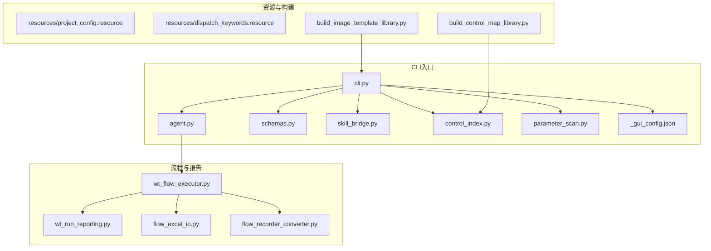
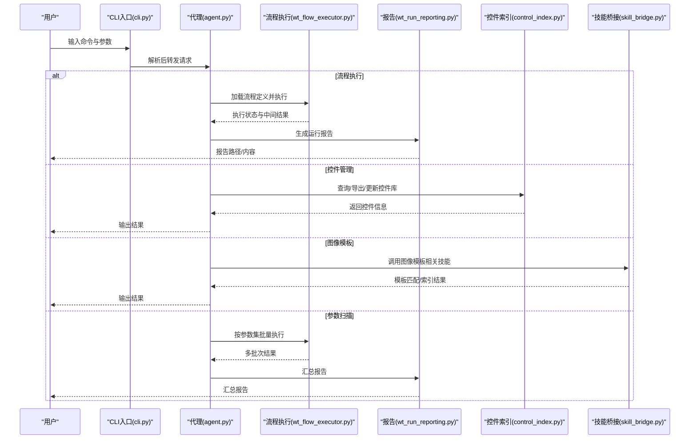
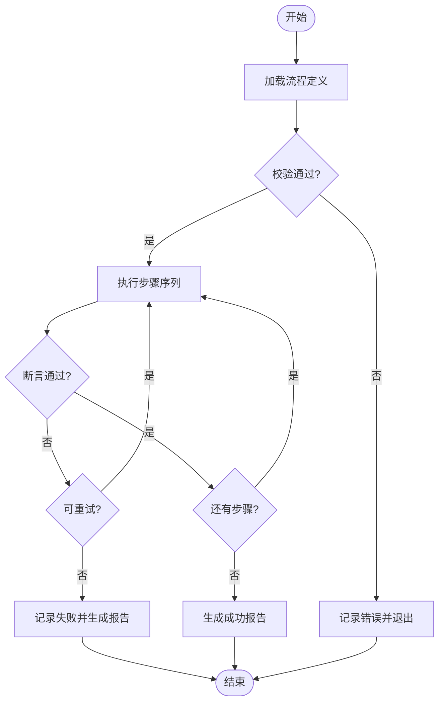
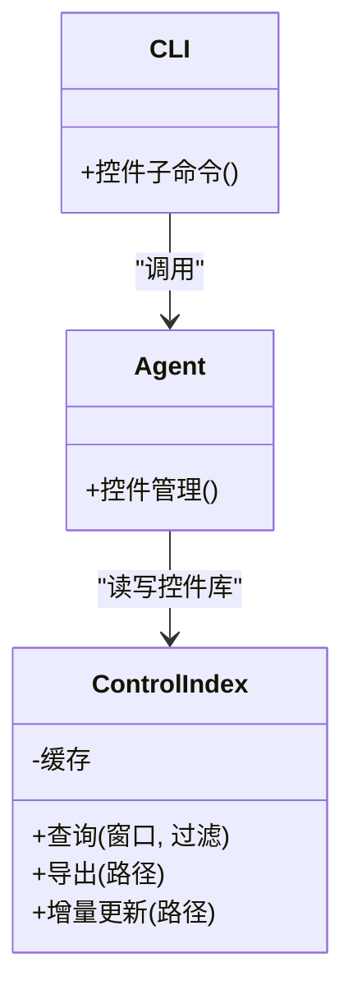
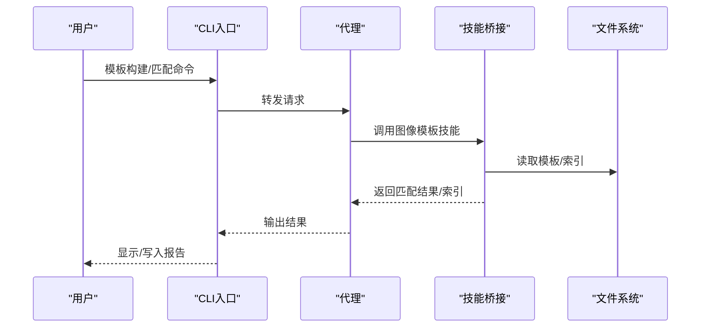
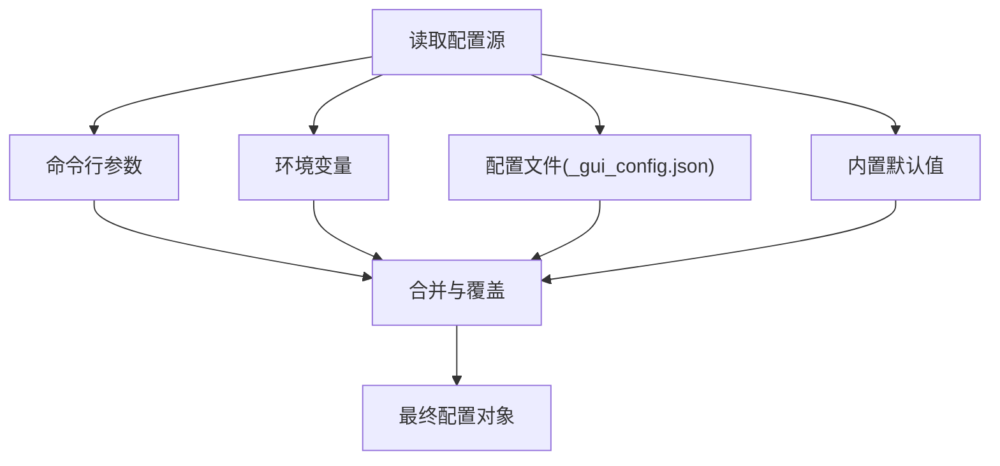
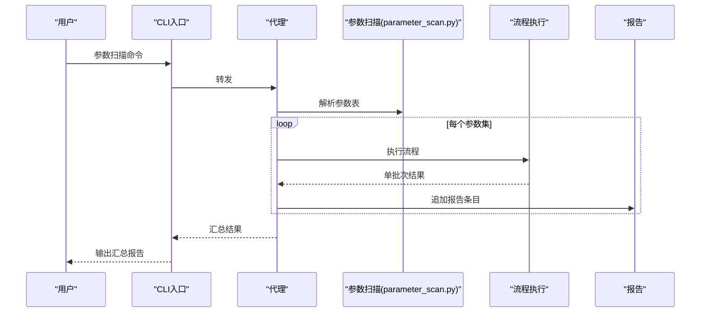
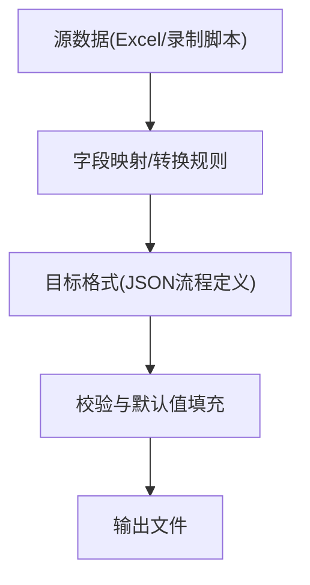
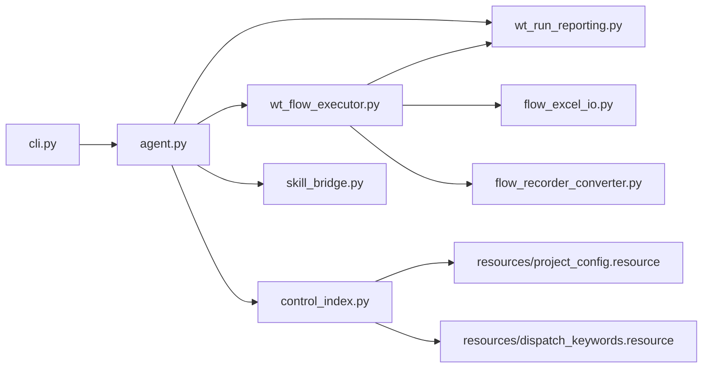

# CLI命令行接口

<cite>
**本文引用的文件**   
- [cli.py](file://WT_AUTOMATION_Agent/cli.py)
- [agent.py](file://WT_AUTOMATION_Agent/agent.py)
- [control_index.py](file://WT_AUTOMATION_Agent/control_index.py)
- [parameter_scan.py](file://WT_AUTOMATION_Agent/parameter_scan.py)
- [schemas.py](file://WT_AUTOMATION_Agent/schemas.py)
- [skill_bridge.py](file://WT_AUTOMATION_Agent/skill_bridge.py)
- [_gui_config.json](file://WT_AUTOMATION_Agent/_gui_config.json)
- [build_control_map_library.py](file://build_control_map_library.py)
- [build_image_template_library.py](file://build_image_template_library.py)
- [flow_excel_io.py](file://flow_excel_io.py)
- [flow_recorder_converter.py](file://flow_recorder_converter.py)
- [wt_flow_executor.py](file://wt_flow_executor.py)
- [wt_run_reporting.py](file://wt_run_reporting.py)
- [resources/project_config.resource](file://resources/project_config.resource)
- [resources/dispatch_keywords.resource](file://resources/dispatch_keywords.resource)
</cite>

## 目录
1. [简介](#简介)
2. [项目结构](#项目结构)
3. [核心组件](#核心组件)
4. [架构总览](#架构总览)
5. [详细组件分析](#详细组件分析)
6. [依赖关系分析](#依赖关系分析)
7. [性能考虑](#性能考虑)
8. [故障排查指南](#故障排查指南)
9. [结论](#结论)
10. [附录](#附录)

## 简介
本文件为WT自动化框架的CLI命令行接口完整参考文档，覆盖流程执行、控件管理、图像模板操作与系统配置等命令族。文档提供每个命令的语法说明、参数选项、环境变量与配置文件格式、批处理脚本用法、错误输出与日志级别控制，以及常见使用场景的命令组合示例。读者无需深入代码即可快速上手并集成到CI/CD或本地自动化流水线中。

## 项目结构
WT自动化框架的CLI入口位于WT_AUTOMATION_Agent子包内，围绕“代理（Agent）”组织能力边界：流程执行、控件索引、参数扫描、技能桥接、模式定义与GUI配置等。根目录提供若干构建与转换工具，用于生成控件库、图像模板库、Excel导入导出与录制脚本转换等。

图表来源
- [cli.py](file://WT_AUTOMATION_Agent/cli.py)
- [agent.py](file://WT_AUTOMATION_Agent/agent.py)
- [schemas.py](file://WT_AUTOMATION_Agent/schemas.py)
- [skill_bridge.py](file://WT_AUTOMATION_Agent/skill_bridge.py)
- [control_index.py](file://WT_AUTOMATION_Agent/control_index.py)
- [parameter_scan.py](file://WT_AUTOMATION_Agent/parameter_scan.py)
- [_gui_config.json](file://WT_AUTOMATION_Agent/_gui_config.json)
- [wt_flow_executor.py](file://wt_flow_executor.py)
- [wt_run_reporting.py](file://wt_run_reporting.py)
- [flow_excel_io.py](file://flow_excel_io.py)
- [flow_recorder_converter.py](file://flow_recorder_converter.py)
- [build_control_map_library.py](file://build_control_map_library.py)
- [build_image_template_library.py](file://build_image_template_library.py)
- [resources/project_config.resource](file://resources/project_config.resource)
- [resources/dispatch_keywords.resource](file://resources/dispatch_keywords.resource)

章节来源
- [cli.py](file://WT_AUTOMATION_Agent/cli.py)
- [agent.py](file://WT_AUTOMATION_Agent/agent.py)
- [schemas.py](file://WT_AUTOMATION_Agent/schemas.py)
- [skill_bridge.py](file://WT_AUTOMATION_Agent/skill_bridge.py)
- [control_index.py](file://WT_AUTOMATION_Agent/control_index.py)
- [parameter_scan.py](file://WT_AUTOMATION_Agent/parameter_scan.py)
- [_gui_config.json](file://WT_AUTOMATION_Agent/_gui_config.json)
- [wt_flow_executor.py](file://wt_flow_executor.py)
- [wt_run_reporting.py](file://wt_run_reporting.py)
- [flow_excel_io.py](file://flow_excel_io.py)
- [flow_recorder_converter.py](file://flow_recorder_converter.py)
- [build_control_map_library.py](file://build_control_map_library.py)
- [build_image_template_library.py](file://build_image_template_library.py)
- [resources/project_config.resource](file://resources/project_config.resource)
- [resources/dispatch_keywords.resource](file://resources/dispatch_keywords.resource)

## 核心组件
- CLI主入口：解析顶层命令与全局选项，分发至各子命令处理器，统一处理日志、退出码与错误输出。
- Agent代理：封装业务编排能力，协调流程执行、控件索引、参数扫描与技能桥接。
- 模式与校验：基于模式定义对输入进行校验与默认值填充，确保CLI参数与内部数据结构一致。
- 技能桥接：将外部技能（如Excel、OCR、UI抓取等）以命令形式暴露给CLI。
- 控件索引：维护控件映射库，支持查询、导出与增量更新。
- 参数扫描：驱动批量参数化执行，生成多组运行结果与报告。
- GUI配置：读取GUI相关运行时配置，影响定位策略、超时与重试等。

章节来源
- [cli.py](file://WT_AUTOMATION_Agent/cli.py)
- [agent.py](file://WT_AUTOMATION_Agent/agent.py)
- [schemas.py](file://WT_AUTOMATION_Agent/schemas.py)
- [skill_bridge.py](file://WT_AUTOMATION_Agent/skill_bridge.py)
- [control_index.py](file://WT_AUTOMATION_Agent/control_index.py)
- [parameter_scan.py](file://WT_AUTOMATION_Agent/parameter_scan.py)
- [_gui_config.json](file://WT_AUTOMATION_Agent/_gui_config.json)

## 架构总览
CLI通过子命令组织不同能力域，调用Agent完成具体任务；Agent再按需调度流程执行器、报告器、控件索引与外部技能。

图表来源
- [cli.py](file://WT_AUTOMATION_Agent/cli.py)
- [agent.py](file://WT_AUTOMATION_Agent/agent.py)
- [wt_flow_executor.py](file://wt_flow_executor.py)
- [wt_run_reporting.py](file://wt_run_reporting.py)
- [control_index.py](file://WT_AUTOMATION_Agent/control_index.py)
- [skill_bridge.py](file://WT_AUTOMATION_Agent/skill_bridge.py)

## 详细组件分析

### 流程执行命令族
- 功能概述
  - 加载并执行流程定义（JSON），支持断言、等待、相对定位、窗口上下文切换等。
  - 输出结构化运行报告，包含步骤级状态、耗时、截图与异常堆栈。
- 关键参数
  - 流程定义路径、输出目录、是否并行、重试次数、超时时间、断言严格度、日志级别等。
- 典型用法
  - 单次执行：指定流程定义与输出目录，查看报告。
  - 批量执行：结合参数扫描命令，生成多组结果与对比报告。
- 错误与恢复
  - 步骤失败可配置重试与回退策略；报告包含失败原因与定位信息。

图表来源
- [wt_flow_executor.py](file://wt_flow_executor.py)
- [wt_run_reporting.py](file://wt_run_reporting.py)
- [schemas.py](file://WT_AUTOMATION_Agent/schemas.py)

章节来源
- [wt_flow_executor.py](file://wt_flow_executor.py)
- [wt_run_reporting.py](file://wt_run_reporting.py)
- [schemas.py](file://WT_AUTOMATION_Agent/schemas.py)

### 控件管理命令族
- 功能概述
  - 查询控件树、导出控件映射库、增量更新控件索引、按窗口/类名/标题检索控件。
- 关键参数
  - 目标进程/窗口标识、输出路径、过滤条件（类名、标题、控件类型）、是否递归、是否保存快照。
- 典型用法
  - 导出当前窗口控件映射到library文件，供后续流程稳定定位。
  - 增量更新已有控件库，仅刷新变更部分。
- 注意事项
  - 控件属性可能随版本变化，建议定期重建索引；配合图像模板提升鲁棒性。

图表来源
- [control_index.py](file://WT_AUTOMATION_Agent/control_index.py)
- [agent.py](file://WT_AUTOMATION_Agent/agent.py)
- [cli.py](file://WT_AUTOMATION_Agent/cli.py)

章节来源
- [control_index.py](file://WT_AUTOMATION_Agent/control_index.py)
- [agent.py](file://WT_AUTOMATION_Agent/agent.py)
- [cli.py](file://WT_AUTOMATION_Agent/cli.py)

### 图像模板操作命令族
- 功能概述
  - 模板匹配、模板索引构建、模板库导出与合并、相似度阈值与缩放策略设置。
- 关键参数
  - 模板目录、输出索引、匹配阈值、多尺度策略、是否灰度预处理、是否缓存特征。
- 典型用法
  - 构建图像模板索引，供流程在弱文本识别场景下使用。
  - 批量替换旧模板并重新索引，保持UI变更后的稳定性。
- 性能提示
  - 合理设置阈值与多尺度层级，避免过大搜索区域导致耗时增加。

图表来源
- [skill_bridge.py](file://WT_AUTOMATION_Agent/skill_bridge.py)
- [agent.py](file://WT_AUTOMATION_Agent/agent.py)
- [cli.py](file://WT_AUTOMATION_Agent/cli.py)

章节来源
- [skill_bridge.py](file://WT_AUTOMATION_Agent/skill_bridge.py)
- [agent.py](file://WT_AUTOMATION_Agent/agent.py)
- [cli.py](file://WT_AUTOMATION_Agent/cli.py)

### 系统配置命令族
- 功能概述
  - 读取/写入GUI配置、设置日志级别、指定资源路径、启用调试开关。
- 关键参数
  - 配置文件路径、键值对、作用域（全局/会话）、是否覆盖默认值。
- 典型用法
  - 在CI环境设置无头模式与最小日志输出；在开发环境开启详细日志与断点辅助。
- 配置优先级
  - 命令行参数 > 环境变量 > 配置文件 > 内置默认值。

图表来源
- [_gui_config.json](file://WT_AUTOMATION_Agent/_gui_config.json)
- [cli.py](file://WT_AUTOMATION_Agent/cli.py)

章节来源
- [_gui_config.json](file://WT_AUTOMATION_Agent/_gui_config.json)
- [cli.py](file://WT_AUTOMATION_Agent/cli.py)

### 参数扫描与批量执行
- 功能概述
  - 从CSV/JSON/Excel读取参数集，循环执行流程，生成汇总报告与差异对比。
- 关键参数
  - 参数表路径、变量映射、并发数、失败策略（继续/中止）、报告聚合路径。
- 典型用法
  - 回归测试：遍历多组输入数据，收集通过率与失败用例清单。
  - 性能基准：在不同参数组合下测量执行时长与资源占用。

图表来源
- [parameter_scan.py](file://WT_AUTOMATION_Agent/parameter_scan.py)
- [wt_flow_executor.py](file://wt_flow_executor.py)
- [wt_run_reporting.py](file://wt_run_reporting.py)
- [cli.py](file://WT_AUTOMATION_Agent/cli.py)

章节来源
- [parameter_scan.py](file://WT_AUTOMATION_Agent/parameter_scan.py)
- [wt_flow_executor.py](file://wt_flow_executor.py)
- [wt_run_reporting.py](file://wt_run_reporting.py)
- [cli.py](file://WT_AUTOMATION_Agent/cli.py)

### Excel导入导出与录制脚本转换
- 功能概述
  - 将流程定义与Excel双向转换，便于非开发者编辑；将录制脚本转换为标准流程定义。
- 关键参数
  - 输入/输出路径、字段映射、编码、是否保留注释、转换模式（单向/双向）。
- 典型用法
  - 从Excel批量生成流程定义；将历史录制脚本迁移到新框架。

图表来源
- [flow_excel_io.py](file://flow_excel_io.py)
- [flow_recorder_converter.py](file://flow_recorder_converter.py)
- [schemas.py](file://WT_AUTOMATION_Agent/schemas.py)

章节来源
- [flow_excel_io.py](file://flow_excel_io.py)
- [flow_recorder_converter.py](file://flow_recorder_converter.py)
- [schemas.py](file://WT_AUTOMATION_Agent/schemas.py)

### 构建控件库与图像模板库
- 功能概述
  - 一键构建控件映射库与图像模板索引，支持增量更新与合并。
- 关键参数
  - 源目录、输出路径、过滤规则、并发、是否清理旧索引。
- 典型用法
  - 在CI中预构建库，减少运行时开销；在UI变更后触发增量重建。

章节来源
- [build_control_map_library.py](file://build_control_map_library.py)
- [build_image_template_library.py](file://build_image_template_library.py)

## 依赖关系分析
- 模块耦合
  - CLI与Agent松耦合，通过明确定义的子命令与参数契约交互。
  - Agent作为编排层，依赖执行器、报告器、控件索引与技能桥接。
- 外部依赖
  - 资源文件（project_config.resource、dispatch_keywords.resource）提供关键字与默认配置。
  - 文件系统用于读写流程定义、控件库、模板索引与报告。
- 潜在风险
  - 控件属性不稳定可能导致定位失败，需配合图像模板与定期重建索引。
  - 大体积模板库会增加匹配耗时，应分层管理与按需加载。

图表来源
- [cli.py](file://WT_AUTOMATION_Agent/cli.py)
- [agent.py](file://WT_AUTOMATION_Agent/agent.py)
- [wt_flow_executor.py](file://wt_flow_executor.py)
- [wt_run_reporting.py](file://wt_run_reporting.py)
- [control_index.py](file://WT_AUTOMATION_Agent/control_index.py)
- [skill_bridge.py](file://WT_AUTOMATION_Agent/skill_bridge.py)
- [flow_excel_io.py](file://flow_excel_io.py)
- [flow_recorder_converter.py](file://flow_recorder_converter.py)
- [resources/project_config.resource](file://resources/project_config.resource)
- [resources/dispatch_keywords.resource](file://resources/dispatch_keywords.resource)

章节来源
- [cli.py](file://WT_AUTOMATION_Agent/cli.py)
- [agent.py](file://WT_AUTOMATION_Agent/agent.py)
- [wt_flow_executor.py](file://wt_flow_executor.py)
- [wt_run_reporting.py](file://wt_run_reporting.py)
- [control_index.py](file://WT_AUTOMATION_Agent/control_index.py)
- [skill_bridge.py](file://WT_AUTOMATION_Agent/skill_bridge.py)
- [flow_excel_io.py](file://flow_excel_io.py)
- [flow_recorder_converter.py](file://flow_recorder_converter.py)
- [resources/project_config.resource](file://resources/project_config.resource)
- [resources/dispatch_keywords.resource](file://resources/dispatch_keywords.resource)

## 性能考虑
- 流程执行
  - 合理设置超时与重试，避免长尾步骤拖慢整体进度。
  - 使用相对定位与窗口上下文缩小搜索范围，降低定位成本。
- 控件索引
  - 增量更新优于全量重建；按窗口维度拆分索引，按需加载。
- 图像模板
  - 控制模板数量与分辨率，采用多尺度分层匹配；必要时引入特征缓存。
- 参数扫描
  - 限制并发度以避免系统资源争用；失败策略选择继续以提升吞吐。

## 故障排查指南
- 常见问题
  - 流程执行失败：检查流程定义校验、断言条件与等待策略；查看报告中的步骤级错误与截图。
  - 控件定位不稳定：确认控件属性是否变更；重建控件索引并补充图像模板。
  - 模板匹配率低：调整阈值与多尺度参数；优化模板质量与去噪。
  - 参数扫描中断：检查参数表合法性与变量映射；逐步缩小数据集定位问题。
- 日志与诊断
  - 通过全局日志级别控制输出详细程度；在CI中保存日志与报告以便回溯。
  - 使用调试开关获取更详细的中间状态与定位信息。

章节来源
- [wt_run_reporting.py](file://wt_run_reporting.py)
- [schemas.py](file://WT_AUTOMATION_Agent/schemas.py)
- [cli.py](file://WT_AUTOMATION_Agent/cli.py)

## 结论
WT自动化框架的CLI以清晰的子命令划分能力域，通过Agent统一编排，结合控件索引与图像模板提升鲁棒性。借助参数扫描与Excel/录制脚本转换，可实现从设计到执行的端到端自动化。建议在CI中预构建控件与模板库，配合合理的日志与报告策略，保障稳定与可观测性。

## 附录

### 环境变量配置
- 常用变量
  - WT_LOG_LEVEL：日志级别（如DEBUG/INFO/WARNING/ERROR）。
  - WT_CONFIG_PATH：GUI配置文件路径。
  - WT_OUTPUT_DIR：默认输出目录。
  - WT_TIMEOUT：全局超时秒数。
  - WT_RETRY：默认重试次数。
  - WT_CONCURRENCY：参数扫描并发度。
- 优先级
  - 命令行参数 > 环境变量 > 配置文件 > 内置默认值。

章节来源
- [cli.py](file://WT_AUTOMATION_Agent/cli.py)
- [_gui_config.json](file://WT_AUTOMATION_Agent/_gui_config.json)

### 配置文件格式
- GUI配置（_gui_config.json）
  - 键值对结构，包含定位策略、超时、重试、日志、窗口上下文等。
  - 支持按环境覆盖（开发/测试/生产）。
- 资源文件
  - project_config.resource：项目级默认配置。
  - dispatch_keywords.resource：调度关键字与默认动作映射。

章节来源
- [_gui_config.json](file://WT_AUTOMATION_Agent/_gui_config.json)
- [resources/project_config.resource](file://resources/project_config.resource)
- [resources/dispatch_keywords.resource](file://resources/dispatch_keywords.resource)

### 批处理脚本与自动化集成
- 本地批处理
  - 使用Windows批处理或Shell脚本封装常用命令组合，传入参数与环境变量。
- CI/CD集成
  - 在流水线中预构建控件与模板库；执行参数扫描并上传报告与截图。
  - 失败时归档日志与报告，便于后续分析。

章节来源
- [cli.py](file://WT_AUTOMATION_Agent/cli.py)
- [parameter_scan.py](file://WT_AUTOMATION_Agent/parameter_scan.py)
- [wt_run_reporting.py](file://wt_run_reporting.py)

### 错误输出格式与日志级别
- 错误输出
  - 结构化错误消息，包含错误类型、位置、上下文与推荐修复建议。
  - 报告文件附带失败步骤的截图与堆栈摘要。
- 日志级别
  - DEBUG：详细中间状态与定位信息。
  - INFO：关键步骤与结果摘要。
  - WARNING：潜在风险与降级策略。
  - ERROR：致命错误与终止信息。

章节来源
- [wt_run_reporting.py](file://wt_run_reporting.py)
- [cli.py](file://WT_AUTOMATION_Agent/cli.py)

### 常见使用场景的命令组合示例
- 快速验证流程
  - 执行单个流程定义，输出报告到指定目录。
- 回归测试
  - 从Excel读取参数集，批量执行并生成汇总报告。
- UI变更后重建索引
  - 增量更新控件索引，重建图像模板索引，随后执行流程。
- 录制脚本迁移
  - 将录制脚本转换为标准流程定义，再进行执行与报告。

章节来源
- [flow_excel_io.py](file://flow_excel_io.py)
- [flow_recorder_converter.py](file://flow_recorder_converter.py)
- [build_control_map_library.py](file://build_control_map_library.py)
- [build_image_template_library.py](file://build_image_template_library.py)
- [parameter_scan.py](file://WT_AUTOMATION_Agent/parameter_scan.py)
- [wt_flow_executor.py](file://wt_flow_executor.py)
- [wt_run_reporting.py](file://wt_run_reporting.py)