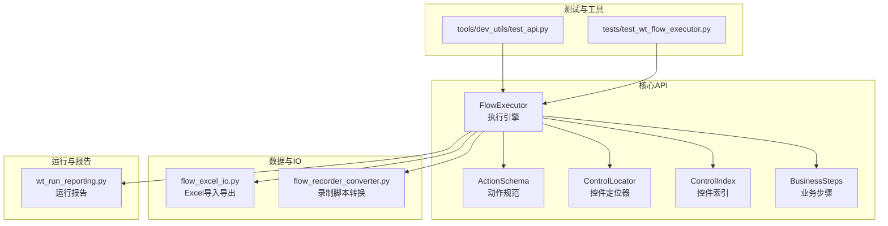
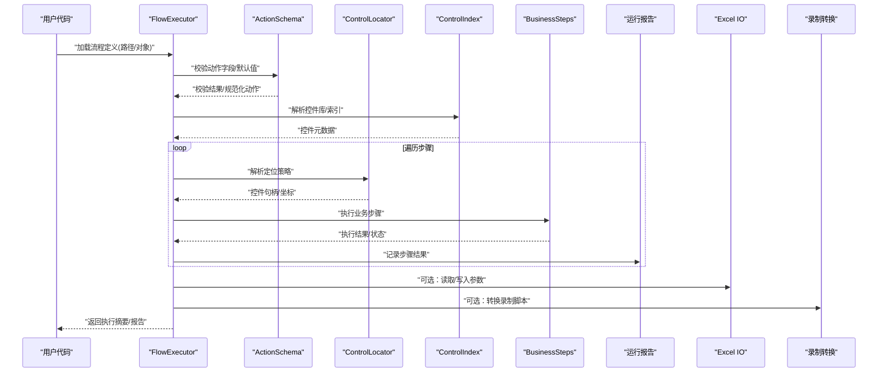
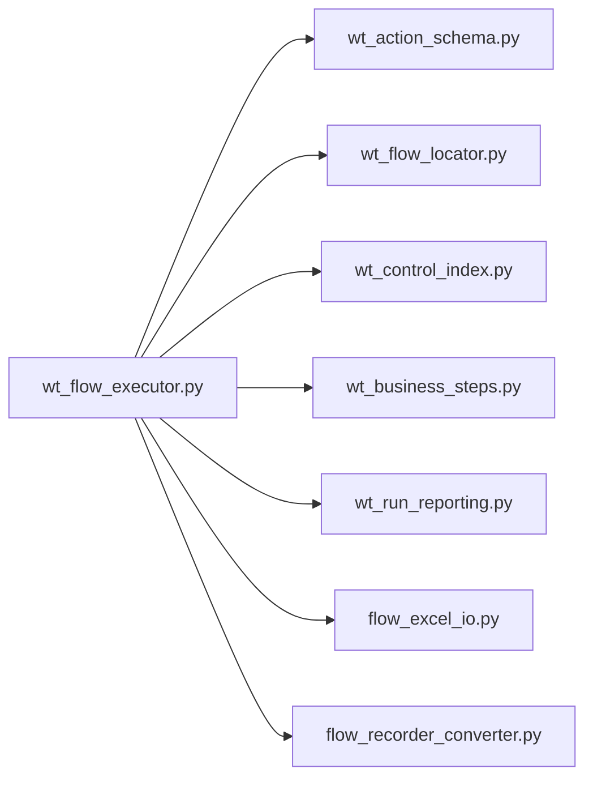

# Python API接口

<cite>
**本文档引用的文件**   
- [wt_flow_executor.py](file://wt_flow_executor.py)
- [wt_action_schema.py](file://wt_action_schema.py)
- [wt_flow_locator.py](file://wt_flow_locator.py)
- [wt_control_index.py](file://wt_control_index.py)
- [wt_business_steps.py](file://wt_business_steps.py)
- [flow_excel_io.py](file://flow_excel_io.py)
- [flow_recorder_converter.py](file://flow_recorder_converter.py)
- [wt_run_reporting.py](file://wt_run_reporting.py)
- [tests/test_wt_flow_executor.py](file://tests/test_wt_flow_executor.py)
- [tools/dev_utils/test_api.py](file://tools/dev_utils/test_api.py)
</cite>

## 目录
1. [简介](#简介)
2. [项目结构](#项目结构)
3. [核心组件](#核心组件)
4. [架构总览](#架构总览)
5. [详细组件分析](#详细组件分析)
6. [依赖关系分析](#依赖关系分析)
7. [性能考虑](#性能考虑)
8. [故障排查指南](#故障排查指南)
9. [结论](#结论)
10. [附录](#附录)

## 简介
本文件为WT自动化框架的Python API完整参考，聚焦以下核心API：
- FlowExecutor执行引擎API：负责加载、校验与执行流程定义。
- ActionSchema动作规范API：定义动作的输入校验、默认值与转换规则。
- ControlLocator控件定位器API：提供窗口/控件的定位策略与相对定位能力。
- ControlIndex控件索引API：维护控件库与索引，支持快速检索与匹配。
- BusinessSteps业务步骤API：封装常用业务流程步骤，便于组合复用。

文档包含方法签名、参数类型、返回值说明、错误处理机制、异常类型、使用示例与最佳实践，并给出版本兼容性与迁移建议。

## 项目结构
WT自动化框架采用分层模块化设计，核心API位于根目录下的独立模块中，测试与工具脚本分别位于tests与tools目录。

图表来源
- [wt_flow_executor.py](file://wt_flow_executor.py)
- [wt_action_schema.py](file://wt_action_schema.py)
- [wt_flow_locator.py](file://wt_flow_locator.py)
- [wt_control_index.py](file://wt_control_index.py)
- [wt_business_steps.py](file://wt_business_steps.py)
- [flow_excel_io.py](file://flow_excel_io.py)
- [flow_recorder_converter.py](file://flow_recorder_converter.py)
- [wt_run_reporting.py](file://wt_run_reporting.py)
- [tests/test_wt_flow_executor.py](file://tests/test_wt_flow_executor.py)
- [tools/dev_utils/test_api.py](file://tools/dev_utils/test_api.py)

章节来源
- [wt_flow_executor.py](file://wt_flow_executor.py)
- [wt_action_schema.py](file://wt_action_schema.py)
- [wt_flow_locator.py](file://wt_flow_locator.py)
- [wt_control_index.py](file://wt_control_index.py)
- [wt_business_steps.py](file://wt_business_steps.py)
- [flow_excel_io.py](file://flow_excel_io.py)
- [flow_recorder_converter.py](file://flow_recorder_converter.py)
- [wt_run_reporting.py](file://wt_run_reporting.py)
- [tests/test_wt_flow_executor.py](file://tests/test_wt_flow_executor.py)
- [tools/dev_utils/test_api.py](file://tools/dev_utils/test_api.py)

## 核心组件
本节概述各核心API的职责与交互关系，后续章节将深入每个组件的方法签名、参数与返回类型、错误处理与示例。

- FlowExecutor执行引擎
  - 职责：加载流程定义（JSON/Excel）、校验动作、解析定位器、调用业务步骤、驱动UI操作、收集运行结果与报告。
  - 关键能力：批量执行、上下文传递、重试与超时控制、断言与验证、日志与报告输出。
- ActionSchema动作规范
  - 职责：定义动作字段、类型约束、默认值、转换函数、校验规则。
  - 关键能力：动态校验、错误聚合、向后兼容的字段映射。
- ControlLocator控件定位器
  - 职责：基于窗口标题、类名、控件属性、图像模板、相对区域等策略定位目标控件。
  - 关键能力：多后端适配（如UIA/Win32）、容错与自愈、相对坐标偏移。
- ControlIndex控件索引
  - 职责：维护控件库（JSON）与索引，提供按名称、类别、属性的快速检索。
  - 关键能力：增量更新、冲突检测、标准化命名。
- BusinessSteps业务步骤
  - 职责：封装常见业务场景（如打开窗口、选择下拉项、输入文本、点击确认等）。
  - 关键能力：可组合、可配置、可回放、可断言。

章节来源
- [wt_flow_executor.py](file://wt_flow_executor.py)
- [wt_action_schema.py](file://wt_action_schema.py)
- [wt_flow_locator.py](file://wt_flow_locator.py)
- [wt_control_index.py](file://wt_control_index.py)
- [wt_business_steps.py](file://wt_business_steps.py)

## 架构总览
下图展示从流程定义到UI操作的端到端调用链，以及报告与数据IO的集成点。

图表来源
- [wt_flow_executor.py](file://wt_flow_executor.py)
- [wt_action_schema.py](file://wt_action_schema.py)
- [wt_flow_locator.py](file://wt_flow_locator.py)
- [wt_control_index.py](file://wt_control_index.py)
- [wt_business_steps.py](file://wt_business_steps.py)
- [flow_excel_io.py](file://flow_excel_io.py)
- [flow_recorder_converter.py](file://flow_recorder_converter.py)
- [wt_run_reporting.py](file://wt_run_reporting.py)

## 详细组件分析

### FlowExecutor执行引擎API
- 主要职责
  - 加载与解析流程定义（支持JSON与Excel）。
  - 对动作进行Schema校验与默认值填充。
  - 解析控件定位策略并获取控件实例。
  - 调用业务步骤执行具体UI操作。
  - 收集执行结果、生成报告、处理异常与重试。
- 典型方法族（以概念性描述为主，具体签名请参考源码）
  - 初始化与配置：设置工作目录、日志级别、超时、重试策略、控件库路径等。
  - 流程加载：从JSON或Excel加载流程定义，转换为内部表示。
  - 执行入口：按顺序执行步骤，支持条件分支与循环。
  - 断言与验证：在步骤前后插入断言，失败即中止或继续策略。
  - 报告输出：汇总成功/失败步骤、耗时、截图、错误堆栈。
- 错误处理与异常类型
  - 流程加载异常：文件不存在、格式不合法、关键字段缺失。
  - 动作校验异常：字段类型不符、必填缺失、枚举非法。
  - 定位异常：控件不可见、超时、多候选未消歧。
  - 执行异常：UI元素不可用、权限不足、外部依赖异常。
  - 报告异常：写入失败、路径无权限。
- 使用示例（路径引用）
  - 基本执行流程：参见[tests/test_wt_flow_executor.py](file://tests/test_wt_flow_executor.py)
  - 开发调试入口：参见[tools/dev_utils/test_api.py](file://tools/dev_utils/test_api.py)
- 最佳实践
  - 明确超时与重试阈值，避免长时间阻塞。
  - 使用断言确保关键状态，提高稳定性。
  - 合理拆分步骤粒度，便于定位问题。
  - 集中管理控件库与模板，减少硬编码。

章节来源
- [wt_flow_executor.py](file://wt_flow_executor.py)
- [tests/test_wt_flow_executor.py](file://tests/test_wt_flow_executor.py)
- [tools/dev_utils/test_api.py](file://tools/dev_utils/test_api.py)

### ActionSchema动作规范API
- 主要职责
  - 定义动作字段的类型、默认值、转换与校验规则。
  - 提供统一的动作规范化流程，屏蔽上游差异。
- 典型方法族（以概念性描述为主）
  - 注册动作模式：声明字段、类型、约束、默认值。
  - 校验与转换：对输入动作进行校验、补齐默认值、类型转换。
  - 兼容性映射：旧版字段到新版的映射与弃用提示。
- 错误处理与异常类型
  - 字段缺失/类型错误：抛出明确的校验异常，附带字段名与期望类型。
  - 转换失败：提供回退策略或详细错误信息。
- 使用示例（路径引用）
  - 自定义动作校验：参见[wt_action_schema.py](file://wt_action_schema.py)
- 最佳实践
  - 严格定义必填字段与枚举范围。
  - 使用默认值降低配置复杂度。
  - 保留向后兼容映射，平滑升级。

章节来源
- [wt_action_schema.py](file://wt_action_schema.py)

### ControlLocator控件定位器API
- 主要职责
  - 根据多种策略定位目标控件：窗口标题、类名、控件属性、图像模板、相对区域等。
  - 提供相对定位与偏移计算，增强鲁棒性。
- 典型方法族（以概念性描述为主）
  - 解析定位器：将字符串或结构化配置解析为定位策略。
  - 查找控件：返回控件句柄或坐标，支持超时与重试。
  - 相对定位：基于父控件或屏幕区域计算偏移。
- 错误处理与异常类型
  - 定位失败：超时、控件不可见、多候选未消歧。
  - 资源异常：图像模板缺失、分辨率差异过大。
- 使用示例（路径引用）
  - 定位策略与相对定位：参见[wt_flow_locator.py](file://wt_flow_locator.py)
- 最佳实践
  - 优先使用稳定属性（如AutomationId），辅以图像模板兜底。
  - 使用相对定位提升跨分辨率兼容性。
  - 设置合理的超时与重试次数。

章节来源
- [wt_flow_locator.py](file://wt_flow_locator.py)

### ControlIndex控件索引API
- 主要职责
  - 维护控件库（JSON）与索引，提供按名称、类别、属性的快速检索。
  - 支持增量更新与冲突检测，保证库一致性。
- 典型方法族（以概念性描述为主）
  - 加载控件库：从JSON文件构建索引。
  - 查询控件：按名称/类别/属性过滤，返回候选列表。
  - 更新索引：合并新控件、去重、冲突解决。
- 错误处理与异常类型
  - 库文件损坏或缺失：抛出IO异常或格式异常。
  - 冲突与重复：提供冲突报告与解决策略。
- 使用示例（路径引用）
  - 索引构建与查询：参见[wt_control_index.py](file://wt_control_index.py)
- 最佳实践
  - 统一命名规范，避免歧义。
  - 定期清理无用条目，保持索引精简。
  - 使用版本化控件库，便于回溯。

章节来源
- [wt_control_index.py](file://wt_control_index.py)

### BusinessSteps业务步骤API
- 主要职责
  - 封装常用UI操作为业务步骤，如打开窗口、选择下拉项、输入文本、点击确认等。
  - 提供可组合的步骤序列，简化复杂流程。
- 典型方法族（以概念性描述为主）
  - 窗口操作：打开、关闭、切换、等待就绪。
  - 控件操作：点击、输入、选择、拖拽、滚动。
  - 断言步骤：检查文本、状态、可见性。
- 错误处理与异常类型
  - UI不可用：控件禁用、弹窗遮挡、焦点丢失。
  - 状态不一致：预期与实际不符，触发断言失败。
- 使用示例（路径引用）
  - 步骤编排与断言：参见[wt_business_steps.py](file://wt_business_steps.py)
- 最佳实践
  - 将易变细节封装在步骤内，对外暴露稳定接口。
  - 在关键步骤加入断言，尽早发现问题。
  - 复用已有步骤，避免重复实现。

章节来源
- [wt_business_steps.py](file://wt_business_steps.py)

### 数据与报告集成
- Excel导入导出
  - 功能：从Excel读取流程参数、写入执行结果。
  - 适用场景：批量参数扫描、结果归档。
  - 参考：[flow_excel_io.py](file://flow_excel_io.py)
- 录制脚本转换
  - 功能：将录制脚本转换为标准流程定义。
  - 适用场景：快速上手、历史资产迁移。
  - 参考：[flow_recorder_converter.py](file://flow_recorder_converter.py)
- 运行报告
  - 功能：汇总步骤执行结果、截图、错误堆栈、耗时统计。
  - 参考：[wt_run_reporting.py](file://wt_run_reporting.py)

章节来源
- [flow_excel_io.py](file://flow_excel_io.py)
- [flow_recorder_converter.py](file://flow_recorder_converter.py)
- [wt_run_reporting.py](file://wt_run_reporting.py)

## 依赖关系分析
下图展示核心模块之间的依赖关系与调用方向。

图表来源
- [wt_flow_executor.py](file://wt_flow_executor.py)
- [wt_action_schema.py](file://wt_action_schema.py)
- [wt_flow_locator.py](file://wt_flow_locator.py)
- [wt_control_index.py](file://wt_control_index.py)
- [wt_business_steps.py](file://wt_business_steps.py)
- [flow_excel_io.py](file://flow_excel_io.py)
- [flow_recorder_converter.py](file://flow_recorder_converter.py)
- [wt_run_reporting.py](file://wt_run_reporting.py)

章节来源
- [wt_flow_executor.py](file://wt_flow_executor.py)
- [wt_action_schema.py](file://wt_action_schema.py)
- [wt_flow_locator.py](file://wt_flow_locator.py)
- [wt_control_index.py](file://wt_control_index.py)
- [wt_business_steps.py](file://wt_business_steps.py)
- [flow_excel_io.py](file://flow_excel_io.py)
- [flow_recorder_converter.py](file://flow_recorder_converter.py)
- [wt_run_reporting.py](file://wt_run_reporting.py)

## 性能考虑
- 定位优化
  - 优先使用稳定属性定位，减少图像匹配开销。
  - 合理使用相对定位，避免全图搜索。
- 执行优化
  - 批量化操作，减少UI往返。
  - 启用缓存（控件库、模板索引），避免重复加载。
- 资源管理
  - 及时释放控件句柄与临时文件。
  - 控制并发度，避免系统资源争用。
- 监控与调优
  - 关注步骤耗时分布，识别瓶颈。
  - 调整超时与重试策略，平衡稳定性与速度。

## 故障排查指南
- 常见问题
  - 流程加载失败：检查文件格式、路径权限、关键字段。
  - 动作校验失败：核对字段类型、必填项、枚举值。
  - 控件定位失败：确认控件可见性、属性变化、分辨率差异。
  - 执行中断：查看报告中的错误堆栈与截图，定位具体步骤。
- 诊断手段
  - 启用详细日志，记录每一步输入输出。
  - 使用断言提前发现状态不一致。
  - 通过录制转换快速复现问题。
- 恢复策略
  - 重试与回退：对瞬时失败步骤进行重试，必要时回滚状态。
  - 降级执行：跳过非关键步骤，保证主流程完成。
  - 人工介入：提供清晰的错误信息与操作指引。

章节来源
- [wt_run_reporting.py](file://wt_run_reporting.py)
- [tests/test_wt_flow_executor.py](file://tests/test_wt_flow_executor.py)

## 结论
WT自动化框架的Python API围绕执行引擎、动作规范、控件定位、控件索引与业务步骤五大核心组件构建，形成高内聚、低耦合的可扩展体系。通过严格的Schema校验、灵活的定位策略与丰富的业务步骤，能够高效支撑复杂的UI自动化场景。建议在实际项目中遵循最佳实践，结合报告与日志持续优化稳定性与性能。

## 附录
- 版本兼容性与迁移指南
  - 字段映射：ActionSchema提供旧版到新版的字段映射，迁移时优先使用映射表。
  - 弃用提示：对已弃用的动作字段输出警告，逐步替换为新字段。
  - 控件库版本化：为控件库引入版本号，迁移时按需升级。
  - 回归测试：利用现有测试用例覆盖关键路径，确保迁移后行为一致。
- 参考示例路径
  - 执行引擎用法：[tests/test_wt_flow_executor.py](file://tests/test_wt_flow_executor.py)
  - 开发调试入口：[tools/dev_utils/test_api.py](file://tools/dev_utils/test_api.py)
  - 动作规范定义：[wt_action_schema.py](file://wt_action_schema.py)
  - 控件定位策略：[wt_flow_locator.py](file://wt_flow_locator.py)
  - 控件索引管理：[wt_control_index.py](file://wt_control_index.py)
  - 业务步骤编排：[wt_business_steps.py](file://wt_business_steps.py)
  - Excel与录制转换：[flow_excel_io.py](file://flow_excel_io.py)、[flow_recorder_converter.py](file://flow_recorder_converter.py)
  - 运行报告：[wt_run_reporting.py](file://wt_run_reporting.py)