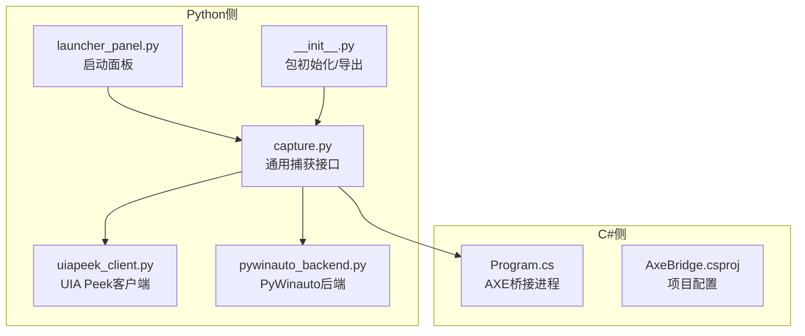
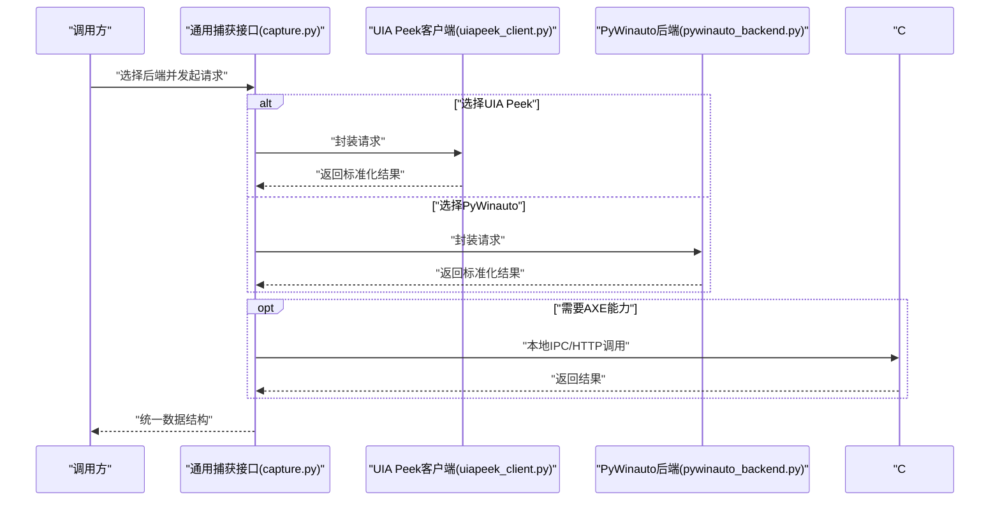
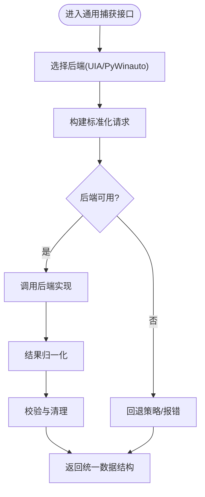
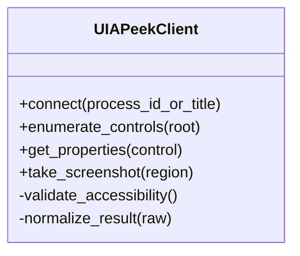
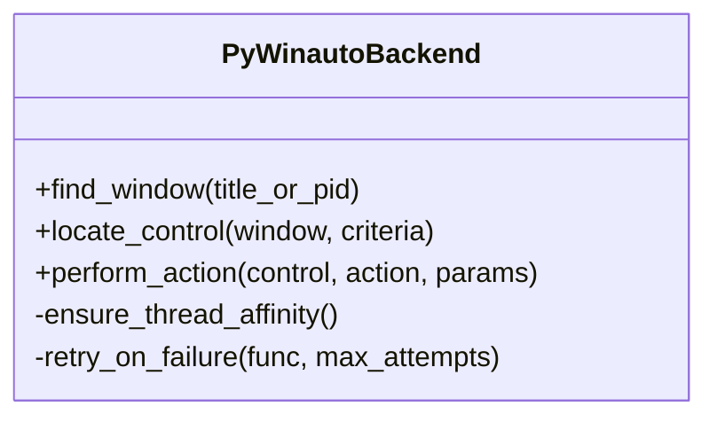
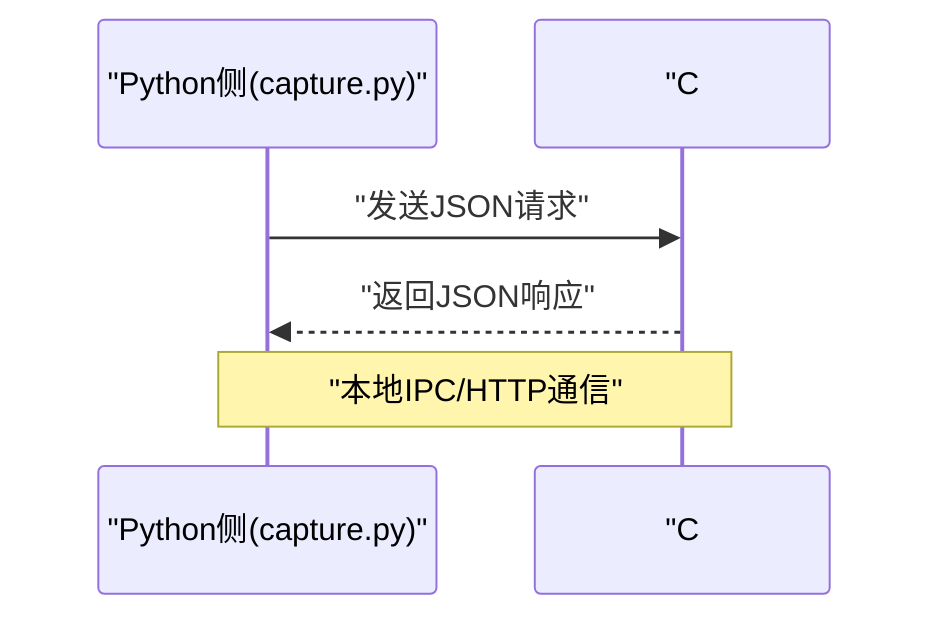
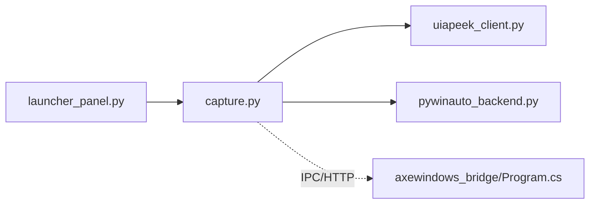

# 外部捕获桥接API

<cite>
**本文引用的文件**   
- [tools/external_capture/__init__.py](file://tools/external_capture/__init__.py)
- [tools/external_capture/capture.py](file://tools/external_capture/capture.py)
- [tools/external_capture/pywinauto_backend.py](file://tools/external_capture/pywinauto_backend.py)
- [tools/external_capture/uiapeek_client.py](file://tools/external_capture/uiapeek_client.py)
- [tools/external_capture/launcher_panel.py](file://tools/external_capture/launcher_panel.py)
- [tools/external_capture/axewindows_bridge/Program.cs](file://tools/external_capture/axewindows_bridge/Program.cs)
- [tools/external_capture/axewindows_bridge/AxeBridge.csproj](file://tools/external_capture/axewindows_bridge/AxeBridge.csproj)
</cite>

## 目录
1. [简介](#简介)
2. [项目结构](#项目结构)
3. [核心组件](#核心组件)
4. [架构总览](#架构总览)
5. [详细组件分析](#详细组件分析)
6. [依赖关系分析](#依赖关系分析)
7. [性能考虑](#性能考虑)
8. [故障排除指南](#故障排除指南)
9. [结论](#结论)
10. [附录](#附录)

## 简介
本参考文档面向WT自动化框架的外部捕获桥接API，聚焦与外部UI识别工具的集成接口。内容覆盖：
- UIA Peek客户端API
- PyWinauto后端API
- 通用捕获接口（统一入口）
- C#桥接程序的数据交换格式与通信协议
- 第三方工具集成示例与配置方法
- 不同后端的选择策略与性能对比
- 错误处理与连接管理最佳实践
- 数据序列化与反序列化规范
- 调试与故障排除方法

## 项目结构
外部捕获相关代码位于 tools/external_capture 目录，包含Python侧的通用接口、后端实现以及C#侧的AXE桥接程序。

图表来源
- [tools/external_capture/capture.py](file://tools/external_capture/capture.py)
- [tools/external_capture/uiapeek_client.py](file://tools/external_capture/uiapeek_client.py)
- [tools/external_capture/pywinauto_backend.py](file://tools/external_capture/pywinauto_backend.py)
- [tools/external_capture/launcher_panel.py](file://tools/external_capture/launcher_panel.py)
- [tools/external_capture/__init__.py](file://tools/external_capture/__init__.py)
- [tools/external_capture/axewindows_bridge/Program.cs](file://tools/external_capture/axewindows_bridge/Program.cs)
- [tools/external_capture/axewindows_bridge/AxeBridge.csproj](file://tools/external_capture/axewindows_bridge/AxeBridge.csproj)

章节来源
- [tools/external_capture/__init__.py](file://tools/external_capture/__init__.py)
- [tools/external_capture/capture.py](file://tools/external_capture/capture.py)
- [tools/external_capture/pywinauto_backend.py](file://tools/external_capture/pywinauto_backend.py)
- [tools/external_capture/uiapeek_client.py](file://tools/external_capture/uiapeek_client.py)
- [tools/external_capture/launcher_panel.py](file://tools/external_capture/launcher_panel.py)
- [tools/external_capture/axewindows_bridge/Program.cs](file://tools/external_capture/axewindows_bridge/Program.cs)
- [tools/external_capture/axewindows_bridge/AxeBridge.csproj](file://tools/external_capture/axewindows_bridge/AxeBridge.csproj)

## 核心组件
- 通用捕获接口（capture.py）
  - 职责：提供统一的发现窗口、枚举控件、获取属性、截图等能力；负责选择具体后端（UIA Peek或PyWinauto），并屏蔽差异。
  - 关键能力：
    - 选择后端：根据运行环境或配置决定使用UIA Peek还是PyWinauto。
    - 统一数据结构：将不同后端的返回结果归一化为一致的JSON对象。
    - 生命周期管理：创建、销毁后端实例，管理超时与重试。
- UIA Peek客户端（uiapeek_client.py）
  - 职责：通过UI Automation API访问目标进程的UI树，适合现代UI（WPF/UWP/WinRT）。
  - 特点：对复杂控件树支持较好，但需要目标进程以适当权限运行。
- PyWinauto后端（pywinauto_backend.py）
  - 职责：基于pywinauto库访问Win32/WPF控件，适合传统Win32界面。
  - 特点：兼容性强，但对某些现代UI元素支持有限。
- C# AXE桥接程序（axewindows_bridge/Program.cs）
  - 职责：作为独立进程暴露本地服务，供Python侧调用，用于特定场景下的AXE/Windows UI访问。
  - 通信：通常采用本地命名管道或HTTP/IPC进行请求-响应式交互。
- 启动面板（launcher_panel.py）
  - 职责：提供GUI或命令行辅助，快速启动外部捕获流程或后端服务。
- 包初始化（__init__.py）
  - 职责：对外暴露统一入口函数与常量，便于上层模块导入。

章节来源
- [tools/external_capture/capture.py](file://tools/external_capture/capture.py)
- [tools/external_capture/uiapeek_client.py](file://tools/external_capture/uiapeek_client.py)
- [tools/external_capture/pywinauto_backend.py](file://tools/external_capture/pywinauto_backend.py)
- [tools/external_capture/axewindows_bridge/Program.cs](file://tools/external_capture/axewindows_bridge/Program.cs)
- [tools/external_capture/launcher_panel.py](file://tools/external_capture/launcher_panel.py)
- [tools/external_capture/__init__.py](file://tools/external_capture/__init__.py)

## 架构总览
整体架构采用“前端统一接口 + 多后端适配 + 可选C#桥接”的分层设计。Python侧通过统一接口发起请求，内部根据策略选择UIA Peek或PyWinauto后端；在需要时，可调用C#桥接进程完成特定任务。

图表来源
- [tools/external_capture/capture.py](file://tools/external_capture/capture.py)
- [tools/external_capture/uiapeek_client.py](file://tools/external_capture/uiapeek_client.py)
- [tools/external_capture/pywinauto_backend.py](file://tools/external_capture/pywinauto_backend.py)
- [tools/external_capture/axewindows_bridge/Program.cs](file://tools/external_capture/axewindows_bridge/Program.cs)

## 详细组件分析

### 通用捕获接口（capture.py）
- 设计要点
  - 后端抽象：定义统一的方法签名，隐藏UIA Peek与PyWinauto的差异。
  - 策略模式：根据配置或运行时检测选择合适后端。
  - 数据归一化：将不同后端的返回结构转换为一致的对象模型。
- 关键流程
  - 初始化：加载配置、选择后端、建立连接。
  - 请求分发：根据操作类型路由到对应后端。
  - 结果处理：校验、转换、缓存与日志记录。
- 错误处理
  - 连接失败：自动重试与降级策略。
  - 超时控制：为长耗时操作设置超时阈值。
  - 异常映射：将底层异常转换为统一错误码与消息。

图表来源
- [tools/external_capture/capture.py](file://tools/external_capture/capture.py)

章节来源
- [tools/external_capture/capture.py](file://tools/external_capture/capture.py)

### UIA Peek客户端（uiapeek_client.py）
- 设计要点
  - 基于UI Automation API遍历控件树，适合现代UI。
  - 提供窗口定位、控件枚举、属性读取、截图等能力。
- 关键流程
  - 连接：附加到目标进程或会话。
  - 枚举：递归遍历控件树，过滤可见性与可用性。
  - 属性：提取名称、类名、位置、大小、文本等。
- 错误处理
  - 权限不足：提示以管理员权限运行或调整UAC设置。
  - 目标不可见：检查窗口状态与层级关系。
  - 超时：对深层树遍历设置最大深度与超时。

图表来源
- [tools/external_capture/uiapeek_client.py](file://tools/external_capture/uiapeek_client.py)

章节来源
- [tools/external_capture/uiapeek_client.py](file://tools/external_capture/uiapeek_client.py)

### PyWinauto后端（pywinauto_backend.py）
- 设计要点
  - 基于pywinauto访问Win32/WPF控件，兼容传统界面。
  - 提供窗口查找、控件定位、点击/输入等操作。
- 关键流程
  - 连接：通过标题或进程ID定位窗口。
  - 定位：使用控件属性组合精确匹配。
  - 操作：执行点击、输入、选择等动作。
- 错误处理
  - 控件不存在：提供模糊匹配与容错策略。
  - 线程问题：确保在主线程执行UI操作。
  - 超时：对等待就绪设置合理阈值。

图表来源
- [tools/external_capture/pywinauto_backend.py](file://tools/external_capture/pywinauto_backend.py)

章节来源
- [tools/external_capture/pywinauto_backend.py](file://tools/external_capture/pywinauto_backend.py)

### C#桥接程序（axewindows_bridge/Program.cs）
- 设计要点
  - 作为独立进程运行，暴露本地服务接口。
  - 用于特定场景下的AXE/Windows UI访问，补充Python侧能力。
- 通信协议
  - 传输方式：本地命名管道或HTTP/IPC。
  - 数据格式：JSON请求/响应，包含操作类型、参数与结果。
  - 安全机制：进程级隔离，限制跨进程访问范围。
- 生命周期
  - 启动：由Python侧或启动面板拉起。
  - 心跳：定期健康检查，异常退出自动重启。
  - 关闭：优雅退出，释放资源。

图表来源
- [tools/external_capture/axewindows_bridge/Program.cs](file://tools/external_capture/axewindows_bridge/Program.cs)
- [tools/external_capture/axewindows_bridge/AxeBridge.csproj](file://tools/external_capture/axewindows_bridge/AxeBridge.csproj)

章节来源
- [tools/external_capture/axewindows_bridge/Program.cs](file://tools/external_capture/axewindows_bridge/Program.cs)
- [tools/external_capture/axewindows_bridge/AxeBridge.csproj](file://tools/external_capture/axewindows_bridge/AxeBridge.csproj)

### 启动面板（launcher_panel.py）
- 功能
  - 提供图形界面或命令行选项，快速启动外部捕获流程。
  - 支持选择后端、设置超时、输出日志等。
- 使用建议
  - 首次运行：验证目标进程权限与UIA支持。
  - 批量测试：结合脚本自动化启动与结果收集。

章节来源
- [tools/external_capture/launcher_panel.py](file://tools/external_capture/launcher_panel.py)

### 包初始化（__init__.py）
- 作用
  - 对外暴露统一入口函数与常量。
  - 简化上层模块导入，隐藏内部实现细节。

章节来源
- [tools/external_capture/__init__.py](file://tools/external_capture/__init__.py)

## 依赖关系分析
- 组件耦合
  - capture.py 作为中心协调者，依赖 uiapeek_client.py 与 pywinauto_backend.py。
  - launcher_panel.py 依赖 capture.py 提供的统一接口。
  - axewindows_bridge 作为独立进程，通过IPC/HTTP与Python侧交互。
- 外部依赖
  - UIA Peek客户端依赖系统UI Automation API。
  - PyWinauto后端依赖pywinauto库。
  - C#桥接程序依赖.NET运行时。

图表来源
- [tools/external_capture/capture.py](file://tools/external_capture/capture.py)
- [tools/external_capture/uiapeek_client.py](file://tools/external_capture/uiapeek_client.py)
- [tools/external_capture/pywinauto_backend.py](file://tools/external_capture/pywinauto_backend.py)
- [tools/external_capture/launcher_panel.py](file://tools/external_capture/launcher_panel.py)
- [tools/external_capture/axewindows_bridge/Program.cs](file://tools/external_capture/axewindows_bridge/Program.cs)

章节来源
- [tools/external_capture/capture.py](file://tools/external_capture/capture.py)
- [tools/external_capture/uiapeek_client.py](file://tools/external_capture/uiapeek_client.py)
- [tools/external_capture/pywinauto_backend.py](file://tools/external_capture/pywinauto_backend.py)
- [tools/external_capture/launcher_panel.py](file://tools/external_capture/launcher_panel.py)
- [tools/external_capture/axewindows_bridge/Program.cs](file://tools/external_capture/axewindows_bridge/Program.cs)

## 性能考虑
- 后端选择策略
  - 现代UI（WPF/UWP/WinRT）优先使用UIA Peek，以获得更完整的控件树与属性。
  - 传统Win32界面优先使用PyWinauto，兼容性更好且开销较低。
- 优化建议
  - 减少控件树遍历深度，按需懒加载子节点。
  - 启用结果缓存，避免重复查询相同控件。
  - 合理设置超时与重试次数，避免阻塞主流程。
- 资源管理
  - 及时释放UIA/PyWinauto句柄，防止内存泄漏。
  - 监控C#桥接进程健康状态，异常时自动重启。

[本节为通用指导，不直接分析具体文件]

## 故障排除指南
- 常见问题
  - 权限不足：确保以管理员权限运行或调整UAC设置。
  - 目标进程未就绪：增加等待时间或轮询检查窗口状态。
  - 控件定位失败：检查控件属性是否稳定，必要时使用相对定位。
- 调试技巧
  - 启用详细日志，记录请求与响应。
  - 使用启动面板逐步验证后端连通性。
  - 单独测试C#桥接进程，确认IPC/HTTP正常。
- 错误处理最佳实践
  - 统一错误码与消息，便于上层解析。
  - 实现指数退避重试，避免瞬时失败导致测试不稳定。
  - 提供降级路径，当某后端不可用时自动切换。

章节来源
- [tools/external_capture/capture.py](file://tools/external_capture/capture.py)
- [tools/external_capture/uiapeek_client.py](file://tools/external_capture/uiapeek_client.py)
- [tools/external_capture/pywinauto_backend.py](file://tools/external_capture/pywinauto_backend.py)
- [tools/external_capture/launcher_panel.py](file://tools/external_capture/launcher_panel.py)
- [tools/external_capture/axewindows_bridge/Program.cs](file://tools/external_capture/axewindows_bridge/Program.cs)

## 结论
外部捕获桥接API通过统一接口屏蔽了不同后端的差异，提供了灵活的UI识别与操作能力。在实际使用中，应根据目标应用的UI类型选择合适的后端，并结合错误处理与性能优化策略，确保稳定性与效率。C#桥接程序为特定场景提供了扩展能力，配合Python侧形成完整解决方案。

[本节为总结，不直接分析具体文件]

## 附录
- 数据序列化与反序列化规范
  - 请求/响应均采用JSON格式，字段包括操作类型、参数、结果与错误信息。
  - 统一字段命名与类型约束，便于跨语言解析。
- 第三方工具集成示例
  - 通过启动面板或脚本调用通用捕获接口，传入目标窗口与操作参数。
  - 自定义后端适配器，遵循统一接口契约即可接入新工具。
- 配置方法
  - 在配置文件或环境变量中指定后端类型、超时、重试等参数。
  - 动态切换后端，适应不同运行环境。

[本节为概念性说明，不直接分析具体文件]