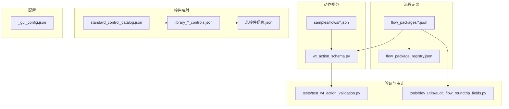
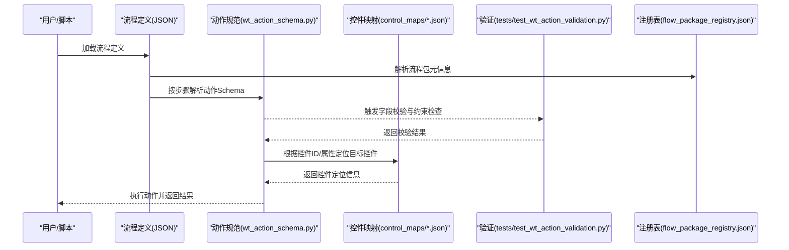
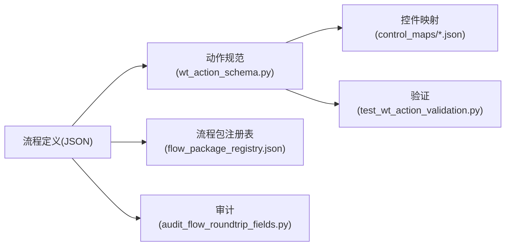

# 数据模型规范

<cite>
**本文引用的文件**   
- [schemas.py](file://WT_AUTOMATION_Agent/schemas.py)
- [wt_action_schema.py](file://wt_action_schema.py)
- [flow_definition_geo_import_data_file.json](file://flow_packages/flow_definition_geo_import_data_file.json)
- [flow_definition_microscale_create_model.json](file://flow_packages/flow_definition_microscale_create_model.json)
- [flow_definition_turbine_type_create_and_curves.json](file://flow_packages/flow_definition_turbine_type_create_and_curves.json)
- [flow_definition_创建一个新建模.json](file://flow_packages/flow_definition_创建一个新建模.json)
- [flow_definition_导入测风塔、机位点.json](file://flow_packages/flow_definition_导入测风塔、机位点.json)
- [flow_definition_新建风机类型.json](file://flow_packages/flow_definition_新建风机类型.json)
- [flow_package_registry.json](file://flow_packages/flow_package_registry.json)
- [standard_control_catalog.json](file://control_maps/standard_control_catalog.json)
- [library_window_WPF_controls.json](file://control_maps/library_window_WPF_controls.json)
- [library_主面板_WPF_controls.json](file://control_maps/library_主面板_WPF_controls.json)
- [library_保存_WPF_controls.json](file://control_maps/library_保存_WPF_controls.json)
- [library_创建一个新建模_WPF_controls.json](file://control_maps/library_创建一个新建模_WPF_controls.json)
- [library_创建新的风机类型_WPF_controls.json](file://control_maps/library_创建新的风机类型_WPF_controls.json)
- [library_导入时间序列文件_WPF_controls.json](file://control_maps/library_导入时间序列文件_WPF_controls.json)
- [library_性能曲线_WPF_controls.json](file://control_maps/library_性能曲线_WPF_controls.json)
- [library_打开(O)_Win32_controls.json](file://control_maps/library_打开(O)_Win32_controls.json)
- [library_打开_Win32_controls.json](file://control_maps/library_打开_Win32_controls.json)
- [library_文件名(N)_unknown_controls.json](file://control_maps/library_文件名(N)_unknown_controls.json)
- [library_日期时间_WPF_controls.json](file://control_maps/library_日期时间_WPF_controls.json)
- [library_未分类窗口_WPF_controls.json](file://control_maps/library_未分类窗口_WPF_controls.json)
- [library_气象对象_WPF_controls.json](file://control_maps/library_气象对象_WPF_controls.json)
- [library_版本管理_WPF_controls.json](file://control_maps/library_版本管理_WPF_controls.json)
- [library_私有_WPF_controls.json](file://control_maps/library_私有_WPF_controls.json)
- [library_行_WPF_controls.json](file://control_maps/library_行_WPF_controls.json)
- [library_请补充窗口标题_WPF_controls.json](file://control_maps/library_请补充窗口标题_WPF_controls.json)
- [library_请补充窗口标题_unknown_controls.json](file://control_maps/library_请补充窗口标题_unknown_controls.json)
- [library_风机类型_WPF_controls.json](file://control_maps/library_风机类型_WPF_controls.json)
- [total_controls_info.json](file://control_maps/总控件信息.json)
- [test_wt_action_validation.py](file://tests/test_wt_action_validation.py)
- [audit_flow_roundtrip_fields.py](file://tools/dev_utils/audit_flow_roundtrip_fields.py)
</cite>

## 目录
1. [引言](#引言)
2. [项目结构](#项目结构)
3. [核心组件](#核心组件)
4. [架构总览](#架构总览)
5. [详细组件分析](#详细组件分析)
6. [依赖关系分析](#依赖关系分析)
7. [性能考虑](#性能考虑)
8. [故障排查指南](#故障排查指南)
9. [结论](#结论)
10. [附录](#附录)

## 引言
本规范文档面向WT自动化框架的数据模型，覆盖流程定义模型、动作规范模型、控件映射模型与配置模型的完整JSON Schema定义、字段说明、数据类型约束与业务规则。同时提供版本管理与向后兼容策略、示例与验证工具使用方法、迁移与升级方案，以及自定义扩展的开发指南与最佳实践，帮助使用者正确设计、校验、演进和集成数据模型。

## 项目结构
WT自动化框架的数据模型主要分布在以下位置：
- 流程定义模型：flow_packages/*.json（流程包与流程定义）
- 动作规范模型：wt_action_schema.py（动作Schema定义）、samples/flows/*.json（示例流程）
- 控件映射模型：control_maps/*.json（标准控件目录与库）
- 配置模型：WT_AUTOMATION_Agent/_gui_config.json（GUI配置）
- 验证与审计：tests/test_wt_action_validation.py、tools/dev_utils/audit_flow_roundtrip_fields.py

图表来源
- [flow_package_registry.json](file://flow_packages/flow_package_registry.json)
- [wt_action_schema.py](file://wt_action_schema.py)
- [standard_control_catalog.json](file://control_maps/standard_control_catalog.json)
- [library_window_WPF_controls.json](file://control_maps/library_window_WPF_controls.json)
- [总控件信息.json](file://control_maps/总控件信息.json)
- [_gui_config.json](file://WT_AUTOMATION_Agent/_gui_config.json)
- [test_wt_action_validation.py](file://tests/test_wt_action_validation.py)
- [audit_flow_roundtrip_fields.py](file://tools/dev_utils/audit_flow_roundtrip_fields.py)

章节来源
- [flow_package_registry.json](file://flow_packages/flow_package_registry.json)
- [wt_action_schema.py](file://wt_action_schema.py)
- [standard_control_catalog.json](file://control_maps/standard_control_catalog.json)
- [library_window_WPF_controls.json](file://control_maps/library_window_WPF_controls.json)
- [总控件信息.json](file://control_maps/总控件信息.json)
- [_gui_config.json](file://WT_AUTOMATION_Agent/_gui_config.json)
- [test_wt_action_validation.py](file://tests/test_wt_action_validation.py)
- [audit_flow_roundtrip_fields.py](file://tools/dev_utils/audit_flow_roundtrip_fields.py)

## 核心组件
本节概述四类核心数据模型及其职责：
- 流程定义模型：描述可执行的自动化流程步骤、参数、定位策略、条件分支与错误处理等。
- 动作规范模型：定义每个动作的输入输出、必填字段、取值范围、默认值与校验规则。
- 控件映射模型：标准化UI控件的属性、标识、定位信息与分组，支持多平台（WPF/Win32）。
- 配置模型：运行时或编辑器所需的系统级与界面级配置项。

章节来源
- [flow_definition_geo_import_data_file.json](file://flow_packages/flow_definition_geo_import_data_file.json)
- [flow_definition_microscale_create_model.json](file://flow_packages/flow_definition_microscale_create_model.json)
- [flow_definition_turbine_type_create_and_curves.json](file://flow_packages/flow_definition_turbine_type_create_and_curves.json)
- [flow_definition_创建一个新建模.json](file://flow_packages/flow_definition_创建一个新建模.json)
- [flow_definition_导入测风塔、机位点.json](file://flow_packages/flow_definition_导入测风塔、机位点.json)
- [flow_definition_新建风机类型.json](file://flow_packages/flow_definition_新建风机类型.json)
- [flow_package_registry.json](file://flow_packages/flow_package_registry.json)
- [wt_action_schema.py](file://wt_action_schema.py)
- [standard_control_catalog.json](file://control_maps/standard_control_catalog.json)
- [library_window_WPF_controls.json](file://control_maps/library_window_WPF_controls.json)
- [_gui_config.json](file://WT_AUTOMATION_Agent/_gui_config.json)

## 架构总览
下图展示数据模型在系统中的交互关系：流程定义引用动作规范；动作执行时通过控件映射进行定位；配置影响行为与界面；验证与审计贯穿全链路。

图表来源
- [flow_definition_geo_import_data_file.json](file://flow_packages/flow_definition_geo_import_data_file.json)
- [flow_package_registry.json](file://flow_packages/flow_package_registry.json)
- [wt_action_schema.py](file://wt_action_schema.py)
- [standard_control_catalog.json](file://control_maps/standard_control_catalog.json)
- [test_wt_action_validation.py](file://tests/test_wt_action_validation.py)

## 详细组件分析

### 流程定义模型
- 作用：描述端到端自动化流程的步骤序列、参数绑定、条件与异常处理、日志与报告开关等。
- 关键要点：
  - 步骤列表：包含步骤ID、名称、动作类型、参数、等待与重试策略、定位上下文等。
  - 参数化：支持变量替换、表达式与外部数据源（如Excel）绑定。
  - 控制流：支持顺序、并行、条件分支、循环与子流程调用。
  - 错误处理：捕获异常、重试、回滚与告警。
  - 版本信息：流程定义应包含版本字段以支持演进与兼容性判断。
- 示例路径：
  - [flow_definition_geo_import_data_file.json](file://flow_packages/flow_definition_geo_import_data_file.json)
  - [flow_definition_microscale_create_model.json](file://flow_packages/flow_definition_microscale_create_model.json)
  - [flow_definition_turbine_type_create_and_curves.json](file://flow_packages/flow_definition_turbine_type_create_and_curves.json)
  - [flow_definition_创建一个新建模.json](file://flow_packages/flow_definition_创建一个新建模.json)
  - [flow_definition_导入测风塔、机位点.json](file://flow_packages/flow_definition_导入测风塔、机位点.json)
  - [flow_definition_新建风机类型.json](file://flow_packages/flow_definition_新建风机类型.json)
  - [flow_package_registry.json](file://flow_packages/flow_package_registry.json)

章节来源
- [flow_definition_geo_import_data_file.json](file://flow_packages/flow_definition_geo_import_data_file.json)
- [flow_definition_microscale_create_model.json](file://flow_packages/flow_definition_microscale_create_model.json)
- [flow_definition_turbine_type_create_and_curves.json](file://flow_packages/flow_definition_turbine_type_create_and_curves.json)
- [flow_definition_创建一个新建模.json](file://flow_packages/flow_definition_创建一个新建模.json)
- [flow_definition_导入测风塔、机位点.json](file://flow_packages/flow_definition_导入测风塔、机位点.json)
- [flow_definition_新建风机类型.json](file://flow_packages/flow_definition_新建风机类型.json)
- [flow_package_registry.json](file://flow_packages/flow_package_registry.json)

### 动作规范模型
- 作用：为每个自动化动作定义输入参数、输出、必填性、取值范围、默认值与校验规则。
- 关键要点：
  - 动作类型：点击、输入、选择、截图、等待、断言等。
  - 参数约束：类型（字符串、数值、布尔、枚举、数组、对象）、长度、正则、范围、唯一性等。
  - 默认值与可选性：区分必填与可选，提供合理默认值以降低使用门槛。
  - 校验规则：内置校验器与自定义校验函数，支持跨字段联合校验。
  - 版本兼容：新增字段需标记为可选并提供默认值；废弃字段保留但标记弃用。
- 参考实现路径：
  - [wt_action_schema.py](file://wt_action_schema.py)
  - [test_wt_action_validation.py](file://tests/test_wt_action_validation.py)

章节来源
- [wt_action_schema.py](file://wt_action_schema.py)
- [test_wt_action_validation.py](file://tests/test_wt_action_validation.py)

### 控件映射模型
- 作用：将UI控件抽象为标准化的数据结构，便于跨应用、跨平台的稳定定位与操作。
- 关键要点：
  - 控件标识：唯一ID、名称、类型、平台（WPF/Win32/未知）。
  - 定位属性：类名、标题、层级、索引、相对区域、图像模板等。
  - 分组与目录：按功能模块或窗口组织，便于检索与维护。
  - 标准目录：统一控件命名与属性规范，减少歧义。
  - 汇总信息：聚合所有控件信息，便于全局分析与导出。
- 参考文件路径：
  - [standard_control_catalog.json](file://control_maps/standard_control_catalog.json)
  - [library_window_WPF_controls.json](file://control_maps/library_window_WPF_controls.json)
  - [library_主面板_WPF_controls.json](file://control_maps/library_主面板_WPF_controls.json)
  - [library_保存_WPF_controls.json](file://control_maps/library_保存_WPF_controls.json)
  - [library_创建一个新建模_WPF_controls.json](file://control_maps/library_创建一个新建模_WPF_controls.json)
  - [library_创建新的风机类型_WPF_controls.json](file://control_maps/library_创建新的风机类型_WPF_controls.json)
  - [library_导入时间序列文件_WPF_controls.json](file://control_maps/library_导入时间序列文件_WPF_controls.json)
  - [library_性能曲线_WPF_controls.json](file://control_maps/library_性能曲线_WPF_controls.json)
  - [library_打开(O)_Win32_controls.json](file://control_maps/library_打开(O)_Win32_controls.json)
  - [library_打开_Win32_controls.json](file://control_maps/library_打开_Win32_controls.json)
  - [library_文件名(N)_unknown_controls.json](file://control_maps/library_文件名(N)_unknown_controls.json)
  - [library_日期时间_WPF_controls.json](file://control_maps/library_日期时间_WPF_controls.json)
  - [library_未分类窗口_WPF_controls.json](file://control_maps/library_未分类窗口_WPF_controls.json)
  - [library_气象对象_WPF_controls.json](file://control_maps/library_气象对象_WPF_controls.json)
  - [library_版本管理_WPF_controls.json](file://control_maps/library_版本管理_WPF_controls.json)
  - [library_私有_WPF_controls.json](file://control_maps/library_私有_WPF_controls.json)
  - [library_行_WPF_controls.json](file://control_maps/library_行_WPF_controls.json)
  - [library_请补充窗口标题_WPF_controls.json](file://control_maps/library_请补充窗口标题_WPF_controls.json)
  - [library_请补充窗口标题_unknown_controls.json](file://control_maps/library_请补充窗口标题_unknown_controls.json)
  - [library_风机类型_WPF_controls.json](file://control_maps/library_风机类型_WPF_controls.json)
  - [总控件信息.json](file://control_maps/总控件信息.json)

章节来源
- [standard_control_catalog.json](file://control_maps/standard_control_catalog.json)
- [library_window_WPF_controls.json](file://control_maps/library_window_WPF_controls.json)
- [library_主面板_WPF_controls.json](file://control_maps/library_主面板_WPF_controls.json)
- [library_保存_WPF_controls.json](file://control_maps/library_保存_WPF_controls.json)
- [library_创建一个新建模_WPF_controls.json](file://control_maps/library_创建一个新建模_WPF_controls.json)
- [library_创建新的风机类型_WPF_controls.json](file://control_maps/library_创建新的风机类型_WPF_controls.json)
- [library_导入时间序列文件_WPF_controls.json](file://control_maps/library_导入时间序列文件_WPF_controls.json)
- [library_性能曲线_WPF_controls.json](file://control_maps/library_性能曲线_WPF_controls.json)
- [library_打开(O)_Win32_controls.json](file://control_maps/library_打开(O)_Win32_controls.json)
- [library_打开_Win32_controls.json](file://control_maps/library_打开_Win32_controls.json)
- [library_文件名(N)_unknown_controls.json](file://control_maps/library_文件名(N)_unknown_controls.json)
- [library_日期时间_WPF_controls.json](file://control_maps/library_日期时间_WPF_controls.json)
- [library_未分类窗口_WPF_controls.json](file://control_maps/library_未分类窗口_WPF_controls.json)
- [library_气象对象_WPF_controls.json](file://control_maps/library_气象对象_WPF_controls.json)
- [library_版本管理_WPF_controls.json](file://control_maps/library_版本管理_WPF_controls.json)
- [library_私有_WPF_controls.json](file://control_maps/library_私有_WPF_controls.json)
- [library_行_WPF_controls.json](file://control_maps/library_行_WPF_controls.json)
- [library_请补充窗口标题_WPF_controls.json](file://control_maps/library_请补充窗口标题_WPF_controls.json)
- [library_请补充窗口标题_unknown_controls.json](file://control_maps/library_请补充窗口标题_unknown_controls.json)
- [library_风机类型_WPF_controls.json](file://control_maps/library_风机类型_WPF_controls.json)
- [总控件信息.json](file://control_maps/总控件信息.json)

### 配置模型
- 作用：提供运行环境与编辑器界面的配置项，包括路径、超时、日志级别、插件开关等。
- 关键要点：
  - 环境配置：工作目录、资源路径、第三方工具路径。
  - 行为配置：重试次数、等待策略、并发度、缓存开关。
  - 界面配置：主题、语言、布局、快捷键映射。
  - 安全与权限：访问令牌、代理设置、白名单。
- 参考文件路径：
  - [_gui_config.json](file://WT_AUTOMATION_Agent/_gui_config.json)

章节来源
- [_gui_config.json](file://WT_AUTOMATION_Agent/_gui_config.json)

## 依赖关系分析
- 流程定义依赖动作规范：步骤中的动作类型与参数由动作Schema约束。
- 动作执行依赖控件映射：定位控件时依据控件ID与属性匹配。
- 验证与审计贯穿：测试用例对动作Schema进行校验；审计工具用于流程字段往返一致性检查。
- 注册表管理流程包：流程包注册表提供元信息与版本管理。

图表来源
- [flow_definition_geo_import_data_file.json](file://flow_packages/flow_definition_geo_import_data_file.json)
- [wt_action_schema.py](file://wt_action_schema.py)
- [standard_control_catalog.json](file://control_maps/standard_control_catalog.json)
- [flow_package_registry.json](file://flow_packages/flow_package_registry.json)
- [test_wt_action_validation.py](file://tests/test_wt_action_validation.py)
- [audit_flow_roundtrip_fields.py](file://tools/dev_utils/audit_flow_roundtrip_fields.py)

章节来源
- [flow_definition_geo_import_data_file.json](file://flow_packages/flow_definition_geo_import_data_file.json)
- [wt_action_schema.py](file://wt_action_schema.py)
- [standard_control_catalog.json](file://control_maps/standard_control_catalog.json)
- [flow_package_registry.json](file://flow_packages/flow_package_registry.json)
- [test_wt_action_validation.py](file://tests/test_wt_action_validation.py)
- [audit_flow_roundtrip_fields.py](file://tools/dev_utils/audit_flow_roundtrip_fields.py)

## 性能考虑
- 控件映射索引：建议维护控件ID到定位属性的索引，提升查找效率。
- 批量校验：对流程定义进行批量Schema校验，避免逐条串行导致的延迟。
- 缓存策略：对常用控件定位结果进行短期缓存，降低重复计算。
- 异步执行：对于I/O密集型动作（截图、网络请求），采用异步或线程池提升吞吐。
- 资源限制：限制并发度与内存占用，防止资源耗尽。

## 故障排查指南
- 动作校验失败：检查动作参数是否符合Schema约束，关注必填字段、类型与范围。
- 控件定位失败：核对控件映射中的ID与属性是否与实际UI一致，必要时更新控件库。
- 流程执行中断：查看错误日志与断言结果，确认前置条件与依赖资源是否就绪。
- 版本不兼容：对比流程定义与动作Schema的版本号，确保向后兼容字段存在且默认值有效。
- 审计不一致：使用审计工具检查流程字段往返一致性，修复缺失或变更字段。

章节来源
- [test_wt_action_validation.py](file://tests/test_wt_action_validation.py)
- [audit_flow_roundtrip_fields.py](file://tools/dev_utils/audit_flow_roundtrip_fields.py)

## 结论
本规范明确了WT自动化框架中流程定义、动作规范、控件映射与配置四类数据模型的结构、约束与演进策略。通过严格的Schema校验、完善的控件映射与统一的配置管理，保障自动化流程的可维护性与可扩展性。建议在持续迭代中遵循版本管理与向后兼容原则，结合验证与审计工具确保数据质量与一致性。

## 附录

### JSON示例与验证工具使用方法
- 示例流程定义：
  - [flow_definition_geo_import_data_file.json](file://flow_packages/flow_definition_geo_import_data_file.json)
  - [flow_definition_microscale_create_model.json](file://flow_packages/flow_definition_microscale_create_model.json)
  - [flow_definition_turbine_type_create_and_curves.json](file://flow_packages/flow_definition_turbine_type_create_and_curves.json)
  - [flow_definition_创建一个新建模.json](file://flow_packages/flow_definition_创建一个新建模.json)
  - [flow_definition_导入测风塔、机位点.json](file://flow_packages/flow_definition_导入测风塔、机位点.json)
  - [flow_definition_新建风机类型.json](file://flow_packages/flow_definition_新建风机类型.json)
- 验证工具：
  - 动作校验测试：[test_wt_action_validation.py](file://tests/test_wt_action_validation.py)
  - 流程字段审计：[audit_flow_roundtrip_fields.py](file://tools/dev_utils/audit_flow_roundtrip_fields.py)
- 使用方法：
  - 使用Python运行测试用例以校验动作Schema与流程参数。
  - 使用审计工具对流程定义进行字段往返一致性检查，输出差异报告。

章节来源
- [flow_definition_geo_import_data_file.json](file://flow_packages/flow_definition_geo_import_data_file.json)
- [flow_definition_microscale_create_model.json](file://flow_packages/flow_definition_microscale_create_model.json)
- [flow_definition_turbine_type_create_and_curves.json](file://flow_packages/flow_definition_turbine_type_create_and_curves.json)
- [flow_definition_创建一个新建模.json](file://flow_packages/flow_definition_创建一个新建模.json)
- [flow_definition_导入测风塔、机位点.json](file://flow_packages/flow_definition_导入测风塔、机位点.json)
- [flow_definition_新建风机类型.json](file://flow_packages/flow_definition_新建风机类型.json)
- [test_wt_action_validation.py](file://tests/test_wt_action_validation.py)
- [audit_flow_roundtrip_fields.py](file://tools/dev_utils/audit_flow_roundtrip_fields.py)

### 版本管理与向后兼容性策略
- 版本号约定：为流程定义、动作Schema与控件库分别维护版本号，记录变更摘要。
- 新增字段：保持可选并提供默认值，确保旧版流程仍可执行。
- 废弃字段：保留但不推荐使用，逐步引导迁移至新字段。
- 破坏性变更：通过新版本发布，提供迁移脚本与对照表。
- 兼容性检查：在CI中加入Schema校验与审计任务，阻止不兼容提交。

### 数据迁移与升级方案
- 迁移脚本：针对字段重命名、类型变更与约束收紧，编写转换脚本。
- 双向兼容：新旧格式并存期提供读写适配器，逐步淘汰旧格式。
- 增量升级：支持小版本平滑升级，避免一次性大改带来的风险。
- 回滚策略：保留历史版本快照，出现问题时可快速回滚。

### 自定义扩展开发指南与最佳实践
- 扩展动作：
  - 在动作Schema中声明新动作类型与参数约束。
  - 实现动作执行逻辑，确保错误处理与日志输出。
  - 添加单元测试与集成测试，覆盖边界条件。
- 扩展控件映射：
  - 遵循标准控件目录命名与属性规范。
  - 提供稳定的定位策略组合，优先使用ID与类名。
  - 定期更新控件库，清理无效条目。
- 扩展配置：
  - 在配置Schema中新增选项，提供默认值与说明。
  - 在GUI中暴露配置入口，便于非技术人员调整。
- 最佳实践：
  - 保持向后兼容，避免破坏现有流程。
  - 使用清晰的错误消息与诊断信息。
  - 文档化变更影响与迁移步骤。