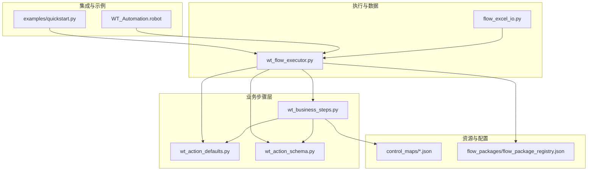
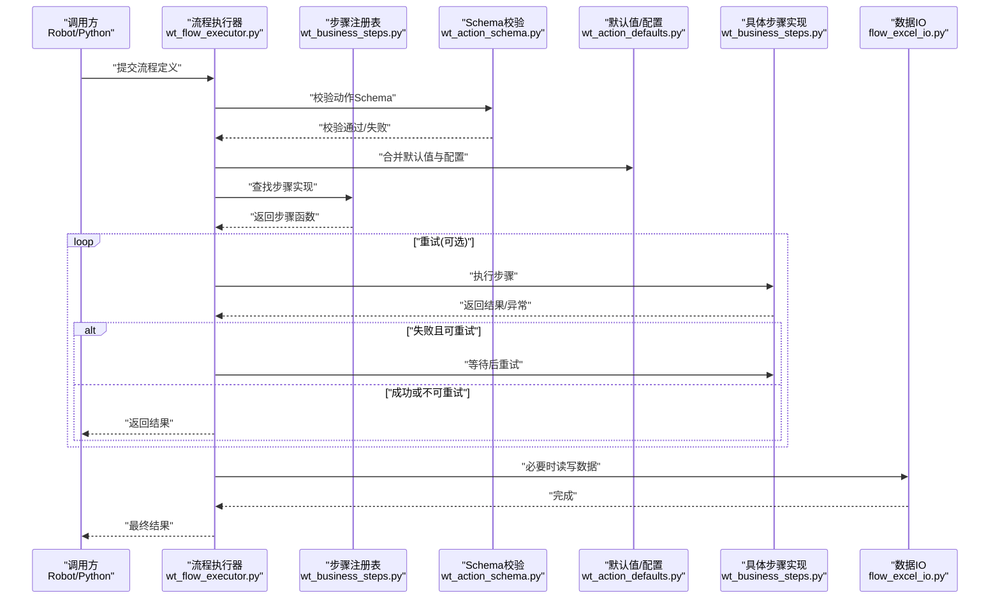
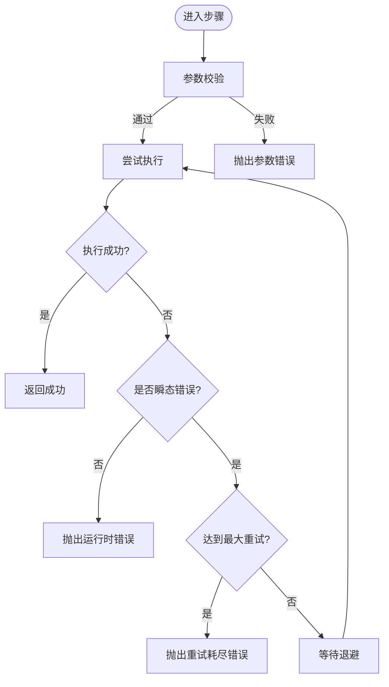
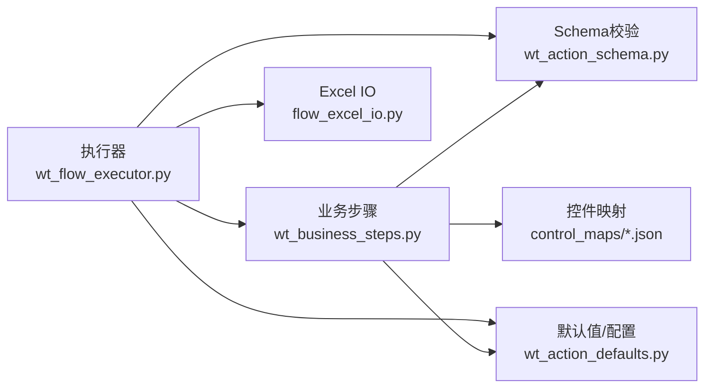

# 业务步骤库

<cite>
**本文引用的文件**   
- [wt_business_steps.py](file://wt_business_steps.py)
- [wt_action_defaults.py](file://wt_action_defaults.py)
- [wt_action_schema.py](file://wt_action_schema.py)
- [wt_flow_executor.py](file://wt_flow_executor.py)
- [flow_excel_io.py](file://flow_excel_io.py)
- [WT_Automation.robot](file://WT_Automation.robot)
- [examples/quickstart.py](file://WT_AUTOMATION_Agent/examples/quickstart.py)
- [control_maps/library_主面板_WPF_controls.json](file://control_maps/library_主面板_WPF_controls.json)
- [flow_packages/flow_package_registry.json](file://flow_packages/flow_package_registry.json)
</cite>

## 目录
1. [简介](#简介)
2. [项目结构](#项目结构)
3. [核心组件](#核心组件)
4. [架构总览](#架构总览)
5. [详细组件分析](#详细组件分析)
6. [依赖关系分析](#依赖关系分析)
7. [性能考虑](#性能考虑)
8. [故障排查指南](#故障排查指南)
9. [结论](#结论)
10. [附录](#附录)

## 简介
本文件面向WT自动化框架的业务步骤库，系统性梳理内置业务步骤、参数与返回值约定、默认值机制、配置管理、扩展规范、组合模式与最佳实践、错误处理与重试策略，以及并行执行与性能优化建议。文档同时提供实际业务场景示例和复杂工作流实现方法，帮助使用者快速上手并高效构建稳定可靠的自动化流程。

## 项目结构
WT自动化框架围绕“动作定义—校验—执行—报告”的链路组织代码。业务步骤库位于顶层Python模块中，并通过JSON控制映射与流程包注册表进行扩展与装配。关键文件职责如下：
- wt_business_steps.py：业务步骤实现与注册入口
- wt_action_defaults.py：动作默认值与全局配置
- wt_action_schema.py：动作Schema校验与字段约束
- wt_flow_executor.py：流程执行器（调度、重试、并发）
- flow_excel_io.py：Excel数据读写工具
- WT_Automation.robot：Robot Framework集成用例
- examples/quickstart.py：快速开始示例
- control_maps/*.json：控件定位库与控制映射
- flow_packages/flow_package_registry.json：流程包注册清单

图表来源
- [wt_business_steps.py](file://wt_business_steps.py)
- [wt_action_defaults.py](file://wt_action_defaults.py)
- [wt_action_schema.py](file://wt_action_schema.py)
- [wt_flow_executor.py](file://wt_flow_executor.py)
- [flow_excel_io.py](file://flow_excel_io.py)
- [WT_Automation.robot](file://WT_Automation.robot)
- [examples/quickstart.py](file://WT_AUTOMATION_Agent/examples/quickstart.py)
- [control_maps/library_主面板_WPF_controls.json](file://control_maps/library_主面板_WPF_controls.json)
- [flow_packages/flow_package_registry.json](file://flow_packages/flow_package_registry.json)

章节来源
- [wt_business_steps.py](file://wt_business_steps.py)
- [wt_action_defaults.py](file://wt_action_defaults.py)
- [wt_action_schema.py](file://wt_action_schema.py)
- [wt_flow_executor.py](file://wt_flow_executor.py)
- [flow_excel_io.py](file://flow_excel_io.py)
- [WT_Automation.robot](file://WT_Automation.robot)
- [examples/quickstart.py](file://WT_AUTOMATION_Agent/examples/quickstart.py)
- [control_maps/library_主面板_WPF_controls.json](file://control_maps/library_主面板_WPF_controls.json)
- [flow_packages/flow_package_registry.json](file://flow_packages/flow_package_registry.json)

## 核心组件
- 业务步骤实现与注册：集中定义各类业务步骤函数，并提供统一的注册机制供执行器发现与调用。
- 动作默认值与配置：通过默认值字典与配置文件为步骤参数提供缺省行为，支持按环境或任务覆盖。
- 动作Schema校验：对输入参数进行类型、必填项、取值范围等校验，确保步骤健壮性。
- 流程执行器：负责解析流程、加载步骤、顺序/并行执行、重试与结果聚合。
- Excel数据IO：提供批量数据读取/写入能力，支撑数据驱动测试与报表生成。
- Robot集成与示例：提供Robot关键字与快速开始脚本，便于非Python用户接入。

章节来源
- [wt_business_steps.py](file://wt_business_steps.py)
- [wt_action_defaults.py](file://wt_action_defaults.py)
- [wt_action_schema.py](file://wt_action_schema.py)
- [wt_flow_executor.py](file://wt_flow_executor.py)
- [flow_excel_io.py](file://flow_excel_io.py)

## 架构总览
下图展示从“流程定义”到“步骤执行”的关键路径，包括校验、默认值填充、执行与重试、结果返回。

图表来源
- [wt_flow_executor.py](file://wt_flow_executor.py)
- [wt_business_steps.py](file://wt_business_steps.py)
- [wt_action_schema.py](file://wt_action_schema.py)
- [wt_action_defaults.py](file://wt_action_defaults.py)
- [flow_excel_io.py](file://flow_excel_io.py)

## 详细组件分析

### 业务步骤分类与能力概览
- 文件操作类
  - 常见能力：打开/保存/导出文件、复制/移动/删除、批量导入/导出、模板替换、路径解析。
  - 典型参数：源路径、目标路径、文件名、编码、是否覆盖、过滤条件。
  - 返回值：操作状态、影响行数/文件数、错误信息摘要。
- 数据处理类
  - 常见能力：Excel读写、CSV/JSON解析、列映射、去重、排序、分组统计、格式转换。
  - 典型参数：文件路径、工作表名、列名映射、数据类型、输出路径。
  - 返回值：记录数、变更统计、异常详情。
- UI交互类
  - 常见能力：窗口定位、控件点击、文本输入、下拉选择、截图比对、等待就绪。
  - 典型参数：控件标识、窗口标题、相对区域、超时时间、重试次数。
  - 返回值：交互结果、控件属性快照、截图路径。
- 系统控制类
  - 常见能力：进程启动/停止、环境变量设置、服务启停、日志采集。
  - 典型参数：命令/服务名、参数、超时、工作目录。
  - 返回值：退出码、标准输出/错误、运行时长。

说明：以上为通用能力归纳，具体可用步骤以实现为准。

章节来源
- [wt_business_steps.py](file://wt_business_steps.py)
- [flow_excel_io.py](file://flow_excel_io.py)
- [control_maps/library_主面板_WPF_controls.json](file://control_maps/library_主面板_WPF_controls.json)

### 动作默认值机制与配置管理
- 默认值来源
  - 步骤级默认值：在步骤定义中声明各参数的缺省值。
  - 全局默认值：在默认值配置文件中统一维护，避免重复声明。
  - 运行时覆盖：通过执行器传入的配置对象覆盖默认值。
- 合并策略
  - 优先级：运行时配置 > 步骤级默认值 > 全局默认值。
  - 类型安全：合并前进行类型校验，防止非法覆盖。
- 配置管理
  - 配置文件位置：集中存放于默认值模块或外部配置中心。
  - 多环境支持：通过环境变量或配置键前缀区分开发/测试/生产。
  - 热更新：支持在不重启的情况下刷新部分配置项。

章节来源
- [wt_action_defaults.py](file://wt_action_defaults.py)
- [wt_action_schema.py](file://wt_action_schema.py)
- [wt_flow_executor.py](file://wt_flow_executor.py)

### 自定义业务步骤扩展规范
- 开发规范
  - 命名约定：步骤函数采用可读性强的动词短语命名，如“打开文件”、“选择下拉项”。
  - 参数设计：所有参数具备明确类型与默认值；敏感参数支持掩码或加密存储。
  - 返回值约定：统一返回结构化结果，包含状态、数据与错误信息。
  - 幂等性：尽量保证多次执行结果一致，便于重试与回滚。
- 接口定义
  - 注册接口：通过注册表将步骤名映射到实现函数。
  - Schema接口：为每个步骤声明参数Schema，用于静态校验。
  - 生命周期钩子：可选的前置/后置钩子，用于日志、指标与清理。
- 单元测试
  - 断言要点：正常路径、边界条件、异常分支与重试路径。
  - Mock策略：对外部依赖（文件系统、UI、网络）使用Mock隔离。

章节来源
- [wt_business_steps.py](file://wt_business_steps.py)
- [wt_action_schema.py](file://wt_action_schema.py)
- [wt_flow_executor.py](file://wt_flow_executor.py)

### 步骤的组合使用模式与最佳实践
- 组合模式
  - 串行编排：按依赖顺序依次执行，适用于强依赖场景。
  - 并行编排：无依赖步骤并行执行，提升吞吐。
  - 条件分支：根据上一步结果动态选择后续步骤。
  - 循环与批处理：对数据集进行迭代处理，结合分页与限流。
- 最佳实践
  - 原子化：单步只完成单一职责，便于复用与排错。
  - 可观测：每一步输出必要上下文（ID、耗时、关键指标）。
  - 容错：对不稳定操作设置合理重试与退避策略。
  - 可配置：将易变参数外置，避免硬编码。

章节来源
- [wt_flow_executor.py](file://wt_flow_executor.py)
- [WT_Automation.robot](file://WT_Automation.robot)
- [examples/quickstart.py](file://WT_AUTOMATION_Agent/examples/quickstart.py)

### 错误处理与重试机制
- 错误分类
  - 参数错误：Schema校验失败或缺失必填项。
  - 运行时错误：IO异常、UI定位失败、权限不足等。
  - 业务错误：数据不一致、状态不满足前置条件。
- 重试策略
  - 触发条件：仅对瞬态错误启用重试。
  - 退避算法：固定间隔、指数退避、抖动随机化。
  - 最大次数与超时：防止无限重试与长时间阻塞。
- 恢复与补偿
  - 事务式步骤：支持成功提交与失败回滚。
  - 补偿动作：在失败时执行清理或修复逻辑。

图表来源
- [wt_flow_executor.py](file://wt_flow_executor.py)
- [wt_action_schema.py](file://wt_action_schema.py)

章节来源
- [wt_flow_executor.py](file://wt_flow_executor.py)
- [wt_action_schema.py](file://wt_action_schema.py)

### 性能优化与并行执行策略
- 并行执行
  - 线程池/进程池：根据I/O或CPU密集特性选择合适的并发模型。
  - 资源隔离：避免共享状态冲突，必要时加锁或分片。
  - 背压与限流：对下游系统施加速率限制，保护稳定性。
- 缓存与复用
  - 控件缓存：对频繁使用的控件句柄进行缓存。
  - 数据缓存：对大文件或查询结果做内存/磁盘缓存。
- 异步与事件驱动
  - 事件监听：基于UI事件或消息队列减少轮询开销。
  - 非阻塞等待：使用超时与回调替代忙等。

章节来源
- [wt_flow_executor.py](file://wt_flow_executor.py)
- [flow_excel_io.py](file://flow_excel_io.py)

### 实际业务场景示例与复杂工作流
- 场景一：气象数据录入
  - 步骤序列：读取Excel → 数据清洗 → 逐行创建气象对象 → 保存并验证。
  - 关键点：列映射配置、批量插入、失败行记录。
- 场景二：新建风机类型与曲线
  - 步骤序列：打开主面板 → 创建风机类型 → 上传曲线文件 → 校验结果。
  - 关键点：控件定位库、截图比对、重试与回退。
- 场景三：微尺度建模与导入测风塔/机位点
  - 步骤序列：初始化模型 → 导入站点数据 → 运行计算 → 导出报告。
  - 关键点：长耗时任务监控、进度上报、断点续跑。

章节来源
- [WT_Automation.robot](file://WT_Automation.robot)
- [examples/quickstart.py](file://WT_AUTOMATION_Agent/examples/quickstart.py)
- [control_maps/library_主面板_WPF_controls.json](file://control_maps/library_主面板_WPF_controls.json)

## 依赖关系分析
- 内部依赖
  - 业务步骤依赖Schema校验与默认值模块，确保参数正确性与一致性。
  - 执行器依赖步骤注册表与默认值，负责调度、重试与并发。
  - Excel IO作为数据层被执行器与步骤按需调用。
- 外部依赖
  - UI自动化后端（WPF/Win32）通过控件映射库进行定位。
  - 操作系统API用于进程管理与文件操作。
- 潜在风险
  - 循环依赖：需避免步骤与执行器之间的双向引用。
  - 资源竞争：并发访问同一文件/控件时需加锁或序列化。

图表来源
- [wt_business_steps.py](file://wt_business_steps.py)
- [wt_action_schema.py](file://wt_action_schema.py)
- [wt_action_defaults.py](file://wt_action_defaults.py)
- [wt_flow_executor.py](file://wt_flow_executor.py)
- [flow_excel_io.py](file://flow_excel_io.py)
- [control_maps/library_主面板_WPF_controls.json](file://control_maps/library_主面板_WPF_controls.json)

章节来源
- [wt_business_steps.py](file://wt_business_steps.py)
- [wt_flow_executor.py](file://wt_flow_executor.py)
- [control_maps/library_主面板_WPF_controls.json](file://control_maps/library_主面板_WPF_controls.json)

## 性能考虑
- 减少UI轮询：优先使用事件驱动与控件就绪信号。
- 批量操作：合并小文件写入为大块写入，降低I/O开销。
- 并发粒度：按步骤级别而非函数级别拆分，避免过度细粒度的上下文切换。
- 资源预热：提前加载常用控件与模板，缩短冷启动时间。
- 监控与度量：收集步骤耗时、成功率与重试率，指导优化。

[本节为通用指导，无需特定文件来源]

## 故障排查指南
- 常见问题
  - 参数校验失败：检查Schema定义与实际传参类型是否一致。
  - 控件定位失败：核对控件映射库与当前UI版本差异。
  - 重试耗尽：调整退避策略与最大重试次数，定位瞬态原因。
  - 并发冲突：增加互斥或改为串行执行受影响步骤。
- 诊断手段
  - 开启详细日志：记录步骤入参、出参与关键中间状态。
  - 截图与录屏：在UI失败时自动保存现场证据。
  - 最小复现：抽取失败步骤的最小流程进行独立验证。

章节来源
- [wt_action_schema.py](file://wt_action_schema.py)
- [wt_flow_executor.py](file://wt_flow_executor.py)
- [control_maps/library_主面板_WPF_controls.json](file://control_maps/library_主面板_WPF_controls.json)

## 结论
WT自动化框架的业务步骤库以“标准化参数—严格校验—灵活默认—稳健执行”为核心设计理念，配合控件映射与流程包注册，形成可扩展、可观测、可运维的自动化体系。遵循本文档的扩展规范与最佳实践，可快速构建高质量的业务步骤与复杂工作流，并在性能与稳定性之间取得良好平衡。

[本节为总结性内容，无需特定文件来源]

## 附录
- 快速开始
  - 参考示例脚本了解基本用法与流程定义方式。
- 流程包注册
  - 通过注册表统一管理流程包，便于分发与版本控制。
- 控件库维护
  - 定期更新控件映射，适配UI变更与漂移问题。

章节来源
- [examples/quickstart.py](file://WT_AUTOMATION_Agent/examples/quickstart.py)
- [flow_packages/flow_package_registry.json](file://flow_packages/flow_package_registry.json)
- [control_maps/library_主面板_WPF_controls.json](file://control_maps/library_主面板_WPF_controls.json)