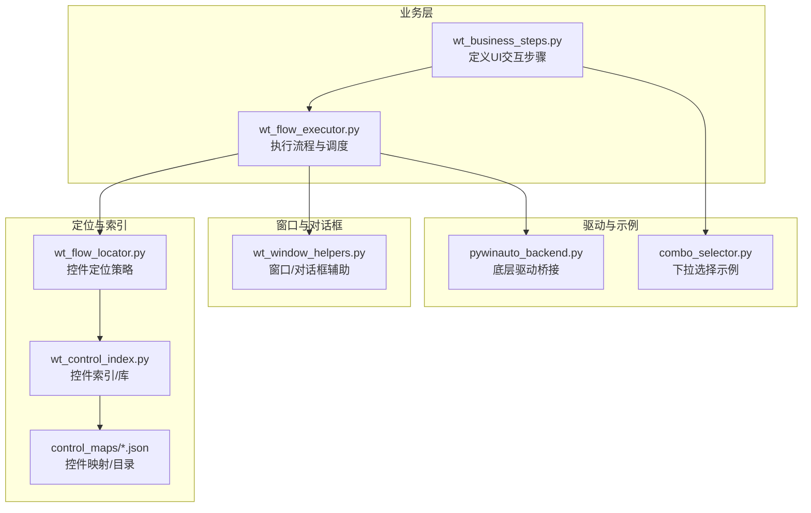
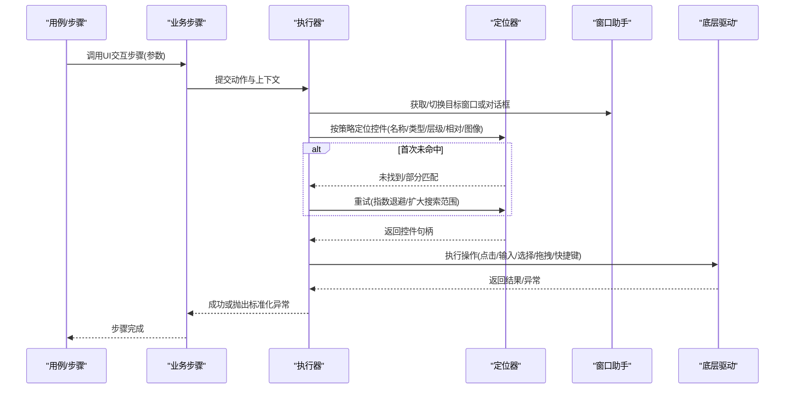
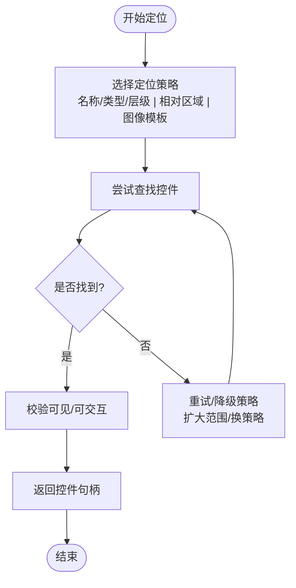
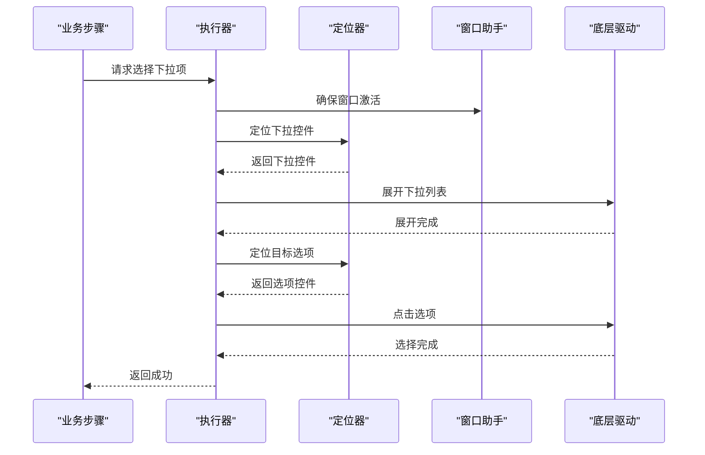
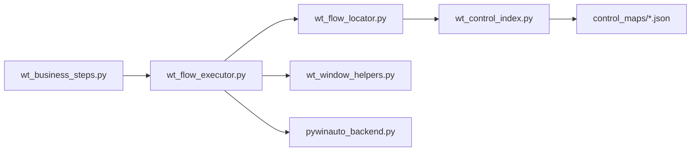

# UI交互类步骤

<cite>
**本文引用的文件**   
- [wt_business_steps.py](file://wt_business_steps.py)
- [wt_flow_locator.py](file://wt_flow_locator.py)
- [wt_window_helpers.py](file://wt_window_helpers.py)
- [wt_flow_executor.py](file://wt_flow_executor.py)
- [wt_action_schema.py](file://wt_action_schema.py)
- [wt_control_index.py](file://wt_control_index.py)
- [control_maps/standard_catalog_mismatch_report.json](file://control_maps/standard_catalog_mismatch_report.json)
- [control_maps/标准控件目录.json](file://control_maps/标准控件目录.json)
- [tools/external_capture/pywinauto_backend.py](file://tools/external_capture/pywinauto_backend.py)
- [samples/recorder_scripts/Skill/combo_selector.py](file://samples/recorder_scripts/Skill/combo_selector.py)
</cite>

## 目录
1. [简介](#简介)
2. [项目结构](#项目结构)
3. [核心组件](#核心组件)
4. [架构总览](#架构总览)
5. [详细组件分析](#详细组件分析)
6. [依赖关系分析](#依赖关系分析)
7. [性能考虑](#性能考虑)
8. [故障排查指南](#故障排查指南)
9. [结论](#结论)
10. [附录](#附录)

## 简介
本章节聚焦WT自动化框架中的“UI交互类业务步骤”，覆盖基础与高级界面操作，包括点击、输入文本、选择下拉框、勾选复选框、窗口切换、对话框处理、键盘快捷键模拟、鼠标拖拽等。文档将系统阐述：
- 控件定位策略（名称、类型、层级、相对区域、图像匹配）
- 等待机制（显式/隐式、条件就绪）
- 异常处理与重试逻辑
- UI元素识别最佳实践与常见问题解决方案
- 跨平台兼容性考量与性能优化建议

## 项目结构
围绕UI交互的关键代码集中在以下模块：
- 业务步骤定义与编排：wt_business_steps.py
- 控件定位与查找：wt_flow_locator.py、wt_control_index.py
- 窗口与对话框管理：wt_window_helpers.py
- 执行器与动作调度：wt_flow_executor.py
- 动作模式与参数校验：wt_action_schema.py
- 外部捕获与底层驱动桥接：tools/external_capture/pywinauto_backend.py
- 示例与录制脚本：samples/recorder_scripts/Skill/combo_selector.py
- 控件库与映射：control_maps/*.json

图表来源
- [wt_business_steps.py](file://wt_business_steps.py)
- [wt_flow_executor.py](file://wt_flow_executor.py)
- [wt_flow_locator.py](file://wt_flow_locator.py)
- [wt_control_index.py](file://wt_control_index.py)
- [wt_window_helpers.py](file://wt_window_helpers.py)
- [tools/external_capture/pywinauto_backend.py](file://tools/external_capture/pywinauto_backend.py)
- [samples/recorder_scripts/Skill/combo_selector.py](file://samples/recorder_scripts/Skill/combo_selector.py)

章节来源
- [wt_business_steps.py](file://wt_business_steps.py)
- [wt_flow_locator.py](file://wt_flow_locator.py)
- [wt_window_helpers.py](file://wt_window_helpers.py)
- [wt_flow_executor.py](file://wt_flow_executor.py)
- [wt_action_schema.py](file://wt_action_schema.py)
- [wt_control_index.py](file://wt_control_index.py)
- [tools/external_capture/pywinauto_backend.py](file://tools/external_capture/pywinauto_backend.py)
- [samples/recorder_scripts/Skill/combo_selector.py](file://samples/recorder_scripts/Skill/combo_selector.py)

## 核心组件
- UI交互步骤定义：集中封装常用UI操作为可复用步骤，提供统一参数与错误语义。
- 控件定位器：支持多种定位策略（名称、类型、层级、相对区域、图像模板），并内置重试与超时控制。
- 窗口与对话框助手：负责窗口激活、焦点切换、模态对话框等待与关闭。
- 执行器：解析动作模式、校验参数、调用定位器与驱动，组织等待与重试。
- 动作模式与校验：通过schema约束步骤参数，确保输入合法与一致性。
- 控件索引与映射：维护控件库与映射文件，提升稳定性与自修复能力。
- 底层驱动桥接：封装pywinauto等后端，屏蔽差异并提供稳定接口。

章节来源
- [wt_business_steps.py](file://wt_business_steps.py)
- [wt_flow_locator.py](file://wt_flow_locator.py)
- [wt_window_helpers.py](file://wt_window_helpers.py)
- [wt_flow_executor.py](file://wt_flow_executor.py)
- [wt_action_schema.py](file://wt_action_schema.py)
- [wt_control_index.py](file://wt_control_index.py)
- [tools/external_capture/pywinauto_backend.py](file://tools/external_capture/pywinauto_backend.py)

## 架构总览
UI交互从业务步骤到执行器，再到定位器与驱动，形成清晰分层。定位器在失败时触发重试与降级策略；窗口助手保障上下文正确；执行器统一协调等待与异常上报。

图表来源
- [wt_business_steps.py](file://wt_business_steps.py)
- [wt_flow_executor.py](file://wt_flow_executor.py)
- [wt_flow_locator.py](file://wt_flow_locator.py)
- [wt_window_helpers.py](file://wt_window_helpers.py)
- [tools/external_capture/pywinauto_backend.py](file://tools/external_capture/pywinauto_backend.py)

## 详细组件分析

### 基础UI操作步骤
- 点击：支持普通点击、双击、右键点击；可指定坐标偏移与相对区域；对不可见/被遮挡控件进行可见性检查与滚动对齐。
- 输入文本：支持清空后输入、追加输入、粘贴；针对只读/禁用状态进行前置校验；对输入法状态进行兼容处理。
- 选择下拉框：先展开下拉列表，再按文本/索引/值选择；支持模糊匹配与去重；对动态加载项进行等待。
- 勾选复选框：根据当前状态执行勾选/取消；对动画/延迟渲染进行等待；对分组容器内的子项进行层级定位。

定位策略
- 名称/类型/层级组合优先，辅以相对区域缩小搜索空间。
- 当名称不稳定时，回退至图像模板匹配，结合多尺度与阈值容错。
- 使用控件索引与映射库提高命中率与自修复能力。

等待机制
- 显式等待：基于控件存在、可见、可交互、文本更新等条件。
- 隐式等待：全局默认超时与步进轮询。
- 条件就绪：如页面加载、数据刷新、弹窗出现等自定义条件。

异常与重试
- 标准化异常分类：未找到、不可交互、超时、权限/模态阻塞等。
- 重试策略：固定间隔与指数退避；最大次数与总超时限制。
- 降级路径：从精确匹配到模糊匹配，从UIA到Win32，从文本到图像。

章节来源
- [wt_business_steps.py](file://wt_business_steps.py)
- [wt_flow_locator.py](file://wt_flow_locator.py)
- [wt_control_index.py](file://wt_control_index.py)
- [control_maps/标准控件目录.json](file://control_maps/标准控件目录.json)

### 高级UI操作步骤
- 窗口切换：按标题/进程/类名激活窗口；处理最小化/隐藏状态；在多显示器环境下保持坐标一致。
- 对话框处理：自动识别确认/取消/是/否等常见按钮；支持超时与强制关闭；对嵌套对话框进行顺序处理。
- 键盘快捷键：组合键发送（Ctrl/Ctrl+Shift/Alt等）；对输入法与焦点进行前置检查；避免重复发送导致的状态不一致。
- 鼠标拖拽：源控件到目标控件的拖放；支持相对坐标与像素级偏移；对拖拽过程中的中间态进行等待与校验。

定位与等待
- 窗口级定位优先于全局坐标，减少分辨率差异影响。
- 对话框采用“存在且可交互”的条件等待，避免竞态。
- 拖拽前确保两端控件处于可交互状态，必要时滚动至可视区域。

异常与重试
- 窗口不存在或无焦点时，尝试重新激活与聚焦。
- 对话框未出现时，区分“确实未弹出”和“延迟弹出”，分别采取不同策略。
- 拖拽失败时，回退为“选中+键盘操作”或“坐标级移动”。

章节来源
- [wt_window_helpers.py](file://wt_window_helpers.py)
- [wt_flow_locator.py](file://wt_flow_locator.py)
- [wt_flow_executor.py](file://wt_flow_executor.py)

### 控件定位策略详解
- 名称/类型/层级：最稳定且高效，适合结构化UI。
- 相对区域：以父容器为基准，降低全局搜索成本。
- 图像模板：用于非标准控件或动态生成内容，需配合多尺度与相似度阈值。
- 控件索引/映射：利用库文件快速定位，支持版本演进下的兼容。

图表来源
- [wt_flow_locator.py](file://wt_flow_locator.py)
- [wt_control_index.py](file://wt_control_index.py)
- [control_maps/标准控件目录.json](file://control_maps/标准控件目录.json)

章节来源
- [wt_flow_locator.py](file://wt_flow_locator.py)
- [wt_control_index.py](file://wt_control_index.py)
- [control_maps/标准控件目录.json](file://control_maps/标准控件目录.json)

### 下拉选择实现要点（示例）
- 展开下拉框：若不可见则先点击展开。
- 选择项匹配：支持文本、索引、值三种方式；模糊匹配需去重与提示。
- 动态加载：等待列表项出现后再选择。
- 状态校验：选择后验证显示文本或选中值。

图表来源
- [samples/recorder_scripts/Skill/combo_selector.py](file://samples/recorder_scripts/Skill/combo_selector.py)
- [wt_flow_executor.py](file://wt_flow_executor.py)
- [wt_flow_locator.py](file://wt_flow_locator.py)
- [wt_window_helpers.py](file://wt_window_helpers.py)
- [tools/external_capture/pywinauto_backend.py](file://tools/external_capture/pywinauto_backend.py)

章节来源
- [samples/recorder_scripts/Skill/combo_selector.py](file://samples/recorder_scripts/Skill/combo_selector.py)
- [wt_flow_executor.py](file://wt_flow_executor.py)
- [wt_flow_locator.py](file://wt_flow_locator.py)
- [wt_window_helpers.py](file://wt_window_helpers.py)
- [tools/external_capture/pywinauto_backend.py](file://tools/external_capture/pywinauto_backend.py)

### 动作模式与参数校验
- 动作模式：定义步骤类型（点击/输入/选择/拖拽/快捷键等）及其参数集合。
- 参数校验：必填字段、取值范围、互斥字段、依赖字段等。
- 默认值：为可选参数提供合理默认，简化用例编写。
- 错误消息：统一的错误码与人类可读信息，便于定位问题。

章节来源
- [wt_action_schema.py](file://wt_action_schema.py)
- [wt_flow_executor.py](file://wt_flow_executor.py)

## 依赖关系分析
- 业务步骤依赖执行器进行调度与编排。
- 执行器依赖定位器、窗口助手与底层驱动。
- 定位器依赖控件索引与映射库，支持多策略与降级。
- 底层驱动封装pywinauto等后端，屏蔽平台差异。

图表来源
- [wt_business_steps.py](file://wt_business_steps.py)
- [wt_flow_executor.py](file://wt_flow_executor.py)
- [wt_flow_locator.py](file://wt_flow_locator.py)
- [wt_window_helpers.py](file://wt_window_helpers.py)
- [wt_control_index.py](file://wt_control_index.py)
- [tools/external_capture/pywinauto_backend.py](file://tools/external_capture/pywinauto_backend.py)
- [control_maps/标准控件目录.json](file://control_maps/标准控件目录.json)

章节来源
- [wt_business_steps.py](file://wt_business_steps.py)
- [wt_flow_executor.py](file://wt_flow_executor.py)
- [wt_flow_locator.py](file://wt_flow_locator.py)
- [wt_window_helpers.py](file://wt_window_helpers.py)
- [wt_control_index.py](file://wt_control_index.py)
- [tools/external_capture/pywinauto_backend.py](file://tools/external_capture/pywinauto_backend.py)
- [control_maps/标准控件目录.json](file://control_maps/标准控件目录.json)

## 性能考虑
- 定位策略优先级：名称/类型/层级 > 相对区域 > 图像模板，减少昂贵操作。
- 搜索范围收敛：尽量限定父容器或相对区域，降低遍历开销。
- 等待策略优化：使用条件等待替代固定sleep；合并多次等待为一次复合条件。
- 重试退避：指数退避避免风暴式重试；设置最大次数与总超时。
- 图像匹配优化：预缓存模板、多尺度降采样、阈值调优。
- 驱动调用批量化：减少频繁往返，批量执行相关操作。
- 资源清理：及时释放控件句柄与临时对象，避免内存泄漏。

[本节为通用指导，不直接分析具体文件]

## 故障排查指南
- 定位失败
  - 现象：找不到控件或匹配不稳定。
  - 排查：检查名称/类型/层级是否正确；查看相对区域是否有效；确认控件是否可见/可交互；尝试降级到图像匹配。
  - 参考：定位策略与重试逻辑。
- 等待超时
  - 现象：操作因等待条件未满足而超时。
  - 排查：确认条件是否真实反映就绪状态；调整超时与轮询间隔；增加日志输出关键状态。
- 窗口/对话框异常
  - 现象：窗口未激活、对话框未弹出或无法关闭。
  - 排查：检查窗口标题/进程/类名；确认模态阻塞；使用窗口助手进行强制激活与关闭。
- 输入/选择异常
  - 现象：输入无效、选择未生效。
  - 排查：检查控件只读/禁用状态；确认输入法；对下拉框先展开再选择；验证选择后的显示文本。
- 拖拽失败
  - 现象：拖拽无响应或落点错误。
  - 排查：确认两端控件可交互；滚动至可视区域；使用相对坐标与像素偏移微调。

章节来源
- [wt_flow_locator.py](file://wt_flow_locator.py)
- [wt_window_helpers.py](file://wt_window_helpers.py)
- [wt_flow_executor.py](file://wt_flow_executor.py)
- [control_maps/标准控件目录.json](file://control_maps/标准控件目录.json)

## 结论
WT自动化框架的UI交互类步骤通过分层架构与多策略定位，提供了稳定、可扩展的界面自动化能力。借助完善的等待、异常与重试机制，以及控件索引与映射库的支持，能够在复杂UI环境中保持较高的鲁棒性与可维护性。遵循本文的最佳实践与性能建议，可进一步提升自动化脚本的可靠性与执行效率。

[本节为总结性内容，不直接分析具体文件]

## 附录
- 控件库与映射
  - 标准控件目录：用于统一命名与类型规范，提升定位稳定性。
  - 不匹配报告：记录控件库与实际UI的差异，辅助持续维护。
- 跨平台兼容性
  - 后端驱动抽象：通过pywinauto后端桥接，屏蔽Windows特定API差异。
  - 输入法与键盘事件：在不同语言环境下保持一致行为。
- 常见问题速查
  - 下拉选择失败：先展开再选择；使用模糊匹配去重；等待动态加载。
  - 对话框处理：识别常见按钮；超时与强制关闭；嵌套对话框顺序处理。
  - 拖拽定位：相对坐标优于绝对坐标；必要时回退为键盘操作。

章节来源
- [control_maps/标准控件目录.json](file://control_maps/标准控件目录.json)
- [control_maps/standard_catalog_mismatch_report.json](file://control_maps/standard_catalog_mismatch_report.json)
- [tools/external_capture/pywinauto_backend.py](file://tools/external_capture/pywinauto_backend.py)