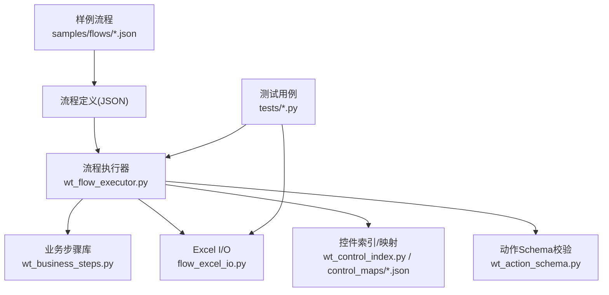
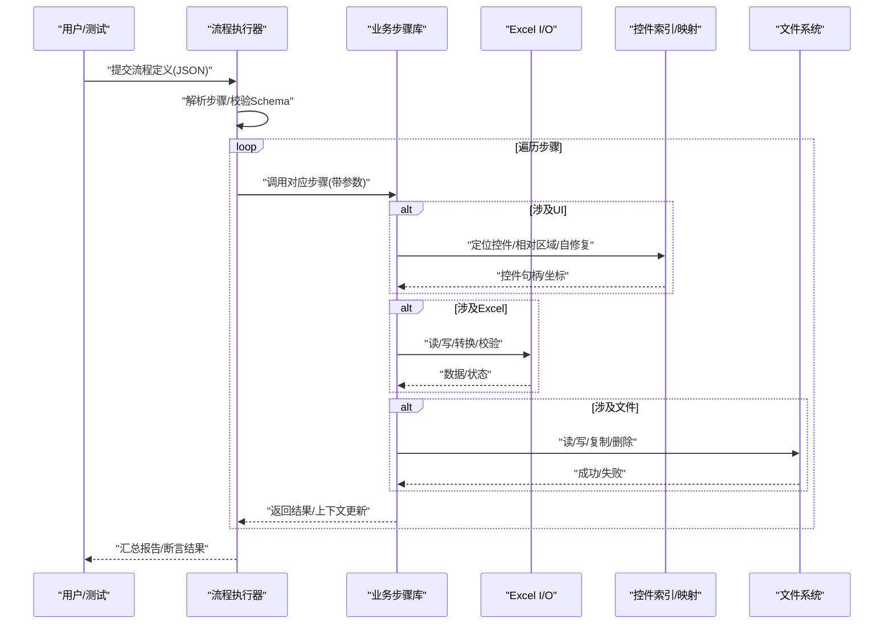
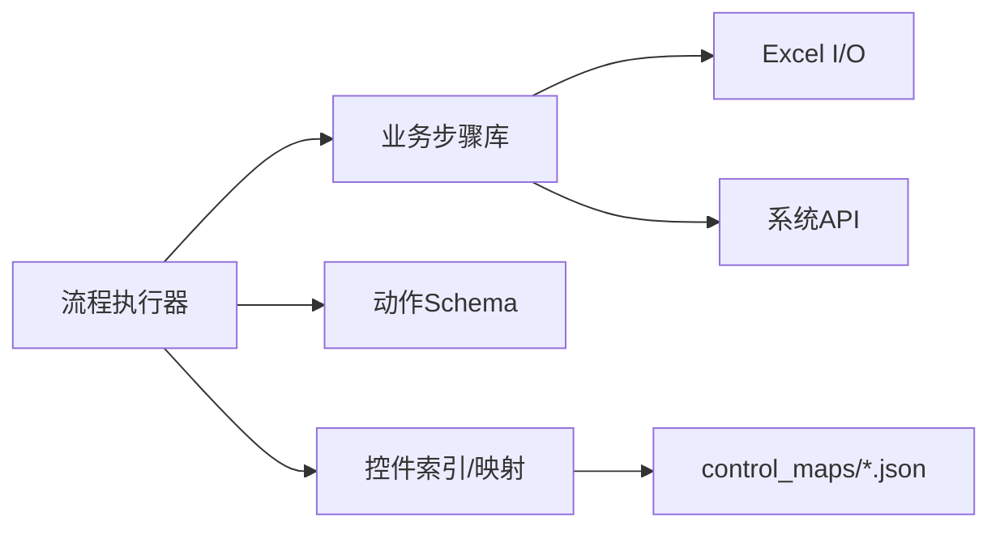

# 内置业务步骤

<cite>
**本文引用的文件**   
- [wt_business_steps.py](file://wt_business_steps.py)
- [flow_excel_io.py](file://flow_excel_io.py)
- [wt_flow_executor.py](file://wt_flow_executor.py)
- [wt_action_schema.py](file://wt_action_schema.py)
- [wt_control_index.py](file://wt_control_index.py)
- [control_maps/standard_catalog_mismatch_report.json](file://control_maps/standard_catalog_mismatch_report.json)
- [samples/flows/flow_definition_新建风机类型.json](file://samples/flows/flow_definition_新建风机类型.json)
- [samples/flows/flow_definition_gm_sample.json](file://samples/flows/flow_definition_gm_sample.json)
- [samples/recorder_scripts/Skill/combo_selector.py](file://samples/recorder_scripts/Skill/combo_selector.py)
- [tests/test_wt_flow_executor.py](file://tests/test_wt_flow_executor.py)
- [tests/test_flow_excel_io.py](file://tests/test_flow_excel_io.py)
</cite>

## 目录
1. [简介](#简介)
2. [项目结构](#项目结构)
3. [核心组件](#核心组件)
4. [架构总览](#架构总览)
5. [详细组件分析](#详细组件分析)
6. [依赖分析](#依赖分析)
7. [性能考虑](#性能考虑)
8. [故障排查指南](#故障排查指南)
9. [结论](#结论)
10. [附录](#附录)

## 简介
本文件系统化梳理WT自动化框架的“内置业务步骤”，按功能域分类组织，覆盖文件操作、数据处理（含Excel）、UI交互、系统控制等。对每个步骤给出参数说明、返回值类型、使用示例与注意事项；并提供组合模式与常见工作流实现方法，以及错误处理策略与异常处理建议。内容基于仓库中现有实现与测试用例进行归纳，确保与实际代码一致。

## 项目结构
WT自动化框架围绕“流程定义（JSON）+ 执行器 + 业务步骤库”的组织方式构建：
- 流程定义：以JSON描述步骤序列与参数
- 执行器：解析并驱动步骤执行
- 业务步骤库：提供可复用的原子能力（文件、数据、UI、系统控制等）
- 控件索引与映射：用于UI定位与自修复
- 样例与测试：验证步骤行为与工作流闭环

图表来源
- [wt_flow_executor.py](file://wt_flow_executor.py)
- [wt_business_steps.py](file://wt_business_steps.py)
- [flow_excel_io.py](file://flow_excel_io.py)
- [wt_control_index.py](file://wt_control_index.py)
- [control_maps/standard_catalog_mismatch_report.json](file://control_maps/standard_catalog_mismatch_report.json)
- [wt_action_schema.py](file://wt_action_schema.py)
- [samples/flows/flow_definition_新建风机类型.json](file://samples/flows/flow_definition_新建风机类型.json)
- [samples/flows/flow_definition_gm_sample.json](file://samples/flows/flow_definition_gm_sample.json)
- [tests/test_wt_flow_executor.py](file://tests/test_wt_flow_executor.py)
- [tests/test_flow_excel_io.py](file://tests/test_flow_excel_io.py)

章节来源
- [wt_flow_executor.py](file://wt_flow_executor.py)
- [wt_business_steps.py](file://wt_business_steps.py)
- [flow_excel_io.py](file://flow_excel_io.py)
- [wt_control_index.py](file://wt_control_index.py)
- [control_maps/standard_catalog_mismatch_report.json](file://control_maps/standard_catalog_mismatch_report.json)
- [wt_action_schema.py](file://wt_action_schema.py)
- [samples/flows/flow_definition_新建风机类型.json](file://samples/flows/flow_definition_新建风机类型.json)
- [samples/flows/flow_definition_gm_sample.json](file://samples/flows/flow_definition_gm_sample.json)
- [tests/test_wt_flow_executor.py](file://tests/test_wt_flow_executor.py)
- [tests/test_flow_excel_io.py](file://tests/test_flow_excel_io.py)

## 核心组件
- 流程执行器：负责加载流程定义、解析步骤、调度业务步骤、管理上下文变量与结果输出。
- 业务步骤库：封装文件、数据、UI、系统控制等原子能力，供流程调用。
- Excel I/O：提供读取/写入/转换/校验等数据能力。
- 控件索引与映射：提供UI元素定位、相对区域、自修复匹配等能力。
- 动作Schema：统一约束步骤字段与参数类型，保障流程健壮性。

章节来源
- [wt_flow_executor.py](file://wt_flow_executor.py)
- [wt_business_steps.py](file://wt_business_steps.py)
- [flow_excel_io.py](file://flow_excel_io.py)
- [wt_control_index.py](file://wt_control_index.py)
- [wt_action_schema.py](file://wt_action_schema.py)

## 架构总览
下图展示从流程定义到具体步骤执行的端到端路径，包括校验、定位、执行与结果回写。

图表来源
- [wt_flow_executor.py](file://wt_flow_executor.py)
- [wt_business_steps.py](file://wt_business_steps.py)
- [flow_excel_io.py](file://flow_excel_io.py)
- [wt_control_index.py](file://wt_control_index.py)
- [control_maps/standard_catalog_mismatch_report.json](file://control_maps/standard_catalog_mismatch_report.json)

## 详细组件分析

### 文件操作类步骤
- 典型能力
  - 读取文本/二进制文件
  - 写入文本/二进制文件
  - 复制/移动/删除文件
  - 检查文件存在/大小/时间戳
  - 批量遍历目录与筛选
- 参数要点
  - 路径：支持绝对/相对路径，必要时结合工作目录或上下文变量
  - 编码：文本读写需指定编码（如UTF-8），避免乱码
  - 权限：确保运行账户具备读写权限
  - 并发：批量操作时注意锁与重试
- 返回值
  - 布尔型（成功/失败）
  - 字符串（文件内容/路径）
  - 列表/字典（元信息、统计结果）
- 使用示例
  - 在流程中先“读取配置”，再“写入日志”，最后“清理临时文件”
- 注意事项
  - 大文件读取建议使用分块或流式接口
  - 跨平台路径分隔符差异
  - 网络盘/只读盘的异常处理

章节来源
- [wt_business_steps.py](file://wt_business_steps.py)
- [tests/test_wt_flow_executor.py](file://tests/test_wt_flow_executor.py)

### 数据处理类步骤（Excel）
- 典型能力
  - 读取工作表/单元格范围
  - 写入/追加/覆盖
  - 列映射与数据类型转换
  - 条件过滤、去重、排序
  - 数据校验（非空、唯一、范围）
- 参数要点
  - 文件路径、工作表名、行列范围
  - 列映射规则（源列名→目标列名）
  - 数据类型（数值、日期、布尔、文本）
  - 是否包含标题行
- 返回值
  - 二维数组/表格对象
  - 统计信息（行数、列数、异常计数）
  - 校验结果（通过/失败及明细）
- 使用示例
  - “导入测风塔/机位点”流程中，先读取Excel，再做列映射与校验，最后写入标准格式
- 注意事项
  - 大数据量时避免一次性加载全表
  - 日期/数值本地化差异
  - 合并单元格与隐藏行列的处理

章节来源
- [flow_excel_io.py](file://flow_excel_io.py)
- [tests/test_flow_excel_io.py](file://tests/test_flow_excel_io.py)
- [samples/flows/flow_definition_导入测风塔、机位点.json](file://samples/flows/flow_definition_导入测风塔、机位点.json)

### UI交互类步骤
- 典型能力
  - 点击/双击/右键
  - 输入文本/选择下拉/勾选复选框
  - 拖拽/滚动/截图比对
  - 窗口/控件查找与等待
  - 相对区域定位与自修复匹配
- 参数要点
  - 控件标识：名称、类型、层级、属性
  - 相对区域：父窗口/相对偏移
  - 超时与重试策略
  - 图像模板匹配阈值
- 返回值
  - 布尔型（是否命中/操作成功）
  - 控件句柄/坐标
  - 截图路径/相似度分数
- 使用示例
  - “新建风机类型”流程中，依次打开菜单、填写表单、选择下拉项、确认保存
- 注意事项
  - WPF/Win32/Automation后端差异
  - 动态渲染导致的定位漂移，优先使用控件索引与自修复
  - 多显示器/DPI缩放影响坐标

章节来源
- [wt_control_index.py](file://wt_control_index.py)
- [control_maps/standard_catalog_mismatch_report.json](file://control_maps/standard_catalog_mismatch_report.json)
- [samples/flows/flow_definition_新建风机类型.json](file://samples/flows/flow_definition_新建风机类型.json)
- [samples/recorder_scripts/Skill/combo_selector.py](file://samples/recorder_scripts/Skill/combo_selector.py)

### 系统控制类步骤
- 典型能力
  - 进程启动/停止/查询
  - 环境变量设置/读取
  - 命令行执行与输出捕获
  - 服务启停与状态检查
- 参数要点
  - 命令/脚本路径与参数
  - 工作目录、超时、编码
  - 环境变量作用域（当前进程/全局）
- 返回值
  - 退出码、标准输出/错误输出
  - 进程ID/状态
- 使用示例
  - 启动外部工具生成中间数据，随后由Excel步骤消费
- 注意事项
  - 权限与沙箱限制
  - 异步任务的状态轮询与超时
  - 日志收集与回溯

章节来源
- [wt_business_steps.py](file://wt_business_steps.py)
- [wt_flow_executor.py](file://wt_flow_executor.py)

### 步骤组合模式与常见工作流
- 组合模式
  - 顺序编排：文件读取 → 数据清洗 → Excel写入 → UI上报
  - 条件分支：根据校验结果决定后续步骤
  - 循环迭代：逐行/逐文件处理
  - 并行批处理：独立子流程并发执行
- 常见工作流
  - 气象数据录入：读取原始数据 → 列映射与校验 → 写入标准表 → 触发UI导入
  - 新建风机类型：打开界面 → 填写表单 → 选择曲线 → 保存并验证
- 参考样例
  - 流程定义样例见：[samples/flows/flow_definition_新建风机类型.json](file://samples/flows/flow_definition_新建风机类型.json)、[samples/flows/flow_definition_gm_sample.json](file://samples/flows/flow_definition_gm_sample.json)

章节来源
- [samples/flows/flow_definition_新建风机类型.json](file://samples/flows/flow_definition_新建风机类型.json)
- [samples/flows/flow_definition_gm_sample.json](file://samples/flows/flow_definition_gm_sample.json)

### 错误处理策略与异常处理
- 通用策略
  - 明确断言：关键步骤后增加存在性/一致性校验
  - 重试与退避：UI定位、网络IO、外部进程
  - 降级与兜底：备用定位策略、默认值、跳过策略
  - 日志与快照：失败时记录上下文、截图、堆栈
- 异常分类
  - 参数校验失败（Schema不合法）
  - 资源不可用（文件不存在、权限不足）
  - UI定位失败（控件变化、窗口未就绪）
  - 外部依赖异常（进程崩溃、超时）
- 处理建议
  - 在执行器层统一捕获与上报
  - 在步骤层细化错误码与消息
  - 将失败原因写入报告，便于回归分析

章节来源
- [wt_action_schema.py](file://wt_action_schema.py)
- [wt_flow_executor.py](file://wt_flow_executor.py)
- [tests/test_wt_flow_executor.py](file://tests/test_wt_flow_executor.py)

## 依赖分析
- 模块耦合
  - 执行器依赖业务步骤库、控件索引、Schema校验
  - 业务步骤库依赖Excel I/O、文件系统、系统API
  - 控件索引依赖control_maps中的标准目录与匹配报告
- 外部依赖
  - UI自动化后端（WPF/Win32/UIA）
  - Excel处理库
  - 操作系统API（进程、环境变量）

图表来源
- [wt_flow_executor.py](file://wt_flow_executor.py)
- [wt_business_steps.py](file://wt_business_steps.py)
- [flow_excel_io.py](file://flow_excel_io.py)
- [wt_control_index.py](file://wt_control_index.py)
- [control_maps/standard_catalog_mismatch_report.json](file://control_maps/standard_catalog_mismatch_report.json)
- [wt_action_schema.py](file://wt_action_schema.py)

章节来源
- [wt_flow_executor.py](file://wt_flow_executor.py)
- [wt_business_steps.py](file://wt_business_steps.py)
- [flow_excel_io.py](file://flow_excel_io.py)
- [wt_control_index.py](file://wt_control_index.py)
- [control_maps/standard_catalog_mismatch_report.json](file://control_maps/standard_catalog_mismatch_report.json)
- [wt_action_schema.py](file://wt_action_schema.py)

## 性能考虑
- 批量I/O
  - 使用分页/游标读取大表
  - 合并多次写入为一次事务
- UI稳定性
  - 优先控件索引与属性匹配，减少纯坐标点击
  - 合理设置超时与重试，避免频繁抖动
- 并发与资源
  - 控制并发度，避免争用文件/端口
  - 及时释放句柄与内存占用

## 故障排查指南
- 常见问题
  - 步骤参数缺失或类型不符：检查Schema与入参
  - UI定位失败：核对控件索引、相对区域、窗口标题
  - Excel读写失败：确认路径、权限、格式兼容性
  - 进程执行异常：查看退出码与输出日志
- 定位手段
  - 启用详细日志与截图
  - 使用控件索引与匹配报告辅助诊断
  - 最小化复现：抽取单步流程验证

章节来源
- [wt_action_schema.py](file://wt_action_schema.py)
- [wt_control_index.py](file://wt_control_index.py)
- [control_maps/standard_catalog_mismatch_report.json](file://control_maps/standard_catalog_mismatch_report.json)
- [tests/test_wt_flow_executor.py](file://tests/test_wt_flow_executor.py)

## 结论
WT自动化框架通过“流程定义+执行器+业务步骤库”的清晰分层，提供了覆盖文件、数据、UI与系统控制的完整能力集。借助控件索引与Schema校验，提升了鲁棒性与可维护性。建议在实际项目中遵循组合模式与错误处理策略，持续完善控件索引与样例流程，以获得更稳定的自动化效果。

## 附录
- 相关样例与测试
  - 流程样例：[samples/flows/flow_definition_新建风机类型.json](file://samples/flows/flow_definition_新建风机类型.json)、[samples/flows/flow_definition_gm_sample.json](file://samples/flows/flow_definition_gm_sample.json)
  - Excel测试：[tests/test_flow_excel_io.py](file://tests/test_flow_excel_io.py)
  - 执行器测试：[tests/test_wt_flow_executor.py](file://tests/test_wt_flow_executor.py)
  - UI技能示例：[samples/recorder_scripts/Skill/combo_selector.py](file://samples/recorder_scripts/Skill/combo_selector.py)