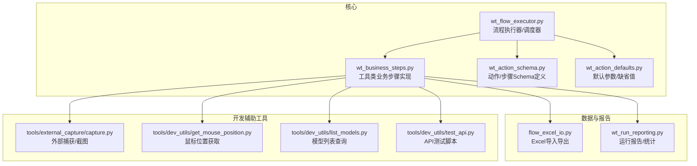
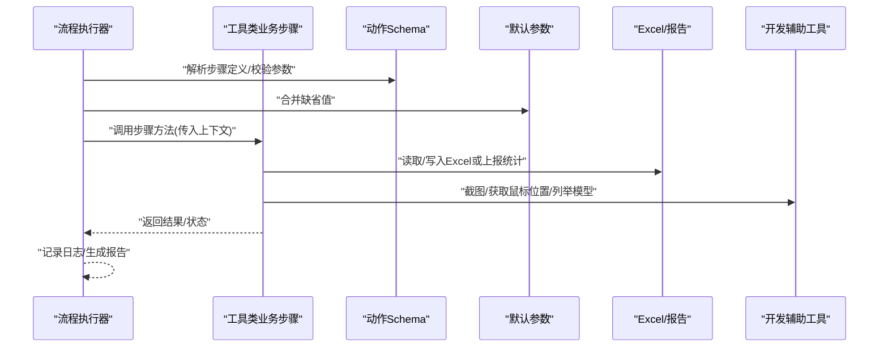
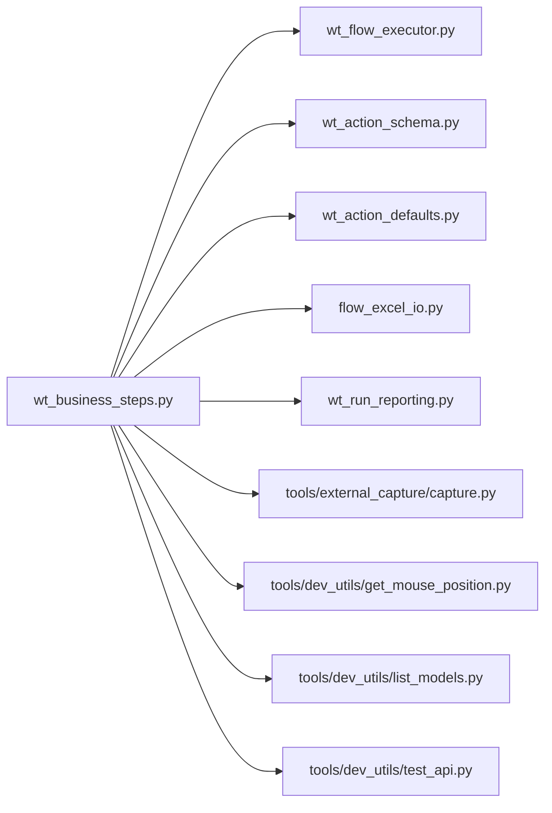

# 工具类步骤

<cite>
**本文引用的文件**   
- [wt_business_steps.py](file://wt_business_steps.py)
- [wt_flow_executor.py](file://wt_flow_executor.py)
- [wt_action_schema.py](file://wt_action_schema.py)
- [wt_action_defaults.py](file://wt_action_defaults.py)
- [flow_excel_io.py](file://flow_excel_io.py)
- [wt_run_reporting.py](file://wt_run_reporting.py)
- [tools/external_capture/capture.py](file://tools/external_capture/capture.py)
- [tools/dev_utils/get_mouse_position.py](file://tools/dev_utils/get_mouse_position.py)
- [tools/dev_utils/list_models.py](file://tools/dev_utils/list_models.py)
- [tools/dev_utils/test_api.py](file://tools/dev_utils/test_api.py)
</cite>

## 目录
1. [简介](#简介)
2. [项目结构](#项目结构)
3. [核心组件](#核心组件)
4. [架构总览](#架构总览)
5. [详细组件分析](#详细组件分析)
6. [依赖关系分析](#依赖关系分析)
7. [性能考虑](#性能考虑)
8. [故障排查指南](#故障排查指南)
9. [结论](#结论)
10. [附录](#附录)

## 简介
本章节面向WT自动化框架中的“工具类业务步骤”，聚焦通用能力与开发辅助能力两大方面：
- 通用工具能力：时间日期处理、字符串操作、数学计算、加密解密、网络请求、日志记录等。
- 调试辅助能力：断点设置、变量查看、执行跟踪等，帮助快速定位问题与提升迭代效率。

文档将说明每个步骤的参数配置、返回值格式、使用场景与最佳实践，并提供常用组合模式与扩展建议，以及性能基准测试与优化建议。

## 项目结构
WT自动化框架围绕“流程定义—执行引擎—业务步骤”组织。工具类业务步骤主要位于业务步骤模块中，并通过执行引擎注册与调度；同时提供若干开发期工具脚本用于捕获、诊断与测试。

图表来源
- [wt_business_steps.py](file://wt_business_steps.py)
- [wt_flow_executor.py](file://wt_flow_executor.py)
- [wt_action_schema.py](file://wt_action_schema.py)
- [wt_action_defaults.py](file://wt_action_defaults.py)
- [flow_excel_io.py](file://flow_excel_io.py)
- [wt_run_reporting.py](file://wt_run_reporting.py)
- [tools/external_capture/capture.py](file://tools/external_capture/capture.py)
- [tools/dev_utils/get_mouse_position.py](file://tools/dev_utils/get_mouse_position.py)
- [tools/dev_utils/list_models.py](file://tools/dev_utils/list_models.py)
- [tools/dev_utils/test_api.py](file://tools/dev_utils/test_api.py)

章节来源
- [wt_business_steps.py](file://wt_business_steps.py)
- [wt_flow_executor.py](file://wt_flow_executor.py)
- [wt_action_schema.py](file://wt_action_schema.py)
- [wt_action_defaults.py](file://wt_action_defaults.py)
- [flow_excel_io.py](file://flow_excel_io.py)
- [wt_run_reporting.py](file://wt_run_reporting.py)
- [tools/external_capture/capture.py](file://tools/external_capture/capture.py)
- [tools/dev_utils/get_mouse_position.py](file://tools/dev_utils/get_mouse_position.py)
- [tools/dev_utils/list_models.py](file://tools/dev_utils/list_models.py)
- [tools/dev_utils/test_api.py](file://tools/dev_utils/test_api.py)

## 核心组件
本节概述工具类业务步骤在框架中的角色与职责边界：
- 工具类业务步骤：封装通用能力（时间、字符串、数学、加解密、网络、日志等），以“步骤”的形式被流程调用，具备统一的输入输出契约。
- 执行器：负责解析流程定义、加载步骤、注入上下文、管理生命周期与错误传播。
- Schema与默认值：统一约束步骤参数类型、必填项、校验规则与缺省行为。
- 数据与报告：为步骤提供Excel读写、运行统计与结果上报能力。
- 开发辅助：提供截图、鼠标位置、模型枚举、API测试等便捷能力，加速调试与回归验证。

章节来源
- [wt_business_steps.py](file://wt_business_steps.py)
- [wt_flow_executor.py](file://wt_flow_executor.py)
- [wt_action_schema.py](file://wt_action_schema.py)
- [wt_action_defaults.py](file://wt_action_defaults.py)
- [flow_excel_io.py](file://flow_excel_io.py)
- [wt_run_reporting.py](file://wt_run_reporting.py)

## 架构总览
下图展示工具类业务步骤与执行器、Schema、默认值、数据IO与报告的交互关系。

图表来源
- [wt_flow_executor.py](file://wt_flow_executor.py)
- [wt_action_schema.py](file://wt_action_schema.py)
- [wt_action_defaults.py](file://wt_action_defaults.py)
- [wt_business_steps.py](file://wt_business_steps.py)
- [flow_excel_io.py](file://flow_excel_io.py)
- [wt_run_reporting.py](file://wt_run_reporting.py)
- [tools/external_capture/capture.py](file://tools/external_capture/capture.py)
- [tools/dev_utils/get_mouse_position.py](file://tools/dev_utils/get_mouse_position.py)
- [tools/dev_utils/list_models.py](file://tools/dev_utils/list_models.py)

## 详细组件分析

### 时间与日期处理步骤
- 功能要点
  - 当前时间/日期格式化、时区转换、相对时间偏移（天/小时/分钟/秒）。
  - 时间戳与可读时间的互转、起止时间区间生成。
- 参数配置
  - 输入：目标格式、时区、偏移量单位与数值、是否包含毫秒等。
  - 输出：标准化时间字符串或时间戳。
- 返回值格式
  - 字符串型时间或数值型时间戳，具体取决于参数选择。
- 使用场景
  - 构造文件名、日志标签、报表周期、定时任务触发条件。
- 最佳实践
  - 统一时区策略（如UTC+8）并在流程入口处显式声明。
  - 对关键时间点进行幂等性校验，避免重复生成导致覆盖。
- 性能建议
  - 批量生成时间序列时，预分配容器并复用格式化模板。

章节来源
- [wt_business_steps.py](file://wt_business_steps.py)

### 字符串操作步骤
- 功能要点
  - 拼接、分割、替换、大小写转换、去空白、正则匹配与提取。
  - 编码/解码（如Base64）、URL编解码、JSON序列化/反序列化。
- 参数配置
  - 输入：原始字符串、分隔符、替换规则、正则表达式、编码方式等。
  - 输出：处理后字符串或结构化对象（字典/列表）。
- 返回值格式
  - 字符串或JSON对象，视操作类型而定。
- 使用场景
  - 清洗脏数据、构造请求头/路径、解析响应体字段。
- 最佳实践
  - 对正则表达式进行编译缓存以提升性能。
  - 对敏感信息做脱敏后再落盘或上报。
- 性能建议
  - 大文本处理优先使用流式或分块策略，避免一次性加载。

章节来源
- [wt_business_steps.py](file://wt_business_steps.py)

### 数学计算步骤
- 功能要点
  - 基础算术、四舍五入、取整、范围限制、统计指标（均值/方差/百分位）。
  - 随机数生成、概率分布采样、线性插值。
- 参数配置
  - 输入：数值列表、阈值、分布参数、精度控制等。
  - 输出：标量或数组。
- 返回值格式
  - 数值类型或数值数组。
- 使用场景
  - 数据归一化、阈值判定、模拟数据生成。
- 最佳实践
  - 对除零、空集、NaN/Inf进行防御性检查。
  - 对浮点比较采用容差而非严格相等。
- 性能建议
  - 向量化运算优先于循环；必要时启用并行批处理。

章节来源
- [wt_business_steps.py](file://wt_business_steps.py)

### 加密解密步骤
- 功能要点
  - 对称/非对称加解密、哈希摘要、签名验签、口令派生。
- 参数配置
  - 输入：明文/密文、密钥材料、算法标识、填充模式、编码格式等。
  - 输出：密文/明文/摘要/签名。
- 返回值格式
  - Base64/Hex字符串或字节串。
- 使用场景
  - 安全传输、凭证存储、完整性校验。
- 最佳实践
  - 密钥管理走外部密钥服务，避免硬编码。
  - 固定时间比较防时序攻击；随机盐/IV不可重用。
- 性能建议
  - 批量加解密使用流式接口；合理选择硬件加速库。

章节来源
- [wt_business_steps.py](file://wt_business_steps.py)

### 网络请求步骤
- 功能要点
  - HTTP客户端封装：GET/POST/PUT/DELETE、重试、超时、代理、证书、鉴权。
  - 响应解析：JSON/XML/表单、分页拉取、限流与退避。
- 参数配置
  - 输入：URL、方法、头部、载荷、超时、重试次数、代理、TLS选项等。
  - 输出：响应体、状态码、耗时、错误信息。
- 返回值格式
  - 结构化响应对象（含状态码、内容、元数据）。
- 使用场景
  - 调用外部API、采集遥测数据、上传结果。
- 最佳实践
  - 连接池复用；失败指数退避；敏感头不落盘。
  - 对第三方接口增加熔断与降级策略。
- 性能建议
  - 并发请求需控制上限；按域名分池；压缩传输。

章节来源
- [wt_business_steps.py](file://wt_business_steps.py)

### 日志记录步骤
- 功能要点
  - 分级日志（DEBUG/INFO/WARN/ERROR）、结构化日志、上下文注入、轮转与过滤。
- 参数配置
  - 输入：日志级别、消息、键值对上下文、目标输出（控制台/文件/远端）。
  - 输出：无（副作用写入日志系统）。
- 返回值格式
  - 无返回值。
- 使用场景
  - 全链路追踪、审计留痕、问题复现。
- 最佳实践
  - 避免打印敏感信息；统一时间与时区；使用TraceID串联调用链。
- 性能建议
  - 异步落盘；批量写入；按需开启高开销字段。

章节来源
- [wt_business_steps.py](file://wt_business_steps.py)

### Excel数据读写步骤
- 功能要点
  - 读取/写入工作表、单元格范围、样式与公式、多Sheet合并。
- 参数配置
  - 输入：文件路径、工作表名、行列范围、数据类型映射、追加/覆盖模式。
  - 输出：成功标志、写入行数、异常信息。
- 返回值格式
  - 结构化结果对象（含计数与错误详情）。
- 使用场景
  - 批量录入、结果导出、对比差异。
- 最佳实践
  - 大数据量分批写入；关闭自动重算；使用只读模式提升读取性能。
- 性能建议
  - 内存映射或流式写入；避免频繁打开/关闭文件句柄。

章节来源
- [flow_excel_io.py](file://flow_excel_io.py)
- [wt_business_steps.py](file://wt_business_steps.py)

### 运行报告与统计步骤
- 功能要点
  - 收集步骤级耗时、成功率、错误分类、资源占用快照。
- 参数配置
  - 输入：报告目标（文件/数据库/远端）、聚合粒度、采样率。
  - 输出：报告路径或引用ID。
- 返回值格式
  - 报告元数据（路径、时间戳、摘要）。
- 使用场景
  - 质量度量、回归基线、容量规划。
- 最佳实践
  - 区分环境（开发/测试/生产）的报告隔离。
- 性能建议
  - 异步汇总；采样降频；增量写入。

章节来源
- [wt_run_reporting.py](file://wt_run_reporting.py)
- [wt_business_steps.py](file://wt_business_steps.py)

### 调试辅助工具
- 截图与可视化
  - 屏幕/窗口截图、区域裁剪、模板匹配辅助。
  - 适用：UI自动化定位失败时的现场取证。
- 鼠标位置与坐标
  - 获取当前光标坐标、相对窗口坐标转换。
  - 适用：点击漂移、相对定位校准。
- 模型/控件枚举
  - 列出可用模型或控件树，辅助构建定位器。
- API测试脚本
  - 快速验证后端接口连通性与响应结构。
- 最佳实践
  - 仅在调试开关开启时启用，避免影响生产性能。
  - 截图命名包含时间戳与用例ID，便于检索。

章节来源
- [tools/external_capture/capture.py](file://tools/external_capture/capture.py)
- [tools/dev_utils/get_mouse_position.py](file://tools/dev_utils/get_mouse_position.py)
- [tools/dev_utils/list_models.py](file://tools/dev_utils/list_models.py)
- [tools/dev_utils/test_api.py](file://tools/dev_utils/test_api.py)

### 步骤注册与执行契约
- 步骤注册
  - 通过Schema与默认值集中描述步骤参数、类型、校验与缺省行为。
- 执行契约
  - 统一的输入上下文、返回值结构与异常约定，确保可观测与可恢复。
- 组合模式
  - 将多个工具步骤编排为复合步骤，形成领域专用能力。
- 扩展方法
  - 新增步骤遵循Schema规范，注册到执行器后无需改动上层流程。

章节来源
- [wt_action_schema.py](file://wt_action_schema.py)
- [wt_action_defaults.py](file://wt_action_defaults.py)
- [wt_flow_executor.py](file://wt_flow_executor.py)
- [wt_business_steps.py](file://wt_business_steps.py)

## 依赖关系分析
工具类业务步骤对外部库的依赖主要集中在：
- 标准库：时间、字符串、数学、加密、网络、日志。
- 第三方库：Excel读写、HTTP客户端、图像处理、OCR（可选）。
- 内部模块：执行器、Schema、默认值、报告与Excel IO。

图表来源
- [wt_business_steps.py](file://wt_business_steps.py)
- [wt_flow_executor.py](file://wt_flow_executor.py)
- [wt_action_schema.py](file://wt_action_schema.py)
- [wt_action_defaults.py](file://wt_action_defaults.py)
- [flow_excel_io.py](file://flow_excel_io.py)
- [wt_run_reporting.py](file://wt_run_reporting.py)
- [tools/external_capture/capture.py](file://tools/external_capture/capture.py)
- [tools/dev_utils/get_mouse_position.py](file://tools/dev_utils/get_mouse_position.py)
- [tools/dev_utils/list_models.py](file://tools/dev_utils/list_models.py)
- [tools/dev_utils/test_api.py](file://tools/dev_utils/test_api.py)

章节来源
- [wt_business_steps.py](file://wt_business_steps.py)
- [wt_flow_executor.py](file://wt_flow_executor.py)
- [wt_action_schema.py](file://wt_action_schema.py)
- [wt_action_defaults.py](file://wt_action_defaults.py)
- [flow_excel_io.py](file://flow_excel_io.py)
- [wt_run_reporting.py](file://wt_run_reporting.py)
- [tools/external_capture/capture.py](file://tools/external_capture/capture.py)
- [tools/dev_utils/get_mouse_position.py](file://tools/dev_utils/get_mouse_position.py)
- [tools/dev_utils/list_models.py](file://tools/dev_utils/list_models.py)
- [tools/dev_utils/test_api.py](file://tools/dev_utils/test_api.py)

## 性能考虑
- 时间/字符串/数学
  - 批量处理优先使用向量化与预分配；正则表达式编译缓存；避免重复格式化。
- 加解密
  - 使用硬件加速库；批量操作采用流式接口；密钥材料最小权限访问。
- 网络请求
  - 连接池复用、并发上限控制、指数退避重试、超时与熔断。
- Excel读写
  - 只读模式、关闭自动重算、分批写入、避免频繁I/O切换。
- 日志与报告
  - 异步落盘、采样降频、结构化日志减少序列化成本。
- 基准测试建议
  - 针对热点函数建立微基准，关注P95/P99延迟与吞吐；在CI中定期回归。

[本节为通用指导，不直接分析具体文件]

## 故障排查指南
- 常见问题定位
  - 时间/时区不一致：确认全局时区设置与本地环境一致。
  - 字符串编码异常：统一UTF-8，检查源数据BOM与换行符。
  - 数学越界/NaN：增加边界检查与容差比较。
  - 网络超时/重试风暴：调整超时与退避参数，观察下游健康度。
  - Excel写入失败：检查文件占用、权限与格式兼容性。
  - 日志缺失：确认日志级别与输出目标配置。
- 调试技巧
  - 使用截图与鼠标位置工具定位UI偏差。
  - 通过模型/控件枚举核对定位器有效性。
  - 借助API测试脚本快速验证后端连通性。
- 恢复策略
  - 步骤级重试与补偿；失败回滚；断点与中间态保存。

章节来源
- [tools/external_capture/capture.py](file://tools/external_capture/capture.py)
- [tools/dev_utils/get_mouse_position.py](file://tools/dev_utils/get_mouse_position.py)
- [tools/dev_utils/list_models.py](file://tools/dev_utils/list_models.py)
- [tools/dev_utils/test_api.py](file://tools/dev_utils/test_api.py)

## 结论
工具类业务步骤是WT自动化框架的“能力原子”，通过统一的Schema与执行契约，实现了高内聚、低耦合的可复用能力集合。结合Excel读写、运行报告与开发辅助工具，能够显著提升自动化流程的稳定性与可维护性。建议在团队内沉淀常用组合模式，持续完善性能基准与回归策略，保障长期演进质量。

[本节为总结性内容，不直接分析具体文件]

## 附录
- 常用组合模式
  - “时间+字符串+网络”：生成带时间戳的请求路径与Header，发起HTTP请求并记录日志。
  - “Excel+数学+报告”：从表格读取样本，计算统计指标，输出报告与可视化附件。
  - “截图+鼠标+模型”：在UI定位失败时自动截取现场、记录光标位置并枚举候选控件。
- 自定义扩展建议
  - 新增步骤遵循Schema与默认值规范，注册至执行器；保持幂等与可观测。
  - 对热点路径编写微基准，纳入CI；对敏感能力（加解密/网络）增加安全扫描。

[本节为概念性内容，不直接分析具体文件]