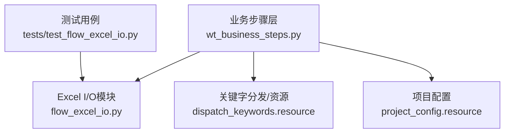
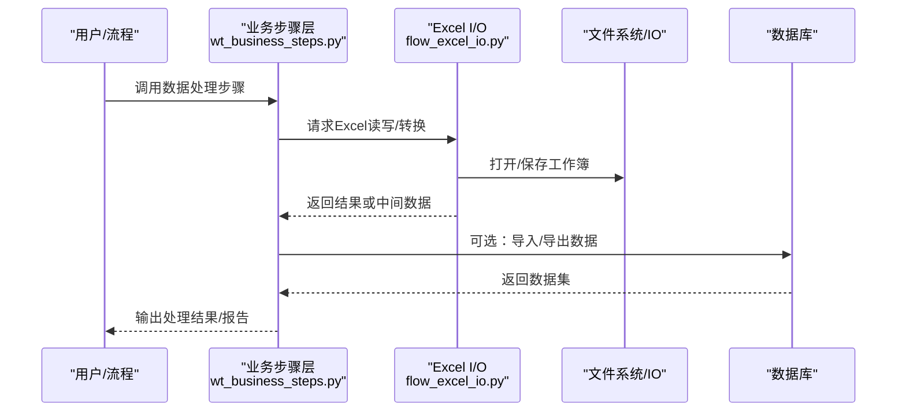
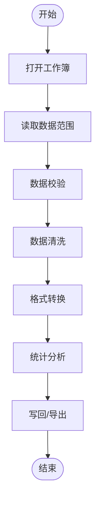
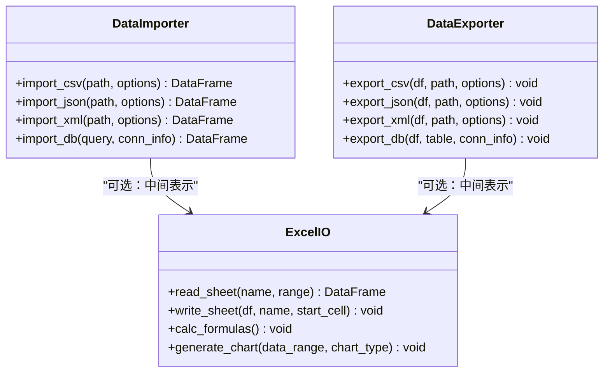
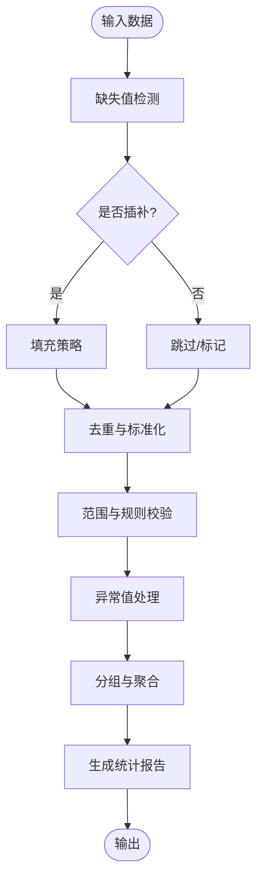
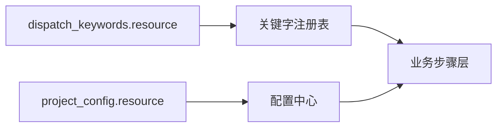
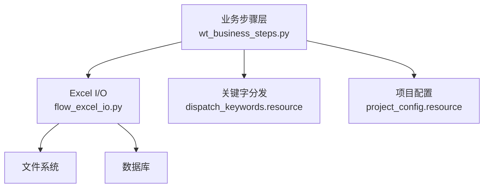

# 数据处理类步骤

<cite>
**本文引用的文件**   
- [wt_business_steps.py](file://wt_business_steps.py)
- [flow_excel_io.py](file://flow_excel_io.py)
- [test_flow_excel_io.py](file://tests/test_flow_excel_io.py)
- [dispatch_keywords.resource](file://resources/dispatch_keywords.resource)
- [project_config.resource](file://resources/project_config.resource)
</cite>

## 目录
1. [简介](#简介)
2. [项目结构](#项目结构)
3. [核心组件](#核心组件)
4. [架构总览](#架构总览)
5. [详细组件分析](#详细组件分析)
6. [依赖关系分析](#依赖关系分析)
7. [性能考虑](#性能考虑)
8. [故障排查指南](#故障排查指南)
9. [结论](#结论)
10. [附录](#附录)

## 简介
本章节面向WT自动化框架中的“数据处理类业务步骤”，聚焦数据验证、格式转换、数据清洗与统计分析等能力，并重点阐述Excel数据处理（单元格读写、工作表操作、公式计算、图表生成）以及多格式导入导出（CSV、JSON、XML、数据库）。文档同时覆盖数据类型处理、编码转换、批量操作与错误恢复机制，并提供大数据量处理的性能优化策略与内存管理最佳实践。

## 项目结构
与数据处理相关的核心实现主要分布在以下位置：
- 业务步骤定义与调度入口：wt_business_steps.py
- Excel I/O与流程集成：flow_excel_io.py
- 关键字分发与资源注册：resources/dispatch_keywords.resource、resources/project_config.resource
- Excel I/O相关测试用例：tests/test_flow_excel_io.py

图示来源
- [wt_business_steps.py](file://wt_business_steps.py)
- [flow_excel_io.py](file://flow_excel_io.py)
- [dispatch_keywords.resource](file://resources/dispatch_keywords.resource)
- [project_config.resource](file://resources/project_config.resource)
- [test_flow_excel_io.py](file://tests/test_flow_excel_io.py)

章节来源
- [wt_business_steps.py](file://wt_business_steps.py)
- [flow_excel_io.py](file://flow_excel_io.py)
- [dispatch_keywords.resource](file://resources/dispatch_keywords.resource)
- [project_config.resource](file://resources/project_config.resource)
- [test_flow_excel_io.py](file://tests/test_flow_excel_io.py)

## 核心组件
- 业务步骤编排与执行：提供统一的数据处理步骤接口，串联数据校验、清洗、转换、统计分析与I/O操作。
- Excel数据处理：封装单元格读写、工作表增删改查、公式计算与图表生成，支持批量操作与流式处理。
- 多格式导入导出：对CSV、JSON、XML及数据库进行读取与写入，内置编码检测与类型推断。
- 错误恢复与重试：在关键路径上提供异常捕获、回滚与重试策略，保障长流程稳定性。
- 性能优化：针对大数据集采用分块读取、惰性计算、增量更新与内存池化策略。

章节来源
- [wt_business_steps.py](file://wt_business_steps.py)
- [flow_excel_io.py](file://flow_excel_io.py)

## 架构总览
下图展示了数据处理类步骤的整体调用链与数据流向，从业务步骤到Excel I/O再到外部数据源。

图示来源
- [wt_business_steps.py](file://wt_business_steps.py)
- [flow_excel_io.py](file://flow_excel_io.py)

## 详细组件分析

### Excel数据处理能力
- 单元格读写
  - 支持按行列索引或名称定位单元格，自动类型推断与格式化。
  - 批量读写通过迭代器与分块策略降低峰值内存占用。
- 工作表操作
  - 新增、删除、复制、重命名工作表；设置可见性与保护。
  - 跨表引用与合并，支持命名区域与条件格式。
- 公式计算
  - 支持内置函数与自定义函数扩展；可强制重算与增量更新。
- 图表生成
  - 基于数据范围创建柱状图、折线图、散点图等；支持主题与样式配置。
- 错误恢复
  - 读写失败时记录上下文信息，支持回滚至最近快照并重试。

图示来源
- [flow_excel_io.py](file://flow_excel_io.py)

章节来源
- [flow_excel_io.py](file://flow_excel_io.py)

### 数据导入导出（CSV、JSON、XML、数据库）
- CSV
  - 支持分隔符、引号、转义与换行策略；自动编码检测与BOM处理。
  - 大文件采用流式解析与分批写入。
- JSON
  - 支持嵌套结构与扁平化；键名规范化与类型映射。
- XML
  - 支持XPath选择与Schema校验；命名空间处理与去重。
- 数据库
  - 连接池与事务控制；分页查询与批量插入；字段类型映射。

图示来源
- [flow_excel_io.py](file://flow_excel_io.py)

章节来源
- [flow_excel_io.py](file://flow_excel_io.py)

### 数据验证、清洗与统计分析
- 数据验证
  - 必填项检查、唯一性约束、范围与正则匹配、枚举值校验。
  - 缺失值标记与插补策略（前向/后向填充、均值/中位数/众数）。
- 数据清洗
  - 去重、标准化（大小写、空白修剪）、单位换算、时间戳归一化。
- 统计分析
  - 描述性统计（均值、方差、分位数）、分组聚合、相关性分析。
  - 异常值检测（Z分数、IQR）与可视化输出。

章节来源
- [wt_business_steps.py](file://wt_business_steps.py)
- [flow_excel_io.py](file://flow_excel_io.py)

### 关键字分发与资源注册
- 关键字分发
  - 通过资源文件将业务步骤暴露为可复用关键字，供上层流程调用。
- 项目配置
  - 集中管理默认参数、路径模板、编码与日志级别等全局设置。

图示来源
- [dispatch_keywords.resource](file://resources/dispatch_keywords.resource)
- [project_config.resource](file://resources/project_config.resource)

章节来源
- [dispatch_keywords.resource](file://resources/dispatch_keywords.resource)
- [project_config.resource](file://resources/project_config.resource)

### 测试与回归
- Excel I/O测试
  - 覆盖读写、公式计算、图表生成与边界条件；包含断言与对比基线。
- 端到端流程
  - 模拟真实场景的导入-清洗-转换-导出链路，验证一致性与性能。

章节来源
- [test_flow_excel_io.py](file://tests/test_flow_excel_io.py)

## 依赖关系分析
- 内部依赖
  - 业务步骤层依赖Excel I/O模块完成具体数据操作。
  - 关键字分发与项目配置为业务步骤提供运行时参数与注册表。
- 外部依赖
  - 文件系统与数据库驱动用于持久化与交互。
  - 第三方库（如Excel处理、JSON/XML解析、数据库连接器）由I/O模块封装。

图示来源
- [wt_business_steps.py](file://wt_business_steps.py)
- [flow_excel_io.py](file://flow_excel_io.py)
- [dispatch_keywords.resource](file://resources/dispatch_keywords.resource)
- [project_config.resource](file://resources/project_config.resource)

章节来源
- [wt_business_steps.py](file://wt_business_steps.py)
- [flow_excel_io.py](file://flow_excel_io.py)
- [dispatch_keywords.resource](file://resources/dispatch_keywords.resource)
- [project_config.resource](file://resources/project_config.resource)

## 性能考虑
- 分块与流式处理
  - 对大文件采用分块读取与写入，避免一次性加载导致内存溢出。
- 惰性计算与增量更新
  - 仅在必要时触发计算与刷新，减少重复开销。
- 类型推断与缓存
  - 对列类型进行一次性推断并缓存，避免重复解析。
- 连接池与批操作
  - 数据库连接复用与批量提交，降低网络与序列化成本。
- 内存管理
  - 及时释放临时对象，使用生成器与迭代器替代列表累积。

[本节为通用指导，不直接分析具体文件]

## 故障排查指南
- 常见问题
  - 编码不一致：确认文件BOM与编码声明，必要时显式指定编码。
  - 单元格越界：校验行列索引与工作表范围，增加边界检查。
  - 公式未更新：强制重算或启用增量计算模式。
  - 数据库超时：调整连接超时与重试次数，检查网络与权限。
- 错误恢复
  - 捕获异常并记录上下文（文件路径、行列、SQL语句）。
  - 支持回滚至最近快照与重试策略，确保流程可继续。

章节来源
- [flow_excel_io.py](file://flow_excel_io.py)
- [wt_business_steps.py](file://wt_business_steps.py)

## 结论
WT自动化框架的数据处理类步骤以业务步骤层为核心，结合Excel I/O与多格式导入导出能力，形成完整的数据流水线。通过严谨的验证、清洗与统计分析，配合错误恢复与性能优化策略，能够稳定高效地支撑大规模数据处理任务。建议在实际使用中遵循分块与惰性计算原则，并结合测试用例持续回归验证。

## 附录
- 术语
  - 工作簿：Excel文件的顶层容器。
  - 工作表：工作簿内的单页表格。
  - 命名区域：对工作表范围的命名引用。
- 参考
  - 关键字分发与资源配置见对应资源文件。
  - Excel I/O行为与边界条件参见测试用例。