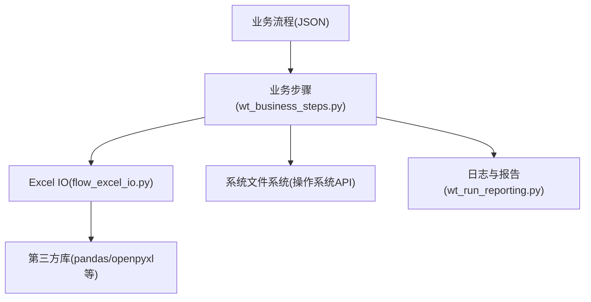
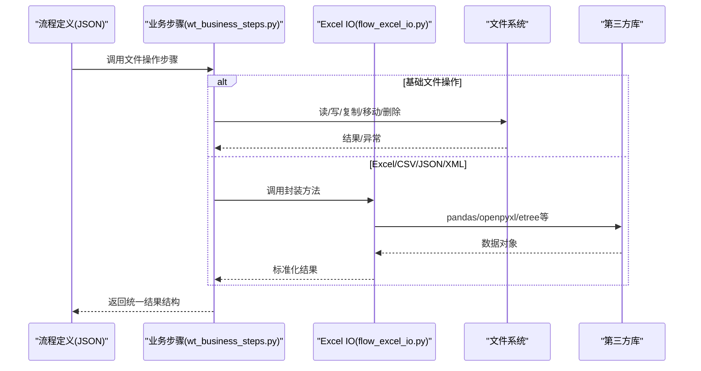
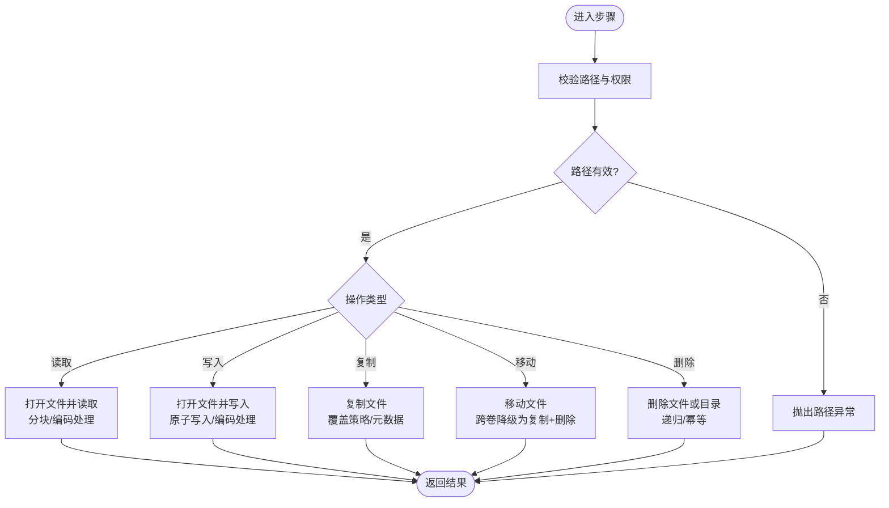
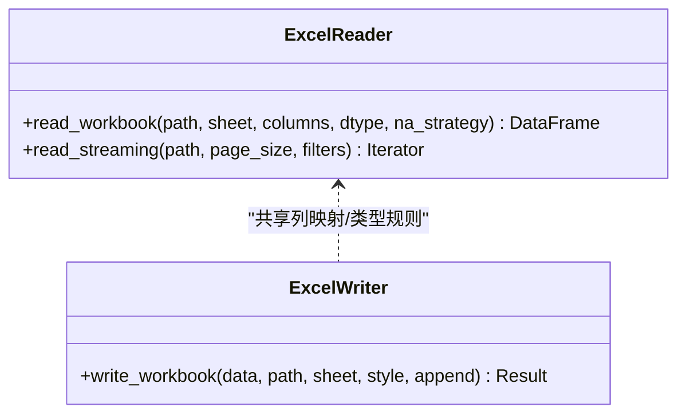
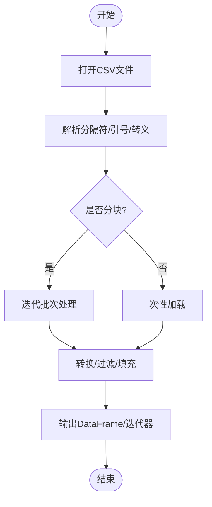
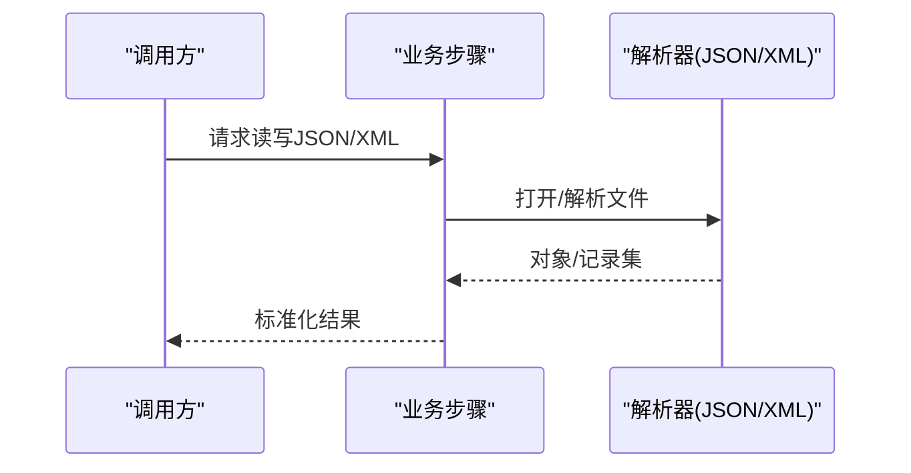
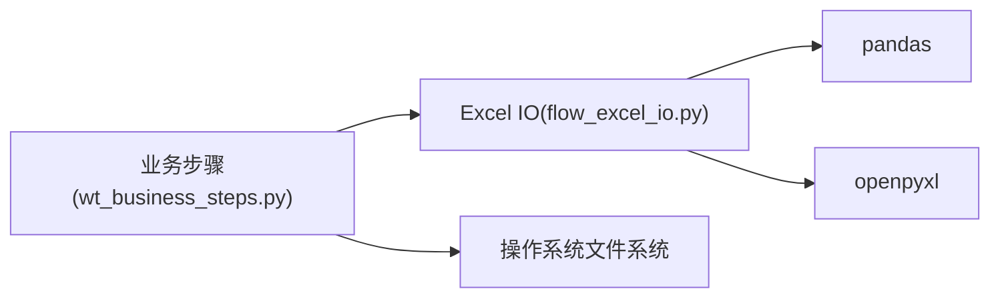

# 文件操作类步骤

<cite>
**本文引用的文件**   
- [wt_business_steps.py](file://wt_business_steps.py)
- [flow_excel_io.py](file://flow_excel_io.py)
- [test_flow_excel_io.py](file://tests/test_flow_excel_io.py)
- [flow_definition_geo_import_data_file.json](file://flow_packages/flow_definition_geo_import_data_file.json)
- [flow_definition_microscale_create_model.json](file://flow_packages/flow_definition_microscale_create_model.json)
- [flow_definition_turbine_type_create_and_curves.json](file://flow_packages/flow_definition_turbine_type_create_and_curves.json)
- [flow_definition_导入测风塔、机位点.json](file://flow_packages/flow_definition_导入测风塔、机位点.json)
- [flow_definition_新建风机类型.json](file://flow_packages/flow_definition_新建风机类型.json)
- [flow_definition_测试.json](file://flow_packages/flow_definition_测试.json)
- [气象数据录入_CFE02_steps.json](file://flow_packages/气象数据录入_CFE02_steps.json)
</cite>

## 目录
1. [简介](#简介)
2. [项目结构](#项目结构)
3. [核心组件](#核心组件)
4. [架构总览](#架构总览)
5. [详细组件分析](#详细组件分析)
6. [依赖关系分析](#依赖关系分析)
7. [性能考虑](#性能考虑)
8. [故障排查指南](#故障排查指南)
9. [结论](#结论)
10. [附录](#附录)

## 简介
本章节聚焦WT自动化框架中的“文件操作类业务步骤”，覆盖基础文件操作（读取、写入、复制、移动、删除）与高级文件处理（Excel、CSV、JSON/XML读写）。文档将说明各步骤的参数配置、返回值类型、使用示例与注意事项，并提供路径处理最佳实践、错误处理策略以及大文件处理的性能优化建议。

## 项目结构
围绕文件操作能力，仓库中与“文件IO”直接相关的核心实现与用例如下：
- wt_business_steps.py：业务步骤入口，集中暴露供流程编排调用的方法（如文件读写、复制、移动、删除等）。
- flow_excel_io.py：面向Excel的专用IO工具与封装，提供列映射、批量读写、流式处理等能力。
- tests/test_flow_excel_io.py：针对Excel IO能力的单元测试，验证边界条件与异常路径。
- flow_packages/*.json：流程定义与步骤清单，展示如何组合调用上述步骤完成端到端任务（如导入地理数据、创建模型、导入测风塔/机位点、新建风机类型等）。

图表来源
- [wt_business_steps.py](file://wt_business_steps.py)
- [flow_excel_io.py](file://flow_excel_io.py)
- [test_flow_excel_io.py](file://tests/test_flow_excel_io.py)

章节来源
- [wt_business_steps.py](file://wt_business_steps.py)
- [flow_excel_io.py](file://flow_excel_io.py)
- [test_flow_excel_io.py](file://tests/test_flow_excel_io.py)

## 核心组件
本节对“文件操作类业务步骤”的核心能力进行分层梳理，并给出参数、返回、示例与注意事项的要点。

- 基础文件操作
  - 读取文件：支持文本/二进制模式；可指定编码、行缓冲或分块读取；返回内容字符串或字节序列。
  - 写入文件：支持覆盖/追加；可指定编码与换行符；返回是否成功及写入字节数。
  - 复制文件：支持覆盖策略与元数据保留；返回目标路径或失败原因。
  - 移动文件：支持跨盘/跨卷迁移；返回新路径或异常信息。
  - 删除文件/目录：支持递归删除与幂等处理；返回清理结果。
- Excel文件处理
  - 读取工作簿：按表名/索引定位；支持列映射、数据类型推断、空值策略；返回DataFrame或字典列表。
  - 写入工作簿：多表写入、样式与公式支持；返回保存路径与统计信息。
  - 流式处理：基于分页/游标的增量读写，降低内存占用。
- CSV数据处理
  - 读取CSV：分隔符、引号、转义、缺失值填充；支持大文件分块迭代。
  - 写入CSV：字段顺序控制、编码与换行策略；支持追加模式。
- JSON/XML读写
  - JSON：结构化对象序列化/反序列化；支持Schema校验与默认值回填。
  - XML：节点选择、属性提取、命名空间处理；支持流式解析避免大文档OOM。
- 路径与权限
  - 路径规范化、相对路径解析、绝对路径生成、跨平台兼容。
  - 权限检查与自动创建父目录；失败时抛出明确异常。

章节来源
- [wt_business_steps.py](file://wt_business_steps.py)
- [flow_excel_io.py](file://flow_excel_io.py)

## 架构总览
下图展示了从“流程定义”到“业务步骤”再到“具体IO实现”的调用链与数据流向。

图表来源
- [wt_business_steps.py](file://wt_business_steps.py)
- [flow_excel_io.py](file://flow_excel_io.py)

## 详细组件分析

### 基础文件操作步骤
- 读取文件
  - 参数：文件路径、模式（文本/二进制）、编码、分块大小、是否跳过BOM等。
  - 返回：字符串或字节序列；若启用分块则返回迭代器。
  - 示例：在流程中通过“读取文件”步骤获取配置或日志内容。
  - 注意：大文件建议使用分块读取；编码不匹配会抛出解码异常。
- 写入文件
  - 参数：文件路径、内容、模式（覆盖/追加）、编码、换行符、是否原子写入。
  - 返回：布尔值或写入字节数；失败返回错误码与消息。
  - 示例：导出中间结果或生成报告。
  - 注意：确保父目录存在；原子写入可减少部分写入导致的损坏。
- 复制文件
  - 参数：源路径、目标路径、覆盖策略、保留时间戳/权限。
  - 返回：目标路径或失败详情。
  - 示例：备份原始数据后再处理。
  - 注意：跨卷复制需逐块拷贝；网络路径需检查权限。
- 移动文件
  - 参数：源路径、目标路径、覆盖策略。
  - 返回：新路径或异常信息。
  - 示例：归档旧文件。
  - 注意：跨盘移动可能退化为复制+删除，耗时较长。
- 删除文件/目录
  - 参数：路径、是否递归、忽略不存在。
  - 返回：清理计数或错误信息。
  - 示例：清理临时文件。
  - 注意：谨慎使用递归删除；建议先列出再确认。

图表来源
- [wt_business_steps.py](file://wt_business_steps.py)

章节来源
- [wt_business_steps.py](file://wt_business_steps.py)

### Excel文件处理步骤
- 读取工作簿
  - 参数：文件路径、工作表名/索引、列映射、数据类型、空值策略、是否只读。
  - 返回：DataFrame或字典列表；包含列名、行数、空值统计等元信息。
  - 示例：导入测风塔/机位点数据，按列映射转换为标准格式。
  - 注意：超大工作簿建议分页读取或使用只读模式；日期/数值类型需显式声明。
- 写入工作簿
  - 参数：输出路径、数据源、工作表名、样式、是否追加。
  - 返回：保存路径与写入统计。
  - 示例：生成分析报告或导出中间结果。
  - 注意：避免频繁刷新计算；必要时关闭自动计算以提升性能。
- 流式处理
  - 参数：分页大小、游标位置、过滤条件。
  - 返回：迭代器或批次结果。
  - 示例：对GB级Excel进行增量处理，降低内存峰值。
  - 注意：保持稳定的页大小；记录断点以便恢复。

图表来源
- [flow_excel_io.py](file://flow_excel_io.py)

章节来源
- [flow_excel_io.py](file://flow_excel_io.py)
- [test_flow_excel_io.py](file://tests/test_flow_excel_io.py)

### CSV数据处理步骤
- 读取CSV
  - 参数：文件路径、分隔符、引号字符、转义字符、缺失值填充、分块大小。
  - 返回：DataFrame或迭代器；附带列信息与行数。
  - 示例：导入大规模观测数据，按列筛选与清洗。
  - 注意：编码问题常见于Windows导出；建议显式指定UTF-8/BOM。
- 写入CSV
  - 参数：输出路径、数据源、字段顺序、编码、换行符、是否追加。
  - 返回：保存路径与写入统计。
  - 示例：导出清洗后的数据集。
  - 注意：大批量写入建议分批提交，减少内存占用。

图表来源
- [flow_excel_io.py](file://flow_excel_io.py)

章节来源
- [flow_excel_io.py](file://flow_excel_io.py)

### JSON/XML文件读写步骤
- JSON
  - 参数：文件路径、模式（读/写）、Schema校验、默认值回填、缩进格式化。
  - 返回：Python对象或写入结果；失败返回错误详情。
  - 示例：读写流程配置、控件映射、参数扫描结果。
  - 注意：严格模式开启时会拒绝未知字段；建议配合Schema版本管理。
- XML
  - 参数：文件路径、命名空间、节点选择表达式、属性提取、流式解析开关。
  - 返回：树结构或扁平化记录集。
  - 示例：解析外部系统导出的XML报告。
  - 注意：大文档务必启用流式解析；避免一次性构建完整DOM。

图表来源
- [wt_business_steps.py](file://wt_business_steps.py)

章节来源
- [wt_business_steps.py](file://wt_business_steps.py)

### 使用示例与集成点
- 流程定义中组合文件操作步骤
  - 导入地理数据：通过“读取Geo文件/CSV”→“坐标转换”→“写入中间结果”。
  - 导入测风塔/机位点：通过“读取Excel/CSV”→“列映射”→“写入标准表”。
  - 新建风机类型：通过“读取JSON配置”→“校验Schema”→“生成曲线文件”。
- 参考流程定义文件
  - [flow_definition_geo_import_data_file.json](file://flow_packages/flow_definition_geo_import_data_file.json)
  - [flow_definition_导入测风塔、机位点.json](file://flow_packages/flow_definition_导入测风塔、机位点.json)
  - [flow_definition_新建风机类型.json](file://flow_packages/flow_definition_新建风机类型.json)
  - [气象数据录入_CFE02_steps.json](file://flow_packages/气象数据录入_CFE02_steps.json)

章节来源
- [flow_definition_geo_import_data_file.json](file://flow_packages/flow_definition_geo_import_data_file.json)
- [flow_definition_导入测风塔、机位点.json](file://flow_packages/flow_definition_导入测风塔、机位点.json)
- [flow_definition_新建风机类型.json](file://flow_packages/flow_definition_新建风机类型.json)
- [气象数据录入_CFE02_steps.json](file://flow_packages/气象数据录入_CFE02_steps.json)

## 依赖关系分析
- 内部依赖
  - 业务步骤层依赖Excel IO封装与系统文件系统API。
  - Excel IO封装依赖pandas/openpyxl等第三方库。
- 外部依赖
  - 第三方库用于高效解析与写入Excel/CSV/JSON/XML。
  - 操作系统API用于底层文件I/O与路径操作。

图表来源
- [wt_business_steps.py](file://wt_business_steps.py)
- [flow_excel_io.py](file://flow_excel_io.py)

章节来源
- [wt_business_steps.py](file://wt_business_steps.py)
- [flow_excel_io.py](file://flow_excel_io.py)

## 性能考虑
- 大文件处理
  - 优先使用分块/流式读取，避免一次性加载至内存。
  - 对于Excel，采用只读模式与分页游标；必要时禁用自动计算。
  - 对于CSV，设置合适的分块大小，结合批处理写入。
- 内存管理
  - 及时释放引用，避免持有大对象；使用上下文管理器确保资源释放。
  - 对中间结果进行压缩或降采样，减少后续处理压力。
- I/O优化
  - 使用原子写入减少部分写入风险。
  - 批量操作合并为单次事务，减少磁盘抖动。
  - 合理设置缓冲区大小，平衡吞吐与延迟。

[本节为通用性能指导，无需特定文件来源]

## 故障排查指南
- 常见问题
  - 路径不存在或无权限：检查父目录是否存在与当前用户权限；必要时自动创建目录。
  - 编码不一致：显式指定编码（如UTF-8），处理BOM；对CSV/Excel分别设置正确编码。
  - 大文件OOM：切换到流式/分块模式；限制单批大小；监控内存峰值。
  - 并发冲突：避免多进程同时写入同一文件；使用锁或队列串行化。
- 错误处理策略
  - 统一异常包装：将底层异常转换为领域语义明确的错误对象。
  - 重试与回滚：对网络/磁盘不稳定场景增加重试；失败时回滚中间状态。
  - 日志与上报：记录关键路径、参数与堆栈，便于定位问题。

章节来源
- [test_flow_excel_io.py](file://tests/test_flow_excel_io.py)

## 结论
WT自动化框架的文件操作类步骤提供了从基础文件I/O到高级数据格式处理的完整能力。通过统一的参数规范、清晰的返回值约定与完善的错误处理策略，能够在复杂流程中稳定可靠地完成数据导入、转换与导出任务。结合流式处理与内存管理技巧，可有效应对大文件场景的性能挑战。

[本节为总结性内容，无需特定文件来源]

## 附录
- 路径处理最佳实践
  - 始终使用绝对路径或相对于项目根的路径；避免硬编码分隔符。
  - 对输入路径进行规范化与存在性检查；失败时给出明确提示。
- 返回值约定
  - 成功：返回结构化结果（如路径、统计信息、对象集合）。
  - 失败：返回错误码与可读消息，便于上层捕获与重试。
- 参考流程定义
  - [flow_definition_microscale_create_model.json](file://flow_packages/flow_definition_microscale_create_model.json)
  - [flow_definition_turbine_type_create_and_curves.json](file://flow_packages/flow_definition_turbine_type_create_and_curves.json)
  - [flow_definition_测试.json](file://flow_packages/flow_definition_测试.json)

章节来源
- [flow_definition_microscale_create_model.json](file://flow_packages/flow_definition_microscale_create_model.json)
- [flow_definition_turbine_type_create_and_curves.json](file://flow_packages/flow_definition_turbine_type_create_and_curves.json)
- [flow_definition_测试.json](file://flow_packages/flow_definition_测试.json)