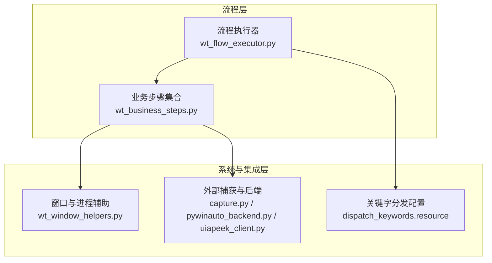
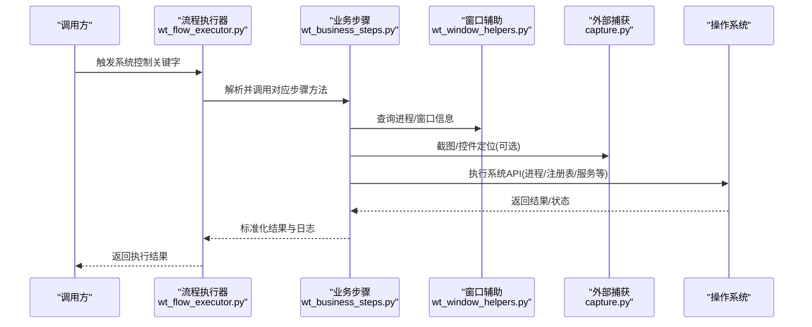
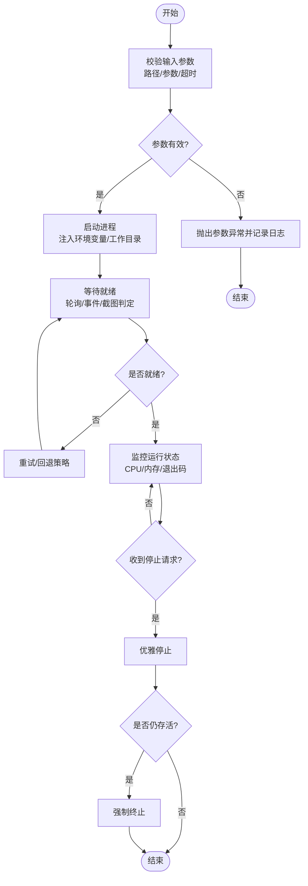
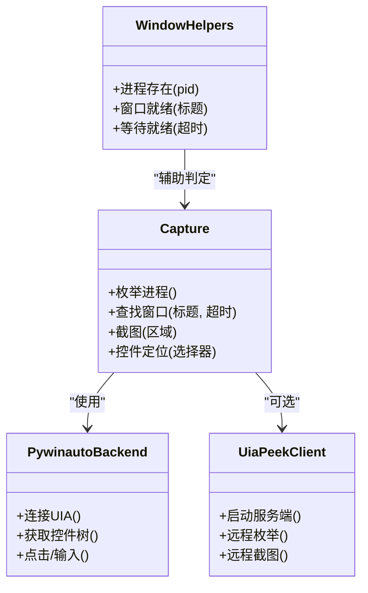
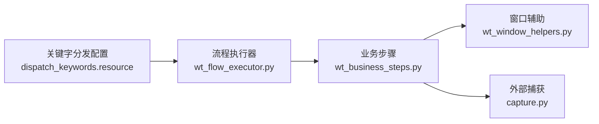

# 系统控制类步骤

<cite>
**本文引用的文件**   
- [wt_business_steps.py](file://wt_business_steps.py)
- [wt_flow_executor.py](file://wt_flow_executor.py)
- [wt_window_helpers.py](file://wt_window_helpers.py)
- [tools/external_capture/capture.py](file://tools/external_capture/capture.py)
- [tools/external_capture/pywinauto_backend.py](file://tools/external_capture/pywinauto_backend.py)
- [tools/external_capture/uiapeek_client.py](file://tools/external_capture/uiapeek_client.py)
- [resources/dispatch_keywords.resource](file://resources/dispatch_keywords.resource)
</cite>

## 目录
1. [简介](#简介)
2. [项目结构](#项目结构)
3. [核心组件](#核心组件)
4. [架构总览](#架构总览)
5. [详细组件分析](#详细组件分析)
6. [依赖关系分析](#依赖关系分析)
7. [性能与资源监控](#性能与资源监控)
8. [故障排查指南](#故障排查指南)
9. [结论](#结论)
10. [附录](#附录)

## 简介
本章节聚焦于WT自动化框架中的“系统控制类业务步骤”，围绕进程管理（启动、停止、监控）、环境变量设置、系统信息获取、文件权限控制等系统级操作，以及与操作系统集成的功能（注册表操作、服务管理、计划任务创建）进行系统化说明。文档同时覆盖权限要求、安全考虑、异常处理与日志记录策略，并提供跨平台兼容性说明和性能调优建议。

## 项目结构
WT自动化框架将系统控制能力以“业务步骤”的形式暴露给上层流程执行器与测试脚本。关键位置如下：
- 业务步骤实现：位于根目录的 wt_business_steps.py，提供面向流程的可复用系统控制方法。
- 流程执行器：wt_flow_executor.py 负责解析并调度业务步骤，统一错误与日志输出。
- 窗口与外部捕获辅助：wt_window_helpers.py 以及 tools/external_capture 下的模块，用于进程发现、UI元素定位与截图采集。
- 关键字分发配置：resources/dispatch_keywords.resource 定义对外暴露的关键字映射，便于上层调用。

图表来源
- [wt_flow_executor.py](file://wt_flow_executor.py)
- [wt_business_steps.py](file://wt_business_steps.py)
- [wt_window_helpers.py](file://wt_window_helpers.py)
- [tools/external_capture/capture.py](file://tools/external_capture/capture.py)
- [tools/external_capture/pywinauto_backend.py](file://tools/external_capture/pywinauto_backend.py)
- [tools/external_capture/uiapeek_client.py](file://tools/external_capture/uiapeek_client.py)
- [resources/dispatch_keywords.resource](file://resources/dispatch_keywords.resource)

章节来源
- [wt_business_steps.py](file://wt_business_steps.py)
- [wt_flow_executor.py](file://wt_flow_executor.py)
- [wt_window_helpers.py](file://wt_window_helpers.py)
- [tools/external_capture/capture.py](file://tools/external_capture/capture.py)
- [tools/external_capture/pywinauto_backend.py](file://tools/external_capture/pywinauto_backend.py)
- [tools/external_capture/uiapeek_client.py](file://tools/external_capture/uiapeek_client.py)
- [resources/dispatch_keywords.resource](file://resources/dispatch_keywords.resource)

## 核心组件
本节概述系统控制类业务步骤的核心职责与边界：
- 进程管理：封装进程的启动、停止、等待就绪、存活检测与资源回收。
- 环境变量：提供对当前进程环境变量的读取、写入与临时隔离设置。
- 系统信息：收集CPU、内存、磁盘、网络、进程列表等基础指标。
- 文件权限：在Windows下通过ACL或属性变更实现读写控制；在其他平台使用POSIX模式。
- 系统集成：注册表读写、服务启停、计划任务创建与查询（主要面向Windows）。
- 外部捕获：结合pywinauto/UIA Peek进行窗口枚举、控件定位与截图，辅助进程状态判定。

章节来源
- [wt_business_steps.py](file://wt_business_steps.py)
- [wt_flow_executor.py](file://wt_flow_executor.py)
- [wt_window_helpers.py](file://wt_window_helpers.py)
- [tools/external_capture/capture.py](file://tools/external_capture/capture.py)
- [tools/external_capture/pywinauto_backend.py](file://tools/external_capture/pywinauto_backend.py)
- [tools/external_capture/uiapeek_client.py](file://tools/external_capture/uiapeek_client.py)

## 架构总览
系统控制类步骤由“流程执行器”驱动，通过“关键字分发配置”将高层关键字映射到具体实现。业务步骤内部再调用“窗口与进程辅助”和“外部捕获后端”完成底层系统交互。

图表来源
- [wt_flow_executor.py](file://wt_flow_executor.py)
- [wt_business_steps.py](file://wt_business_steps.py)
- [wt_window_helpers.py](file://wt_window_helpers.py)
- [tools/external_capture/capture.py](file://tools/external_capture/capture.py)

## 详细组件分析

### 进程管理步骤
- 功能范围
  - 启动：支持命令行参数、工作目录、环境变量注入、超时与重试。
  - 停止：优雅终止（SIGTERM/WM_CLOSE）与强制终止（SIGKILL/Kill），带幂等保护。
  - 监控：存活检测、退出码收集、资源占用采样（CPU/内存）。
- 权限与安全
  - Windows：可能需要管理员权限以访问其他用户会话或受保护进程。
  - Linux/macOS：需具备目标进程UID或root权限才能发送信号或修改资源限制。
- 异常处理
  - 常见异常包括路径不存在、权限不足、进程不存在、超时未就绪等。
  - 建议在失败时回滚已创建的资源（如临时文件或句柄）。
- 日志记录
  - 记录命令、参数、PID、退出码、耗时与错误堆栈。
- 兼容性与差异
  - Windows：优先使用CreateProcess/TaskKill；可结合UIA Peek确认窗口就绪。
  - Unix-like：使用subprocess与os.kill；注意信号语义差异。
- 参考实现位置
  - [wt_business_steps.py](file://wt_business_steps.py)
  - [wt_window_helpers.py](file://wt_window_helpers.py)
  - [tools/external_capture/capture.py](file://tools/external_capture/capture.py)

图表来源
- [wt_business_steps.py](file://wt_business_steps.py)
- [wt_window_helpers.py](file://wt_window_helpers.py)
- [tools/external_capture/capture.py](file://tools/external_capture/capture.py)

章节来源
- [wt_business_steps.py](file://wt_business_steps.py)
- [wt_window_helpers.py](file://wt_window_helpers.py)
- [tools/external_capture/capture.py](file://tools/external_capture/capture.py)

### 环境变量设置步骤
- 功能范围
  - 读取：获取当前进程及父进程可见的环境变量。
  - 写入：为后续子进程注入变量；支持临时作用域与持久化开关。
  - 隔离：在测试用例中提供沙箱式环境，避免污染全局。
- 权限与安全
  - 仅影响当前进程树；持久化写入需要相应系统权限。
  - 敏感值应加密存储并在运行时解密，避免落盘明文。
- 异常处理
  - 键名非法、类型不匹配、权限不足等情况需明确报错。
- 日志记录
  - 记录变更前后快照（脱敏），便于审计与回溯。
- 兼容性与差异
  - Windows：通过SetEnvironmentVariable/注册表HKCU/HKLM更新。
  - Unix-like：通过export或shell配置文件生效。
- 参考实现位置
  - [wt_business_steps.py](file://wt_business_steps.py)

章节来源
- [wt_business_steps.py](file://wt_business_steps.py)

### 系统信息获取步骤
- 功能范围
  - CPU：利用率、负载均值、核心数。
  - 内存：总量、可用量、交换区使用情况。
  - 磁盘：分区容量、I/O统计。
  - 网络：接口列表、收发字节、连接数。
  - 进程：列表、资源占用、父子关系。
- 权限与安全
  - 部分指标需要较高权限（如完整网络连接信息）。
- 异常处理
  - 权限不足或内核接口不可用时降级返回空或部分数据。
- 日志记录
  - 周期性采样时避免高频IO，采用缓冲与批写。
- 兼容性与差异
  - Windows：WMI/Performance Counters。
  - Linux/macOS：/proc、sysctl、psutil等。
- 参考实现位置
  - [wt_business_steps.py](file://wt_business_steps.py)

章节来源
- [wt_business_steps.py](file://wt_business_steps.py)

### 文件权限控制步骤
- 功能范围
  - Windows：修改ACL、所有者、只读属性；批量递归应用。
  - Unix-like：chmod/chown，支持掩码与继承。
- 权限与安全
  - 需要目标文件系统的写权限；Windows可能需管理员。
  - 避免对系统关键路径做无差别修改。
- 异常处理
  - 路径不存在、权限不足、符号链接循环等需明确区分。
- 日志记录
  - 记录变更对象、旧/新权限、操作者上下文。
- 兼容性与差异
  - Windows ACL模型复杂，建议提供最小权限策略模板。
  - Unix-like基于位掩码，注意umask影响。
- 参考实现位置
  - [wt_business_steps.py](file://wt_business_steps.py)

章节来源
- [wt_business_steps.py](file://wt_business_steps.py)

### 系统集成：注册表、服务与计划任务
- 注册表操作（Windows）
  - 读取/写入/删除键值；支持数据类型与多值项。
  - 权限：HKLM需管理员；HKCU相对宽松。
  - 安全：防注入、白名单键路径、审计日志。
- 服务管理（Windows）
  - 启动/停止/重启/查询状态；依赖关系检查。
  - 权限：SCM访问需要管理员。
- 计划任务（Windows）
  - 创建/删除/启用/禁用任务；触发器与动作配置。
  - 权限：Task Scheduler需要管理员。
- 异常处理
  - 权限不足、服务不存在、任务冲突等错误分类上报。
- 日志记录
  - 记录操作前快照、返回值与错误详情。
- 参考实现位置
  - [wt_business_steps.py](file://wt_business_steps.py)

章节来源
- [wt_business_steps.py](file://wt_business_steps.py)

### 外部捕获与UI就绪判定
- 功能范围
  - 进程枚举、窗口标题匹配、控件定位、截图比对。
  - 作为进程“就绪”判定的补充手段，提高鲁棒性。
- 权限与安全
  - UIA Peek客户端需与目标进程同会话；某些场景需提升权限。
- 异常处理
  - 控件缺失、UIA后端不可用、截图失败等需回退策略。
- 日志记录
  - 记录定位条件、截图路径、相似度阈值与耗时。
- 参考实现位置
  - [tools/external_capture/capture.py](file://tools/external_capture/capture.py)
  - [tools/external_capture/pywinauto_backend.py](file://tools/external_capture/pywinauto_backend.py)
  - [tools/external_capture/uiapeek_client.py](file://tools/external_capture/uiapeek_client.py)
  - [wt_window_helpers.py](file://wt_window_helpers.py)

图表来源
- [tools/external_capture/capture.py](file://tools/external_capture/capture.py)
- [tools/external_capture/pywinauto_backend.py](file://tools/external_capture/pywinauto_backend.py)
- [tools/external_capture/uiapeek_client.py](file://tools/external_capture/uiapeek_client.py)
- [wt_window_helpers.py](file://wt_window_helpers.py)

章节来源
- [tools/external_capture/capture.py](file://tools/external_capture/capture.py)
- [tools/external_capture/pywinauto_backend.py](file://tools/external_capture/pywinauto_backend.py)
- [tools/external_capture/uiapeek_client.py](file://tools/external_capture/uiapeek_client.py)
- [wt_window_helpers.py](file://wt_window_helpers.py)

## 依赖关系分析
- 流程执行器与业务步骤解耦：通过关键字分发配置将高层关键字映射到具体实现，降低耦合度。
- 业务步骤依赖系统辅助模块：进程与窗口辅助、外部捕获后端，形成清晰的层次。
- 潜在循环依赖：应避免业务步骤直接反向调用执行器；所有系统交互集中在辅助模块。

图表来源
- [resources/dispatch_keywords.resource](file://resources/dispatch_keywords.resource)
- [wt_flow_executor.py](file://wt_flow_executor.py)
- [wt_business_steps.py](file://wt_business_steps.py)
- [wt_window_helpers.py](file://wt_window_helpers.py)
- [tools/external_capture/capture.py](file://tools/external_capture/capture.py)

章节来源
- [resources/dispatch_keywords.resource](file://resources/dispatch_keywords.resource)
- [wt_flow_executor.py](file://wt_flow_executor.py)
- [wt_business_steps.py](file://wt_business_steps.py)
- [wt_window_helpers.py](file://wt_window_helpers.py)
- [tools/external_capture/capture.py](file://tools/external_capture/capture.py)

## 性能与资源监控
- 采样频率
  - 建议默认1~5秒一次，避免过高频率导致额外开销。
- 指标选择
  - 优先使用轻量接口（如psutil），必要时按需切换至WMI/计数器。
- 缓存与去抖
  - 对频繁查询的系统信息进行短时缓存，减少重复调用。
- 资源上限
  - 限制并发进程数量、截图分辨率与保存路径大小。
- 参考实现位置
  - [wt_business_steps.py](file://wt_business_steps.py)

章节来源
- [wt_business_steps.py](file://wt_business_steps.py)

## 故障排查指南
- 常见问题
  - 权限不足：确认运行账户与UAC/SELinux策略。
  - 进程未就绪：调整超时与重试策略，结合UI就绪判定。
  - 注册表/服务/计划任务失败：核对路径、名称与依赖关系。
- 诊断手段
  - 查看日志中的错误码与堆栈；必要时开启调试模式。
  - 使用外部捕获模块截图与控件树导出，辅助定位UI问题。
- 参考实现位置
  - [wt_flow_executor.py](file://wt_flow_executor.py)
  - [tools/external_capture/capture.py](file://tools/external_capture/capture.py)

章节来源
- [wt_flow_executor.py](file://wt_flow_executor.py)
- [tools/external_capture/capture.py](file://tools/external_capture/capture.py)

## 结论
系统控制类业务步骤为WT自动化框架提供了稳定的系统级能力支撑。通过分层设计与清晰的责任划分，既保证了跨平台兼容性，又兼顾了安全性与可观测性。建议在实际使用中遵循最小权限原则，完善日志与告警，并结合外部捕获手段提升稳定性。

## 附录
- 关键字分发参考
  - 参见关键字分发配置文件，了解对外暴露的系统控制关键字及其映射。
- 参考实现位置
  - [resources/dispatch_keywords.resource](file://resources/dispatch_keywords.resource)