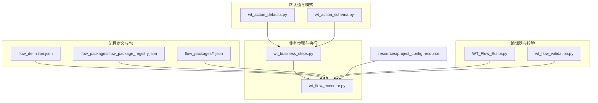
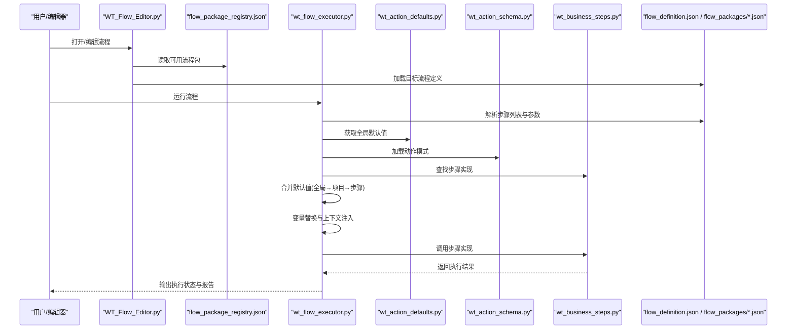
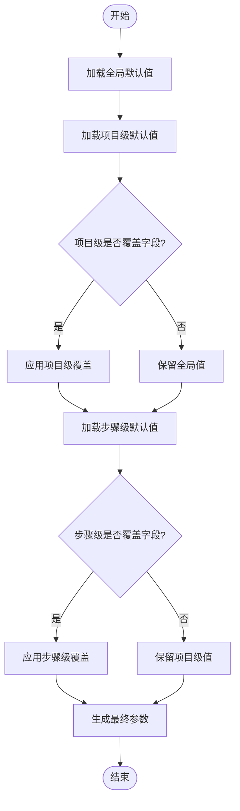
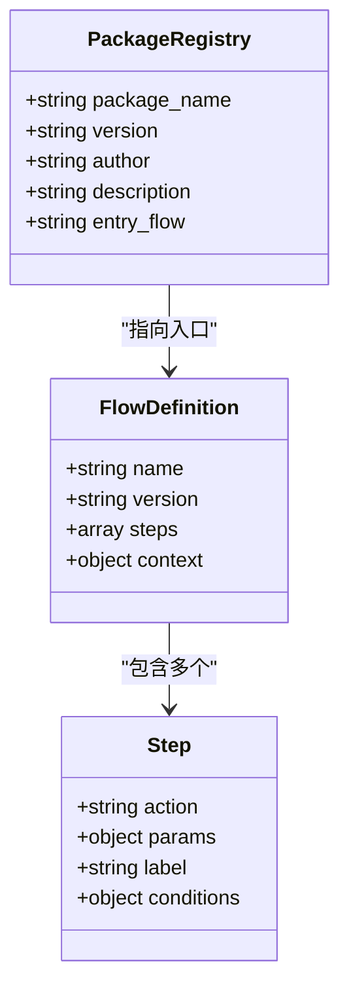
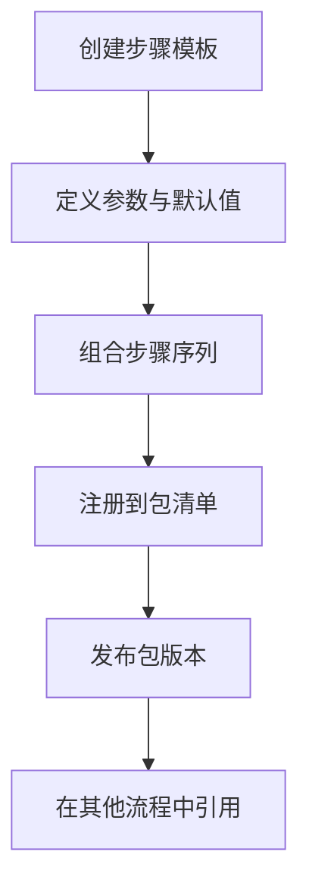
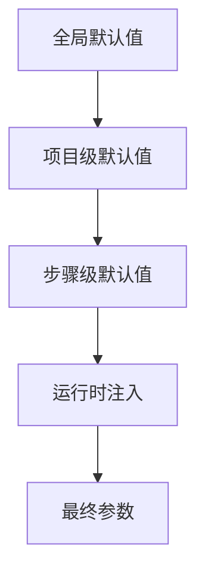
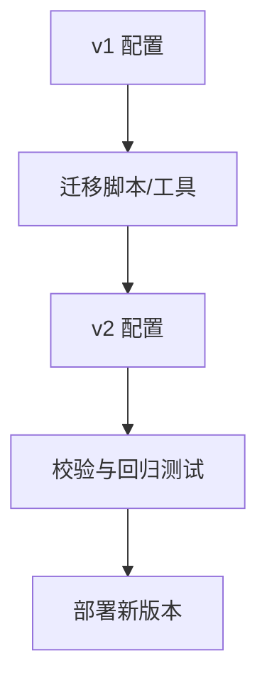
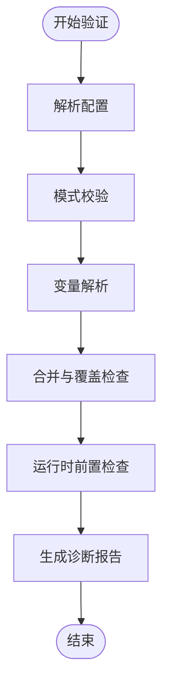
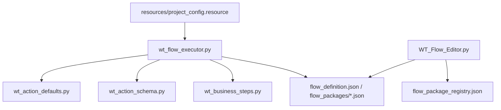

# 步骤配置管理

<cite>
**本文引用的文件**   
- [wt_action_defaults.py](file://wt_action_defaults.py)
- [wt_action_schema.py](file://wt_action_schema.py)
- [wt_business_steps.py](file://wt_business_steps.py)
- [flow_definition.json](file://flow_definition.json)
- [flow_packages/flow_package_registry.json](file://flow_packages/flow_package_registry.json)
- [flow_packages/flow_definition_geo_import_data_file.json](file://flow_packages/flow_definition_geo_import_data_file.json)
- [flow_packages/flow_definition_microscale_create_model.json](file://flow_packages/flow_definition_microscale_create_model.json)
- [flow_packages/flow_definition_turbine_type_create_and_curves.json](file://flow_packages/flow_definition_turbine_type_create_and_curves.json)
- [flow_packages/flow_definition_创建一个新建模.json](file://flow_packages/flow_definition_创建一个新建模.json)
- [flow_packages/flow_definition_导入测风塔、机位点.json](file://flow_packages/flow_definition_导入测风塔、机位点.json)
- [flow_packages/flow_definition_新建风机类型.json](file://flow_packages/flow_definition_新建风机类型.json)
- [flow_packages/flow_definition_测试.json](file://flow_packages/flow_definition_测试.json)
- [samples/flows/flow_definition_gm_sample.json](file://samples/flows/flow_definition_gm_sample.json)
- [samples/flows/flow_definition_新建风机类型.json](file://samples/flows/flow_definition_新建风机类型.json)
- [resources/project_config.resource](file://resources/project_config.resource)
- [WT_Flow_Editor.py](file://WT_Flow_Editor.py)
- [wt_flow_validation.py](file://wt_flow_validation.py)
- [wt_flow_executor.py](file://wt_flow_executor.py)
</cite>

## 目录
1. [简介](#简介)
2. [项目结构](#项目结构)
3. [核心组件](#核心组件)
4. [架构总览](#架构总览)
5. [详细组件分析](#详细组件分析)
6. [依赖关系分析](#依赖关系分析)
7. [性能考虑](#性能考虑)
8. [故障排查指南](#故障排查指南)
9. [结论](#结论)
10. [附录](#附录)

## 简介
本文件面向业务步骤的配置管理机制，重点说明动作默认值系统（全局、项目级、步骤级）的优先级与覆盖规则；介绍配置文件结构与语法（JSON 规范与变量替换机制）；阐述如何创建与管理步骤模板以提升复用性；解释参数的继承与覆盖机制；提供版本管理与迁移方法；并给出实际项目配置示例与最佳实践，以及配置验证与错误诊断方法。

## 项目结构
围绕“步骤配置管理”的核心代码与数据主要分布在以下位置：
- 默认值与模式定义：wt_action_defaults.py、wt_action_schema.py
- 业务步骤注册与执行：wt_business_steps.py、wt_flow_executor.py
- 流程定义与包注册：flow_definition.json、flow_packages/*.json、flow_packages/flow_package_registry.json
- 编辑器与校验：WT_Flow_Editor.py、wt_flow_validation.py
- 项目资源：resources/project_config.resource

图表来源
- [wt_action_defaults.py](file://wt_action_defaults.py)
- [wt_action_schema.py](file://wt_action_schema.py)
- [wt_business_steps.py](file://wt_business_steps.py)
- [wt_flow_executor.py](file://wt_flow_executor.py)
- [flow_definition.json](file://flow_definition.json)
- [flow_packages/flow_package_registry.json](file://flow_packages/flow_package_registry.json)
- [WT_Flow_Editor.py](file://WT_Flow_Editor.py)
- [wt_flow_validation.py](file://wt_flow_validation.py)
- [resources/project_config.resource](file://resources/project_config.resource)

章节来源
- [wt_action_defaults.py](file://wt_action_defaults.py)
- [wt_action_schema.py](file://wt_action_schema.py)
- [wt_business_steps.py](file://wt_business_steps.py)
- [wt_flow_executor.py](file://wt_flow_executor.py)
- [flow_definition.json](file://flow_definition.json)
- [flow_packages/flow_package_registry.json](file://flow_packages/flow_package_registry.json)
- [WT_Flow_Editor.py](file://WT_Flow_Editor.py)
- [wt_flow_validation.py](file://wt_flow_validation.py)
- [resources/project_config.resource](file://resources/project_config.resource)

## 核心组件
- 默认值系统
  - 全局默认值：集中定义在默认值模块中，作为所有动作的兜底值。
  - 项目级默认值：由项目资源或项目配置注入，用于覆盖全局默认值。
  - 步骤级默认值：在单个步骤定义中显式指定，覆盖项目级与全局默认值。
- 模式与校验
  - 模式定义：描述每个动作的参数结构、类型、必填项、取值范围等。
  - 校验器：基于模式对最终合并后的参数进行合法性检查。
- 业务步骤注册与执行
  - 步骤注册：将动作名称映射到具体实现函数或类。
  - 执行引擎：加载流程定义，解析变量，合并默认值，执行步骤。
- 流程定义与包
  - 流程定义：以 JSON 描述步骤序列、参数与上下文引用。
  - 包注册：集中声明可复用的流程包及其入口定义。
- 编辑器与校验工具
  - 编辑器：提供可视化编辑、自动补全、实时校验。
  - 校验工具：独立运行时的静态校验与诊断报告。

章节来源
- [wt_action_defaults.py](file://wt_action_defaults.py)
- [wt_action_schema.py](file://wt_action_schema.py)
- [wt_business_steps.py](file://wt_business_steps.py)
- [wt_flow_executor.py](file://wt_flow_executor.py)
- [flow_definition.json](file://flow_definition.json)
- [flow_packages/flow_package_registry.json](file://flow_packages/flow_package_registry.json)
- [WT_Flow_Editor.py](file://WT_Flow_Editor.py)
- [wt_flow_validation.py](file://wt_flow_validation.py)

## 架构总览
下图展示了从“流程定义”到“执行”的关键路径，以及默认值与变量的参与方式。

图表来源
- [WT_Flow_Editor.py](file://WT_Flow_Editor.py)
- [flow_packages/flow_package_registry.json](file://flow_packages/flow_package_registry.json)
- [wt_flow_executor.py](file://wt_flow_executor.py)
- [wt_action_defaults.py](file://wt_action_defaults.py)
- [wt_action_schema.py](file://wt_action_schema.py)
- [wt_business_steps.py](file://wt_business_steps.py)
- [flow_definition.json](file://flow_definition.json)

## 详细组件分析

### 默认值系统与优先级
- 设计要点
  - 三层默认值：全局默认值、项目级默认值、步骤级默认值。
  - 合并顺序：先取全局默认值，再被项目级覆盖，最后被步骤级覆盖。
  - 字段级覆盖：仅覆盖存在且合法的字段，未指定的字段保持上游值。
- 使用建议
  - 将稳定不变的值放入全局默认值。
  - 将环境相关或项目专属的值放入项目级默认值。
  - 仅在必要时在步骤级覆盖，避免过度分散。

图表来源
- [wt_action_defaults.py](file://wt_action_defaults.py)
- [wt_flow_executor.py](file://wt_flow_executor.py)

章节来源
- [wt_action_defaults.py](file://wt_action_defaults.py)
- [wt_flow_executor.py](file://wt_flow_executor.py)

### 配置文件结构与语法（JSON 规范）
- 流程定义文件
  - 顶层包含步骤列表、元数据、上下文变量等。
  - 每个步骤包含动作名、参数对象、可选的标签与条件。
- 包注册文件
  - 声明包名、版本、作者、描述、入口流程定义等。
- 变量替换机制
  - 支持在字符串中使用占位符引用上下文变量。
  - 变量来源包括：流程上下文、项目配置、运行时注入。
  - 替换失败时应回退为默认值或报错提示。

图表来源
- [flow_definition.json](file://flow_definition.json)
- [flow_packages/flow_package_registry.json](file://flow_packages/flow_package_registry.json)
- [flow_packages/flow_definition_geo_import_data_file.json](file://flow_packages/flow_definition_geo_import_data_file.json)
- [flow_packages/flow_definition_microscale_create_model.json](file://flow_packages/flow_definition_microscale_create_model.json)
- [flow_packages/flow_definition_turbine_type_create_and_curves.json](file://flow_packages/flow_definition_turbine_type_create_and_curves.json)
- [flow_packages/flow_definition_创建一个新建模.json](file://flow_packages/flow_definition_创建一个新建模.json)
- [flow_packages/flow_definition_导入测风塔、机位点.json](file://flow_packages/flow_definition_导入测风塔、机位点.json)
- [flow_packages/flow_definition_新建风机类型.json](file://flow_packages/flow_definition_新建风机类型.json)
- [flow_packages/flow_definition_测试.json](file://flow_packages/flow_definition_测试.json)

章节来源
- [flow_definition.json](file://flow_definition.json)
- [flow_packages/flow_package_registry.json](file://flow_packages/flow_package_registry.json)
- [flow_packages/flow_definition_geo_import_data_file.json](file://flow_packages/flow_definition_geo_import_data_file.json)
- [flow_packages/flow_definition_microscale_create_model.json](file://flow_packages/flow_definition_microscale_create_model.json)
- [flow_packages/flow_definition_turbine_type_create_and_curves.json](file://flow_packages/flow_definition_turbine_type_create_and_curves.json)
- [flow_packages/flow_definition_创建一个新建模.json](file://flow_packages/flow_definition_创建一个新建模.json)
- [flow_packages/flow_definition_导入测风塔、机位点.json](file://flow_packages/flow_definition_导入测风塔、机位点.json)
- [flow_packages/flow_definition_新建风机类型.json](file://flow_packages/flow_definition_新建风机类型.json)
- [flow_packages/flow_definition_测试.json](file://flow_packages/flow_definition_测试.json)

### 步骤模板的创建与管理
- 模板化思路
  - 将常用步骤组合封装为流程包，通过包注册暴露入口。
  - 在包内定义通用参数与默认值，使用者仅需传入差异部分。
- 复用策略
  - 使用变量占位符表达可变部分。
  - 通过包版本控制演进，保证向后兼容。
- 管理建议
  - 为每个包维护清晰的 README 与变更日志。
  - 在包注册文件中记录作者、版本、兼容性信息。

图表来源
- [flow_packages/flow_package_registry.json](file://flow_packages/flow_package_registry.json)
- [flow_packages/flow_definition_geo_import_data_file.json](file://flow_packages/flow_definition_geo_import_data_file.json)
- [flow_packages/flow_definition_microscale_create_model.json](file://flow_packages/flow_definition_microscale_create_model.json)
- [flow_packages/flow_definition_turbine_type_create_and_curves.json](file://flow_packages/flow_definition_turbine_type_create_and_curves.json)
- [flow_packages/flow_definition_创建一个新建模.json](file://flow_packages/flow_definition_创建一个新建模.json)
- [flow_packages/flow_definition_导入测风塔、机位点.json](file://flow_packages/flow_definition_导入测风塔、机位点.json)
- [flow_packages/flow_definition_新建风机类型.json](file://flow_packages/flow_definition_新建风机类型.json)
- [flow_packages/flow_definition_测试.json](file://flow_packages/flow_definition_测试.json)

章节来源
- [flow_packages/flow_package_registry.json](file://flow_packages/flow_package_registry.json)
- [flow_packages/flow_definition_geo_import_data_file.json](file://flow_packages/flow_definition_geo_import_data_file.json)
- [flow_packages/flow_definition_microscale_create_model.json](file://flow_packages/flow_definition_microscale_create_model.json)
- [flow_packages/flow_definition_turbine_type_create_and_curves.json](file://flow_packages/flow_definition_turbine_type_create_and_curves.json)
- [flow_packages/flow_definition_创建一个新建模.json](file://flow_packages/flow_definition_创建一个新建模.json)
- [flow_packages/flow_definition_导入测风塔、机位点.json](file://flow_packages/flow_definition_导入测风塔、机位点.json)
- [flow_packages/flow_definition_新建风机类型.json](file://flow_packages/flow_definition_新建风机类型.json)
- [flow_packages/flow_definition_测试.json](file://flow_packages/flow_definition_测试.json)

### 参数的继承与覆盖机制
- 继承链
  - 全局默认值 → 项目级默认值 → 步骤级默认值 → 运行时注入。
- 覆盖规则
  - 仅覆盖存在的键，不删除上游已设置的键。
  - 嵌套对象按字段级合并，而非整层替换。
- 冲突处理
  - 若类型不匹配或违反模式约束，应触发校验错误并中止执行。

图表来源
- [wt_action_defaults.py](file://wt_action_defaults.py)
- [wt_flow_executor.py](file://wt_flow_executor.py)

章节来源
- [wt_action_defaults.py](file://wt_action_defaults.py)
- [wt_flow_executor.py](file://wt_flow_executor.py)

### 配置文件的版本管理与迁移
- 版本策略
  - 流程定义与包均引入版本号，确保向后兼容。
  - 重大变更时升级主版本，并提供迁移脚本或文档。
- 迁移方法
  - 提供字段重命名、结构升级、默认值更新的迁移逻辑。
  - 在编辑器或校验阶段提示不兼容并给出修复建议。

图表来源
- [flow_packages/flow_package_registry.json](file://flow_packages/flow_package_registry.json)
- [flow_definition.json](file://flow_definition.json)

章节来源
- [flow_packages/flow_package_registry.json](file://flow_packages/flow_package_registry.json)
- [flow_definition.json](file://flow_definition.json)

### 实际项目配置示例与最佳实践
- 示例参考
  - 流程定义示例：flow_definition.json、samples/flows/*.json
  - 包定义示例：flow_packages/*.json
- 最佳实践
  - 将公共参数抽离到项目级默认值，减少重复。
  - 使用包注册统一管理可复用流程，避免硬编码路径。
  - 在步骤级仅覆盖必要字段，保持可读性与可维护性。
  - 为关键步骤添加标签与注释，便于追踪与排错。

章节来源
- [flow_definition.json](file://flow_definition.json)
- [samples/flows/flow_definition_gm_sample.json](file://samples/flows/flow_definition_gm_sample.json)
- [samples/flows/flow_definition_新建风机类型.json](file://samples/flows/flow_definition_新建风机类型.json)
- [flow_packages/flow_package_registry.json](file://flow_packages/flow_package_registry.json)
- [flow_packages/flow_definition_geo_import_data_file.json](file://flow_packages/flow_definition_geo_import_data_file.json)
- [flow_packages/flow_definition_microscale_create_model.json](file://flow_packages/flow_definition_microscale_create_model.json)
- [flow_packages/flow_definition_turbine_type_create_and_curves.json](file://flow_packages/flow_definition_turbine_type_create_and_curves.json)
- [flow_packages/flow_definition_创建一个新建模.json](file://flow_packages/flow_definition_创建一个新建模.json)
- [flow_packages/flow_definition_导入测风塔、机位点.json](file://flow_packages/flow_definition_导入测风塔、机位点.json)
- [flow_packages/flow_definition_新建风机类型.json](file://flow_packages/flow_definition_新建风机类型.json)
- [flow_packages/flow_definition_测试.json](file://flow_packages/flow_definition_测试.json)

### 配置验证与错误诊断
- 验证阶段
  - 静态校验：在编辑器或预检阶段依据模式检查必填项、类型、取值范围。
  - 动态校验：在执行前再次校验合并后的参数，确保一致性。
- 错误诊断
  - 提供详细的错误消息与定位信息（文件、行号、字段路径）。
  - 输出诊断报告，包含警告与建议修复方案。

图表来源
- [wt_flow_validation.py](file://wt_flow_validation.py)
- [wt_action_schema.py](file://wt_action_schema.py)
- [wt_flow_executor.py](file://wt_flow_executor.py)

章节来源
- [wt_flow_validation.py](file://wt_flow_validation.py)
- [wt_action_schema.py](file://wt_action_schema.py)
- [wt_flow_executor.py](file://wt_flow_executor.py)

## 依赖关系分析
- 组件耦合
  - 执行器依赖默认值与模式定义，同时依赖业务步骤实现。
  - 编辑器依赖包注册与流程定义，提供交互与校验。
- 外部集成点
  - 项目资源（如 project_config.resource）可能提供环境变量或路径。
  - 包注册表提供流程包的发现与版本管理。

图表来源
- [wt_flow_executor.py](file://wt_flow_executor.py)
- [wt_action_defaults.py](file://wt_action_defaults.py)
- [wt_action_schema.py](file://wt_action_schema.py)
- [wt_business_steps.py](file://wt_business_steps.py)
- [flow_definition.json](file://flow_definition.json)
- [flow_packages/flow_package_registry.json](file://flow_packages/flow_package_registry.json)
- [WT_Flow_Editor.py](file://WT_Flow_Editor.py)
- [resources/project_config.resource](file://resources/project_config.resource)

章节来源
- [wt_flow_executor.py](file://wt_flow_executor.py)
- [wt_action_defaults.py](file://wt_action_defaults.py)
- [wt_action_schema.py](file://wt_action_schema.py)
- [wt_business_steps.py](file://wt_business_steps.py)
- [flow_definition.json](file://flow_definition.json)
- [flow_packages/flow_package_registry.json](file://flow_packages/flow_package_registry.json)
- [WT_Flow_Editor.py](file://WT_Flow_Editor.py)
- [resources/project_config.resource](file://resources/project_config.resource)

## 性能考虑
- 默认值合并应在内存中进行，避免频繁磁盘 IO。
- 变量替换采用一次性解析与缓存，减少重复计算。
- 大流程定义分块加载与懒解析，提升编辑器响应速度。
- 校验阶段增量更新，仅对变更部分重新校验。

## 故障排查指南
- 常见问题
  - 变量未解析：检查上下文是否注入、占位符是否正确。
  - 默认值未生效：确认覆盖层级与字段路径是否一致。
  - 模式校验失败：核对类型、必填项与取值范围。
- 诊断步骤
  - 启用详细日志，查看合并与替换过程。
  - 使用独立校验工具生成诊断报告。
  - 逐步缩小范围，定位问题步骤与字段。

章节来源
- [wt_flow_validation.py](file://wt_flow_validation.py)
- [wt_flow_executor.py](file://wt_flow_executor.py)

## 结论
通过分层默认值、严格模式校验、包化模板与完善的诊断能力，本项目的步骤配置管理实现了高复用、强一致与易维护的目标。建议在团队内推广包化与模板化实践，持续完善默认值体系与校验规则，保障流程定义的长期稳定性与可扩展性。

## 附录
- 术语
  - 动作：可执行的步骤单元。
  - 流程定义：描述步骤序列与参数的 JSON 文件。
  - 包注册：声明可复用流程包的清单文件。
  - 变量替换：在配置中引用上下文变量的机制。
- 参考文件
  - 默认值与模式：wt_action_defaults.py、wt_action_schema.py
  - 业务步骤与执行：wt_business_steps.py、wt_flow_executor.py
  - 流程定义与包：flow_definition.json、flow_packages/*.json、flow_packages/flow_package_registry.json
  - 编辑器与校验：WT_Flow_Editor.py、wt_flow_validation.py
  - 项目资源：resources/project_config.resource