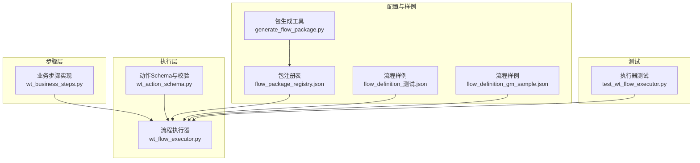
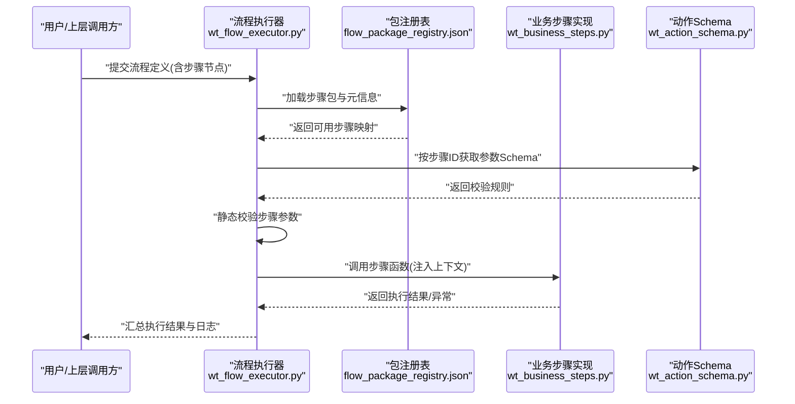
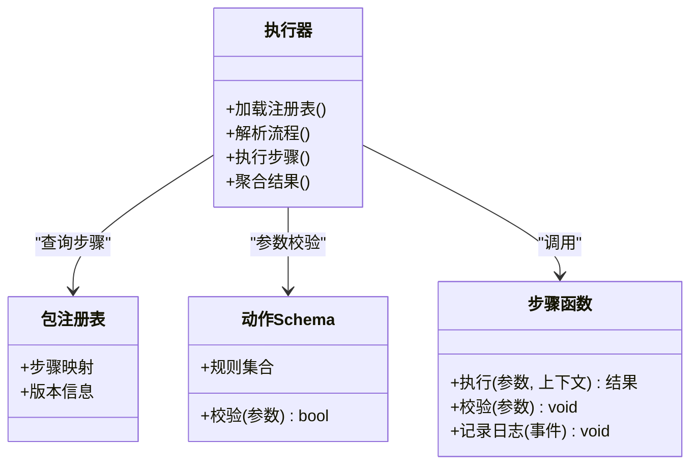
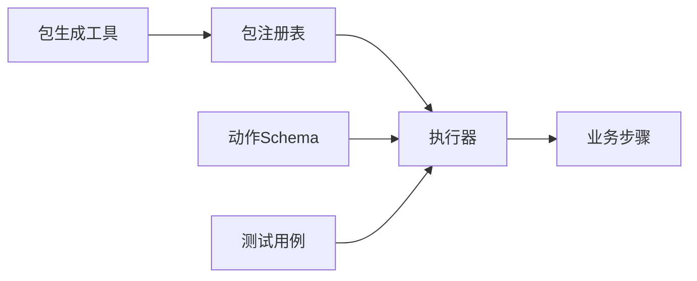

# 自定义步骤开发

<cite>
**本文引用的文件**   
- [wt_business_steps.py](file://wt_business_steps.py)
- [wt_flow_executor.py](file://wt_flow_executor.py)
- [wt_action_schema.py](file://wt_action_schema.py)
- [flow_packages/flow_package_registry.json](file://flow_packages/flow_package_registry.json)
- [flow_packages/flow_definition_测试.json](file://flow_packages/flow_definition_测试.json)
- [samples/flows/flow_definition_gm_sample.json](file://samples/flows/flow_definition_gm_sample.json)
- [tests/test_wt_flow_executor.py](file://tests/test_wt_flow_executor.py)
- [tools/generate_flow_package.py](file://tools/generate_flow_package.py)
</cite>

## 目录
1. [简介](#简介)
2. [项目结构](#项目结构)
3. [核心组件](#核心组件)
4. [架构总览](#架构总览)
5. [详细组件分析](#详细组件分析)
6. [依赖关系分析](#依赖关系分析)
7. [性能考虑](#性能考虑)
8. [故障排查指南](#故障排查指南)
9. [结论](#结论)
10. [附录](#附录)

## 简介
本文件面向希望在本项目中扩展“业务步骤”的开发者，系统说明如何从零开始实现一个可被流程引擎识别、执行与管理的自定义步骤。内容覆盖：
- 步骤接口定义与参数校验
- 错误处理与日志记录规范
- 步骤注册机制与配置管理
- 版本管理与兼容性策略
- 从简单到复杂的完整示例路径
- 单元测试与调试技巧
- 性能优化建议

## 项目结构
本项目围绕“流程定义 + 步骤执行器 + 步骤库”的组织方式构建。关键位置如下：
- 步骤实现与注册：位于业务步骤模块中，提供步骤函数与注册入口
- 流程执行器：负责解析流程定义、加载步骤、按序执行并报告结果
- 动作模式与校验：定义步骤输入参数的 Schema，用于静态校验
- 包注册表：集中声明可用的步骤包及其元信息
- 流程样例：提供标准流程定义样例，便于参考字段结构与步骤引用方式
- 工具脚本：辅助生成或维护流程包清单
- 测试用例：对执行器与步骤进行验证

图表来源
- [wt_business_steps.py](file://wt_business_steps.py)
- [wt_flow_executor.py](file://wt_flow_executor.py)
- [wt_action_schema.py](file://wt_action_schema.py)
- [flow_packages/flow_package_registry.json](file://flow_packages/flow_package_registry.json)
- [flow_packages/flow_definition_测试.json](file://flow_packages/flow_definition_测试.json)
- [samples/flows/flow_definition_gm_sample.json](file://samples/flows/flow_definition_gm_sample.json)
- [tools/generate_flow_package.py](file://tools/generate_flow_package.py)
- [tests/test_wt_flow_executor.py](file://tests/test_wt_flow_executor.py)

章节来源
- [wt_business_steps.py](file://wt_business_steps.py)
- [wt_flow_executor.py](file://wt_flow_executor.py)
- [wt_action_schema.py](file://wt_action_schema.py)
- [flow_packages/flow_package_registry.json](file://flow_packages/flow_package_registry.json)
- [flow_packages/flow_definition_测试.json](file://flow_packages/flow_definition_测试.json)
- [samples/flows/flow_definition_gm_sample.json](file://samples/flows/flow_definition_gm_sample.json)
- [tools/generate_flow_package.py](file://tools/generate_flow_package.py)
- [tests/test_wt_flow_executor.py](file://tests/test_wt_flow_executor.py)

## 核心组件
- 业务步骤实现
  - 职责：封装具体业务逻辑，暴露为可被执行器调用的函数；提供参数校验、异常抛出与日志输出。
  - 关键点：函数签名需与执行器约定一致；返回结构化结果；遵循统一的错误类型与日志格式。
- 流程执行器
  - 职责：读取流程定义，解析步骤节点，根据步骤标识查找已注册的步骤函数，注入上下文并执行；收集执行结果与错误。
  - 关键点：支持步骤注册表动态发现；具备重试、超时、断点续跑等能力（视实现而定）。
- 动作Schema与校验
  - 职责：以声明式方式描述步骤输入参数类型、必填项、默认值、取值范围等；在运行前进行静态校验，减少运行时错误。
  - 关键点：与步骤函数一一对应；变更时需保持向后兼容。
- 包注册表
  - 职责：集中声明可用步骤包的元数据（名称、版本、包含的步骤列表、依赖等），供执行器加载。
  - 关键点：支持多包共存与版本选择；避免命名冲突。
- 流程样例
  - 职责：展示流程定义的JSON结构、步骤引用方式、参数传递与上下文使用。
  - 关键点：可作为新步骤接入时的对照模板。
- 包生成工具
  - 职责：辅助生成或更新包注册表，确保包清单与实际实现一致。
- 测试用例
  - 职责：对执行器与步骤进行端到端与单元级验证，保障质量。

章节来源
- [wt_business_steps.py](file://wt_business_steps.py)
- [wt_flow_executor.py](file://wt_flow_executor.py)
- [wt_action_schema.py](file://wt_action_schema.py)
- [flow_packages/flow_package_registry.json](file://flow_packages/flow_package_registry.json)
- [flow_packages/flow_definition_测试.json](file://flow_packages/flow_definition_测试.json)
- [samples/flows/flow_definition_gm_sample.json](file://samples/flows/flow_definition_gm_sample.json)
- [tools/generate_flow_package.py](file://tools/generate_flow_package.py)
- [tests/test_wt_flow_executor.py](file://tests/test_wt_flow_executor.py)

## 架构总览
下图展示了从流程定义到步骤执行的端到端调用链，以及注册表与Schema在其中的作用。

图表来源
- [wt_flow_executor.py](file://wt_flow_executor.py)
- [flow_packages/flow_package_registry.json](file://flow_packages/flow_package_registry.json)
- [wt_business_steps.py](file://wt_business_steps.py)
- [wt_action_schema.py](file://wt_action_schema.py)

## 详细组件分析

### 步骤接口与实现规范
- 函数签名约定
  - 输入：步骤参数对象（由Schema驱动）、执行上下文（如窗口句柄、工作区状态等）
  - 输出：标准化结果对象（包含成功标志、返回值、消息、耗时等）
- 参数校验
  - 优先使用Schema进行静态校验；必要时在函数内部做二次校验
  - 对缺失、类型不匹配、越界等情况给出明确错误信息
- 错误处理
  - 统一抛出业务异常类型，携带错误码与上下文信息
  - 捕获外部依赖异常并转换为业务异常
- 日志记录
  - 使用统一日志器，记录入参摘要、关键中间状态、异常堆栈与耗时
  - 敏感信息脱敏后再输出
- 幂等与可恢复
  - 尽量保证幂等；失败时可重试或回滚部分状态
- 文档与示例
  - 每个步骤提供清晰的参数说明、示例与边界条件

章节来源
- [wt_business_steps.py](file://wt_business_steps.py)
- [wt_action_schema.py](file://wt_action_schema.py)

#### 类图（概念性）

图表来源
- [wt_flow_executor.py](file://wt_flow_executor.py)
- [flow_packages/flow_package_registry.json](file://flow_packages/flow_package_registry.json)
- [wt_action_schema.py](file://wt_action_schema.py)
- [wt_business_steps.py](file://wt_business_steps.py)

### 步骤注册机制与配置管理
- 注册方式
  - 通过包注册表声明步骤ID、所属包、版本、依赖与参数Schema引用
  - 执行器启动时加载注册表，建立“步骤ID -> 实现函数”的映射
- 配置管理
  - 将步骤的可选开关、默认值、环境相关配置纳入流程或包配置
  - 支持按环境/版本切换不同实现
- 最佳实践
  - 步骤ID全局唯一且语义清晰
  - 变更步骤行为时升级版本号，保留旧实现以兼容历史流程
  - 使用包生成工具自动同步注册表与实现

章节来源
- [flow_packages/flow_package_registry.json](file://flow_packages/flow_package_registry.json)
- [tools/generate_flow_package.py](file://tools/generate_flow_package.py)
- [wt_flow_executor.py](file://wt_flow_executor.py)

### 版本管理与兼容性
- 版本策略
  - 采用主版本/次版本/修订号；破坏性变更升主版本，新增字段升次版本，修复缺陷升修订号
- 兼容性
  - 新增可选参数并提供默认值
  - 废弃字段保留但标记弃用，至少在一个主版本周期内兼容
- 迁移
  - 提供转换脚本或工具，将旧流程定义升级到新Schema
  - 在注册表中声明兼容矩阵

章节来源
- [flow_packages/flow_package_registry.json](file://flow_packages/flow_package_registry.json)
- [wt_action_schema.py](file://wt_action_schema.py)

### 开发示例路径
- 简单单功能步骤
  - 目标：完成单一操作（例如点击按钮、输入文本）
  - 要点：最小化参数、严格校验、快速失败
  - 参考路径：[wt_business_steps.py](file://wt_business_steps.py)
- 复杂复合步骤
  - 目标：组合多个子步骤，带条件分支与重试
  - 要点：拆分原子步骤、编排逻辑清晰、错误隔离
  - 参考路径：[wt_business_steps.py](file://wt_business_steps.py)
- 流程定义参考
  - 标准流程样例：[flow_packages/flow_definition_测试.json](file://flow_packages/flow_definition_测试.json)
  - 通用流程样例：[samples/flows/flow_definition_gm_sample.json](file://samples/flows/flow_definition_gm_sample.json)

章节来源
- [wt_business_steps.py](file://wt_business_steps.py)
- [flow_packages/flow_definition_测试.json](file://flow_packages/flow_definition_测试.json)
- [samples/flows/flow_definition_gm_sample.json](file://samples/flows/flow_definition_gm_sample.json)

### 测试与单元测试
- 测试策略
  - 单元测试：针对单个步骤的参数校验、异常路径、边界条件
  - 集成测试：通过执行器运行包含该步骤的流程，验证端到端行为
- 测试要点
  - 构造最小数据集，模拟外部依赖（UI控件、文件系统等）
  - 断言返回值、副作用与日志输出
- 参考用例
  - 执行器测试：[tests/test_wt_flow_executor.py](file://tests/test_wt_flow_executor.py)

章节来源
- [tests/test_wt_flow_executor.py](file://tests/test_wt_flow_executor.py)

### 调试技巧
- 启用详细日志
  - 在步骤与执行器中开启更细粒度的日志级别
- 打印关键状态
  - 记录步骤入参摘要、中间变量、等待条件与最终结果
- 逐步执行
  - 将复杂步骤拆分为小步骤，逐个定位问题
- 回放与快照
  - 保存流程执行快照与截图，便于复现

章节来源
- [wt_flow_executor.py](file://wt_flow_executor.py)
- [wt_business_steps.py](file://wt_business_steps.py)

### 性能优化建议
- 减少IO与网络调用
- 批量操作合并请求
- 缓存热点数据
- 合理设置超时与重试退避
- 避免阻塞式等待，改用事件驱动或轮询+指数退避

[本节为通用指导，无需源码引用]

## 依赖关系分析
- 直接依赖
  - 执行器依赖包注册表与Schema，用于发现步骤与校验参数
  - 步骤实现依赖执行器约定的上下文与结果模型
- 间接依赖
  - 包生成工具依赖注册表结构，用于自动化维护
  - 测试用例依赖执行器接口，用于端到端验证

图表来源
- [flow_packages/flow_package_registry.json](file://flow_packages/flow_package_registry.json)
- [wt_flow_executor.py](file://wt_flow_executor.py)
- [wt_action_schema.py](file://wt_action_schema.py)
- [wt_business_steps.py](file://wt_business_steps.py)
- [tools/generate_flow_package.py](file://tools/generate_flow_package.py)
- [tests/test_wt_flow_executor.py](file://tests/test_wt_flow_executor.py)

章节来源
- [flow_packages/flow_package_registry.json](file://flow_packages/flow_package_registry.json)
- [wt_flow_executor.py](file://wt_flow_executor.py)
- [wt_action_schema.py](file://wt_action_schema.py)
- [wt_business_steps.py](file://wt_business_steps.py)
- [tools/generate_flow_package.py](file://tools/generate_flow_package.py)
- [tests/test_wt_flow_executor.py](file://tests/test_wt_flow_executor.py)

## 性能考虑
- 步骤设计
  - 尽量无状态或轻量有状态，避免长事务
  - 对外部资源访问加超时与熔断
- 执行器层面
  - 并行执行独立步骤（若实现支持）
  - 结果缓存与增量执行
- 监控与度量
  - 统计步骤耗时分布、失败率与重试次数
  - 告警阈值与降级策略

[本节为通用指导，无需源码引用]

## 故障排查指南
- 常见问题
  - 步骤未注册：检查包注册表是否包含对应步骤ID
  - 参数校验失败：核对Schema与流程定义中的字段名与类型
  - 外部依赖异常：确认UI控件存在、文件路径正确、权限充足
- 定位方法
  - 查看执行器日志与步骤日志
  - 缩小范围至最小流程复现
  - 使用断点或插桩打印关键变量
- 恢复策略
  - 重试与回滚
  - 切换到兼容版本步骤

章节来源
- [wt_flow_executor.py](file://wt_flow_executor.py)
- [flow_packages/flow_package_registry.json](file://flow_packages/flow_package_registry.json)
- [wt_action_schema.py](file://wt_action_schema.py)

## 结论
通过统一的步骤接口、严格的Schema校验、完善的注册与版本管理机制，以及系统的测试与调试手段，可以高效地扩展与维护自定义业务步骤。建议在迭代过程中持续完善文档与样例，确保团队协同与长期可演进性。

## 附录
- 快速上手清单
  - 定义步骤函数与Schema
  - 在包注册表中登记步骤
  - 编写单元测试与集成测试
  - 在流程样例中引入并使用
  - 发布新版本并维护兼容性说明
- 参考文件
  - 步骤实现：[wt_business_steps.py](file://wt_business_steps.py)
  - 执行器：[wt_flow_executor.py](file://wt_flow_executor.py)
  - Schema：[wt_action_schema.py](file://wt_action_schema.py)
  - 包注册表：[flow_packages/flow_package_registry.json](file://flow_packages/flow_package_registry.json)
  - 流程样例：[flow_packages/flow_definition_测试.json](file://flow_packages/flow_definition_测试.json)、[samples/flows/flow_definition_gm_sample.json](file://samples/flows/flow_definition_gm_sample.json)
  - 包生成工具：[tools/generate_flow_package.py](file://tools/generate_flow_package.py)
  - 测试用例：[tests/test_wt_flow_executor.py](file://tests/test_wt_flow_executor.py)