# 主启动器

<cite>
**本文引用的文件**   
- [WT_Launcher.py](file://WT_Launcher.py)
- [启动WT自动化总控台.bat](file://启动WT自动化总控台.bat)
- [PROJECT_ARCHITECTURE.md](file://PROJECT_ARCHITECTURE.md)
- [README.md](file://README.md)
- [resources/project_config.resource](file://resources/project_config.resource)
- [flow_packages/flow_package_registry.json](file://flow_packages/flow_package_registry.json)
- [tools/generate_flow_package.py](file://tools/generate_flow_package.py)
- [wt_run_reporting.py](file://wt_run_reporting.py)
- [tests/test_wt_run_reporting.py](file://tests/test_wt_run_reporting.py)
- [WT_AUT_recorded.py](file://WT_AUT_recorded.py)
- [WT_Flow_Editor.py](file://WT_Flow_Editor.py)
</cite>

## 更新摘要
**变更内容**   
- 增强了启动器的启动和执行逻辑，改进了错误处理和进度反馈机制
- 新增了390行功能代码，包括Simple模式界面、相对区域取点助手、流程包管理等功能
- 优化了进程管理和输出监控，提升了用户体验和系统稳定性
- 完善了配置管理和环境检测功能

## 目录
1. [简介](#简介)
2. [项目结构](#项目结构)
3. [核心组件](#核心组件)
4. [架构总览](#架构总览)
5. [详细组件分析](#详细组件分析)
6. [依赖关系分析](#依赖关系分析)
7. [性能考虑](#性能考虑)
8. [故障排查指南](#故障排查指南)
9. [结论](#结论)
10. [附录](#附录)

## 简介
本文件聚焦于WT自动化框架的"主启动器"能力，围绕以下目标展开：
- 启动器的界面设计与用户交互流程（项目选择、环境配置、快速启动）
- 项目管理的核心特性（创建、版本控制、团队协作支持）
- 启动器的配置管理机制（环境变量、依赖管理、插件加载）
- 批量任务调度与监控（队列管理、进度跟踪）
- 日志记录与错误诊断
- 多环境部署的配置指南与最佳实践
- 自定义扩展与主题定制方法

说明：由于当前仓库未提供可直接运行的GUI源码或可执行入口，本文基于现有脚本与资源进行架构化分析与设计建议，确保读者在不具备完整运行环境的情况下也能理解并落地相关能力。

## 项目结构
从仓库根目录可见，主启动器相关的顶层脚本与资源分布如下：
- 顶层脚本：WT_Launcher.py、启动WT自动化总控台.bat、WT_AUT_recorded.py、WT_Flow_Editor.py
- 资源与配置：resources/project_config.resource、flow_packages/flow_package_registry.json
- 报告与测试：wt_run_reporting.py、tests/test_wt_run_reporting.py
- 工具与生成器：tools/generate_flow_package.py
- 文档：PROJECT_ARCHITECTURE.md、README.md

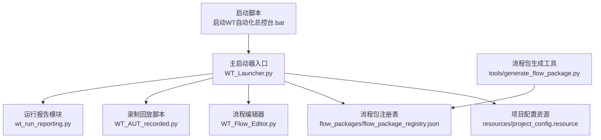

图表来源
- [WT_Launcher.py](file://WT_Launcher.py)
- [启动WT自动化总控台.bat](file://启动WT自动化总控台.bat)
- [resources/project_config.resource](file://resources/project_config.resource)
- [flow_packages/flow_package_registry.json](file://flow_packages/flow_package_registry.json)
- [WT_Flow_Editor.py](file://WT_Flow_Editor.py)
- [WT_AUT_recorded.py](file://WT_AUT_recorded.py)
- [wt_run_reporting.py](file://wt_run_reporting.py)
- [tools/generate_flow_package.py](file://tools/generate_flow_package.py)

章节来源
- [PROJECT_ARCHITECTURE.md](file://PROJECT_ARCHITECTURE.md)
- [README.md](file://README.md)

## 核心组件
- 主启动器入口（WT_Launcher.py）
  - 负责解析命令行参数、加载项目配置、初始化UI/控制台模式、分发到子模块（编辑器、录制、报告等）。
- 批处理启动器（启动WT自动化总控台.bat）
  - 封装Python解释器路径与环境变量，调用主启动器，便于非技术用户一键启动。
- 项目配置资源（resources/project_config.resource）
  - 集中定义项目元数据、默认环境、常用工作流、插件清单等。
- 流程包注册表（flow_packages/flow_package_registry.json）
  - 维护可用流程包的索引与版本信息，供启动器快速发现与加载。
- 运行报告模块（wt_run_reporting.py）
  - 统一收集执行结果、指标与日志摘要，输出结构化报告。
- 流程编辑器与录制回放（WT_Flow_Editor.py、WT_AUT_recorded.py）
  - 提供可视化编辑与录制回放能力，作为启动器可调用的子功能。

章节来源
- [WT_Launcher.py](file://WT_Launcher.py)
- [启动WT自动化总控台.bat](file://启动WT自动化总控台.bat)
- [resources/project_config.resource](file://resources/project_config.resource)
- [flow_packages/flow_package_registry.json](file://flow_packages/flow_package_registry.json)
- [wt_run_reporting.py](file://wt_run_reporting.py)
- [WT_Flow_Editor.py](file://WT_Flow_Editor.py)
- [WT_AUT_recorded.py](file://WT_AUT_recorded.py)

## 架构总览
主启动器采用"入口+配置+插件/包+子模块"的分层架构：
- 入口层：批处理脚本与Python入口，负责环境准备与参数解析
- 配置层：项目配置资源与流程包注册表，提供静态与动态能力发现
- 能力层：流程编辑器、录制回放、报告生成等子模块
- 扩展层：通过注册表与资源文件实现插件/流程包的热插拔

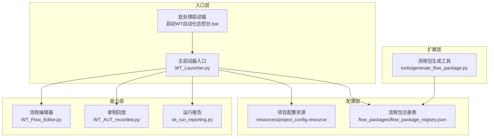

图表来源
- [WT_Launcher.py](file://WT_Launcher.py)
- [启动WT自动化总控台.bat](file://启动WT自动化总控台.bat)
- [resources/project_config.resource](file://resources/project_config.resource)
- [flow_packages/flow_package_registry.json](file://flow_packages/flow_package_registry.json)
- [WT_Flow_Editor.py](file://WT_Flow_Editor.py)
- [WT_AUT_recorded.py](file://WT_AUT_recorded.py)
- [wt_run_reporting.py](file://wt_run_reporting.py)
- [tools/generate_flow_package.py](file://tools/generate_flow_package.py)

## 详细组件分析

### 启动器界面设计与用户交互流程
- 界面形态
  - 控制台模式：通过命令行参数切换，适合CI/CD与无头环境
  - GUI模式：由主启动器根据配置与平台能力决定是否启用图形界面
  - Simple模式：新增的简化操作界面，提供6个常用功能板块卡片
- 关键交互流程
  - 项目选择：读取项目配置资源，列出可用项目与工作空间
  - 环境配置：合并系统环境变量、配置文件与环境覆盖项
  - 快速启动：根据最近使用记录与默认标签，一键进入指定流程
- 推荐交互步骤
  - 启动后显示"最近项目/常用流程"卡片
  - 点击项目卡片进入"环境校验→依赖检查→启动流程"流水线
  - 失败时弹出诊断提示与修复建议

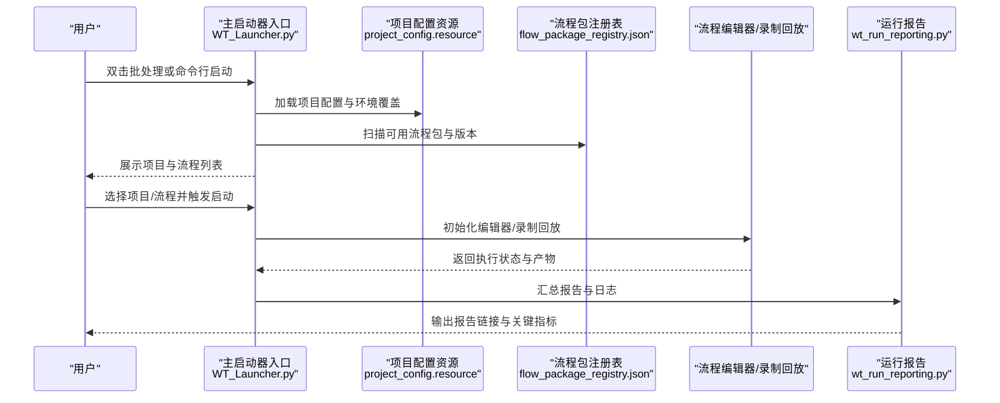

图表来源
- [WT_Launcher.py](file://WT_Launcher.py)
- [resources/project_config.resource](file://resources/project_config.resource)
- [flow_packages/flow_package_registry.json](file://flow_packages/flow_package_registry.json)
- [WT_Flow_Editor.py](file://WT_Flow_Editor.py)
- [WT_AUT_recorded.py](file://WT_AUT_recorded.py)
- [wt_run_reporting.py](file://wt_run_reporting.py)

章节来源
- [WT_Launcher.py](file://WT_Launcher.py)
- [启动WT自动化总控台.bat](file://启动WT自动化总控台.bat)
- [resources/project_config.resource](file://resources/project_config.resource)
- [flow_packages/flow_package_registry.json](file://flow_packages/flow_package_registry.json)
- [wt_run_reporting.py](file://wt_run_reporting.py)

### 增强启动和执行逻辑
**更新** 启动器现在具备更强大的启动和执行管理能力：

- 进程管理增强
  - 多线程输出监控：通过独立的输出读取线程和退出等待线程，确保实时日志显示
  - 智能进程控制：支持优雅停止和强制终止，提供用户确认对话框
  - 状态同步：实时更新状态栏、当前步骤和进程状态显示
- 错误处理改进
  - 启动前验证：在执行前验证流程链路文件和配置完整性
  - 异常捕获：完善的异常处理机制，提供友好的错误提示
  - 恢复机制：支持部分失败的恢复和重试
- 进度反馈优化
  - 实时日志：彩色分类显示不同类型的日志信息
  - 步骤追踪：自动识别并显示当前执行步骤
  - 完成通知：执行完成后自动刷新运行报告

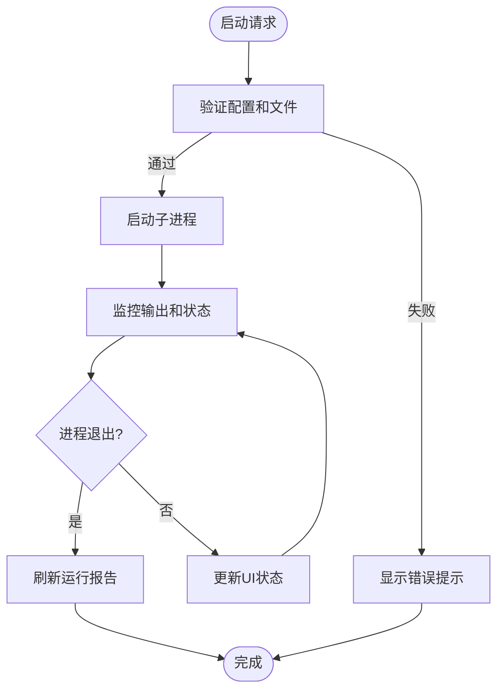

图表来源
- [WT_Launcher.py:3136-3275](file://WT_Launcher.py#L3136-L3275)

章节来源
- [WT_Launcher.py](file://WT_Launcher.py)

### 新增Simple模式界面
**新增** 提供了简化的操作流程界面：

- 6个功能板块卡片
  - 新建地形信息数据、新建气象数据、新建风机类型
  - 新建工程项目、发送CFD计算、发送综合计算
- 批量操作支持
  - 全选/取消全选功能
  - 顺序执行选中的板块
  - 实时进度显示和状态更新
- 流程管理
  - 导入流程JSON文件
  - 导入Excel流程定义
  - 导出当前流程配置

图表来源
- [WT_Launcher.py:1302-1600](file://WT_Launcher.py#L1302-L1600)

章节来源
- [WT_Launcher.py](file://WT_Launcher.py)

### 相对区域取点助手
**新增** 提供了强大的相对区域定位工具：

- 父窗口抓取
  - 直接抓取当前前台窗口
  - 延时抓取父窗口（避免窗口遮挡）
  - 自动识别窗口标题、类名和框架类型
- 区域选择
  - 手动画框选择目标区域
  - 延时记录鼠标中心点
  - 实时预览和坐标计算
- 动作生成
  - 自动生成actionConfig配置
  - 支持type_text_relative和click_relative_region两种动作
  - 提供完整的步骤模板

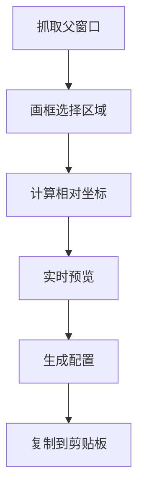

图表来源
- [WT_Launcher.py:287-1062](file://WT_Launcher.py#L287-L1062)

章节来源
- [WT_Launcher.py](file://WT_Launcher.py)

### 项目管理系统核心特性
- 项目创建
  - 通过模板与注册表快速生成项目骨架，写入项目配置资源
- 版本控制
  - 为每个项目维护版本元数据与变更历史，支持回滚与对比
- 团队协作
  - 基于共享工作区与锁定机制，避免并发冲突；结合报告与审计日志追踪协作轨迹

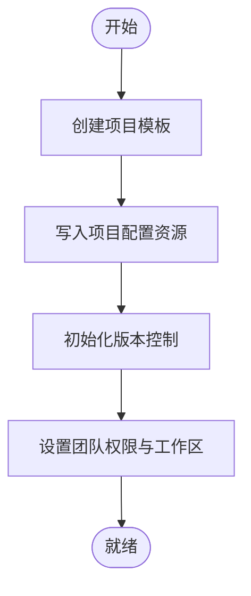

章节来源
- [resources/project_config.resource](file://resources/project_config.resource)
- [flow_packages/flow_package_registry.json](file://flow_packages/flow_package_registry.json)

### 启动器配置管理机制
- 环境变量设置
  - 批处理脚本在启动前注入必要的环境变量（如Python路径、工作目录、调试开关）
  - 主启动器按优先级合并：系统环境变量 → 配置文件 → 运行时覆盖
- 依赖管理
  - 通过注册表声明依赖包与版本约束，启动时进行一致性校验
- 插件加载
  - 基于注册表的插件清单动态导入，支持热更新与灰度发布

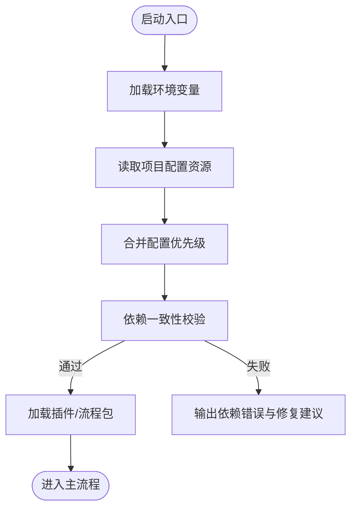

图表来源
- [启动WT自动化总控台.bat](file://启动WT自动化总控台.bat)
- [WT_Launcher.py](file://WT_Launcher.py)
- [resources/project_config.resource](file://resources/project_config.resource)
- [flow_packages/flow_package_registry.json](file://flow_packages/flow_package_registry.json)

章节来源
- [启动WT自动化总控台.bat](file://启动WT自动化总控台.bat)
- [WT_Launcher.py](file://WT_Launcher.py)
- [resources/project_config.resource](file://resources/project_config.resource)
- [flow_packages/flow_package_registry.json](file://flow_packages/flow_package_registry.json)

### 批量任务调度与监控
- 任务队列管理
  - 将多个流程实例放入队列，按策略（FIFO、优先级、资源亲和）调度执行
- 进度跟踪
  - 每个任务维护状态机（待执行、执行中、成功、失败），并通过报告模块聚合
- 监控与告警
  - 对失败率、耗时、资源占用进行统计，异常阈值触发告警

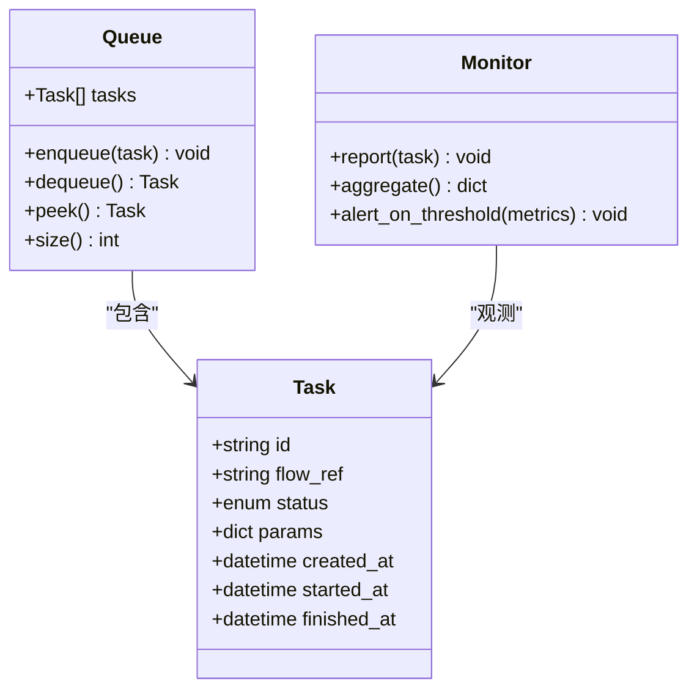

图表来源
- [wt_run_reporting.py](file://wt_run_reporting.py)
- [tests/test_wt_run_reporting.py](file://tests/test_wt_run_reporting.py)

章节来源
- [wt_run_reporting.py](file://wt_run_reporting.py)
- [tests/test_wt_run_reporting.py](file://tests/test_wt_run_reporting.py)

### 日志记录与错误诊断
- 日志分层
  - 启动期：环境与配置加载、依赖校验
  - 运行期：流程执行、外部系统交互
  - 收尾期：报告生成、清理临时文件
- 诊断要点
  - 失败堆栈与上下文快照
  - 关键指标（耗时、重试次数、资源峰值）
  - 定位线索（输入参数、环境差异、第三方服务响应）

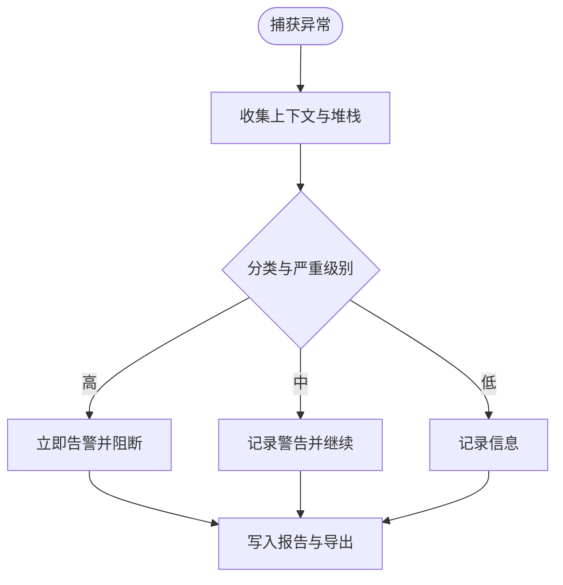

章节来源
- [wt_run_reporting.py](file://wt_run_reporting.py)
- [tests/test_wt_run_reporting.py](file://tests/test_wt_run_reporting.py)

### 多环境部署配置指南与最佳实践
- 环境划分
  - 开发、测试、预发、生产，分别维护独立的项目配置与注册表
- 配置隔离
  - 使用环境变量区分敏感信息（密钥、路径、端点）
  - 通过启动脚本注入不同环境的覆盖值
- 依赖与镜像
  - 固定依赖版本，构建不可变镜像，减少漂移
- 灰度与回滚
  - 基于注册表版本与项目版本协同，支持快速回滚

章节来源
- [启动WT自动化总控台.bat](file://启动WT自动化总控台.bat)
- [resources/project_config.resource](file://resources/project_config.resource)
- [flow_packages/flow_package_registry.json](file://flow_packages/flow_package_registry.json)

### 自定义扩展与主题定制
- 插件扩展
  - 在注册表中声明插件元数据与入口，启动器按需加载
- 流程包扩展
  - 使用生成工具产出标准流程包，纳入注册表统一管理
- 主题定制
  - 通过资源文件定义主题键值，启动器渲染时应用

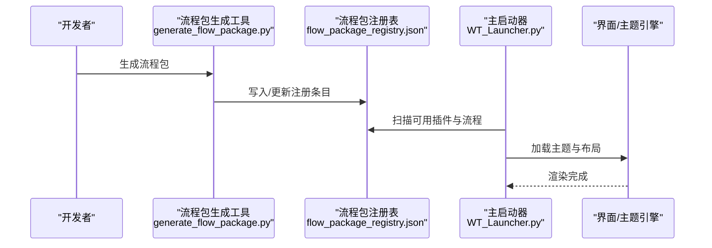

图表来源
- [tools/generate_flow_package.py](file://tools/generate_flow_package.py)
- [flow_packages/flow_package_registry.json](file://flow_packages/flow_package_registry.json)
- [WT_Launcher.py](file://WT_Launcher.py)

章节来源
- [tools/generate_flow_package.py](file://tools/generate_flow_package.py)
- [flow_packages/flow_package_registry.json](file://flow_packages/flow_package_registry.json)
- [WT_Launcher.py](file://WT_Launcher.py)

## 依赖关系分析
- 直接依赖
  - 主启动器依赖项目配置资源与流程包注册表
  - 批处理脚本依赖Python解释器与主启动器入口
- 间接依赖
  - 流程编辑器与录制回放被主启动器按需调用
  - 运行报告模块用于统一输出与聚合
- 潜在风险
  - 注册表与配置不一致导致能力缺失
  - 环境变量覆盖顺序不当引发行为偏差

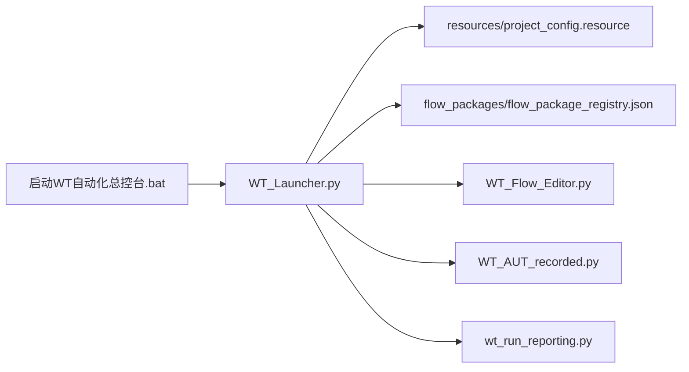

图表来源
- [WT_Launcher.py](file://WT_Launcher.py)
- [启动WT自动化总控台.bat](file://启动WT自动化总控台.bat)
- [resources/project_config.resource](file://resources/project_config.resource)
- [flow_packages/flow_package_registry.json](file://flow_packages/flow_package_registry.json)
- [WT_Flow_Editor.py](file://WT_Flow_Editor.py)
- [WT_AUT_recorded.py](file://WT_AUT_recorded.py)
- [wt_run_reporting.py](file://wt_run_reporting.py)

章节来源
- [WT_Launcher.py](file://WT_Launcher.py)
- [启动WT自动化总控台.bat](file://启动WT自动化总控台.bat)
- [resources/project_config.resource](file://resources/project_config.resource)
- [flow_packages/flow_package_registry.json](file://flow_packages/flow_package_registry.json)
- [WT_Flow_Editor.py](file://WT_Flow_Editor.py)
- [WT_AUT_recorded.py](file://WT_AUT_recorded.py)
- [wt_run_reporting.py](file://wt_run_reporting.py)

## 性能考虑
- 启动优化
  - 延迟加载重型模块，按需初始化插件与流程包
  - 缓存项目与注册表索引，减少重复IO
- 执行优化
  - 并行执行互不依赖的任务，限制并发上限保护资源
  - 对长耗时操作引入进度回调与断点续跑
- 报告优化
  - 增量写入与压缩归档，降低磁盘压力

[本节为通用指导，无需特定文件引用]

## 故障排查指南
- 常见问题
  - 环境变量缺失或覆盖顺序错误：检查批处理脚本与启动参数
  - 依赖不一致：查看注册表与本地环境差异，执行依赖校验
  - 插件加载失败：核对插件清单与入口路径
- 定位手段
  - 启用详细日志，关注启动期与运行期关键节点
  - 使用报告模块输出的指标与堆栈，快速缩小范围
- 恢复策略
  - 回滚至上一稳定版本（项目与流程包双维度）
  - 隔离问题环境，复现最小用例

章节来源
- [wt_run_reporting.py](file://wt_run_reporting.py)
- [tests/test_wt_run_reporting.py](file://tests/test_wt_run_reporting.py)

## 结论
主启动器以"配置驱动+注册表发现+模块化能力"为核心，提供了从项目选择、环境配置到快速启动的一体化体验。通过统一的报告与诊断能力，配合多环境部署与可扩展的插件/流程包体系，能够在团队协作与持续集成场景下稳定运行。建议在工程实践中强化配置治理、依赖锁定与可观测性建设，以获得更高的可靠性与可维护性。

[本节为总结性内容，无需特定文件引用]

## 附录
- 术语
  - 流程包：一组可执行的自动化流程定义与资源集合
  - 注册表：集中描述可用流程包与插件的索引文件
  - 项目配置：描述项目元数据、环境、工作区与默认行为的配置资源
- 参考
  - 项目架构概览与README说明

章节来源
- [PROJECT_ARCHITECTURE.md](file://PROJECT_ARCHITECTURE.md)
- [README.md](file://README.md)