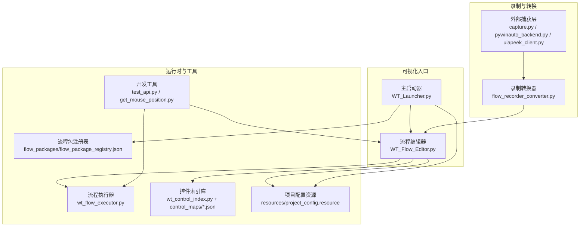
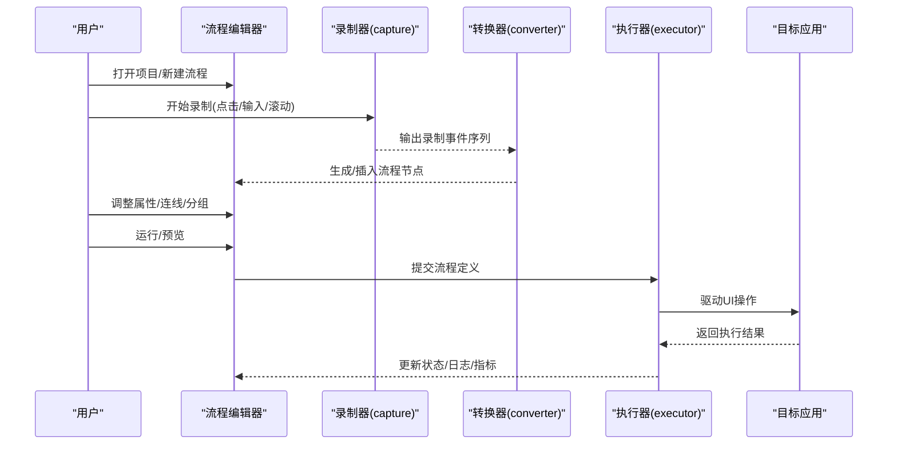
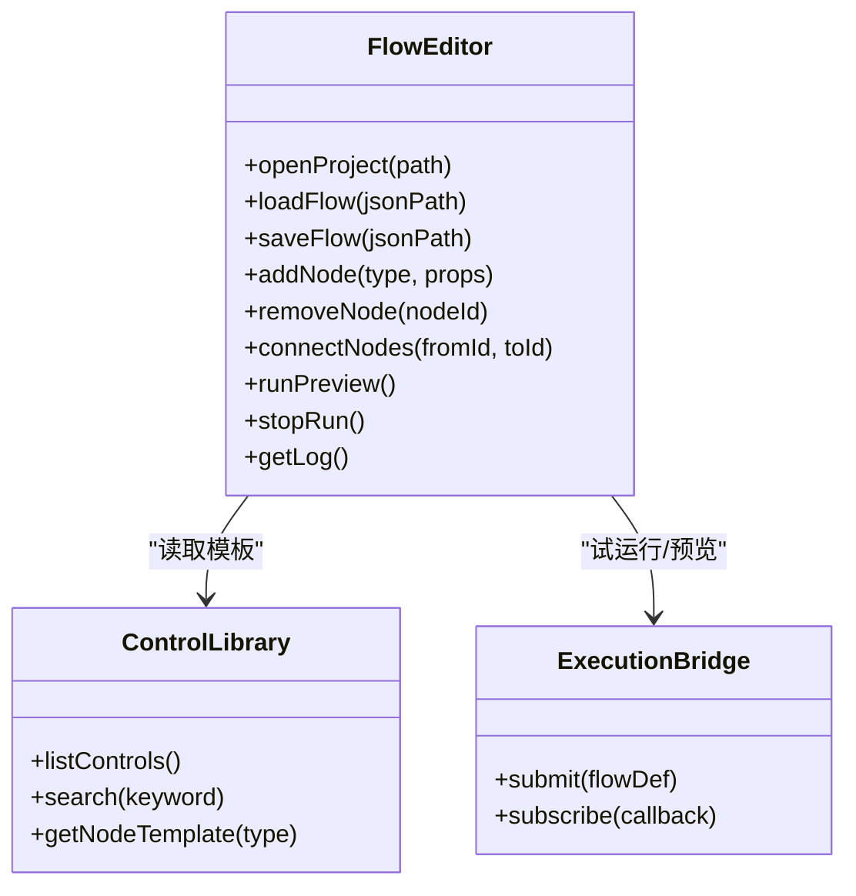
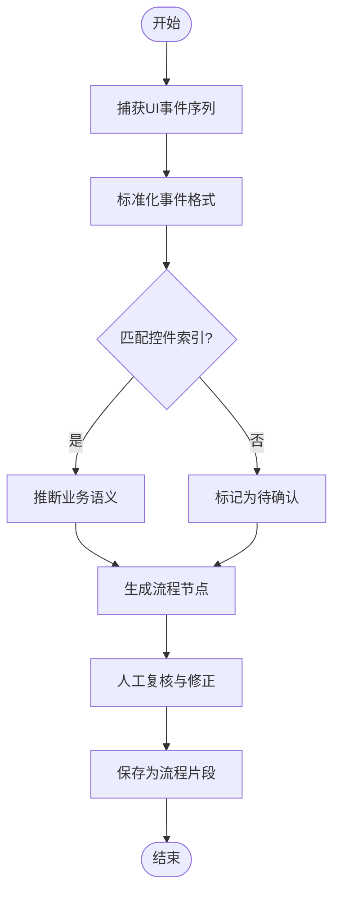
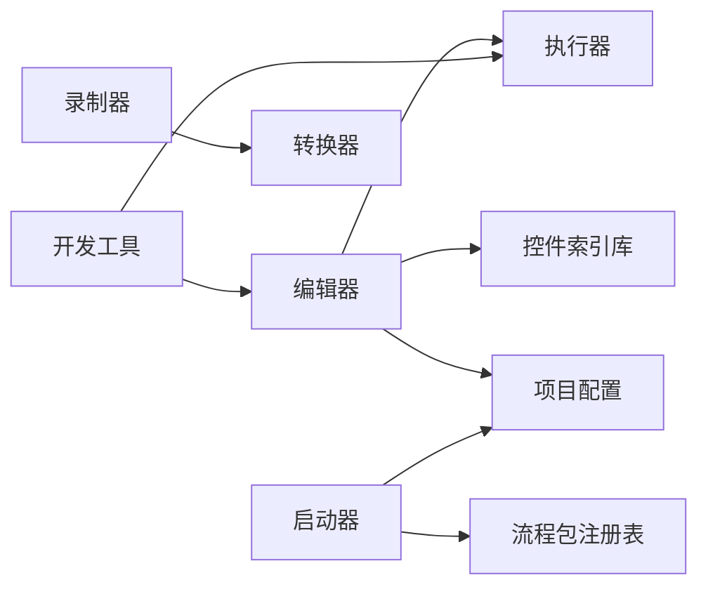

# 可视化工具

<cite>
**本文引用的文件**   
- [WT_Flow_Editor.py](file://WT_Flow_Editor.py)
- [WT_Launcher.py](file://WT_Launcher.py)
- [flow_recorder_converter.py](file://flow_recorder_converter.py)
- [tools/external_capture/capture.py](file://tools/external_capture/capture.py)
- [tools/external_capture/pywinauto_backend.py](file://tools/external_capture/pywinauto_backend.py)
- [tools/external_capture/uiapeek_client.py](file://tools/external_capture/uiapeek_client.py)
- [tools/dev_utils/test_api.py](file://tools/dev_utils/test_api.py)
- [tools/dev_utils/get_mouse_position.py](file://tools/dev_utils/get_mouse_position.py)
- [wt_flow_editor_utils.py](file://wt_flow_editor_utils.py)
- [wt_flow_executor.py](file://wt_flow_executor.py)
- [wt_control_index.py](file://wt_control_index.py)
- [control_maps/总控件信息.json](file://control_maps/总控件信息.json)
- [flow_packages/flow_package_registry.json](file://flow_packages/flow_package_registry.json)
- [resources/project_config.resource](file://resources/project_config.resource)
</cite>

## 目录
1. [简介](#简介)
2. [项目结构](#项目结构)
3. [核心组件](#核心组件)
4. [架构总览](#架构总览)
5. [详细组件分析](#详细组件分析)
6. [依赖关系分析](#依赖关系分析)
7. [性能考量](#性能考量)
8. [故障排查指南](#故障排查指南)
9. [结论](#结论)
10. [附录](#附录)

## 简介
本文件面向WT自动化框架的“可视化工具集”，聚焦以下目标：
- 流程编辑器：拖拽式流程设计、属性配置与实时预览的使用方法。
- 录制转换器：将手动操作录制转换为自动化脚本的规则与步骤。
- 主启动器：功能界面与项目管理能力。
- 开发工具集：调试工具、性能分析器与API测试工具的使用说明。
- 配置选项与快捷键：各工具的常用配置与快捷操作。
- 使用场景与最佳实践：典型工作流与注意事项。
- 扩展机制与自定义开发：如何扩展工具能力与集成第三方后端。

## 项目结构
可视化工具集围绕三个入口与若干支撑模块组织：
- 流程编辑器：提供可视化编排与执行预览。
- 主启动器：统一入口，管理项目、流程包与运行环境。
- 录制与转换：捕获UI交互并生成可执行的流程定义。
- 开发工具：辅助调试、定位与接口验证。

图表来源
- [WT_Flow_Editor.py](file://WT_Flow_Editor.py)
- [WT_Launcher.py](file://WT_Launcher.py)
- [tools/external_capture/capture.py](file://tools/external_capture/capture.py)
- [tools/external_capture/pywinauto_backend.py](file://tools/external_capture/pywinauto_backend.py)
- [tools/external_capture/uiapeek_client.py](file://tools/external_capture/uiapeek_client.py)
- [flow_recorder_converter.py](file://flow_recorder_converter.py)
- [wt_flow_executor.py](file://wt_flow_executor.py)
- [wt_control_index.py](file://wt_control_index.py)
- [control_maps/总控件信息.json](file://control_maps/总控件信息.json)
- [flow_packages/flow_package_registry.json](file://flow_packages/flow_package_registry.json)
- [resources/project_config.resource](file://resources/project_config.resource)

章节来源
- [WT_Flow_Editor.py](file://WT_Flow_Editor.py)
- [WT_Launcher.py](file://WT_Launcher.py)
- [flow_recorder_converter.py](file://flow_recorder_converter.py)
- [tools/external_capture/capture.py](file://tools/external_capture/capture.py)
- [tools/external_capture/pywinauto_backend.py](file://tools/external_capture/pywinauto_backend.py)
- [tools/external_capture/uiapeek_client.py](file://tools/external_capture/uiapeek_client.py)
- [tools/dev_utils/test_api.py](file://tools/dev_utils/test_api.py)
- [tools/dev_utils/get_mouse_position.py](file://tools/dev_utils/get_mouse_position.py)
- [wt_flow_editor_utils.py](file://wt_flow_editor_utils.py)
- [wt_flow_executor.py](file://wt_flow_executor.py)
- [wt_control_index.py](file://wt_control_index.py)
- [control_maps/总控件信息.json](file://control_maps/总控件信息.json)
- [flow_packages/flow_package_registry.json](file://flow_packages/flow_package_registry.json)
- [resources/project_config.resource](file://resources/project_config.resource)

## 核心组件
- 流程编辑器（WT_Flow_Editor.py）
  - 提供节点画布、连线与属性面板；支持从控件库选择动作、设置参数、校验与保存。
  - 与流程执行器联动进行“实时预览”或“试运行”。
- 主启动器（WT_Launcher.py）
  - 统一入口，加载项目配置、流程包注册表，创建并管理多个编辑器实例。
- 录制与转换（capture.py + flow_recorder_converter.py）
  - 通过pywinauto或UIA Peek捕获用户操作，生成中间录制数据，再转换为标准流程定义。
- 开发工具（test_api.py, get_mouse_position.py）
  - 用于快速验证API、获取鼠标位置等辅助能力，提升调试效率。
- 控件索引与库（wt_control_index.py + control_maps/*.json）
  - 维护控件识别规则与映射，为编辑器与执行器提供稳定定位能力。
- 流程包注册表（flow_package_registry.json）
  - 声明可用流程包、版本与元信息，供启动器与编辑器发现与加载。
- 项目配置资源（project_config.resource）
  - 存储全局偏好、路径、主题等配置项。

章节来源
- [WT_Flow_Editor.py](file://WT_Flow_Editor.py)
- [WT_Launcher.py](file://WT_Launcher.py)
- [flow_recorder_converter.py](file://flow_recorder_converter.py)
- [tools/external_capture/capture.py](file://tools/external_capture/capture.py)
- [tools/external_capture/pywinauto_backend.py](file://tools/external_capture/pywinauto_backend.py)
- [tools/external_capture/uiapeek_client.py](file://tools/external_capture/uiapeek_client.py)
- [tools/dev_utils/test_api.py](file://tools/dev_utils/test_api.py)
- [tools/dev_utils/get_mouse_position.py](file://tools/dev_utils/get_mouse_position.py)
- [wt_control_index.py](file://wt_control_index.py)
- [control_maps/总控件信息.json](file://control_maps/总控件信息.json)
- [flow_packages/flow_package_registry.json](file://flow_packages/flow_package_registry.json)
- [resources/project_config.resource](file://resources/project_config.resource)

## 架构总览
可视化工作流由“编辑—转换—执行—反馈”闭环构成：
- 用户在编辑器中拖拽节点、配置属性，形成流程定义。
- 录制器捕获真实UI交互，经转换器生成流程定义片段。
- 执行器按流程定义驱动目标应用，返回状态与日志。
- 开发工具辅助定位问题、验证接口与性能瓶颈。

图表来源
- [WT_Flow_Editor.py](file://WT_Flow_Editor.py)
- [tools/external_capture/capture.py](file://tools/external_capture/capture.py)
- [flow_recorder_converter.py](file://flow_recorder_converter.py)
- [wt_flow_executor.py](file://wt_flow_executor.py)

## 详细组件分析

### 流程编辑器（WT_Flow_Editor.py）
- 功能要点
  - 拖拽式流程设计：从左侧控件库拖入节点到画布，自动建立默认连接。
  - 属性配置：右侧属性面板显示当前选中节点的参数，支持类型校验与默认值填充。
  - 实时预览：在编辑器内以“试运行”模式执行单步或子流程，观察状态变化与错误提示。
  - 导入导出：支持从JSON导入/导出流程定义，便于版本管理与协作。
- 关键交互
  - 新增节点：双击控件库条目或在画布右键菜单添加。
  - 删除节点：选中后按Delete键或右键删除。
  - 撤销/重做：Ctrl+Z/Ctrl+Y。
  - 全选/复制/粘贴：Ctrl+A/Ctrl+C/Ctrl+V。
  - 运行/停止：F5运行，Esc停止。
  - 搜索节点：Ctrl+F快速过滤控件库。
- 与执行器集成
  - 调用执行器接口进行试运行，接收执行进度与错误详情，并在属性面板或底部日志区展示。
- 常见配置
  - 画布缩放：Ctrl+滚轮。
  - 网格对齐：视图菜单切换。
  - 主题与字体：项目配置资源中设置。

章节来源
- [WT_Flow_Editor.py](file://WT_Flow_Editor.py)
- [wt_flow_editor_utils.py](file://wt_flow_editor_utils.py)
- [resources/project_config.resource](file://resources/project_config.resource)

#### 编辑器类图（概念映射）

图表来源
- [WT_Flow_Editor.py](file://WT_Flow_Editor.py)
- [wt_flow_executor.py](file://wt_flow_executor.py)

### 录制转换器（flow_recorder_converter.py）
- 工作原理
  - 录制器捕获底层UI事件（点击、输入、窗口切换等），输出结构化事件序列。
  - 转换器根据事件序列与控件索引库，推断业务语义，生成标准流程节点。
- 转换规则（摘要）
  - 点击事件：映射为“点击控件”节点，优先使用控件索引中的唯一标识。
  - 文本输入：映射为“输入文本”节点，若命中已知字段则自动绑定字段名。
  - 窗口切换：映射为“激活窗口”节点，依据窗口标题或进程匹配。
  - 组合框/下拉：映射为“选择项”节点，解析可见项列表。
  - 异常与不确定：保留为“待确认”节点，需人工复核。
- 使用方法
  - 启动录制器，选择目标应用与后端（pywinauto或UIA）。
  - 执行一次完整的手动操作，结束后停止录制。
  - 在编辑器中选择“导入录制”，转换器自动生成流程片段。
  - 对生成的节点进行合并、拆分与参数修正。
- 快捷键
  - 开始录制：Ctrl+Shift+R
  - 停止录制：Ctrl+Shift+S
  - 回放录制：Ctrl+Shift+P
  - 导出为流程片段：Ctrl+Shift+E

章节来源
- [flow_recorder_converter.py](file://flow_recorder_converter.py)
- [tools/external_capture/capture.py](file://tools/external_capture/capture.py)
- [tools/external_capture/pywinauto_backend.py](file://tools/external_capture/pywinauto_backend.py)
- [tools/external_capture/uiapeek_client.py](file://tools/external_capture/uiapeek_client.py)
- [wt_control_index.py](file://wt_control_index.py)
- [control_maps/总控件信息.json](file://control_maps/总控件信息.json)

#### 转换流程图

图表来源
- [flow_recorder_converter.py](file://flow_recorder_converter.py)
- [tools/external_capture/capture.py](file://tools/external_capture/capture.py)
- [wt_control_index.py](file://wt_control_index.py)

### 主启动器（WT_Launcher.py）
- 功能要点
  - 项目创建与管理：新建/打开/关闭项目，切换工作空间。
  - 流程包管理：加载注册表，浏览、安装、卸载流程包。
  - 多实例编辑器：并行打开多个流程编辑器，共享项目配置。
  - 运行历史与报告：查看最近运行记录与失败原因。
- 界面布局
  - 顶部菜单栏：文件、项目、工具、帮助。
  - 左侧导航：项目树、流程包列表。
  - 中央区域：编辑器容器。
  - 底部面板：日志、控制台、消息通知。
- 快捷键
  - 新建项目：Ctrl+N
  - 打开项目：Ctrl+O
  - 保存项目：Ctrl+S
  - 打开流程包管理器：Ctrl+B
  - 切换主题：Alt+T

章节来源
- [WT_Launcher.py](file://WT_Launcher.py)
- [flow_packages/flow_package_registry.json](file://flow_packages/flow_package_registry.json)
- [resources/project_config.resource](file://resources/project_config.resource)

### 开发工具集
- API测试工具（tools/dev_utils/test_api.py）
  - 用途：快速验证编辑器与执行器的接口契约，模拟提交流程定义并检查返回。
  - 用法：命令行参数指定流程定义路径、期望状态码与断言字段。
  - 输出：结构化测试结果与差异对比。
- 鼠标位置工具（tools/dev_utils/get_mouse_position.py）
  - 用途：获取当前鼠标坐标与屏幕分辨率，辅助定位与相对区域计算。
  - 用法：独立运行，实时打印坐标，支持截图标注。
- 调试建议
  - 结合编辑器日志与执行器日志交叉定位。
  - 使用控件索引库核对控件唯一性，避免误匹配。
  - 对不稳定元素采用相对区域或图像匹配策略。

章节来源
- [tools/dev_utils/test_api.py](file://tools/dev_utils/test_api.py)
- [tools/dev_utils/get_mouse_position.py](file://tools/dev_utils/get_mouse_position.py)
- [wt_flow_executor.py](file://wt_flow_executor.py)
- [wt_control_index.py](file://wt_control_index.py)

### 录制后端与捕获层
- 后端选择
  - pywinauto_backend：适用于Win32/WPF控件，基于Windows UI Automation与Control Pattern。
  - uiapeek_client：轻量级UIA客户端，适合跨进程抓取控件树。
- 捕获流程
  - 初始化后端 → 注入钩子 → 监听事件 → 序列化输出。
- 常见问题
  - 权限不足：以管理员身份运行或启用UIA服务。
  - 控件不可见：切换到可见窗口或使用图像匹配兜底。
  - 延迟导致漏录：增加等待策略与重试机制。

章节来源
- [tools/external_capture/capture.py](file://tools/external_capture/capture.py)
- [tools/external_capture/pywinauto_backend.py](file://tools/external_capture/pywinauto_backend.py)
- [tools/external_capture/uiapeek_client.py](file://tools/external_capture/uiapeek_client.py)

## 依赖关系分析
- 组件耦合
  - 编辑器依赖控件索引库与项目配置，低耦合于执行器（通过桥接接口）。
  - 录制器与转换器解耦，前者专注捕获，后者专注语义推断。
  - 启动器聚合资源与流程包，作为门面协调各子系统。
- 外部依赖
  - pywinauto/UIA：用于控件树与事件捕获。
  - JSON/资源文件：用于流程定义与配置持久化。
- 潜在循环依赖
  - 编辑器与执行器之间通过回调订阅，避免直接强引用。
  - 转换器不反向依赖录制器，仅消费其输出。

图表来源
- [WT_Flow_Editor.py](file://WT_Flow_Editor.py)
- [wt_control_index.py](file://wt_control_index.py)
- [resources/project_config.resource](file://resources/project_config.resource)
- [wt_flow_executor.py](file://wt_flow_executor.py)
- [tools/external_capture/capture.py](file://tools/external_capture/capture.py)
- [flow_recorder_converter.py](file://flow_recorder_converter.py)
- [WT_Launcher.py](file://WT_Launcher.py)
- [flow_packages/flow_package_registry.json](file://flow_packages/flow_package_registry.json)
- [tools/dev_utils/test_api.py](file://tools/dev_utils/test_api.py)

## 性能考量
- 编辑器渲染
  - 大流程时启用虚拟画布与懒加载，减少DOM/绘制压力。
  - 批量操作时使用事务模式，避免频繁重排。
- 录制与转换
  - 事件去抖与合并，降低噪声事件对转换的影响。
  - 控件索引缓存，提高匹配速度。
- 执行器
  - 并发控制：限制同时运行的流程数量，避免资源争用。
  - 重试与退避：对不稳定操作实施指数退避重试。
- 监控与诊断
  - 采集关键指标（节点耗时、失败率、内存占用），在编辑器底部面板展示。
  - 导出性能报告，便于回归分析与优化。

[本节为通用指导，无需具体文件来源]

## 故障排查指南
- 无法启动录制器
  - 检查目标应用是否具备UIA支持，必要时切换后端。
  - 确认权限与服务状态，尝试以管理员身份运行。
- 控件定位失败
  - 核对控件索引库是否包含该控件的唯一标识。
  - 使用鼠标位置工具验证相对区域偏移是否正确。
- 流程执行中断
  - 查看执行器日志与错误堆栈，定位失败节点。
  - 对不稳定元素增加等待条件或改用图像匹配。
- 性能退化
  - 分析性能报告，识别热点节点与长耗时操作。
  - 优化控件匹配策略，减少遍历深度。

章节来源
- [tools/external_capture/capture.py](file://tools/external_capture/capture.py)
- [tools/dev_utils/get_mouse_position.py](file://tools/dev_utils/get_mouse_position.py)
- [wt_flow_executor.py](file://wt_flow_executor.py)
- [wt_control_index.py](file://wt_control_index.py)

## 结论
WT自动化框架的可视化工具集以“编辑器—录制—转换—执行—工具”为核心链路，提供了从手工操作到自动化脚本的一体化解决方案。通过完善的控件索引、灵活的录制后端与强大的开发工具，用户可以在保证稳定性的前提下高效构建与维护自动化流程。建议在生产环境中结合性能监控与回归测试，持续优化流程质量与执行效率。

[本节为总结性内容，无需具体文件来源]

## 附录
- 常用快捷键汇总
  - 编辑器：Ctrl+Z/Y、Ctrl+A/C/V、F5/Esc、Ctrl+F、Ctrl+滚轮。
  - 录制：Ctrl+Shift+R/S/P/E。
  - 启动器：Ctrl+N/O/S/B/T。
- 配置文件参考
  - 项目配置资源：存放主题、路径、默认等待时间等。
  - 流程包注册表：声明包ID、版本、描述与入口。
- 扩展与自定义
  - 新增控件模板：在控件索引库中添加新控件的匹配规则与默认属性。
  - 自定义录制后端：实现统一的捕获接口，替换pywinauto或UIA Peek。
  - 插件化流程包：遵循注册表规范，提供流程定义与元数据。

章节来源
- [resources/project_config.resource](file://resources/project_config.resource)
- [flow_packages/flow_package_registry.json](file://flow_packages/flow_package_registry.json)
- [wt_control_index.py](file://wt_control_index.py)
- [tools/external_capture/pywinauto_backend.py](file://tools/external_capture/pywinauto_backend.py)
- [tools/external_capture/uiapeek_client.py](file://tools/external_capture/uiapeek_client.py)