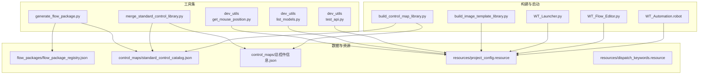
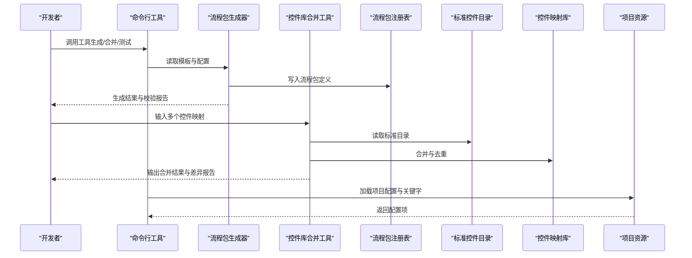
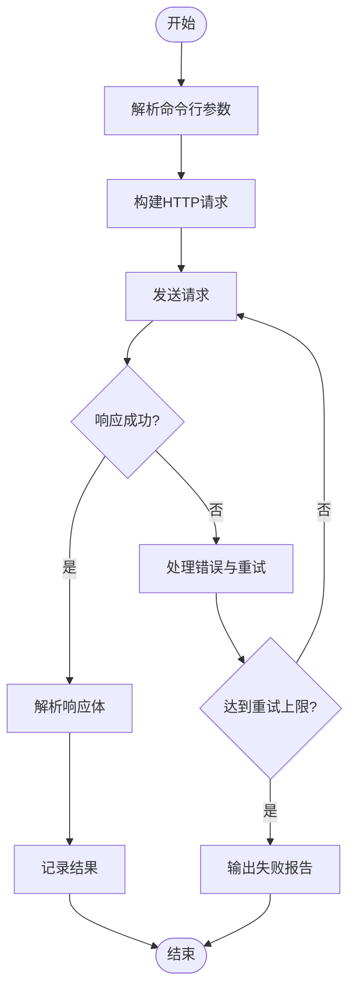
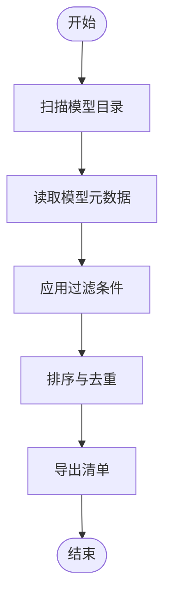
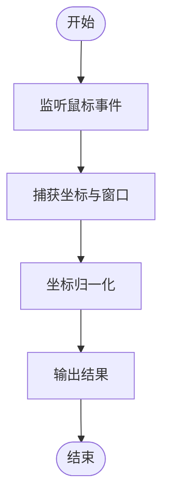
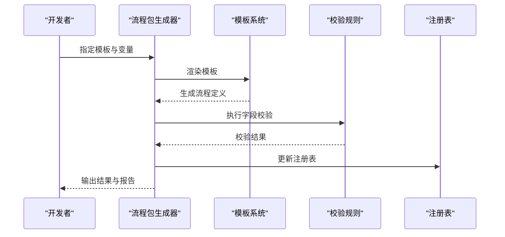
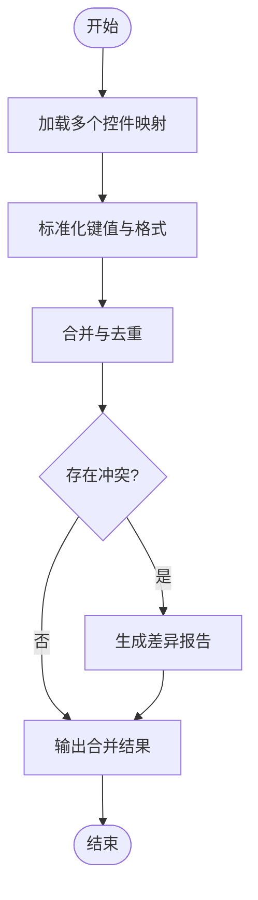
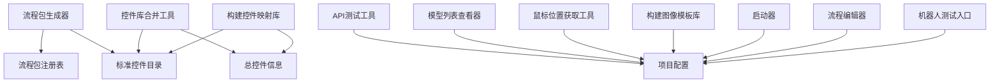

# 开发工具集

<cite>
**本文档引用的文件**   
- [tools/dev_utils/get_mouse_position.py](file://tools/dev_utils/get_mouse_position.py)
- [tools/dev_utils/list_models.py](file://tools/dev_utils/list_models.py)
- [tools/dev_utils/test_api.py](file://tools/dev_utils/test_api.py)
- [tools/generate_flow_package.py](file://tools/generate_flow_package.py)
- [tools/merge_standard_control_library.py](file://tools/merge_standard_control_library.py)
- [flow_packages/flow_package_registry.json](file://flow_packages/flow_package_registry.json)
- [control_maps/standard_control_catalog.json](file://control_maps/standard_control_catalog.json)
- [control_maps/总控件信息.json](file://control_maps/总控件信息.json)
- [WT_Automation.robot](file://WT_Automation.robot)
- [WT_Flow_Editor.py](file://WT_Flow_Editor.py)
- [WT_Launcher.py](file://WT_Launcher.py)
- [build_control_map_library.py](file://build_control_map_library.py)
- [build_image_template_library.py](file://build_image_template_library.py)
- [resources/project_config.resource](file://resources/project_config.resource)
- [resources/dispatch_keywords.resource](file://resources/dispatch_keywords.resource)
</cite>

## 目录
1. [简介](#简介)
2. [项目结构](#项目结构)
3. [核心组件](#核心组件)
4. [架构总览](#架构总览)
5. [详细组件分析](#详细组件分析)
6. [依赖关系分析](#依赖关系分析)
7. [性能考虑](#性能考虑)
8. [故障排查指南](#故障排查指南)
9. [结论](#结论)
10. [附录](#附录)

## 简介
本章节面向WT自动化框架的开发者与测试工程师，系统性介绍开发工具集。内容覆盖：
- API测试工具、模型列表查看器、鼠标位置获取工具等辅助工具的用途与使用方法
- 流程包生成器的功能、模板使用与自定义配置
- 控件库合并工具的工作原理与操作流程
- 调试工具的使用（断点设置、变量监视、执行跟踪）
- 性能分析工具（内存监控、执行时间统计）
- 开发环境配置与常用命令参考
- 工具链集成方法与自动化脚本编写技巧
- 扩展机制与自定义开发方法

## 项目结构
WT自动化框架将开发工具集中在 tools 目录下，并提供若干构建与启动脚本，便于快速搭建环境与运行任务。关键目录与文件包括：
- tools/dev_utils：轻量级开发辅助工具（API测试、模型列表查看、鼠标位置获取）
- tools/generate_flow_package.py：流程包生成器
- tools/merge_standard_control_library.py：控件库合并工具
- flow_packages：流程包定义与注册表
- control_maps：控件映射与标准控件目录
- resources：资源与关键字定义
- 根目录脚本：构建库、启动器、机器人测试入口等

图表来源
- [tools/dev_utils/get_mouse_position.py](file://tools/dev_utils/get_mouse_position.py)
- [tools/dev_utils/list_models.py](file://tools/dev_utils/list_models.py)
- [tools/dev_utils/test_api.py](file://tools/dev_utils/test_api.py)
- [tools/generate_flow_package.py](file://tools/generate_flow_package.py)
- [tools/merge_standard_control_library.py](file://tools/merge_standard_control_library.py)
- [flow_packages/flow_package_registry.json](file://flow_packages/flow_package_registry.json)
- [control_maps/standard_control_catalog.json](file://control_maps/standard_control_catalog.json)
- [control_maps/总控件信息.json](file://control_maps/总控件信息.json)
- [resources/project_config.resource](file://resources/project_config.resource)
- [resources/dispatch_keywords.resource](file://resources/dispatch_keywords.resource)
- [build_control_map_library.py](file://build_control_map_library.py)
- [build_image_template_library.py](file://build_image_template_library.py)
- [WT_Launcher.py](file://WT_Launcher.py)
- [WT_Flow_Editor.py](file://WT_Flow_Editor.py)
- [WT_Automation.robot](file://WT_Automation.robot)

章节来源
- [tools/dev_utils/get_mouse_position.py](file://tools/dev_utils/get_mouse_position.py)
- [tools/dev_utils/list_models.py](file://tools/dev_utils/list_models.py)
- [tools/dev_utils/test_api.py](file://tools/dev_utils/test_api.py)
- [tools/generate_flow_package.py](file://tools/generate_flow_package.py)
- [tools/merge_standard_control_library.py](file://tools/merge_standard_control_library.py)
- [flow_packages/flow_package_registry.json](file://flow_packages/flow_package_registry.json)
- [control_maps/standard_control_catalog.json](file://control_maps/standard_control_catalog.json)
- [control_maps/总控件信息.json](file://control_maps/总控件信息.json)
- [resources/project_config.resource](file://resources/project_config.resource)
- [resources/dispatch_keywords.resource](file://resources/dispatch_keywords.resource)
- [build_control_map_library.py](file://build_control_map_library.py)
- [build_image_template_library.py](file://build_image_template_library.py)
- [WT_Launcher.py](file://WT_Launcher.py)
- [WT_Flow_Editor.py](file://WT_Flow_Editor.py)
- [WT_Automation.robot](file://WT_Automation.robot)

## 核心组件
本节概述各工具的职责与典型用法，帮助快速上手。

- API测试工具（tools/dev_utils/test_api.py）
  - 用途：验证后端接口连通性、鉴权、请求构造与响应解析
  - 典型用法：通过命令行参数指定目标URL、HTTP方法、请求头与负载；支持输出结构化结果与错误码
  - 建议：结合环境变量注入敏感信息（如Token），避免硬编码

- 模型列表查看器（tools/dev_utils/list_models.py）
  - 用途：列出可用模型或元数据，便于确认版本、路径与可用性
  - 典型用法：按分类过滤、导出清单、校验模型完整性
  - 建议：在CI中定期巡检模型清单一致性

- 鼠标位置获取工具（tools/dev_utils/get_mouse_position.py）
  - 用途：捕获当前鼠标坐标与窗口句柄，辅助UI定位与相对区域计算
  - 典型用法：在GUI界面中点击目标控件后输出坐标，用于录制或定位策略
  - 建议：配合多显示器与DPI缩放场景进行校准

- 流程包生成器（tools/generate_flow_package.py）
  - 用途：基于模板与配置生成流程包定义，统一结构与字段校验
  - 典型用法：选择模板、填充变量、输出到flow_packages目录并更新注册表
  - 建议：为不同业务域维护独立模板，保持命名规范

- 控件库合并工具（tools/merge_standard_control_library.py）
  - 用途：合并多个控件映射至标准目录，去重、冲突检测与报告生成
  - 典型用法：输入多个library_*.json，输出标准目录与差异报告
  - 建议：在合并前备份原始库，保留变更记录

章节来源
- [tools/dev_utils/test_api.py](file://tools/dev_utils/test_api.py)
- [tools/dev_utils/list_models.py](file://tools/dev_utils/list_models.py)
- [tools/dev_utils/get_mouse_position.py](file://tools/dev_utils/get_mouse_position.py)
- [tools/generate_flow_package.py](file://tools/generate_flow_package.py)
- [tools/merge_standard_control_library.py](file://tools/merge_standard_control_library.py)

## 架构总览
下图展示工具集与数据资源的交互关系，以及构建与启动脚本如何协同工作。

图表来源
- [tools/generate_flow_package.py](file://tools/generate_flow_package.py)
- [tools/merge_standard_control_library.py](file://tools/merge_standard_control_library.py)
- [flow_packages/flow_package_registry.json](file://flow_packages/flow_package_registry.json)
- [control_maps/standard_control_catalog.json](file://control_maps/standard_control_catalog.json)
- [resources/project_config.resource](file://resources/project_config.resource)
- [resources/dispatch_keywords.resource](file://resources/dispatch_keywords.resource)

## 详细组件分析

### API测试工具（tools/dev_utils/test_api.py）
- 职责
  - 发送HTTP请求并解析响应
  - 支持常见认证方式与重试逻辑
  - 输出结构化日志与失败原因
- 关键流程
  - 参数解析 → 构建请求 → 发送请求 → 解析响应 → 记录结果
- 使用建议
  - 将敏感信息放入环境变量
  - 在CI流水线中作为冒烟测试步骤
  - 对超时与网络异常做幂等重试

图表来源
- [tools/dev_utils/test_api.py](file://tools/dev_utils/test_api.py)

章节来源
- [tools/dev_utils/test_api.py](file://tools/dev_utils/test_api.py)

### 模型列表查看器（tools/dev_utils/list_models.py）
- 职责
  - 枚举可用模型与元数据
  - 提供过滤、排序与导出能力
- 关键流程
  - 扫描模型目录 → 读取元数据 → 过滤与排序 → 输出清单
- 使用建议
  - 在部署前后对比清单，确保一致性
  - 与注册表联动，检查缺失或重复条目

图表来源
- [tools/dev_utils/list_models.py](file://tools/dev_utils/list_models.py)

章节来源
- [tools/dev_utils/list_models.py](file://tools/dev_utils/list_models.py)

### 鼠标位置获取工具（tools/dev_utils/get_mouse_position.py）
- 职责
  - 获取当前鼠标坐标与所属窗口
  - 输出可用于UI定位的结构化数据
- 关键流程
  - 监听鼠标事件 → 捕获坐标 → 识别窗口 → 输出结果
- 使用建议
  - 在多显示器环境下注意坐标系转换
  - 结合DPI缩放校正相对区域

图表来源
- [tools/dev_utils/get_mouse_position.py](file://tools/dev_utils/get_mouse_position.py)

章节来源
- [tools/dev_utils/get_mouse_position.py](file://tools/dev_utils/get_mouse_position.py)

### 流程包生成器（tools/generate_flow_package.py）
- 职责
  - 基于模板生成流程包定义
  - 校验必填字段与类型
  - 更新流程包注册表
- 关键流程
  - 选择模板 → 填充变量 → 生成JSON → 校验 → 写入注册表
- 使用建议
  - 为不同业务域维护模板集合
  - 在生成后自动触发校验与回归用例

图表来源
- [tools/generate_flow_package.py](file://tools/generate_flow_package.py)
- [flow_packages/flow_package_registry.json](file://flow_packages/flow_package_registry.json)

章节来源
- [tools/generate_flow_package.py](file://tools/generate_flow_package.py)
- [flow_packages/flow_package_registry.json](file://flow_packages/flow_package_registry.json)

### 控件库合并工具（tools/merge_standard_control_library.py）
- 职责
  - 合并多个控件映射至标准目录
  - 冲突检测与差异报告
- 关键流程
  - 读取输入库 → 标准化键值 → 合并与去重 → 冲突检测 → 输出结果
- 使用建议
  - 合并前备份原始库
  - 在CI中自动执行合并与报告归档

图表来源
- [tools/merge_standard_control_library.py](file://tools/merge_standard_control_library.py)
- [control_maps/standard_control_catalog.json](file://control_maps/standard_control_catalog.json)
- [control_maps/总控件信息.json](file://control_maps/总控件信息.json)

章节来源
- [tools/merge_standard_control_library.py](file://tools/merge_standard_control_library.py)
- [control_maps/standard_control_catalog.json](file://control_maps/standard_control_catalog.json)
- [control_maps/总控件信息.json](file://control_maps/总控件信息.json)

### 调试工具使用指南
- 断点设置
  - 在IDE中于关键函数入口与分支处设置断点
  - 针对异常路径与边界条件增加断点
- 变量监视
  - 监视请求对象、响应对象与中间状态
  - 对复杂数据结构展开层级观察
- 执行跟踪
  - 启用详细日志级别，记录关键步骤与耗时
  - 使用调用栈回溯定位问题源头

[本节为通用指导，不直接分析具体文件]

### 性能分析工具使用指南
- 内存使用监控
  - 在长流程执行前后采集内存快照，比较增量变化
  - 关注大对象与缓存释放情况
- 执行时间统计
  - 对关键路径打点计时，识别瓶颈
  - 结合并发与I/O等待分析优化空间

[本节为通用指导，不直接分析具体文件]

## 依赖关系分析
工具之间的依赖主要体现在数据与资源配置上。以下图展示主要依赖关系。

图表来源
- [tools/generate_flow_package.py](file://tools/generate_flow_package.py)
- [tools/merge_standard_control_library.py](file://tools/merge_standard_control_library.py)
- [flow_packages/flow_package_registry.json](file://flow_packages/flow_package_registry.json)
- [control_maps/standard_control_catalog.json](file://control_maps/standard_control_catalog.json)
- [control_maps/总控件信息.json](file://control_maps/总控件信息.json)
- [resources/project_config.resource](file://resources/project_config.resource)
- [build_control_map_library.py](file://build_control_map_library.py)
- [build_image_template_library.py](file://build_image_template_library.py)
- [WT_Launcher.py](file://WT_Launcher.py)
- [WT_Flow_Editor.py](file://WT_Flow_Editor.py)
- [WT_Automation.robot](file://WT_Automation.robot)

章节来源
- [tools/generate_flow_package.py](file://tools/generate_flow_package.py)
- [tools/merge_standard_control_library.py](file://tools/merge_standard_control_library.py)
- [flow_packages/flow_package_registry.json](file://flow_packages/flow_package_registry.json)
- [control_maps/standard_control_catalog.json](file://control_maps/standard_control_catalog.json)
- [control_maps/总控件信息.json](file://control_maps/总控件信息.json)
- [resources/project_config.resource](file://resources/project_config.resource)
- [build_control_map_library.py](file://build_control_map_library.py)
- [build_image_template_library.py](file://build_image_template_library.py)
- [WT_Launcher.py](file://WT_Launcher.py)
- [WT_Flow_Editor.py](file://WT_Flow_Editor.py)
- [WT_Automation.robot](file://WT_Automation.robot)

## 性能考虑
- 批量操作优化
  - 合并与生成流程时采用流式读写，减少内存峰值
  - 对大文件进行分块处理与并行校验
- 缓存策略
  - 对频繁读取的配置与目录索引建立内存缓存
  - 合理设置缓存失效策略，避免脏读
- 并发控制
  - 限制并发度以避免资源争用
  - 对I/O密集型任务使用异步或线程池

[本节为通用指导，不直接分析具体文件]

## 故障排查指南
- 常见问题
  - 配置文件缺失或路径错误：检查资源文件是否存在且可读
  - 模板渲染失败：核对模板语法与变量名
  - 控件映射冲突：查看差异报告，手动解决键值冲突
- 日志与诊断
  - 开启详细日志，记录关键步骤与异常堆栈
  - 使用工具输出的报告进行问题定位
- 回滚与恢复
  - 在合并与生成前备份原始数据
  - 提供一键回滚脚本，快速恢复到稳定版本

章节来源
- [tools/merge_standard_control_library.py](file://tools/merge_standard_control_library.py)
- [tools/generate_flow_package.py](file://tools/generate_flow_package.py)
- [resources/project_config.resource](file://resources/project_config.resource)

## 结论
WT自动化框架的开发工具集覆盖了从API测试、模型管理、UI定位到流程包生成与控件库合并的全链路需求。通过统一的配置与清晰的依赖关系，开发者可以快速搭建环境、编写自动化脚本并进行持续集成。建议在团队内推广最佳实践，完善模板与校验规则，提升整体效率与稳定性。

[本节为总结性内容，不直接分析具体文件]

## 附录
- 常用命令参考
  - 运行API测试：python tools/dev_utils/test_api.py --url <目标地址> --method GET
  - 查看模型清单：python tools/dev_utils/list_models.py --filter <分类> --output <清单文件>
  - 获取鼠标坐标：python tools/dev_utils/get_mouse_position.py --capture
  - 生成流程包：python tools/generate_flow_package.py --template <模板名> --vars <变量文件>
  - 合并控件库：python tools/merge_standard_control_library.py --input <多个库文件> --output <标准目录>
- 构建与启动
  - 构建控件映射库：python build_control_map_library.py
  - 构建图像模板库：python build_image_template_library.py
  - 启动主程序：python WT_Launcher.py
  - 打开流程编辑器：python WT_Flow_Editor.py
  - 运行机器人测试：robot WT_Automation.robot
- 资源与关键字
  - 项目配置：resources/project_config.resource
  - 调度关键字：resources/dispatch_keywords.resource

章节来源
- [tools/dev_utils/test_api.py](file://tools/dev_utils/test_api.py)
- [tools/dev_utils/list_models.py](file://tools/dev_utils/list_models.py)
- [tools/dev_utils/get_mouse_position.py](file://tools/dev_utils/get_mouse_position.py)
- [tools/generate_flow_package.py](file://tools/generate_flow_package.py)
- [tools/merge_standard_control_library.py](file://tools/merge_standard_control_library.py)
- [build_control_map_library.py](file://build_control_map_library.py)
- [build_image_template_library.py](file://build_image_template_library.py)
- [WT_Launcher.py](file://WT_Launcher.py)
- [WT_Flow_Editor.py](file://WT_Flow_Editor.py)
- [WT_Automation.robot](file://WT_Automation.robot)
- [resources/project_config.resource](file://resources/project_config.resource)
- [resources/dispatch_keywords.resource](file://resources/dispatch_keywords.resource)