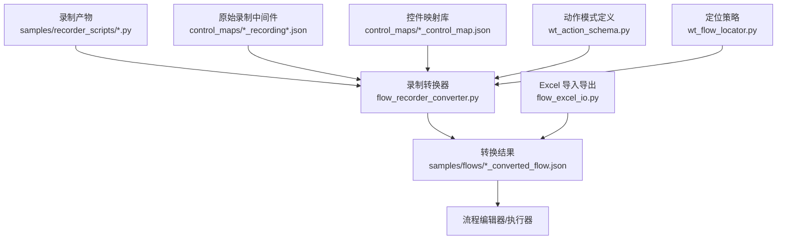
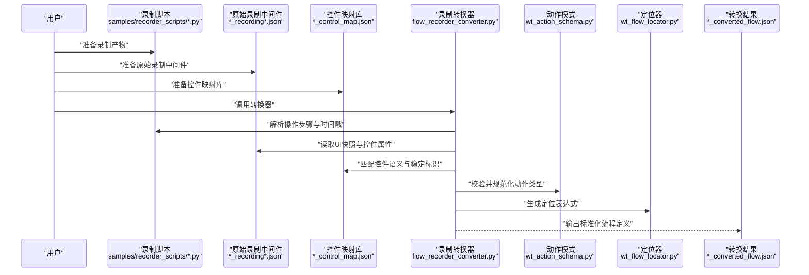
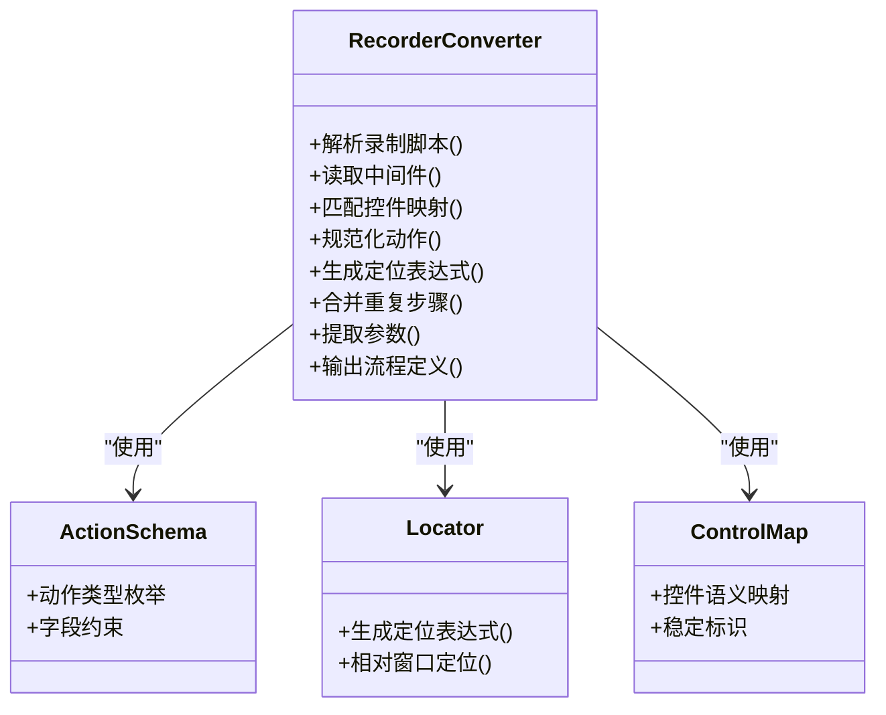
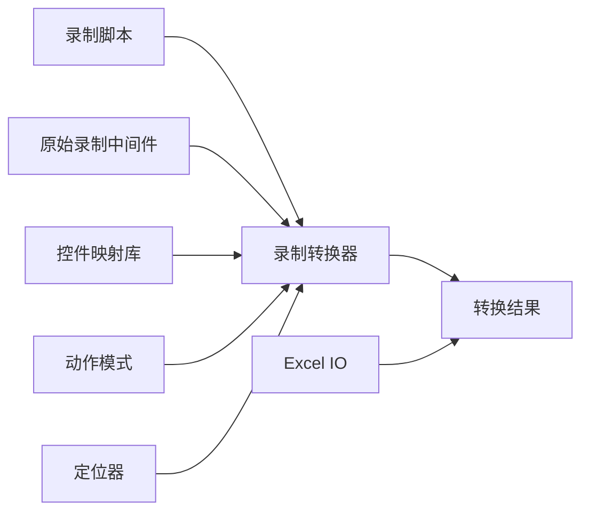

# 录制转换器

<cite>
**本文引用的文件**   
- [flow_recorder_converter.py](file://flow_recorder_converter.py)
- [WT_AUT_recorded.py](file://WT_AUT_recorded.py)
- [test_flow_recorder_converter.py](file://tests/test_flow_recorder_converter.py)
- [samples/recorder_scripts/气象数据录入_20260625.py](file://samples/recorder_scripts/气象数据录入_20260625.py)
- [samples/flows/气象数据录入_20260625_converted_flow.json](file://samples/flows/气象数据录入_20260625_converted_flow.json)
- [control_maps/20260720_153042_uiapeek_recording.json](file://control_maps/20260720_153042_uiapeek_recording.json)
- [control_maps/20260720_153042_recording_uiapeek_control_map.json](file://control_maps/20260720_153042_recording_uiapeek_control_map.json)
- [wt_action_schema.py](file://wt_action_schema.py)
- [wt_flow_locator.py](file://wt_flow_locator.py)
- [flow_excel_io.py](file://flow_excel_io.py)
</cite>

## 目录
1. [简介](#简介)
2. [项目结构](#项目结构)
3. [核心组件](#核心组件)
4. [架构总览](#架构总览)
5. [详细组件分析](#详细组件分析)
6. [依赖分析](#依赖分析)
7. [性能考虑](#性能考虑)
8. [故障排查指南](#故障排查指南)
9. [结论](#结论)
10. [附录](#附录)

## 简介
本文件面向“录制转换器”的使用与实现，系统性阐述如何将手动操作录制转换为可执行的自动化脚本。内容覆盖：
- 录制格式支持与转换规则
- 输出规范与流程编辑器集成
- 录制文件结构与语法（操作步骤、控件识别信息、时间戳）
- 配置选项与高级功能（智能识别优化、重复操作合并、参数提取）
- 录制脚本的编辑与调试方法
- 常见场景处理技巧与性能优化建议
- 录制脚本模板与示例代码路径

## 项目结构
围绕录制转换的核心文件与资源分布如下：
- 转换引擎与入口：flow_recorder_converter.py
- 录制产物样例：samples/recorder_scripts/*.py
- 转换结果样例：samples/flows/*_converted_flow.json
- 原始录制中间件：control_maps/*_recording*.json 与 *_control_map.json
- 动作模式与定位器：wt_action_schema.py、wt_flow_locator.py
- Excel 导入导出：flow_excel_io.py
- 单元测试：tests/test_flow_recorder_converter.py

图表来源
- [flow_recorder_converter.py](file://flow_recorder_converter.py)
- [samples/recorder_scripts/气象数据录入_20260625.py](file://samples/recorder_scripts/气象数据录入_20260625.py)
- [samples/flows/气象数据录入_20260625_converted_flow.json](file://samples/flows/气象数据录入_20260625_converted_flow.json)
- [control_maps/20260720_153042_uiapeek_recording.json](file://control_maps/20260720_153042_uiapeek_recording.json)
- [control_maps/20260720_153042_recording_uiapeek_control_map.json](file://control_maps/20260720_153042_recording_uiapeek_control_map.json)
- [wt_action_schema.py](file://wt_action_schema.py)
- [wt_flow_locator.py](file://wt_flow_locator.py)
- [flow_excel_io.py](file://flow_excel_io.py)

章节来源
- [flow_recorder_converter.py](file://flow_recorder_converter.py)
- [samples/recorder_scripts/气象数据录入_20260625.py](file://samples/recorder_scripts/气象数据录入_20260625.py)
- [samples/flows/气象数据录入_20260625_converted_flow.json](file://samples/flows/气象数据录入_20260625_converted_flow.json)
- [control_maps/20260720_153042_uiapeek_recording.json](file://control_maps/20260720_153042_uiapeek_recording.json)
- [control_maps/20260720_153042_recording_uiapeek_control_map.json](file://control_maps/20260720_153042_recording_uiapeek_control_map.json)
- [wt_action_schema.py](file://wt_action_schema.py)
- [wt_flow_locator.py](file://wt_flow_locator.py)
- [flow_excel_io.py](file://flow_excel_io.py)

## 核心组件
- 录制转换器（Recorder Converter）
  - 负责解析录制产物与中间件，依据动作模式与定位策略生成标准化流程定义。
  - 支持对重复步骤进行合并、对参数进行抽取与归一化、对定位信息进行智能优化。
- 录制产物（Recorded Script）
  - Python 格式的录制脚本，记录用户操作步骤、控件识别信息与时间戳。
- 原始录制中间件（Recording Intermediate）
  - JSON 格式的原始捕获数据，包含 UI 树快照、控件属性、事件序列等。
- 控件映射库（Control Map Library）
  - 将具体控件实例映射到稳定标识或语义类别，提升定位鲁棒性。
- 动作模式与定位器（Action Schema & Locator）
  - 定义标准动作类型与定位策略，确保输出流程具备一致性与可执行性。
- 流程定义（Converted Flow）
  - 标准化的流程描述，供流程编辑器加载与执行器运行。
- Excel 导入导出（Excel IO）
  - 提供批量导入/导出能力，便于在表格中维护流程步骤与参数。

章节来源
- [flow_recorder_converter.py](file://flow_recorder_converter.py)
- [wt_action_schema.py](file://wt_action_schema.py)
- [wt_flow_locator.py](file://wt_flow_locator.py)
- [flow_excel_io.py](file://flow_excel_io.py)

## 架构总览
录制转换的整体流程如下：

图表来源
- [flow_recorder_converter.py](file://flow_recorder_converter.py)
- [samples/recorder_scripts/气象数据录入_20260625.py](file://samples/recorder_scripts/气象数据录入_20260625.py)
- [control_maps/20260720_153042_uiapeek_recording.json](file://control_maps/20260720_153042_uiapeek_recording.json)
- [control_maps/20260720_153042_recording_uiapeek_control_map.json](file://control_maps/20260720_153042_recording_uiapeek_control_map.json)
- [wt_action_schema.py](file://wt_action_schema.py)
- [wt_flow_locator.py](file://wt_flow_locator.py)
- [samples/flows/气象数据录入_20260625_converted_flow.json](file://samples/flows/气象数据录入_20260625_converted_flow.json)

## 详细组件分析

### 录制转换器（Recorder Converter）
- 职责
  - 解析录制脚本与中间件，构建统一的操作序列。
  - 基于动作模式与控件映射库，生成稳定的定位策略。
  - 执行重复操作合并、参数抽取与归一化。
  - 输出符合流程编辑器规范的流程定义。
- 关键输入
  - 录制脚本（Python）：记录操作步骤、控件识别信息、时间戳。
  - 原始录制中间件（JSON）：UI 树快照、控件属性、事件序列。
  - 控件映射库（JSON）：控件语义与稳定标识。
- 关键输出
  - 流程定义（JSON）：标准化步骤列表、定位表达式、参数表。
- 高级功能
  - 智能识别优化：结合控件映射库与定位器，提高定位稳定性。
  - 重复操作合并：识别连续相同动作，减少冗余步骤。
  - 参数提取：从文本、输入框、下拉选择等控件中提取结构化参数。

图表来源
- [flow_recorder_converter.py](file://flow_recorder_converter.py)
- [wt_action_schema.py](file://wt_action_schema.py)
- [wt_flow_locator.py](file://wt_flow_locator.py)
- [control_maps/20260720_153042_recording_uiapeek_control_map.json](file://control_maps/20260720_153042_recording_uiapeek_control_map.json)

章节来源
- [flow_recorder_converter.py](file://flow_recorder_converter.py)
- [wt_action_schema.py](file://wt_action_schema.py)
- [wt_flow_locator.py](file://wt_flow_locator.py)
- [control_maps/20260720_153042_recording_uiapeek_control_map.json](file://control_maps/20260720_153042_recording_uiapeek_control_map.json)

### 录制产物（Recorded Script）
- 结构要点
  - 操作步骤记录：点击、输入、选择、滚动等。
  - 控件识别信息：控件名称、类名、层级关系、坐标等。
  - 时间戳处理：用于排序、去抖、等待策略。
- 典型用法
  - 作为转换器的主要输入之一，配合中间件与映射库完成转换。
- 示例路径
  - samples/recorder_scripts/气象数据录入_20260625.py

章节来源
- [samples/recorder_scripts/气象数据录入_20260625.py](file://samples/recorder_scripts/气象数据录入_20260625.py)

### 原始录制中间件（Recording Intermediate）
- 结构要点
  - UI 树快照：窗口、控件层次、属性集合。
  - 事件序列：鼠标、键盘、焦点变化等。
  - 控件映射：将实例映射到语义类别与稳定标识。
- 示例路径
  - control_maps/20260720_153042_uiapeek_recording.json
  - control_maps/20260720_153042_recording_uiapeek_control_map.json

章节来源
- [control_maps/20260720_153042_uiapeek_recording.json](file://control_maps/20260720_153042_uiapeek_recording.json)
- [control_maps/20260720_153042_recording_uiapeek_control_map.json](file://control_maps/20260720_153042_recording_uiapeek_control_map.json)

### 动作模式与定位器（Action Schema & Locator）
- 动作模式
  - 定义标准动作类型与字段约束，确保输出一致性。
- 定位器
  - 生成定位表达式，支持相对窗口定位与多策略组合。
- 示例路径
  - wt_action_schema.py
  - wt_flow_locator.py

章节来源
- [wt_action_schema.py](file://wt_action_schema.py)
- [wt_flow_locator.py](file://wt_flow_locator.py)

### 转换结果（Converted Flow）
- 结构要点
  - 步骤列表：标准化动作、参数、定位表达式。
  - 元数据：版本、创建时间、来源录制信息等。
- 示例路径
  - samples/flows/气象数据录入_20260625_converted_flow.json

章节来源
- [samples/flows/气象数据录入_20260625_converted_flow.json](file://samples/flows/气象数据录入_20260625_converted_flow.json)

### Excel 导入导出（Excel IO）
- 功能
  - 批量导入/导出流程步骤与参数，便于协作与维护。
- 示例路径
  - flow_excel_io.py

章节来源
- [flow_excel_io.py](file://flow_excel_io.py)

## 依赖分析
录制转换器依赖以下模块与资源：
- 录制脚本与中间件：提供原始操作与 UI 上下文。
- 控件映射库：提升定位稳定性与可读性。
- 动作模式与定位器：保证输出的一致性与可执行性。
- Excel IO：辅助批量维护。

图表来源
- [flow_recorder_converter.py](file://flow_recorder_converter.py)
- [samples/recorder_scripts/气象数据录入_20260625.py](file://samples/recorder_scripts/气象数据录入_20260625.py)
- [control_maps/20260720_153042_uiapeek_recording.json](file://control_maps/20260720_153042_uiapeek_recording.json)
- [control_maps/20260720_153042_recording_uiapeek_control_map.json](file://control_maps/20260720_153042_recording_uiapeek_control_map.json)
- [wt_action_schema.py](file://wt_action_schema.py)
- [wt_flow_locator.py](file://wt_flow_locator.py)
- [samples/flows/气象数据录入_20260625_converted_flow.json](file://samples/flows/气象数据录入_20260625_converted_flow.json)
- [flow_excel_io.py](file://flow_excel_io.py)

章节来源
- [flow_recorder_converter.py](file://flow_recorder_converter.py)
- [samples/recorder_scripts/气象数据录入_20260625.py](file://samples/recorder_scripts/气象数据录入_20260625.py)
- [control_maps/20260720_153042_uiapeek_recording.json](file://control_maps/20260720_153042_uiapeek_recording.json)
- [control_maps/20260720_153042_recording_uiapeek_control_map.json](file://control_maps/20260720_153042_recording_uiapeek_control_map.json)
- [wt_action_schema.py](file://wt_action_schema.py)
- [wt_flow_locator.py](file://wt_flow_locator.py)
- [samples/flows/气象数据录入_20260625_converted_flow.json](file://samples/flows/气象数据录入_20260625_converted_flow.json)
- [flow_excel_io.py](file://flow_excel_io.py)

## 性能考虑
- 控制映射预加载：避免重复解析映射库，提升转换速度。
- 定位策略缓存：对常用控件的稳定标识进行缓存，减少计算开销。
- 重复操作合并：在转换阶段合并连续相同动作，降低执行时步数。
- 参数抽取批处理：批量扫描输入控件，减少多次遍历。
- 时间戳去抖：过滤短时间内的重复事件，减少无效步骤。

[本节为通用指导，不直接分析具体文件]

## 故障排查指南
- 常见问题
  - 控件定位失败：检查控件映射库是否更新，确认定位表达式是否正确。
  - 动作类型不合法：核对动作模式定义，确保字段完整且值有效。
  - 参数缺失或错误：检查录制脚本中的输入控件识别与参数提取逻辑。
  - 时间戳异常：确认录制中间件的时间戳格式与排序逻辑。
- 调试建议
  - 使用单元测试验证转换流程的关键分支。
  - 对比原始录制中间件与控件映射库，定位差异点。
  - 逐步缩小范围，先验证动作模式与定位器，再扩展至完整流程。

章节来源
- [tests/test_flow_recorder_converter.py](file://tests/test_flow_recorder_converter.py)

## 结论
录制转换器通过整合录制产物、原始中间件与控件映射库，结合动作模式与定位策略，将手动操作高效转化为标准化流程定义。借助智能识别优化、重复操作合并与参数提取等高级功能，显著提升自动化脚本的可维护性与执行稳定性。配合 Excel 导入导出与单元测试，可实现从录制到执行的闭环管理。

[本节为总结，不直接分析具体文件]

## 附录

### 录制格式支持与转换规则
- 支持的录制格式
  - Python 录制脚本：记录操作步骤、控件识别信息、时间戳。
  - JSON 原始录制中间件：UI 树快照、事件序列、控件属性。
- 转换规则
  - 动作规范化：依据动作模式定义，统一动作类型与字段。
  - 定位表达式生成：基于控件映射库与定位器，生成稳定定位。
  - 重复操作合并：识别并合并连续相同动作。
  - 参数提取与归一化：从输入控件中提取结构化参数。

章节来源
- [flow_recorder_converter.py](file://flow_recorder_converter.py)
- [wt_action_schema.py](file://wt_action_schema.py)
- [wt_flow_locator.py](file://wt_flow_locator.py)

### 输出规范与流程编辑器集成
- 输出规范
  - 标准化步骤列表、定位表达式、参数表与元数据。
- 集成方式
  - 流程编辑器可直接加载转换结果，执行器按步骤执行。
  - Excel 导入导出便于批量维护与团队协作。

章节来源
- [samples/flows/气象数据录入_20260625_converted_flow.json](file://samples/flows/气象数据录入_20260625_converted_flow.json)
- [flow_excel_io.py](file://flow_excel_io.py)

### 录制文件结构与语法
- 操作步骤记录
  - 点击、输入、选择、滚动等动作。
- 控件识别信息
  - 控件名称、类名、层级关系、坐标等。
- 时间戳处理
  - 用于排序、去抖与等待策略。

章节来源
- [samples/recorder_scripts/气象数据录入_20260625.py](file://samples/recorder_scripts/气象数据录入_20260625.py)
- [control_maps/20260720_153042_uiapeek_recording.json](file://control_maps/20260720_153042_uiapeek_recording.json)

### 配置选项与高级功能
- 配置项
  - 控件映射库路径、动作模式版本、定位策略开关等。
- 高级功能
  - 智能识别优化：结合映射库与定位器提升稳定性。
  - 重复操作合并：减少冗余步骤。
  - 参数提取：从输入控件中自动抽取参数。

章节来源
- [flow_recorder_converter.py](file://flow_recorder_converter.py)
- [control_maps/20260720_153042_recording_uiapeek_control_map.json](file://control_maps/20260720_153042_recording_uiapeek_control_map.json)

### 录制脚本的编辑与调试方法
- 编辑建议
  - 保持控件识别信息准确，必要时更新控件映射库。
  - 合理拆分复杂步骤，增强可读性与可维护性。
- 调试方法
  - 使用单元测试验证关键分支。
  - 对比原始中间件与转换结果，定位差异点。

章节来源
- [tests/test_flow_recorder_converter.py](file://tests/test_flow_recorder_converter.py)

### 常见录制场景的处理技巧
- 动态窗口标题
  - 使用相对窗口定位与模糊匹配。
- 列表选择与下拉菜单
  - 优先使用控件语义映射，其次回退到坐标定位。
- 长列表滚动
  - 结合时间戳去抖与滚动事件合并。

章节来源
- [wt_flow_locator.py](file://wt_flow_locator.py)
- [control_maps/20260720_153042_uiapeek_recording.json](file://control_maps/20260720_153042_uiapeek_recording.json)

### 录制脚本模板与示例代码
- 模板路径
  - samples/recorder_scripts/Skill/combo_selector.py
  - samples/recorder_scripts/Skill/GM_add1.py
  - samples/recorder_scripts/Skill/GM_load_cgcs.py
  - samples/recorder_scripts/Skill/GM_Xialaxuanze.py
- 示例路径
  - samples/recorder_scripts/气象数据录入_20260625.py

章节来源
- [samples/recorder_scripts/Skill/combo_selector.py](file://samples/recorder_scripts/Skill/combo_selector.py)
- [samples/recorder_scripts/Skill/GM_add1.py](file://samples/recorder_scripts/Skill/GM_add1.py)
- [samples/recorder_scripts/Skill/GM_load_cgcs.py](file://samples/recorder_scripts/Skill/GM_load_cgcs.py)
- [samples/recorder_scripts/Skill/GM_Xialaxuanze.py](file://samples/recorder_scripts/Skill/GM_Xialaxuanze.py)
- [samples/recorder_scripts/气象数据录入_20260625.py](file://samples/recorder_scripts/气象数据录入_20260625.py)