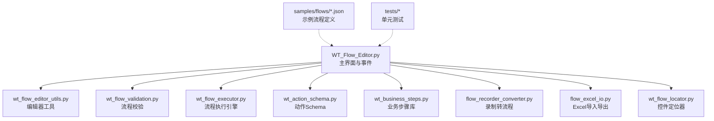
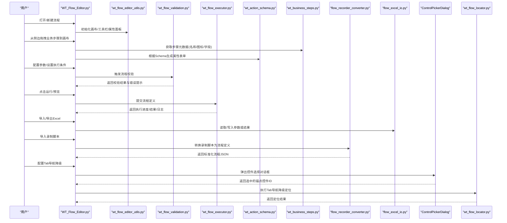
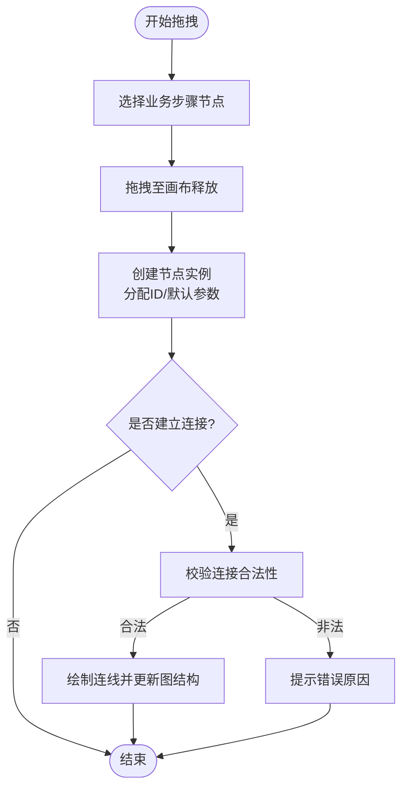
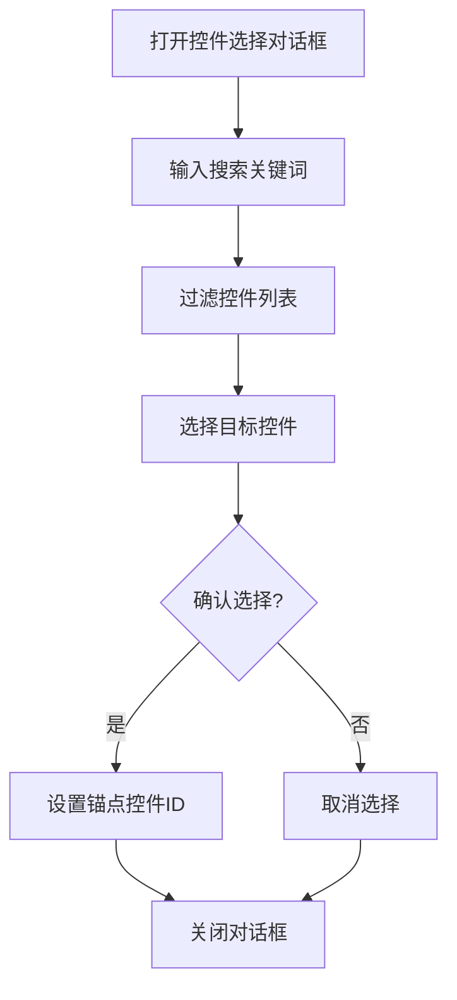
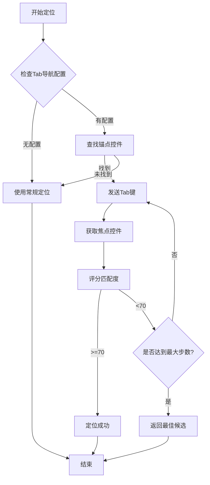
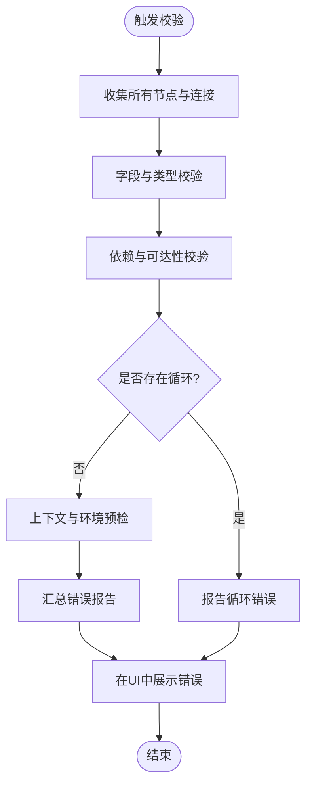
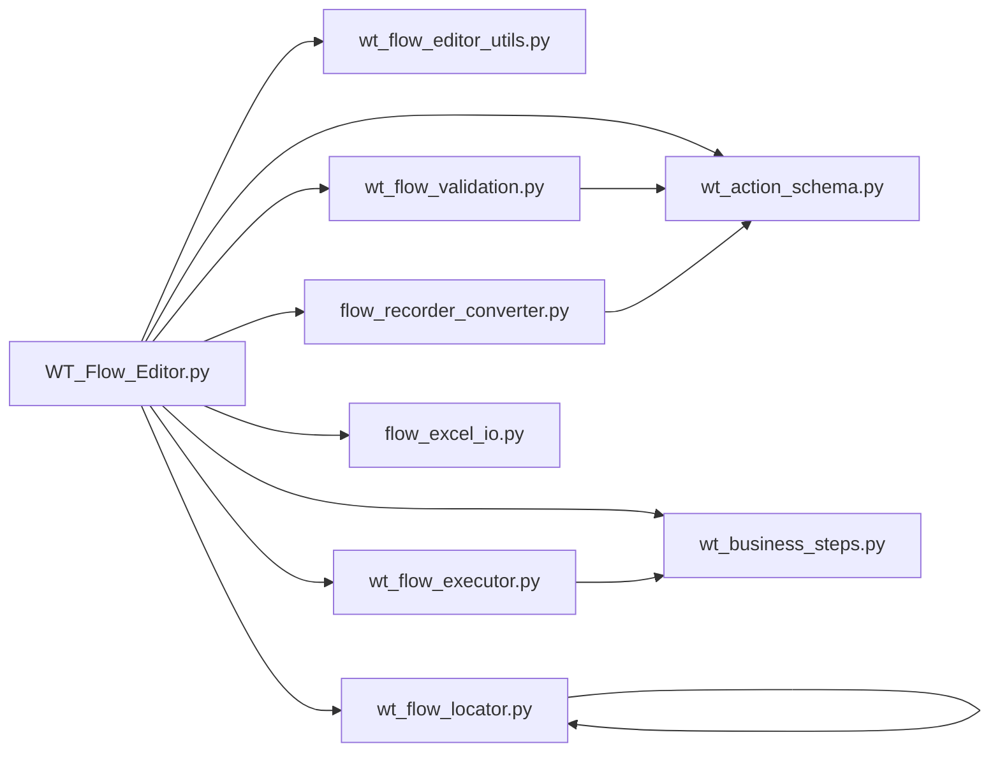

# 流程编辑器

<cite>
**本文引用的文件**   
- [WT_Flow_Editor.py](file://WT_Flow_Editor.py)
- [wt_flow_editor_utils.py](file://wt_flow_editor_utils.py)
- [wt_flow_validation.py](file://wt_flow_validation.py)
- [wt_flow_executor.py](file://wt_flow_executor.py)
- [flow_excel_io.py](file://flow_excel_io.py)
- [flow_recorder_converter.py](file://flow_recorder_converter.py)
- [wt_action_schema.py](file://wt_action_schema.py)
- [wt_business_steps.py](file://wt_business_steps.py)
- [wt_flow_locator.py](file://wt_flow_locator.py)
- [tests/test_tab_navigation_fallback.py](file://tests/test_tab_navigation_fallback.py)
- [WT_AUTOMATION_Agent/agent.py](file://WT_AUTOMATION_Agent/agent.py)
- [samples/flows/flow_definition_新建风机类型.json](file://samples/flows/flow_definition_新建风机类型.json)
- [samples/flows/flow_definition_gm_sample.json](file://samples/flows/flow_definition_gm_sample.json)
- [samples/flows/气象数据录入_20260625_converted_flow.json](file://samples/flows/气象数据录入_20260625_converted_flow.json)
- [tests/test_wt_flow_editor_utils.py](file://tests/test_wt_flow_editor_utils.py)
- [tests/test_wt_flow_executor.py](file://tests/test_wt_flow_executor.py)
- [tests/test_wt_flow_locator_relative_window.py](file://tests/test_wt_flow_locator_relative_window.py)
- [tests/test_wt_run_reporting.py](file://tests/test_wt_run_reporting.py)
</cite>

## 更新摘要
**变更内容**   
- 新增ControlPickerDialog图形界面控件选择器功能，支持从当前流程所有步骤的控件列表中选择锚点控件
- 新增Tab导航降级配置功能，用于处理WPF不可见输入框的定位问题
- AI助手功能改进，增强自然语言到自动化步骤的转换能力
- 完善控件编辑器的Tab导航配置界面和交互逻辑

## 目录
1. [简介](#简介)
2. [项目结构](#项目结构)
3. [核心组件](#核心组件)
4. [架构总览](#架构总览)
5. [详细组件分析](#详细组件分析)
6. [依赖关系分析](#依赖关系分析)
7. [性能考虑](#性能考虑)
8. [故障排查指南](#故障排查指南)
9. [结论](#结论)
10. [附录](#附录)

## 简介
本章节面向WT自动化框架的流程编辑器，系统性阐述可视化流程设计的核心能力与使用方式。内容覆盖拖拽式操作、节点配置、连接管理、界面布局与工作区域组织（工具栏、属性面板、画布、状态栏）、新流程创建与业务步骤添加、参数配置与执行条件设置、实时预览机制、流程验证与错误提示、复杂流程设计模式与最佳实践、快捷键与扩展开发方法等。文档以代码级事实为依据，辅以图示帮助理解。

## 项目结构
流程编辑器相关代码主要分布在根目录的Python模块中，配合测试与示例流程定义JSON文件共同构成"编辑-校验-执行-报告"的闭环。关键文件职责概览：
- WT_Flow_Editor.py：主窗口与UI交互入口，承载画布、工具栏、属性面板、状态栏等界面元素及事件处理。
- wt_flow_editor_utils.py：编辑器辅助工具（如节点渲染、连线绘制、选中/移动、撤销重做等）。
- wt_flow_validation.py：流程模型校验器（节点合法性、连接拓扑、参数完整性、约束冲突等）。
- wt_flow_executor.py：流程运行时引擎（解析、调度、执行、结果收集）。
- flow_excel_io.py：Excel导入导出工具（用于批量参数或数据驱动）。
- flow_recorder_converter.py：录制脚本到流程定义的转换器（将录制产物转换为可编辑流程）。
- wt_action_schema.py：动作/步骤的数据结构与字段规范（用于校验与生成表单）。
- wt_business_steps.py：业务步骤库（封装常用业务操作为可复用节点）。
- wt_flow_locator.py：控件定位器（包含Tab导航降级功能）。
- samples/flows/*.json：示例流程定义，便于快速上手与回归验证。
- tests/*：针对编辑器工具、执行器、定位策略与运行报告的单元测试。

图表来源
- [WT_Flow_Editor.py](file://WT_Flow_Editor.py)
- [wt_flow_editor_utils.py](file://wt_flow_editor_utils.py)
- [wt_flow_validation.py](file://wt_flow_validation.py)
- [wt_flow_executor.py](file://wt_flow_executor.py)
- [flow_excel_io.py](file://flow_excel_io.py)
- [flow_recorder_converter.py](file://flow_recorder_converter.py)
- [wt_action_schema.py](file://wt_action_schema.py)
- [wt_business_steps.py](file://wt_business_steps.py)
- [wt_flow_locator.py](file://wt_flow_locator.py)
- [samples/flows/flow_definition_新建风机类型.json](file://samples/flows/flow_definition_新建风机类型.json)
- [samples/flows/flow_definition_gm_sample.json](file://samples/flows/flow_definition_gm_sample.json)
- [samples/flows/气象数据录入_20260625_converted_flow.json](file://samples/flows/气象数据录入_20260625_converted_flow.json)
- [tests/test_wt_flow_editor_utils.py](file://tests/test_wt_flow_editor_utils.py)
- [tests/test_wt_flow_executor.py](file://tests/test_wt_flow_executor.py)
- [tests/test_wt_flow_locator_relative_window.py](file://tests/test_wt_flow_locator_relative_window.py)
- [tests/test_wt_run_reporting.py](file://tests/test_wt_run_reporting.py)

章节来源
- [WT_Flow_Editor.py](file://WT_Flow_Editor.py)
- [wt_flow_editor_utils.py](file://wt_flow_editor_utils.py)
- [wt_flow_validation.py](file://wt_flow_validation.py)
- [wt_flow_executor.py](file://wt_flow_executor.py)
- [flow_excel_io.py](file://flow_excel_io.py)
- [flow_recorder_converter.py](file://flow_recorder_converter.py)
- [wt_action_schema.py](file://wt_action_schema.py)
- [wt_business_steps.py](file://wt_business_steps.py)
- [wt_flow_locator.py](file://wt_flow_locator.py)
- [samples/flows/flow_definition_新建风机类型.json](file://samples/flows/flow_definition_新建风机类型.json)
- [samples/flows/flow_definition_gm_sample.json](file://samples/flows/flow_definition_gm_sample.json)
- [samples/flows/气象数据录入_20260625_converted_flow.json](file://samples/flows/气象数据录入_20260625_converted_flow.json)
- [tests/test_wt_flow_editor_utils.py](file://tests/test_wt_flow_editor_utils.py)
- [tests/test_wt_flow_executor.py](file://tests/test_wt_flow_executor.py)
- [tests/test_wt_flow_locator_relative_window.py](file://tests/test_wt_flow_locator_relative_window.py)
- [tests/test_wt_run_reporting.py](file://tests/test_wt_run_reporting.py)

## 核心组件
本节聚焦流程编辑器的核心组件及其职责边界，说明它们如何协同完成"可视设计—校验—执行—反馈"的全链路。

- 主界面与交互（WT_Flow_Editor.py）
  - 负责窗口生命周期、菜单/工具栏、属性面板、画布渲染、状态栏消息、快捷键绑定、与后端服务（校验/执行/导入导出）的调用。
- 编辑器工具（wt_flow_editor_utils.py）
  - 提供节点选择、移动、缩放、连线绘制、撤销/重做、批量操作等通用能力。
- 流程校验（wt_flow_validation.py）
  - 基于动作Schema对节点进行静态检查，包括必填项、类型、取值范围、依赖关系、循环连接检测等。
- 执行引擎（wt_flow_executor.py）
  - 解析流程图结构，构建执行图，按拓扑顺序调度节点，收集中间结果与日志，支持断点与重试策略。
- 动作Schema（wt_action_schema.py）
  - 定义每个步骤的输入输出字段、默认值、校验规则与动态表单生成元数据。
- 业务步骤库（wt_business_steps.py）
  - 将领域知识封装为可复用的步骤节点，供用户在画布上直接拖拽使用。
- 录制转换（flow_recorder_converter.py）
  - 将录制脚本转换为标准流程定义，便于二次编辑与版本化管理。
- Excel导入导出（flow_excel_io.py）
  - 支持批量参数填充、数据驱动执行、结果导出。
- 控件定位器（wt_flow_locator.py）
  - 提供控件定位算法，包含Tab导航降级功能，用于处理特殊场景下的控件定位问题。

章节来源
- [WT_Flow_Editor.py](file://WT_Flow_Editor.py)
- [wt_flow_editor_utils.py](file://wt_flow_editor_utils.py)
- [wt_flow_validation.py](file://wt_flow_validation.py)
- [wt_flow_executor.py](file://wt_flow_executor.py)
- [wt_action_schema.py](file://wt_action_schema.py)
- [wt_business_steps.py](file://wt_business_steps.py)
- [flow_recorder_converter.py](file://flow_recorder_converter.py)
- [flow_excel_io.py](file://flow_excel_io.py)
- [wt_flow_locator.py](file://wt_flow_locator.py)

## 架构总览
下图展示流程编辑器在"用户交互—模型—校验—执行—报告"的整体架构与数据流。

图表来源
- [WT_Flow_Editor.py](file://WT_Flow_Editor.py)
- [wt_flow_editor_utils.py](file://wt_flow_editor_utils.py)
- [wt_flow_validation.py](file://wt_flow_validation.py)
- [wt_flow_executor.py](file://wt_flow_executor.py)
- [wt_action_schema.py](file://wt_action_schema.py)
- [wt_business_steps.py](file://wt_business_steps.py)
- [flow_recorder_converter.py](file://flow_recorder_converter.py)
- [flow_excel_io.py](file://flow_excel_io.py)
- [wt_flow_locator.py](file://wt_flow_locator.py)

## 详细组件分析

### 界面布局与工作区域组织
- 工具栏
  - 功能：新建/打开/保存流程、导入录制、导入/导出Excel、撤销/重做、运行/停止、全屏预览等。
  - 行为：与主控制器通信，触发对应命令；部分按钮受当前选中节点影响而启用/禁用。
- 属性面板
  - 功能：显示当前选中节点的参数表单，依据动作Schema动态生成控件；支持分组、必填标记、默认值提示、条件可见性。
  - 行为：变更时即时更新内存中的节点模型，并触发轻量校验。
- 流程图画布
  - 功能：节点放置、连线、对齐/吸附、缩放/平移、批量选择、复制/粘贴、删除。
  - 行为：通过编辑器工具实现渲染与交互；记录历史以便撤销/重做。
- 状态栏
  - 功能：显示当前操作提示、校验结果摘要、执行进度、错误计数、最近一次保存路径等。
  - 行为：接收来自校验器与执行器的异步通知，实时更新文本与颜色指示。

章节来源
- [WT_Flow_Editor.py](file://WT_Flow_Editor.py)
- [wt_flow_editor_utils.py](file://wt_flow_editor_utils.py)

### 拖拽式操作与连接管理
- 拖拽式操作
  - 从侧边业务步骤库拖拽节点至画布，自动分配唯一ID与默认参数。
  - 支持多选、框选、对齐与分布，提升复杂流程排版效率。
- 连接管理
  - 支持从一个节点的输出端口连接到另一个节点的输入端口，形成有向无环图（DAG）。
  - 连线具备方向性与类型约束，非法连接会被拒绝并给出提示。
  - 支持批量断开/重连、连线样式区分（成功/失败分支）。

图表来源
- [wt_flow_editor_utils.py](file://wt_flow_editor_utils.py)
- [wt_flow_validation.py](file://wt_flow_validation.py)

章节来源
- [wt_flow_editor_utils.py](file://wt_flow_editor_utils.py)
- [wt_flow_validation.py](file://wt_flow_validation.py)

### 节点配置与参数设置
- 节点配置
  - 通过属性面板编辑节点参数，支持文本、数值、布尔、下拉、日期、文件路径等类型。
  - 字段校验由Schema驱动，包含必填、范围、正则、枚举等规则。
- 执行条件
  - 支持基于上游节点输出或全局变量的条件表达式，控制分支执行。
  - 条件不满足时可跳过节点或走失败分支，便于容错与异常路径设计。

章节来源
- [wt_action_schema.py](file://wt_action_schema.py)
- [wt_flow_validation.py](file://wt_flow_validation.py)

### ControlPickerDialog图形界面控件选择器
**新增功能** ControlPickerDialog是一个专门用于选择锚点控件的图形界面对话框，主要用于Tab导航降级配置场景。

- 功能特性
  - 搜索过滤：支持通过ID、名称、labelText等关键字快速筛选控件
  - 树形展示：以表格形式展示控件的ID、名称、控件类型、标签文本等详细信息
  - 双击选择：支持双击控件行直接确认选择
  - 模态对话框：作为模态窗口显示，确保用户必须做出选择后才能继续操作

- 使用方法
  - 在控件编辑器的Tab导航配置区域，点击"选择..."按钮弹出控件选择对话框
  - 在搜索框中输入关键词进行快速筛选
  - 从列表中选择一个合适的锚点控件
  - 点击"确定"按钮或双击控件行完成选择

图表来源
- [WT_Flow_Editor.py:1121-1212](file://WT_Flow_Editor.py#L1121-L1212)

章节来源
- [WT_Flow_Editor.py](file://WT_Flow_Editor.py)

### Tab导航降级配置功能
**新增功能** Tab导航降级是为了解决WPF应用中不可见输入框的定位问题而设计的备用定位策略。

- 工作原理
  - 当常规控件定位失败时，系统会尝试通过Tab键导航来定位目标控件
  - 需要配置一个可见的锚点控件作为导航起点
  - 支持向前（Tab）和向后（Shift+Tab）两种导航方向
  - 可配置最大导航步数，防止无限循环

- 配置参数
  - anchorControlId：锚点控件ID，作为Tab导航的起始点
  - direction：导航方向，支持"forward"（Tab）和"backward"（Shift+Tab）
  - steps：最大导航步数，限制Tab键发送次数
  - preferTabNavigation：优先使用Tab导航，跳过常规定位尝试

- 递归保护机制
  - 使用_TAB_NAV_IN_PROGRESS集合防止递归调用
  - 同一control_id不会重复执行Tab导航降级
  - 执行完成后自动清理状态

图表来源
- [wt_flow_locator.py](file://wt_flow_locator.py)
- [tests/test_tab_navigation_fallback.py](file://tests/test_tab_navigation_fallback.py)

章节来源
- [WT_Flow_Editor.py](file://WT_Flow_Editor.py)
- [wt_flow_locator.py](file://wt_flow_locator.py)
- [tests/test_tab_navigation_fallback.py](file://tests/test_tab_navigation_fallback.py)

### 创建新流程与添加业务步骤
- 新建流程
  - 通过工具栏新建空白流程，或从模板/示例加载基础结构。
- 添加业务步骤
  - 从业务步骤库选择所需步骤，拖入画布后在属性面板填写必要参数。
  - 可结合录制转换功能，将已有录制脚本转为流程节点，减少手工配置成本。

章节来源
- [WT_Flow_Editor.py](file://WT_Flow_Editor.py)
- [wt_business_steps.py](file://wt_business_steps.py)
- [flow_recorder_converter.py](file://flow_recorder_converter.py)

### 实时预览功能的实现原理与使用方法
- 实现原理
  - 预览采用"轻量执行"策略：仅执行必要的只读或模拟步骤，避免副作用。
  - 利用执行引擎的"dry-run"模式，构建最小执行子图，收集关键输出用于预览。
- 使用方法
  - 在画布右键或工具栏选择"预览"，系统会高亮即将执行的节点并逐步展示中间结果。
  - 预览失败时，状态栏与属性面板同步显示错误位置与建议修复方案。

章节来源
- [wt_flow_executor.py](file://wt_flow_executor.py)
- [wt_flow_validation.py](file://wt_flow_validation.py)

### 流程验证机制与错误提示系统
- 验证机制
  - 静态校验：节点字段完整性、类型正确性、取值范围、依赖可达性、循环连接检测。
  - 动态校验：在执行前对上下文变量、外部资源可用性进行预检。
- 错误提示
  - 错误分类：语法错误、语义错误、运行时错误。
  - 提示形式：画布节点边框高亮、属性面板字段标红、状态栏汇总信息、详情弹窗。

图表来源
- [wt_flow_validation.py](file://wt_flow_validation.py)
- [wt_action_schema.py](file://wt_action_schema.py)

章节来源
- [wt_flow_validation.py](file://wt_flow_validation.py)
- [wt_action_schema.py](file://wt_action_schema.py)

### 复杂流程的设计模式与最佳实践
- 分层与模块化
  - 将大流程拆分为多个子流程，通过"调用子流程"节点组合，提高可维护性。
- 条件分支与并行
  - 使用条件节点分流不同业务路径；对独立任务采用并行执行以提升吞吐。
- 容错与重试
  - 为易失败节点配置重试与超时；失败分支进入补偿或告警逻辑。
- 数据驱动
  - 通过Excel导入参数集，批量执行多组场景；结果导出便于审计与分析。
- 命名与注释
  - 统一节点命名规范，添加描述性注释，便于团队协作与问题定位。

章节来源
- [flow_excel_io.py](file://flow_excel_io.py)
- [wt_flow_executor.py](file://wt_flow_executor.py)

### 快捷键操作指南
- 常用快捷键
  - 新建/打开/保存：Ctrl+N / Ctrl+O / Ctrl+S
  - 撤销/重做：Ctrl+Z / Ctrl+Y
  - 全选/复制/粘贴/删除：Ctrl+A / Ctrl+C / Ctrl+V / Delete
  - 运行/停止：F5 / Shift+F5
  - 预览：Ctrl+P
  - 放大/缩小：Ctrl++ / Ctrl+-
  - 聚焦搜索：Ctrl+F
- 自定义快捷键
  - 可在主界面设置中映射自定义命令，支持组合键与冲突检测。

章节来源
- [WT_Flow_Editor.py](file://WT_Flow_Editor.py)

### 自定义扩展开发方法
- 新增业务步骤
  - 在业务步骤库中注册新步骤，提供元数据（名称、图标、分组、字段Schema）。
  - 实现步骤的执行逻辑，确保输入输出符合Schema约定。
- 扩展属性面板
  - 基于Schema的动态表单机制，无需修改UI即可适配新字段类型与校验规则。
- 扩展连接器
  - 若需自定义连线类型或端口语义，需在编辑器工具中扩展连接校验与渲染逻辑。
- 集成录制转换
  - 为新录制格式编写转换器，将其映射为标准流程定义，便于在编辑器中二次编辑。

章节来源
- [wt_business_steps.py](file://wt_business_steps.py)
- [wt_action_schema.py](file://wt_action_schema.py)
- [wt_flow_editor_utils.py](file://wt_flow_editor_utils.py)
- [flow_recorder_converter.py](file://flow_recorder_converter.py)

### AI助手功能改进
**功能增强** AI助手经过多项改进，提升了自然语言到自动化步骤的转换质量和用户体验。

- 核心改进
  - 增强的Function Calling支持：更好地理解和执行工具调用
  - 改进的控件检索：通过find_control和control_tree工具提供更精确的控件定位
  - 优化的对话管理：支持多轮对话和历史消息压缩
  - 增强的错误处理：更详细的错误信息和恢复建议

- 技术特性
  - 支持多种LLM提供商的OpenAI兼容API
  - 智能重试机制：指数退避策略处理网络异常
  - 会话持久化：自动保存对话历史和配置
  - 环境变量配置：支持灵活的配置管理

章节来源
- [WT_AUTOMATION_Agent/agent.py](file://WT_AUTOMATION_Agent/agent.py)

## 依赖关系分析
下图展示关键模块之间的依赖关系与耦合度，有助于识别潜在风险与优化点。

图表来源
- [WT_Flow_Editor.py](file://WT_Flow_Editor.py)
- [wt_flow_editor_utils.py](file://wt_flow_editor_utils.py)
- [wt_flow_validation.py](file://wt_flow_validation.py)
- [wt_flow_executor.py](file://wt_flow_executor.py)
- [wt_action_schema.py](file://wt_action_schema.py)
- [wt_business_steps.py](file://wt_business_steps.py)
- [flow_recorder_converter.py](file://flow_recorder_converter.py)
- [flow_excel_io.py](file://flow_excel_io.py)
- [wt_flow_locator.py](file://wt_flow_locator.py)

章节来源
- [WT_Flow_Editor.py](file://WT_Flow_Editor.py)
- [wt_flow_editor_utils.py](file://wt_flow_editor_utils.py)
- [wt_flow_validation.py](file://wt_flow_validation.py)
- [wt_flow_executor.py](file://wt_flow_executor.py)
- [wt_action_schema.py](file://wt_action_schema.py)
- [wt_business_steps.py](file://wt_business_steps.py)
- [flow_recorder_converter.py](file://flow_recorder_converter.py)
- [flow_excel_io.py](file://flow_excel_io.py)
- [wt_flow_locator.py](file://wt_flow_locator.py)

## 性能考虑
- 画布渲染
  - 大规模节点时建议启用虚拟化渲染与按需加载，减少重绘开销。
- 校验与预览
  - 增量校验：仅在变更节点附近重新计算依赖与校验。
  - 预览缓存：对只读步骤的结果进行短期缓存，加速重复预览。
- 执行引擎
  - 并行执行独立分支，限制并发度以避免资源争用。
  - 长耗时任务采用分片与进度上报，提升用户体验。
- I/O与数据
  - Excel导入导出采用流式读写，避免一次性加载大文件导致内存峰值。
- Tab导航降级
  - 合理的最大步数配置，避免过多的Tab键发送操作。
  - 递归保护机制防止无限循环导致的性能问题。

[本节为通用性能指导，不直接分析具体文件]

## 故障排查指南
- 常见问题
  - 节点无法连接：检查端口类型与方向约束，确认目标节点存在对应输入端口。
  - 参数校验失败：对照Schema查看必填项与取值范围，修正后再次校验。
  - 执行中断：查看状态栏错误摘要与日志，定位失败节点与原因。
  - Tab导航降级失效：检查锚点控件配置和导航方向设置。
- 调试技巧
  - 使用预览模式逐步验证关键路径。
  - 借助单元测试用例复现问题，缩小范围。
  - 导出流程JSON与Excel参数，离线分析数据一致性。
  - 查看Tab导航降级的递归保护状态。
- 参考测试
  - 编辑器工具、执行器、相对窗口定位与运行报告的相关测试可作为排障参考。
  - Tab导航降级的完整测试用例覆盖了各种边界情况。

章节来源
- [tests/test_wt_flow_editor_utils.py](file://tests/test_wt_flow_editor_utils.py)
- [tests/test_wt_flow_executor.py](file://tests/test_wt_flow_executor.py)
- [tests/test_wt_flow_locator_relative_window.py](file://tests/test_wt_flow_locator_relative_window.py)
- [tests/test_wt_run_reporting.py](file://tests/test_wt_run_reporting.py)
- [tests/test_tab_navigation_fallback.py](file://tests/test_tab_navigation_fallback.py)

## 结论
WT自动化框架的流程编辑器以可视化为核心，围绕"拖拽—配置—校验—执行—反馈"的主线，提供了完善的工具链与扩展机制。通过Schema驱动的动态表单、严格的连接与依赖校验、灵活的录制转换与Excel数据驱动，以及清晰的错误提示与预览能力，用户能够高效地设计与维护复杂的自动化流程。新增的ControlPickerDialog图形界面控件选择器和Tab导航降级配置功能，进一步增强了处理复杂UI场景的能力。遵循模块化、条件分支、容错重试与数据驱动的最佳实践，可进一步提升流程的可维护性与稳定性。

[本节为总结性内容，不直接分析具体文件]

## 附录
- 示例流程定义
  - 新建风机类型流程：[samples/flows/flow_definition_新建风机类型.json](file://samples/flows/flow_definition_新建风机类型.json)
  - GM样例流程：[samples/flows/flow_definition_gm_sample.json](file://samples/flows/flow_definition_gm_sample.json)
  - 气象数据录入转换流程：[samples/flows/气象数据录入_20260625_converted_flow.json](file://samples/flows/气象数据录入_20260625_converted_flow.json)

章节来源
- [samples/flows/flow_definition_新建风机类型.json](file://samples/flows/flow_definition_新建风机类型.json)
- [samples/flows/flow_definition_gm_sample.json](file://samples/flows/flow_definition_gm_sample.json)
- [samples/flows/气象数据录入_20260625_converted_flow.json](file://samples/flows/气象数据录入_20260625_converted_flow.json)