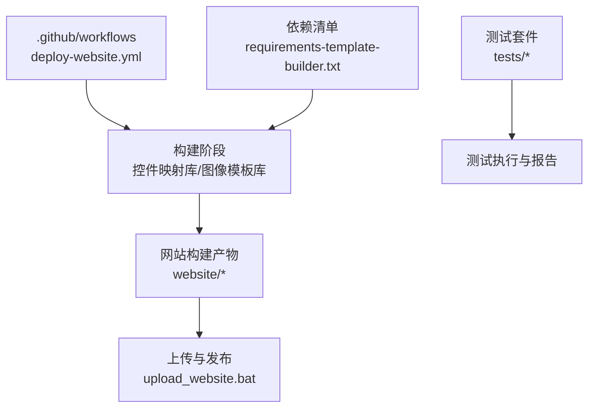
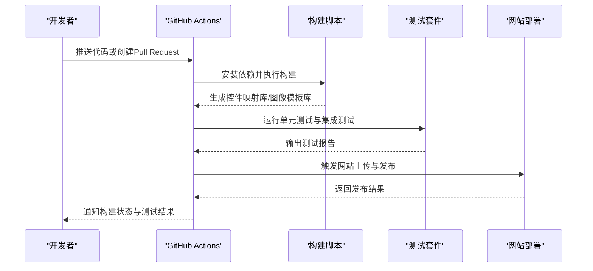
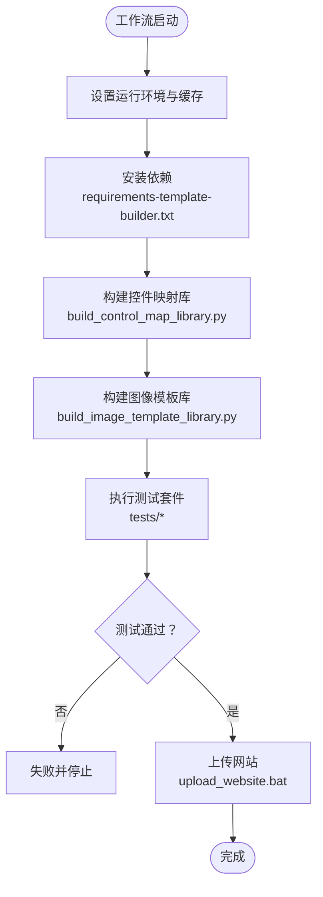
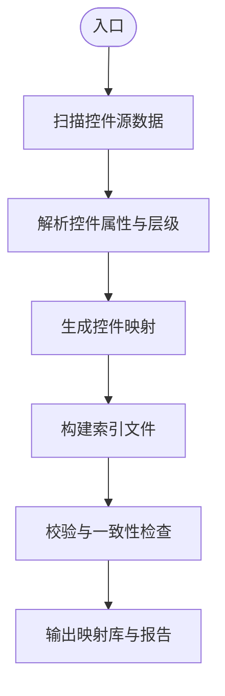
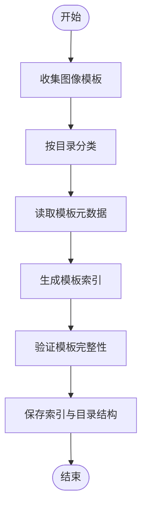
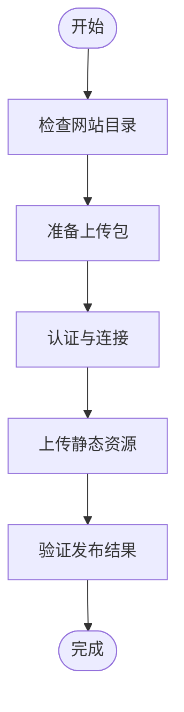
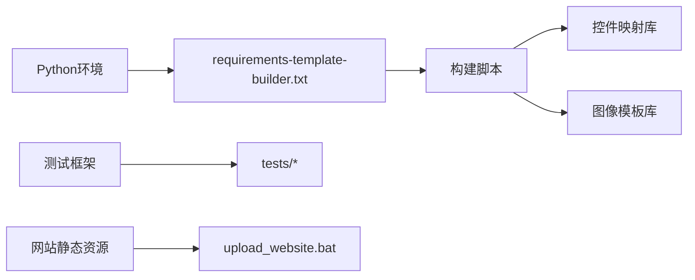

# CI/CD流水线配置

<cite>
**本文档引用的文件**
- [deploy-website.yml](file://.github/workflows/deploy-website.yml)
- [build_control_map_library.py](file://build_control_map_library.py)
- [build_image_template_library.py](file://build_image_template_library.py)
- [upload_website.bat](file://upload_website.bat)
- [requirements-template-builder.txt](file://requirements-template-builder.txt)
- [index.html](file://website/index.html)
- [script.js](file://website/script.js)
- [styles.css](file://website/styles.css)
- [README.md](file://README.md)
- [PROJECT_ARCHITECTURE.md](file://PROJECT_ARCHITECTURE.md)
</cite>

## 目录
1. [简介](#简介)
2. [项目结构](#项目结构)
3. [核心组件](#核心组件)
4. [架构总览](#架构总览)
5. [详细组件分析](#详细组件分析)
6. [依赖关系分析](#依赖关系分析)
7. [性能考虑](#性能考虑)
8. [故障排查指南](#故障排查指南)
9. [结论](#结论)
10. [附录](#附录)

## 简介
本文件面向WT自动化框架的CI/CD流水线与自动化部署，聚焦以下目标：
- GitHub Actions工作流配置与使用方法
- 自动化构建脚本的功能与执行流程（控件映射库、图像模板库）
- 网站自动部署的配置与发布流程
- 代码质量检查与静态分析的集成方式
- 自动化测试的执行与报告生成
- 本地模拟CI/CD环境的方法
- 自定义构建任务与扩展点的配置方法

## 项目结构
仓库根目录包含GitHub Actions工作流、构建脚本、网站资源与测试等关键内容。CI/CD相关的主要路径如下：
- .github/workflows：GitHub Actions工作流定义
- build_*.py：构建脚本（控件映射库、图像模板库）
- website/*：网站静态资源（HTML/CSS/JS）
- upload_website.bat：网站上传脚本
- requirements-template-builder.txt：模板构建依赖清单
- tests/*：单元测试与集成测试
- README.md、PROJECT_ARCHITECTURE.md：项目说明与架构文档

图表来源
- [deploy-website.yml](file://.github/workflows/deploy-website.yml)
- [build_control_map_library.py](file://build_control_map_library.py)
- [build_image_template_library.py](file://build_image_template_library.py)
- [upload_website.bat](file://upload_website.bat)
- [requirements-template-builder.txt](file://requirements-template-builder.txt)

章节来源
- [README.md](file://README.md)
- [PROJECT_ARCHITECTURE.md](file://PROJECT_ARCHITECTURE.md)

## 核心组件
- GitHub Actions工作流：定义触发条件、运行环境、构建步骤、测试与部署任务
- 构建脚本：
  - 控件映射库构建：扫描并生成控件索引与映射文件
  - 图像模板库构建：收集图像模板并生成索引
- 网站部署：将静态站点打包并通过脚本上传至托管平台
- 测试套件：覆盖UI定位、流程执行、图像匹配、报告生成等能力
- 依赖管理：模板构建所需Python依赖清单

章节来源
- [deploy-website.yml](file://.github/workflows/deploy-website.yml)
- [build_control_map_library.py](file://build_control_map_library.py)
- [build_image_template_library.py](file://build_image_template_library.py)
- [upload_website.bat](file://upload_website.bat)
- [requirements-template-builder.txt](file://requirements-template-builder.txt)

## 架构总览
下图展示从代码提交到网站发布的端到端流水线，包括构建、测试与部署环节。

图表来源
- [deploy-website.yml](file://.github/workflows/deploy-website.yml)
- [build_control_map_library.py](file://build_control_map_library.py)
- [build_image_template_library.py](file://build_image_template_library.py)
- [upload_website.bat](file://upload_website.bat)

## 详细组件分析

### GitHub Actions工作流（deploy-website.yml）
- 触发条件：通常由push或pull_request事件触发，可按分支策略限制运行范围
- 运行环境：选择合适的基础镜像（如Python版本），设置缓存以加速依赖安装
- 构建阶段：
  - 安装依赖：使用requirements-template-builder.txt
  - 执行构建脚本：生成控件映射库与图像模板库
- 测试阶段：运行tests目录下的测试用例，生成报告
- 部署阶段：调用upload_website.bat将网站静态资源上传至目标平台

图表来源
- [deploy-website.yml](file://.github/workflows/deploy-website.yml)
- [requirements-template-builder.txt](file://requirements-template-builder.txt)
- [build_control_map_library.py](file://build_control_map_library.py)
- [build_image_template_library.py](file://build_image_template_library.py)
- [upload_website.bat](file://upload_website.bat)

章节来源
- [deploy-website.yml](file://.github/workflows/deploy-website.yml)

### 控件映射库构建（build_control_map_library.py）
- 功能：扫描控件信息源，生成标准化的控件映射库与索引文件
- 输入：控件描述文件、窗口类型、控件属性等
- 输出：控件映射JSON、索引文件、校验报告
- 关键点：
  - 支持多窗口类型（WPF、Win32、未知）
  - 生成标准目录结构与命名规范
  - 提供校验与一致性检查

图表来源
- [build_control_map_library.py](file://build_control_map_library.py)

章节来源
- [build_control_map_library.py](file://build_control_map_library.py)

### 图像模板库构建（build_image_template_library.py）
- 功能：收集图像模板，生成模板索引与分类目录
- 输入：图像模板目录、模板元数据
- 输出：模板索引JSON、分类目录、构建日志
- 关键点：
  - 支持多级目录与子模板
  - 自动生成templates_index.json
  - 提供模板完整性校验

图表来源
- [build_image_template_library.py](file://build_image_template_library.py)

章节来源
- [build_image_template_library.py](file://build_image_template_library.py)

### 网站自动部署（upload_website.bat）
- 功能：将website目录下的静态资源上传至目标平台（如对象存储或静态站点托管）
- 参数：目标地址、认证凭据、忽略规则等
- 流程：
  - 校验网站目录完整性
  - 压缩或预处理静态资源
  - 调用上传工具进行发布
  - 输出发布结果与访问链接

图表来源
- [upload_website.bat](file://upload_website.bat)
- [index.html](file://website/index.html)
- [script.js](file://website/script.js)
- [styles.css](file://website/styles.css)

章节来源
- [upload_website.bat](file://upload_website.bat)
- [index.html](file://website/index.html)
- [script.js](file://website/script.js)
- [styles.css](file://website/styles.css)

### 代码质量检查与静态分析
- 建议集成：
  - Python代码风格检查（如flake8、black）
  - 依赖安全扫描（如pip-audit）
  - 静态分析（如mypy、pylint）
- 在GitHub Actions中可通过新增步骤实现：
  - 安装检查工具
  - 执行检查命令
  - 生成报告并作为工件保留

章节来源
- [deploy-website.yml](file://.github/workflows/deploy-website.yml)

### 自动化测试执行与报告生成
- 测试套件位置：tests/*
- 常见测试类型：
  - UI定位与交互测试
  - 流程执行与回放测试
  - 图像匹配与多尺度匹配
  - 报告生成与断言
- 执行方式：
  - 使用pytest或robot框架运行
  - 生成JUnit或HTML报告
  - 将报告作为工件上传

章节来源
- [deploy-website.yml](file://.github/workflows/deploy-website.yml)

### 本地模拟CI/CD环境
- 使用GitHub Actions Runner或Docker容器模拟云端环境
- 步骤：
  - 安装相同版本的Python与依赖
  - 执行构建脚本与测试套件
  - 使用本地Web服务器预览网站
- 优点：提前发现环境问题与依赖冲突

章节来源
- [requirements-template-builder.txt](file://requirements-template-builder.txt)

### 自定义构建任务与扩展点
- 扩展点：
  - 在构建脚本中添加新的模块扫描逻辑
  - 在GitHub Actions中增加新步骤
- 配置方法：
  - 通过环境变量控制构建行为
  - 使用配置文件指定输入输出路径
  - 提供插件式接口以便第三方扩展

章节来源
- [build_control_map_library.py](file://build_control_map_library.py)
- [build_image_template_library.py](file://build_image_template_library.py)
- [deploy-website.yml](file://.github/workflows/deploy-website.yml)

## 依赖关系分析
- 构建依赖：Python解释器与requirements-template-builder.txt中的包
- 运行时依赖：网站静态资源与上传工具
- 测试依赖：测试框架与断言库

图表来源
- [requirements-template-builder.txt](file://requirements-template-builder.txt)
- [build_control_map_library.py](file://build_control_map_library.py)
- [build_image_template_library.py](file://build_image_template_library.py)
- [upload_website.bat](file://upload_website.bat)

章节来源
- [requirements-template-builder.txt](file://requirements-template-builder.txt)

## 性能考虑
- 缓存依赖：在GitHub Actions中缓存Python包与构建产物
- 并行执行：将构建与测试步骤并行化
- 增量构建：仅重新构建变更的模块
- 资源优化：压缩静态资源与减少上传体积

## 故障排查指南
- 常见问题：
  - 依赖安装失败：检查Python版本与网络代理
  - 构建脚本错误：查看控制台输出与日志文件
  - 网站上传失败：确认认证凭据与目标地址
- 调试方法：
  - 启用详细日志
  - 本地复现问题
  - 逐步注释定位错误

章节来源
- [deploy-website.yml](file://.github/workflows/deploy-website.yml)
- [upload_website.bat](file://upload_website.bat)

## 结论
本流水线实现了从代码提交到网站发布的自动化闭环，涵盖构建、测试与部署关键环节。通过合理的依赖管理与扩展点设计，可灵活适配不同环境与需求。建议在后续迭代中持续优化性能与稳定性，并完善质量检查与监控机制。

## 附录
- 参考文档：
  - README.md：项目概述与使用说明
  - PROJECT_ARCHITECTURE.md：系统架构与设计原则
- 常用命令：
  - 构建控件映射库：python build_control_map_library.py
  - 构建图像模板库：python build_image_template_library.py
  - 本地预览网站：python -m http.server
  - 上传网站：./upload_website.bat

章节来源
- [README.md](file://README.md)
- [PROJECT_ARCHITECTURE.md](file://PROJECT_ARCHITECTURE.md)