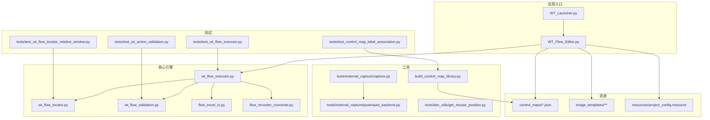
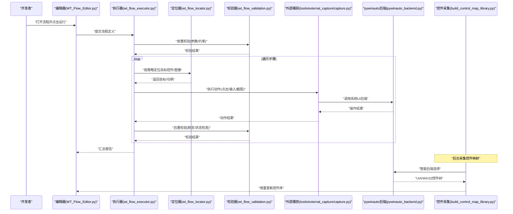
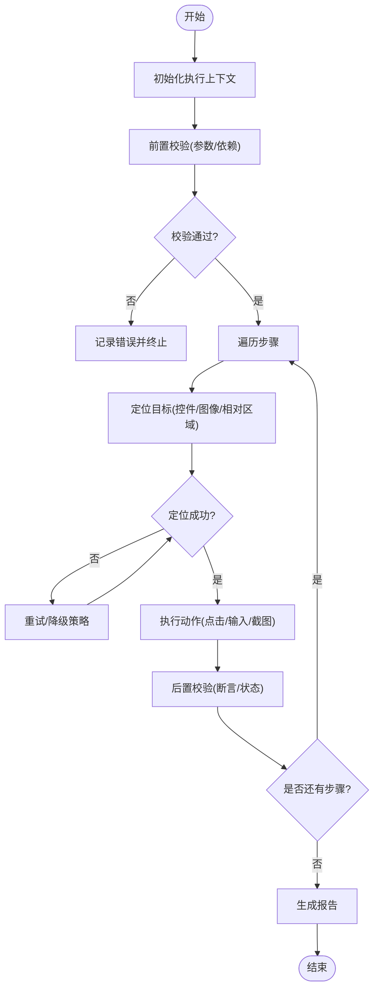
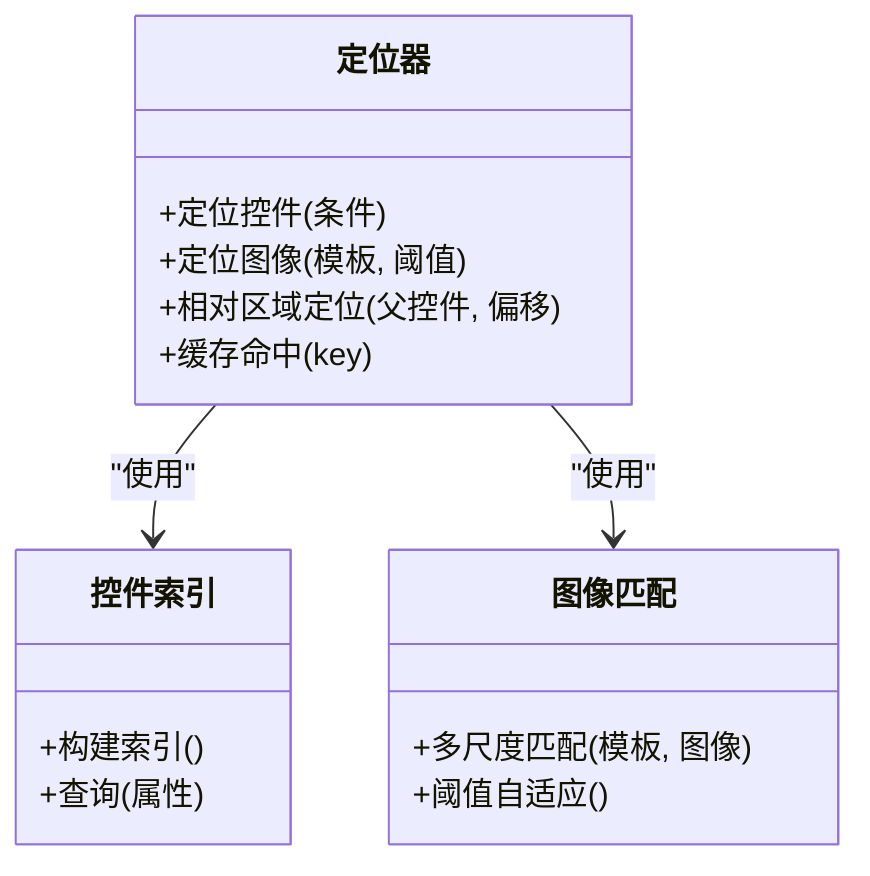
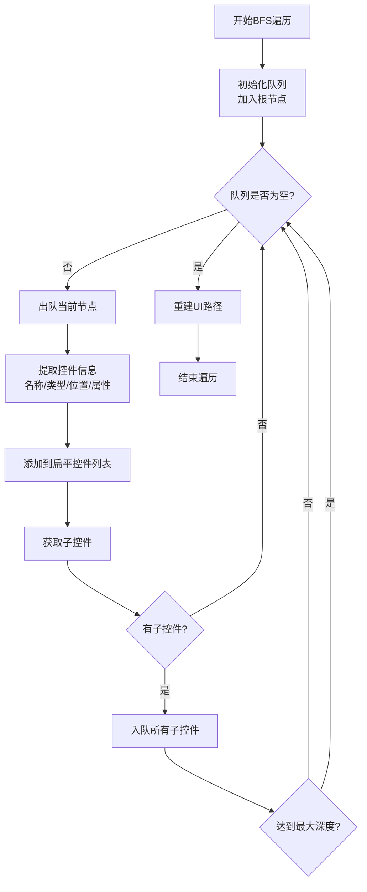
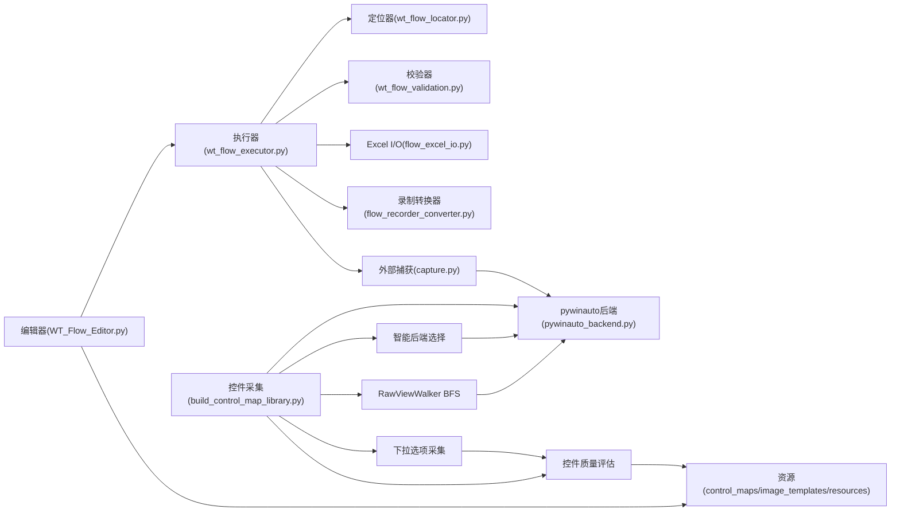

# 开发指南

<cite>
**本文档引用的文件**   
- [README.md](file://README.md)
- [PROJECT_ARCHITECTURE.md](file://PROJECT_ARCHITECTURE.md)
- [WT_Launcher.py](file://WT_Launcher.py)
- [WT_Flow_Editor.py](file://WT_Flow_Editor.py)
- [wt_flow_executor.py](file://wt_flow_executor.py)
- [wt_flow_locator.py](file://wt_flow_locator.py)
- [wt_flow_validation.py](file://wt_flow_validation.py)
- [flow_excel_io.py](file://flow_excel_io.py)
- [flow_recorder_converter.py](file://flow_recorder_converter.py)
- [tests/test_wt_flow_executor.py](file://tests/test_wt_flow_executor.py)
- [tests/test_wt_flow_locator_relative_window.py](file://tests/test_wt_flow_locator_relative_window.py)
- [tests/test_wt_action_validation.py](file://tests/test_wt_action_validation.py)
- [tools/external_capture/capture.py](file://tools/external_capture/capture.py)
- [tools/external_capture/pywinauto_backend.py](file://tools/external_capture/pywinauto_backend.py)
- [tools/dev_utils/get_mouse_position.py](file://tools/dev_utils/get_mouse_position.py)
- [build_control_map_library.py](file://build_control_map_library.py)
- [build_image_template_library.py](file://build_image_template_library.py)
- [.github/workflows/deploy-website.yml](file://.github/workflows/deploy-website.yml)
- [upload_website.bat](file://upload_website.bat)
- [resources/project_config.resource](file://resources/project_config.resource)
- [docs/控件采集分析_20260730.md](file://docs/控件采集分析_20260730.md)
- [docs/Inspect_UIA_调研手册.md](file://docs/Inspect_UIA_调研手册.md)
- [docs/Inspect实时定位vs悬停补采_流畅度差异与优化.md](file://docs/Inspect实时定位vs悬停补采_流畅度差异与优化.md)
- [docs/Inspect对标差距调研报告.md](file://docs/Inspect对标差距调研报告.md)
- [docs/Inspect对标改造风险分析.md](file://docs/Inspect对标改造风险分析.md)
- [tests/test_control_map_label_association.py](file://tests/test_control_map_label_association.py)
</cite>

## 更新摘要
**所做更改**
- 新增控件采集架构章节，反映新的智能后端合并、RawViewWalker BFS遍历、下拉选项自动展开等能力
- 新增Inspection对标改造分析章节，包含UIA底层原理、实时定位vs悬停补采的流畅度差异分析
- 新增风险控制策略章节，涵盖控件可自动化体检、匿名控件治理、found_index依赖降低等风险缓解措施
- 更新控件映射库构建工具说明，补充标签关联、控件分类、质量评估等新功能
- 增强故障排查指南，集成最新的调试技巧和问题解决方案

## 目录
1. [简介](#简介)
2. [项目结构](#项目结构)
3. [核心组件](#核心组件)
4. [架构总览](#架构总览)
5. [详细组件分析](#详细组件分析)
6. [控件采集架构](#控件采集架构)
7. [Inspection对标改造分析](#inspection对标改造分析)
8. [风险控制策略](#风险控制策略)
9. [依赖关系分析](#依赖关系分析)
10. [性能考虑](#性能考虑)
11. [故障排查指南](#故障排查指南)
12. [结论](#结论)
13. [附录](#附录)

## 简介
本指南面向WT自动化框架的贡献者与开发者，旨在提供从环境搭建、代码组织规范、测试编写、代码审查与提交规范、CI/CD流水线配置与自动化部署，到新功能开发模板与最佳实践、性能与压力测试方法、文档生成与发布流程以及常见问题调试技巧的全面说明。读者无需深入底层实现即可快速上手开发与维护工作。

**更新** 本次更新重点介绍了新的控件采集架构、Inspection对标改造分析和风险控制策略，帮助开发者理解系统的高级功能和稳定性保障机制。

## 项目结构
仓库采用"功能域+工具集"的混合组织方式：
- 顶层脚本与入口：负责启动器、流程编辑器、执行器、定位器、校验器等核心能力
- tests：单元测试与集成测试用例
- tools：外部捕获、OCR、开发辅助工具等
- flow_packages/samples：流程定义与示例
- control_maps/image_templates/resources：运行时资源（控件映射、图像模板、项目配置）
- docs：文档与生成脚本
- website：站点静态资源
- .github/workflows：GitHub Actions 工作流

图表来源
- [WT_Launcher.py](file://WT_Launcher.py)
- [WT_Flow_Editor.py](file://WT_Flow_Editor.py)
- [wt_flow_executor.py](file://wt_flow_executor.py)
- [wt_flow_locator.py](file://wt_flow_locator.py)
- [wt_flow_validation.py](file://wt_flow_validation.py)
- [flow_excel_io.py](file://flow_excel_io.py)
- [flow_recorder_converter.py](file://flow_recorder_converter.py)
- [tools/external_capture/capture.py](file://tools/external_capture/capture.py)
- [tools/external_capture/pywinauto_backend.py](file://tools/external_capture/pywinauto_backend.py)
- [build_control_map_library.py](file://build_control_map_library.py)
- [build_image_template_library.py](file://build_image_template_library.py)

章节来源
- [README.md](file://README.md)
- [PROJECT_ARCHITECTURE.md](file://PROJECT_ARCHITECTURE.md)

## 核心组件
- 启动器与编辑器
  - 启动器负责初始化运行环境与加载主界面；编辑器提供流程编排、控件选择、录制转换等交互能力。
- 执行器
  - 解析流程定义，调度动作执行，协调定位器与校验器，输出运行报告。
- 定位器
  - 基于控件树、UIA/Win32后端、相对窗口区域与多尺度图像匹配进行元素定位。
- 校验器
  - 对动作参数、步骤顺序、业务约束进行前置与后置校验。
- Excel I/O与录制转换器
  - 提供流程与Excel互操作，支持将录制脚本转换为可执行流程定义。
- 外部捕获与后端
  - 封装系统级捕获与pywinauto后端，为录制与定位提供基础能力。
- 资源构建工具
  - 构建控件映射库与图像模板库，供编辑器与执行期使用。

**更新** 新增了控件采集架构和Inspection对标分析相关组件，提升了系统的智能化水平和用户体验。

章节来源
- [WT_Launcher.py](file://WT_Launcher.py)
- [WT_Flow_Editor.py](file://WT_Flow_Editor.py)
- [wt_flow_executor.py](file://wt_flow_executor.py)
- [wt_flow_locator.py](file://wt_flow_locator.py)
- [wt_flow_validation.py](file://wt_flow_validation.py)
- [flow_excel_io.py](file://flow_excel_io.py)
- [flow_recorder_converter.py](file://flow_recorder_converter.py)
- [tools/external_capture/capture.py](file://tools/external_capture/capture.py)
- [tools/external_capture/pywinauto_backend.py](file://tools/external_capture/pywinauto_backend.py)
- [build_control_map_library.py](file://build_control_map_library.py)
- [build_image_template_library.py](file://build_image_template_library.py)

## 架构总览
整体采用"前端编辑 + 中间执行 + 后端定位/捕获"的分层架构。编辑器负责可视化编排与数据准备；执行器作为编排中枢，调用定位器与校验器完成具体动作；外部捕获模块屏蔽不同UI后端的差异；资源层提供控件映射与图像模板支撑稳定性。

**更新** 新增了控件采集架构层，支持智能后端选择、RawViewWalker遍历、下拉选项自动展开等高级功能。

图表来源
- [WT_Flow_Editor.py](file://WT_Flow_Editor.py)
- [wt_flow_executor.py](file://wt_flow_executor.py)
- [wt_flow_locator.py](file://wt_flow_locator.py)
- [wt_flow_validation.py](file://wt_flow_validation.py)
- [tools/external_capture/capture.py](file://tools/external_capture/capture.py)
- [tools/external_capture/pywinauto_backend.py](file://tools/external_capture/pywinauto_backend.py)
- [build_control_map_library.py](file://build_control_map_library.py)

## 详细组件分析

### 执行器（流程驱动与编排）
- 职责
  - 解析流程定义，管理步骤生命周期，协调定位器与校验器，收集运行指标与日志，生成报告。
- 关键流程
  - 初始化上下文 -> 前置校验 -> 循环执行步骤 -> 异常处理与重试 -> 生成报告。
- 复杂度与优化
  - 步骤串行执行，定位阶段可能涉及多策略尝试；可通过缓存定位结果、并行化非UI密集任务提升吞吐。
- 错误处理
  - 统一捕获定位失败、动作超时、断言失败等异常，记录上下文信息以便复现。

图表来源
- [wt_flow_executor.py](file://wt_flow_executor.py)
- [wt_flow_locator.py](file://wt_flow_locator.py)
- [wt_flow_validation.py](file://wt_flow_validation.py)

章节来源
- [wt_flow_executor.py](file://wt_flow_executor.py)
- [tests/test_wt_flow_executor.py](file://tests/test_wt_flow_executor.py)

### 定位器（多策略元素定位）
- 职责
  - 基于控件索引、UIA/Win32后端、相对窗口区域与多尺度图像匹配进行稳健定位。
- 关键策略
  - 绝对路径、相对窗口偏移、图像模板匹配、控件属性过滤。
- 性能要点
  - 控制图像匹配分辨率与搜索范围；复用已识别控件句柄减少重复扫描。

图表来源
- [wt_flow_locator.py](file://wt_flow_locator.py)
- [build_control_map_library.py](file://build_control_map_library.py)
- [build_image_template_library.py](file://build_image_template_library.py)

章节来源
- [wt_flow_locator.py](file://wt_flow_locator.py)
- [tests/test_wt_flow_locator_relative_window.py](file://tests/test_wt_flow_locator_relative_window.py)

### 校验器（动作与流程约束）
- 职责
  - 校验动作参数合法性、步骤前后置条件、业务规则；在运行期提供断言能力。
- 关键点
  - 参数类型与取值范围校验；依赖项存在性检查；断言失败时提供详细上下文。

章节来源
- [wt_flow_validation.py](file://wt_flow_validation.py)
- [tests/test_wt_action_validation.py](file://tests/test_wt_action_validation.py)

### Excel I/O 与录制转换器
- Excel I/O
  - 读取/写入流程定义与测试数据，支持列映射与批量导入导出。
- 录制转换器
  - 将录制脚本转换为标准流程定义，便于版本管理与复用。

章节来源
- [flow_excel_io.py](file://flow_excel_io.py)
- [flow_recorder_converter.py](file://flow_recorder_converter.py)

### 外部捕获与后端
- 外部捕获
  - 封装屏幕截图、窗口枚举、控件树获取等能力。
- pywinauto后端
  - 提供跨UI框架的控件访问与操作接口。

章节来源
- [tools/external_capture/capture.py](file://tools/external_capture/capture.py)
- [tools/external_capture/pywinauto_backend.py](file://tools/external_capture/pywinauto_backend.py)

### 资源构建工具
- 控件映射库构建
  - 扫描目标应用控件树，生成标准化映射，提升定位稳定性。
- 图像模板库构建
  - 采集典型界面元素图像，建立模板索引，用于图像匹配定位。

章节来源
- [build_control_map_library.py](file://build_control_map_library.py)
- [build_image_template_library.py](file://build_image_template_library.py)

## 控件采集架构

### 智能后端选择机制
控件采集系统采用智能后端选择策略，自动根据目标应用的UI框架特性选择合适的采集后端：

- **Smart模式**：自动检测并切换UIA和Win32后端，最大化兼容性
- **UIA模式**：适用于WPF、UWP等现代UI框架
- **Win32模式**：适用于传统Win32应用程序

### RawViewWalker BFS遍历
系统实现了完整的RawViewWalker广度优先搜索算法，能够遍历深层嵌套的控件树：

图表来源
- [build_control_map_library.py](file://build_control_map_library.py)

### 下拉选项自动展开
系统具备智能的下拉选项采集能力，能够自动展开下拉框并采集所有选项：

- **标签关联**：自动识别标签与下拉框的对应关系
- **几何分析**：基于控件位置关系判断标签归属
- **选项展开**：安全地展开下拉框并采集选项文本
- **状态恢复**：采集完成后自动收起下拉框

### 控件质量评估体系
每个控件都经过多维度的质量评估：

- **可自动化体检**：评估控件的运行时可驱动性
- **定位可信度评分**：基于automationId、name、class_name等属性的组合评分
- **控件分类**：区分动作控件、容器控件、装饰控件等
- **建议保留级别**：推荐保留、建议忽略、容器控件等分级

章节来源
- [build_control_map_library.py](file://build_control_map_library.py)
- [docs/控件采集分析_20260730.md](file://docs/控件采集分析_20260730.md)
- [tests/test_control_map_label_association.py](file://tests/test_control_map_label_association.py)

## Inspection对标改造分析

### UIA底层原理
Inspect.exe作为微软Windows SDK自带的GUI工具，其核心是基于UI Automation (UIA) 机制：

- **三层架构**：Provider（片段提供者）→ Core（UIAutomationCore.dll）→ Client（客户端应用）
- **三种视图**：Raw View（原始视图）、Control View（控件视图）、Content View（内容视图）
- **自动化元素**：AutomationElement对象暴露丰富的属性和Pattern支持

### 实时定位vs悬停补采的流畅度差异
对比Inspect的实时定位与WT的悬停补采机制，发现主要差异：

| 特性 | Inspect | WT悬停补采 |
|------|---------|------------|
| 触发机制 | 事件驱动（SetWinEventHook） | 轮询驱动（root.after 350ms） |
| 响应延迟 | 亚100ms（单元素属性读取） | 0.7s+（稳定门控+子树采集） |
| 高亮跟随 | 实时跟手移动 | 稳定后才更新 |
| 子树采集 | 用户主动触发 | 悬停自动触发 |
| 内存占用 | 轻量（只读单元素） | 较重（BFS遍历整子树） |

### 流畅度优化方案
针对流畅度问题，提出了以下优化方案：

1. **解耦查看与采集**：新增Watch视图，悬停只做单元素属性读取
2. **事件驱动替代轮询**：使用SetWinEventHook实现真正的实时响应
3. **高亮跟手改进**：移动过程中持续更新高亮框位置
4. **深度限制**：降低悬停自动补采的深度限制
5. **增量刷新**：避免整树重建，采用增量同步

章节来源
- [docs/Inspect_UIA_调研手册.md](file://docs/Inspect_UIA_调研手册.md)
- [docs/Inspect实时定位vs悬停补采_流畅度差异与优化.md](file://docs/Inspect实时定位vs悬停补采_流畅度差异与优化.md)
- [docs/Inspect对标差距调研报告.md](file://docs/Inspect对标差距调研报告.md)

## 风险控制策略

### 控件可自动化体检
系统实现了全面的控件可自动化风险评估机制：

- **高风险识别**：禁用控件、不可聚焦控件、缺少标识符的非交互类型
- **中风险识别**：离屏控件、非标准框架、容器类控件
- **低风险确认**：标准交互控件且标识完整

### 匿名控件治理策略
针对大量匿名控件（无automationId和name）的问题，制定了治理策略：

- **SVG图标按钮**：识别SVG路径字符串，改用相邻label或class_name定位
- **Custom控件**：地图主视图等特殊控件使用uiPath而非name定位
- **Text标签**：纯装饰文本标记为建议忽略，减少噪音

### found_index依赖降低
针对约20%控件依赖found_index（同级顺序）的问题，采取以下措施：

- **ListItem控件**：改用content/value或相对锚点定位
- **同类按钮**：引入语义标签或坐标容差
- **SVG图标按钮**：添加语义标签提升稳定性

### 同名控件模板化
对于142个跨文件重复出现的同名控件，建立了模板化机制：

- **通用控件库**：将固定业务组件抽成可复用模板
- **增量更新**：模板变更自动应用到所有引用处
- **版本管理**：模板版本与业务流程版本同步

章节来源
- [build_control_map_library.py](file://build_control_map_library.py)
- [docs/控件采集分析_20260730.md](file://docs/控件采集分析_20260730.md)
- [docs/Inspect对标改造风险分析.md](file://docs/Inspect对标改造风险分析.md)

## 依赖关系分析
- 模块耦合
  - 执行器强依赖定位器与校验器；编辑器依赖执行器与资源；外部捕获与后端解耦于上层逻辑。
- 外部依赖
  - UI自动化后端（如pywinauto）、图像处理库、Excel读写库等。
- 潜在循环依赖
  - 避免执行器反向依赖编辑器；资源构建工具仅产出数据文件，不引入运行时依赖。

**更新** 新增了控件采集架构的依赖关系，包括智能后端选择、RawViewWalker遍历、下拉选项采集等模块间的协作关系。

图表来源
- [WT_Flow_Editor.py](file://WT_Flow_Editor.py)
- [wt_flow_executor.py](file://wt_flow_executor.py)
- [wt_flow_locator.py](file://wt_flow_locator.py)
- [wt_flow_validation.py](file://wt_flow_validation.py)
- [flow_excel_io.py](file://flow_excel_io.py)
- [flow_recorder_converter.py](file://flow_recorder_converter.py)
- [tools/external_capture/capture.py](file://tools/external_capture/capture.py)
- [tools/external_capture/pywinauto_backend.py](file://tools/external_capture/pywinauto_backend.py)
- [build_control_map_library.py](file://build_control_map_library.py)

章节来源
- [PROJECT_ARCHITECTURE.md](file://PROJECT_ARCHITECTURE.md)

## 性能考虑
- 定位性能
  - 优先使用控件索引与相对区域定位，降低全图扫描开销；合理设置图像匹配阈值与缩放层级。
- 执行吞吐
  - 对非UI密集步骤（如数据预处理、报告聚合）可考虑异步或批处理；避免频繁I/O。
- 资源预热
  - 启动时预加载常用控件映射与图像模板，减少首次定位延迟。
- 监控与度量
  - 在执行器中埋点统计各步骤耗时、失败率与重试次数，形成基线对比。

**更新** 新增了控件采集性能优化考虑：
- **智能后端选择**：避免不必要的后端切换开销
- **BFS遍历优化**：合理的深度限制和超时熔断
- **增量同步**：避免整树重建，采用增量更新
- **内存管理**：及时释放不再使用的控件引用

## 故障排查指南
- 定位失败
  - 检查控件映射是否最新；确认相对窗口偏移是否正确；必要时切换至图像匹配策略。
- 动作不稳定
  - 增加等待与重试；缩小图像匹配区域；验证目标窗口焦点与可见性。
- 录制转换问题
  - 核对录制脚本格式与字段映射；使用转换器提供的诊断输出定位差异。
- 调试技巧
  - 使用鼠标位置工具辅助确认坐标；结合截图与控件树快照定位差异。

**更新** 新增了控件采集相关的故障排查：
- **智能后端选择失败**：检查目标应用的UI框架兼容性
- **BFS遍历超时**：调整最大深度和超时时间参数
- **下拉选项采集失败**：验证下拉框的可展开性和选项可见性
- **控件质量评估异常**：检查控件属性完整性

章节来源
- [tools/dev_utils/get_mouse_position.py](file://tools/dev_utils/get_mouse_position.py)
- [tools/external_capture/capture.py](file://tools/external_capture/capture.py)
- [flow_recorder_converter.py](file://flow_recorder_converter.py)
- [build_control_map_library.py](file://build_control_map_library.py)

## 结论
WT自动化框架以"可编排的流程 + 稳健的定位 + 严格的校验"为核心，配合完善的测试与工具链，能够高效支撑复杂桌面应用的自动化场景。新增的控件采集架构和Inspection对标分析进一步提升了系统的智能化水平和用户体验。遵循本指南的组织规范与实践建议，可显著提升开发效率与交付质量。

**更新** 本次更新重点强调了控件采集架构的先进性和风险控制策略的重要性，为开发者提供了更全面的开发指导。

## 附录

### 开发环境搭建
- 依赖安装
  - 使用Python虚拟环境，安装UI自动化、图像处理、Excel读写等依赖（参考requirements相关清单）。
- IDE配置
  - 推荐VS Code或PyCharm，配置解释器与linting规则；启用断点调试与变量监视。
- 调试设置
  - 在编辑器或执行器入口添加断点；开启日志输出；使用外部捕获工具截取界面快照。

**更新** 新增了控件采集相关的开发环境要求：
- **COM初始化**：确保sys.coinit_flags设置为MTA模式
- **pynput全局热键**：安装pynput库用于全局快捷键监听
- **.NET工具**：uia_tree_dumper.exe用于深度控件树遍历

章节来源
- [README.md](file://README.md)
- [WT_Launcher.py](file://WT_Launcher.py)
- [WT_Flow_Editor.py](file://WT_Flow_Editor.py)

### 测试编写方法
- 单元测试
  - 针对定位器、校验器、Excel I/O等纯函数或轻量模块编写用例，覆盖边界条件与异常分支。
- 集成测试
  - 围绕执行器与外部捕获进行端到端验证，模拟真实UI交互与资源环境。
- 运行方式
  - 使用测试框架（如pytest）批量运行；按需指定标记筛选用例。

**更新** 新增了控件采集相关的测试方法：
- **控件质量评估测试**：验证可自动化体检、定位可信度评分等功能
- **标签关联测试**：测试标签与下拉框的自动关联逻辑
- **BFS遍历测试**：验证深度遍历的正确性和性能
- **智能后端选择测试**：测试不同UI框架的后端适配

章节来源
- [tests/test_wt_flow_executor.py](file://tests/test_wt_flow_executor.py)
- [tests/test_wt_flow_locator_relative_window.py](file://tests/test_wt_flow_locator_relative_window.py)
- [tests/test_wt_action_validation.py](file://tests/test_wt_action_validation.py)
- [tests/test_control_map_label_association.py](file://tests/test_control_map_label_association.py)

### 代码审查与提交规范
- 审查要点
  - 变更影响面评估、回归风险、性能与稳定性、可读性与注释、测试覆盖率。
- 提交规范
  - 使用语义化提交信息；拆分小粒度提交；关联需求或缺陷编号；附带必要截图或日志。

[本节为通用流程指导，不涉及具体文件]

### CI/CD流水线与自动化部署
- GitHub Actions
  - 工作流定义位于.github/workflows，包含站点构建与部署任务。
- 站点上传
  - 提供本地上传脚本，便于手动触发或集成到CI。

章节来源
- [.github/workflows/deploy-website.yml](file://.github/workflows/deploy-website.yml)
- [upload_website.bat](file://upload_website.bat)

### 新功能开发模板与最佳实践
- 新增动作类型
  - 在动作Schema中声明字段与约束；在定位器中补充策略；在测试中覆盖正常与异常路径。
- 新增资源
  - 使用资源构建工具生成控件映射或图像模板；更新索引与版本信息。
- 最佳实践
  - 保持模块内聚与低耦合；优先使用相对定位与控件索引；对不稳定操作增加重试与回退。

**更新** 新增了控件采集相关的新功能开发指导：
- **智能后端扩展**：添加新的UI框架支持时，在后端选择器中注册新策略
- **BFS遍历优化**：实现自定义的遍历策略或过滤规则
- **质量评估扩展**：添加新的控件质量评估维度
- **标签关联算法**：实现新的标签与控件关联逻辑

章节来源
- [wt_flow_validation.py](file://wt_flow_validation.py)
- [wt_flow_locator.py](file://wt_flow_locator.py)
- [build_control_map_library.py](file://build_control_map_library.py)
- [build_image_template_library.py](file://build_image_template_library.py)

### 性能测试与压力测试
- 设计思路
  - 构造大规模流程集合；固定UI状态与网络条件；采集关键指标（定位耗时、动作耗时、失败率）。
- 实施建议
  - 使用独立测试机；关闭无关进程；分批执行并汇总报告；对比基线评估优化效果。

**更新** 新增了控件采集的性能测试方法：
- **BFS遍历性能测试**：测量不同深度和规模的控件树遍历时间
- **智能后端选择测试**：评估后端切换的开销和准确性
- **下拉选项采集测试**：验证大量选项的采集效率和内存占用
- **增量同步性能测试**：测量控件库增量更新的性能表现

### 文档生成与发布流程
- 文档生成
  - 使用仓库中的文档生成脚本，自动整理结构与样例，输出PPT或Markdown。
- 发布流程
  - 本地生成站点资源，通过上传脚本或CI流水线发布至网站目录。

章节来源
- [docs/generate_project_ppt.py](file://docs/generate_project_ppt.py)
- [docs/generate_project_ppt_com.py](file://docs/generate_project_ppt_com.py)
- [docs/generate_project_ppt_com.ps1](file://docs/generate_project_ppt_com.ps1)
- [upload_website.bat](file://upload_website.bat)

### 常见问题与调试技巧
- 控件无法定位
  - 刷新控件索引；检查窗口标题与类名；切换到图像匹配策略。
- 图像匹配误判
  - 调整阈值与缩放层级；裁剪模板区域；增加背景去噪。
- 录制脚本转换失败
  - 对照字段映射表；查看转换器日志；逐步还原录制步骤定位问题。

**更新** 新增了控件采集相关的常见问题：
- **智能后端选择失败**：检查目标应用的UI框架兼容性和权限设置
- **BFS遍历卡死**：调整超时时间和最大深度参数
- **下拉选项采集不完整**：验证下拉框的展开状态和选项可见性
- **控件质量评估异常**：检查控件属性的完整性和有效性

章节来源
- [tools/external_capture/capture.py](file://tools/external_capture/capture.py)
- [flow_recorder_converter.py](file://flow_recorder_converter.py)
- [build_control_map_library.py](file://build_control_map_library.py)

### 配置文件与资源说明
- 项目配置
  - resources/project_config.resource存放全局配置项（如默认等待时间、日志级别、资源路径等），可按需扩展。
- 资源目录
  - control_maps与image_templates分别存放控件映射与图像模板，由构建工具生成与维护。

**更新** 新增了控件采集相关的配置项：
- **智能后端配置**：后端选择策略和优先级设置
- **BFS遍历配置**：最大深度、超时时间、线程数等参数
- **下拉选项采集配置**：展开超时、选项数量限制等
- **质量评估配置**：评分权重和阈值设置

章节来源
- [resources/project_config.resource](file://resources/project_config.resource)
- [build_control_map_library.py](file://build_control_map_library.py)