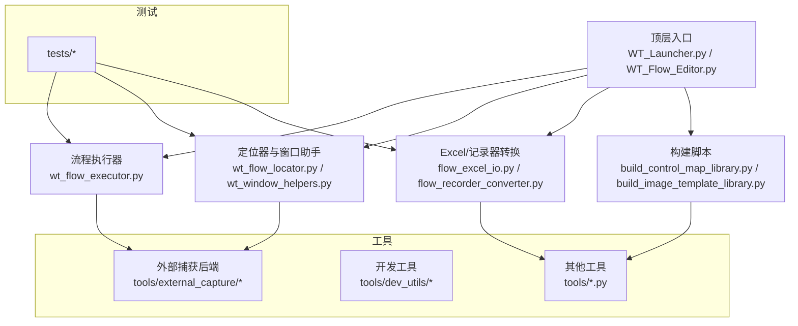
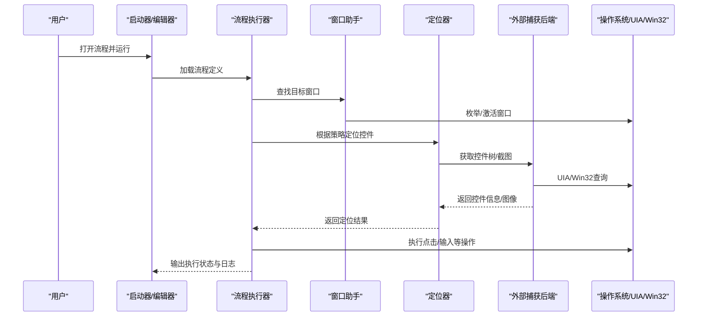
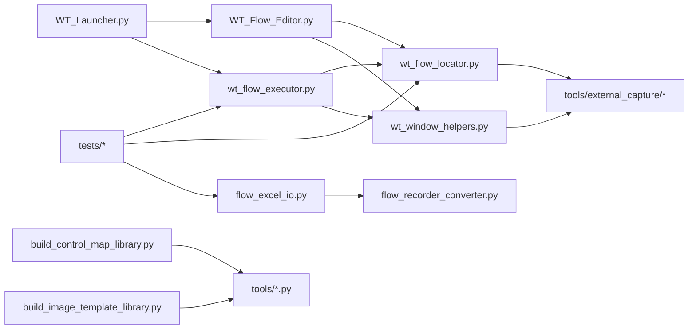

# 开发环境搭建

<cite>
**本文引用的文件**   
- [README.md](file://README.md)
- [requirements-template-builder.txt](file://requirements-template-builder.txt)
- [WT_Launcher.py](file://WT_Launcher.py)
- [WT_Flow_Editor.py](file://WT_Flow_Editor.py)
- [tools/external_capture/pywinauto_backend.py](file://tools/external_capture/pywinauto_backend.py)
- [tools/external_capture/capture.py](file://tools/external_capture/capture.py)
- [tools/external_capture/uiapeek_client.py](file://tools/external_capture/uiapeek_client.py)
- [tools/dev_utils/get_mouse_position.py](file://tools/dev_utils/get_mouse_position.py)
- [tools/dev_utils/list_models.py](file://tools/dev_utils/list_models.py)
- [tools/dev_utils/test_api.py](file://tools/dev_utils/test_api.py)
- [tools/generate_flow_package.py](file://tools/generate_flow_package.py)
- [tools/merge_standard_control_library.py](file://tools/merge_standard_control_library.py)
- [build_control_map_library.py](file://build_control_map_library.py)
- [build_image_template_library.py](file://build_image_template_library.py)
- [flow_excel_io.py](file://flow_excel_io.py)
- [flow_recorder_converter.py](file://flow_recorder_converter.py)
- [wt_flow_executor.py](file://wt_flow_executor.py)
- [wt_flow_locator.py](file://wt_flow_locator.py)
- [wt_window_helpers.py](file://wt_window_helpers.py)
- [tests/test_wt_flow_executor.py](file://tests/test_wt_flow_executor.py)
- [tests/test_wt_flow_locator_relative_window.py](file://tests/test_wt_flow_locator_relative_window.py)
- [tests/test_self_healing_locator.py](file://tests/test_self_healing_locator.py)
- [tests/test_ui_path_selector.py](file://tests/test_ui_path_selector.py)
- [tests/test_image_matcher_multiscale.py](file://tests/test_image匹配器多尺度.py)
- [tests/test_wt_action_validation.py](file://tests/test_wt_action_validation.py)
- [tests/test_wt_run_reporting.py](file://tests/test_wt_run_reporting.py)
- [tests/test_flow_excel_io.py](file://tests/test_flow_excel_io.py)
- [tests/test_flow_recorder_converter.py](file://tests/test_flow_recorder_converter.py)
</cite>

## 目录
1. [简介](#简介)
2. [项目结构](#项目结构)
3. [核心组件](#核心组件)
4. [架构总览](#架构总览)
5. [详细组件分析](#详细组件分析)
6. [依赖分析](#依赖分析)
7. [性能考虑](#性能考虑)
8. [故障排查指南](#故障排查指南)
9. [结论](#结论)
10. [附录](#附录)

## 简介
本指南面向WT自动化框架的开发者，提供从零开始的Windows开发环境搭建说明。内容涵盖Python版本与虚拟环境、核心依赖（pywinauto、opencv-python、pytesseract等）安装与配置、IDE调试与插件建议、Tesseract OCR引擎安装与路径设置、常见问题排查以及常用快捷键与效率技巧。目标是帮助你在最短时间内获得稳定、可调试、可复现的开发体验。

## 项目结构
仓库采用“应用脚本 + 工具集 + 测试 + 资源库”的分层组织方式：
- 顶层脚本：启动器、流程编辑器、构建脚本等
- tools：外部捕获桥接、OCR辅助、模型列表、API测试等工具
- tests：单元测试与集成测试
- resources/control_maps/image_templates：运行时数据与模板
- docs：文档与示例

图表来源
- [WT_Launcher.py](file://WT_Launcher.py)
- [WT_Flow_Editor.py](file://WT_Flow_Editor.py)
- [wt_flow_executor.py](file://wt_flow_executor.py)
- [wt_flow_locator.py](file://wt_flow_locator.py)
- [wt_window_helpers.py](file://wt_window_helpers.py)
- [flow_excel_io.py](file://flow_excel_io.py)
- [flow_recorder_converter.py](file://flow_recorder_converter.py)
- [build_control_map_library.py](file://build_control_map_library.py)
- [build_image_template_library.py](file://build_image_template_library.py)
- [tools/external_capture/pywinauto_backend.py](file://tools/external_capture/pywinauto_backend.py)
- [tools/external_capture/capture.py](file://tools/external_capture/capture.py)
- [tools/external_capture/uiapeek_client.py](file://tools/external_capture/uiapeek_client.py)
- [tools/dev_utils/get_mouse_position.py](file://tools/dev_utils/get_mouse_position.py)
- [tools/dev_utils/list_models.py](file://tools/dev_utils/list_models.py)
- [tools/dev_utils/test_api.py](file://tools/dev_utils/test_api.py)
- [tools/generate_flow_package.py](file://tools/generate_flow_package.py)
- [tools/merge_standard_control_library.py](file://tools/merge_standard_control_library.py)

章节来源
- [README.md](file://README.md)

## 核心组件
- 启动器与编辑器：提供GUI入口与流程编辑能力
- 流程执行器：解析并驱动UI操作
- 定位器与窗口助手：基于UIA/Win32进行控件定位与窗口管理
- 外部捕获后端：封装pywinauto与UIA Peek客户端，用于截图与控件树获取
- Excel/记录器转换：将Excel定义或录制脚本转换为内部流程格式
- 构建脚本：生成控件映射库与图像模板索引
- 测试套件：覆盖执行器、定位器、转换器、报告等关键路径

章节来源
- [WT_Launcher.py](file://WT_Launcher.py)
- [WT_Flow_Editor.py](file://WT_Flow_Editor.py)
- [wt_flow_executor.py](file://wt_flow_executor.py)
- [wt_flow_locator.py](file://wt_flow_locator.py)
- [wt_window_helpers.py](file://wt_window_helpers.py)
- [tools/external_capture/pywinauto_backend.py](file://tools/external_capture/pywinauto_backend.py)
- [tools/external_capture/capture.py](file://tools/external_capture/capture.py)
- [tools/external_capture/uiapeek_client.py](file://tools/external_capture/uiapeek_client.py)
- [flow_excel_io.py](file://flow_excel_io.py)
- [flow_recorder_converter.py](file://flow_recorder_converter.py)
- [build_control_map_library.py](file://build_control_map_library.py)
- [build_image_template_library.py](file://build_image_template_library.py)

## 架构总览
下图展示了从用户界面到UI控制与图像识别的关键调用链。

图表来源
- [WT_Launcher.py](file://WT_Launcher.py)
- [WT_Flow_Editor.py](file://WT_Flow_Editor.py)
- [wt_flow_executor.py](file://wt_flow_executor.py)
- [wt_flow_locator.py](file://wt_flow_locator.py)
- [wt_window_helpers.py](file://wt_window_helpers.py)
- [tools/external_capture/pywinauto_backend.py](file://tools/external_capture/pywinauto_backend.py)
- [tools/external_capture/capture.py](file://tools/external_capture/capture.py)
- [tools/external_capture/uiapeek_client.py](file://tools/external_capture/uiapeek_client.py)

## 详细组件分析

### Python与虚拟环境
- 推荐Python版本：3.10.x（Windows x64）。若需使用特定扩展包，请确保与系统架构一致。
- 创建与管理虚拟环境
  - 使用venv：python -m venv .venv
  - 激活环境：Windows PowerShell中执行 .\.venv\Scripts\Activate.ps1；CMD中执行 .\.venv\Scripts\activate.bat
  - 退出环境：deactivate
- 依赖安装
  - 优先尝试安装项目提供的模板依赖清单（如存在requirements-template-builder.txt），再按需补充
  - 若清单不存在或版本不满足，按“核心依赖”小节逐一安装

章节来源
- [requirements-template-builder.txt](file://requirements-template-builder.txt)

### 核心依赖与安装要点
- pywinauto
  - 用途：UIA/Win32控件访问、窗口枚举、鼠标键盘模拟
  - 安装：pip install pywinauto
  - 注意：在Windows上通常无需额外系统组件；若遇到权限问题，请以管理员身份运行终端或IDE
- opencv-python
  - 用途：图像处理、模板匹配、多尺度匹配
  - 安装：pip install opencv-python
  - 注意：如需GPU加速，可安装opencv-contrib-python或使用预编译二进制
- pytesseract
  - 用途：OCR文本识别
  - 安装：pip install pytesseract
  - 注意：必须单独安装Tesseract OCR引擎，并配置其可执行文件路径（见下一节）
- 其他常见依赖
  - pandas/openpyxl：Excel读写（flow_excel_io.py）
  - jsonschema：流程定义校验（wt_action_schema.py等）
  - pytest：测试运行（tests/*）
  - Pillow：图像处理（部分模块可能用到）
  - requests：网络请求（如有远程服务交互）

章节来源
- [tools/external_capture/pywinauto_backend.py](file://tools/external_capture/pywinauto_backend.py)
- [tools/external_capture/capture.py](file://tools/external_capture/capture.py)
- [tools/external_capture/uiapeek_client.py](file://tools/external_capture/uiapeek_client.py)
- [flow_excel_io.py](file://flow_excel_io.py)
- [flow_recorder_converter.py](file://flow_recorder_converter.py)
- [wt_flow_executor.py](file://wt_flow_executor.py)
- [wt_flow_locator.py](file://wt_flow_locator.py)
- [wt_window_helpers.py](file://wt_window_helpers.py)

### Tesseract OCR引擎安装与路径配置
- 下载与安装
  - 前往官方发布页下载Windows安装包（x64），选择包含语言包的版本
  - 安装时勾选中文语言包（chi_sim/chi_tra）
- 路径配置
  - 方法一：将Tesseract安装目录加入系统PATH环境变量
  - 方法二：在代码中显式指定tessdata路径与tesseract可执行路径（参考pytesseract文档）
- 验证
  - 命令行执行 tesseract --version 确认安装成功
  - 使用项目内工具脚本快速验证（例如列出可用模型）

章节来源
- [tools/dev_utils/list_models.py](file://tools/dev_utils/list_models.py)

### IDE配置建议（PyCharm / VS Code）
- PyCharm
  - 解释器：指向虚拟环境的python.exe
  - 调试器：默认即可；为GUI程序启用“多线程调试”有助于观察线程行为
  - 代码风格：PEP8；自动格式化：保存时格式化
  - 插件：Black Formatter、Ruff、Chinese Language Pack、Rainbow Brackets
- VS Code
  - 扩展：Python、Pylance、Black Formatter、Ruff、Jupyter（可选）、GitLens
  - 调试器：默认Python调试器；为GUI程序添加“控制台”类型以保留输出
  - 代码风格：保存时格式化；启用linting（ruff/flake8）
- 通用建议
  - 统一换行符与编码：LF、UTF-8
  - 开启git diff高亮与提交前检查

[本节为通用建议，不涉及具体源码文件]

### Windows特殊配置
- 显示缩放与DPI
  - 若UI元素尺寸异常，可在IDE或脚本进程属性中设置“高DPI缩放替代”，选择“应用程序”
- 权限与UAC
  - 某些UIA/Win32操作需要管理员权限；必要时以管理员身份运行IDE或终端
- 输入法与焦点
  - 在执行输入类操作前，确保目标窗口已激活且输入法处于英文模式（避免中文输入干扰）
- 屏幕分辨率与多显示器
  - 图像匹配对分辨率敏感，建议在固定分辨率下开发与测试

[本节为通用建议，不涉及具体源码文件]

### 开发工具与效率技巧
- 常用快捷键（VS Code）
  - Ctrl+Shift+P：命令面板；Ctrl+`：切换终端；Ctrl+Shift+N：新建文件
  - Ctrl+F：全局搜索；Ctrl+Shift+F：跨文件搜索；Ctrl+Shift+O：符号跳转
  - Ctrl+Shift+I：智能补全；F12：转到定义；Shift+F12：引用
  - Ctrl+Alt+L：格式化当前文件；Ctrl+K Ctrl+S：打开键盘快捷方式
- 常用快捷键（PyCharm）
  - Ctrl+Shift+A：查找动作；Ctrl+Shift+F：全局搜索；Ctrl+Shift+G：替换
  - Alt+F7：查找用法；Ctrl+Alt+L：格式化；Ctrl+Alt+O：优化导入
- 调试技巧
  - 在关键分支插入断点；使用条件断点过滤无效场景
  - 查看变量与调用栈；对GUI事件使用“暂停所有线程”定位阻塞
- 日志与打印
  - 使用结构化日志（时间戳、级别、上下文）；避免过多print影响性能

[本节为通用建议，不涉及具体源码文件]

## 依赖分析
下图展示主要模块间的依赖关系与职责边界。

图表来源
- [WT_Launcher.py](file://WT_Launcher.py)
- [WT_Flow_Editor.py](file://WT_Flow_Editor.py)
- [wt_flow_executor.py](file://wt_flow_executor.py)
- [wt_flow_locator.py](file://wt_flow_locator.py)
- [wt_window_helpers.py](file://wt_window_helpers.py)
- [tools/external_capture/pywinauto_backend.py](file://tools/external_capture/pywinauto_backend.py)
- [tools/external_capture/capture.py](file://tools/external_capture/capture.py)
- [tools/external_capture/uiapeek_client.py](file://tools/external_capture/uiapeek_client.py)
- [flow_excel_io.py](file://flow_excel_io.py)
- [flow_recorder_converter.py](file://flow_recorder_converter.py)
- [build_control_map_library.py](file://build_control_map_library.py)
- [build_image_template_library.py](file://build_image_template_library.py)
- [tools/generate_flow_package.py](file://tools/generate_flow_package.py)
- [tools/merge_standard_control_library.py](file://tools/merge_standard_control_library.py)
- [tests/test_wt_flow_executor.py](file://tests/test_wt_flow_executor.py)
- [tests/test_wt_flow_locator_relative_window.py](file://tests/test_wt_flow_locator_relative_window.py)
- [tests/test_self_healing_locator.py](file://tests/test_self_healing_locator.py)
- [tests/test_ui_path_selector.py](file://tests/test_ui_path_selector.py)
- [tests/test_image_matcher_multiscale.py](file://tests/test_image匹配器多尺度.py)
- [tests/test_wt_action_validation.py](file://tests/test_wt_action_validation.py)
- [tests/test_wt_run_reporting.py](file://tests/test_wt_run_reporting.py)
- [tests/test_flow_excel_io.py](file://tests/test_flow_excel_io.py)
- [tests/test_flow_recorder_converter.py](file://tests/test_flow_recorder_converter.py)

章节来源
- [tools/external_capture/pywinauto_backend.py](file://tools/external_capture/pywinauto_backend.py)
- [tools/external_capture/capture.py](file://tools/external_capture/capture.py)
- [tools/external_capture/uiapeek_client.py](file://tools/external_capture/uiapeek_client.py)
- [tools/dev_utils/get_mouse_position.py](file://tools/dev_utils/get_mouse_position.py)
- [tools/dev_utils/list_models.py](file://tools/dev_utils/list_models.py)
- [tools/dev_utils/test_api.py](file://tools/dev_utils/test_api.py)
- [tools/generate_flow_package.py](file://tools/generate_flow_package.py)
- [tools/merge_standard_control_library.py](file://tools/merge_standard_control_library.py)
- [build_control_map_library.py](file://build_control_map_library.py)
- [build_image_template_library.py](file://build_image_template_library.py)
- [flow_excel_io.py](file://flow_excel_io.py)
- [flow_recorder_converter.py](file://flow_recorder_converter.py)
- [wt_flow_executor.py](file://wt_flow_executor.py)
- [wt_flow_locator.py](file://wt_flow_locator.py)
- [wt_window_helpers.py](file://wt_window_helpers.py)
- [tests/test_wt_flow_executor.py](file://tests/test_wt_flow_executor.py)
- [tests/test_wt_flow_locator_relative_window.py](file://tests/test_wt_flow_locator_relative_window.py)
- [tests/test_self_healing_locator.py](file://tests/test_self_healing_locator.py)
- [tests/test_ui_path_selector.py](file://tests/test_ui_path_selector.py)
- [tests/test_image_matcher_multiscale.py](file://tests/test_image匹配器多尺度.py)
- [tests/test_wt_action_validation.py](file://tests/test_wt_action_validation.py)
- [tests/test_wt_run_reporting.py](file://tests/test_wt_run_reporting.py)
- [tests/test_flow_excel_io.py](file://tests/test_flow_excel_io.py)
- [tests/test_flow_recorder_converter.py](file://tests/test_flow_recorder_converter.py)

## 性能考虑
- 图像匹配
  - 多尺度匹配适合复杂界面，但计算开销较大；建议缓存模板、缩小ROI区域、降低金字塔层级
- OCR识别
  - 预处理（灰度化、二值化、去噪）能显著提升速度与准确率；批量处理时复用同一实例
- UI自动化
  - 减少不必要的窗口枚举与控件遍历；尽量使用稳定的唯一标识（名称、AutomationId）
- 并发与异步
  - 对于长耗时任务（如批量截图/OCR），可使用线程池或进程池；注意线程安全与锁

[本节为通用建议，不涉及具体源码文件]

## 故障排查指南
- 无法导入pywinauto
  - 检查Python版本与平台是否匹配；重新安装pywinauto；确认虚拟环境已激活
- 找不到tesseract命令
  - 确认已安装Tesseract并将bin目录加入PATH；或在代码中显式设置tessdata与可执行路径
- 图像匹配失败或误检
  - 检查分辨率与DPI设置；调整相似度阈值；增加模板数量与多尺度层级；确保目标窗口未被遮挡
- 控件定位不稳定
  - 优先使用UIA属性（名称、AutomationId）；结合相对定位与容差；增加等待与重试逻辑
- 权限相关错误
  - 以管理员身份运行IDE或脚本；关闭UAC弹窗；避免在受保护的系统窗口上执行操作
- 输入法导致输入异常
  - 切换至英文输入法；使用按键序列而非粘贴文本；必要时通过剪贴板写入后触发粘贴
- 依赖冲突
  - 使用独立虚拟环境；锁定依赖版本；逐步安装并验证

章节来源
- [tools/dev_utils/list_models.py](file://tools/dev_utils/list_models.py)
- [tools/external_capture/pywinauto_backend.py](file://tools/external_capture/pywinauto_backend.py)
- [tools/external_capture/capture.py](file://tools/external_capture/capture.py)
- [tools/external_capture/uiapeek_client.py](file://tools/external_capture/uiapeek_client.py)
- [wt_flow_locator.py](file://wt_flow_locator.py)
- [wt_window_helpers.py](file://wt_window_helpers.py)
- [tests/test_wt_flow_executor.py](file://tests/test_wt_flow_executor.py)
- [tests/test_wt_flow_locator_relative_window.py](file://tests/test_wt_flow_locator_relative_window.py)
- [tests/test_self_healing_locator.py](file://tests/test_self_healing_locator.py)
- [tests/test_ui_path_selector.py](file://tests/test_ui_path_selector.py)
- [tests/test_image_matcher_multiscale.py](file://tests/test_image匹配器多尺度.py)
- [tests/test_wt_action_validation.py](file://tests/test_wt_action_validation.py)
- [tests/test_wt_run_reporting.py](file://tests/test_wt_run_reporting.py)
- [tests/test_flow_excel_io.py](file://tests/test_flow_excel_io.py)
- [tests/test_flow_recorder_converter.py](file://tests/test_flow_recorder_converter.py)

## 结论
按照本指南完成Python与虚拟环境准备、核心依赖安装、Tesseract配置与IDE调优后，你将获得一个稳定高效的WT自动化开发环境。建议在固定分辨率与DPI下进行开发与测试，配合完善的日志与断点调试，快速定位UI与图像相关问题。

[本节为总结性内容，不涉及具体源码文件]

## 附录
- 快速验证清单
  - Python版本与架构正确
  - 虚拟环境激活成功
  - pip安装pywinauto、opencv-python、pytesseract无报错
  - tesseract --version可执行
  - 运行最小示例或测试用例无异常
- 参考命令（示例）
  - 创建虚拟环境：python -m venv .venv
  - 激活环境（PowerShell）：.\.venv\Scripts\Activate.ps1
  - 安装依赖：pip install -r requirements-template-builder.txt
  - 运行测试：pytest tests/

[本节为通用建议，不涉及具体源码文件]