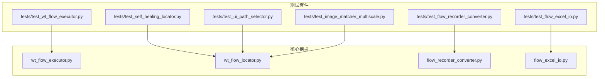
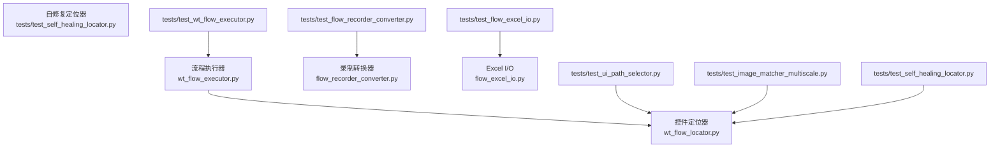
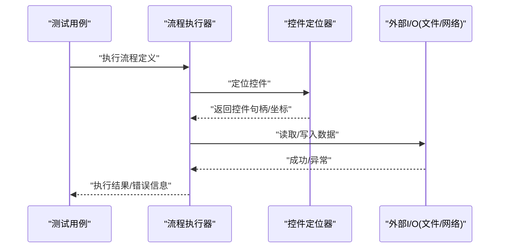
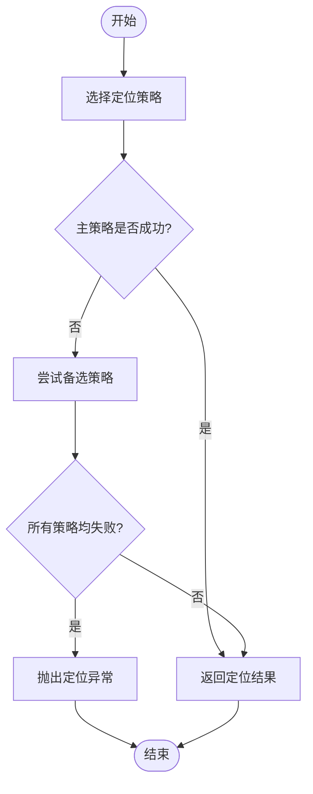
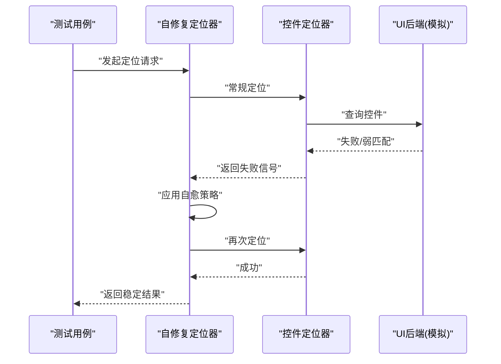
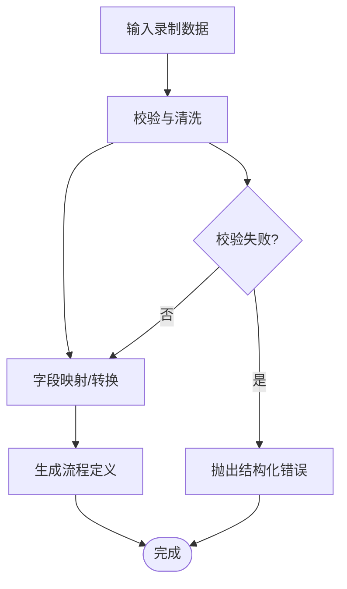
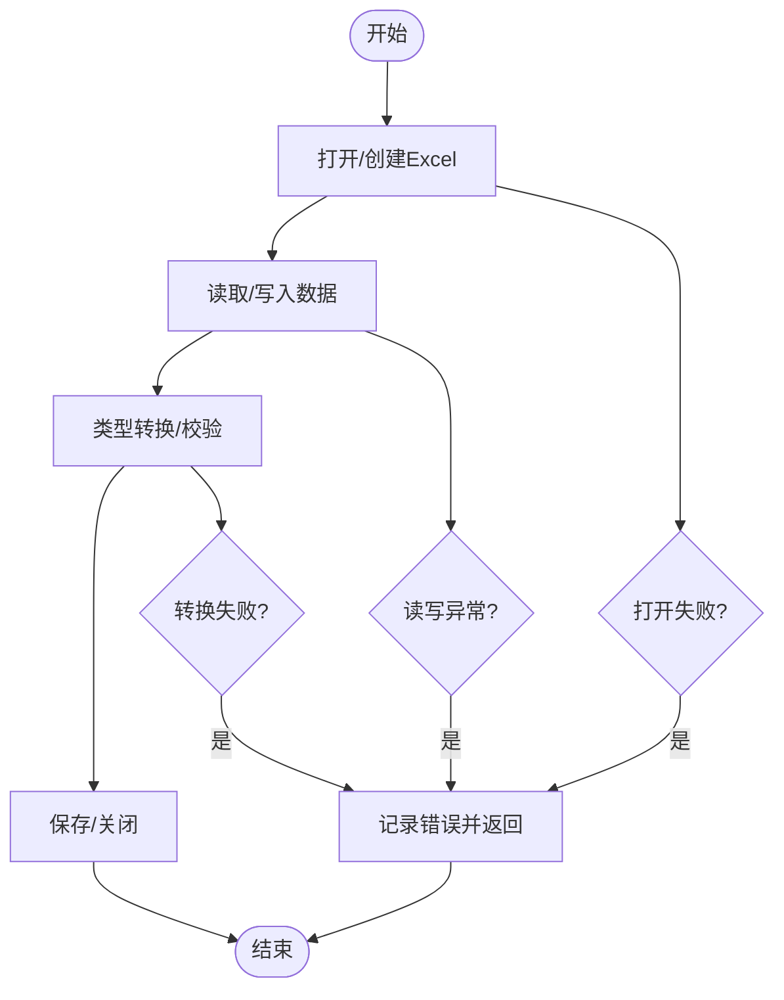
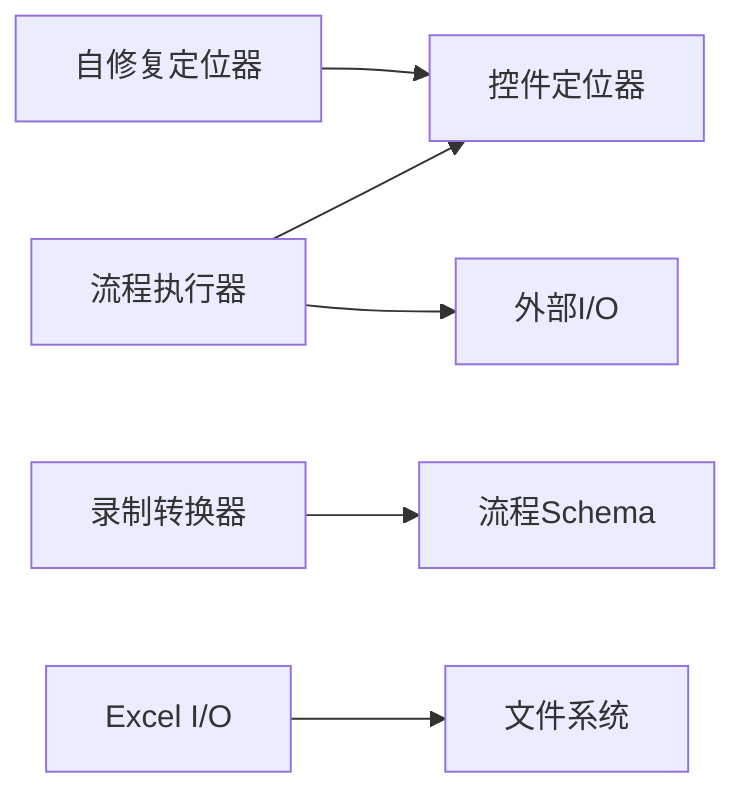

# 单元测试编写

<cite>
**本文引用的文件**   
- [README.md](file://README.md)
- [PROJECT_ARCHITECTURE.md](file://PROJECT_ARCHITECTURE.md)
- [wt_flow_executor.py](file://wt_flow_executor.py)
- [wt_flow_locator.py](file://wt_flow_locator.py)
- [flow_recorder_converter.py](file://flow_recorder_converter.py)
- [flow_excel_io.py](file://flow_excel_io.py)
- [test_wt_flow_executor.py](file://tests/test_wt_flow_executor.py)
- [test_self_healing_locator.py](file://tests/test_self_healing_locator.py)
- [test_ui_path_selector.py](file://tests/test_ui_path_selector.py)
- [test_image_matcher_multiscale.py](file://tests/test_image_matcher_multiscale.py)
- [test_flow_recorder_converter.py](file://tests/test_flow_recorder_converter.py)
- [test_flow_excel_io.py](file://tests/test_flow_excel_io.py)
</cite>

## 目录
1. [简介](#简介)
2. [项目结构](#项目结构)
3. [核心组件](#核心组件)
4. [架构总览](#架构总览)
5. [详细组件分析](#详细组件分析)
6. [依赖关系分析](#依赖关系分析)
7. [性能考虑](#性能考虑)
8. [故障排查指南](#故障排查指南)
9. [结论](#结论)
10. [附录](#附录)

## 简介
本指南面向WT自动化框架的开发者与测试工程师，提供基于pytest的高质量单元测试编写规范与实践。内容覆盖：
- 测试用例组织、命名规范与断言方法
- 核心模块（流程执行器、控件定位器、自修复定位器等）的测试策略
- Mock/Stub隔离外部依赖（UI组件、文件系统、网络请求）
- 异步测试、异常测试与边界条件测试最佳实践
- 测试数据准备与清理，确保独立性与可重复性

## 项目结构
仓库采用“功能模块 + 测试”的扁平化组织方式，核心业务逻辑位于根目录Python文件，对应测试集中在tests目录。关键目录与文件：
- 核心模块：wt_flow_executor.py、wt_flow_locator.py、flow_recorder_converter.py、flow_excel_io.py等
- 测试套件：tests/test_*.py，按被测模块一一对应
- 示例与文档：examples、docs、samples等

图表来源
- [wt_flow_executor.py](file://wt_flow_executor.py)
- [wt_flow_locator.py](file://wt_flow_locator.py)
- [flow_recorder_converter.py](file://flow_recorder_converter.py)
- [flow_excel_io.py](file://flow_excel_io.py)
- [tests/test_wt_flow_executor.py](file://tests/test_wt_flow_executor.py)
- [tests/test_self_healing_locator.py](file://tests/test_self_healing_locator.py)
- [tests/test_ui_path_selector.py](file://tests/test_ui_path_selector.py)
- [tests/test_image_matcher_multiscale.py](file://tests/test_image_matcher_multiscale.py)
- [tests/test_flow_recorder_converter.py](file://tests/test_flow_recorder_converter.py)
- [tests/test_flow_excel_io.py](file://tests/test_flow_excel_io.py)

章节来源
- [README.md](file://README.md)
- [PROJECT_ARCHITECTURE.md](file://PROJECT_ARCHITECTURE.md)

## 核心组件
本节聚焦被测核心模块的职责与测试要点，帮助快速定位测试切入点。

- 流程执行器（wt_flow_executor.py）
  - 职责：解析并执行流程定义，驱动步骤序列，管理上下文状态，协调定位器与动作执行。
  - 测试重点：步骤调度顺序、参数传递、错误传播、重试/回滚策略（若有）、并发/异步控制（若有）。
- 控件定位器（wt_flow_locator.py）
  - 职责：根据多种策略（名称、路径、相对位置、图像匹配等）定位UI控件。
  - 测试重点：多策略组合、容错与降级、超时与重试、异常分支。
- 自修复定位器（tests/test_self_healing_locator.py）
  - 职责：在定位失败时尝试替代策略或自动修正。
  - 测试重点：自愈触发条件、候选策略选择、最终结果一致性。
- 录制转换器（flow_recorder_converter.py）
  - 职责：将录制脚本转换为标准流程定义。
  - 测试重点：输入格式校验、字段映射、边界值处理、输出结构合规。
- Excel I/O（flow_excel_io.py）
  - 职责：读写流程相关Excel数据。
  - 测试重点：IO异常、编码与类型转换、空值与缺失列处理。

章节来源
- [wt_flow_executor.py](file://wt_flow_executor.py)
- [wt_flow_locator.py](file://wt_flow_locator.py)
- [tests/test_self_healing_locator.py](file://tests/test_self_healing_locator.py)
- [flow_recorder_converter.py](file://flow_recorder_converter.py)
- [flow_excel_io.py](file://flow_excel_io.py)

## 架构总览
下图展示核心模块与测试之间的交互关系，便于理解测试范围与隔离点。

图表来源
- [wt_flow_executor.py](file://wt_flow_executor.py)
- [wt_flow_locator.py](file://wt_flow_locator.py)
- [tests/test_wt_flow_executor.py](file://tests/test_wt_flow_executor.py)
- [tests/test_ui_path_selector.py](file://tests/test_ui_path_selector.py)
- [tests/test_image_matcher_multiscale.py](file://tests/test_image_matcher_multiscale.py)
- [tests/test_self_healing_locator.py](file://tests/test_self_healing_locator.py)
- [flow_recorder_converter.py](file://flow_recorder_converter.py)
- [tests/test_flow_recorder_converter.py](file://tests/test_flow_recorder_converter.py)
- [flow_excel_io.py](file://flow_excel_io.py)
- [tests/test_flow_excel_io.py](file://tests/test_flow_excel_io.py)

## 详细组件分析

### 流程执行器测试（wt_flow_executor.py）
- 目标
  - 验证步骤编排、参数注入、异常传播与恢复。
- 建议用例
  - 正常路径：最小流程、多步骤串联、参数透传。
  - 异常路径：步骤抛出异常、依赖不可用、超时。
  - 边界条件：空步骤列表、重复步骤、非法参数。
- 隔离策略
  - 使用Mock替换UI操作、文件读写、网络请求；使用Fixture准备流程定义与上下文。
- 断言要点
  - 调用次数与参数、返回值结构、副作用（如日志、中间状态）。

图表来源
- [wt_flow_executor.py](file://wt_flow_executor.py)
- [wt_flow_locator.py](file://wt_flow_locator.py)
- [tests/test_wt_flow_executor.py](file://tests/test_wt_flow_executor.py)

章节来源
- [wt_flow_executor.py](file://wt_flow_executor.py)
- [tests/test_wt_flow_executor.py](file://tests/test_wt_flow_executor.py)

### 控件定位器测试（wt_flow_locator.py）
- 目标
  - 验证多策略定位的正确性、鲁棒性与性能。
- 建议用例
  - 单一策略：名称、路径、相对区域、图像模板。
  - 组合策略：主策略失败后回退到备选策略。
  - 异常场景：控件不存在、图像不匹配、窗口未就绪。
- 隔离策略
  - Mock UI后端与图像匹配库；构造可控的控件树与截图数据。
- 断言要点
  - 命中策略、定位精度、耗时阈值、重试次数。

图表来源
- [wt_flow_locator.py](file://wt_flow_locator.py)
- [tests/test_ui_path_selector.py](file://tests/test_ui_path_selector.py)
- [tests/test_image_matcher_multiscale.py](file://tests/test_image_matcher_multiscale.py)

章节来源
- [wt_flow_locator.py](file://wt_flow_locator.py)
- [tests/test_ui_path_selector.py](file://tests/test_ui_path_selector.py)
- [tests/test_image_matcher_multiscale.py](file://tests/test_image_matcher_multiscale.py)

### 自修复定位器测试（tests/test_self_healing_locator.py）
- 目标
  - 验证自愈机制在定位失败时的自动修正能力。
- 建议用例
  - 触发自愈：控件属性漂移、层级变化、图像偏移。
  - 自愈策略：扩大搜索区域、放宽相似度阈值、切换策略。
  - 回归保护：自愈后行为一致、无副作用。
- 隔离策略
  - 注入“不稳定”的控件树或图像，观察自愈路径。
- 断言要点
  - 自愈触发次数、最终定位稳定性、性能开销。

图表来源
- [tests/test_self_healing_locator.py](file://tests/test_self_healing_locator.py)
- [wt_flow_locator.py](file://wt_flow_locator.py)

章节来源
- [tests/test_self_healing_locator.py](file://tests/test_self_healing_locator.py)

### 录制转换器测试（flow_recorder_converter.py）
- 目标
  - 验证录制脚本到流程定义的转换正确性与健壮性。
- 建议用例
  - 标准输入：完整字段、合法枚举值。
  - 异常输入：缺失必填字段、类型错误、未知键。
  - 边界输入：超长文本、特殊字符、空数组。
- 隔离策略
  - 使用内存数据结构作为输入源，避免真实文件IO。
- 断言要点
  - 输出结构符合Schema、字段映射正确、错误信息清晰。

图表来源
- [flow_recorder_converter.py](file://flow_recorder_converter.py)
- [tests/test_flow_recorder_converter.py](file://tests/test_flow_recorder_converter.py)

章节来源
- [flow_recorder_converter.py](file://flow_recorder_converter.py)
- [tests/test_flow_recorder_converter.py](file://tests/test_flow_recorder_converter.py)

### Excel I/O测试（flow_excel_io.py）
- 目标
  - 验证Excel读写功能的正确性与异常处理。
- 建议用例
  - 正常读写：单表/多表、数据类型转换。
  - 异常路径：文件不存在、权限不足、损坏文件。
  - 边界条件：超大表格、空单元格、重复标题。
- 隔离策略
  - 使用临时文件或内存对象进行读写，避免污染磁盘。
- 断言要点
  - 数据一致性、类型安全、错误码/异常信息。

图表来源
- [flow_excel_io.py](file://flow_excel_io.py)
- [tests/test_flow_excel_io.py](file://tests/test_flow_excel_io.py)

章节来源
- [flow_excel_io.py](file://flow_excel_io.py)
- [tests/test_flow_excel_io.py](file://tests/test_flow_excel_io.py)

## 依赖关系分析
- 耦合关系
  - 流程执行器依赖控件定位器与外部I/O。
  - 自修复定位器对控件定位器形成增强封装。
  - 录制转换器与Excel I/O为纯数据处理层，易于隔离。
- 潜在循环依赖
  - 当前结构未见明显循环；建议在新增模块时保持单向依赖。
- 外部依赖隔离点
  - UI后端、图像匹配库、文件系统、网络请求均应通过接口抽象与Mock隔离。

图表来源
- [wt_flow_executor.py](file://wt_flow_executor.py)
- [wt_flow_locator.py](file://wt_flow_locator.py)
- [tests/test_self_healing_locator.py](file://tests/test_self_healing_locator.py)
- [flow_recorder_converter.py](file://flow_recorder_converter.py)
- [flow_excel_io.py](file://flow_excel_io.py)

章节来源
- [wt_flow_executor.py](file://wt_flow_executor.py)
- [wt_flow_locator.py](file://wt_flow_locator.py)
- [flow_recorder_converter.py](file://flow_recorder_converter.py)
- [flow_excel_io.py](file://flow_excel_io.py)

## 性能考虑
- 定位器性能
  - 控制图像匹配分辨率与缩放级别，避免全图扫描。
  - 缓存常用控件树快照，减少重复查询。
- 执行器性能
  - 批量操作合并、并行化非阻塞步骤（需保证线程安全）。
- 测试性能
  - 使用轻量Mock与内存数据，避免真实IO与UI启动。
  - 合理设置超时与重试上限，防止测试长时间挂起。

[本节为通用指导，无需源码引用]

## 故障排查指南
- 常见问题
  - 定位不稳定：检查自愈策略阈值与回退顺序。
  - 转换失败：核对Schema约束与字段映射规则。
  - Excel读写异常：确认文件编码、权限与版本兼容性。
- 调试建议
  - 增加结构化日志与断点，捕获失败前后状态。
  - 使用最小复现用例与固定种子数据。
  - 对比期望与实际差异，逐步缩小范围。

[本节为通用指导，无需源码引用]

## 结论
通过清晰的模块划分与严格的测试策略，WT自动化框架可在复杂UI与多变环境下保持稳定。遵循本指南的命名、断言、Mock与数据管理实践，可显著提升测试质量与可维护性。

[本节为总结性内容，无需源码引用]

## 附录

### pytest基础与约定
- 发现规则
  - 测试文件以test_*.py或*_test.py命名。
  - 测试函数以test_开头，类以Test开头且不含__init__。
- Fixture与Parametrize
  - 使用fixture准备共享资源与上下文。
  - 使用parametrize覆盖多组输入与边界条件。
- 断言风格
  - 优先使用pytest内置断言，必要时结合自定义断言提升可读性。
- 标记与筛选
  - 使用@mark.slow/@mark.skipif等标记分类与过滤。

[本节为通用指导，无需源码引用]

### Mock与Stub示例清单
- 隔离UI后端
  - 使用mock替换控件查找与交互方法，返回可控句柄或坐标。
- 隔离文件系统
  - 使用临时目录与内存文件对象，避免真实磁盘写入。
- 隔离网络请求
  - 使用responses或requests_mock拦截HTTP调用，返回预设响应。
- 隔离图像匹配
  - 预置模板与截图，控制匹配成功率与耗时。

[本节为通用指导，无需源码引用]

### 异步与异常测试要点
- 异步测试
  - 使用pytest-asyncio或事件循环包装协程，设置合理超时。
- 异常测试
  - 使用pytest.raises捕获并断言异常类型与消息片段。
- 边界条件
  - 空输入、极大/极小值、重复键、缺失列、非法枚举等。

[本节为通用指导，无需源码引用]

### 测试数据准备与清理
- 准备
  - 使用fixture集中管理JSON/YAML/Excel样例数据。
  - 使用工厂函数生成随机但合法的输入。
- 清理
  - 使用yield fixture在测试后释放资源（文件、进程、锁）。
  - 避免跨测试共享可变状态，确保可重复性。

[本节为通用指导，无需源码引用]