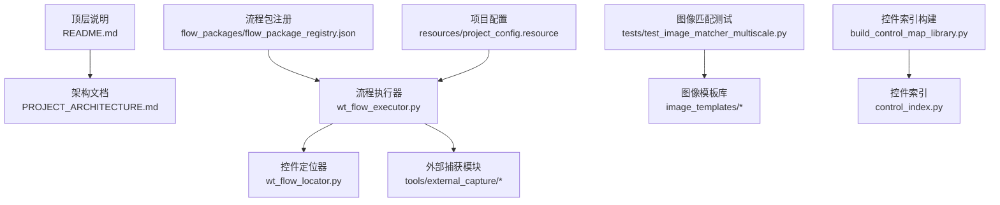
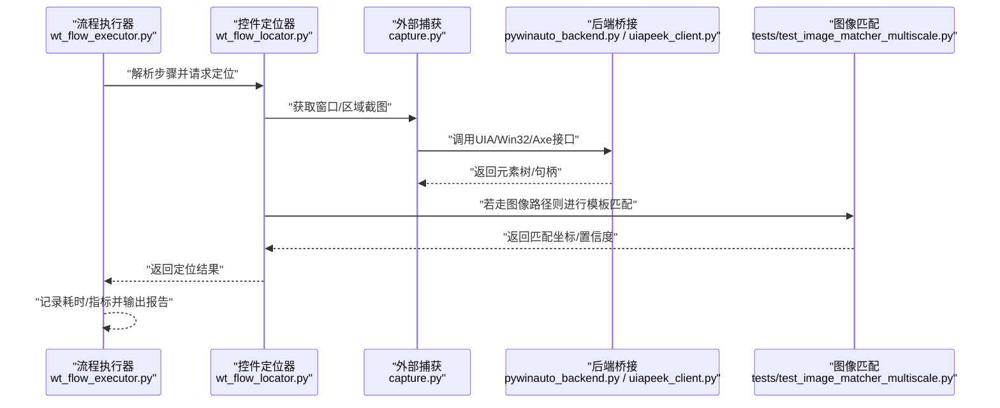
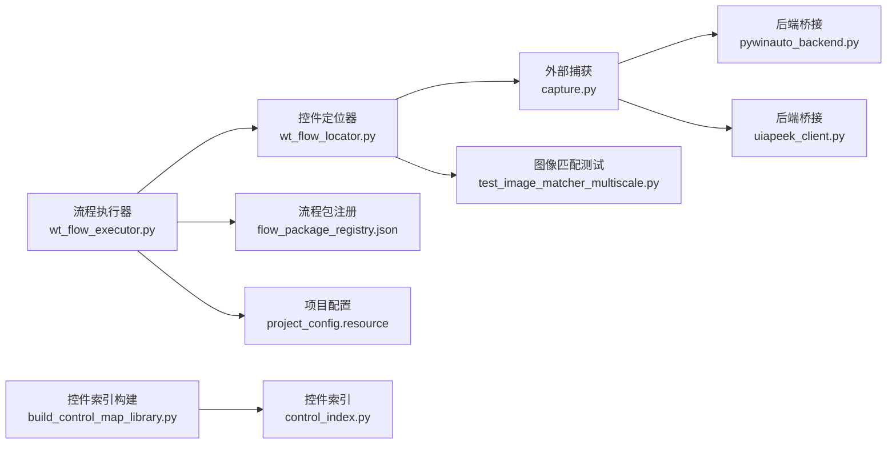

# 性能测试与压力测试

<cite>
**本文引用的文件**   
- [README.md](file://README.md)
- [PROJECT_ARCHITECTURE.md](file://PROJECT_ARCHITECTURE.md)
- [WT_Automation.robot](file://WT_Automation.robot)
- [wt_flow_executor.py](file://wt_flow_executor.py)
- [wt_flow_locator.py](file://wt_flow_locator.py)
- [test_image_matcher_multiscale.py](file://tests/test_image_matcher_multiscale.py)
- [tools/external_capture/capture.py](file://tools/external_capture/capture.py)
- [tools/external_capture/pywinauto_backend.py](file://tools/external_capture/pywinauto_backend.py)
- [tools/external_capture/uiapeek_client.py](file://tools/external_capture/uiapeek_client.py)
- [control_index.py](file://WT_AUTOMATION_Agent/control_index.py)
- [build_control_map_library.py](file://build_control_map_library.py)
- [flow_packages/flow_package_registry.json](file://flow_packages/flow_package_registry.json)
- [resources/project_config.resource](file://resources/project_config.resource)
</cite>

## 目录
1. [简介](#简介)
2. [项目结构](#项目结构)
3. [核心组件](#核心组件)
4. [架构总览](#架构总览)
5. [详细组件分析](#详细组件分析)
6. [依赖关系分析](#依赖关系分析)
7. [性能考量](#性能考量)
8. [故障排查指南](#故障排查指南)
9. [结论](#结论)
10. [附录](#附录)

## 简介
本指南面向WT自动化框架的性能与压力测试，聚焦以下目标：
- 使用性能测试工具评估UI自动化脚本的执行效率，包括控件定位速度、图像匹配性能、OCR识别耗时等关键指标。
- 设计压力测试场景，模拟大量并发用户或长时间运行的自动化任务。
- 编写性能基准测试，建立性能回归检测机制。
- 提供内存泄漏检测和CPU使用率监控的技术建议。
- 分析与优化性能瓶颈（算法优化、缓存策略、资源管理）。
- 解读性能测试报告并给出改进建议。

## 项目结构
WT自动化框架围绕“流程定义—执行器—定位器—外部捕获—模板库”展开。与性能相关的核心路径包括：
- 流程执行入口与调度：wt_flow_executor.py
- UI控件定位与相对定位：wt_flow_locator.py
- 图像匹配多尺度实现与测试：tests/test_image_matcher_multiscale.py
- 外部窗口捕获与后端桥接：tools/external_capture/*
- 控件索引与构建：control_index.py、build_control_map_library.py
- 流程包注册与配置：flow_packages/flow_package_registry.json、resources/project_config.resource
- 顶层说明与架构文档：README.md、PROJECT_ARCHITECTURE.md

图表来源
- [README.md](file://README.md)
- [PROJECT_ARCHITECTURE.md](file://PROJECT_ARCHITECTURE.md)
- [wt_flow_executor.py](file://wt_flow_executor.py)
- [wt_flow_locator.py](file://wt_flow_locator.py)
- [tests/test_image_matcher_multiscale.py](file://tests/test_image_matcher_multiscale.py)
- [tools/external_capture/capture.py](file://tools/external_capture/capture.py)
- [tools/external_capture/pywinauto_backend.py](file://tools/external_capture/pywinauto_backend.py)
- [tools/external_capture/uiapeek_client.py](file://tools/external_capture/uiapeek_client.py)
- [control_index.py](file://WT_AUTOMATION_Agent/control_index.py)
- [build_control_map_library.py](file://build_control_map_library.py)
- [flow_packages/flow_package_registry.json](file://flow_packages/flow_package_registry.json)
- [resources/project_config.resource](file://resources/project_config.resource)

章节来源
- [README.md](file://README.md)
- [PROJECT_ARCHITECTURE.md](file://PROJECT_ARCHITECTURE.md)

## 核心组件
- 流程执行器：负责解析流程定义、调度步骤、协调定位与交互、收集运行结果与报告。
- 控件定位器：封装UIA/Win32/Axe等多后端定位逻辑，支持相对区域定位与容错策略。
- 外部捕获模块：提供屏幕截图、窗口枚举、元素树抓取能力，为图像匹配与OCR提供输入。
- 图像匹配与测试：多尺度模板匹配的实现与验证，是图像定位的关键路径。
- 控件索引与构建：将控件信息结构化存储，加速定位与回放稳定性。
- 流程包注册与配置：集中管理流程包元数据与全局配置项，影响执行路径与行为。

章节来源
- [wt_flow_executor.py](file://wt_flow_executor.py)
- [wt_flow_locator.py](file://wt_flow_locator.py)
- [tools/external_capture/capture.py](file://tools/external_capture/capture.py)
- [tools/external_capture/pywinauto_backend.py](file://tools/external_capture/pywinauto_backend.py)
- [tools/external_capture/uiapeek_client.py](file://tools/external_capture/uiapeek_client.py)
- [tests/test_image_matcher_multiscale.py](file://tests/test_image_matcher_multiscale.py)
- [control_index.py](file://WT_AUTOMATION_Agent/control_index.py)
- [build_control_map_library.py](file://build_control_map_library.py)
- [flow_packages/flow_package_registry.json](file://flow_packages/flow_package_registry.json)
- [resources/project_config.resource](file://resources/project_config.resource)

## 架构总览
下图展示从流程驱动到UI交互的端到端链路，标注了性能热点与可观测点。

图表来源
- [wt_flow_executor.py](file://wt_flow_executor.py)
- [wt_flow_locator.py](file://wt_flow_locator.py)
- [tools/external_capture/capture.py](file://tools/external_capture/capture.py)
- [tools/external_capture/pywinauto_backend.py](file://tools/external_capture/pywinauto_backend.py)
- [tools/external_capture/uiapeek_client.py](file://tools/external_capture/uiapeek_client.py)
- [tests/test_image_matcher_multiscale.py](file://tests/test_image_matcher_multiscale.py)

## 详细组件分析

### 流程执行器（性能热点与埋点）
- 职责：加载流程包、解析步骤、调度定位与动作、聚合指标与报告。
- 性能关注点：
  - 步骤级耗时统计（定位、等待、点击、输入、滚动等）。
  - 并发控制与重试退避策略对吞吐的影响。
  - 资源生命周期（进程、线程、句柄）与清理时机。
- 建议埋点：
  - 在步骤开始/结束处记录时间戳与上下文（窗口、控件标识、定位方式）。
  - 汇总失败率、超时次数、重试次数、平均/分位耗时。

章节来源
- [wt_flow_executor.py](file://wt_flow_executor.py)

### 控件定位器（定位速度与稳定性）
- 职责：统一封装多种定位策略（UIA属性、层级路径、相对区域、图像匹配），返回稳定坐标。
- 性能关注点：
  - UIA遍历深度与过滤条件对延迟的影响。
  - 相对区域裁剪减少搜索空间的有效性。
  - 图像匹配前预处理（缩放、灰度、阈值）的成本收益。
- 建议优化：
  - 优先使用属性+层级定位，仅在必要时回退图像匹配。
  - 缓存稳定的控件句柄/路径，避免重复遍历。
  - 限制最大重试次数与等待上限，避免长尾阻塞。

章节来源
- [wt_flow_locator.py](file://wt_flow_locator.py)

### 外部捕获与后端桥接（截图与元素树开销）
- 职责：提供屏幕截图、窗口枚举、元素树抓取；对接UIA/Win32/Axe后端。
- 性能关注点：
  - 截图分辨率与刷新频率对CPU/GPU占用影响。
  - 元素树查询粒度（全树 vs 子树）与序列化成本。
  - 跨进程通信与异常恢复的代价。
- 建议优化：
  - 按需局部截图，降低分辨率或ROI范围。
  - 复用会话/连接，减少频繁创建销毁。
  - 对高频操作采用增量更新策略。

章节来源
- [tools/external_capture/capture.py](file://tools/external_capture/capture.py)
- [tools/external_capture/pywinauto_backend.py](file://tools/external_capture/pywinauto_backend.py)
- [tools/external_capture/uiapeek_client.py](file://tools/external_capture/uiapeek_client.py)

### 图像匹配与多尺度（模板匹配性能）
- 职责：在多尺度下匹配模板图，返回最佳匹配位置与置信度。
- 性能关注点：
  - 多尺度层数、步长、金字塔高度对计算量的影响。
  - 模板尺寸与背景复杂度对匹配时延的影响。
  - 缓存命中策略（模板指纹、相似度阈值）。
- 建议优化：
  - 预生成多尺度模板，运行时仅做快速扫描。
  - 引入粗筛（颜色直方图/角点）再细匹配。
  - 对相似模板去重与合并，减少冗余匹配。

章节来源
- [tests/test_image_matcher_multiscale.py](file://tests/test_image_matcher_multiscale.py)

### 控件索引与构建（加速定位与回归稳定）
- 职责：将控件信息结构化入库，供回放期快速检索。
- 性能关注点：
  - 索引构建耗时与增量更新策略。
  - 索引体积与查询复杂度权衡。
- 建议优化：
  - 增量构建与版本化索引，避免全量重建。
  - 对热点控件建立二级索引（按窗口/类别）。

章节来源
- [control_index.py](file://WT_AUTOMATION_Agent/control_index.py)
- [build_control_map_library.py](file://build_control_map_library.py)

### 流程包注册与配置（执行路径与行为开关）
- 职责：集中管理流程包元数据与全局配置项。
- 性能关注点：
  - 配置读取与热更新的开销。
  - 流程包发现与加载的批量处理。
- 建议优化：
  - 启动时一次性加载必要配置，运行时只读访问。
  - 对流程包清单进行分页/懒加载。

章节来源
- [flow_packages/flow_package_registry.json](file://flow_packages/flow_package_registry.json)
- [resources/project_config.resource](file://resources/project_config.resource)

## 依赖关系分析
下图展示关键模块间的依赖与耦合关系，便于识别单点瓶颈与重构机会。

图表来源
- [wt_flow_executor.py](file://wt_flow_executor.py)
- [wt_flow_locator.py](file://wt_flow_locator.py)
- [tools/external_capture/capture.py](file://tools/external_capture/capture.py)
- [tools/external_capture/pywinauto_backend.py](file://tools/external_capture/pywinauto_backend.py)
- [tools/external_capture/uiapeek_client.py](file://tools/external_capture/uiapeek_client.py)
- [tests/test_image_matcher_multiscale.py](file://tests/test_image_matcher_multiscale.py)
- [build_control_map_library.py](file://build_control_map_library.py)
- [control_index.py](file://WT_AUTOMATION_Agent/control_index.py)
- [flow_packages/flow_package_registry.json](file://flow_packages/flow_package_registry.json)
- [resources/project_config.resource](file://resources/project_config.resource)

## 性能考量

### 关键指标与采集方法
- 控件定位速度
  - 指标：首次定位耗时、P95/P99耗时、失败率。
  - 采集：在执行器中埋点，记录每次定位的开始/结束时间与上下文。
- 图像匹配性能
  - 指标：单次匹配耗时、多尺度层数下的耗时分布、命中率。
  - 采集：在匹配前后打点，结合模板指纹与分辨率维度聚合。
- OCR识别耗时
  - 指标：单次识别耗时、文本长度相关性、错误率。
  - 采集：在OCR调用前后打点，记录输入图像大小与语言包。
- 资源占用
  - 指标：CPU使用率、内存峰值、句柄数、GPU显存（如适用）。
  - 采集：系统级监控（Windows PerfMon/Task Manager/Process Explorer）与进程内采样。

### 压力测试场景设计
- 并发用户模型
  - 通过并行执行多个流程实例模拟多用户；控制每批并发数与总时长。
  - 关注点：共享资源竞争（窗口、剪贴板、网络）、锁粒度与队列长度。
- 长时间运行（Soak）
  - 连续运行N小时，观察内存增长、句柄泄漏、磁盘IO抖动。
  - 关注点：周期性清理、断点续跑、日志轮转。
- 混合负载
  - 组合定位密集型（UIA遍历）、图像密集（模板匹配）、OCR密集三类步骤，评估综合吞吐。

### 基准测试与回归检测
- 基准用例设计
  - 固定数据集与界面快照，确保可复现。
  - 分层基准：定位、图像匹配、OCR、端到端流程。
- 回归判定
  - 设定阈值（如P95耗时增加超过X%或失败率上升Y%即告警）。
  - 与历史基线对比，自动记录差异与趋势。
- 持续集成
  - 在CI中定时运行基准集，产出报告并与上次结果比较。

### 内存泄漏与CPU监控技术
- 内存泄漏检测
  - 进程内：定期采样堆快照，对比对象数量与引用链变化。
  - 进程外：使用系统工具（如Process Explorer）跟踪句柄与GDI对象增长。
- CPU使用率监控
  - 系统级：PerfMon/任务管理器采样主进程与相关DLL。
  - 应用级：在热点函数入口/出口打点，计算自耗时占比。
- 可视化
  - 将时序指标导出为CSV/JSON，配合图表工具绘制趋势与热力图。

### 瓶颈分析与优化建议
- 算法优化
  - 图像匹配：降采样、ROI裁剪、预计算金字塔、近似匹配。
  - 控件定位：缩小搜索域、缓存稳定路径、减少深层遍历。
- 缓存策略
  - 控件索引缓存、模板指纹缓存、OCR中间结果缓存（带失效策略）。
- 资源管理
  - 连接池与对象复用、及时释放句柄、限制并发度避免过载。
- 异步与批处理
  - 非阻塞I/O、批量截图与批量OCR、流水线式处理。

### 性能测试报告解读与改进建议
- 报告内容
  - 总体吞吐、响应时间分布、错误率、资源占用曲线、回归对比。
- 解读要点
  - 识别尾部延迟（P95/P99）与热点步骤。
  - 关联资源峰值与业务高峰，判断是否容量不足或存在争用。
- 改进建议
  - 针对热点步骤实施专项优化（算法/缓存/并发度调整）。
  - 完善监控与告警，形成闭环迭代。

## 故障排查指南
- 常见问题定位
  - 定位超时：检查控件可见性、窗口焦点、相对区域偏移是否正确。
  - 图像匹配失败：确认模板质量、光照变化、分辨率差异。
  - OCR误识：检查字体、清晰度、语言包与预处理参数。
- 诊断手段
  - 启用更详细的日志与上下文快照（窗口标题、控件树片段、截图ROI）。
  - 使用外部捕获模块单独验证截图与元素树获取是否正常。
- 回归定位
  - 对比最近一次通过的基准结果，定位变更点（模板、索引、配置）。

章节来源
- [tools/external_capture/capture.py](file://tools/external_capture/capture.py)
- [tools/external_capture/pywinauto_backend.py](file://tools/external_capture/pywinauto_backend.py)
- [tools/external_capture/uiapeek_client.py](file://tools/external_capture/uiapeek_client.py)
- [tests/test_image_matcher_multiscale.py](file://tests/test_image_matcher_multiscale.py)

## 结论
通过系统化地采集关键指标、设计覆盖并发与长稳的压力场景、建立基准与回归机制，并结合算法优化、缓存与资源管理，可以显著提升WT自动化框架的稳定性和性能。建议在持续集成中固化性能门禁，以数据驱动的方式推动问题早发现、早修复。

## 附录

### 实操清单（示例路径）
- 在流程执行器中添加步骤级埋点与指标聚合
  - 参考：[wt_flow_executor.py](file://wt_flow_executor.py)
- 在定位器中增加ROI与缓存策略
  - 参考：[wt_flow_locator.py](file://wt_flow_locator.py)
- 在外部捕获中优化截图与元素树获取
  - 参考：[tools/external_capture/capture.py](file://tools/external_capture/capture.py)、[tools/external_capture/pywinauto_backend.py](file://tools/external_capture/pywinauto_backend.py)、[tools/external_capture/uiapeek_client.py](file://tools/external_capture/uiapeek_client.py)
- 在图像匹配中引入预计算与近似筛选
  - 参考：[tests/test_image_matcher_multiscale.py](file://tests/test_image_matcher_multiscale.py)
- 构建与增量更新控件索引
  - 参考：[build_control_map_library.py](file://build_control_map_library.py)、[control_index.py](file://WT_AUTOMATION_Agent/control_index.py)
- 配置流程包与全局参数
  - 参考：[flow_packages/flow_package_registry.json](file://flow_packages/flow_package_registry.json)、[resources/project_config.resource](file://resources/project_config.resource)