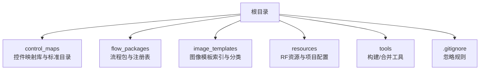
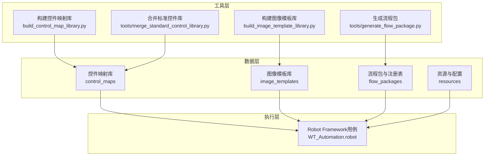
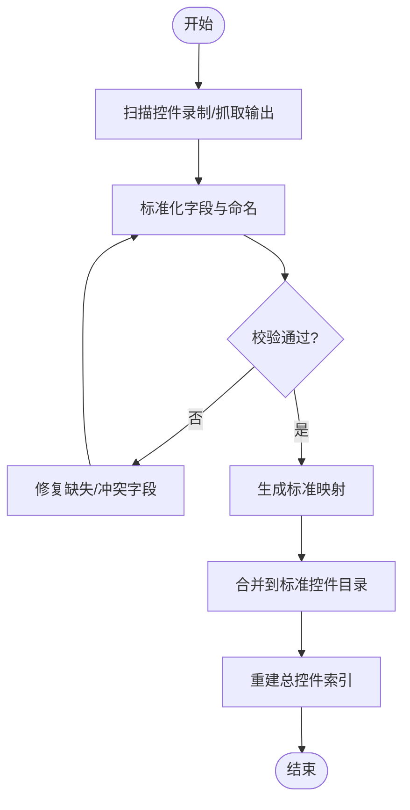
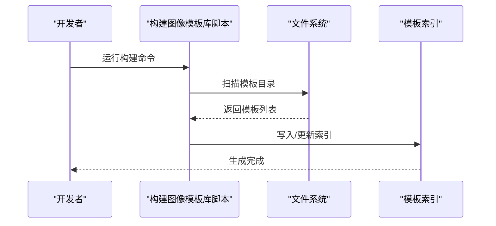
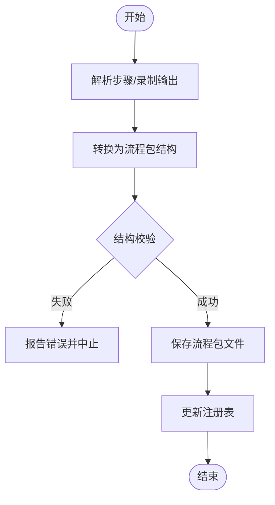
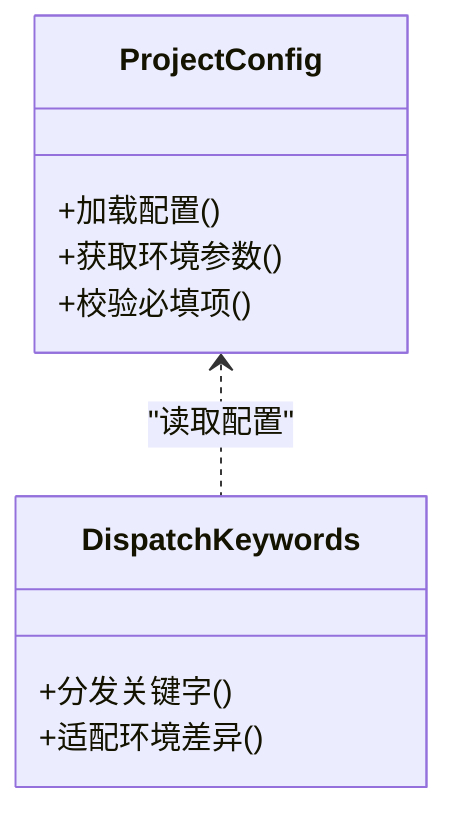
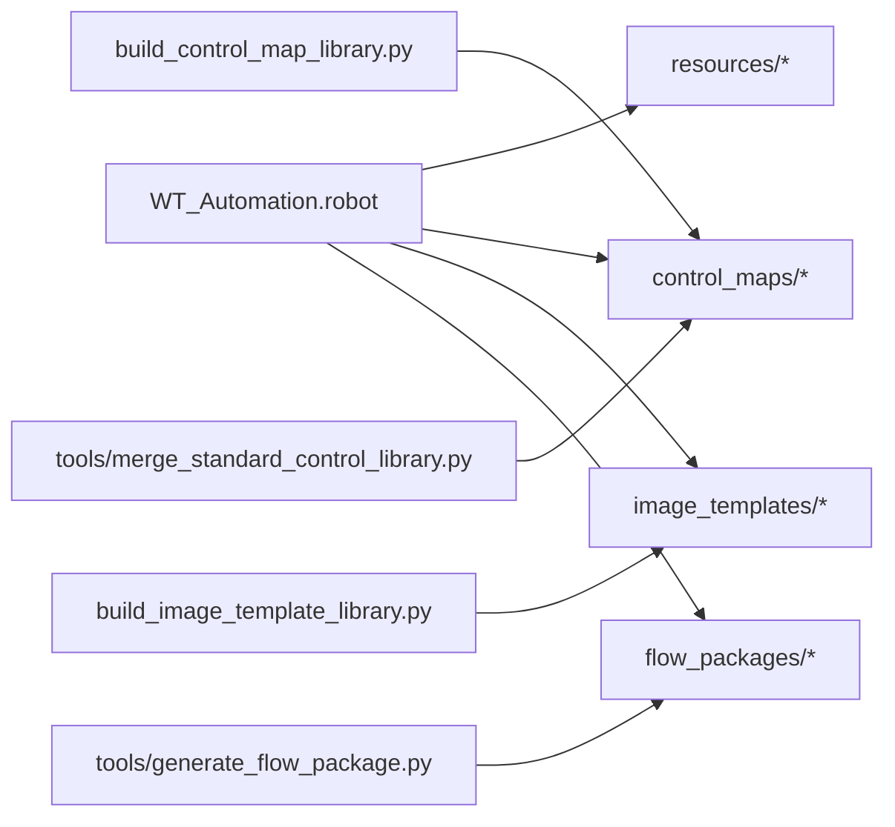

# 测试数据与环境管理

<cite>
**本文引用的文件**   
- [README.md](file://README.md)
- [PROJECT_ARCHITECTURE.md](file://PROJECT_ARCHITECTURE.md)
- [WT_Automation.robot](file://WT_Automation.robot)
- [resources/project_config.resource](file://resources/project_config.resource)
- [resources/dispatch_keywords.resource](file://resources/dispatch_keywords.resource)
- [control_maps/standard_control_catalog.json](file://control_maps/standard_control_catalog.json)
- [control_maps/总控件信息.json](file://control_maps/总控件信息.json)
- [flow_packages/flow_package_registry.json](file://flow_packages/flow_package_registry.json)
- [image_templates/templates_index.json](file://image_templates/templates_index.json)
- [build_control_map_library.py](file://build_control_map_library.py)
- [build_image_template_library.py](file://build_image_template_library.py)
- [tools/generate_flow_package.py](file://tools/generate_flow_package.py)
- [tools/merge_standard_control_library.py](file://tools/merge_standard_control_library.py)
- [.gitignore](file://.gitignore)
</cite>

## 目录
1. [简介](#简介)
2. [项目结构](#项目结构)
3. [核心组件](#核心组件)
4. [架构总览](#架构总览)
5. [详细组件分析](#详细组件分析)
6. [依赖关系分析](#依赖关系分析)
7. [性能与稳定性考虑](#性能与稳定性考虑)
8. [故障排查指南](#故障排查指南)
9. [结论](#结论)
10. [附录](#附录)

## 简介
本指南面向WT自动化框架的测试数据与环境管理，聚焦以下目标：
- 规范测试数据的组织结构与命名约定（控件映射库、图像模板、流程定义）
- 提供数据集创建与维护方法，确保多样性和代表性
- 说明多环境配置差异管理与敏感信息保护策略
- 建立测试数据版本控制与同步机制
- 实现测试数据清理与重置自动化
- 制定测试环境故障恢复与备份策略

## 项目结构
仓库采用“按领域分层 + 资源集中”的组织方式。与测试数据与环境管理直接相关的目录与文件如下：
- control_maps：控件映射库与标准控件目录
- flow_packages：流程包与注册表
- image_templates：图像模板索引与分类目录
- resources：Robot Framework资源文件（含项目配置）
- tools：构建与合并工具脚本
- .gitignore：忽略规则（用于排除敏感或生成产物）

图表来源
- [PROJECT_ARCHITECTURE.md](file://PROJECT_ARCHITECTURE.md)
- [README.md](file://README.md)

章节来源
- [PROJECT_ARCHITECTURE.md](file://PROJECT_ARCHITECTURE.md)
- [README.md](file://README.md)

## 核心组件
本节概述与测试数据与环境管理密切相关的核心组件及其职责。

- 控件映射库（control_maps）
  - 标准控件目录：维护跨用例复用的控件定位元数据
  - 运行时生成的映射：记录特定会话或窗口的控件快照
  - 聚合索引：汇总所有控件信息便于检索与校验
- 流程包（flow_packages）
  - 流程定义：描述端到端业务操作的步骤序列
  - 包注册表：统一登记可用流程包，支持按标签/场景检索
- 图像模板（image_templates）
  - 模板索引：集中管理图像模板清单与路径
  - 分类目录：按功能域组织模板，便于扩展与维护
- 资源与配置（resources）
  - 项目配置：存放环境相关参数与开关
  - 关键字分发：封装通用操作，屏蔽底层差异
- 构建与合并工具（tools）
  - 构建控件映射库：从录制/抓取结果生成标准化映射
  - 构建图像模板库：扫描并生成模板索引
  - 生成流程包：将步骤转换为可复用流程包
  - 合并标准控件库：整合分散的控件映射为统一目录

章节来源
- [control_maps/standard_control_catalog.json](file://control_maps/standard_control_catalog.json)
- [control_maps/总控件信息.json](file://control_maps/总控件信息.json)
- [flow_packages/flow_package_registry.json](file://flow_packages/flow_package_registry.json)
- [image_templates/templates_index.json](file://image_templates/templates_index.json)
- [resources/project_config.resource](file://resources/project_config.resource)
- [resources/dispatch_keywords.resource](file://resources/dispatch_keywords.resource)
- [build_control_map_library.py](file://build_control_map_library.py)
- [build_image_template_library.py](file://build_image_template_library.py)
- [tools/generate_flow_package.py](file://tools/generate_flow_package.py)
- [tools/merge_standard_control_library.py](file://tools/merge_standard_control_library.py)

## 架构总览
下图展示测试数据与环境管理的整体架构与交互关系。

图表来源
- [build_control_map_library.py](file://build_control_map_library.py)
- [build_image_template_library.py](file://build_image_template_library.py)
- [tools/generate_flow_package.py](file://tools/generate_flow_package.py)
- [tools/merge_standard_control_library.py](file://tools/merge_standard_control_library.py)
- [WT_Automation.robot](file://WT_Automation.robot)
- [control_maps/standard_control_catalog.json](file://control_maps/standard_control_catalog.json)
- [image_templates/templates_index.json](file://image_templates/templates_index.json)
- [flow_packages/flow_package_registry.json](file://flow_packages/flow_package_registry.json)
- [resources/project_config.resource](file://resources/project_config.resource)

## 详细组件分析

### 控件映射库（control_maps）
- 目标
  - 统一管理UI控件的定位元数据，提升用例稳定性与可维护性
  - 提供标准控件目录与运行时快照两类数据源
- 关键文件
  - standard_control_catalog.json：标准控件目录
  - 总控件信息.json：全量控件聚合索引
- 建议实践
  - 命名规范：以“library_窗口名_技术栈_controls.json”形式组织；时间戳前缀用于区分录制快照
  - 版本化：每次变更提交时附带变更摘要，避免破坏性更新
  - 校验：通过合并工具定期重建聚合索引，发现缺失或冲突项
- 构建与合并
  - 使用构建脚本生成标准化映射
  - 使用合并脚本整合分散映射到标准目录

图表来源
- [build_control_map_library.py](file://build_control_map_library.py)
- [tools/merge_standard_control_library.py](file://tools/merge_standard_control_library.py)
- [control_maps/standard_control_catalog.json](file://control_maps/standard_control_catalog.json)
- [control_maps/总控件信息.json](file://control_maps/总控件信息.json)

章节来源
- [control_maps/standard_control_catalog.json](file://control_maps/standard_control_catalog.json)
- [control_maps/总控件信息.json](file://control_maps/总控件信息.json)
- [build_control_map_library.py](file://build_control_map_library.py)
- [tools/merge_standard_control_library.py](file://tools/merge_standard_control_library.py)

### 图像模板库（image_templates）
- 目标
  - 集中管理图像识别所需的模板文件与索引，支撑基于图像的UI定位
- 关键文件
  - templates_index.json：模板清单与路径索引
- 建议实践
  - 分类目录：按功能域（如图标、图层树、软件界面等）组织
  - 版本化：模板变更需同步更新索引，保持一一对应
  - 质量要求：模板分辨率、对比度、背景复杂度需满足匹配阈值
- 构建
  - 使用构建脚本扫描目录并生成索引，减少手工维护成本

图表来源
- [build_image_template_library.py](file://build_image_template_library.py)
- [image_templates/templates_index.json](file://image_templates/templates_index.json)

章节来源
- [image_templates/templates_index.json](file://image_templates/templates_index.json)
- [build_image_template_library.py](file://build_image_template_library.py)

### 流程包与注册表（flow_packages）
- 目标
  - 将端到端业务流程封装为可复用流程包，并通过注册表进行统一登记
- 关键文件
  - flow_package_registry.json：流程包注册表
- 建议实践
  - 命名规范：以“flow_definition_业务场景.json”命名，体现用途与范围
  - 版本化：每个流程包独立版本，注册表仅指向稳定版本
  - 可追溯：在流程包内保留数据来源与依赖说明
- 生成
  - 使用生成工具将步骤转换为流程包，保证结构与字段一致性

图表来源
- [tools/generate_flow_package.py](file://tools/generate_flow_package.py)
- [flow_packages/flow_package_registry.json](file://flow_packages/flow_package_registry.json)

章节来源
- [flow_packages/flow_package_registry.json](file://flow_packages/flow_package_registry.json)
- [tools/generate_flow_package.py](file://tools/generate_flow_package.py)

### 资源与配置（resources）
- 目标
  - 集中管理Robot Framework资源与项目配置，屏蔽环境差异
- 关键文件
  - project_config.resource：项目级配置（如路径、超时、日志级别等）
  - dispatch_keywords.resource：关键字分发与适配
- 建议实践
  - 环境分离：通过环境变量或配置文件选择不同环境（开发/测试/生产）
  - 敏感信息：不入库，使用外部密钥管理服务或CI/CD变量注入
  - 最小权限：仅暴露必要配置项给用例层

图表来源
- [resources/project_config.resource](file://resources/project_config.resource)
- [resources/dispatch_keywords.resource](file://resources/dispatch_keywords.resource)

章节来源
- [resources/project_config.resource](file://resources/project_config.resource)
- [resources/dispatch_keywords.resource](file://resources/dispatch_keywords.resource)

### Robot Framework用例入口（WT_Automation.robot）
- 作用
  - 作为自动化执行的顶层入口，引用资源与流程包，驱动端到端验证
- 建议实践
  - 通过资源文件引入配置与关键字，避免硬编码
  - 使用流程包驱动复杂场景，提高复用率
  - 结合日志与报告，便于问题定位

章节来源
- [WT_Automation.robot](file://WT_Automation.robot)

## 依赖关系分析
测试数据与环境管理的关键依赖如下：
- 用例层依赖资源与配置
- 用例层依赖控件映射与图像模板
- 用例层依赖流程包
- 工具层负责构建/合并/生成，产出数据层资产

图表来源
- [WT_Automation.robot](file://WT_Automation.robot)
- [build_control_map_library.py](file://build_control_map_library.py)
- [build_image_template_library.py](file://build_image_template_library.py)
- [tools/generate_flow_package.py](file://tools/generate_flow_package.py)
- [tools/merge_standard_control_library.py](file://tools/merge_standard_control_library.py)
- [control_maps/standard_control_catalog.json](file://control_maps/standard_control_catalog.json)
- [image_templates/templates_index.json](file://image_templates/templates_index.json)
- [flow_packages/flow_package_registry.json](file://flow_packages/flow_package_registry.json)
- [resources/project_config.resource](file://resources/project_config.resource)

章节来源
- [WT_Automation.robot](file://WT_Automation.robot)
- [control_maps/standard_control_catalog.json](file://control_maps/standard_control_catalog.json)
- [image_templates/templates_index.json](file://image_templates/templates_index.json)
- [flow_packages/flow_package_registry.json](file://flow_packages/flow_package_registry.json)
- [resources/project_config.resource](file://resources/project_config.resource)
- [build_control_map_library.py](file://build_control_map_library.py)
- [build_image_template_library.py](file://build_image_template_library.py)
- [tools/generate_flow_package.py](file://tools/generate_flow_package.py)
- [tools/merge_standard_control_library.py](file://tools/merge_standard_control_library.py)

## 性能与稳定性考虑
- 控件映射
  - 优先使用稳定属性（如AutomationId、Name）而非坐标
  - 对动态控件增加容错与重试策略
- 图像模板
  - 控制模板数量与尺寸，避免大规模匹配导致耗时
  - 使用多级缩放与区域裁剪降低误匹配
- 流程包
  - 拆分长流程为子流程，提升并行与复用能力
- 资源与配置
  - 延迟加载大配置，按需启用调试开关

[本节为通用指导，无需源码引用]

## 故障排查指南
- 常见问题
  - 控件定位失败：检查控件映射是否最新，确认窗口标题/进程ID变化
  - 图像匹配不稳定：调整相似度阈值，补充更多模板样本
  - 流程执行中断：查看流程包注册表与依赖，确认版本一致
  - 配置错误：核对环境参数与敏感信息注入
- 建议步骤
  - 使用构建/合并工具重建索引，定位不一致项
  - 开启详细日志，收集上下文截图与控件树快照
  - 回滚至上一稳定版本的数据集与配置

章节来源
- [control_maps/standard_control_catalog.json](file://control_maps/standard_control_catalog.json)
- [control_maps/总控件信息.json](file://control_maps/总控件信息.json)
- [image_templates/templates_index.json](file://image_templates/templates_index.json)
- [flow_packages/flow_package_registry.json](file://flow_packages/flow_package_registry.json)
- [resources/project_config.resource](file://resources/project_config.resource)

## 结论
通过规范的测试数据组织、严格的命名与版本控制、完善的构建与合并工具链，以及安全的配置管理策略，WT自动化框架能够在多环境下保持稳定与高效执行。建议持续完善数据质量门禁与自动化巡检，进一步提升回归测试的可靠性与可维护性。

[本节为总结性内容，无需源码引用]

## 附录

### 命名规范与目录约定
- 控件映射库
  - 标准映射：library_窗口名_技术栈_controls.json
  - 录制快照：YYYYMMDD_HHMMSS_动作描述_control_map.json
  - 聚合索引：总控件信息.json
- 图像模板
  - 模板索引：templates_index.json
  - 分类目录：Icons、Layer_tree、WT_software_Images等
- 流程包
  - 流程定义：flow_definition_业务场景.json
  - 注册表：flow_package_registry.json

章节来源
- [control_maps/standard_control_catalog.json](file://control_maps/standard_control_catalog.json)
- [control_maps/总控件信息.json](file://control_maps/总控件信息.json)
- [image_templates/templates_index.json](file://image_templates/templates_index.json)
- [flow_packages/flow_package_registry.json](file://flow_packages/flow_package_registry.json)

### 数据集多样性与代表性
- 覆盖典型与非典型场景（边界值、异常输入、并发操作）
- 包含多语言、多分辨率、多主题下的控件与图像模板
- 定期抽样评审，确保数据分布均衡

[本节为通用指导，无需源码引用]

### 多环境配置管理
- 通过资源文件与环境变量区分开发/测试/生产
- 敏感信息（密钥、证书、连接串）由外部安全服务注入，不入库
- 配置变更需走评审与发布流程，确保可追溯

章节来源
- [resources/project_config.resource](file://resources/project_config.resource)
- [resources/dispatch_keywords.resource](file://resources/dispatch_keywords.resource)

### 版本控制与同步策略
- 数据资产随代码提交，变更附注说明
- 使用分支策略隔离实验性数据，主分支仅合入稳定版本
- 通过CI任务自动构建索引与校验，防止脏数据入库

章节来源
- [.gitignore](file://.gitignore)

### 敏感信息与配置文件安全存储
- 禁止将密钥、密码、令牌等敏感信息提交至仓库
- 使用CI/CD变量或密钥管理服务注入
- 在本地开发时使用占位符与示例配置，避免泄露

章节来源
- [.gitignore](file://.gitignore)

### 测试数据清理与重置自动化
- 在测试套件前后钩子中清理临时文件与缓存
- 重置控件映射与图像模板索引为已知状态
- 清理流程执行产生的中间产物，确保下次执行干净

[本节为通用指导，无需源码引用]

### 故障恢复与备份策略
- 定期备份数据层资产（控件映射、图像模板、流程包、配置）
- 建立快速回滚机制，一键恢复到上一个稳定快照
- 记录恢复步骤与验证清单，确保恢复后可用

[本节为通用指导，无需源码引用]