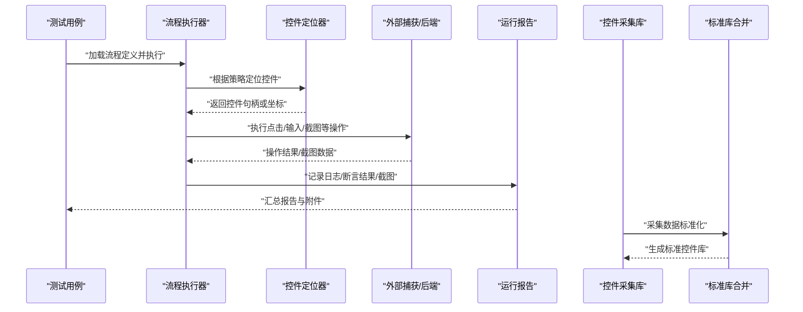
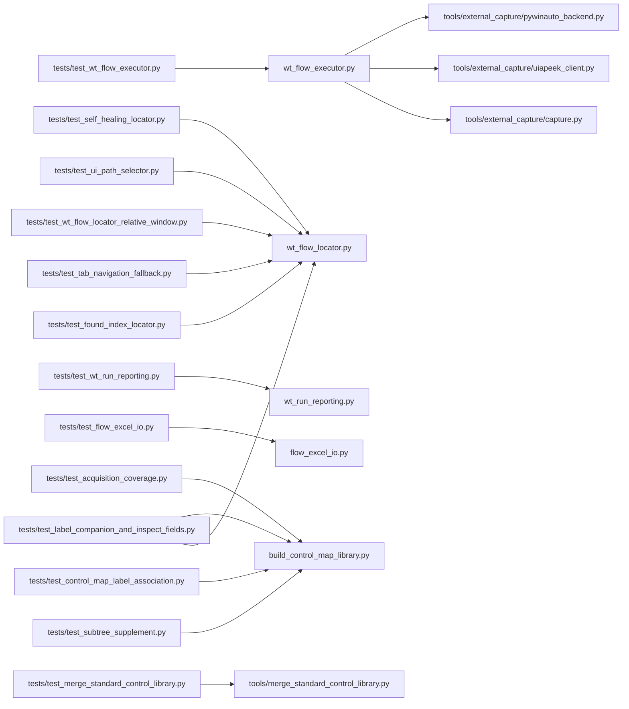

# 测试编写指南

<cite>
**本文引用的文件**   
- [README.md](file://README.md)
- [PROJECT_ARCHITECTURE.md](file://PROJECT_ARCHITECTURE.md)
- [wt_flow_executor.py](file://wt_flow_executor.py)
- [wt_flow_locator.py](file://wt_flow_locator.py)
- [wt_run_reporting.py](file://wt_run_reporting.py)
- [test_wt_flow_executor.py](file://tests/test_wt_flow_executor.py)
- [test_image_matcher_multiscale.py](file://tests/test_image_matcher_multiscale.py)
- [test_self_healing_locator.py](file://tests/test_self_healing_locator.py)
- [test_ui_path_selector.py](file://tests/test_ui_path_selector.py)
- [test_wt_action_validation.py](file://tests/test_wt_action_validation.py)
- [test_wt_flow_editor_utils.py](file://tests/test_wt_flow_editor_utils.py)
- [test_wt_flow_locator_relative_window.py](file://tests/test_wt_flow_locator_relative_window.py)
- [test_wt_run_reporting.py](file://tests/test_wt_run_reporting.py)
- [flow_excel_io.py](file://flow_excel_io.py)
- [test_flow_excel_io.py](file://tests/test_flow_excel_io.py)
- [tools/external_capture/pywinauto_backend.py](file://tools/external_capture/pywinauto_backend.py)
- [tools/external_capture/uiapeek_client.py](file://tools/external_capture/uiapeek_client.py)
- [tools/external_capture/capture.py](file://tools/external_capture/capture.py)
- [control_maps/library_主面板_WPF_controls.json](file://control_maps/library_主面板_WPF_controls.json)
- [image_templates/WT_software_Images/templates_index.json](file://image_templates/WT_software_Images/templates_index.json)
- [build_control_map_library.py](file://build_control_map_library.py)
- [tools/merge_standard_control_library.py](file://tools/merge_standard_control_library.py)
- [test_acquisition_coverage.py](file://tests/test_acquisition_coverage.py)
- [test_control_map_label_association.py](file://tests/test_control_map_label_association.py)
- [test_merge_standard_control_library.py](file://tests/test_merge_standard_control_library.py)
- [test_subtree_supplement.py](file://tests/test_subtree_supplement.py)
- [test_tab_navigation_fallback.py](file://tests/test_tab_navigation_fallback.py)
- [test_found_index_locator.py](file://tests/test_found_index_locator.py)
- [test_label_companion_and_inspect_fields.py](file://tests/test_label_companion_and_inspect_fields.py)
</cite>

## 更新摘要
**变更内容**   
- 新增7个测试套件确保可靠性，包括控件采集覆盖率测试、标签关联测试、标准库合并测试、子树补充测试、Tab导航回退测试等
- 增强了控件定位器的found_index定位能力测试
- 完善了标签伴随采集和Inspect字段补全的测试覆盖
- 扩展了标准控件库合并与去重逻辑的测试场景

## 目录
1. [简介](#简介)
2. [项目结构](#项目结构)
3. [核心组件](#核心组件)
4. [架构总览](#架构总览)
5. [详细组件分析](#详细组件分析)
6. [依赖关系分析](#依赖关系分析)
7. [性能与压力测试](#性能与压力测试)
8. [故障排查指南](#故障排查指南)
9. [结论](#结论)
10. [附录](#附录)

## 简介
本指南面向WT自动化框架的测试工程师与开发者，提供基于pytest的单元测试、UI自动化功能测试、集成测试、Mock/Stub隔离策略、性能与压力测试、测试数据与环境配置、覆盖率统计与持续集成的系统化实践。文档以仓库现有测试用例和核心模块为依据，给出可落地的步骤、模式与最佳实践，帮助团队构建稳定、可维护、可扩展的测试体系。

**更新** 新增了7个关键测试套件，涵盖控件采集覆盖率、标签关联、标准库合并、子树补充、Tab导航回退等核心功能的可靠性保障。

## 项目结构
WT自动化框架采用"流程驱动+控件定位+图像匹配+OCR"的多模态UI自动化方案。测试代码集中于tests目录，覆盖流程执行、定位器、报告生成、Excel导入导出等关键路径；外部捕获与UI后端通过tools/external_capture桥接pywinauto与UIA Peek；控制映射与图像模板分别存放于control_maps与image_templates，便于测试数据管理。

```mermaid
graph TB
subgraph "测试层"
T1["tests/test_wt_flow_executor.py"]
T2["tests/test_image_matcher_multiscale.py"]
T3["tests/test_self_healing_locator.py"]
T4["tests/test_ui_path_selector.py"]
T5["tests/test_wt_action_validation.py"]
T6["tests/test_wt_flow_editor_utils.py"]
T7["tests/test_wt_flow_locator_relative_window.py"]
T8["tests/test_wt_run_reporting.py"]
T9["tests/test_flow_excel_io.py"]
T10["tests/test_acquisition_coverage.py"]
T11["tests/test_control_map_label_association.py"]
T12["tests/test_merge_standard_control_library.py"]
T13["tests/test_subtree_supplement.py"]
T14["tests/test_tab_navigation_fallback.py"]
T15["tests/test_found_index_locator.py"]
T16["tests/test_label_companion_and_inspect_fields.py"]
end
subgraph "核心实现"
E["wt_flow_executor.py"]
L["wt_flow_locator.py"]
R["wt_run_reporting.py"]
X["flow_excel_io.py"]
B["build_control_map_library.py"]
M["tools/merge_standard_control_library.py"]
end
subgraph "外部依赖与资源"
P["tools/external_capture/pywinauto_backend.py"]
U["tools/external_capture/uiapeek_client.py"]
C["tools/external_capture/capture.py"]
CM["control_maps/*.json"]
IT["image_templates/*/templates_index.json"]
end
T1 --> E
T2 --> E
T3 --> L
T4 --> L
T5 --> E
T6 --> E
T7 --> L
T8 --> R
T9 --> X
T10 --> B
T11 --> B
T12 --> M
T13 --> B
T14 --> L
T15 --> L
T16 --> B
T16 --> L
E --> L
E --> R
E --> P
E --> U
E --> C
L --> CM
E --> IT
```

图表来源
- [wt_flow_executor.py](file://wt_flow_executor.py)
- [wt_flow_locator.py](file://wt_flow_locator.py)
- [wt_run_reporting.py](file://wt_run_reporting.py)
- [flow_excel_io.py](file://flow_excel_io.py)
- [build_control_map_library.py](file://build_control_map_library.py)
- [tools/merge_standard_control_library.py](file://tools/merge_standard_control_library.py)
- [tools/external_capture/pywinauto_backend.py](file://tools/external_capture/pywinauto_backend.py)
- [tools/external_capture/uiapeek_client.py](file://tools/external_capture/uiapeek_client.py)
- [tools/external_capture/capture.py](file://tools/external_capture/capture.py)
- [control_maps/library_主面板_WPF_controls.json](file://control_maps/library_主面板_WPF_controls.json)
- [image_templates/WT_software_Images/templates_index.json](file://image_templates/WT_software_Images/templates_index.json)

章节来源
- [README.md](file://README.md)
- [PROJECT_ARCHITECTURE.md](file://PROJECT_ARCHITECTURE.md)

## 核心组件
- 流程执行器：负责解析并执行流程定义，协调定位器、动作执行与结果上报。
- 控件定位器：支持相对窗口、层级路径、索引等多策略定位，配合自修复机制提升鲁棒性。
- 运行报告：收集执行日志、截图、断言结果，输出结构化报告。
- Excel I/O：读写流程相关的数据表，支撑数据驱动的测试与流程参数化。
- 外部捕获与UI后端：封装pywinauto与UIA Peek，提供窗口枚举、元素获取、截图能力。
- 控件采集库：处理WPF控件树的采集、规范化、标签关联与质量控制。
- 标准库合并：整合多期采集数据，生成标准化的控件目录与树形结构。

**更新** 新增了控件采集库和标准库合并两个核心组件，为UI自动化提供更稳定的控件识别基础。

章节来源
- [wt_flow_executor.py](file://wt_flow_executor.py)
- [wt_flow_locator.py](file://wt_flow_locator.py)
- [wt_run_reporting.py](file://wt_run_reporting.py)
- [flow_excel_io.py](file://flow_excel_io.py)
- [build_control_map_library.py](file://build_control_map_library.py)
- [tools/merge_standard_control_library.py](file://tools/merge_standard_control_library.py)
- [tools/external_capture/pywinauto_backend.py](file://tools/external_capture/pywinauto_backend.py)
- [tools/external_capture/uiapeek_client.py](file://tools/external_capture/uiapeek_client.py)
- [tools/external_capture/capture.py](file://tools/external_capture/capture.py)

## 架构总览
下图展示从测试到执行的核心调用链与数据流，包括流程执行、定位、截图与报告生成的交互。

图表来源
- [wt_flow_executor.py](file://wt_flow_executor.py)
- [wt_flow_locator.py](file://wt_flow_locator.py)
- [build_control_map_library.py](file://build_control_map_library.py)
- [tools/merge_standard_control_library.py](file://tools/merge_standard_control_library.py)
- [tools/external_capture/capture.py](file://tools/external_capture/capture.py)
- [wt_run_reporting.py](file://wt_run_reporting.py)

## 详细组件分析

### 单元测试：流程执行器（pytest）
- 目标：验证流程解析、动作调度、异常分支与报告写入。
- 建议模式：
  - 使用fixture构造最小化的流程定义与模拟后端。
  - 针对定位失败、超时、权限不足等边界条件设计用例。
  - 断言报告结构与字段完整性。
- 参考用例：
  - [tests/test_wt_flow_executor.py](file://tests/test_wt_flow_executor.py)

章节来源
- [tests/test_wt_flow_executor.py](file://tests/test_wt_flow_executor.py)
- [wt_flow_executor.py](file://wt_flow_executor.py)

### 单元测试：图像匹配多尺度
- 目标：验证不同缩放比例下的模板匹配稳定性与阈值策略。
- 建议模式：
  - 准备多分辨率模板与目标图，覆盖模糊、遮挡、光照变化场景。
  - 断言匹配得分、位置误差与回退策略。
- 参考用例：
  - [tests/test_image_matcher_multiscale.py](file://tests/test_image_matcher_multiscale.py)

章节来源
- [tests/test_image_matcher_multiscale.py](file://tests/test_image_matcher_multiscale.py)

### 单元测试：自修复定位器
- 目标：验证在控件属性漂移时的自动重试与替代策略。
- 建议模式：
  - 注入控件属性变更事件，观察定位器是否切换至备选规则。
  - 断言最终定位成功次数与耗时分布。
- 参考用例：
  - [tests/test_self_healing_locator.py](file://tests/test_self_healing_locator.py)

章节来源
- [tests/test_self_healing_locator.py](file://tests/test_self_healing_locator.py)
- [wt_flow_locator.py](file://wt_flow_locator.py)

### 单元测试：UI路径选择器
- 目标：验证UI路径解析、层级过滤与索引选择的正确性。
- 建议模式：
  - 构造典型树形结构，断言路径解析结果与命中控件。
- 参考用例：
  - [tests/test_ui_path_selector.py](file://tests/test_ui_path_selector.py)

章节来源
- [tests/test_ui_path_selector.py](file://tests/test_ui_path_selector.py)
- [wt_flow_locator.py](file://wt_flow_locator.py)

### 单元测试：动作校验
- 目标：验证动作参数合法性、默认值填充与约束检查。
- 建议模式：
  - 覆盖缺失必填项、类型错误、越界值等场景。
- 参考用例：
  - [tests/test_wt_action_validation.py](file://tests/test_wt_action_validation.py)

章节来源
- [tests/test_wt_action_validation.py](file://tests/test_wt_action_validation.py)
- [wt_flow_executor.py](file://wt_flow_executor.py)

### 单元测试：流程编辑器工具
- 目标：验证流程编辑辅助函数的正确性与健壮性。
- 建议模式：
  - 对转换、合并、校验等工具函数进行白盒断言。
- 参考用例：
  - [tests/test_wt_flow_editor_utils.py](file://tests/test_wt_flow_editor_utils.py)

章节来源
- [tests/test_wt_flow_editor_utils.py](file://tests/test_wt_flow_editor_utils.py)

### 单元测试：相对窗口定位
- 目标：验证相对窗口的偏移计算与跨窗口定位准确性。
- 建议模式：
  - 构造父子窗口关系，断言相对坐标换算结果。
- 参考用例：
  - [tests/test_wt_flow_locator_relative_window.py](file://tests/test_wt_flow_locator_relative_window.py)

章节来源
- [tests/test_wt_flow_locator_relative_window.py](file://tests/test_wt_flow_locator_relative_window.py)
- [wt_flow_locator.py](file://wt_flow_locator.py)

### 单元测试：运行报告
- 目标：验证报告数据结构、附件写入与序列化格式。
- 建议模式：
  - 断言关键字段存在性、时间戳格式、截图路径有效性。
- 参考用例：
  - [tests/test_wt_run_reporting.py](file://tests/test_wt_run_reporting.py)

章节来源
- [tests/test_wt_run_reporting.py](file://tests/test_wt_run_reporting.py)
- [wt_run_reporting.py](file://wt_run_reporting.py)

### 单元测试：Excel I/O
- 目标：验证流程数据的读取、写入与类型转换。
- 建议模式：
  - 覆盖空表、重复列、数据类型不一致等异常路径。
- 参考用例：
  - [tests/test_flow_excel_io.py](file://tests/test_flow_excel_io.py)

章节来源
- [tests/test_flow_excel_io.py](file://tests/test_flow_excel_io.py)
- [flow_excel_io.py](file://flow_excel_io.py)

### 新增测试套件：控件采集覆盖率测试
- 目标：验证控件采集过程中的Pattern感知、噪声过滤、容器剪枝等核心逻辑。
- 关键场景：
  - 可交互Pattern保留：无标识但可交互的容器不得被误过滤
  - WPF输入框规范化：className子串扩展与Value/Text Pattern判定
  - UIA LabeledBy权威标签关联优先于几何最近邻
  - controlDefinition持久化标签关联与交互元数据
- 参考用例：
  - [tests/test_acquisition_coverage.py](file://tests/test_acquisition_coverage.py)

章节来源
- [tests/test_acquisition_coverage.py](file://tests/test_acquisition_coverage.py)
- [build_control_map_library.py](file://build_control_map_library.py)

### 新增测试套件：标签关联测试
- 目标：验证区域标签与控件的几何关联、下拉选项采集、重复定位器消歧等功能。
- 关键场景：
  - 同行标签关联与垂直标签关联
  - 下拉框选项展开与按锚点位置采集
  - 重复PART_DropDownButton的定位消歧
  - RawViewWalker BFS遍历器与树重建
- 参考用例：
  - [tests/test_control_map_label_association.py](file://tests/test_control_map_label_association.py)

章节来源
- [tests/test_control_map_label_association.py](file://tests/test_control_map_label_association.py)
- [build_control_map_library.py](file://build_control_map_library.py)

### 新增测试套件：标准库合并测试
- 目标：验证多期采集数据的合并、去重、权威度提升与树重建逻辑。
- 关键场景：
  - 同automation_id多实例不塌缩
  - 跨期数据合并与新鲜度保持
  - 增强字段保留与不覆盖原则
  - controlsTree按uiPath重建
  - 派生master文件的字段完整性
- 参考用例：
  - [tests/test_merge_standard_control_library.py](file://tests/test_merge_standard_control_library.py)

章节来源
- [tests/test_merge_standard_control_library.py](file://tests/test_merge_standard_control_library.py)
- [tools/merge_standard_control_library.py](file://tools/merge_standard_control_library.py)

### 新增测试套件：子树补充测试
- 目标：验证悬停补采的子树合并、路径前缀、身份匹配与树节点保留逻辑。
- 关键场景：
  - 子树路径前缀与深度偏移
  - runtimeId与签名匹配优先级
  - 浅补采不丢弃深层旧节点
  - 锚点缺失时追加到树根
  - 合并幂等性与扫描元数据更新
- 参考用例：
  - [tests/test_subtree_supplement.py](file://tests/test_subtree_supplement.py)

章节来源
- [tests/test_subtree_supplement.py](file://tests/test_subtree_supplement.py)
- [build_control_map_library.py](file://build_control_map_library.py)

### 新增测试套件：Tab导航回退测试
- 目标：验证Tab键导航降级功能的配置处理、锚点定位、方向支持与递归保护。
- 关键场景：
  - 配置缺失与空字典处理
  - 锚点控件定位失败
  - forward/backward方向支持
  - 焦点元素评分阈值与最佳候选返回
  - 递归保护与状态清理
- 参考用例：
  - [tests/test_tab_navigation_fallback.py](file://tests/test_tab_navigation_fallback.py)

章节来源
- [tests/test_tab_navigation_fallback.py](file://tests/test_tab_navigation_fallback.py)
- [wt_flow_locator.py](file://wt_flow_locator.py)

### 新增测试套件：found_index定位测试
- 目标：验证父链引导的found_index定位、同级序号匹配与录制序号保留。
- 关键场景：
  - 运行时同级序号计算与匹配
  - 并列消歧加分与打分机制
  - 录制转换器中的序号提取与保留
  - automationId失效时的序号回退策略
- 参考用例：
  - [tests/test_found_index_locator.py](file://tests/test_found_index_locator.py)

章节来源
- [tests/test_found_index_locator.py](file://tests/test_found_index_locator.py)
- [wt_flow_locator.py](file://wt_flow_locator.py)
- [flow_recorder_converter.py](file://flow_recorder_converter.py)

### 新增测试套件：标签伴随与Inspect字段测试
- 目标：验证标签伴随采集、MSAA字段解码、label_text定位与Inspect字段补全。
- 关键场景：
  - MSAA Role/State解码与组合位处理
  - 伴随输入判定与几何匹配
  - 第三轮宽松关联与阻挡检测
  - label_rect几何匹配与LabeledBy权威
  - wrapper_matches_locator的label_text方法
- 参考用例：
  - [tests/test_label_companion_and_inspect_fields.py](file://tests/test_label_companion_and_inspect_fields.py)

章节来源
- [tests/test_label_companion_and_inspect_fields.py](file://tests/test_label_companion_and_inspect_fields.py)
- [build_control_map_library.py](file://build_control_map_library.py)
- [wt_flow_locator.py](file://wt_flow_locator.py)

### 集成测试：完整业务流程
- 目标：端到端验证"打开应用→定位控件→执行动作→生成报告"的闭环。
- 建议模式：
  - 使用真实或轻量级被测应用实例，结合外部捕获后端。
  - 通过夹具启动/停止被测进程，清理临时文件与截图。
  - 断言关键界面状态与报告完整性。
- 参考后端：
  - [tools/external_capture/pywinauto_backend.py](file://tools/external_capture/pywinauto_backend.py)
  - [tools/external_capture/uiapeek_client.py](file://tools/external_capture/uiapeek_client.py)
  - [tools/external_capture/capture.py](file://tools/external_capture/capture.py)

章节来源
- [tools/external_capture/pywinauto_backend.py](file://tools/external_capture/pywinauto_backend.py)
- [tools/external_capture/uiapeek_client.py](file://tools/external_capture/uiapeek_client.py)
- [tools/external_capture/capture.py](file://tools/external_capture/capture.py)

### Mock与Stub：隔离外部依赖
- 适用场景：
  - 模拟UI后端（pywinauto/UIA Peek）返回固定元素树与截图。
  - 模拟文件系统I/O（Excel读写、报告附件）。
  - 模拟网络请求（若后续扩展云端能力）。
- 建议模式：
  - 使用unittest.mock或pytest-mock替换底层方法，避免真实UI交互。
  - 为定位器注入"可控元素"，为执行器注入"确定性行为"。
- 参考点：
  - 在执行器中替换定位器与后端接口，集中管理Mock对象生命周期。

章节来源
- [wt_flow_executor.py](file://wt_flow_executor.py)
- [wt_flow_locator.py](file://wt_flow_locator.py)
- [tools/external_capture/pywinauto_backend.py](file://tools/external_capture/pywinauto_backend.py)
- [tools/external_capture/uiapeek_client.py](file://tools/external_capture/uiapeek_client.py)

### 性能与压力测试
- 指标建议：
  - 单次流程执行耗时、P95/P99分位、CPU/内存峰值。
  - 图像匹配在不同分辨率下的耗时与成功率。
  - 定位器重试次数与平均等待时间。
- 方法建议：
  - 使用pytest-benchmark或自定义计时装饰器采集基准。
  - 批量执行N次流程，统计吞吐与稳定性。
  - 引入负载注入（并发执行多个流程），评估资源竞争与死锁风险。
- 注意：
  - 隔离UI抖动因素，优先在离线模式下对算法与I/O进行压测。
  - 将热点路径（如多尺度匹配、OCR识别）单独压测。

[本节为通用指导，不直接分析具体文件]

### 测试数据管理与环境配置
- 数据管理：
  - 控制映射：control_maps下按窗口/页面组织JSON，便于回归与对比。
  - 图像模板：image_templates下按功能域组织模板与索引，确保版本一致。
- 环境配置：
  - 通过环境变量或配置文件指定后端类型、超时、阈值、截图路径。
  - 为CI与本地开发提供两套配置，避免硬编码。
- 参考资源：
  - [control_maps/library_主面板_WPF_controls.json](file://control_maps/library_主面板_WPF_controls.json)
  - [image_templates/WT_software_Images/templates_index.json](file://image_templates/WT_software_Images/templates_index.json)

章节来源
- [control_maps/library_主面板_WPF_controls.json](file://control_maps/library_主面板_WPF_controls.json)
- [image_templates/WT_software_Images/templates_index.json](file://image_templates/WT_software_Images/templates_index.json)

### 测试覆盖率统计
- 推荐工具：pytest-cov
- 建议指标：
  - 行覆盖率≥80%，分支覆盖率≥70%（可按模块逐步提升）。
  - 对关键路径（执行器、定位器、报告、控件采集、标准库合并）提高覆盖率要求。
- 命令示例（概念性）：
  - 生成HTML报告：pytest --cov=wt_flow_executor --cov=wt_flow_locator --cov-report=html
  - 设置阈值：pytest --cov=... --cov-fail-under=80

[本节为通用指导，不直接分析具体文件]

### 持续集成配置
- 建议阶段：
  - 安装依赖→静态检查→单元测试→覆盖率→可选集成测试（带隔离UI）。
- 触发策略：
  - 每次提交与PR触发；定期任务执行全量回归。
- 产物归档：
  - 报告HTML、截图、日志打包上传，便于回溯。
- 参考工作流：
  - .github/workflows/deploy-website.yml（可作为CI模板参考）

章节来源
- [.github/workflows/deploy-website.yml](file://deploy-website.yml)

## 依赖关系分析
下图展示测试与核心模块之间的依赖关系，突出测试对执行器、定位器、报告、控件采集与标准库合并的耦合点。

图表来源
- [tests/test_wt_flow_executor.py](file://tests/test_wt_flow_executor.py)
- [wt_flow_executor.py](file://wt_flow_executor.py)
- [tests/test_self_healing_locator.py](file://tests/test_self_healing_locator.py)
- [tests/test_ui_path_selector.py](file://tests/test_ui_path_selector.py)
- [tests/test_wt_flow_locator_relative_window.py](file://tests/test_wt_flow_locator_relative_window.py)
- [wt_flow_locator.py](file://wt_flow_locator.py)
- [tests/test_wt_run_reporting.py](file://tests/test_wt_run_reporting.py)
- [wt_run_reporting.py](file://wt_run_reporting.py)
- [tests/test_flow_excel_io.py](file://tests/test_flow_excel_io.py)
- [flow_excel_io.py](file://flow_excel_io.py)
- [tests/test_acquisition_coverage.py](file://tests/test_acquisition_coverage.py)
- [tests/test_control_map_label_association.py](file://tests/test_control_map_label_association.py)
- [tests/test_merge_standard_control_library.py](file://tests/test_merge_standard_control_library.py)
- [tests/test_subtree_supplement.py](file://tests/test_subtree_supplement.py)
- [tests/test_tab_navigation_fallback.py](file://tests/test_tab_navigation_fallback.py)
- [tests/test_found_index_locator.py](file://tests/test_found_index_locator.py)
- [tests/test_label_companion_and_inspect_fields.py](file://tests/test_label_companion_and_inspect_fields.py)
- [build_control_map_library.py](file://build_control_map_library.py)
- [tools/merge_standard_control_library.py](file://tools/merge_standard_control_library.py)
- [tools/external_capture/pywinauto_backend.py](file://tools/external_capture/pywinauto_backend.py)
- [tools/external_capture/uiapeek_client.py](file://tools/external_capture/uiapeek_client.py)
- [tools/external_capture/capture.py](file://tools/external_capture/capture.py)

## 性能与压力测试
- 基准测试：
  - 对图像匹配、OCR识别、定位器重试等热点路径建立基准用例。
  - 使用固定数据集，比较不同阈值与缩放策略的性能差异。
- 压力测试：
  - 并发执行多条流程，观察线程安全与资源释放。
  - 监控磁盘IO与内存增长，防止泄漏。
- 稳定性：
  - 长时间运行（soak test）检测偶发失败与资源竞争。
- 结果解读：
  - 关注退化趋势与回归阈值，设置告警。

[本节为通用指导，不直接分析具体文件]

## 故障排查指南
- 常见问题：
  - 定位失败：检查控件映射、相对窗口偏移、UIA/Win32后端一致性。
  - 图像匹配不稳定：调整阈值、增加多尺度、补充模板库。
  - OCR误识：优化预处理、更换语言包、裁剪ROI。
  - 报告缺失：确认附件路径权限、序列化格式与大小限制。
  - 控件采集问题：检查Pattern支持、标签关联逻辑、WPF控件规范化。
  - 标准库合并异常：验证去重规则、权威度判断、字段保留策略。
- 诊断手段：
  - 启用详细日志与截图，定位失败帧。
  - 使用最小复现流程与隔离Mock，快速收敛问题。
  - 利用新增的测试套件验证特定功能的正确性。
- 参考实现：
  - 执行器中的异常处理与上报逻辑。
  - 定位器的自修复与回退策略。
  - 控件采集库的Pattern感知与标签关联逻辑。
  - 标准库合并的去重与权威度提升机制。

章节来源
- [wt_flow_executor.py](file://wt_flow_executor.py)
- [wt_flow_locator.py](file://wt_flow_locator.py)
- [wt_run_reporting.py](file://wt_run_reporting.py)
- [build_control_map_library.py](file://build_control_map_library.py)
- [tools/merge_standard_control_library.py](file://tools/merge_standard_control_library.py)

## 结论
通过分层测试（单元、集成、性能）、严格的Mock隔离、完善的数据与环境管理，以及覆盖率与CI保障，WT自动化框架的测试体系可实现高可靠与高可维护。新增的7个测试套件显著增强了控件采集、标签关联、标准库合并、子树补充、Tab导航等核心功能的可靠性保障。建议持续沉淀模板与映射库，优化热点路径性能，并将关键指标纳入质量门禁。

**更新** 新增的测试套件覆盖了控件采集覆盖率、标签关联、标准库合并、子树补充、Tab导航回退、found_index定位、标签伴随采集等关键功能，为UI自动化提供了更坚实的测试基础。

## 附录
- pytest常用插件：pytest-cov、pytest-benchmark、pytest-mock
- 外部依赖：pywinauto、UIA Peek客户端
- 资源目录：control_maps、image_templates
- 新增测试套件：控件采集覆盖率、标签关联、标准库合并、子树补充、Tab导航回退、found_index定位、标签伴随采集

[本节为通用指导，不直接分析具体文件]