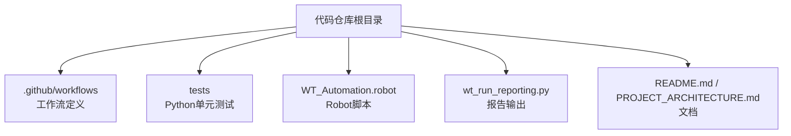
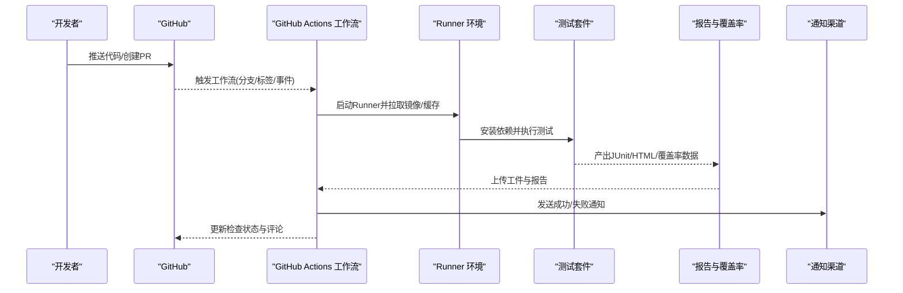
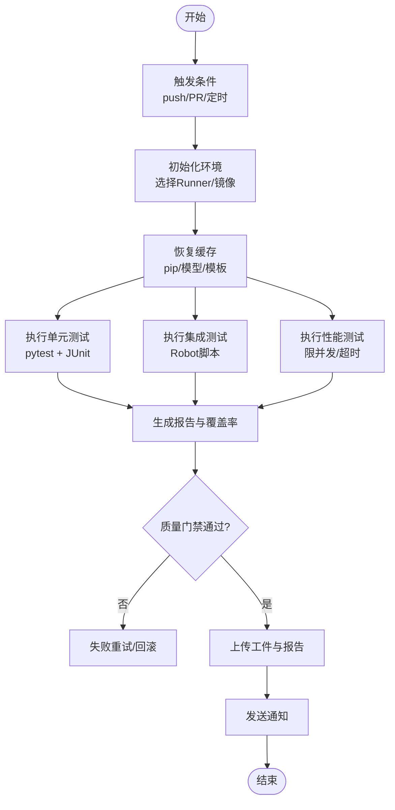
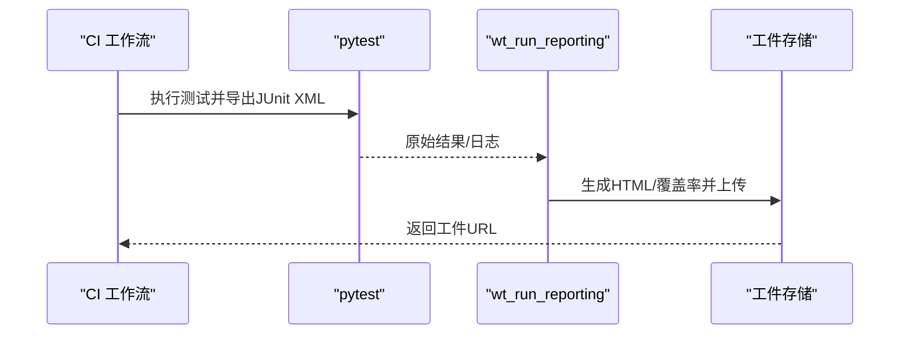
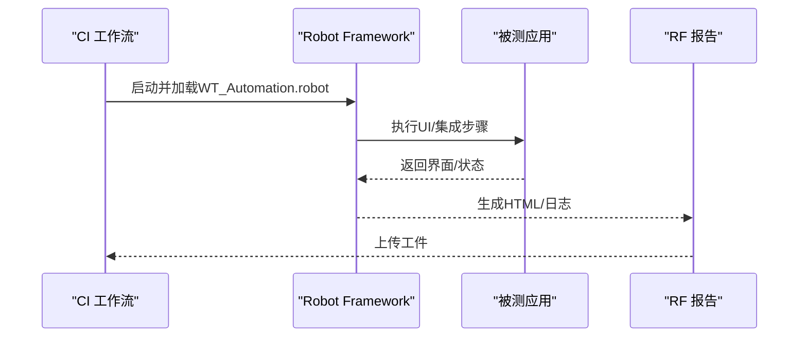
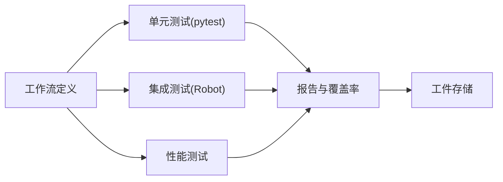

# 测试自动化与持续集成

<cite>
**本文引用的文件**   
- [README.md](file://README.md)
- [PROJECT_ARCHITECTURE.md](file://PROJECT_ARCHITECTURE.md)
- [.github/workflows/deploy-website.yml](file://.github/workflows/deploy-website.yml)
- [tests/test_wt_flow_executor.py](file://tests/test_wt_flow_executor.py)
- [tests/test_wt_run_reporting.py](file://tests/test_wt_run_reporting.py)
- [wt_run_reporting.py](file://wt_run_reporting.py)
- [WT_Automation.robot](file://WT_Automation.robot)
</cite>

## 目录
1. [简介](#简介)
2. [项目结构](#项目结构)
3. [核心组件](#核心组件)
4. [架构总览](#架构总览)
5. [详细组件分析](#详细组件分析)
6. [依赖关系分析](#依赖关系分析)
7. [性能考虑](#性能考虑)
8. [故障排查指南](#故障排查指南)
9. [结论](#结论)
10. [附录](#附录)

## 简介
本指南面向WT自动化框架的测试与持续集成实践，目标是帮助团队在GitHub Actions中搭建稳定、高效、可观测的CI流水线。内容覆盖：
- 触发条件与并行策略
- 单元测试、集成测试、性能测试的编排
- 测试结果收集、报告生成与质量门禁
- 失败自动诊断与重试机制
- 依赖管理与构建缓存优化
- 容器化环境与动态资源分配
- 成本优化与并行化策略

## 项目结构
仓库包含以下与测试和CI相关的关键位置：
- .github/workflows：GitHub Actions工作流定义（当前存在网站部署工作流）
- tests：Python单元测试用例集合
- WT_Automation.robot：Robot Framework脚本（可用于UI/集成类场景）
- wt_run_reporting.py：运行结果与报告输出模块
- README.md、PROJECT_ARCHITECTURE.md：项目说明与架构概览

**图表来源** 
- [.github/workflows/deploy-website.yml](file://.github/workflows/deploy-website.yml)
- [tests/test_wt_flow_executor.py](file://tests/test_wt_flow_executor.py)
- [tests/test_wt_run_reporting.py](file://tests/test_wt_run_reporting.py)
- [wt_run_reporting.py](file://wt_run_reporting.py)
- [WT_Automation.robot](file://WT_Automation.robot)
- [README.md](file://README.md)
- [PROJECT_ARCHITECTURE.md](file://PROJECT_ARCHITECTURE.md)

**章节来源**
- [README.md](file://README.md)
- [PROJECT_ARCHITECTURE.md](file://PROJECT_ARCHITECTURE.md)

## 核心组件
- GitHub Actions工作流：用于触发、编排、执行测试任务并产出工件与报告
- Python测试套件：位于tests目录，使用pytest或类似框架组织
- Robot Framework脚本：WT_Automation.robot，适合端到端/UI集成验证
- 报告模块：wt_run_reporting.py，负责汇总运行结果与生成报告

**章节来源**
- [.github/workflows/deploy-website.yml](file://.github/workflows/deploy-website.yml)
- [tests/test_wt_flow_executor.py](file://tests/test_wt_flow_executor.py)
- [tests/test_wt_run_reporting.py](file://tests/test_wt_run_reporting.py)
- [wt_run_reporting.py](file://wt_run_reporting.py)
- [WT_Automation.robot](file://WT_Automation.robot)

## 架构总览
下图展示从代码提交到测试执行、报告归档与通知的整体流程。

[此图为概念性流程图，不直接映射具体源码文件]

## 详细组件分析

### GitHub Actions工作流设计
目标：
- 基于分支与PR事件触发
- 并行执行多套测试（单元、集成、性能）
- 缓存依赖与中间产物
- 收集并上传报告与覆盖率
- 设置质量门禁与失败重试
- 发送通知

建议的工作流要点（以“示例”方式描述，便于落地）：
- 触发条件
  - push至main/release分支
  - 所有PR与合并请求
  - 定时任务（如每日回归）
- 矩阵并行
  - 按操作系统（Windows/macOS/Linux）
  - 按Python版本
  - 按测试类型（unit/integration/perf）
- 缓存
  - pip包缓存
  - 浏览器/驱动缓存（若涉及）
  - 自定义模型/模板缓存（image_templates/control_maps等）
- 测试执行
  - 单元测试：pytest + JUnit XML
  - 集成测试：Robot Framework脚本
  - 性能测试：独立作业，限制并发与超时
- 报告与覆盖率
  - 生成HTML报告与覆盖率（如coverage）
  - 上传为工件，必要时发布到制品库
- 质量门禁
  - 覆盖率阈值检查
  - 静态检查/安全扫描（可选）
- 失败重试
  - 对不稳定步骤启用自动重试
- 通知
  - 通过Webhook/邮件/IM工具通知

[此图为概念性流程图，不直接映射具体源码文件]

**章节来源**
- [.github/workflows/deploy-website.yml](file://.github/workflows/deploy-website.yml)

### 单元测试与报告集成
- 测试组织：tests目录下按功能划分用例
- 执行命令：建议使用pytest，开启JUnit XML输出以便CI聚合
- 报告与覆盖率：结合coverage生成HTML与XML，上传工件
- 关键模块：wt_run_reporting.py提供运行结果与报告输出能力，可在测试后调用以统一格式归档

**图表来源** 
- [tests/test_wt_flow_executor.py](file://tests/test_wt_flow_executor.py)
- [tests/test_wt_run_reporting.py](file://tests/test_wt_run_reporting.py)
- [wt_run_reporting.py](file://wt_run_reporting.py)

**章节来源**
- [tests/test_wt_flow_executor.py](file://tests/test_wt_flow_executor.py)
- [tests/test_wt_run_reporting.py](file://tests/test_wt_run_reporting.py)
- [wt_run_reporting.py](file://wt_run_reporting.py)

### 集成测试（Robot Framework）
- 入口脚本：WT_Automation.robot
- 适用场景：UI交互、端到端流程、跨系统联动
- 执行建议：在CI中单独作为集成测试作业，配置超时与重试；必要时使用虚拟显示或专用Runner

**图表来源** 
- [WT_Automation.robot](file://WT_Automation.robot)

**章节来源**
- [WT_Automation.robot](file://WT_Automation.robot)

### 性能测试与稳定性
- 独立作业：避免阻塞主流程
- 资源限制：CPU/内存/时间上限
- 指标采集：吞吐、延迟、错误率
- 基线对比：与历史结果比较，设置告警阈值

[本节为通用指导，不直接分析具体文件]

## 依赖关系分析
- 工作流与测试：工作流负责调度与缓存，测试套件负责实际执行与产出
- 报告与工件：测试执行后由报告模块统一处理并上传
- 外部依赖：Python包、浏览器/驱动、图像识别库、OCR引擎等

[此图为概念性依赖图，不直接映射具体源码文件]

**章节来源**
- [.github/workflows/deploy-website.yml](file://.github/workflows/deploy-website.yml)
- [tests/test_wt_flow_executor.py](file://tests/test_wt_flow_executor.py)
- [tests/test_wt_run_reporting.py](file://tests/test_wt_run_reporting.py)
- [wt_run_reporting.py](file://wt_run_reporting.py)
- [WT_Automation.robot](file://WT_Automation.robot)

## 性能考虑
- 并行化策略
  - 矩阵并行：按平台/语言版本/测试类型拆分
  - 分片执行：将大套件拆分为多个子集并行
- 缓存优化
  - pip缓存、wheel缓存
  - 第三方模型/模板缓存（image_templates、control_maps）
  - 浏览器/驱动缓存
- 资源隔离
  - 不同测试类型使用不同Runner规格
  - 性能测试独占高配Runner
- 增量执行
  - 仅运行变更相关的测试（需配合路径过滤）

[本节为通用指导，不直接分析具体文件]

## 故障排查指南
- 常见问题定位
  - 查看JUnit XML与HTML报告中的失败堆栈
  - 检查覆盖率未达标的用例分布
  - 确认缓存命中情况与依赖安装耗时
- 自动诊断与重试
  - 对易失败的UI/网络步骤启用自动重试
  - 失败时自动抓取截图/录屏（若支持）
- 质量门禁
  - 覆盖率阈值、静态检查、安全扫描
  - 失败阻断合并，成功则放行

**章节来源**
- [tests/test_wt_run_reporting.py](file://tests/test_wt_run_reporting.py)
- [wt_run_reporting.py](file://wt_run_reporting.py)

## 结论
通过在GitHub Actions中系统化地编排测试、缓存与报告，WT自动化框架可实现快速反馈、稳定交付与可观测的质量保障。建议逐步落地：先完成单元测试与报告，再扩展集成与性能测试，最后完善质量门禁与通知体系。

[本节为总结性内容，不直接分析具体文件]

## 附录
- 术语
  - 工件：CI产出的报告、覆盖率、日志等文件
  - 质量门禁：阻止不符合质量阈值的变更合并
- 参考
  - 项目说明与架构概览见README与架构文档

**章节来源**
- [README.md](file://README.md)
- [PROJECT_ARCHITECTURE.md](file://PROJECT_ARCHITECTURE.md)