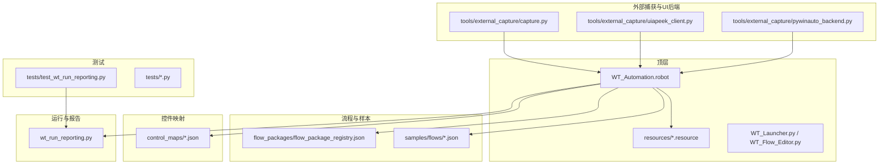
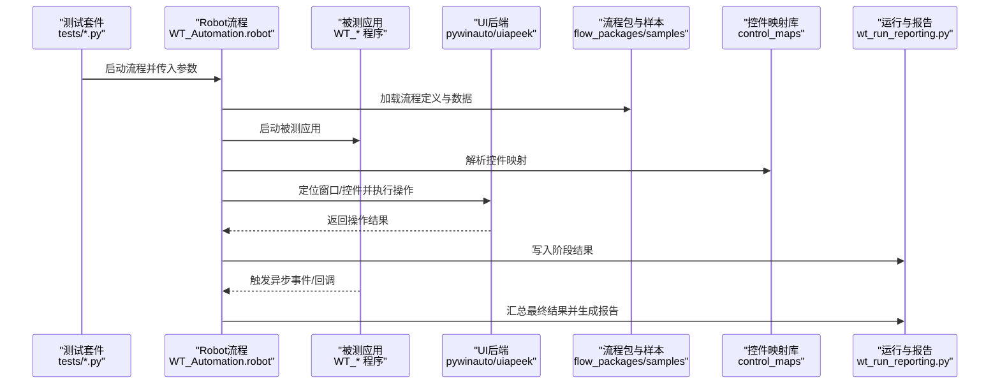
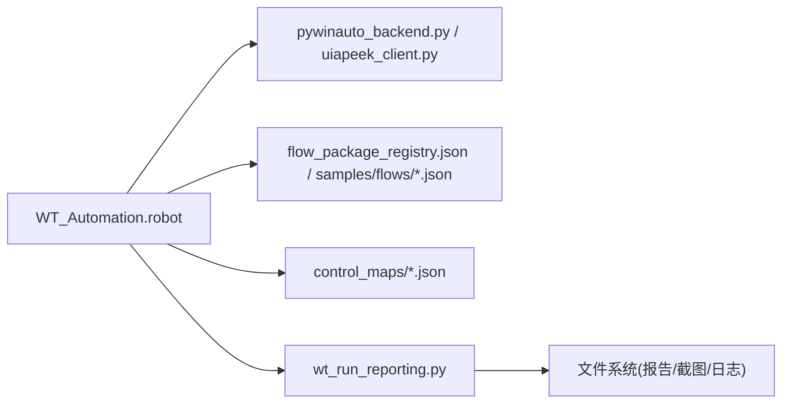

# 集成测试编写

<cite>
**本文引用的文件**   
- [README.md](file://README.md)
- [PROJECT_ARCHITECTURE.md](file://PROJECT_ARCHITECTURE.md)
- [WT_Automation.robot](file://WT_Automation.robot)
- [resources/project_config.resource](file://resources/project_config.resource)
- [resources/dispatch_keywords.resource](file://resources/dispatch_keywords.resource)
- [tests/test_wt_run_reporting.py](file://tests/test_wt_run_reporting.py)
- [wt_run_reporting.py](file://wt_run_reporting.py)
- [tools/external_capture/pywinauto_backend.py](file://tools/external_capture/pywinauto_backend.py)
- [tools/external_capture/uiapeek_client.py](file://tools/external_capture/uiapeek_client.py)
- [tools/external_capture/capture.py](file://tools/external_capture/capture.py)
- [flow_packages/flow_package_registry.json](file://flow_packages/flow_package_registry.json)
- [samples/flows/flow_definition_新建风机类型.json](file://samples/flows/flow_definition_新建风机类型.json)
- [samples/flows/flow_definition_gm_sample.json](file://samples/flows/flow_definition_gm_sample.json)
- [samples/flows/气象数据录入_20260625_converted_flow.json](file://samples/flows/气象数据录入_20260625_converted_flow.json)
- [control_maps/library_window_WPF_controls.json](file://control_maps/library_window_WPF_controls.json)
- [control_maps/library_主面板_WPF_controls.json](file://control_maps/library_主面板_WPF_controls.json)
- [control_maps/总控件信息.json](file://control_maps/总控件信息.json)
- [tools/dev_utils/get_mouse_position.py](file://tools/dev_utils/get_mouse_position.py)
- [tools/dev_utils/list_models.py](file://tools/dev_utils/list_models.py)
- [tools/dev_utils/test_api.py](file://tools/dev_utils/test_api.py)
</cite>

## 目录
1. [简介](#简介)
2. [项目结构](#项目结构)
3. [核心组件](#核心组件)
4. [架构总览](#架构总览)
5. [详细组件分析](#详细组件分析)
6. [依赖关系分析](#依赖关系分析)
7. [性能与稳定性考虑](#性能与稳定性考虑)
8. [故障排查指南](#故障排查指南)
9. [结论](#结论)
10. [附录](#附录)

## 简介
本指南面向WT自动化框架的集成测试编写，目标是帮助读者快速搭建端到端（E2E）集成测试环境，覆盖完整业务流程、多窗口交互、跨进程通信、复杂UI操作、异步处理与超时控制、测试数据库与文件系统管理、报告生成与失败用例分析，以及Docker容器化测试环境的搭建与使用。文档基于仓库现有结构与实现进行梳理，提供可落地的步骤、最佳实践与可视化图示，便于不同技术背景的读者理解与实践。

## 项目结构
仓库采用“应用+工具+测试”的分层组织方式：
- 顶层脚本与资源：包含机器人流程定义、资源库、启动脚本等
- 测试目录 tests：存放Python单元测试与部分集成测试
- 外部捕获与UI后端 tools/external_capture：封装pywinauto与UIA Peek客户端，用于跨进程UI定位与截图
- 流程包与样本 flow_packages/samples：提供标准流程定义与示例JSON，便于端到端场景构造
- 控件映射 control_maps：WPF/Win32控件索引与库，支撑稳定定位
- 运行与报告 wt_run_reporting.py：统一执行与报告输出能力
- 开发辅助 tools/dev_utils：鼠标位置、模型列表、API测试等

图表来源
- [WT_Automation.robot:1-200](file://WT_Automation.robot#L1-L200)
- [resources/project_config.resource:1-200](file://resources/project_config.resource#L1-L200)
- [resources/dispatch_keywords.resource:1-200](file://resources/dispatch_keywords.resource#L1-L200)
- [tools/external_capture/pywinauto_backend.py:1-200](file://tools/external_capture/pywinauto_backend.py#L1-L200)
- [tools/external_capture/uiapeek_client.py:1-200](file://tools/external_capture/uiapeek_client.py#L1-L200)
- [tools/external_capture/capture.py:1-200](file://tools/external_capture/capture.py#L1-L200)
- [flow_packages/flow_package_registry.json:1-200](file://flow_packages/flow_package_registry.json#L1-L200)
- [samples/flows/flow_definition_新建风机类型.json:1-200](file://samples/flows/flow_definition_新建风机类型.json#L1-L200)
- [samples/flows/flow_definition_gm_sample.json:1-200](file://samples/flows/flow_definition_gm_sample.json#L1-L200)
- [samples/flows/气象数据录入_20260625_converted_flow.json:1-200](file://samples/flows/气象数据录入_20260625_converted_flow.json#L1-L200)
- [control_maps/library_window_WPF_controls.json:1-200](file://control_maps/library_window_WPF_controls.json#L1-L200)
- [control_maps/library_主面板_WPF_controls.json:1-200](file://control_maps/library_主面板_WPF_controls.json#L1-L200)
- [control_maps/总控件信息.json:1-200](file://control_maps/总控件信息.json#L1-L200)
- [wt_run_reporting.py:1-200](file://wt_run_reporting.py#L1-L200)

章节来源
- [README.md:1-200](file://README.md#L1-L200)
- [PROJECT_ARCHITECTURE.md:1-200](file://PROJECT_ARCHITECTURE.md#L1-L200)
- [WT_Automation.robot:1-200](file://WT_Automation.robot#L1-L200)
- [resources/project_config.resource:1-200](file://resources/project_config.resource#L1-L200)
- [resources/dispatch_keywords.resource:1-200](file://resources/dispatch_keywords.resource#L1-L200)

## 核心组件
- 机器人流程入口与资源库
  - WT_Automation.robot：作为端到端流程编排入口，负责调用资源库中的关键字、驱动被测应用、执行流程并产出结果。
  - resources/*.resource：集中管理环境变量、路径、公共关键字与页面元素选择器，提升复用性与可维护性。
- UI后端与外部捕获
  - pywinauto_backend.py：封装pywinauto后端，提供窗口枚举、控件定位、点击输入等基础UI操作。
  - uiapeek_client.py：通过UIA Peek客户端获取UIA树，增强对现代UI（如WPF）的定位能力。
  - capture.py：截图与图像匹配辅助，配合模板库进行视觉验证。
- 流程包与样本
  - flow_package_registry.json：流程包注册表，集中管理可用流程包及其元数据。
  - samples/flows/*.json：典型业务流样例，可用于端到端场景构造与回归验证。
- 控件映射库
  - control_maps/*.json：WPF/Win32控件索引与库，为UI定位提供稳定的语义化描述。
- 运行与报告
  - wt_run_reporting.py：统一执行入口与报告生成逻辑，支持将测试结果持久化与汇总。
- 开发辅助
  - tools/dev_utils/*：鼠标位置、模型列表、API测试等工具，辅助调试与定位问题。

章节来源
- [WT_Automation.robot:1-200](file://WT_Automation.robot#L1-L200)
- [resources/project_config.resource:1-200](file://resources/project_config.resource#L1-L200)
- [resources/dispatch_keywords.resource:1-200](file://resources/dispatch_keywords.resource#L1-L200)
- [tools/external_capture/pywinauto_backend.py:1-200](file://tools/external_capture/pywinauto_backend.py#L1-L200)
- [tools/external_capture/uiapeek_client.py:1-200](file://tools/external_capture/uiapeek_client.py#L1-L200)
- [tools/external_capture/capture.py:1-200](file://tools/external_capture/capture.py#L1-L200)
- [flow_packages/flow_package_registry.json:1-200](file://flow_packages/flow_package_registry.json#L1-L200)
- [samples/flows/flow_definition_新建风机类型.json:1-200](file://samples/flows/flow_definition_新建风机类型.json#L1-L200)
- [samples/flows/flow_definition_gm_sample.json:1-200](file://samples/flows/flow_definition_gm_sample.json#L1-L200)
- [samples/flows/气象数据录入_20260625_converted_flow.json:1-200](file://samples/flows/气象数据录入_20260625_converted_flow.json#L1-L200)
- [control_maps/library_window_WPF_controls.json:1-200](file://control_maps/library_window_WPF_controls.json#L1-L200)
- [control_maps/library_主面板_WPF_controls.json:1-200](file://control_maps/library_主面板_WPF_controls.json#L1-L200)
- [control_maps/总控件信息.json:1-200](file://control_maps/总控件信息.json#L1-L200)
- [wt_run_reporting.py:1-200](file://wt_run_reporting.py#L1-L200)
- [tools/dev_utils/get_mouse_position.py:1-200](file://tools/dev_utils/get_mouse_position.py#L1-L200)
- [tools/dev_utils/list_models.py:1-200](file://tools/dev_utils/list_models.py#L1-L200)
- [tools/dev_utils/test_api.py:1-200](file://tools/dev_utils/test_api.py#L1-L200)

## 架构总览
下图展示端到端集成测试的整体架构：Robot流程驱动被测应用，借助UI后端完成窗口与控件操作；流程包与样本提供业务数据；控件映射库保障定位稳定性；运行与报告模块统一收集结果并生成报告。

图表来源
- [WT_Automation.robot:1-200](file://WT_Automation.robot#L1-L200)
- [tools/external_capture/pywinauto_backend.py:1-200](file://tools/external_capture/pywinauto_backend.py#L1-L200)
- [tools/external_capture/uiapeek_client.py:1-200](file://tools/external_capture/uiapeek_client.py#L1-L200)
- [flow_packages/flow_package_registry.json:1-200](file://flow_packages/flow_package_registry.json#L1-L200)
- [samples/flows/flow_definition_新建风机类型.json:1-200](file://samples/flows/flow_definition_新建风机类型.json#L1-L200)
- [control_maps/library_window_WPF_controls.json:1-200](file://control_maps/library_window_WPF_controls.json#L1-L200)
- [wt_run_reporting.py:1-200](file://wt_run_reporting.py#L1-L200)

## 详细组件分析

### 组件A：端到端流程编排与资源库
- 职责
  - 编排业务流程：从应用启动、数据准备、UI操作到结果校验与清理。
  - 管理环境变量与路径：通过资源库集中配置，避免硬编码。
  - 调用关键字：封装UI操作、流程执行、断言与报告写入。
- 关键要点
  - 在资源库中定义被测应用路径、工作目录、日志与报告输出路径。
  - 使用流程包注册表与样本JSON组合构建复杂场景。
  - 结合控件映射库提高定位鲁棒性，降低UI变更带来的脆弱性。
- 建议
  - 将每个端到端场景拆分为独立用例，保证可重复与可隔离。
  - 使用参数化数据驱动，减少重复代码。
  - 对长耗时步骤增加等待与重试策略，避免偶发失败。

章节来源
- [WT_Automation.robot:1-200](file://WT_Automation.robot#L1-L200)
- [resources/project_config.resource:1-200](file://resources/project_config.resource#L1-L200)
- [resources/dispatch_keywords.resource:1-200](file://resources/dispatch_keywords.resource#L1-L200)
- [flow_packages/flow_package_registry.json:1-200](file://flow_packages/flow_package_registry.json#L1-L200)
- [samples/flows/flow_definition_新建风机类型.json:1-200](file://samples/flows/flow_definition_新建风机类型.json#L1-L200)
- [control_maps/library_window_WPF_controls.json:1-200](file://control_maps/library_window_WPF_controls.json#L1-L200)

### 组件B：UI后端与跨进程通信
- 职责
  - 提供窗口枚举、控件定位、点击/输入/拖拽等操作。
  - 通过UIA Peek客户端获取UIA树，增强对WPF等现代UI的支持。
  - 截图与图像匹配，辅助视觉验证与异常诊断。
- 关键要点
  - 优先使用控件映射库提供的稳定标识，其次再回退到图像匹配。
  - 跨进程通信需关注线程安全与状态同步，必要时引入消息队列或共享内存。
  - 对动态内容（如滚动区域、懒加载）增加显式等待与重试。
- 建议
  - 封装通用等待函数，统一处理超时与重试。
  - 记录关键操作的截图与UIA快照，便于失败回放。

章节来源
- [tools/external_capture/pywinauto_backend.py:1-200](file://tools/external_capture/pywinauto_backend.py#L1-L200)
- [tools/external_capture/uiapeek_client.py:1-200](file://tools/external_capture/uiapeek_client.py#L1-L200)
- [tools/external_capture/capture.py:1-200](file://tools/external_capture/capture.py#L1-L200)
- [control_maps/总控件信息.json:1-200](file://control_maps/总控件信息.json#L1-L200)

### 组件C：流程包与样本数据
- 职责
  - 提供标准化流程定义与数据，支撑端到端场景快速组装。
  - 通过注册表统一管理版本与依赖，确保流程一致性。
- 关键要点
  - 使用样本JSON作为最小可复现用例，逐步扩展为复杂场景。
  - 对敏感数据脱敏，使用占位符与替换机制注入真实值。
- 建议
  - 建立流程包版本基线，与测试套件绑定，避免漂移。
  - 对大体积数据进行分片与缓存，缩短执行时间。

章节来源
- [flow_packages/flow_package_registry.json:1-200](file://flow_packages/flow_package_registry.json#L1-L200)
- [samples/flows/flow_definition_gm_sample.json:1-200](file://samples/flows/flow_definition_gm_sample.json#L1-L200)
- [samples/flows/气象数据录入_20260625_converted_flow.json:1-200](file://samples/flows/气象数据录入_20260625_converted_flow.json#L1-L200)

### 组件D：运行与报告
- 职责
  - 统一执行入口，协调流程、UI后端与资源库。
  - 收集阶段结果、错误堆栈与截图，生成结构化报告。
- 关键要点
  - 报告应包含用例元数据、步骤级耗时、失败截图与日志链接。
  - 支持并行执行与结果聚合，提升CI效率。
- 建议
  - 将报告产物纳入制品归档，便于回溯与审计。
  - 对失败用例自动触发二次执行与差异对比。

章节来源
- [wt_run_reporting.py:1-200](file://wt_run_reporting.py#L1-L200)
- [tests/test_wt_run_reporting.py:1-200](file://tests/test_wt_run_reporting.py#L1-L200)

### 组件E：开发辅助与调试
- 职责
  - 提供鼠标位置、模型列表、API测试等工具，辅助定位UI与接口问题。
- 关键要点
  - 在失败时快速抓取当前焦点与坐标，缩小问题范围。
  - 使用API测试验证后台服务状态，区分前端UI与后端逻辑问题。
- 建议
  - 将调试工具集成到失败后处理流程，自动生成诊断包。

章节来源
- [tools/dev_utils/get_mouse_position.py:1-200](file://tools/dev_utils/get_mouse_position.py#L1-L200)
- [tools/dev_utils/list_models.py:1-200](file://tools/dev_utils/list_models.py#L1-L200)
- [tools/dev_utils/test_api.py:1-200](file://tools/dev_utils/test_api.py#L1-L200)

## 依赖关系分析
- 耦合与内聚
  - 流程编排与资源库高内聚，对外暴露清晰关键字接口。
  - UI后端与控件映射库解耦，通过抽象接口适配不同UI框架。
- 直接/间接依赖
  - 流程编排依赖UI后端、流程包、控件映射与报告模块。
  - 报告模块依赖流程编排的结果与截图产物。
- 外部依赖与集成点
  - pywinauto与UIA Peek用于跨进程UI访问。
  - 文件系统用于流程包、样本与报告产物读写。
- 循环依赖
  - 当前结构无明显循环依赖，保持单向调用链。

图表来源
- [WT_Automation.robot:1-200](file://WT_Automation.robot#L1-L200)
- [tools/external_capture/pywinauto_backend.py:1-200](file://tools/external_capture/pywinauto_backend.py#L1-L200)
- [tools/external_capture/uiapeek_client.py:1-200](file://tools/external_capture/uiapeek_client.py#L1-L200)
- [flow_packages/flow_package_registry.json:1-200](file://flow_packages/flow_package_registry.json#L1-L200)
- [samples/flows/flow_definition_新建风机类型.json:1-200](file://samples/flows/flow_definition_新建风机类型.json#L1-L200)
- [control_maps/library_window_WPF_controls.json:1-200](file://control_maps/library_window_WPF_controls.json#L1-L200)
- [wt_run_reporting.py:1-200](file://wt_run_reporting.py#L1-L200)

章节来源
- [PROJECT_ARCHITECTURE.md:1-200](file://PROJECT_ARCHITECTURE.md#L1-L200)
- [WT_Automation.robot:1-200](file://WT_Automation.robot#L1-L200)
- [wt_run_reporting.py:1-200](file://wt_run_reporting.py#L1-L200)

## 性能与稳定性考虑
- 等待与重试
  - 对UI变化与异步任务设置显式等待与指数退避重试，避免硬编码sleep。
- 并行执行
  - 用例间尽量无状态共享，支持并发执行以提升吞吐。
- 资源隔离
  - 每个用例使用独立工作目录与临时数据，防止相互污染。
- 截图与快照
  - 仅在失败或关键节点截图，减少IO开销。
- 数据预热
  - 对大体积样本数据预加载至缓存，缩短首次执行时间。

[本节为通用指导，不直接分析具体文件]

## 故障排查指南
- 常见问题
  - 控件定位失败：检查控件映射库是否最新，必要时更新索引。
  - 窗口未就绪：确认应用启动完成与UI渲染完成，增加等待条件。
  - 异步任务未完成：增加轮询与超时阈值，记录中间状态。
- 定位手段
  - 使用鼠标位置工具确认点击目标。
  - 使用UIA Peek客户端导出UIA树，比对期望控件属性。
  - 查看报告中的截图与日志，定位失败步骤。
- 恢复策略
  - 失败后自动清理残留进程与临时文件。
  - 对偶发失败用例自动重跑并对比差异。

章节来源
- [tools/dev_utils/get_mouse_position.py:1-200](file://tools/dev_utils/get_mouse_position.py#L1-L200)
- [tools/external_capture/uiapeek_client.py:1-200](file://tools/external_capture/uiapeek_client.py#L1-L200)
- [wt_run_reporting.py:1-200](file://wt_run_reporting.py#L1-L200)

## 结论
通过统一的流程编排、稳定的UI后端、完善的控件映射与报告体系，WT自动化框架能够高效支撑端到端集成测试。遵循本指南的环境搭建、数据管理、异步处理与报告分析方法，可显著提升测试覆盖率与稳定性，并为持续集成与容器化部署奠定基础。

[本节为总结性内容，不直接分析具体文件]

## 附录

### 端到端集成测试编写清单
- 环境准备
  - 安装依赖与运行时，配置环境变量与工作目录。
  - 准备被测应用安装包与许可证（如有）。
- 数据准备
  - 使用流程包注册表与样本JSON构建测试数据。
  - 对敏感数据脱敏，使用占位符注入。
- 流程设计
  - 拆分场景为独立用例，明确前置与后置条件。
  - 使用控件映射库与UI后端进行稳定定位。
- 异步与超时
  - 显式等待与重试策略，合理设置超时阈值。
- 报告与诊断
  - 启用截图与日志，生成结构化报告。
  - 失败用例自动重跑与差异对比。
- 容器化
  - 使用Docker镜像固化依赖与环境。
  - 在CI中并行执行用例，聚合报告。

[本节为概念性清单，不直接分析具体文件]

### Docker容器化测试环境搭建与使用
- 镜像构建
  - 基于系统镜像安装被测应用与依赖。
  - 复制流程包、样本与控件映射库到镜像。
- 运行测试
  - 挂载工作目录与报告输出路径。
  - 设置环境变量与权限，确保UI渲染与截图可用。
- CI集成
  - 在流水线中并行执行多个容器实例。
  - 聚合报告与产物，上传至制品库。

[本节为概念性说明，不直接分析具体文件]