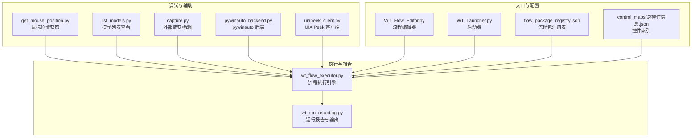
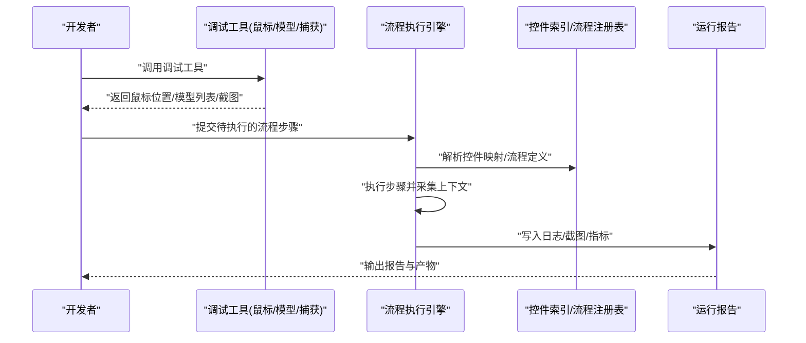
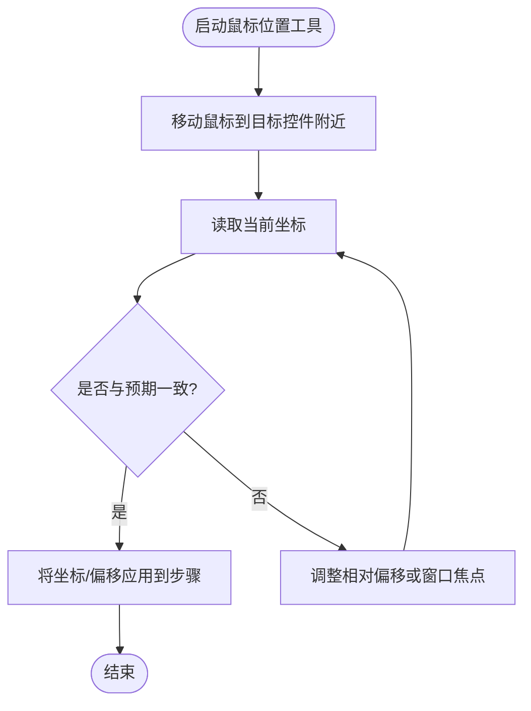
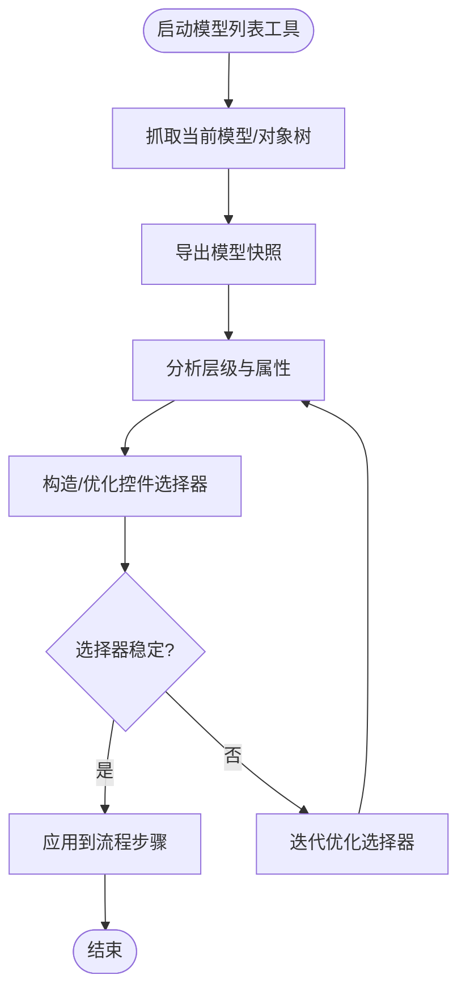
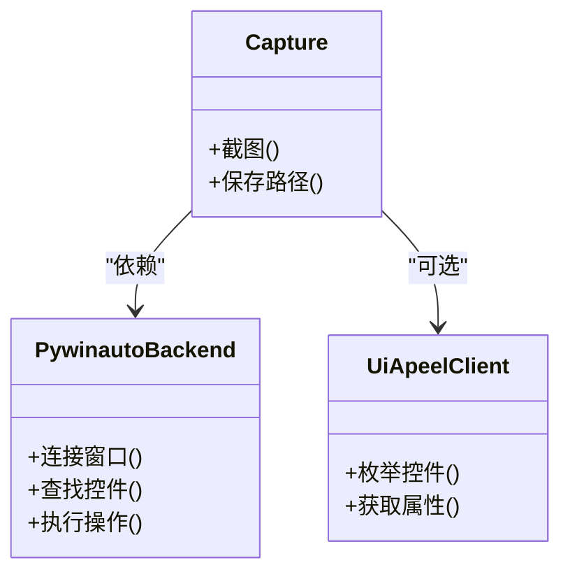
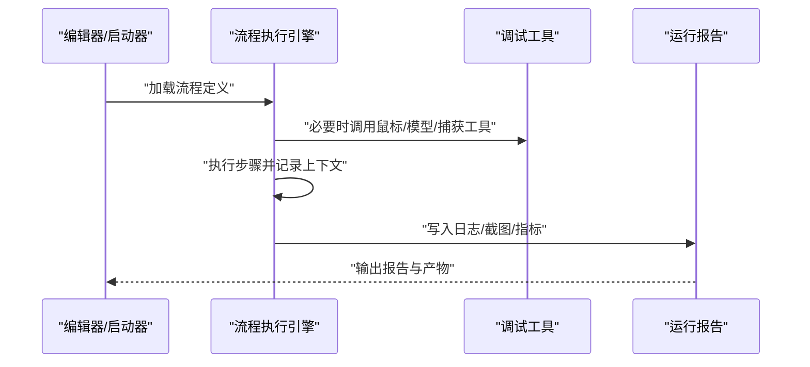
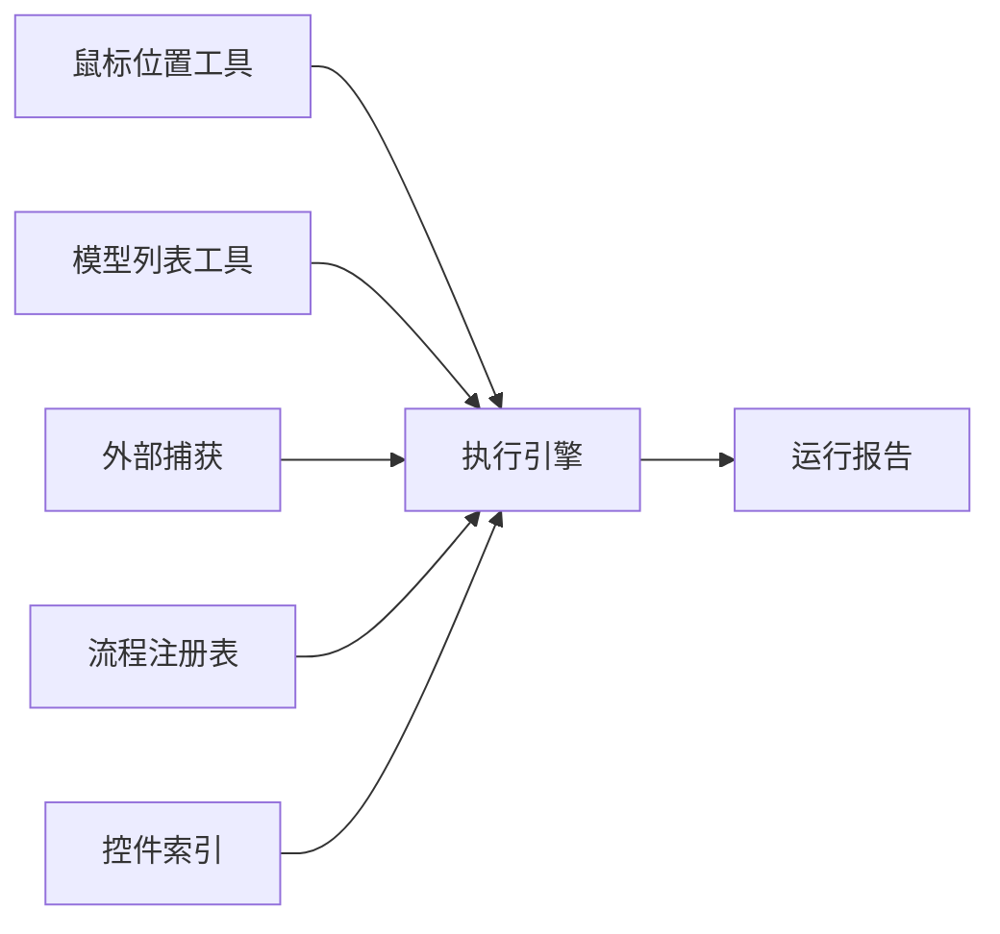

# 调试工具和技巧

<cite>
**本文引用的文件**
- [tools/dev_utils/get_mouse_position.py](file://tools/dev_utils/get_mouse_position.py)
- [tools/dev_utils/list_models.py](file://tools/dev_utils/list_models.py)
- [tools/external_capture/capture.py](file://tools/external_capture/capture.py)
- [tools/external_capture/pywinauto_backend.py](file://tools/external_capture/pywinauto_backend.py)
- [tools/external_capture/uiapeek_client.py](file://tools/external_capture/uiapeek_client.py)
- [WT_Flow_Editor.py](file://WT_Flow_Editor.py)
- [WT_Launcher.py](file://WT_Launcher.py)
- [wt_flow_executor.py](file://wt_flow_executor.py)
- [wt_run_reporting.py](file://wt_run_reporting.py)
- [flow_packages/flow_package_registry.json](file://flow_packages/flow_package_registry.json)
- [control_maps/总控件信息.json](file://control_maps/总控件信息.json)
- [debug-click-9-miss.md](file://debug-click-9-miss.md)
- [debug-default-height-relative-input.md](file://debug-default-height-relative-input.md)
- [debug-private-group-click.md](file://debug-private-group-click.md)
- [debug-relative-region-offset.md](file://debug-relative-region-offset.md)
- [debug-start-validation-regression.md](file://debug-start-validation-regression.md)
- [debug-time-series-input-regression.md](file://debug-time-series-input-regression.md)
</cite>

## 目录
1. [简介](#简介)
2. [项目结构](#项目结构)
3. [核心组件](#核心组件)
4. [架构总览](#架构总览)
5. [详细组件分析](#详细组件分析)
6. [依赖关系分析](#依赖关系分析)
7. [性能考虑](#性能考虑)
8. [故障排查指南](#故障排查指南)
9. [结论](#结论)
10. [附录](#附录)

## 简介
本章节面向使用 WT 自动化框架的测试与开发同学，聚焦“调试工具与技巧”。内容覆盖：
- 内置调试工具：控件选择器、鼠标位置获取、模型列表查看等
- 日志记录与错误诊断：如何定位执行失败原因
- 断点调试与常用技巧
- 性能分析与瓶颈定位
- 常见问题调试流程与解决方案
- 控制台输出与状态文件的使用
- 远程调试与分布式环境下的调试技巧

## 项目结构
WT 自动化框架在仓库中提供了多类调试与辅助能力，主要分布在以下目录与文件：
- 开发辅助工具（命令行）：位于 tools/dev_utils，提供鼠标位置获取、模型列表查看等实用脚本
- 外部捕获与 UI 探测：位于 tools/external_capture，封装了截图、UIA/Axe 桥接与 pywinauto 后端
- 运行期执行与报告：wt_flow_executor 负责流程执行，wt_run_reporting 负责结果与报告输出
- 编辑器与启动器：WT_Flow_Editor.py、WT_Launcher.py 提供可视化编辑与统一入口
- 控制映射与库：control_maps 下保存控件索引与映射，便于定位与自修复
- 典型问题记录：根目录 debug-*.md 沉淀了常见问题的复现与排障过程

图表来源
- [tools/dev_utils/get_mouse_position.py](file://tools/dev_utils/get_mouse_position.py)
- [tools/dev_utils/list_models.py](file://tools/dev_utils/list_models.py)
- [tools/external_capture/capture.py](file://tools/external_capture/capture.py)
- [tools/external_capture/pywinauto_backend.py](file://tools/external_capture/pywinauto_backend.py)
- [tools/external_capture/uiapeek_client.py](file://tools/external_capture/uiapeek_client.py)
- [wt_flow_executor.py](file://wt_flow_executor.py)
- [wt_run_reporting.py](file://wt_run_reporting.py)
- [WT_Flow_Editor.py](file://WT_Flow_Editor.py)
- [WT_Launcher.py](file://WT_Launcher.py)
- [flow_packages/flow_package_registry.json](file://flow_packages/flow_package_registry.json)
- [control_maps/总控件信息.json](file://control_maps/总控件信息.json)

章节来源
- [tools/dev_utils/get_mouse_position.py](file://tools/dev_utils/get_mouse_position.py)
- [tools/dev_utils/list_models.py](file://tools/dev_utils/list_models.py)
- [tools/external_capture/capture.py](file://tools/external_capture/capture.py)
- [tools/external_capture/pywinauto_backend.py](file://tools/external_capture/pywinauto_backend.py)
- [tools/external_capture/uiapeek_client.py](file://tools/external_capture/uiapeek_client.py)
- [wt_flow_executor.py](file://wt_flow_executor.py)
- [wt_run_reporting.py](file://wt_run_reporting.py)
- [WT_Flow_Editor.py](file://WT_Flow_Editor.py)
- [WT_Launcher.py](file://WT_Launcher.py)
- [flow_packages/flow_package_registry.json](file://flow_packages/flow_package_registry.json)
- [control_maps/总控件信息.json](file://control_maps/总控件信息.json)

## 核心组件
本节聚焦调试相关的关键模块与职责：
- 鼠标位置获取：用于快速确认点击坐标、相对区域偏移是否正确
- 模型列表查看：用于检查被测应用当前加载的模型/对象树，辅助定位控件层级
- 外部捕获与 UI 探测：截图、UIA/Axe 桥接、pywinauto 后端，帮助定位界面元素与交互问题
- 执行引擎与报告：流程执行过程中的关键节点、异常堆栈、耗时统计与产物输出

章节来源
- [tools/dev_utils/get_mouse_position.py](file://tools/dev_utils/get_mouse_position.py)
- [tools/dev_utils/list_models.py](file://tools/dev_utils/list_models.py)
- [tools/external_capture/capture.py](file://tools/external_capture/capture.py)
- [tools/external_capture/pywinauto_backend.py](file://tools/external_capture/pywinauto_backend.py)
- [tools/external_capture/uiapeek_client.py](file://tools/external_capture/uiapeek_client.py)
- [wt_flow_executor.py](file://wt_flow_executor.py)
- [wt_run_reporting.py](file://wt_run_reporting.py)

## 架构总览
下图展示了从“调试工具”到“执行引擎”再到“报告输出”的整体数据流。开发者通过命令行或编辑器触发调试动作，执行引擎在运行时采集必要上下文并生成可追溯的报告与产物。

图表来源
- [tools/dev_utils/get_mouse_position.py](file://tools/dev_utils/get_mouse_position.py)
- [tools/dev_utils/list_models.py](file://tools/dev_utils/list_models.py)
- [tools/external_capture/capture.py](file://tools/external_capture/capture.py)
- [wt_flow_executor.py](file://wt_flow_executor.py)
- [wt_run_reporting.py](file://wt_run_reporting.py)
- [flow_packages/flow_package_registry.json](file://flow_packages/flow_package_registry.json)
- [control_maps/总控件信息.json](file://control_maps/总控件信息.json)

## 详细组件分析

### 鼠标位置获取工具
用途：快速获取当前鼠标指针坐标，验证点击/拖拽/相对区域偏移是否命中目标控件。
建议用法：
- 在执行前打开该工具，移动鼠标至目标控件附近，记录坐标
- 结合相对区域参数进行对比，判断偏移量是否合理
- 若存在多显示器或缩放差异，注意屏幕坐标系变化

图表来源
- [tools/dev_utils/get_mouse_position.py](file://tools/dev_utils/get_mouse_position.py)

章节来源
- [tools/dev_utils/get_mouse_position.py](file://tools/dev_utils/get_mouse_position.py)

### 模型列表查看工具
用途：列出当前被测应用的模型/对象树，辅助定位控件层级、名称、类型等信息，提升选择器稳定性。
建议用法：
- 在需要操作的界面出现时运行该工具，导出模型快照
- 根据快照中的层级与属性构造更稳定的控件选择器
- 将快照与 control_maps 下的控件索引对照，验证选择器是否命中

图表来源
- [tools/dev_utils/list_models.py](file://tools/dev_utils/list_models.py)
- [control_maps/总控件信息.json](file://control_maps/总控件信息.json)

章节来源
- [tools/dev_utils/list_models.py](file://tools/dev_utils/list_models.py)
- [control_maps/总控件信息.json](file://control_maps/总控件信息.json)

### 外部捕获与 UI 探测
包含截图、UIA/Axe 桥接与 pywinauto 后端，用于：
- 在失败时自动截图，保留现场
- 通过 UIA/Axe 获取控件树与属性，辅助定位
- 使用 pywinauto 作为底层后端进行窗口/控件操作

图表来源
- [tools/external_capture/capture.py](file://tools/external_capture/capture.py)
- [tools/external_capture/pywinauto_backend.py](file://tools/external_capture/pywinauto_backend.py)
- [tools/external_capture/uiapeek_client.py](file://tools/external_capture/uiapeek_client.py)

章节来源
- [tools/external_capture/capture.py](file://tools/external_capture/capture.py)
- [tools/external_capture/pywinauto_backend.py](file://tools/external_capture/pywinauto_backend.py)
- [tools/external_capture/uiapeek_client.py](file://tools/external_capture/uiapeek_client.py)

### 流程执行引擎与报告
执行引擎负责按步骤驱动被测应用，并在关键节点采集上下文；报告模块负责汇总日志、截图、指标与失败详情。

图表来源
- [WT_Flow_Editor.py](file://WT_Flow_Editor.py)
- [WT_Launcher.py](file://WT_Launcher.py)
- [wt_flow_executor.py](file://wt_flow_executor.py)
- [wt_run_reporting.py](file://wt_run_reporting.py)

章节来源
- [WT_Flow_Editor.py](file://WT_Flow_Editor.py)
- [WT_Launcher.py](file://WT_Launcher.py)
- [wt_flow_executor.py](file://wt_flow_executor.py)
- [wt_run_reporting.py](file://wt_run_reporting.py)

## 依赖关系分析
- 调试工具对执行引擎为“按需调用”，不改变主流程逻辑，仅在需要时注入上下文
- 执行引擎依赖控件索引与流程注册表，确保选择器与步骤定义的稳定性
- 报告模块依赖执行引擎产出的中间产物（日志、截图、指标），形成可追溯证据链

图表来源
- [tools/dev_utils/get_mouse_position.py](file://tools/dev_utils/get_mouse_position.py)
- [tools/dev_utils/list_models.py](file://tools/dev_utils/list_models.py)
- [tools/external_capture/capture.py](file://tools/external_capture/capture.py)
- [wt_flow_executor.py](file://wt_flow_executor.py)
- [wt_run_reporting.py](file://wt_run_reporting.py)
- [flow_packages/flow_package_registry.json](file://flow_packages/flow_package_registry.json)
- [control_maps/总控件信息.json](file://control_maps/总控件信息.json)

章节来源
- [flow_packages/flow_package_registry.json](file://flow_packages/flow_package_registry.json)
- [control_maps/总控件信息.json](file://control_maps/总控件信息.json)
- [wt_flow_executor.py](file://wt_flow_executor.py)
- [wt_run_reporting.py](file://wt_run_reporting.py)

## 性能考虑
- 减少不必要的截图与 UIA 枚举：仅在失败或关键步骤开启，避免影响整体吞吐
- 复用控件索引与缓存：优先使用 control_maps 中的稳定选择器，降低动态查找开销
- 批量处理与并行化：在分布式环境下，合理拆分任务，避免单点阻塞
- 监控关键指标：关注步骤耗时、等待时间、重试次数，识别热点步骤

[本节为通用指导，无需特定文件引用]

## 故障排查指南
- 使用鼠标位置工具核对点击坐标与相对偏移，排除分辨率/缩放导致的误点
- 使用模型列表工具导出快照，对比控件层级与属性，优化选择器
- 借助外部捕获工具在失败时自动截图，结合 UIA/Axe 与 pywinauto 定位控件
- 查看执行引擎与报告输出，定位异常堆栈、失败步骤与上下文
- 参考仓库中的 debug-*.md 文档，对照同类问题的复现与解决思路

章节来源
- [tools/dev_utils/get_mouse_position.py](file://tools/dev_utils/get_mouse_position.py)
- [tools/dev_utils/list_models.py](file://tools/dev_utils/list_models.py)
- [tools/external_capture/capture.py](file://tools/external_capture/capture.py)
- [tools/external_capture/pywinauto_backend.py](file://tools/external_capture/pywinauto_backend.py)
- [tools/external_capture/uiapeek_client.py](file://tools/external_capture/uiapeek_client.py)
- [wt_flow_executor.py](file://wt_flow_executor.py)
- [wt_run_reporting.py](file://wt_run_reporting.py)
- [debug-click-9-miss.md](file://debug-click-9-miss.md)
- [debug-default-height-relative-input.md](file://debug-default-height-relative-input.md)
- [debug-private-group-click.md](file://debug-private-group-click.md)
- [debug-relative-region-offset.md](file://debug-relative-region-offset.md)
- [debug-start-validation-regression.md](file://debug-start-validation-regression.md)
- [debug-time-series-input-regression.md](file://debug-time-series-input-regression.md)

## 结论
通过组合使用鼠标位置获取、模型列表查看、外部捕获与 UI 探测等调试工具，并结合执行引擎与报告输出的上下文证据，可以高效定位与解决自动化执行中的各类问题。建议在团队内沉淀常见问题与最佳实践，持续完善控件索引与流程定义，提高稳定性与可维护性。

[本节为总结性内容，无需特定文件引用]

## 附录
- 控制台输出：在本地或 CI 环境中启用详细日志级别，便于快速检索关键信息
- 状态文件：利用执行过程中生成的中间产物（如截图、模型快照、指标）进行回溯分析
- 远程调试：在分布式环境下，集中收集各节点的日志与产物，统一归档与检索
- 断点调试：在关键步骤前后设置断点，观察变量与上下文，逐步缩小问题范围

[本节为通用指导，无需特定文件引用]