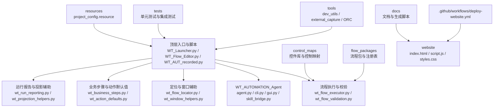
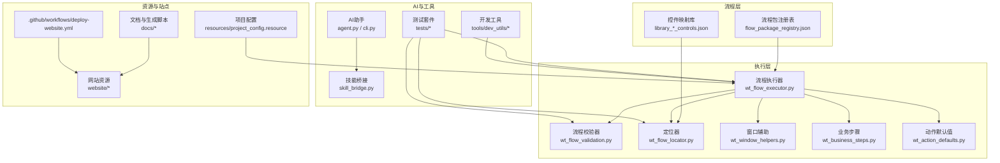
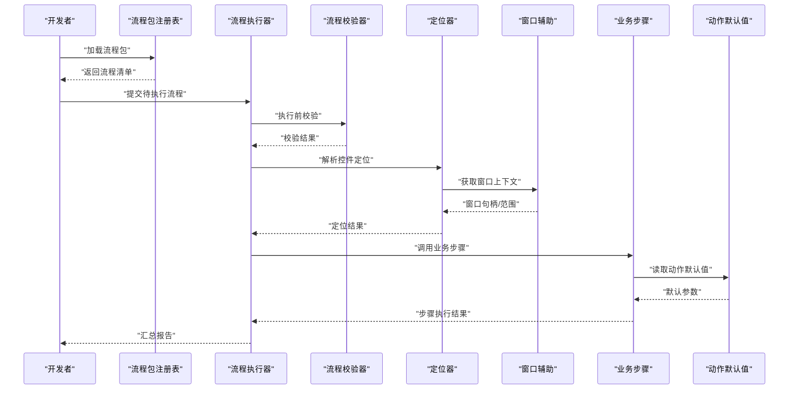
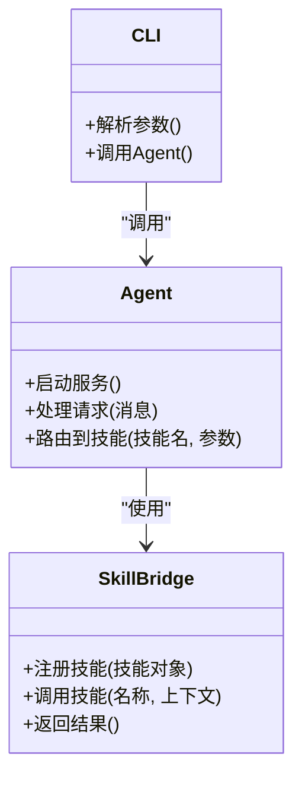
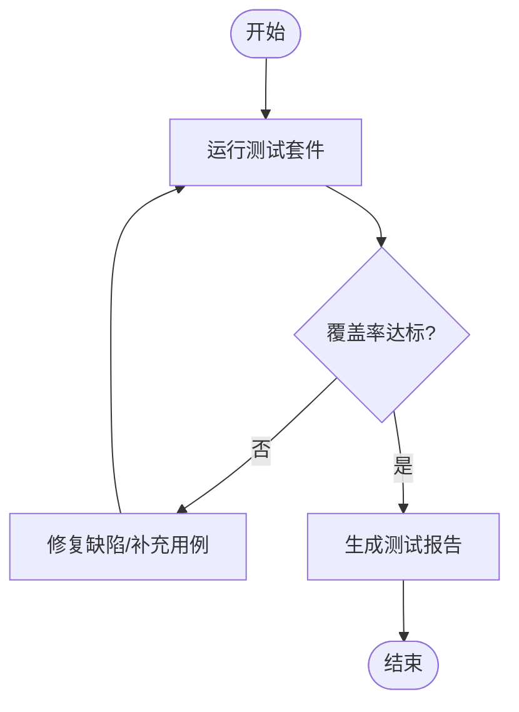
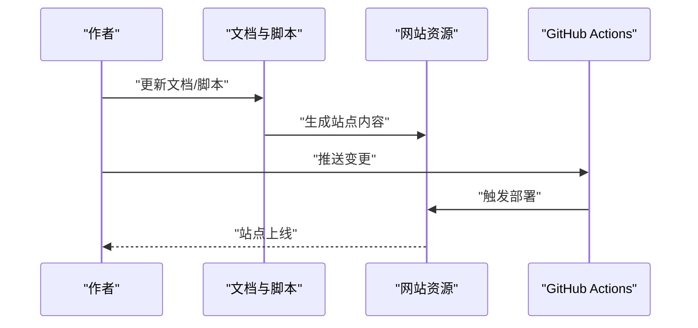
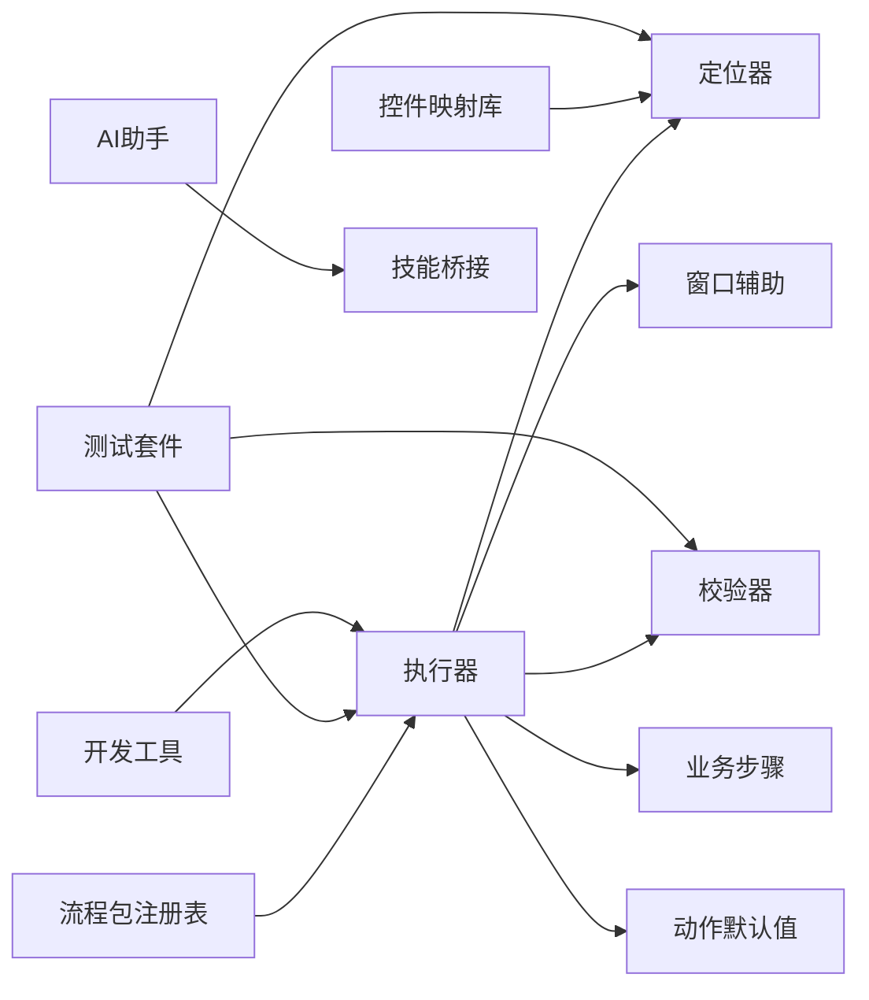

# 贡献指南

<cite>
**本文引用的文件**   
- [README.md](file://README.md)
- [.github/workflows/deploy-website.yml](file://.github/workflows/deploy-website.yml)
- [PROJECT_ARCHITECTURE.md](file://PROJECT_ARCHITECTURE.md)
- [docs/WT_步骤新增填写规范.md](file://docs/WT_步骤新增填写规范.md)
- [docs/generate_project_ppt.py](file://docs/generate_project_ppt.py)
- [docs/generate_project_ppt_com.py](file://docs/generate_project_ppt_com.py)
- [tools/dev_utils/test_api.py](file://tools/dev_utils/test_api.py)
- [tests/test_wt_flow_executor.py](file://tests/test_wt_flow_executor.py)
- [tests/test_wt_action_validation.py](file://tests/test_wt_action_validation.py)
- [flow_packages/flow_package_registry.json](file://flow_packages/flow_package_registry.json)
- [control_maps/library_window_WPF_controls.json](file://control_maps/library_window_WPF_controls.json)
- [resources/project_config.resource](file://resources/project_config.resource)
</cite>

## 目录
1. [简介](#简介)
2. [项目结构](#项目结构)
3. [核心组件](#核心组件)
4. [架构总览](#架构总览)
5. [详细组件分析](#详细组件分析)
6. [依赖分析](#依赖分析)
7. [性能考虑](#性能考虑)
8. [故障排查指南](#故障排查指南)
9. [结论](#结论)
10. [附录](#附录)

## 简介
本贡献指南面向WT自动化框架的贡献者，旨在统一代码提交与分支管理、Pull Request（PR）流程、文档编写与更新方法、新功能开发建议与模板、Issue报告规范、社区交流渠道、代码风格与质量标准，以及许可证与法律相关事项。请所有贡献者在参与前阅读并遵循本指南，以确保协作高效、质量稳定。

## 项目结构
仓库采用按功能域与职责分层组织的方式：
- 顶层脚本与入口：提供启动器、编辑器、记录器转换等工具与入口脚本
- WT_AUTOMATION_Agent：AI助手与GUI能力，包含CLI、控制索引、技能桥接与示例
- control_maps：控件库与控制映射数据
- docs：文档与生成脚本
- flow_packages：流程包定义与注册表
- image_templates：图像模板与图标资源
- resources：运行时资源与配置
- samples：示例流程、录制脚本与遗留测试
- tests：单元测试与集成测试
- tools：开发工具、外部捕获桥接、OCR子模块
- website：站点静态资源与部署工作流

图表来源
- [PROJECT_ARCHITECTURE.md](file://PROJECT_ARCHITECTURE.md)
- [README.md](file://README.md)

章节来源
- [README.md](file://README.md)
- [PROJECT_ARCHITECTURE.md](file://PROJECT_ARCHITECTURE.md)

## 核心组件
- 流程执行与校验：负责解析流程定义、执行动作序列、进行前置条件与参数校验，并输出运行报告
- 定位与窗口辅助：封装UI元素定位策略（相对区域、窗口上下文等），屏蔽底层差异
- 业务步骤与动作默认值：定义领域内可复用的业务步骤与动作默认配置
- AI助手与技能桥接：提供CLI/GUI交互、技能调用与外部系统桥接能力
- 控件库与流程包：以JSON描述控件映射与流程包元信息，支持扩展与注册
- 测试与工具：覆盖关键路径的单元与集成测试；提供开发调试、API探测与外部捕获桥接

章节来源
- [wt_flow_executor.py](file://wt_flow_executor.py)
- [wt_flow_validation.py](file://wt_flow_validation.py)
- [wt_flow_locator.py](file://wt_flow_locator.py)
- [wt_window_helpers.py](file://wt_window_helpers.py)
- [wt_business_steps.py](file://wt_business_steps.py)
- [wt_action_defaults.py](file://wt_action_defaults.py)
- [WT_AUTOMATION_Agent/agent.py](file://WT_AUTOMATION_Agent/agent.py)
- [WT_AUTOMATION_Agent/cli.py](file://WT_AUTOMATION_Agent/cli.py)
- [WT_AUTOMATION_Agent/skill_bridge.py](file://WT_AUTOMATION_Agent/skill_bridge.py)
- [control_maps/library_window_WPF_controls.json](file://control_maps/library_window_WPF_controls.json)
- [flow_packages/flow_package_registry.json](file://flow_packages/flow_package_registry.json)
- [tests/test_wt_flow_executor.py](file://tests/test_wt_flow_executor.py)
- [tests/test_wt_action_validation.py](file://tests/test_wt_action_validation.py)

## 架构总览
整体架构围绕“流程驱动”的自动化执行模型构建：流程定义由JSON描述，经注册表加载后交由执行器解析与调度；定位层屏蔽UI差异；业务层提供领域步骤；AI助手通过技能桥接扩展能力；测试与工具贯穿开发与发布阶段。

图表来源
- [flow_packages/flow_package_registry.json](file://flow_packages/flow_package_registry.json)
- [control_maps/library_window_WPF_controls.json](file://control_maps/library_window_WPF_controls.json)
- [wt_flow_executor.py](file://wt_flow_executor.py)
- [wt_flow_validation.py](file://wt_flow_validation.py)
- [wt_flow_locator.py](file://wt_flow_locator.py)
- [wt_window_helpers.py](file://wt_window_helpers.py)
- [wt_business_steps.py](file://wt_business_steps.py)
- [wt_action_defaults.py](file://wt_action_defaults.py)
- [WT_AUTOMATION_Agent/agent.py](file://WT_AUTOMATION_Agent/agent.py)
- [WT_AUTOMATION_Agent/cli.py](file://WT_AUTOMATION_Agent/cli.py)
- [WT_AUTOMATION_Agent/skill_bridge.py](file://WT_AUTOMATION_Agent/skill_bridge.py)
- [tests/test_wt_flow_executor.py](file://tests/test_wt_flow_executor.py)
- [tools/dev_utils/test_api.py](file://tools/dev_utils/test_api.py)
- [resources/project_config.resource](file://resources/project_config.resource)
- [docs/generate_project_ppt.py](file://docs/generate_project_ppt.py)
- [docs/generate_project_ppt_com.py](file://docs/generate_project_ppt_com.py)
- [.github/workflows/deploy-website.yml](file://.github/workflows/deploy-website.yml)

## 详细组件分析

### 流程执行与校验
- 职责：解析流程定义、调度动作、执行前置校验、收集运行指标与错误信息
- 关键点：
  - 流程包注册表用于发现与加载可用流程包
  - 控件映射库为定位器提供稳定的UI元素描述
  - 校验器在运行前对参数与依赖进行验证，降低运行时失败率
  - 报告模块汇总执行结果，便于追踪与复盘

图表来源
- [flow_packages/flow_package_registry.json](file://flow_packages/flow_package_registry.json)
- [wt_flow_executor.py](file://wt_flow_executor.py)
- [wt_flow_validation.py](file://wt_flow_validation.py)
- [wt_flow_locator.py](file://wt_flow_locator.py)
- [wt_window_helpers.py](file://wt_window_helpers.py)
- [wt_business_steps.py](file://wt_business_steps.py)
- [wt_action_defaults.py](file://wt_action_defaults.py)

章节来源
- [wt_flow_executor.py](file://wt_flow_executor.py)
- [wt_flow_validation.py](file://wt_flow_validation.py)
- [wt_flow_locator.py](file://wt_flow_locator.py)
- [wt_window_helpers.py](file://wt_window_helpers.py)
- [wt_business_steps.py](file://wt_business_steps.py)
- [wt_action_defaults.py](file://wt_action_defaults.py)
- [flow_packages/flow_package_registry.json](file://flow_packages/flow_package_registry.json)
- [control_maps/library_window_WPF_controls.json](file://control_maps/library_window_WPF_controls.json)

### AI助手与技能桥接
- 职责：提供CLI/GUI交互入口，封装技能调用，桥接外部系统或模型
- 关键点：
  - CLI提供命令行能力，便于集成到CI或批处理任务
  - GUI简化日常操作，提升易用性
  - 技能桥接将领域能力抽象为可插拔模块，便于扩展

图表来源
- [WT_AUTOMATION_Agent/agent.py](file://WT_AUTOMATION_Agent/agent.py)
- [WT_AUTOMATION_Agent/cli.py](file://WT_AUTOMATION_Agent/cli.py)
- [WT_AUTOMATION_Agent/skill_bridge.py](file://WT_AUTOMATION_Agent/skill_bridge.py)

章节来源
- [WT_AUTOMATION_Agent/agent.py](file://WT_AUTOMATION_Agent/agent.py)
- [WT_AUTOMATION_Agent/cli.py](file://WT_AUTOMATION_Agent/cli.py)
- [WT_AUTOMATION_Agent/skill_bridge.py](file://WT_AUTOMATION_Agent/skill_bridge.py)

### 测试与工具
- 测试套件：覆盖执行器、校验器、定位器等关键路径，确保回归稳定性
- 开发工具：提供API探测、模型列表、鼠标位置等实用能力，加速问题定位

图表来源
- [tests/test_wt_flow_executor.py](file://tests/test_wt_flow_executor.py)
- [tests/test_wt_action_validation.py](file://tests/test_wt_action_validation.py)
- [tools/dev_utils/test_api.py](file://tools/dev_utils/test_api.py)

章节来源
- [tests/test_wt_flow_executor.py](file://tests/test_wt_flow_executor.py)
- [tests/test_wt_action_validation.py](file://tests/test_wt_action_validation.py)
- [tools/dev_utils/test_api.py](file://tools/dev_utils/test_api.py)

### 文档与站点
- 文档规范：参考“WT_步骤新增填写规范”，统一术语、结构与版本标注
- 站点生成：通过Python脚本生成PPT/站点内容，配合GitHub Actions自动部署

图表来源
- [docs/WT_步骤新增填写规范.md](file://docs/WT_步骤新增填写规范.md)
- [docs/generate_project_ppt.py](file://docs/generate_project_ppt.py)
- [docs/generate_project_ppt_com.py](file://docs/generate_project_ppt_com.py)
- [.github/workflows/deploy-website.yml](file://.github/workflows/deploy-website.yml)

章节来源
- [docs/WT_步骤新增填写规范.md](file://docs/WT_步骤新增填写规范.md)
- [docs/generate_project_ppt.py](file://docs/generate_project_ppt.py)
- [docs/generate_project_ppt_com.py](file://docs/generate_project_ppt_com.py)
- [.github/workflows/deploy-website.yml](file://.github/workflows/deploy-website.yml)

## 依赖分析
- 内部依赖：
  - 执行器依赖校验器、定位器、窗口辅助、业务步骤与动作默认值
  - 流程包注册表与控件映射库为执行期提供元数据
  - AI助手通过技能桥接扩展能力
- 外部依赖：
  - 测试与工具链（pytest、unittest等）
  - OCR与外部捕获桥接（Tesseract、pywinauto等）
  - 站点部署（GitHub Actions）

图表来源
- [wt_flow_executor.py](file://wt_flow_executor.py)
- [wt_flow_validation.py](file://wt_flow_validation.py)
- [wt_flow_locator.py](file://wt_flow_locator.py)
- [wt_window_helpers.py](file://wt_window_helpers.py)
- [wt_business_steps.py](file://wt_business_steps.py)
- [wt_action_defaults.py](file://wt_action_defaults.py)
- [flow_packages/flow_package_registry.json](file://flow_packages/flow_package_registry.json)
- [control_maps/library_window_WPF_controls.json](file://control_maps/library_window_WPF_controls.json)
- [WT_AUTOMATION_Agent/agent.py](file://WT_AUTOMATION_Agent/agent.py)
- [WT_AUTOMATION_Agent/skill_bridge.py](file://WT_AUTOMATION_Agent/skill_bridge.py)
- [tests/test_wt_flow_executor.py](file://tests/test_wt_flow_executor.py)
- [tools/dev_utils/test_api.py](file://tools/dev_utils/test_api.py)

章节来源
- [wt_flow_executor.py](file://wt_flow_executor.py)
- [flow_packages/flow_package_registry.json](file://flow_packages/flow_package_registry.json)
- [control_maps/library_window_WPF_controls.json](file://control_maps/library_window_WPF_controls.json)
- [WT_AUTOMATION_Agent/agent.py](file://WT_AUTOMATION_Agent/agent.py)
- [tests/test_wt_flow_executor.py](file://tests/test_wt_flow_executor.py)
- [tools/dev_utils/test_api.py](file://tools/dev_utils/test_api.py)

## 性能考虑
- 定位优化：优先使用稳定的控件标识与相对区域定位，减少全图匹配开销
- 批量执行：合并相似动作，避免频繁切换窗口与重复初始化
- 缓存策略：对不常变化的控件映射与模板进行缓存，降低IO与解析成本
- 并发限制：谨慎使用并行执行，避免资源竞争与UI状态不一致
- 日志与监控：在关键路径增加耗时统计，便于瓶颈定位

[本节为通用指导，无需具体文件引用]

## 故障排查指南
- 常见问题定位：
  - 定位失败：检查控件映射库是否最新，确认窗口上下文与相对区域偏移
  - 参数校验失败：对照校验规则与默认值，补齐必填字段
  - 执行中断：查看运行报告中的异常堆栈与步骤上下文
- 调试工具：
  - 使用开发工具探测API与模型列表，快速验证环境
  - 借助测试套件最小化复现问题，逐步缩小范围
- 建议流程：
  - 复现问题 -> 收集日志与截图 -> 编写最小用例 -> 提交Issue并附复现步骤

章节来源
- [tools/dev_utils/test_api.py](file://tools/dev_utils/test_api.py)
- [tests/test_wt_flow_executor.py](file://tests/test_wt_flow_executor.py)
- [tests/test_wt_action_validation.py](file://tests/test_wt_action_validation.py)

## 结论
本贡献指南明确了代码提交、分支管理、PR流程、文档规范、新功开发建议、Issue格式、社区渠道、代码风格与质量标准、许可证与法律事项。遵循这些约定有助于提升协作效率与产品质量。欢迎贡献者积极参与，共同完善WT自动化框架。

[本节为总结性内容，无需具体文件引用]

## 附录

### 代码提交规范
- 提交信息格式：类型(范围): 简述
  - 类型：feat、fix、docs、style、refactor、test、chore
  - 范围：模块或文件路径，如“流程执行器”、“定位器”
  - 简述：不超过50字，清晰表达变更意图
- 提交粒度：一次提交聚焦单一变更，便于审查与回滚
- 签名与关联：必要时附加签名与Issue编号，便于追溯

[本节为通用指导，无需具体文件引用]

### 分支管理策略
- 主分支：main/master，保持可发布状态
- 开发分支：develop，集成日常开发成果
- 功能分支：feature/<功能名>，从develop切出，完成后合并回develop
- 修复分支：hotfix/<问题描述>，从main切出，修复后合并至main与develop
- 发布分支：release/<版本号>，用于预发布与回归验证

[本节为通用指导，无需具体文件引用]

### Pull Request创建与审查流程
- PR标题：类型(范围): 简述
- PR描述：
  - 背景与目标
  - 变更要点与影响面
  - 测试方法与结果
  - 相关Issue链接
- 审查要求：
  - 至少一名维护者审查通过
  - 自动化检查（测试、lint、构建）全部通过
  - 文档与示例同步更新

[本节为通用指导，无需具体文件引用]

### 文档编写规范与更新方法
- 术语与结构：遵循“WT_步骤新增填写规范”，统一命名、层级与版本标注
- 更新方法：
  - 修改docs下的Markdown与脚本
  - 本地生成站点预览，确认无误后提交
  - 通过GitHub Actions自动部署至网站

章节来源
- [docs/WT_步骤新增填写规范.md](file://docs/WT_步骤新增填写规范.md)
- [docs/generate_project_ppt.py](file://docs/generate_project_ppt.py)
- [docs/generate_project_ppt_com.py](file://docs/generate_project_ppt_com.py)
- [.github/workflows/deploy-website.yml](file://.github/workflows/deploy-website.yml)

### 新功能开发建议与模板
- 建议流程：
  - 需求分析与设计评审
  - 拆分任务与里程碑
  - 实现与自测，补充用例
  - 提交PR并等待审查
- 模板建议：
  - 设计文档：背景、目标、方案、风险与回滚计划
  - 变更清单：新增/修改/删除项，影响范围与兼容性说明
  - 测试计划：用例覆盖、边界条件与性能基线

[本节为通用指导，无需具体文件引用]

### Issue报告格式与要求
- 标题：简明扼要，包含模块与现象
- 描述：
  - 环境信息（操作系统、Python版本、依赖版本）
  - 复现步骤（序号化，尽量最小化）
  - 期望行为与实际行为
  - 日志与截图附件
- 标签：bug、enhancement、question、documentation

[本节为通用指导，无需具体文件引用]

### 社区交流与问题反馈渠道
- GitHub Issues：提交问题与建议
- Pull Requests：提交改进与修复
- 讨论区：技术探讨与经验分享
- 邮件/群组：按需建立与维护

[本节为通用指导，无需具体文件引用]

### 代码风格与质量标准
- 风格规范：
  - 命名：模块与函数使用小写下划线，类使用大驼峰
  - 注释：公共接口需有清晰注释与参数说明
  - 格式化：统一缩进与行宽，避免无意义空白
- 质量标准：
  - 单测覆盖率：核心模块不低于阈值
  - 静态检查：通过lint与类型检查
  - 回归测试：关键路径用例必须通过

[本节为通用指导，无需具体文件引用]

### 许可证与法律相关事项
- 许可证：请在仓库根目录添加LICENSE文件，明确许可条款
- 第三方依赖：遵守各依赖的许可证要求，避免冲突
- 合规声明：涉及隐私与数据安全时，需在文档中说明数据处理方式与保护措施

[本节为通用指导，无需具体文件引用]