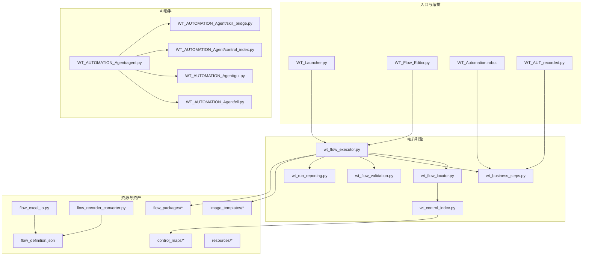
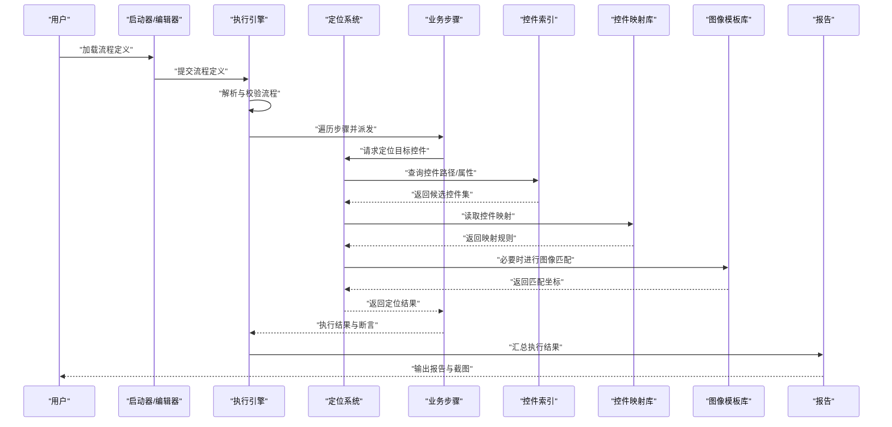
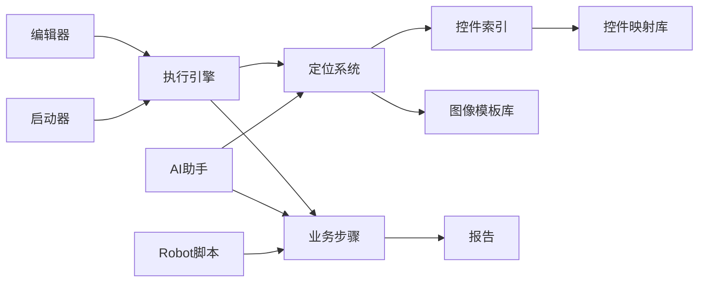

# 项目结构说明

<cite>
**本文引用的文件**   
- [wt_flow_executor.py](file://wt_flow_executor.py)
- [wt_flow_locator.py](file://wt_flow_locator.py)
- [wt_business_steps.py](file://wt_business_steps.py)
- [WT_AUT_recorded.py](file://WT_AUT_recorded.py)
- [WT_Automation.robot](file://WT_Automation.robot)
- [WT_Flow_Editor.py](file://WT_Flow_Editor.py)
- [WT_Launcher.py](file://WT_Launcher.py)
- [flow_definition.json](file://flow_definition.json)
- [flow_excel_io.py](file://flow_excel_io.py)
- [flow_recorder_converter.py](file://flow_recorder_converter.py)
- [wt_control_index.py](file://wt_control_index.py)
- [build_control_map_library.py](file://build_control_map_library.py)
- [build_image_template_library.py](file://build_image_template_library.py)
- [agent.py](file://WT_AUTOMATION_Agent/agent.py)
- [cli.py](file://WT_AUTOMATION_Agent/cli.py)
- [gui.py](file://WT_AUTOMATION_Agent/gui.py)
- [control_index.py](file://WT_AUTOMATION_Agent/control_index.py)
- [skill_bridge.py](file://WT_AUTOMATION_Agent/skill_bridge.py)
- [_gui_config.json](file://WT_AUTOMATION_Agent/_gui_config.json)
- [templates_index.json](file://image_templates/templates_index.json)
- [templates_index.json](file://image_templates/Icons/templates_index.json)
- [templates_index.json](file://image_templates/WT_software_Images/templates_index.json)
- [library_window_WPF_controls.json](file://control_maps/library_window_WPF_controls.json)
- [standard_control_catalog.json](file://control_maps/standard_control_catalog.json)
- [总控件信息.json](file://control_maps/总控件信息.json)
- [flow_package_registry.json](file://flow_packages/flow_package_registry.json)
- [dispatch_keywords.resource](file://resources/dispatch_keywords.resource)
- [project_config.resource](file://resources/project_config.resource)
- [PROJECT_ARCHITECTURE.md](file://PROJECT_ARCHITECTURE.md)
- [README.md](file://README.md)
</cite>

## 目录
1. [简介](#简介)
2. [项目结构](#项目结构)
3. [核心组件](#核心组件)
4. [架构总览](#架构总览)
5. [详细组件分析](#详细组件分析)
6. [依赖关系分析](#依赖关系分析)
7. [性能与稳定性考量](#性能与稳定性考量)
8. [故障排查指南](#故障排查指南)
9. [结论](#结论)
10. [附录](#附录)

## 简介
本文件面向WT自动化框架的开发者与维护者，系统化说明项目的目录结构与代码组织规范，解释执行引擎、定位系统、业务步骤等核心模块的职责划分，并给出新增模块的规范与最佳实践。文档同时覆盖AI助手、控件映射库、图像模板库、流程包以及配置文件的命名约定与管理方式，帮助读者快速理解模块间的依赖关系与数据流向。

## 项目结构
仓库采用“按功能域分层 + 资源集中管理”的组织方式：
- 顶层Python脚本提供入口与工具能力（如编辑器、启动器、录制转换、Excel导入导出等）
- 核心逻辑集中在根目录的Python模块中（执行引擎、定位器、业务步骤、验证、报告等）
- 资源与资产以目录形式集中管理：
  - control_maps：控件映射库，记录UI控件的结构化描述与索引
  - image_templates：图像模板库，用于基于图像的匹配与识别
  - flow_packages：流程包定义与注册表，便于复用与分发
  - resources：运行时资源（如关键字调度、项目配置）
  - WT_AUTOMATION_Agent：AI助手子系统（GUI、CLI、技能桥接、控制索引等）
  - samples、tests、tools、website、docs：示例、测试、工具、站点与文档

图表来源
- [WT_Launcher.py](file://WT_Launcher.py)
- [WT_Flow_Editor.py](file://WT_Flow_Editor.py)
- [WT_Automation.robot](file://WT_Automation.robot)
- [WT_AUT_recorded.py](file://WT_AUT_recorded.py)
- [wt_flow_executor.py](file://wt_flow_executor.py)
- [wt_flow_locator.py](file://wt_flow_locator.py)
- [wt_business_steps.py](file://wt_business_steps.py)
- [wt_flow_validation.py](file://wt_flow_validation.py)
- [wt_run_reporting.py](file://wt_run_reporting.py)
- [wt_control_index.py](file://wt_control_index.py)
- [flow_definition.json](file://flow_definition.json)
- [flow_excel_io.py](file://flow_excel_io.py)
- [flow_recorder_converter.py](file://flow_recorder_converter.py)
- [control_maps/library_window_WPF_controls.json](file://control_maps/library_window_WPF_controls.json)
- [control_maps/standard_control_catalog.json](file://control_maps/standard_control_catalog.json)
- [control_maps/总控件信息.json](file://control_maps/总控件信息.json)
- [image_templates/templates_index.json](file://image_templates/templates_index.json)
- [image_templates/Icons/templates_index.json](file://image_templates/Icons/templates_index.json)
- [image_templates/WT_software_Images/templates_index.json](file://image_templates/WT_software_Images/templates_index.json)
- [flow_packages/flow_package_registry.json](file://flow_packages/flow_package_registry.json)
- [resources/dispatch_keywords.resource](file://resources/dispatch_keywords.resource)
- [resources/project_config.resource](file://resources/project_config.resource)
- [WT_AUTOMATION_Agent/agent.py](file://WT_AUTOMATION_Agent/agent.py)
- [WT_AUTOMATION_Agent/cli.py](file://WT_AUTOMATION_Agent/cli.py)
- [WT_AUTOMATION_Agent/gui.py](file://WT_AUTOMATION_Agent/gui.py)
- [WT_AUTOMATION_Agent/control_index.py](file://WT_AUTOMATION_Agent/control_index.py)
- [WT_AUTOMATION_Agent/skill_bridge.py](file://WT_AUTOMATION_Agent/skill_bridge.py)

章节来源
- [PROJECT_ARCHITECTURE.md](file://PROJECT_ARCHITECTURE.md)
- [README.md](file://README.md)

## 核心组件
- 执行引擎（wt_flow_executor.py）
  - 职责：解析流程定义、驱动步骤执行、协调定位系统与业务步骤、收集运行结果与日志、触发报告生成。
  - 关键输入：流程定义JSON、控件索引、图像模板索引、流程包注册表。
  - 关键输出：执行状态、断言结果、截图与诊断信息、报告文件。
- 定位系统（wt_flow_locator.py）
  - 职责：根据控件描述或图像模板进行UI元素定位；支持相对窗口、区域偏移、多尺度图像匹配等策略。
  - 关键依赖：控件索引（wt_control_index.py）、控件映射库（control_maps/*）、图像模板索引（image_templates/*）。
- 业务步骤（wt_business_steps.py）
  - 职责：封装具体UI操作与领域动作（点击、输入、选择、校验等），对外暴露为可被执行引擎调用的步骤接口。
  - 典型调用方：Robot脚本（WT_Automation.robot）、录制回放脚本（WT_AUT_recorded.py）。
- 辅助与支撑
  - 控件索引（wt_control_index.py）：维护控件树与快捷查找路径，构建与更新由构建脚本完成。
  - 流程I/O（flow_excel_io.py、flow_recorder_converter.py）：负责流程定义与外部格式（Excel、录制脚本）之间的转换。
  - 报告（wt_run_reporting.py）：汇总执行结果、错误堆栈、截图与指标，生成可读报告。
  - 验证（wt_flow_validation.py）：对流程定义与步骤参数进行静态检查，降低运行时失败概率。

章节来源
- [wt_flow_executor.py](file://wt_flow_executor.py)
- [wt_flow_locator.py](file://wt_flow_locator.py)
- [wt_business_steps.py](file://wt_business_steps.py)
- [wt_control_index.py](file://wt_control_index.py)
- [flow_excel_io.py](file://flow_excel_io.py)
- [flow_recorder_converter.py](file://flow_recorder_converter.py)
- [wt_run_reporting.py](file://wt_run_reporting.py)
- [wt_flow_validation.py](file://wt_flow_validation.py)

## 架构总览
下图展示从入口到执行的核心数据流与控制流：

图表来源
- [wt_flow_executor.py](file://wt_flow_executor.py)
- [wt_flow_locator.py](file://wt_flow_locator.py)
- [wt_business_steps.py](file://wt_business_steps.py)
- [wt_control_index.py](file://wt_control_index.py)
- [control_maps/library_window_WPF_controls.json](file://control_maps/library_window_WPF_controls.json)
- [image_templates/templates_index.json](file://image_templates/templates_index.json)
- [wt_run_reporting.py](file://wt_run_reporting.py)

## 详细组件分析

### 执行引擎（wt_flow_executor.py）
- 角色与边界
  - 作为流程运行的中枢，负责生命周期管理、异常捕获、重试与回滚策略（如有）、并发控制（若实现）。
  - 与定位系统、业务步骤、验证与报告模块解耦，通过明确定义的接口交互。
- 关键流程
  - 加载流程定义 -> 预校验 -> 初始化上下文 -> 逐条执行步骤 -> 收集结果 -> 生成报告。
- 数据流
  - 输入：流程定义JSON、控件索引、图像模板索引、流程包注册表。
  - 输出：执行状态、断言结果、截图、日志、报告文件。
- 扩展点
  - 新增步骤类型：在业务步骤层注册新步骤处理器，并在执行引擎的步骤路由中声明。
  - 新增定位策略：在定位系统中实现新的定位算法，并通过统一接口暴露。

章节来源
- [wt_flow_executor.py](file://wt_flow_executor.py)

### 定位系统（wt_flow_locator.py）
- 角色与边界
  - 将高层的“控件语义”转换为具体的“屏幕坐标/句柄”，屏蔽底层UI框架差异。
  - 支持多种定位策略：控件属性匹配、UI路径、相对窗口、区域偏移、图像模板匹配。
- 关键流程
  - 接收定位请求 -> 查询控件索引 -> 应用控件映射 -> 可选图像匹配 -> 返回定位结果。
- 数据流
  - 输入：控件描述、窗口上下文、区域参数、模板ID。
  - 输出：控件对象或坐标、置信度、调试截图。
- 优化建议
  - 缓存高频控件的最近一次定位结果，结合失效策略避免过期命中。
  - 图像匹配前进行ROI裁剪与多尺度降采样，提升速度与鲁棒性。

章节来源
- [wt_flow_locator.py](file://wt_flow_locator.py)
- [wt_control_index.py](file://wt_control_index.py)
- [control_maps/library_window_WPF_controls.json](file://control_maps/library_window_WPF_controls.json)
- [control_maps/standard_control_catalog.json](file://control_maps/standard_control_catalog.json)
- [control_maps/总控件信息.json](file://control_maps/总控件信息.json)
- [image_templates/templates_index.json](file://image_templates/templates_index.json)

### 业务步骤（wt_business_steps.py）
- 角色与边界
  - 封装领域相关的UI操作，如点击、输入、下拉选择、表格操作、弹窗处理等。
  - 对外暴露稳定的步骤API，供Robot脚本与录制回放脚本使用。
- 关键流程
  - 解析步骤参数 -> 调用定位系统获取目标 -> 执行动作 -> 断言预期结果 -> 返回状态。
- 数据流
  - 输入：步骤定义（含参数）、上下文（窗口、区域、会话状态）。
  - 输出：执行结果、中间截图、断言消息。
- 最佳实践
  - 每个步骤函数应包含清晰的文档字符串，说明参数含义、返回值、异常与副作用。
  - 对易失败的UI操作增加等待与重试机制，并提供可配置的超时与间隔。

章节来源
- [wt_business_steps.py](file://wt_business_steps.py)
- [WT_Automation.robot](file://WT_Automation.robot)
- [WT_AUT_recorded.py](file://WT_AUT_recorded.py)

### AI助手（WT_AUTOMATION_Agent）
- 角色与边界
  - 提供自然语言或图形界面驱动的自动化能力，包括技能桥接、控制索引、GUI与CLI入口。
- 关键组件
  - agent.py：AI助手主逻辑，协调技能与工具。
  - skill_bridge.py：技能桥接，将高层意图翻译为具体步骤调用。
  - control_index.py：助手侧控件索引，加速定位与提示。
  - gui.py / cli.py：图形与命令行入口。
- 数据流
  - 用户输入 -> 意图解析 -> 技能桥接 -> 调用业务步骤 -> 反馈结果。

章节来源
- [WT_AUTOMATION_Agent/agent.py](file://WT_AUTOMATION_Agent/agent.py)
- [WT_AUTOMATION_Agent/skill_bridge.py](file://WT_AUTOMATION_Agent/skill_bridge.py)
- [WT_AUTOMATION_Agent/control_index.py](file://WT_AUTOMATION_Agent/control_index.py)
- [WT_AUTOMATION_Agent/gui.py](file://WT_AUTOMATION_Agent/gui.py)
- [WT_AUTOMATION_Agent/cli.py](file://WT_AUTOMATION_Agent/cli.py)
- [WT_AUTOMATION_Agent/_gui_config.json](file://WT_AUTOMATION_Agent/_gui_config.json)

### 资源与资产
- 控件映射库（control_maps）
  - 作用：记录不同窗口/控件族的结构化描述，支持跨版本与跨语言的稳定定位。
  - 命名约定：library_<窗口名>_<平台>_controls.json；标准目录与总控信息分别存放于standard_control_catalog.json与总控件信息.json。
  - 构建：通过build_control_map_library.py生成或合并。
- 图像模板库（image_templates）
  - 作用：存储图标、按钮等图像模板及索引，支持多尺度匹配。
  - 命名约定：各子目录下的templates_index.json维护模板清单与路径。
  - 构建：通过build_image_template_library.py生成或更新。
- 流程包（flow_packages）
  - 作用：将一组相关流程打包，便于复用与分发；flow_package_registry.json维护包元数据与版本。
- 运行时资源（resources）
  - dispatch_keywords.resource：关键字调度配置。
  - project_config.resource：项目级运行配置。

章节来源
- [build_control_map_library.py](file://build_control_map_library.py)
- [build_image_template_library.py](file://build_image_template_library.py)
- [control_maps/library_window_WPF_controls.json](file://control_maps/library_window_WPF_controls.json)
- [control_maps/standard_control_catalog.json](file://control_maps/standard_control_catalog.json)
- [control_maps/总控件信息.json](file://control_maps/总控件信息.json)
- [image_templates/templates_index.json](file://image_templates/templates_index.json)
- [image_templates/Icons/templates_index.json](file://image_templates/Icons/templates_index.json)
- [image_templates/WT_software_Images/templates_index.json](file://image_templates/WT_software_Images/templates_index.json)
- [flow_packages/flow_package_registry.json](file://flow_packages/flow_package_registry.json)
- [resources/dispatch_keywords.resource](file://resources/dispatch_keywords.resource)
- [resources/project_config.resource](file://resources/project_config.resource)

### 流程定义与转换
- 流程定义（flow_definition.json）
  - 作用：描述自动化流程的步骤序列、参数与断言。
- Excel导入导出（flow_excel_io.py）
  - 作用：将流程定义与Excel表格互转，便于非开发人员编辑与批量维护。
- 录制转换（flow_recorder_converter.py）
  - 作用：将录制脚本转换为标准流程定义，提高上手效率。

章节来源
- [flow_definition.json](file://flow_definition.json)
- [flow_excel_io.py](file://flow_excel_io.py)
- [flow_recorder_converter.py](file://flow_recorder_converter.py)

## 依赖关系分析
- 模块耦合
  - 执行引擎对定位系统与业务步骤存在强依赖，但通过接口隔离，保持良好内聚。
  - 定位系统依赖控件索引与映射库，必要时依赖图像模板库。
  - AI助手通过技能桥接间接依赖业务步骤与定位系统。
- 外部集成
  - Robot脚本通过业务步骤与执行引擎协作。
  - 编辑器与启动器负责加载流程定义并驱动执行引擎。
- 潜在循环依赖
  - 当前结构未见明显循环依赖；新增模块时应遵循单向依赖原则，避免引入环。

图表来源
- [wt_flow_executor.py](file://wt_flow_executor.py)
- [wt_flow_locator.py](file://wt_flow_locator.py)
- [wt_business_steps.py](file://wt_business_steps.py)
- [wt_control_index.py](file://wt_control_index.py)
- [control_maps/library_window_WPF_controls.json](file://control_maps/library_window_WPF_controls.json)
- [image_templates/templates_index.json](file://image_templates/templates_index.json)
- [wt_run_reporting.py](file://wt_run_reporting.py)
- [WT_AUTOMATION_Agent/agent.py](file://WT_AUTOMATION_Agent/agent.py)
- [WT_Flow_Editor.py](file://WT_Flow_Editor.py)
- [WT_Launcher.py](file://WT_Launcher.py)
- [WT_Automation.robot](file://WT_Automation.robot)

## 性能与稳定性考量
- 定位性能
  - 优先使用控件属性与UI路径定位，图像匹配作为兜底策略。
  - 对图像匹配启用ROI裁剪与多尺度降采样，减少计算量。
- 执行稳定性
  - 对不稳定UI操作增加等待与重试，合理设置超时与退避策略。
  - 在执行前后进行必要的状态快照，便于问题回溯。
- 资源管理
  - 控件映射与图像模板按需加载，避免一次性载入全部资源。
  - 定期清理临时截图与中间文件，释放磁盘空间。

[本节为通用指导，不直接分析具体文件]

## 故障排查指南
- 常见问题定位
  - 定位失败：检查控件索引是否最新、控件映射是否匹配当前UI版本、图像模板是否存在且路径正确。
  - 步骤执行失败：核对步骤参数与业务步骤签名一致性，查看断言消息与中间截图。
  - 报告缺失：确认报告模块已正确写入，检查输出目录权限与路径。
- 调试建议
  - 开启详细日志，记录每一步的定位请求与结果。
  - 使用录制转换工具复现问题，对比标准流程定义差异。
  - 借助AI助手进行意图解析与步骤推荐，快速定位问题范围。

章节来源
- [wt_run_reporting.py](file://wt_run_reporting.py)
- [flow_recorder_converter.py](file://flow_recorder_converter.py)
- [WT_AUTOMATION_Agent/agent.py](file://WT_AUTOMATION_Agent/agent.py)

## 结论
WT自动化框架通过清晰的分层与模块化设计，实现了执行引擎、定位系统与业务步骤的解耦与协作。配合控件映射库与图像模板库，框架具备较强的鲁棒性与可维护性。AI助手进一步降低了使用门槛，提升了自动化效率。遵循本文档的规范与最佳实践，可有效提升新模块的添加质量与整体系统的稳定性。

[本节为总结性内容，不直接分析具体文件]

## 附录

### 配置文件管理与命名约定
- 控件映射库
  - 命名：library_<窗口名>_<平台>_controls.json
  - 位置：control_maps/
  - 构建：build_control_map_library.py
- 图像模板库
  - 命名：各子目录下templates_index.json
  - 位置：image_templates/
  - 构建：build_image_template_library.py
- 流程包
  - 命名：flow_package_registry.json
  - 位置：flow_packages/
- 运行时资源
  - 命名：*.resource
  - 位置：resources/

章节来源
- [build_control_map_library.py](file://build_control_map_library.py)
- [build_image_template_library.py](file://build_image_template_library.py)
- [control_maps/library_window_WPF_controls.json](file://control_maps/library_window_WPF_controls.json)
- [image_templates/templates_index.json](file://image_templates/templates_index.json)
- [flow_packages/flow_package_registry.json](file://flow_packages/flow_package_registry.json)
- [resources/dispatch_keywords.resource](file://resources/dispatch_keywords.resource)
- [resources/project_config.resource](file://resources/project_config.resource)

### 新模块添加规范与最佳实践
- 模块职责单一
  - 新增模块应聚焦单一职责，避免跨层耦合。
- 接口契约明确
  - 定义清晰的输入输出与异常约定，确保调用方可预测行为。
- 依赖方向单向
  - 遵循上层依赖下层的原则，禁止反向依赖。
- 文档与注释
  - 所有公共函数与类需提供文档字符串，说明用途、参数、返回值与异常。
  - 复杂逻辑需附流程图或时序图，便于维护。
- 测试覆盖
  - 为新模块编写单元测试与集成测试，覆盖正常与异常路径。
- 资源管理
  - 新增资源文件需纳入对应索引（控件映射或图像模板），并确保构建脚本可更新。

[本节为通用指导，不直接分析具体文件]

### 代码注释与文档字符串标准格式
- 模块级文档
  - 在文件顶部提供模块概述、作者、版本与变更记录。
- 函数/方法文档
  - 首行简述功能，随后详细说明参数、返回值、异常与副作用。
- 类文档
  - 描述类的职责、使用场景与注意事项。
- 常量与配置
  - 为关键常量与配置项添加注释，说明取值范围与默认值。

[本节为通用指导，不直接分析具体文件]