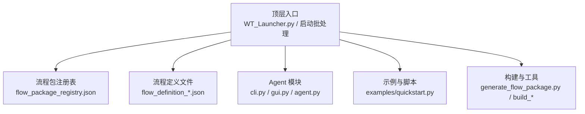
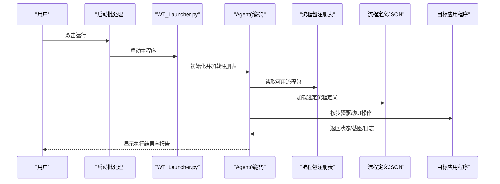
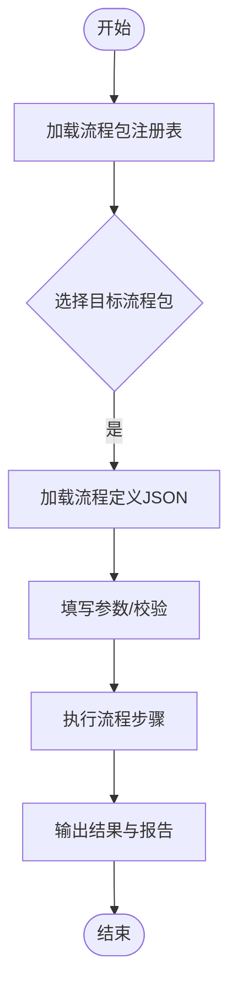
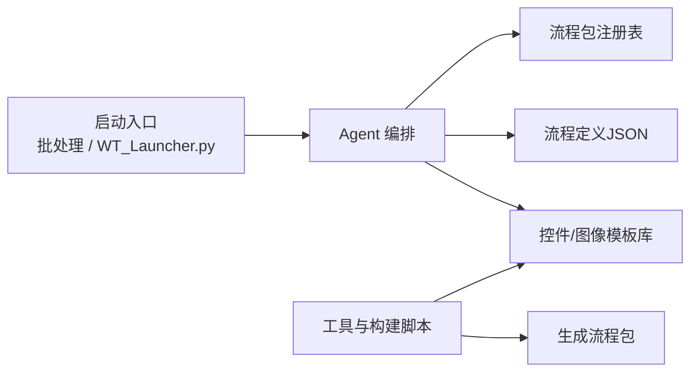

# 快速开始

<cite>
**本文引用的文件**   
- [README.md](file://README.md)
- [WT_Launcher.py](file://WT_Launcher.py)
- [启动WT自动化总控台.bat](file://启动WT自动化总控台.bat)
- [WT_AUT_recorded.py](file://WT_AUT_recorded.py)
- [WT_Automation.robot](file://WT_Automation.robot)
- [WT_Flow_Editor.py](file://WT_Flow_Editor.py)
- [flow_packages/flow_package_registry.json](file://flow_packages/flow_package_registry.json)
- [flow_packages/flow_definition_创建一个新建模.json](file://flow_packages/flow_definition_创建一个新建模.json)
- [WT_AUTOMATION_Agent/cli.py](file://WT_AUTOMATION_Agent/cli.py)
- [WT_AUTOMATION_Agent/gui.py](file://WT_AUTOMATION_Agent/gui.py)
- [WT_AUTOMATION_Agent/agent.py](file://WT_AUTOMATION_Agent/agent.py)
- [WT_AUTOMATION_Agent/examples/quickstart.py](file://WT_AUTOMATION_Agent/examples/quickstart.py)
- [tools/generate_flow_package.py](file://tools/generate_flow_package.py)
- [build_control_map_library.py](file://build_control_map_library.py)
- [build_image_template_library.py](file://build_image_template_library.py)
- [requirements-template-builder.txt](file://requirements-template-builder.txt)
</cite>

## 目录
1. [简介](#简介)
2. [项目结构](#项目结构)
3. [核心组件](#核心组件)
4. [架构总览](#架构总览)
5. [详细组件分析](#详细组件分析)
6. [依赖关系分析](#依赖关系分析)
7. [性能与稳定性建议](#性能与稳定性建议)
8. [故障排除指南](#故障排除指南)
9. [结论](#结论)
10. [附录](#附录)

## 简介
本快速开始指南面向首次接触 WT 自动化框架的用户，目标是在 30 分钟内完成环境准备、安装配置，并运行第一个自动化任务。内容涵盖：
- 环境与系统要求
- 逐步安装与环境配置
- 使用预定义流程包执行自动化
- 主程序启动方式与基本界面功能
- 编写第一个自动化脚本的教程
- 常见问题与排错

## 项目结构
仓库采用“应用入口 + 流程包 + 工具与示例”的分层组织方式：
- 顶层提供可执行入口（Python 脚本与批处理）
- flow_packages 存放已定义的流程包与注册表
- WT_AUTOMATION_Agent 提供 CLI/GUI/Agent 等能力
- tools 与构建脚本用于生成库与辅助工具
- samples 与 tests 提供示例与测试用例

图表来源
- [WT_Launcher.py](file://WT_Launcher.py)
- [flow_packages/flow_package_registry.json](file://flow_packages/flow_package_registry.json)
- [flow_packages/flow_definition_创建一个新建模.json](file://flow_packages/flow_definition_创建一个新建模.json)
- [WT_AUTOMATION_Agent/cli.py](file://WT_AUTOMATION_Agent/cli.py)
- [WT_AUTOMATION_Agent/gui.py](file://WT_AUTOMATION_Agent/gui.py)
- [WT_AUTOMATION_Agent/agent.py](file://WT_AUTOMATION_Agent/agent.py)
- [WT_AUTOMATION_Agent/examples/quickstart.py](file://WT_AUTOMATION_Agent/examples/quickstart.py)
- [tools/generate_flow_package.py](file://tools/generate_flow_package.py)

章节来源
- [README.md](file://README.md)
- [WT_Launcher.py](file://WT_Launcher.py)
- [启动WT自动化总控台.bat](file://启动WT自动化总控台.bat)
- [flow_packages/flow_package_registry.json](file://flow_packages/flow_package_registry.json)
- [flow_packages/flow_definition_创建一个新建模.json](file://flow_packages/flow_definition_创建一个新建模.json)
- [WT_AUTOMATION_Agent/cli.py](file://WT_AUTOMATION_Agent/cli.py)
- [WT_AUTOMATION_Agent/gui.py](file://WT_AUTOMATION_Agent/gui.py)
- [WT_AUTOMATION_Agent/agent.py](file://WT_AUTOMATION_Agent/agent.py)
- [WT_AUTOMATION_Agent/examples/quickstart.py](file://WT_AUTOMATION_Agent/examples/quickstart.py)
- [tools/generate_flow_package.py](file://tools/generate_flow_package.py)

## 核心组件
- 流程包与注册表
  - 流程包注册表集中管理可用流程包的元数据与路径映射，便于统一加载与选择。
  - 单个流程定义以 JSON 描述步骤序列与参数，支持可视化编辑与回放。
- Agent 子系统
  - CLI：命令行接口，便于在终端或 CI 中调用。
  - GUI：图形界面，提供流程选择、参数配置与执行监控。
  - Agent：编排与调度逻辑，负责解析流程、驱动 UI 操作与结果上报。
- 示例与脚本
  - quickstart.py：最小化示例，演示如何加载流程包并执行。
  - recorded 脚本与 Robot 文件：展示录制回放与 RPA 集成方式。
- 构建与工具
  - generate_flow_package.py：从模板或记录生成流程包。
  - build_*：构建控件库与图像模板库，提升定位稳定性。

章节来源
- [flow_packages/flow_package_registry.json](file://flow_packages/flow_package_registry.json)
- [flow_packages/flow_definition_创建一个新建模.json](file://flow_packages/flow_definition_创建一个新建模.json)
- [WT_AUTOMATION_Agent/cli.py](file://WT_AUTOMATION_Agent/cli.py)
- [WT_AUTOMATION_Agent/gui.py](file://WT_AUTOMATION_Agent/gui.py)
- [WT_AUTOMATION_Agent/agent.py](file://WT_AUTOMATION_Agent/agent.py)
- [WT_AUTOMATION_Agent/examples/quickstart.py](file://WT_AUTOMATION_Agent/examples/quickstart.py)
- [tools/generate_flow_package.py](file://tools/generate_flow_package.py)

## 架构总览
下图展示了用户通过不同入口触发流程执行的总体交互关系。

图表来源
- [启动WT自动化总控台.bat](file://启动WT自动化总控台.bat)
- [WT_Launcher.py](file://WT_Launcher.py)
- [WT_AUTOMATION_Agent/agent.py](file://WT_AUTOMATION_Agent/agent.py)
- [flow_packages/flow_package_registry.json](file://flow_packages/flow_package_registry.json)
- [flow_packages/flow_definition_创建一个新建模.json](file://flow_packages/flow_definition_创建一个新建模.json)

## 详细组件分析

### 环境要求与兼容性
- 操作系统
  - Windows（桌面端 UI 自动化依赖 Windows UI 体系）。
- Python 版本
  - 建议使用 Python 3.9+（根据第三方依赖要求调整）。
- 关键依赖
  - UI 自动化与图像处理相关库（如 pywinauto、OpenCV 等），具体以 requirements 与构建脚本为准。
- 可选组件
  - Tesseract OCR（如需 OCR 识别）、外部捕获桥接工具等。

章节来源
- [requirements-template-builder.txt](file://requirements-template-builder.txt)
- [build_control_map_library.py](file://build_control_map_library.py)
- [build_image_template_library.py](file://build_image_template_library.py)

### 安装与环境配置（逐步）
- 步骤一：准备 Python 环境
  - 安装 Python 3.9+，并确保 pip 可用。
- 步骤二：克隆仓库
  - 将仓库克隆到本地工作目录。
- 步骤三：安装依赖
  - 使用 pip 安装所需依赖包（参考 requirements 与构建脚本中的依赖声明）。
- 步骤四：构建控件与图像模板库（推荐）
  - 运行构建脚本生成控件映射与图像模板，提高后续定位稳定性。
- 步骤五：验证安装
  - 通过示例脚本或批处理启动器进行简单验证。

章节来源
- [requirements-template-builder.txt](file://requirements-template-builder.txt)
- [build_control_map_library.py](file://build_control_map_library.py)
- [build_image_template_library.py](file://build_image_template_library.py)

### 使用预定义流程包执行自动化
- 找到流程包注册表，确认目标流程包存在且路径正确。
- 通过 GUI 或 CLI 选择流程包，加载对应的流程定义 JSON。
- 填写必要参数后执行，观察执行日志与结果。

图表来源
- [flow_packages/flow_package_registry.json](file://flow_packages/flow_package_registry.json)
- [flow_packages/flow_definition_创建一个新建模.json](file://flow_packages/flow_definition_创建一个新建模.json)

章节来源
- [flow_packages/flow_package_registry.json](file://flow_packages/flow_package_registry.json)
- [flow_packages/flow_definition_创建一个新建模.json](file://flow_packages/flow_definition_创建一个新建模.json)

### 主程序启动方式与基本界面功能
- 启动方式
  - 双击“启动WT自动化总控台.bat”，或在命令行运行 WT_Launcher.py。
- 基本界面功能
  - 流程包选择与预览
  - 参数配置与校验
  - 执行控制（开始/暂停/停止）
  - 实时日志与结果查看
  - 导出报告与截图

章节来源
- [启动WT自动化总控台.bat](file://启动WT自动化总控台.bat)
- [WT_Launcher.py](file://WT_Launcher.py)
- [WT_AUTOMATION_Agent/gui.py](file://WT_AUTOMATION_Agent/gui.py)

### 第一个自动化脚本教程（基于示例）
- 打开示例脚本 quickstart.py，了解其结构与调用方式。
- 修改示例中的流程包名称或路径，指向你希望执行的流程定义。
- 运行脚本，观察控制台输出与生成的报告。
- 进阶：结合 CLI 或 GUI 传入参数，实现更灵活的执行。

章节来源
- [WT_AUTOMATION_Agent/examples/quickstart.py](file://WT_AUTOMATION_Agent/examples/quickstart.py)
- [WT_AUTOMATION_Agent/cli.py](file://WT_AUTOMATION_Agent/cli.py)
- [WT_AUTOMATION_Agent/agent.py](file://WT_AUTOMATION_Agent/agent.py)

### 录制与回放（可选）
- 使用录制的 Python 脚本或 Robot 文件进行回放，适合快速复用已有操作。
- 适用于需要稳定复现的操作场景，可作为流程定义的补充。

章节来源
- [WT_AUT_recorded.py](file://WT_AUT_recorded.py)
- [WT_Automation.robot](file://WT_Automation.robot)

## 依赖关系分析
- 入口与编排
  - 启动批处理与主程序负责初始化与引导。
  - Agent 负责流程解析、参数校验与执行调度。
- 数据与资源
  - 流程包注册表与流程定义 JSON 为执行输入。
  - 控件映射与图像模板提升定位鲁棒性。
- 扩展与工具
  - 生成流程包与构建库的工具链，便于持续维护与迭代。

图表来源
- [启动WT自动化总控台.bat](file://启动WT自动化总控台.bat)
- [WT_Launcher.py](file://WT_Launcher.py)
- [WT_AUTOMATION_Agent/agent.py](file://WT_AUTOMATION_Agent/agent.py)
- [flow_packages/flow_package_registry.json](file://flow_packages/flow_package_registry.json)
- [flow_packages/flow_definition_创建一个新建模.json](file://flow_packages/flow_definition_创建一个新建模.json)
- [build_control_map_library.py](file://build_control_map_library.py)
- [build_image_template_library.py](file://build_image_template_library.py)
- [tools/generate_flow_package.py](file://tools/generate_flow_package.py)

章节来源
- [WT_AUTOMATION_Agent/agent.py](file://WT_AUTOMATION_Agent/agent.py)
- [flow_packages/flow_package_registry.json](file://flow_packages/flow_package_registry.json)
- [build_control_map_library.py](file://build_control_map_library.py)
- [build_image_template_library.py](file://build_image_template_library.py)
- [tools/generate_flow_package.py](file://tools/generate_flow_package.py)

## 性能与稳定性建议
- 优先使用控件映射与图像模板库，减少纯坐标点击带来的不稳定。
- 合理拆分流程包，避免单包过大导致执行时间过长。
- 在执行前进行参数校验与流程定义检查，降低运行时错误概率。
- 对耗时操作增加等待与重试策略，提升容错能力。

[本节为通用建议，不直接分析具体文件]

## 故障排除指南
- 无法启动主程序
  - 检查 Python 版本与 pip 是否可用；确认依赖已安装。
  - 尝试直接运行 WT_Launcher.py 查看报错信息。
- 找不到流程包或流程定义
  - 核对 flow_package_registry.json 中的路径是否正确。
  - 确保流程定义 JSON 文件存在且格式合法。
- UI 定位失败或点击无效
  - 重新构建控件映射与图像模板库。
  - 检查目标窗口标题、层级与可见性。
- OCR 或外部捕获异常
  - 确认 Tesseract 安装路径与环境变量配置。
  - 检查外部捕获桥接工具是否正常运行。

章节来源
- [WT_Launcher.py](file://WT_Launcher.py)
- [flow_packages/flow_package_registry.json](file://flow_packages/flow_package_registry.json)
- [build_control_map_library.py](file://build_control_map_library.py)
- [build_image_template_library.py](file://build_image_template_library.py)

## 结论
通过以上步骤，你可以在 30 分钟内完成环境搭建、安装配置，并使用预定义流程包成功执行第一个自动化任务。建议后续结合示例脚本与 CLI/GUI 能力，逐步扩展你的自动化流程。

[本节为总结性内容，不直接分析具体文件]

## 附录
- 常用入口
  - 批处理：启动WT自动化总控台.bat
  - Python 入口：WT_Launcher.py
  - 编辑器：WT_Flow_Editor.py
- 示例与脚本
  - 示例：WT_AUTOMATION_Agent/examples/quickstart.py
  - 录制脚本：WT_AUT_recorded.py
  - Robot 集成：WT_Automation.robot
- 工具与构建
  - 生成流程包：tools/generate_flow_package.py
  - 构建控件库：build_control_map_library.py
  - 构建图像模板库：build_image_template_library.py

章节来源
- [启动WT自动化总控台.bat](file://启动WT自动化总控台.bat)
- [WT_Launcher.py](file://WT_Launcher.py)
- [WT_Flow_Editor.py](file://WT_Flow_Editor.py)
- [WT_AUTOMATION_Agent/examples/quickstart.py](file://WT_AUTOMATION_Agent/examples/quickstart.py)
- [WT_AUT_recorded.py](file://WT_AUT_recorded.py)
- [WT_Automation.robot](file://WT_Automation.robot)
- [tools/generate_flow_package.py](file://tools/generate_flow_package.py)
- [build_control_map_library.py](file://build_control_map_library.py)
- [build_image_template_library.py](file://build_image_template_library.py)