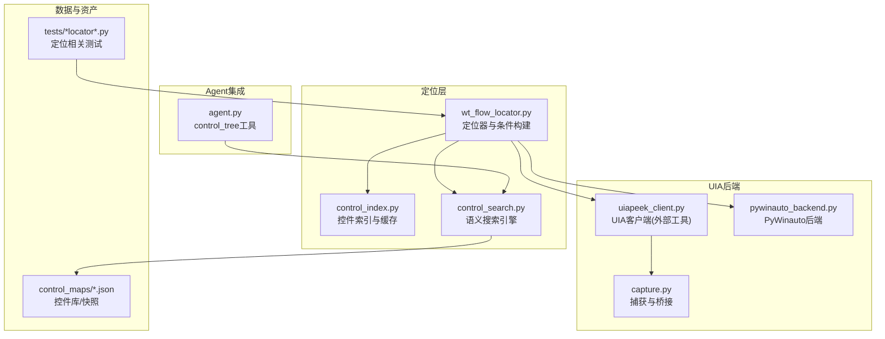
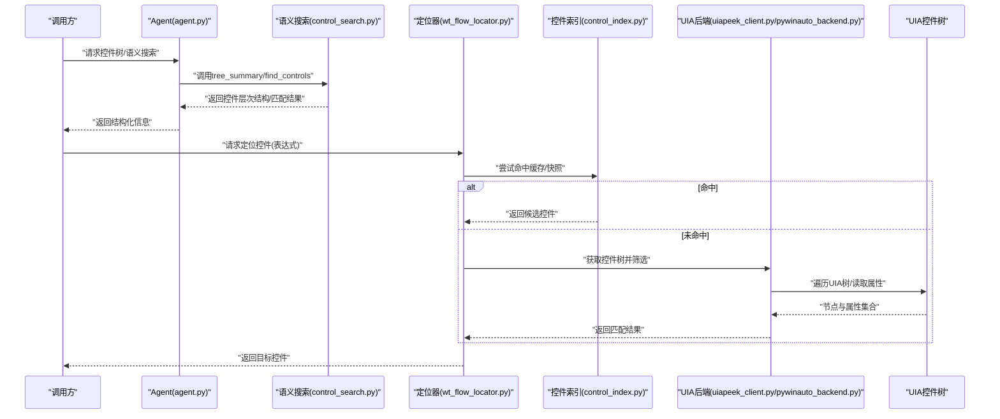
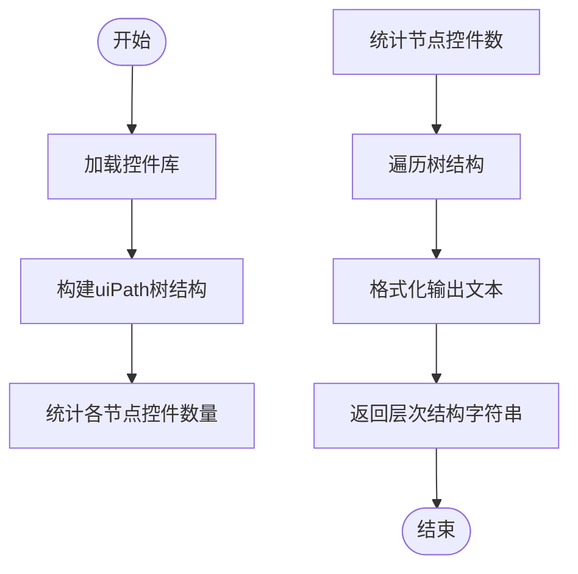
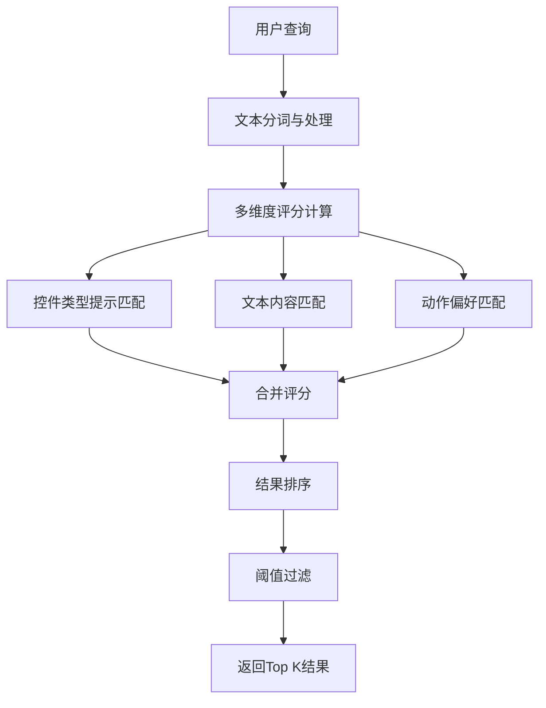
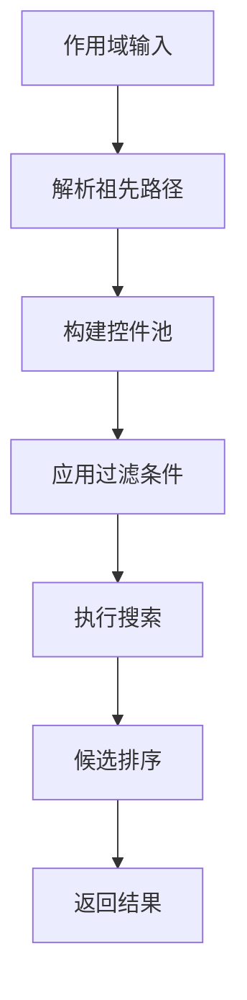
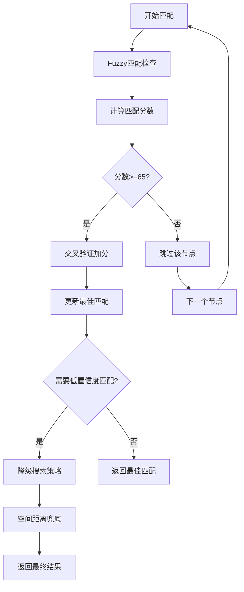
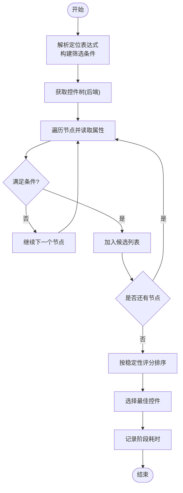
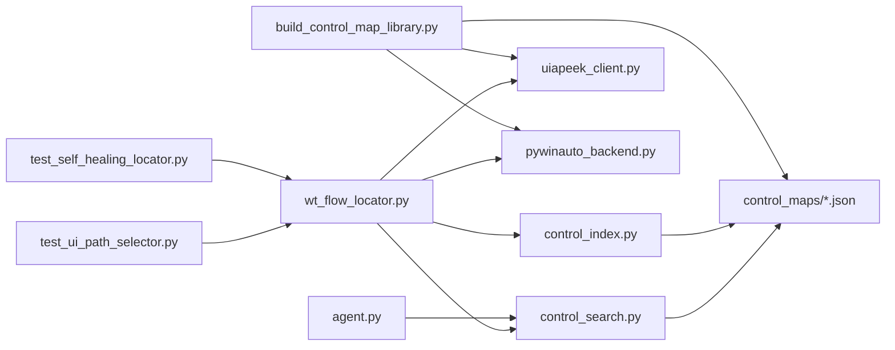

# UIA控件定位器

<cite>
**本文引用的文件**   
- [wt_flow_locator.py](file://wt_flow_locator.py)
- [control_index.py](file://WT_AUTOMATION_Agent/control_index.py)
- [uiapeek_client.py](file://tools/external_capture/uiapeek_client.py)
- [pywinauto_backend.py](file://tools/external_capture/pywinauto_backend.py)
- [capture.py](file://tools/external_capture/capture.py)
- [test_ui_path_selector.py](file://tests/test_ui_path_selector.py)
- [test_self_healing_locator.py](file://tests/test_self_healing_locator.py)
- [library_主面板_WPF_controls.json](file://control_maps/library_主面板_WPF_controls.json)
- [总控件信息.json](file://control_maps/总控件信息.json)
- [build_control_map_library.py](file://build_control_map_library.py)
- [control_search.py](file://WT_AUTOMATION_Agent/control_search.py)
- [agent.py](file://WT_AUTOMATION_Agent/agent.py)
</cite>

## 更新摘要
**所做更改**   
- 新增control_tree函数章节，详细说明应用控件层次结构的获取和分析
- 增加语义搜索功能说明，包括自然语言查询和智能匹配算法
- 更新作用域内搜索机制，支持在指定窗口/视图范围内精确查找
- 增强模糊匹配和置信度评分系统，提供更准确的控件识别
- 补充tree_summary函数的树结构大纲生成功能
- 优化性能考量部分，反映新的搜索算法和缓存机制

## 目录
1. [简介](#简介)
2. [项目结构](#项目结构)
3. [核心组件](#核心组件)
4. [架构总览](#架构总览)
5. [详细组件分析](#详细组件分析)
6. [依赖关系分析](#依赖关系分析)
7. [性能考量](#性能考量)
8. [故障排查指南](#故障排查指南)
9. [结论](#结论)
10. [附录](#附录)

## 简介
本文件系统性介绍基于UI Automation（UIA）的控件定位策略，包括UIA树遍历原理、属性匹配与条件筛选机制、定位器配置参数（控件类型、名称、类名、自动化ID等）、典型使用流程、性能特征与适用场景，以及与图像匹配、相对坐标等其他定位方式的对比。同时提供调试UIA控件树的方法与常见问题解决方案，帮助读者在复杂桌面应用中稳定高效地实现自动化操作。

**更新** 本次更新重点介绍了新增的control_tree函数、语义搜索能力、作用域内搜索、模糊匹配和置信度评分系统，这些改进显著提升了UIA定位系统的智能化水平和准确性。

## 项目结构
本项目围绕"流程驱动+多后端定位"的架构组织，UIA定位能力由多个模块协同完成：
- 定位器与索引：负责解析定位表达式、构建筛选条件、缓存与检索控件映射
- UIA后端：通过系统UIA接口或外部工具获取控件树与属性
- 控件库与快照：记录窗口与控件元数据，辅助快速定位与回归校验
- 语义搜索引擎：提供自然语言查询和智能匹配能力
- 测试与示例：验证定位逻辑、路径选择与自愈能力

**图表来源**
- [wt_flow_locator.py](file://wt_flow_locator.py)
- [control_index.py](file://WT_AUTOMATION_Agent/control_index.py)
- [control_search.py](file://WT_AUTOMATION_Agent/control_search.py)
- [agent.py](file://WT_AUTOMATION_Agent/agent.py)
- [uiapeek_client.py](file://tools/external_capture/uiapeek_client.py)
- [pywinauto_backend.py](file://tools/external_capture/pywinauto_backend.py)
- [capture.py](file://tools/external_capture/capture.py)
- [library_主面板_WPF_controls.json](file://control_maps/library_主面板_WPF_controls.json)
- [总控件信息.json](file://control_maps/总控件信息.json)

## 核心组件
- 定位器与条件构建：封装UIA查询条件，支持按控件类型、名称、类名、自动化ID、可见性、启用状态、层级深度等组合筛选；提供路径选择与容错自愈策略。
- 控件索引与缓存：维护窗口级控件映射，加速重复定位；支持增量更新与版本化快照。
- UIA后端：统一抽象UIA访问方式，优先使用外部UIA客户端（如UiaPeek桥接），回退到PyWinauto后端。
- 语义搜索引擎：基于control_search.py实现，支持自然语言查询、作用域内搜索、模糊匹配和置信度评分。
- 控件库与快照：以JSON形式保存常用窗口的控件树片段与关键属性，用于快速匹配与回归校验。
- Agent集成：通过agent.py中的control_tree工具提供应用控件层次结构分析。

**更新** 新增了语义搜索引擎和Agent集成功能，显著提升了定位系统的智能化水平和用户体验。

## 架构总览
UIA定位的整体流程如下：
- 输入：定位表达式（包含控件类型、名称、类名、自动化ID等字段）或自然语言描述
- 处理：解析表达式→构建UIA条件→调用后端获取控件树→应用筛选→返回候选控件
- 输出：目标控件句柄/对象，供后续动作执行（点击、输入、拖拽等）

**图表来源**
- [agent.py](file://WT_AUTOMATION_Agent/agent.py)
- [control_search.py](file://WT_AUTOMATION_Agent/control_search.py)
- [wt_flow_locator.py](file://wt_flow_locator.py)
- [control_index.py](file://WT_AUTOMATION_Agent/control_index.py)
- [uiapeek_client.py](file://tools/external_capture/uiapeek_client.py)
- [pywinauto_backend.py](file://tools/external_capture/pywinauto_backend.py)

## 详细组件分析

### control_tree函数与应用控件层次结构
**新增** 系统现在提供control_tree函数，能够返回应用的完整控件层次结构，为UIA定位提供全局视角。

- **层次结构生成**：基于uiPath字段构建"Window > View > Container > Control"的分层树结构
- **统计信息**：每个节点显示叶控件数量和总控件数量，便于理解应用结构
- **深度控制**：支持max_depth参数控制树的深度，避免过深的层次结构
- **子节点限制**：通过max_children参数限制每个节点的子节点数量，提高可读性

**图表来源**
- [control_search.py:356-378](file://WT_AUTOMATION_Agent/control_search.py#L356-L378)
- [agent.py:1009-1017](file://WT_AUTOMATION_Agent/agent.py#L1009-L1017)

**章节来源**
- [control_search.py:356-378](file://WT_AUTOMATION_Agent/control_search.py#L356-L378)
- [agent.py:1009-1017](file://WT_AUTOMATION_Agent/agent.py#L1009-L1017)

### 语义搜索功能
**新增** 系统现在支持基于自然语言的语义搜索，能够理解用户意图并返回最匹配的控件。

- **智能评分算法**：综合targetValue、automationId、controlType、labelText等多个字段的匹配度
- **中文二元组匹配**：支持中文文本的二元组重叠计算，提高中文搜索准确性
- **动作语义对标**：根据操作步骤类型（click、type_text等）调整控件优先级
- **质量分级加权**：考虑控件的质量等级（推荐、忽略等）和出现频率

**图表来源**
- [control_search.py:405-502](file://WT_AUTOMATION_Agent/control_search.py#L405-L502)

**章节来源**
- [control_search.py:405-502](file://WT_AUTOMATION_Agent/control_search.py#L405-L502)

### 作用域内搜索机制
**新增** 系统支持在指定的窗口或视图范围内进行精确搜索，提高定位准确性和效率。

- **祖先路径过滤**：基于uiPath字段在指定祖先节点下搜索控件
- **多祖先支持**：支持传入多个祖先名称，进行OR逻辑的搜索范围限定
- **子树浏览模式**：不传查询条件时，直接列出指定子树内的所有控件
- **性能优化**：通过作用域限制减少不必要的控件扫描

**图表来源**
- [control_search.py:524-548](file://WT_AUTOMATION_Agent/control_search.py#L524-L548)

**章节来源**
- [control_search.py:524-548](file://WT_AUTOMATION_Agent/control_search.py#L524-L548)

### 模糊匹配与置信度评分
**增强** 系统现在集成了多种模糊匹配算法和置信度评分机制，提供更智能的控件识别。

- **Fuzzy匹配**：使用fuzz.ratio算法进行文本相似度计算，阈值设为65分
- **交叉验证加分**：automationId、className、controlType等多字段交叉验证
- **低置信度匹配**：当高置信度匹配失败时，自动降级到低置信度匹配策略
- **空间距离兜底**：基于boundingBox的空间距离计算作为最后手段

**图表来源**
- [wt_flow_locator.py:3729-3766](file://wt_flow_locator.py#L3729-L3766)
- [wt_flow_locator.py:4037-4097](file://wt_flow_locator.py#L4037-L4097)

**章节来源**
- [wt_flow_locator.py:3729-3766](file://wt_flow_locator.py#L3729-L3766)
- [wt_flow_locator.py:4037-4097](file://wt_flow_locator.py#L4037-L4097)

### UIA树遍历与条件筛选
- **树遍历**：从顶层窗口或进程根节点开始，递归枚举子节点，收集控件标识（类型、名称、类名、自动化ID、可见性、启用状态、层级深度等）。
- **条件筛选**：将定位表达式转换为UIA条件，支持AND/OR组合、模糊匹配、前缀匹配、正则匹配等；对动态内容采用宽松匹配与排序策略。
- **路径选择**：当存在多个候选时，依据稳定性评分（如自动化ID优先、名称唯一性、层级深度、可见性等）选择最优控件。
- **阶段计时**：新增四个阶段的耗时统计，包括窗口枚举、快速查询、整树fallback、JSON fallback等阶段。

**图表来源**
- [wt_flow_locator.py:3894-4100](file://wt_flow_locator.py#L3894-L4100)

**章节来源**
- [wt_flow_locator.py:3894-4100](file://wt_flow_locator.py#L3894-L4100)

### 定位器配置参数
- **控件类型**：如按钮、编辑框、列表项、树节点等，用于缩小搜索范围。
- **名称/标题**：文本标签或显示名称，支持模糊与前缀匹配。
- **类名**：底层控件类名，适合Win32/WPF等不同框架的区分。
- **自动化ID**：最稳定的标识符，优先使用。
- **可见性与启用状态**：过滤不可见或禁用的控件。
- **层级深度与父控件**：限定在特定容器内查找，提升准确性。
- **自定义属性**：根据具体应用扩展的属性键值对。
- **Control Patterns**：支持更精细的控件行为匹配。
- **置信度阈值**：可配置的匹配置信度阈值，平衡准确率与召回率。

**更新** 增加了置信度阈值配置选项，支持更灵活的匹配策略调整。

### 使用示例与操作流程
- **基本定位**：通过控件类型+自动化ID进行精确匹配。
- **语义搜索**：使用自然语言描述控件，如"查找风机类型创建按钮"。
- **作用域搜索**：在指定窗口内搜索，如"在MUPWindTurbineTypeMainView中查找下拉框"。
- **组合条件**：类型+名称+父容器，提高鲁棒性。
- **路径选择**：当存在多个同名控件时，结合层级与可见性选择目标。
- **自愈策略**：当控件属性发生漂移时，自动降级匹配策略（如从自动化ID回退到名称+类名）。
- **置信度控制**：根据应用场景调整置信度阈值，平衡准确率和召回率。

**更新** 新增了语义搜索和作用域搜索的使用指导。

### 与其他定位策略的对比
- **图像匹配**：适用于视觉强相关的场景，但易受分辨率、主题变化影响；UIA更稳定且语义化。
- **相对坐标**：简单直接，但对布局变化敏感；UIA基于控件语义，抗布局变化能力强。
- **DOM/元素选择器**：Web端成熟；桌面端UIA提供类似能力，但需关注不同框架（Win32/WPF/UWP）的差异。
- **传统搜索 vs 语义搜索**：传统搜索依赖精确匹配，语义搜索支持自然语言和智能匹配。
- **全局搜索 vs 作用域搜索**：全局搜索覆盖范围广但速度慢，作用域搜索精度高且效率高。

**更新** 新增了语义搜索与传统搜索、作用域搜索与全局搜索的对比说明。

## 依赖关系分析
- 定位器依赖后端抽象，可切换UIA客户端或PyWinauto后端。
- 控件索引依赖快照与库文件，提供快速命中与回归校验。
- 语义搜索依赖控件库文件，提供智能匹配能力。
- Agent集成提供control_tree工具，方便上层调用。
- 测试用例覆盖路径选择与自愈逻辑，确保定位器在不同环境下的稳定性。

**图表来源**
- [wt_flow_locator.py](file://wt_flow_locator.py)
- [control_index.py](file://WT_AUTOMATION_Agent/control_index.py)
- [control_search.py](file://WT_AUTOMATION_Agent/control_search.py)
- [agent.py](file://WT_AUTOMATION_Agent/agent.py)
- [uiapeek_client.py](file://tools/external_capture/uiapeek_client.py)
- [pywinauto_backend.py](file://tools/external_capture/pywinauto_backend.py)
- [library_主面板_WPF_controls.json](file://control_maps/library_主面板_WPF_controls.json)
- [总控件信息.json](file://control_maps/总控件信息.json)
- [test_ui_path_selector.py](file://tests/test_ui_path_selector.py)
- [test_self_healing_locator.py](file://tests/test_self_healing_locator.py)
- [build_control_map_library.py](file://build_control_map_library.py)

## 性能考量
- **树遍历开销**：大型UIA树可能导致遍历耗时，建议限定父容器与层级深度以减少扫描范围。
- **条件优先级**：优先使用自动化ID与控件类型，减少模糊匹配带来的额外计算。
- **缓存与快照**：利用控件索引与快照命中，避免重复遍历；定期更新快照以保持准确性。
- **后端选择**：外部UIA客户端通常更高效，PyWinauto作为回退方案。
- **语义搜索优化**：控件库缓存和树索引显著提升搜索性能。
- **作用域限制**：通过within参数限制搜索范围，减少不必要的扫描。
- **置信度阈值**：合理设置置信度阈值，平衡搜索速度与准确率。
- **阶段计时**：监控各阶段耗时，识别性能瓶颈。

**更新** 新增了语义搜索优化、作用域限制和置信度阈值调优的性能指导。

## 故障排查指南
- **无法找到控件**：检查控件是否可见/启用；确认自动化ID是否存在；放宽匹配策略（名称+类名）。
- **动态内容导致不稳定**：引入父容器与层级约束；增加稳定性评分权重。
- **跨框架差异**：注意Win32/WPF/UWP的属性命名差异；必要时使用类名辅助识别。
- **调试UIA树**：借助control_tree工具导出控件树快照，对照库文件定位差异。
- **自愈失败**：检查自愈策略配置；逐步降级匹配条件并记录日志以便分析。
- **语义搜索不准确**：检查控件库数据完整性；调整评分权重和阈值。
- **作用域搜索无结果**：确认祖先路径正确性；检查uiPath字段格式。
- **性能问题**：监控阶段计时；优化搜索范围和置信度阈值。

**更新** 新增了语义搜索、作用域搜索和性能调优的故障排查指导。

## 结论
UIA定位器通过语义化的控件属性与条件筛选，提供了稳定高效的桌面自动化能力。结合控件索引与快照，可在复杂应用中实现高鲁棒性的定位与自愈。新增的semantic search、scope search、fuzzy matching和confidence scoring功能进一步提升了系统的智能化水平和准确性。合理配置定位参数、优化遍历范围与选择合适的后端，是保证性能与稳定性的关键。

**更新** 新增的智能搜索功能和置信度评分系统，为复杂桌面应用的自动化提供了更强大的支持和更好的用户体验。

## 附录
- **术语表**
  - **UIA**：Windows UI Automation，提供跨框架的控件访问能力
  - **自动化ID**：控件的唯一标识符，推荐优先使用
  - **自愈**：定位失败时自动降级匹配策略的能力
  - **语义搜索**：基于自然语言的智能控件搜索
  - **作用域搜索**：在指定范围内进行精确搜索
  - **置信度评分**：衡量匹配结果的可靠程度
  - **control_tree**：返回应用控件层次结构的工具函数
  - **tree_summary**：生成控件树结构大纲的函数
- **参考资源**
  - **控件库与快照**：位于control_maps目录，便于快速定位与回归
  - **测试用例**：tests目录下与定位相关的测试，可作为使用参考
  - **构建工具**：build_control_map_library.py提供强大的控件库构建功能
  - **Agent工具**：agent.py中的control_tree工具，提供层次结构分析

**更新** 新增了语义搜索、作用域搜索、置信度评分等相关术语的解释。