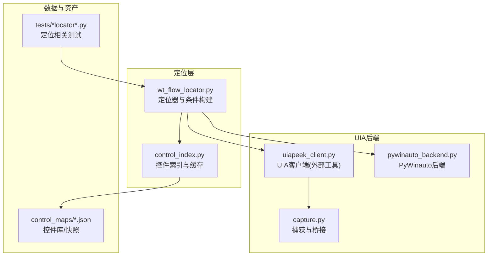
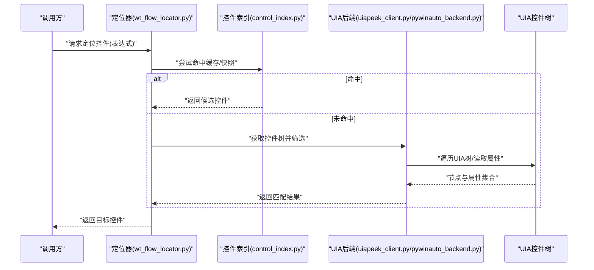
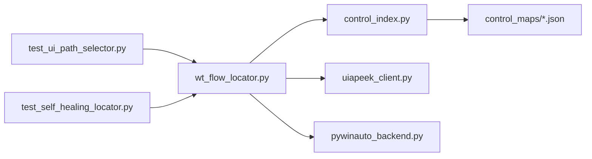

# UIA控件定位器

<cite>
**本文引用的文件**   
- [wt_flow_locator.py](file://wt_flow_locator.py)
- [control_index.py](file://WT_AUTOMATION_Agent/control_index.py)
- [uiapeek_client.py](file://tools/external_capture/uiapeek_client.py)
- [pywinauto_backend.py](file://tools/external_capture/pywinauto_backend.py)
- [capture.py](file://tools/external_capture/capture.py)
- [test_ui_path_selector.py](file://tests/test_ui_path_selector.py)
- [test_self_healing_locator.py](file://tests/test_self_healing_locator.py)
- [library_主面板_WPF_controls.json](file://control_maps/library_主面板_WPF_controls.json)
- [总控件信息.json](file://control_maps/总控件信息.json)
</cite>

## 目录
1. [简介](#简介)
2. [项目结构](#项目结构)
3. [核心组件](#核心组件)
4. [架构总览](#架构总览)
5. [详细组件分析](#详细组件分析)
6. [依赖关系分析](#依赖关系分析)
7. [性能考量](#性能考量)
8. [故障排查指南](#故障排查指南)
9. [结论](#结论)
10. [附录](#附录)

## 简介
本文件系统性介绍基于UI Automation（UIA）的控件定位策略，包括UIA树遍历原理、属性匹配与条件筛选机制、定位器配置参数（控件类型、名称、类名、自动化ID等）、典型使用流程、性能特征与适用场景，以及与图像匹配、相对坐标等其他定位方式的对比。同时提供调试UIA控件树的方法与常见问题解决方案，帮助读者在复杂桌面应用中稳定高效地实现自动化操作。

## 项目结构
本项目围绕“流程驱动+多后端定位”的架构组织，UIA定位能力由多个模块协同完成：
- 定位器与索引：负责解析定位表达式、构建筛选条件、缓存与检索控件映射
- UIA后端：通过系统UIA接口或外部工具获取控件树与属性
- 测试与示例：验证定位逻辑、路径选择与自愈能力
- 控件库与快照：记录窗口与控件元数据，辅助快速定位与回归

图表来源
- [wt_flow_locator.py](file://wt_flow_locator.py)
- [control_index.py](file://WT_AUTOMATION_Agent/control_index.py)
- [uiapeek_client.py](file://tools/external_capture/uiapeek_client.py)
- [pywinauto_backend.py](file://tools/external_capture/pywinauto_backend.py)
- [capture.py](file://tools/external_capture/capture.py)
- [library_主面板_WPF_controls.json](file://control_maps/library_主面板_WPF_controls.json)
- [总控件信息.json](file://control_maps/总控件信息.json)

章节来源
- [wt_flow_locator.py](file://wt_flow_locator.py)
- [control_index.py](file://WT_AUTOMATION_Agent/control_index.py)
- [uiapeek_client.py](file://tools/external_capture/uiapeek_client.py)
- [pywinauto_backend.py](file://tools/external_capture/pywinauto_backend.py)
- [capture.py](file://tools/external_capture/capture.py)
- [test_ui_path_selector.py](file://tests/test_ui_path_selector.py)
- [test_self_healing_locator.py](file://tests/test_self_healing_locator.py)
- [library_主面板_WPF_controls.json](file://control_maps/library_主面板_WPF_controls.json)
- [总控件信息.json](file://control_maps/总控件信息.json)

## 核心组件
- 定位器与条件构建：封装UIA查询条件，支持按控件类型、名称、类名、自动化ID、可见性、启用状态、层级深度等组合筛选；提供路径选择与容错自愈策略。
- 控件索引与缓存：维护窗口级控件映射，加速重复定位；支持增量更新与版本化快照。
- UIA后端：统一抽象UIA访问方式，优先使用外部UIA客户端（如UiaPeek桥接），回退到PyWinauto后端。
- 控件库与快照：以JSON形式保存常用窗口的控件树片段与关键属性，用于快速匹配与回归校验。

章节来源
- [wt_flow_locator.py](file://wt_flow_locator.py)
- [control_index.py](file://WT_AUTOMATION_Agent/control_index.py)
- [uiapeek_client.py](file://tools/external_capture/uiapeek_client.py)
- [pywinauto_backend.py](file://tools/external_capture/pywinauto_backend.py)
- [library_主面板_WPF_controls.json](file://control_maps/library_主面板_WPF_controls.json)
- [总控件信息.json](file://control_maps/总控件信息.json)

## 架构总览
UIA定位的整体流程如下：
- 输入：定位表达式（包含控件类型、名称、类名、自动化ID等字段）
- 处理：解析表达式→构建UIA条件→调用后端获取控件树→应用筛选→返回候选控件
- 输出：目标控件句柄/对象，供后续动作执行（点击、输入、拖拽等）

图表来源
- [wt_flow_locator.py](file://wt_flow_locator.py)
- [control_index.py](file://WT_AUTOMATION_Agent/control_index.py)
- [uiapeek_client.py](file://tools/external_capture/uiapeek_client.py)
- [pywinauto_backend.py](file://tools/external_capture/pywinauto_backend.py)

## 详细组件分析

### UIA树遍历与条件筛选
- 树遍历：从顶层窗口或进程根节点开始，递归枚举子节点，收集控件标识（类型、名称、类名、自动化ID、可见性、启用状态、层级深度等）。
- 条件筛选：将定位表达式转换为UIA条件，支持AND/OR组合、模糊匹配、前缀匹配、正则匹配等；对动态内容采用宽松匹配与排序策略。
- 路径选择：当存在多个候选时，依据稳定性评分（如自动化ID优先、名称唯一性、层级深度、可见性等）选择最优控件。

图表来源
- [wt_flow_locator.py](file://wt_flow_locator.py)
- [uiapeek_client.py](file://tools/external_capture/uiapeek_client.py)
- [pywinauto_backend.py](file://tools/external_capture/pywinauto_backend.py)

章节来源
- [wt_flow_locator.py](file://wt_flow_locator.py)
- [uiapeek_client.py](file://tools/external_capture/uiapeek_client.py)
- [pywinauto_backend.py](file://tools/external_capture/pywinauto_backend.py)

### 定位器配置参数
- 控件类型：如按钮、编辑框、列表项、树节点等，用于缩小搜索范围。
- 名称/标题：文本标签或显示名称，支持模糊与前缀匹配。
- 类名：底层控件类名，适合Win32/WPF等不同框架的区分。
- 自动化ID：最稳定的标识符，优先使用。
- 可见性与启用状态：过滤不可见或禁用的控件。
- 层级深度与父控件：限定在特定容器内查找，提升准确性。
- 自定义属性：根据具体应用扩展的属性键值对。

章节来源
- [wt_flow_locator.py](file://wt_flow_locator.py)
- [control_index.py](file://WT_AUTOMATION_Agent/control_index.py)
- [library_主面板_WPF_controls.json](file://control_maps/library_主面板_WPF_controls.json)

### 使用示例与操作流程
- 基本定位：通过控件类型+自动化ID进行精确匹配。
- 组合条件：类型+名称+父容器，提高鲁棒性。
- 路径选择：当存在多个同名控件时，结合层级与可见性选择目标。
- 自愈策略：当控件属性发生漂移时，自动降级匹配策略（如从自动化ID回退到名称+类名）。

章节来源
- [test_ui_path_selector.py](file://tests/test_ui_path_selector.py)
- [test_self_healing_locator.py](file://tests/test_self_healing_locator.py)
- [wt_flow_locator.py](file://wt_flow_locator.py)

### 与其他定位策略的对比
- 图像匹配：适用于视觉强相关的场景，但易受分辨率、主题变化影响；UIA更稳定且语义化。
- 相对坐标：简单直接，但对布局变化敏感；UIA基于控件语义，抗布局变化能力强。
- DOM/元素选择器：Web端成熟；桌面端UIA提供类似能力，但需关注不同框架（Win32/WPF/UWP）的差异。

[本节为概念性说明，不直接分析具体文件]

## 依赖关系分析
- 定位器依赖后端抽象，可切换UIA客户端或PyWinauto后端。
- 控件索引依赖快照与库文件，提供快速命中与回归校验。
- 测试用例覆盖路径选择与自愈逻辑，确保定位器在不同环境下的稳定性。

图表来源
- [wt_flow_locator.py](file://wt_flow_locator.py)
- [control_index.py](file://WT_AUTOMATION_Agent/control_index.py)
- [uiapeek_client.py](file://tools/external_capture/uiapeek_client.py)
- [pywinauto_backend.py](file://tools/external_capture/pywinauto_backend.py)
- [library_主面板_WPF_controls.json](file://control_maps/library_主面板_WPF_controls.json)
- [总控件信息.json](file://control_maps/总控件信息.json)
- [test_ui_path_selector.py](file://tests/test_ui_path_selector.py)
- [test_self_healing_locator.py](file://tests/test_self_healing_locator.py)

章节来源
- [wt_flow_locator.py](file://wt_flow_locator.py)
- [control_index.py](file://WT_AUTOMATION_Agent/control_index.py)
- [uiapeek_client.py](file://tools/external_capture/uiapeek_client.py)
- [pywinauto_backend.py](file://tools/external_capture/pywinauto_backend.py)
- [test_ui_path_selector.py](file://tests/test_ui_path_selector.py)
- [test_self_healing_locator.py](file://tests/test_self_healing_locator.py)
- [library_主面板_WPF_controls.json](file://control_maps/library_主面板_WPF_controls.json)
- [总控件信息.json](file://control_maps/总控件信息.json)

## 性能考量
- 树遍历开销：大型UIA树可能导致遍历耗时，建议限定父容器与层级深度以减少扫描范围。
- 条件优先级：优先使用自动化ID与控件类型，减少模糊匹配带来的额外计算。
- 缓存与快照：利用控件索引与快照命中，避免重复遍历；定期更新快照以保持准确性。
- 后端选择：外部UIA客户端通常更高效，PyWinauto作为回退方案。

[本节为通用指导，不直接分析具体文件]

## 故障排查指南
- 无法找到控件：检查控件是否可见/启用；确认自动化ID是否存在；放宽匹配策略（名称+类名）。
- 动态内容导致不稳定：引入父容器与层级约束；增加稳定性评分权重。
- 跨框架差异：注意Win32/WPF/UWP的属性命名差异；必要时使用类名辅助识别。
- 调试UIA树：借助外部工具（如UiaPeek）导出控件树快照，对照库文件定位差异。
- 自愈失败：检查自愈策略配置；逐步降级匹配条件并记录日志以便分析。

章节来源
- [uiapeek_client.py](file://tools/external_capture/uiapeek_client.py)
- [capture.py](file://tools/external_capture/capture.py)
- [test_self_healing_locator.py](file://tests/test_self_healing_locator.py)
- [library_主面板_WPF_controls.json](file://control_maps/library_主面板_WPF_controls.json)
- [总控件信息.json](file://control_maps/总控件信息.json)

## 结论
UIA定位器通过语义化的控件属性与条件筛选，提供了稳定高效的桌面自动化能力。结合控件索引与快照，可在复杂应用中实现高鲁棒性的定位与自愈。合理配置定位参数、优化遍历范围与选择合适的后端，是保证性能与稳定性的关键。

[本节为总结性内容，不直接分析具体文件]

## 附录
- 术语表
  - UIA：Windows UI Automation，提供跨框架的控件访问能力
  - 自动化ID：控件的唯一标识符，推荐优先使用
  - 自愈：定位失败时自动降级匹配策略的能力
- 参考资源
  - 控件库与快照：位于control_maps目录，便于快速定位与回归
  - 测试用例：tests目录下与定位相关的测试，可作为使用参考

[本节为补充信息，不直接分析具体文件]