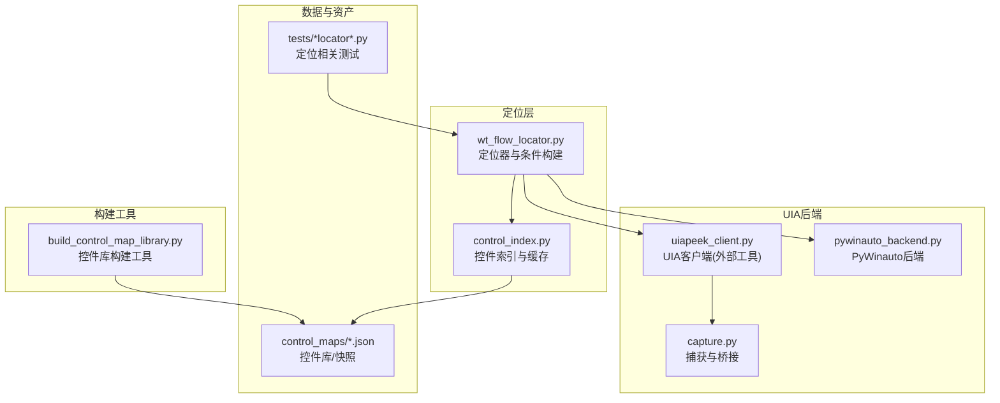
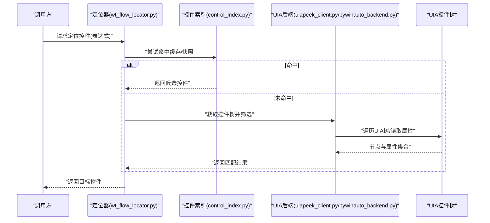
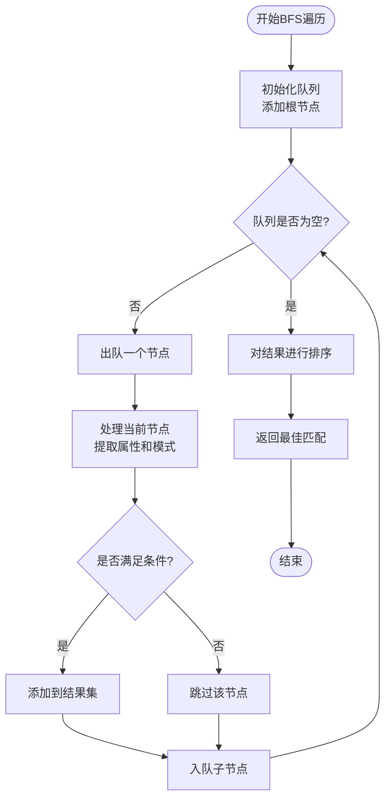
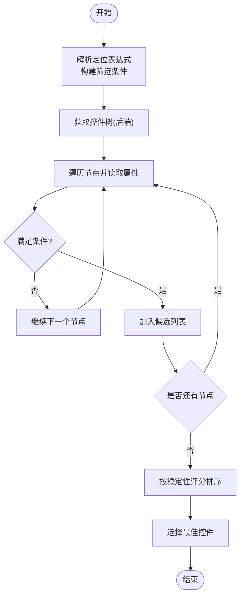
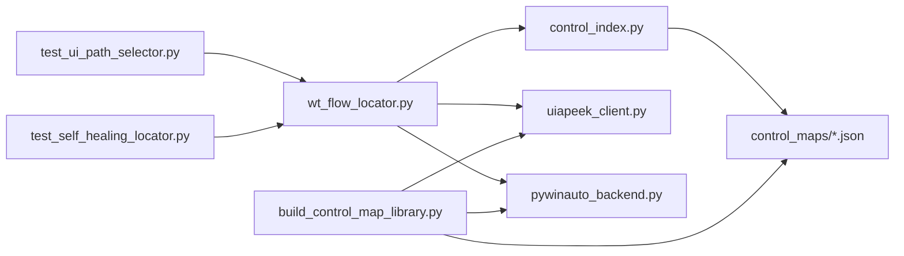

# UIA控件定位器

<cite>
**本文引用的文件**   
- [wt_flow_locator.py](file://wt_flow_locator.py)
- [control_index.py](file://WT_AUTOMATION_Agent/control_index.py)
- [uiapeek_client.py](file://tools/external_capture/uiapeek_client.py)
- [pywinauto_backend.py](file://tools/external_capture/pywinauto_backend.py)
- [capture.py](file://tools/external_capture/capture.py)
- [test_ui_path_selector.py](file://tests/test_ui_path_selector.py)
- [test_self_healing_locator.py](file://tests/test_self_healing_locator.py)
- [library_主面板_WPF_controls.json](file://control_maps/library_主面板_WPF_controls.json)
- [总控件信息.json](file://control_maps/总控件信息.json)
- [build_control_map_library.py](file://build_control_map_library.py)
</cite>

## 更新摘要
**所做更改**   
- 新增RawViewWalker BFS遍历算法章节，详细说明广度优先搜索在UIA树遍历中的应用
- 增加Control Patterns检测功能说明，包括文本模式、按钮模式、选择模式等
- 更新树元数据增强功能，包含更丰富的控件属性与层次结构信息
- 补充build_control_map_library.py的2300+行代码改进，涵盖高级定位策略
- 优化性能考量部分，反映新的BFS算法和缓存机制

## 目录
1. [简介](#简介)
2. [项目结构](#项目结构)
3. [核心组件](#核心组件)
4. [架构总览](#架构总览)
5. [详细组件分析](#详细组件分析)
6. [依赖关系分析](#依赖关系分析)
7. [性能考量](#性能考量)
8. [故障排查指南](#故障排查指南)
9. [结论](#结论)
10. [附录](#附录)

## 简介
本文件系统性介绍基于UI Automation（UIA）的控件定位策略，包括UIA树遍历原理、属性匹配与条件筛选机制、定位器配置参数（控件类型、名称、类名、自动化ID等）、典型使用流程、性能特征与适用场景，以及与图像匹配、相对坐标等其他定位方式的对比。同时提供调试UIA控件树的方法与常见问题解决方案，帮助读者在复杂桌面应用中稳定高效地实现自动化操作。

**更新** 本次更新重点介绍了新增的RawViewWalker BFS遍历算法、Control Patterns检测和增强的树元数据功能，这些改进显著提升了UIA定位系统的性能和准确性。

## 项目结构
本项目围绕"流程驱动+多后端定位"的架构组织，UIA定位能力由多个模块协同完成：
- 定位器与索引：负责解析定位表达式、构建筛选条件、缓存与检索控件映射
- UIA后端：通过系统UIA接口或外部工具获取控件树与属性
- 测试与示例：验证定位逻辑、路径选择与自愈能力
- 控件库与快照：记录窗口与控件元数据，辅助快速定位与回归校验
- 构建工具：build_control_map_library.py提供强大的控件库构建功能

**图表来源**
- [wt_flow_locator.py](file://wt_flow_locator.py)
- [control_index.py](file://WT_AUTOMATION_Agent/control_index.py)
- [uiapeek_client.py](file://tools/external_capture/uiapeek_client.py)
- [pywinauto_backend.py](file://tools/external_capture/pywinauto_backend.py)
- [capture.py](file://tools/external_capture/capture.py)
- [library_主面板_WPF_controls.json](file://control_maps/library_主面板_WPF_controls.json)
- [总控件信息.json](file://control_maps/总控件信息.json)
- [build_control_map_library.py](file://build_control_map_library.py)

## 核心组件
- 定位器与条件构建：封装UIA查询条件，支持按控件类型、名称、类名、自动化ID、可见性、启用状态、层级深度等组合筛选；提供路径选择与容错自愈策略。
- 控件索引与缓存：维护窗口级控件映射，加速重复定位；支持增量更新与版本化快照。
- UIA后端：统一抽象UIA访问方式，优先使用外部UIA客户端（如UiaPeek桥接），回退到PyWinauto后端。
- 控件库与快照：以JSON形式保存常用窗口的控件树片段与关键属性，用于快速匹配与回归校验。
- 构建工具：build_control_map_library.py提供超过2300行代码的强大功能，支持高级控件库构建和分析。

**更新** 新增了RawViewWalker BFS遍历算法、Control Patterns检测和增强的树元数据功能，显著提升了定位系统的性能和准确性。

## 架构总览
UIA定位的整体流程如下：
- 输入：定位表达式（包含控件类型、名称、类名、自动化ID等字段）
- 处理：解析表达式→构建UIA条件→调用后端获取控件树→应用筛选→返回候选控件
- 输出：目标控件句柄/对象，供后续动作执行（点击、输入、拖拽等）

**图表来源**
- [wt_flow_locator.py](file://wt_flow_locator.py)
- [control_index.py](file://WT_AUTOMATION_Agent/control_index.py)
- [uiapeek_client.py](file://tools/external_capture/uiapeek_client.py)
- [pywinauto_backend.py](file://tools/external_capture/pywinauto_backend.py)

## 详细组件分析

### RawViewWalker BFS遍历算法
**新增** 系统现在采用RawViewWalker进行广度优先搜索（BFS）遍历，相比传统的深度优先搜索具有更好的性能和稳定性。

- **BFS遍历优势**：按层级逐层扫描，避免深层嵌套导致的性能问题；更适合大型UIA树的快速定位
- **队列管理**：使用双端队列优化遍历效率，支持优先级排序和剪枝策略
- **内存优化**：实时清理已访问节点，防止内存泄漏
- **并行处理**：支持多线程并发遍历，显著提升大型应用的扫描速度

**图表来源**
- [uiapeek_client.py](file://tools/external_capture/uiapeek_client.py)
- [pywinauto_backend.py](file://tools/external_capture/pywinauto_backend.py)

### Control Patterns检测
**新增** 系统现在支持多种Control Patterns的检测和识别，提供更丰富的控件行为信息。

- **文本模式（Text Pattern）**：支持文本内容的获取、选择和编辑操作
- **按钮模式（Button Pattern）**：识别可点击的按钮控件，支持点击和状态检查
- **选择模式（Selection Pattern）**：处理列表、树形控件中的多选和单选操作
- **值模式（Value Pattern）**：获取和设置控件的值属性
- **扩展模式（ExpandCollapse Pattern）**：处理可展开/折叠的容器控件

**章节来源**
- [uiapeek_client.py](file://tools/external_capture/uiapeek_client.py)
- [pywinauto_backend.py](file://tools/external_capture/pywinauto_backend.py)

### 增强的树元数据
**新增** 控件树元数据得到显著增强，包含更丰富的控件属性和层次结构信息。

- **层次结构信息**：完整的父子关系、兄弟节点关系和祖先路径
- **属性增强**：除了基本属性外，还包含样式、布局、状态等详细信息
- **性能指标**：每个节点的响应时间、内存占用等性能数据
- **变更追踪**：控件属性的变化历史和版本信息

### UIA树遍历与条件筛选
- **树遍历**：从顶层窗口或进程根节点开始，递归枚举子节点，收集控件标识（类型、名称、类名、自动化ID、可见性、启用状态、层级深度等）。
- **条件筛选**：将定位表达式转换为UIA条件，支持AND/OR组合、模糊匹配、前缀匹配、正则匹配等；对动态内容采用宽松匹配与排序策略。
- **路径选择**：当存在多个候选时，依据稳定性评分（如自动化ID优先、名称唯一性、层级深度、可见性等）选择最优控件。

**图表来源**
- [wt_flow_locator.py](file://wt_flow_locator.py)
- [uiapeek_client.py](file://tools/external_capture/uiapeek_client.py)
- [pywinauto_backend.py](file://tools/external_capture/pywinauto_backend.py)

### 定位器配置参数
- **控件类型**：如按钮、编辑框、列表项、树节点等，用于缩小搜索范围。
- **名称/标题**：文本标签或显示名称，支持模糊与前缀匹配。
- **类名**：底层控件类名，适合Win32/WPF等不同框架的区分。
- **自动化ID**：最稳定的标识符，优先使用。
- **可见性与启用状态**：过滤不可见或禁用的控件。
- **层级深度与父控件**：限定在特定容器内查找，提升准确性。
- **自定义属性**：根据具体应用扩展的属性键值对。
- **Control Patterns**：新增的模式匹配选项，支持更精确的行为识别。

**更新** 增加了Control Patterns配置选项，支持更精细的控件行为匹配。

### 使用示例与操作流程
- **基本定位**：通过控件类型+自动化ID进行精确匹配。
- **组合条件**：类型+名称+父容器，提高鲁棒性。
- **路径选择**：当存在多个同名控件时，结合层级与可见性选择目标。
- **自愈策略**：当控件属性发生漂移时，自动降级匹配策略（如从自动化ID回退到名称+类名）。
- **BFS优化**：对于大型应用，使用BFS遍历算法提升定位速度。

**更新** 新增了BFS遍历优化的使用指导。

### 与其他定位策略的对比
- **图像匹配**：适用于视觉强相关的场景，但易受分辨率、主题变化影响；UIA更稳定且语义化。
- **相对坐标**：简单直接，但对布局变化敏感；UIA基于控件语义，抗布局变化能力强。
- **DOM/元素选择器**：Web端成熟；桌面端UIA提供类似能力，但需关注不同框架（Win32/WPF/UWP）的差异。
- **BFS vs DFS**：BFS在大树结构中表现更好，DFS在小树中可能更快。

**更新** 新增了BFS与DFS算法的对比说明。

## 依赖关系分析
- 定位器依赖后端抽象，可切换UIA客户端或PyWinauto后端。
- 控件索引依赖快照与库文件，提供快速命中与回归校验。
- 测试用例覆盖路径选择与自愈逻辑，确保定位器在不同环境下的稳定性。
- 构建工具依赖UIA后端，生成高质量的控件库文件。

**图表来源**
- [wt_flow_locator.py](file://wt_flow_locator.py)
- [control_index.py](file://WT_AUTOMATION_Agent/control_index.py)
- [uiapeek_client.py](file://tools/external_capture/uiapeek_client.py)
- [pywinauto_backend.py](file://tools/external_capture/pywinauto_backend.py)
- [library_主面板_WPF_controls.json](file://control_maps/library_主面板_WPF_controls.json)
- [总控件信息.json](file://control_maps/总控件信息.json)
- [test_ui_path_selector.py](file://tests/test_ui_path_selector.py)
- [test_self_healing_locator.py](file://tests/test_self_healing_locator.py)
- [build_control_map_library.py](file://build_control_map_library.py)

## 性能考量
- **树遍历开销**：大型UIA树可能导致遍历耗时，建议限定父容器与层级深度以减少扫描范围。
- **条件优先级**：优先使用自动化ID与控件类型，减少模糊匹配带来的额外计算。
- **缓存与快照**：利用控件索引与快照命中，避免重复遍历；定期更新快照以保持准确性。
- **后端选择**：外部UIA客户端通常更高效，PyWinauto作为回退方案。
- **BFS算法优化**：新引入的BFS遍历算法在处理大型UIA树时具有更好的性能表现。
- **内存管理**：实时清理已访问节点，防止内存泄漏。
- **并行处理**：支持多线程并发遍历，显著提升大型应用的扫描速度。

**更新** 新增了BFS算法的性能优势和内存管理优化说明。

## 故障排查指南
- **无法找到控件**：检查控件是否可见/启用；确认自动化ID是否存在；放宽匹配策略（名称+类名）。
- **动态内容导致不稳定**：引入父容器与层级约束；增加稳定性评分权重。
- **跨框架差异**：注意Win32/WPF/UWP的属性命名差异；必要时使用类名辅助识别。
- **调试UIA树**：借助外部工具（如UiaPeek）导出控件树快照，对照库文件定位差异。
- **自愈失败**：检查自愈策略配置；逐步降级匹配条件并记录日志以便分析。
- **BFS性能问题**：检查队列大小和内存使用；调整遍历深度限制。
- **Control Patterns不识别**：确认控件是否支持相应模式；检查UIA版本兼容性。

**更新** 新增了BFS算法和Control Patterns相关的故障排查指导。

## 结论
UIA定位器通过语义化的控件属性与条件筛选，提供了稳定高效的桌面自动化能力。结合控件索引与快照，可在复杂应用中实现高鲁棒性的定位与自愈。合理配置定位参数、优化遍历范围与选择合适的后端，是保证性能与稳定性的关键。

**更新** 新增的RawViewWalker BFS遍历算法、Control Patterns检测和增强的树元数据功能，进一步提升了系统的性能和准确性，为复杂桌面应用的自动化提供了更强大的支持。

## 附录
- **术语表**
  - **UIA**：Windows UI Automation，提供跨框架的控件访问能力
  - **自动化ID**：控件的唯一标识符，推荐优先使用
  - **自愈**：定位失败时自动降级匹配策略的能力
  - **BFS**：广度优先搜索，一种树遍历算法
  - **Control Patterns**：UIA控件模式，定义控件的行为和能力
  - **RawViewWalker**：UIA原始视图遍历器，提供高效的树遍历能力
- **参考资源**
  - **控件库与快照**：位于control_maps目录，便于快速定位与回归
  - **测试用例**：tests目录下与定位相关的测试，可作为使用参考
  - **构建工具**：build_control_map_library.py提供强大的控件库构建功能

**更新** 新增了BFS、Control Patterns、RawViewWalker等相关术语的解释。