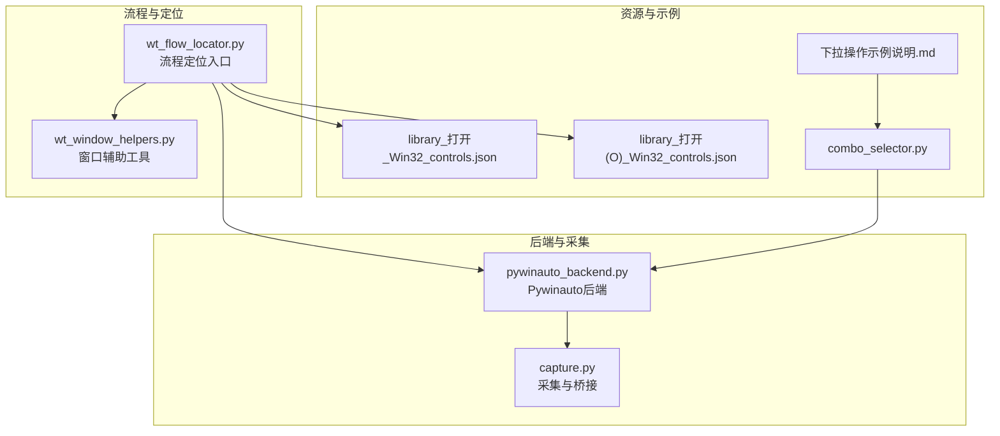
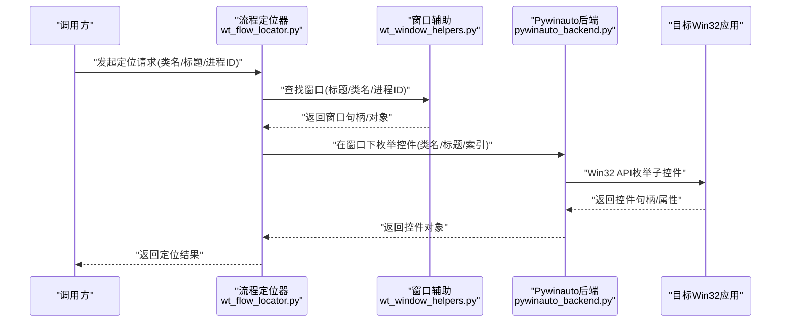
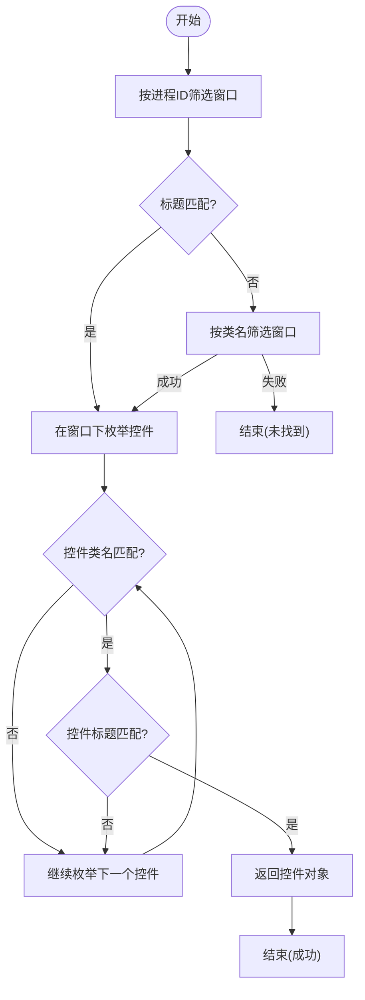
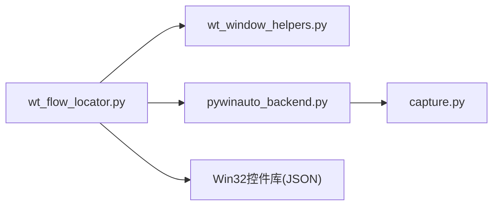

# Win32控件定位器

<cite>
**本文引用的文件**   
- [README.md](file://README.md)
- [wt_flow_locator.py](file://wt_flow_locator.py)
- [wt_window_helpers.py](file://wt_window_helpers.py)
- [tools/external_capture/pywinauto_backend.py](file://tools/external_capture/pywinauto_backend.py)
- [tools/external_capture/capture.py](file://tools/external_capture/capture.py)
- [control_maps/library_打开_Win32_controls.json](file://control_maps/library_打开_Win32_controls.json)
- [control_maps/library_打开(O)_Win32_controls.json](file://control_maps/library_打开(O)_Win32_controls.json)
- [samples/recorder_scripts/Skill/combo_selector.py](file://samples/recorder_scripts/Skill/combo_selector.py)
- [samples/recorder_scripts/Skill/下拉操作示例说明.md](file://samples/recorder_scripts/Skill/下拉操作示例说明.md)
</cite>

## 目录
1. [简介](#简介)
2. [项目结构](#项目结构)
3. [核心组件](#核心组件)
4. [架构总览](#架构总览)
5. [详细组件分析](#详细组件分析)
6. [依赖关系分析](#依赖关系分析)
7. [性能考虑](#性能考虑)
8. [故障排除指南](#故障排除指南)
9. [结论](#结论)
10. [附录](#附录)

## 简介
本文件面向基于Win32 API的控件自动化，系统性阐述控件定位策略与实现要点。内容覆盖：
- Win32窗口句柄操作、控件枚举与属性获取机制
- 通过类名、标题、进程ID等维度定位Win32控件的方法
- Pywinauto后端的集成使用方式（窗口查找、控件操作、事件处理）
- Win32定位器的优势与局限，以及适用场景建议
- 实际代码示例路径与调试技巧、常见问题排查

## 项目结构
本项目围绕“流程驱动+多后端定位”的架构组织，Win32相关能力主要分布在以下位置：
- 流程定位层：负责解析定位条件、选择后端并执行定位
- 窗口辅助层：封装窗口查找、进程过滤、句柄管理等通用能力
- Pywinauto后端：提供跨UI框架的统一接口，内部可调用Win32或UIA
- 录制与库：包含Win32控件库与录制脚本示例，便于快速上手

图表来源
- [wt_flow_locator.py](file://wt_flow_locator.py)
- [wt_window_helpers.py](file://wt_window_helpers.py)
- [tools/external_capture/pywinauto_backend.py](file://tools/external_capture/pywinauto_backend.py)
- [tools/external_capture/capture.py](file://tools/external_capture/capture.py)
- [control_maps/library_打开_Win32_controls.json](file://control_maps/library_打开_Win32_controls.json)
- [control_maps/library_打开(O)_Win32_controls.json](file://control_maps/library_打开(O)_Win32_controls.json)
- [samples/recorder_scripts/Skill/combo_selector.py](file://samples/recorder_scripts/Skill/combo_selector.py)
- [samples/recorder_scripts/Skill/下拉操作示例说明.md](file://samples/recorder_scripts/Skill/下拉操作示例说明.md)

章节来源
- [README.md](file://README.md)

## 核心组件
- 流程定位器（wt_flow_locator.py）
  - 职责：统一解析定位条件（如类名、标题、进程ID、索引等），选择合适后端（Win32/UIA/图像等），返回目标控件对象
  - 关键点：支持多条件组合、优先级策略、超时与重试、结果缓存
- 窗口辅助（wt_window_helpers.py）
  - 职责：窗口查找、进程过滤、句柄管理、可见性与启用状态判断
  - 关键点：按标题/类名/进程ID匹配；窗口层级遍历；句柄有效性校验
- Pywinauto后端（tools/external_capture/pywinauto_backend.py）
  - 职责：以Pywinauto为统一后端，向上暴露一致的API；内部根据目标应用特性选择Win32或UIA模式
  - 关键点：连接目标进程、枚举子控件、读写属性、触发事件（点击、输入、选择等）
- 采集与桥接（tools/external_capture/capture.py）
  - 职责：与外部采集工具交互，辅助定位与验证
  - 关键点：捕获窗口树、导出控件信息、与库映射联动

章节来源
- [wt_flow_locator.py](file://wt_flow_locator.py)
- [wt_window_helpers.py](file://wt_window_helpers.py)
- [tools/external_capture/pywinauto_backend.py](file://tools/external_capture/pywinauto_backend.py)
- [tools/external_capture/capture.py](file://tools/external_capture/capture.py)

## 架构总览
整体采用“前端流程定义 + 后端适配”的分层设计。定位请求进入流程定位器后，由窗口辅助完成窗口级筛选，再由Pywinauto后端进行控件级定位与操作。Win32控件库用于加速常见窗口的定位。

图表来源
- [wt_flow_locator.py](file://wt_flow_locator.py)
- [wt_window_helpers.py](file://wt_window_helpers.py)
- [tools/external_capture/pywinauto_backend.py](file://tools/external_capture/pywinauto_backend.py)

## 详细组件分析

### Win32窗口句柄与控件枚举
- 窗口查找
  - 依据：窗口标题、类名、进程ID
  - 行为：遍历顶层窗口，匹配条件后返回句柄；若存在多个匹配项，可按索引或进一步条件筛选
- 控件枚举
  - 依据：父窗口句柄、控件类名、控件标题、控件类型、索引
  - 行为：递归枚举子控件，收集属性（类名、标题、是否可见、是否启用、矩形区域等）
- 属性获取
  - 常用属性：类名、标题、类型、可见性、启用状态、坐标与尺寸
  - 用途：构建稳定定位条件、进行可视化校验与相对定位

章节来源
- [wt_window_helpers.py](file://wt_window_helpers.py)
- [tools/external_capture/pywinauto_backend.py](file://tools/external_capture/pywinauto_backend.py)

### 通过类名、标题、进程ID定位控件
- 类名定位
  - 适用：标准Win32控件（如按钮、编辑框、列表框等）
  - 注意：某些自定义控件可能不遵循标准类名，需结合标题或索引
- 标题定位
  - 适用：文本明确且稳定的控件
  - 注意：国际化或多语言环境下标题可能变化，建议使用正则或模糊匹配
- 进程ID定位
  - 适用：多实例场景，确保操作目标进程唯一
  - 注意：需先找到目标进程窗口，再在其下枚举控件

章节来源
- [wt_flow_locator.py](file://wt_flow_locator.py)
- [wt_window_helpers.py](file://wt_window_helpers.py)

### Pywinauto后端集成（窗口查找、控件操作、事件处理）
- 窗口查找
  - 通过后端连接目标进程，按标题/类名/进程ID筛选窗口
- 控件操作
  - 支持点击、输入、选择、滚动、拖拽等
- 事件处理
  - 监听窗口消息或控件事件（取决于后端模式）
- 模式选择
  - 对传统Win32应用优先使用Win32模式以获得更高稳定性与速度
  - 对现代UI（WPF/UWP）可使用UIA模式

章节来源
- [tools/external_capture/pywinauto_backend.py](file://tools/external_capture/pywinauto_backend.py)

### Win32控件库与录制脚本
- 控件库
  - 提供常见窗口的控件映射，加速定位与提高鲁棒性
  - 典型文件：打开对话框、菜单项等Win32控件集合
- 录制脚本
  - 提供下拉选择等常见操作的示例，展示如何组合类名、标题、索引进行定位

章节来源
- [control_maps/library_打开_Win32_controls.json](file://control_maps/library_打开_Win32_controls.json)
- [control_maps/library_打开(O)_Win32_controls.json](file://control_maps/library_打开(O)_Win32_controls.json)
- [samples/recorder_scripts/Skill/combo_selector.py](file://samples/recorder_scripts/Skill/combo_selector.py)
- [samples/recorder_scripts/Skill/下拉操作示例说明.md](file://samples/recorder_scripts/Skill/下拉操作示例说明.md)

#### 定位流程图（类名/标题/进程ID组合）

图表来源
- [wt_flow_locator.py](file://wt_flow_locator.py)
- [wt_window_helpers.py](file://wt_window_helpers.py)
- [tools/external_capture/pywinauto_backend.py](file://tools/external_capture/pywinauto_backend.py)

## 依赖关系分析
- 模块耦合
  - 流程定位器依赖窗口辅助与后端；后端依赖系统UI框架（Win32/UIA）
- 外部依赖
  - Pywinauto作为统一后端，屏蔽底层差异
- 潜在循环依赖
  - 当前分层清晰，未见明显循环依赖

图表来源
- [wt_flow_locator.py](file://wt_flow_locator.py)
- [wt_window_helpers.py](file://wt_window_helpers.py)
- [tools/external_capture/pywinauto_backend.py](file://tools/external_capture/pywinauto_backend.py)
- [tools/external_capture/capture.py](file://tools/external_capture/capture.py)
- [control_maps/library_打开_Win32_controls.json](file://control_maps/library_打开_Win32_controls.json)

章节来源
- [wt_flow_locator.py](file://wt_flow_locator.py)
- [wt_window_helpers.py](file://wt_window_helpers.py)
- [tools/external_capture/pywinauto_backend.py](file://tools/external_capture/pywinauto_backend.py)
- [tools/external_capture/capture.py](file://tools/external_capture/capture.py)
- [control_maps/library_打开_Win32_controls.json](file://control_maps/library_打开_Win32_controls.json)

## 性能考虑
- 窗口与控件枚举开销较大，建议：
  - 使用进程ID缩小搜索范围
  - 优先使用类名+标题组合减少遍历次数
  - 对频繁访问的控件建立缓存或索引
- 避免在高频循环中重复创建后端连接
- 合理设置超时与重试，防止阻塞

[本节为通用指导，无需源码引用]

## 故障排除指南
- 无法找到窗口
  - 检查进程ID是否正确；确认窗口标题/类名是否因语言或版本变化
  - 使用窗口辅助工具列出候选窗口，核对匹配条件
- 控件定位不稳定
  - 增加更多限定条件（类名+标题+索引）
  - 使用控件库中的稳定标识替代易变文本
- 权限问题
  - 以管理员权限运行测试程序，确保能访问目标进程
- 后端模式选择
  - 传统Win32应用优先使用Win32模式；现代UI使用UIA模式
- 调试技巧
  - 打印窗口树与控件属性，逐步缩小匹配范围
  - 使用录制脚本对照期望行为，验证定位逻辑

章节来源
- [wt_window_helpers.py](file://wt_window_helpers.py)
- [tools/external_capture/pywinauto_backend.py](file://tools/external_capture/pywinauto_backend.py)
- [samples/recorder_scripts/Skill/combo_selector.py](file://samples/recorder_scripts/Skill/combo_selector.py)
- [samples/recorder_scripts/Skill/下拉操作示例说明.md](file://samples/recorder_scripts/Skill/下拉操作示例说明.md)

## 结论
Win32控件定位器通过“流程定位器 + 窗口辅助 + Pywinauto后端”的分层架构，提供了稳定、可扩展的Win32控件定位与操作能力。结合控件库与录制脚本，可在传统桌面应用中高效实现自动化。针对复杂或动态界面，建议采用多条件组合与缓存策略，以提升鲁棒性与性能。

[本节为总结性内容，无需源码引用]

## 附录
- 实际示例路径（不含具体代码）
  - 下拉选择示例：[combo_selector.py](file://samples/recorder_scripts/Skill/combo_selector.py)
  - 下拉操作说明：[下拉操作示例说明.md](file://samples/recorder_scripts/Skill/下拉操作示例说明.md)
  - Win32控件库（打开对话框）：[library_打开_Win32_controls.json](file://control_maps/library_打开_Win32_controls.json)、[library_打开(O)_Win32_controls.json](file://control_maps/library_打开(O)_Win32_controls.json)
- 关键实现路径
  - 流程定位器：[wt_flow_locator.py](file://wt_flow_locator.py)
  - 窗口辅助：[wt_window_helpers.py](file://wt_window_helpers.py)
  - Pywinauto后端：[tools/external_capture/pywinauto_backend.py](file://tools/external_capture/pywinauto_backend.py)
  - 采集与桥接：[tools/external_capture/capture.py](file://tools/external_capture/capture.py)

[本节为参考信息，无需源码引用]