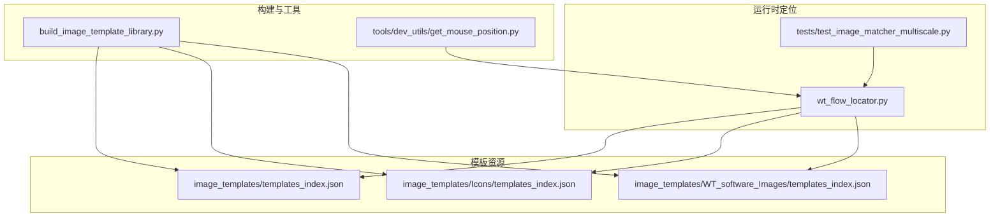
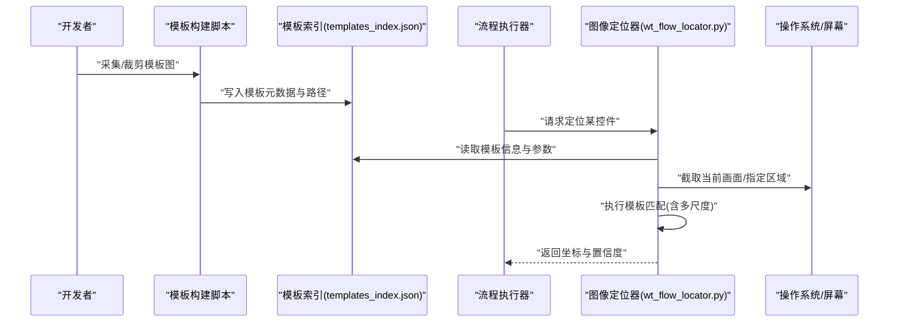
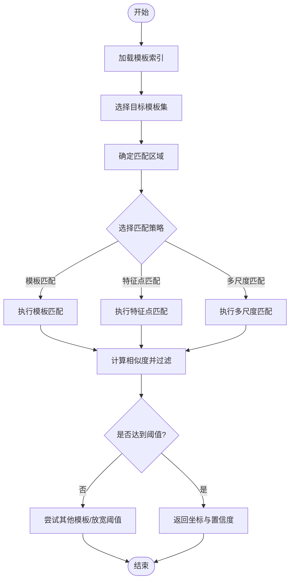
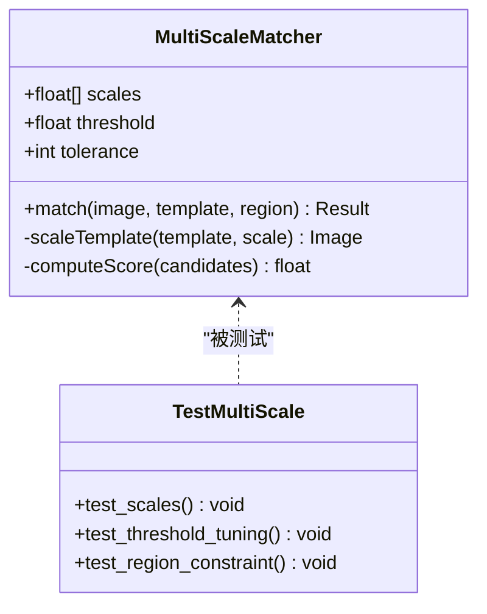
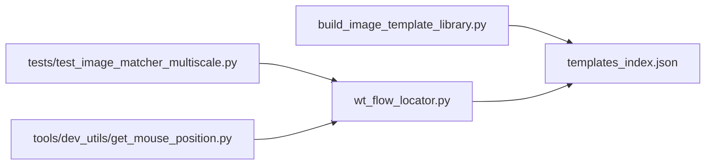

# 图像模板匹配定位器

<cite>
**本文引用的文件**   
- [wt_flow_locator.py](file://wt_flow_locator.py)
- [test_image_matcher_multiscale.py](file://tests/test_image_matcher_multiscale.py)
- [build_image_template_library.py](file://build_image_template_library.py)
- [image_templates/templates_index.json](file://image_templates/templates_index.json)
- [image_templates/Icons/templates_index.json](file://image_templates/Icons/templates_index.json)
- [image_templates/WT_software_Images/templates_index.json](file://image_templates/WT_software_Images/templates_index.json)
- [tools/dev_utils/get_mouse_position.py](file://tools/dev_utils/get_mouse_position.py)
</cite>

## 目录
1. [简介](#简介)
2. [项目结构](#项目结构)
3. [核心组件](#核心组件)
4. [架构总览](#架构总览)
5. [详细组件分析](#详细组件分析)
6. [依赖关系分析](#依赖关系分析)
7. [性能考虑](#性能考虑)
8. [故障排查指南](#故障排查指南)
9. [结论](#结论)
10. [附录](#附录)

## 简介
本文件围绕“基于图像模板匹配的控件定位技术”进行系统化说明，结合仓库中的实现与测试用例，阐述以下主题：
- OpenCV 图像匹配算法的实现原理：模板匹配、特征点匹配、多尺度匹配等。
- 图像模板库的构建与管理：采集、存储格式、索引与版本控制策略。
- 定位参数配置：相似度阈值、容差设置、匹配区域限制等。
- 最佳实践：模板设计原则、命名规范、更新策略。
- 使用示例与自定义优化技巧：通过现有脚本与测试用例展示使用方法与扩展点。
- 性能优化方案与调试工具：如何提升匹配效率与可观测性。

## 项目结构
本项目在图像模板匹配方面涉及的关键目录与文件如下：
- image_templates：存放模板图片与模板索引（templates_index.json），支持按窗口或功能域组织。
- build_image_template_library.py：用于构建和管理图像模板库的工具脚本。
- wt_flow_locator.py：流程执行阶段的核心定位器，集成多种图像匹配策略。
- tests/test_image_matcher_multiscale.py：针对多尺度匹配的单元测试，体现关键参数与行为。
- tools/dev_utils/get_mouse_position.py：开发期辅助工具，便于采集与校验鼠标位置。

图表来源
- [build_image_template_library.py](file://build_image_template_library.py)
- [image_templates/templates_index.json](file://image_templates/templates_index.json)
- [image_templates/Icons/templates_index.json](file://image_templates/Icons/templates_index.json)
- [image_templates/WT_software_Images/templates_index.json](file://image_templates/WT_software_Images/templates_index.json)
- [wt_flow_locator.py](file://wt_flow_locator.py)
- [tests/test_image_matcher_multiscale.py](file://tests/test_image_matcher_multiscale.py)
- [tools/dev_utils/get_mouse_position.py](file://tools/dev_utils/get_mouse_position.py)

章节来源
- [build_image_template_library.py](file://build_image_template_library.py)
- [image_templates/templates_index.json](file://image_templates/templates_index.json)
- [image_templates/Icons/templates_index.json](file://image_templates/Icons/templates_index.json)
- [image_templates/WT_software_Images/templates_index.json](file://image_templates/WT_software_Images/templates_index.json)
- [wt_flow_locator.py](file://wt_flow_locator.py)
- [tests/test_image_matcher_multiscale.py](file://tests/test_image_matcher_multiscale.py)
- [tools/dev_utils/get_mouse_position.py](file://tools/dev_utils/get_mouse_position.py)

## 核心组件
- 模板索引管理：通过 templates_index.json 维护模板元数据（如名称、路径、所属窗口/模块、版本信息等），为构建与运行提供统一入口。
- 模板库构建：build_image_template_library.py 负责将采集到的截图与元数据写入索引，并生成可供定位器使用的结构化资源。
- 运行时定位器：wt_flow_locator.py 在流程执行时加载模板索引，根据目标控件的模板信息执行图像匹配，返回坐标与置信度。
- 多尺度匹配测试：tests/test_image_matcher_multiscale.py 验证不同缩放比例下的匹配稳定性，体现关键参数（阈值、容差、区域）的影响。
- 开发辅助：tools/dev_utils/get_mouse_position.py 帮助快速采集屏幕坐标，辅助模板裁剪与回归验证。

章节来源
- [image_templates/templates_index.json](file://image_templates/templates_index.json)
- [build_image_template_library.py](file://build_image_template_library.py)
- [wt_flow_locator.py](file://wt_flow_locator.py)
- [tests/test_image_matcher_multiscale.py](file://tests/test_image_matcher_multiscale.py)
- [tools/dev_utils/get_mouse_position.py](file://tools/dev_utils/get_mouse_position.py)

## 架构总览
整体架构分为三层：
- 资源层：模板图片与索引文件，按窗口/功能域组织，便于版本管理与复用。
- 构建层：模板库构建脚本，负责采集、裁剪、索引化与一致性校验。
- 运行层：定位器在流程执行中按需加载模板，执行匹配并输出结果；测试套件保障多尺度鲁棒性。

图表来源
- [build_image_template_library.py](file://build_image_template_library.py)
- [image_templates/templates_index.json](file://image_templates/templates_index.json)
- [wt_flow_locator.py](file://wt_flow_locator.py)

## 详细组件分析

### 模板索引与模板库管理
- 模板索引文件（templates_index.json）集中描述模板集合，包含模板名称、相对路径、关联窗口/模块、版本标签等字段，便于检索与回溯。
- 构建脚本（build_image_template_library.py）负责：
  - 从原始截图或录制文件中提取候选区域。
  - 生成标准化的模板图片与元数据。
  - 校验索引一致性与完整性（如路径存在、尺寸合理）。
  - 支持按窗口或功能域分目录组织，提高可维护性。

建议的索引字段（概念性说明）：
- id：唯一标识
- name：显示名
- path：模板图片相对路径
- window_tag：所属窗口或模块标记
- version：模板版本
- meta：额外元数据（如分辨率、采集时间、备注）

章节来源
- [image_templates/templates_index.json](file://image_templates/templates_index.json)
- [build_image_template_library.py](file://build_image_template_library.py)

### 运行时定位器（wt_flow_locator.py）
定位器在流程执行阶段承担以下职责：
- 解析模板索引，选择与目标控件对应的模板集。
- 根据配置确定匹配策略（模板匹配、特征点匹配、多尺度匹配）。
- 在限定区域内执行匹配，计算相似度并过滤低置信度结果。
- 返回标准化结果（中心坐标、边界框、置信度、所用策略与参数）。

关键参数与行为（概念性说明）：
- 相似度阈值：低于阈值的匹配被丢弃，避免误匹配。
- 容差设置：允许像素级偏差，增强对轻微渲染差异的鲁棒性。
- 匹配区域限制：仅在窗口或子区域搜索，降低计算量与误检率。
- 多尺度匹配：对模板进行缩放序列匹配，应对分辨率变化与UI缩放。

图表来源
- [wt_flow_locator.py](file://wt_flow_locator.py)

章节来源
- [wt_flow_locator.py](file://wt_flow_locator.py)

### 多尺度匹配与参数调优（测试驱动）
tests/test_image_matcher_multiscale.py 展示了多尺度匹配的关键用法与参数影响：
- 缩放因子序列：定义一组缩放比例，依次对模板进行缩放后匹配。
- 阈值与容差：在不同尺度下动态调整阈值与容差，平衡召回与精度。
- 区域限制：在特定窗口或子区域执行匹配，减少背景干扰。
- 结果聚合：汇总各尺度的最高置信度与对应坐标，作为最终定位结果。

图表来源
- [tests/test_image_matcher_multiscale.py](file://tests/test_image_matcher_multiscale.py)
- [wt_flow_locator.py](file://wt_flow_locator.py)

章节来源
- [tests/test_image_matcher_multiscale.py](file://tests/test_image_matcher_multiscale.py)
- [wt_flow_locator.py](file://wt_flow_locator.py)

### 开发辅助与模板采集
tools/dev_utils/get_mouse_position.py 提供获取鼠标位置的便捷方法，常用于：
- 快速定位界面元素中心，辅助模板裁剪。
- 在回归测试中对比预期点击位置与实际命中位置。
- 配合录制脚本生成更精确的模板与区域约束。

章节来源
- [tools/dev_utils/get_mouse_position.py](file://tools/dev_utils/get_mouse_position.py)

## 依赖关系分析
- 构建脚本依赖模板索引，产出标准化的模板资源与元数据。
- 定位器依赖模板索引与运行时截图能力，执行匹配并返回结果。
- 测试用例依赖定位器接口，验证多尺度匹配的参数敏感性与鲁棒性。
- 开发工具为采集与调试提供支持，间接提升模板质量与定位稳定性。

图表来源
- [build_image_template_library.py](file://build_image_template_library.py)
- [image_templates/templates_index.json](file://image_templates/templates_index.json)
- [wt_flow_locator.py](file://wt_flow_locator.py)
- [tests/test_image_matcher_multiscale.py](file://tests/test_image_matcher_multiscale.py)
- [tools/dev_utils/get_mouse_position.py](file://tools/dev_utils/get_mouse_position.py)

章节来源
- [build_image_template_library.py](file://build_image_template_library.py)
- [image_templates/templates_index.json](file://image_templates/templates_index.json)
- [wt_flow_locator.py](file://wt_flow_locator.py)
- [tests/test_image_matcher_multiscale.py](file://tests/test_image_matcher_multiscale.py)
- [tools/dev_utils/get_mouse_position.py](file://tools/dev_utils/get_mouse_position.py)

## 性能考虑
- 区域限制优先：尽量缩小匹配区域，显著降低计算量与误检率。
- 多尺度策略：仅对必要尺度进行匹配，避免全范围缩放带来的开销。
- 阈值与容差调优：在保证召回的前提下提高阈值，减少候选数量。
- 缓存与预取：对常用模板进行内存缓存，避免重复加载。
- 并行与批处理：批量匹配时可利用多线程或GPU加速（若环境支持）。
- 模板质量：高对比度、稳定布局的模板能显著提升速度与准确率。

[本节为通用指导，不直接分析具体文件]

## 故障排查指南
- 匹配失败或误匹配：
  - 检查相似度阈值是否过低或过高。
  - 确认匹配区域是否正确，避免背景干扰。
  - 验证模板是否与当前UI状态一致（颜色、字体、缩放）。
- 多尺度不稳定：
  - 调整缩放因子序列，覆盖实际分辨率变化范围。
  - 对不同尺度分别评估阈值与容差，必要时采用自适应策略。
- 性能问题：
  - 扩大区域限制，减少无关区域参与匹配。
  - 增加模板缓存，减少IO与解码开销。
- 调试建议：
  - 使用开发工具获取鼠标位置，对比预期与命中坐标。
  - 记录每次匹配的候选结果与置信度分布，辅助定位问题。

章节来源
- [tests/test_image_matcher_multiscale.py](file://tests/test_image_matcher_multiscale.py)
- [tools/dev_utils/get_mouse_position.py](file://tools/dev_utils/get_mouse_position.py)
- [wt_flow_locator.py](file://wt_flow_locator.py)

## 结论
通过模板索引与构建脚本的配合，项目实现了可维护的图像模板库；定位器在多尺度与区域限制的支持下，提供了稳健的控件定位能力；测试用例保障了关键参数的鲁棒性。遵循模板设计原则与参数调优策略，可在复杂UI环境下获得更高的成功率与性能表现。

[本节为总结性内容，不直接分析具体文件]

## 附录

### 模板设计原则与命名规范（概念性建议）
- 设计原则：
  - 选择高对比度、稳定的视觉元素作为模板。
  - 避免包含易变文本或动态图标。
  - 保持模板尺寸适中，兼顾识别精度与速度。
- 命名规范：
  - 以“窗口_模块_控件类型_用途”组合命名，便于检索与分类。
  - 版本号与日期纳入文件名或索引字段，便于追溯。
- 更新策略：
  - UI变更时同步更新模板与索引，保留历史版本以便回滚。
  - 定期回归验证，确保模板在不同分辨率与缩放下的稳定性。

[本节为概念性建议，不直接分析具体文件]

### 使用示例与自定义优化技巧（基于现有脚本与测试）
- 模板采集与入库：
  - 使用开发工具获取鼠标位置，辅助裁剪模板。
  - 通过构建脚本将模板与元数据写入索引。
- 定位调用与参数配置：
  - 在流程执行中指定目标模板与匹配区域。
  - 调整相似度阈值与容差，必要时启用多尺度匹配。
- 自定义优化：
  - 为高频控件建立专用模板集与缓存。
  - 针对不同窗口或模块设定差异化参数，提升整体稳定性。

章节来源
- [build_image_template_library.py](file://build_image_template_library.py)
- [tests/test_image_matcher_multiscale.py](file://tests/test_image_matcher_multiscale.py)
- [wt_flow_locator.py](file://wt_flow_locator.py)
- [tools/dev_utils/get_mouse_position.py](file://tools/dev_utils/get_mouse_position.py)