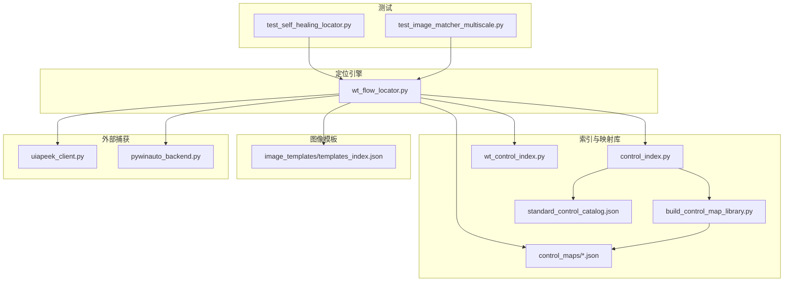
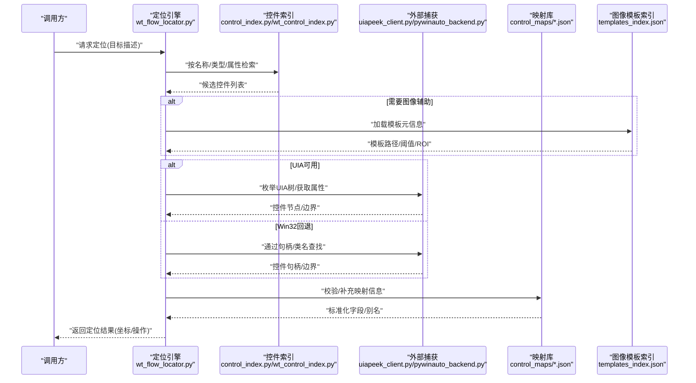
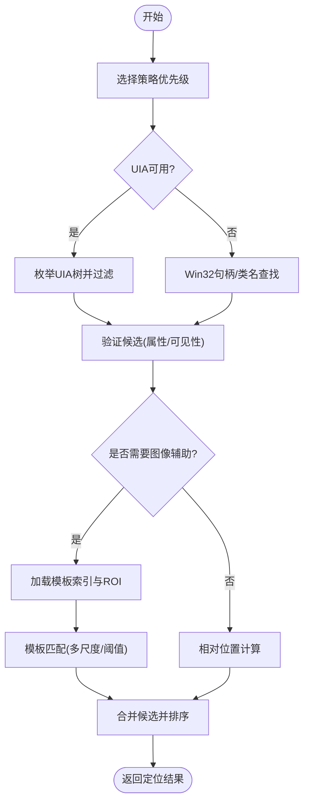
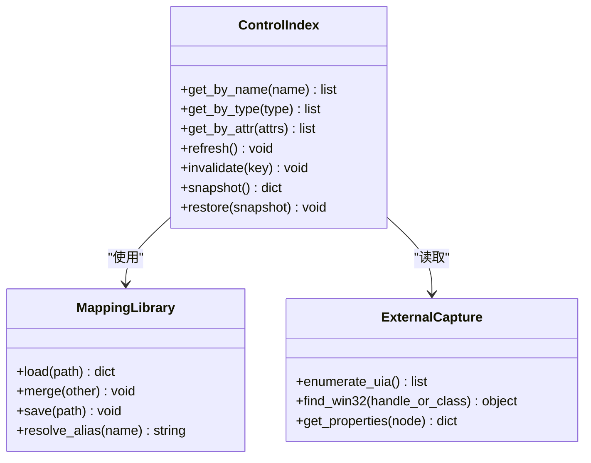
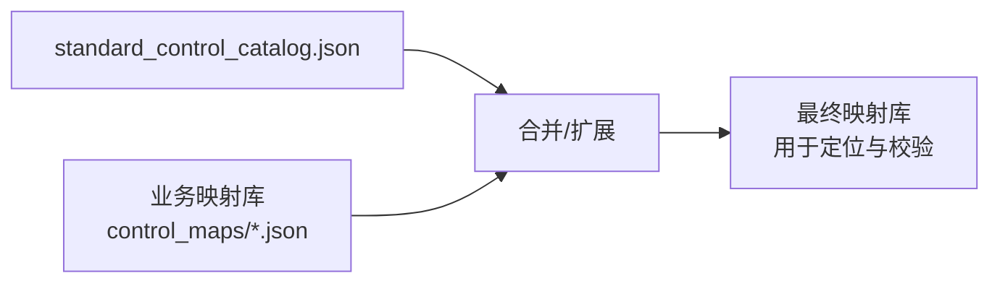
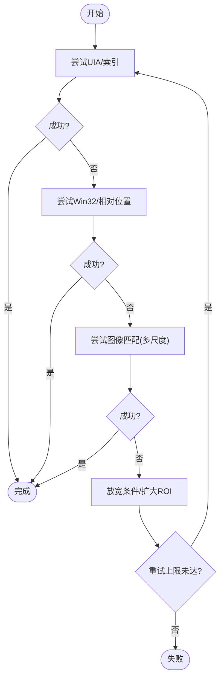
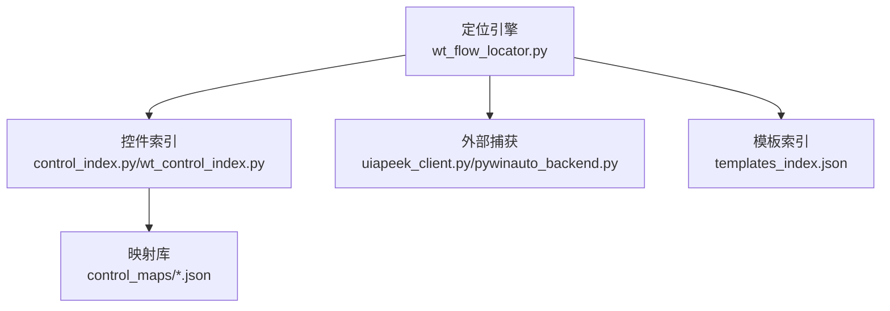

# 控件定位系统

<cite>
**本文引用的文件**   
- [wt_flow_locator.py](file://wt_flow_locator.py)
- [control_index.py](file://WT_AUTOMATION_Agent/control_index.py)
- [wt_control_index.py](file://wt_control_index.py)
- [build_control_map_library.py](file://build_control_map_library.py)
- [library_window_WPF_controls.json](file://control_maps/library_window_WPF_controls.json)
- [library_主面板_WPF_controls.json](file://control_maps/library_主面板_WPF_controls.json)
- [standard_control_catalog.json](file://control_maps/standard_control_catalog.json)
- [templates_index.json](file://image_templates/templates_index.json)
- [test_self_healing_locator.py](file://tests/test_self_healing_locator.py)
- [test_image_matcher_multiscale.py](file://tests/test_image_matcher_multiscale.py)
- [uiapeek_client.py](file://tools/external_capture/uiapeek_client.py)
- [pywinauto_backend.py](file://tools/external_capture/pywinauto_backend.py)
</cite>

## 目录
1. [简介](#简介)
2. [项目结构](#项目结构)
3. [核心组件](#核心组件)
4. [架构总览](#架构总览)
5. [详细组件分析](#详细组件分析)
6. [依赖关系分析](#依赖关系分析)
7. [性能考虑](#性能考虑)
8. [故障排查指南](#故障排查指南)
9. [结论](#结论)
10. [附录](#附录)

## 简介
本文件系统性阐述 WT 自动化框架的“控件定位系统”，覆盖以下关键主题：
- 定位策略与实现原理：UIA 树遍历、Win32 API 调用、图像模板匹配、相对位置计算等。
- 控件索引管理：索引构建、缓存策略与更新机制。
- 控件映射库：结构与组织方式，标准目录与业务库的关系。
- 自适应定位算法：应对 UI 变化、提升稳定性的策略。
- 适用场景、性能特点与配置选项。
- 自定义定位器实现示例（以路径引用形式提供）。
- 调试工具与诊断方法。

## 项目结构
围绕控件定位的核心代码与资源分布如下：
- 定位引擎与流程集成：wt_flow_locator.py
- 控件索引与映射库构建：control_index.py、wt_control_index.py、build_control_map_library.py
- 控件映射库（JSON）：control_maps/*.json
- 图像模板与索引：image_templates/**/templates_index.json
- 外部捕获与桥接：tools/external_capture/*
- 测试用例：tests/*（含自修复定位、多尺度图像匹配等）

图表来源
- [wt_flow_locator.py](file://wt_flow_locator.py)
- [control_index.py](file://WT_AUTOMATION_Agent/control_index.py)
- [wt_control_index.py](file://wt_control_index.py)
- [build_control_map_library.py](file://build_control_map_library.py)
- [standard_control_catalog.json](file://control_maps/standard_control_catalog.json)
- [templates_index.json](file://image_templates/templates_index.json)
- [uiapeek_client.py](file://tools/external_capture/uiapeek_client.py)
- [pywinauto_backend.py](file://tools/external_capture/pywinauto_backend.py)
- [test_self_healing_locator.py](file://tests/test_self_healing_locator.py)
- [test_image_matcher_multiscale.py](file://tests/test_image_matcher_multiscale.py)

章节来源
- [wt_flow_locator.py](file://wt_flow_locator.py)
- [control_index.py](file://WT_AUTOMATION_Agent/control_index.py)
- [wt_control_index.py](file://wt_control_index.py)
- [build_control_map_library.py](file://build_control_map_library.py)
- [standard_control_catalog.json](file://control_maps/standard_control_catalog.json)
- [templates_index.json](file://image_templates/templates_index.json)
- [uiapeek_client.py](file://tools/external_capture/uiapeek_client.py)
- [pywinauto_backend.py](file://tools/external_capture/pywinauto_backend.py)
- [test_self_healing_locator.py](file://tests/test_self_healing_locator.py)
- [test_image_matcher_multiscale.py](file://tests/test_image_matcher_multiscale.py)

## 核心组件
- 定位引擎（wt_flow_locator.py）
  - 职责：将高层定位描述解析为具体执行步骤；协调多种定位策略；处理超时、重试与回退；输出可执行的点击/输入等操作。
  - 关键点：策略选择顺序、上下文窗口识别、相对区域计算、图像匹配参数注入。
- 控件索引（control_index.py / wt_control_index.py）
  - 职责：维护控件实例到逻辑标识的映射；提供按名称/类型/层级/属性检索能力；支持增量更新与缓存。
  - 关键点：索引键设计、失效条件、并发安全、跨进程/线程访问。
- 映射库构建（build_control_map_library.py）
  - 职责：从运行时或录制数据生成/合并控件映射库；标准化字段；导出 JSON。
  - 关键点：去重规则、冲突解决、版本兼容。
- 图像模板索引（image_templates/templates_index.json）
  - 职责：集中管理模板元信息（路径、阈值、缩放范围、ROI 等），供定位时快速加载。
- 外部捕获桥接（uiapeek_client.py / pywinauto_backend.py）
  - 职责：封装 UIA 枚举与 Win32 句柄访问；提供稳定的控件树快照与属性读取。
- 测试与验证（tests/*）
  - 职责：覆盖自修复定位、多尺度图像匹配、相对窗口定位等关键路径。

章节来源
- [wt_flow_locator.py](file://wt_flow_locator.py)
- [control_index.py](file://WT_AUTOMATION_Agent/control_index.py)
- [wt_control_index.py](file://wt_control_index.py)
- [build_control_map_library.py](file://build_control_map_library.py)
- [templates_index.json](file://image_templates/templates_index.json)
- [uiapeek_client.py](file://tools/external_capture/uiapeek_client.py)
- [pywinauto_backend.py](file://tools/external_capture/pywinauto_backend.py)
- [test_self_healing_locator.py](file://tests/test_self_healing_locator.py)
- [test_image_matcher_multiscale.py](file://tests/test_image_matcher_multiscale.py)

## 架构总览
定位系统采用“策略+索引+库”的分层架构：
- 策略层：UIA 树遍历、Win32 句柄查找、图像模板匹配、相对位置计算。
- 索引层：控件索引与映射库，提供快速检索与复用。
- 适配层：外部捕获桥接，屏蔽底层差异（UIA vs Win32）。
- 编排层：定位引擎负责策略组合、回退与容错。

图表来源
- [wt_flow_locator.py](file://wt_flow_locator.py)
- [control_index.py](file://WT_AUTOMATION_Agent/control_index.py)
- [wt_control_index.py](file://wt_control_index.py)
- [uiapeek_client.py](file://tools/external_capture/uiapeek_client.py)
- [pywinauto_backend.py](file://tools/external_capture/pywinauto_backend.py)
- [standard_control_catalog.json](file://control_maps/standard_control_catalog.json)
- [templates_index.json](file://image_templates/templates_index.json)

## 详细组件分析

### 定位策略与实现原理
- UIA 树遍历
  - 原理：通过 UI Automation 接口枚举控件树，按名称、类型、自动化 ID、可见性等属性筛选。
  - 优势：语义化强、跨进程稳定；适合复杂容器与动态内容。
  - 风险：UIA 初始化开销较大；某些第三方控件暴露不完整。
  - 典型入口：外部捕获客户端对 UIA 的封装。
- Win32 API 调用
  - 原理：基于窗口句柄、类名、标题等 Win32 信息定位；常用于传统桌面应用。
  - 优势：轻量、响应快；适合简单窗口与按钮。
  - 风险：对现代 UI 框架（WPF/UWP）支持有限。
  - 典型入口：PyWinAuto 后端封装。
- 图像模板匹配
  - 原理：在指定 ROI 内使用模板匹配寻找相似区域，支持多尺度与阈值调节。
  - 优势：对视觉一致性强但语义缺失的场景有效。
  - 风险：受分辨率/缩放影响；需合理 ROI 与阈值。
  - 典型入口：模板索引与多尺度匹配测试。
- 相对位置计算
  - 原理：基于已知父控件或参考控件的偏移量计算目标位置；适用于布局稳定的局部区域。
  - 优势：鲁棒性较好，避免全局搜索。
  - 风险：依赖父级稳定性；需定期校验。

图表来源
- [uiapeek_client.py](file://tools/external_capture/uiapeek_client.py)
- [pywinauto_backend.py](file://tools/external_capture/pywinauto_backend.py)
- [templates_index.json](file://image_templates/templates_index.json)
- [test_image_matcher_multiscale.py](file://tests/test_image_matcher_multiscale.py)

章节来源
- [uiapeek_client.py](file://tools/external_capture/uiapeek_client.py)
- [pywinauto_backend.py](file://tools/external_capture/pywinauto_backend.py)
- [templates_index.json](file://image_templates/templates_index.json)
- [test_image_matcher_multiscale.py](file://tests/test_image_matcher_multiscale.py)

### 控件索引管理机制
- 索引构建
  - 从 UIA/Win32 快照中抽取控件属性，生成唯一键（如名称+类型+层级路径）。
  - 与映射库对齐，填充别名、分组、业务标签等元数据。
- 缓存策略
  - 内存缓存：进程内快速访问；设置 TTL 与失效事件（窗口切换、控件刷新）。
  - 磁盘持久化：保存索引快照，启动时热加载，减少冷启动时间。
- 更新机制
  - 增量更新：监听控件树变更事件，仅更新受影响分支。
  - 全量重建：当检测到重大 UI 变化或版本升级时触发。
- 并发与一致性
  - 读写分离：读路径无锁，写路径加锁；保证高并发下的稳定性。

图表来源
- [control_index.py](file://WT_AUTOMATION_Agent/control_index.py)
- [wt_control_index.py](file://wt_control_index.py)
- [build_control_map_library.py](file://build_control_map_library.py)

章节来源
- [control_index.py](file://WT_AUTOMATION_Agent/control_index.py)
- [wt_control_index.py](file://wt_control_index.py)
- [build_control_map_library.py](file://build_control_map_library.py)

### 控件映射库的结构与组织
- 标准目录（standard_control_catalog.json）
  - 定义通用控件类别、常用属性、默认行为与别名。
  - 作为业务库的基线，便于统一规范与跨项目复用。
- 业务库（control_maps/*.json）
  - 针对特定窗口/模块的细化映射，包含控件路径、显示文本、占位符、交互提示等。
  - 可按窗口维度拆分，提高可读性与维护性。
- 构建与合并
  - 通过构建脚本从录制或扫描结果生成，支持合并与冲突检测。
  - 输出标准化 JSON，便于版本管理与回归对比。

图表来源
- [standard_control_catalog.json](file://control_maps/standard_control_catalog.json)
- [library_window_WPF_controls.json](file://control_maps/library_window_WPF_controls.json)
- [library_主面板_WPF_controls.json](file://control_maps/library_主面板_WPF_controls.json)
- [build_control_map_library.py](file://build_control_map_library.py)

章节来源
- [standard_control_catalog.json](file://control_maps/standard_control_catalog.json)
- [library_window_WPF_controls.json](file://control_maps/library_window_WPF_controls.json)
- [library_主面板_WPF_controls.json](file://control_maps/library_主面板_WPF_controls.json)
- [build_control_map_library.py](file://build_control_map_library.py)

### 自适应定位算法
- 多策略融合
  - 优先使用语义化策略（UIA/索引），失败后回退至图像匹配与相对位置。
  - 根据历史成功率动态调整策略权重。
- 容错与自愈
  - 超时重试、指数退避、随机抖动避免同步问题。
  - 自修复定位：当候选命中数异常时，自动放宽条件或切换策略。
- 稳定性增强
  - 引入置信度评分：结合属性相似度、图像匹配分数、历史命中率。
  - 区域收敛：先粗后细，逐步缩小 ROI，降低误匹配。

图表来源
- [test_self_healing_locator.py](file://tests/test_self_healing_locator.py)
- [test_image_matcher_multiscale.py](file://tests/test_image_matcher_multiscale.py)
- [wt_flow_locator.py](file://wt_flow_locator.py)

章节来源
- [test_self_healing_locator.py](file://tests/test_self_healing_locator.py)
- [test_image_matcher_multiscale.py](file://tests/test_image_matcher_multiscale.py)
- [wt_flow_locator.py](file://wt_flow_locator.py)

### 适用场景、性能特点与配置选项
- UIA 树遍历
  - 适用：现代 UI 框架、复杂嵌套、动态内容。
  - 性能：初始枚举较慢，后续查询快。
  - 配置：超时、最大深度、属性白名单。
- Win32 API 调用
  - 适用：传统 Win32 应用、简单控件。
  - 性能：轻量快速。
  - 配置：类名/标题模糊匹配、句柄过滤。
- 图像模板匹配
  - 适用：视觉稳定但语义缺失的控件。
  - 性能：受分辨率/缩放影响，需 ROI 与阈值调优。
  - 配置：模板索引、阈值、多尺度范围、ROI。
- 相对位置计算
  - 适用：布局稳定的局部区域。
  - 性能：极快。
  - 配置：父控件锚点、偏移容忍度。

章节来源
- [templates_index.json](file://image_templates/templates_index.json)
- [uiapeek_client.py](file://tools/external_capture/uiapeek_client.py)
- [pywinauto_backend.py](file://tools/external_capture/pywinauto_backend.py)
- [test_image_matcher_multiscale.py](file://tests/test_image_matcher_multiscale.py)

### 自定义定位器实现示例（路径引用）
- 新增策略入口
  - 在定位引擎中注册新策略，并在策略链中插入合适位置。
  - 参考路径：[wt_flow_locator.py](file://wt_flow_locator.py)
- 接入控件索引
  - 通过索引服务进行候选检索与过滤。
  - 参考路径：[control_index.py](file://WT_AUTOMATION_Agent/control_index.py)、[wt_control_index.py](file://wt_control_index.py)
- 图像模板加载
  - 从模板索引读取元信息，构造匹配参数。
  - 参考路径：[templates_index.json](file://image_templates/templates_index.json)
- 外部捕获桥接
  - 使用 UIA/Win32 后端获取控件属性与边界。
  - 参考路径：[uiapeek_client.py](file://tools/external_capture/uiapeek_client.py)、[pywinauto_backend.py](file://tools/external_capture/pywinauto_backend.py)
- 单元测试
  - 为新策略编写用例，覆盖正常与异常路径。
  - 参考路径：[test_self_healing_locator.py](file://tests/test_self_healing_locator.py)、[test_image_matcher_multiscale.py](file://tests/test_image_matcher_multiscale.py)

章节来源
- [wt_flow_locator.py](file://wt_flow_locator.py)
- [control_index.py](file://WT_AUTOMATION_Agent/control_index.py)
- [wt_control_index.py](file://wt_control_index.py)
- [templates_index.json](file://image_templates/templates_index.json)
- [uiapeek_client.py](file://tools/external_capture/uiapeek_client.py)
- [pywinauto_backend.py](file://tools/external_capture/pywinauto_backend.py)
- [test_self_healing_locator.py](file://tests/test_self_healing_locator.py)
- [test_image_matcher_multiscale.py](file://tests/test_image_matcher_multiscale.py)

### 调试工具与诊断方法
- 日志与断点
  - 在定位引擎与各策略处记录关键决策与耗时。
- 可视化辅助
  - 绘制 ROI、匹配框、候选控件边界，便于肉眼核对。
- 回放与对比
  - 保存定位快照与模板匹配结果，用于回归对比。
- 指标收集
  - 统计各策略命中率、平均耗时、失败原因分布。

章节来源
- [test_self_healing_locator.py](file://tests/test_self_healing_locator.py)
- [test_image_matcher_multiscale.py](file://tests/test_image_matcher_multiscale.py)
- [uiapeek_client.py](file://tools/external_capture/uiapeek_client.py)
- [pywinauto_backend.py](file://tools/external_capture/pywinauto_backend.py)

## 依赖关系分析
- 组件耦合
  - 定位引擎依赖索引与外部捕获；索引依赖映射库；图像匹配依赖模板索引。
- 外部依赖
  - UIA 与 Win32 后端分别由 uiapeek_client.py 与 pywinauto_backend.py 封装。
- 潜在循环
  - 当前分层清晰，未见直接循环依赖；需注意索引与映射库的更新方向。

图表来源
- [wt_flow_locator.py](file://wt_flow_locator.py)
- [control_index.py](file://WT_AUTOMATION_Agent/control_index.py)
- [wt_control_index.py](file://wt_control_index.py)
- [uiapeek_client.py](file://tools/external_capture/uiapeek_client.py)
- [pywinauto_backend.py](file://tools/external_capture/pywinauto_backend.py)
- [templates_index.json](file://image_templates/templates_index.json)

章节来源
- [wt_flow_locator.py](file://wt_flow_locator.py)
- [control_index.py](file://WT_AUTOMATION_Agent/control_index.py)
- [wt_control_index.py](file://wt_control_index.py)
- [uiapeek_client.py](file://tools/external_capture/uiapeek_client.py)
- [pywinauto_backend.py](file://tools/external_capture/pywinauto_backend.py)
- [templates_index.json](file://image_templates/templates_index.json)

## 性能考虑
- 策略选择顺序
  - 优先使用索引与 UIA，减少图像匹配开销。
- 缓存与预热
  - 启动时预加载常用映射与模板索引；对热点控件建立内存缓存。
- ROI 与阈值优化
  - 合理缩小 ROI、设置最小匹配阈值，降低误匹配与重复扫描。
- 并发与异步
  - 对独立控件的枚举与匹配可并行执行，注意共享资源保护。
- 监控与告警
  - 对长耗时定位与高频失败策略进行告警，驱动持续优化。

## 故障排查指南
- 常见问题
  - UIA 不可用或超时：检查目标进程权限与 UIA 支持；必要时回退 Win32。
  - 图像匹配不稳定：调整阈值与多尺度范围；确认分辨率/缩放一致。
  - 索引过期：触发刷新或重建；检查窗口切换与控件刷新事件。
- 诊断步骤
  - 启用详细日志，记录策略选择与中间结果。
  - 导出定位快照与匹配图，进行离线分析。
  - 使用测试用例复现问题，逐步缩小范围。

章节来源
- [test_self_healing_locator.py](file://tests/test_self_healing_locator.py)
- [test_image_matcher_multiscale.py](file://tests/test_image_matcher_multiscale.py)
- [uiapeek_client.py](file://tools/external_capture/uiapeek_client.py)
- [pywinauto_backend.py](file://tools/external_capture/pywinauto_backend.py)

## 结论
WT 控件定位系统通过“策略+索引+库”的分层设计，实现了高鲁棒性与可扩展的定位能力。在多策略融合与自适应回退的加持下，系统能够应对复杂的 UI 变化与不一致环境。配合完善的映射库与模板索引，以及详尽的测试与诊断手段，可在实际工程中显著提升自动化稳定性与维护效率。

## 附录
- 术语
  - UIA：UI Automation，微软提供的 UI 自动化接口。
  - Win32：Windows 原生 API，用于窗口与控件操作。
  - ROI：感兴趣区域，用于限定图像匹配范围。
- 最佳实践
  - 优先使用语义化定位（UIA/索引），辅以图像匹配与相对位置。
  - 维护高质量的映射库与模板索引，定期清理与更新。
  - 建立回归测试集，确保 UI 变更后的稳定性。