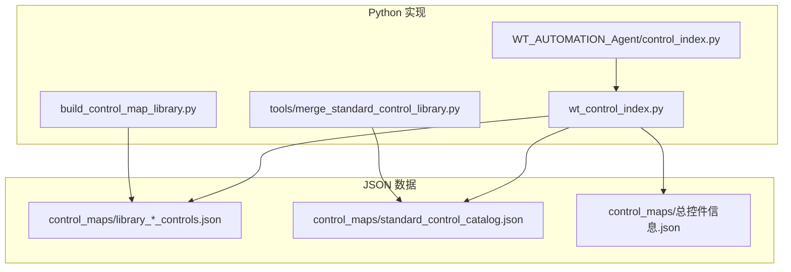
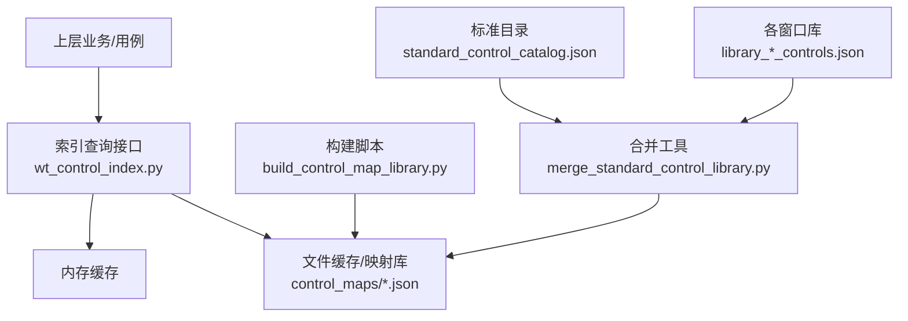
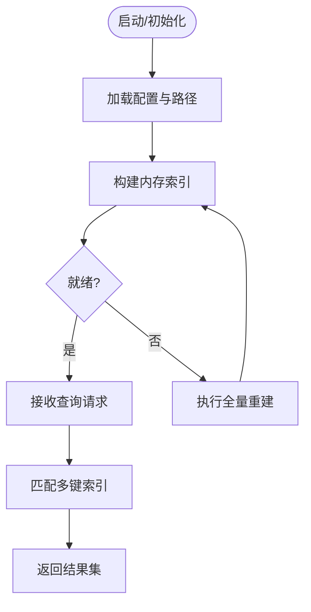
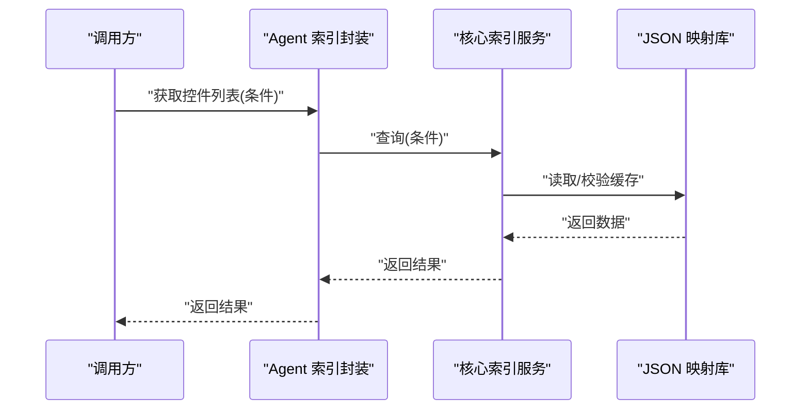
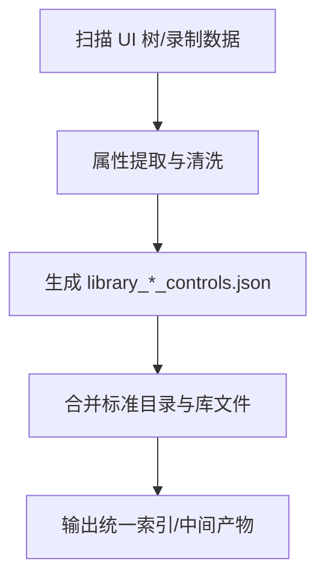
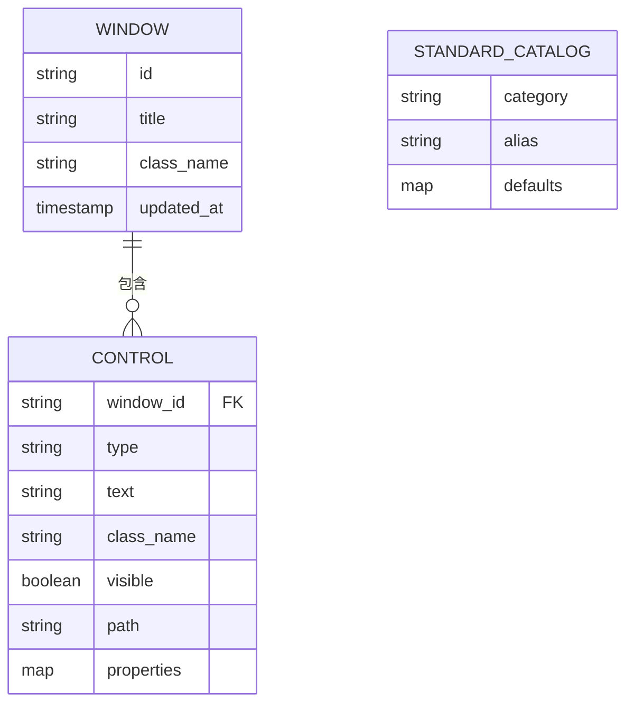
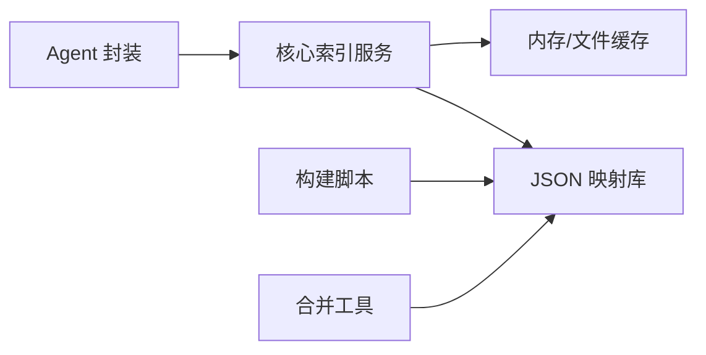

# 控件索引管理

<cite>
**本文引用的文件**   
- [wt_control_index.py](file://wt_control_index.py)
- [control_index.py](file://WT_AUTOMATION_Agent/control_index.py)
- [build_control_map_library.py](file://build_control_map_library.py)
- [merge_standard_control_library.py](file://tools/merge_standard_control_library.py)
- [library_window_WPF_controls.json](file://control_maps/library_window_WPF_controls.json)
- [standard_control_catalog.json](file://control_maps/standard_control_catalog.json)
- [总控件信息.json](file://control_maps/总控件信息.json)
</cite>

## 目录
1. [简介](#简介)
2. [项目结构](#项目结构)
3. [核心组件](#核心组件)
4. [架构总览](#架构总览)
5. [详细组件分析](#详细组件分析)
6. [依赖关系分析](#依赖关系分析)
7. [性能考虑](#性能考虑)
8. [故障排查指南](#故障排查指南)
9. [结论](#结论)
10. [附录](#附录)

## 简介
本文件系统性阐述“控件索引系统”的架构与实现机制，覆盖以下关键主题：
- 控件扫描、属性提取与索引构建流程
- 控件映射库的数据结构与存储格式（JSON）
- 索引缓存策略（内存缓存、文件缓存、失效机制）
- 索引更新与维护（增量更新与全量重建）
- 查询接口与使用方法（快速查找、批量操作）
- 调试工具与诊断方法
- 自定义控件索引扩展开发指南

目标读者包括自动化测试工程师、UI 定位开发者以及需要维护或扩展控件索引能力的工程人员。

## 项目结构
与控件索引相关的代码与数据主要分布在如下位置：
- Python 实现层
  - wt_control_index.py：核心索引服务与查询接口
  - WT_AUTOMATION_Agent/control_index.py：Agent 侧索引封装与集成
  - build_control_map_library.py：控件映射库构建脚本
  - tools/merge_standard_control_library.py：标准目录合并工具
- JSON 数据层
  - control_maps/*.json：控件映射库与标准目录、汇总信息等

图表来源
- [wt_control_index.py](file://wt_control_index.py)
- [control_index.py](file://WT_AUTOMATION_Agent/control_index.py)
- [build_control_map_library.py](file://build_control_map_library.py)
- [merge_standard_control_library.py](file://tools/merge_standard_control_library.py)
- [library_window_WPF_controls.json](file://control_maps/library_window_WPF_controls.json)
- [standard_control_catalog.json](file://control_maps/standard_control_catalog.json)
- [总控件信息.json](file://control_maps/总控件信息.json)

章节来源
- [wt_control_index.py](file://wt_control_index.py)
- [control_index.py](file://WT_AUTOMATION_Agent/control_index.py)
- [build_control_map_library.py](file://build_control_map_library.py)
- [merge_standard_control_library.py](file://tools/merge_standard_control_library.py)
- [library_window_WPF_controls.json](file://control_maps/library_window_WPF_controls.json)
- [standard_control_catalog.json](file://control_maps/standard_control_catalog.json)
- [总控件信息.json](file://control_maps/总控件信息.json)

## 核心组件
- 索引服务（wt_control_index.py）
  - 提供控件索引的加载、缓存、查询、更新等能力
  - 负责将 JSON 映射库载入内存并建立高效检索结构
- Agent 封装（WT_AUTOMATION_Agent/control_index.py）
  - 在 Agent 场景下对索引服务进行封装，暴露更高层的调用入口
- 构建与合并工具
  - build_control_map_library.py：从运行时采集或手工标注生成 library_*_controls.json
  - merge_standard_control_library.py：合并 standard_control_catalog.json 与各 library 文件，输出统一视图

章节来源
- [wt_control_index.py](file://wt_control_index.py)
- [control_index.py](file://WT_AUTOMATION_Agent/control_index.py)
- [build_control_map_library.py](file://build_control_map_library.py)
- [merge_standard_control_library.py](file://tools/merge_standard_control_library.py)

## 架构总览
整体架构围绕“JSON 映射库 + 内存索引 + 可选持久化缓存”展开。上层业务通过查询接口访问索引，底层由构建与合并工具维护数据源。

图表来源
- [wt_control_index.py](file://wt_control_index.py)
- [build_control_map_library.py](file://build_control_map_library.py)
- [merge_standard_control_library.py](file://tools/merge_standard_control_library.py)
- [standard_control_catalog.json](file://control_maps/standard_control_catalog.json)
- [library_window_WPF_controls.json](file://control_maps/library_window_WPF_controls.json)

## 详细组件分析

### 控件索引服务（wt_control_index.py）
职责
- 加载与解析 JSON 映射库
- 构建内存索引结构（按窗口标题、类名、控件类型、文本等多键）
- 提供快速查找与批量查询接口
- 管理缓存生命周期与失效策略
- 支持增量更新与全量重建

关键流程
- 初始化：读取配置与路径，预加载必要映射库到内存
- 构建索引：遍历 JSON 条目，抽取关键字段，写入多路索引表
- 查询：根据条件组合返回候选控件集合
- 更新：检测变更时间戳或版本号，触发增量或全量重建
- 缓存：内存缓存为主，必要时落盘为临时文件或校验和

图表来源
- [wt_control_index.py](file://wt_control_index.py)

章节来源
- [wt_control_index.py](file://wt_control_index.py)

### Agent 侧封装（WT_AUTOMATION_Agent/control_index.py）
职责
- 在 Agent 上下文中提供统一的索引访问入口
- 屏蔽底层路径与缓存细节，暴露简洁 API
- 与 Agent 工作流集成，按需触发刷新

交互时序

图表来源
- [control_index.py](file://WT_AUTOMATION_Agent/control_index.py)
- [wt_control_index.py](file://wt_control_index.py)

章节来源
- [control_index.py](file://WT_AUTOMATION_Agent/control_index.py)
- [wt_control_index.py](file://wt_control_index.py)

### 构建与合并工具
- 构建脚本（build_control_map_library.py）
  - 作用：从 UI 树或录制产物中抽取控件属性，生成 library_*_controls.json
  - 输入：运行态 UI 快照、选择器规则、过滤条件
  - 输出：按窗口/功能域划分的控件库文件
- 合并工具（tools/merge_standard_control_library.py）
  - 作用：将 standard_control_catalog.json 与各 library 文件合并，形成统一索引视图
  - 输入：标准目录、多个 library_*_controls.json
  - 输出：聚合后的索引数据（可用于全量重建或导出）

图表来源
- [build_control_map_library.py](file://build_control_map_library.py)
- [merge_standard_control_library.py](file://tools/merge_standard_control_library.py)

章节来源
- [build_control_map_library.py](file://build_control_map_library.py)
- [merge_standard_control_library.py](file://tools/merge_standard_control_library.py)

### JSON 数据结构与存储格式
- 窗口级控件库（library_*_controls.json）
  - 组织方式：以窗口或功能模块为单位，包含该窗口下的控件清单及属性
  - 典型字段：窗口标识、控件类型、可见性、文本、类名、层级路径、可操作状态等
- 标准控件目录（standard_control_catalog.json）
  - 组织方式：标准化控件类别、别名、常用属性约束与默认值
  - 用途：作为通用语义与规范，辅助归一化与合并
- 总控件信息（总控件信息.json）
  - 组织方式：全局汇总视图，便于快速浏览与统计

图表来源
- [library_window_WPF_controls.json](file://control_maps/library_window_WPF_controls.json)
- [standard_control_catalog.json](file://control_maps/standard_control_catalog.json)
- [总控件信息.json](file://control_maps/总控件信息.json)

章节来源
- [library_window_WPF_controls.json](file://control_maps/library_window_WPF_controls.json)
- [standard_control_catalog.json](file://control_maps/standard_control_catalog.json)
- [总控件信息.json](file://control_maps/总控件信息.json)

## 依赖关系分析
- 模块耦合
  - Agent 封装依赖核心索引服务
  - 核心索引服务依赖 JSON 映射库与缓存策略
  - 构建与合并工具独立于运行时，负责数据准备
- 外部依赖
  - JSON 读写、文件系统、时间戳/版本校验
  - 可选：进程内缓存、磁盘缓存、校验和

图表来源
- [control_index.py](file://WT_AUTOMATION_Agent/control_index.py)
- [wt_control_index.py](file://wt_control_index.py)
- [build_control_map_library.py](file://build_control_map_library.py)
- [merge_standard_control_library.py](file://tools/merge_standard_control_library.py)

章节来源
- [control_index.py](file://WT_AUTOMATION_Agent/control_index.py)
- [wt_control_index.py](file://wt_control_index.py)
- [build_control_map_library.py](file://build_control_map_library.py)
- [merge_standard_control_library.py](file://tools/merge_standard_control_library.py)

## 性能考虑
- 索引构建
  - 建议采用多键倒排索引（窗口、类型、文本前缀、类名等），提升查询效率
  - 对大库文件分块读取与并行处理，降低 I/O 瓶颈
- 查询优化
  - 优先使用高选择性条件（如窗口+类型+文本前缀）缩小候选集
  - 对高频查询结果做短期内存缓存
- 缓存策略
  - 内存缓存：进程内字典/哈希表，TTL 控制
  - 文件缓存：基于时间戳或内容校验和，避免重复构建
  - 失效机制：监听文件变更或显式触发刷新
- 增量更新
  - 仅重算变更窗口或新增控件条目，减少全量开销
  - 记录增量日志，便于回滚与审计

[本节为通用指导，不直接分析具体文件]

## 故障排查指南
常见问题与定位步骤
- 索引未命中
  - 检查窗口标题/类名是否一致
  - 确认控件文本是否存在空格或不可见字符
  - 验证 JSON 映射库是否最新且未被锁定
- 构建失败
  - 检查 UI 树抓取权限与后端（UIA/Win32/WPF）可用性
  - 查看构建脚本日志与异常堆栈
- 合并冲突
  - 核对标准目录与库文件的字段一致性
  - 使用合并工具的冲突报告进行人工修正
- 缓存不一致
  - 清理缓存目录或重置 TTL
  - 强制全量重建后比对差异

实用命令与工具
- 使用合并工具输出差异报告，定位冲突项
- 使用构建脚本的“预览模式”验证抽取结果
- 通过“总控件信息.json”快速定位缺失窗口或控件

章节来源
- [merge_standard_control_library.py](file://tools/merge_standard_control_library.py)
- [build_control_map_library.py](file://build_control_map_library.py)
- [总控件信息.json](file://control_maps/总控件信息.json)

## 结论
控件索引系统通过“JSON 映射库 + 内存索引 + 构建/合并工具”的组合，实现了高效的 UI 控件检索与稳定的维护流程。合理的缓存与失效策略、清晰的增量与全量更新机制，以及完善的调试与诊断手段，共同保障了系统在复杂 UI 环境中的可用性与可扩展性。

[本节为总结性内容，不直接分析具体文件]

## 附录

### 查询接口与使用方法（概念说明）
- 快速查找
  - 按窗口标题 + 控件类型 + 文本前缀精确匹配
  - 支持模糊匹配与正则表达式（谨慎使用，注意性能）
- 批量操作
  - 批量获取某窗口下所有控件
  - 批量过滤特定属性（如可见性、可点击）
- 错误处理
  - 无结果时返回空集而非异常
  - 参数校验失败返回明确错误码与提示

[本节为概念说明，不直接分析具体文件]

### 自定义控件索引扩展开发指南
- 扩展点
  - 新增控件类型映射：在标准目录中添加类别与默认属性
  - 自定义属性提取器：适配新 UI 框架或第三方控件
  - 索引后端替换：实现新的缓存或存储后端
- 开发步骤
  - 定义扩展接口契约（输入/输出/错误约定）
  - 实现属性提取逻辑，并通过单元测试验证
  - 注册到构建与合并管线，确保端到端可用
- 验收标准
  - 覆盖率与准确率指标达标
  - 性能回归不超过阈值
  - 文档与示例完备

[本节为概念说明，不直接分析具体文件]