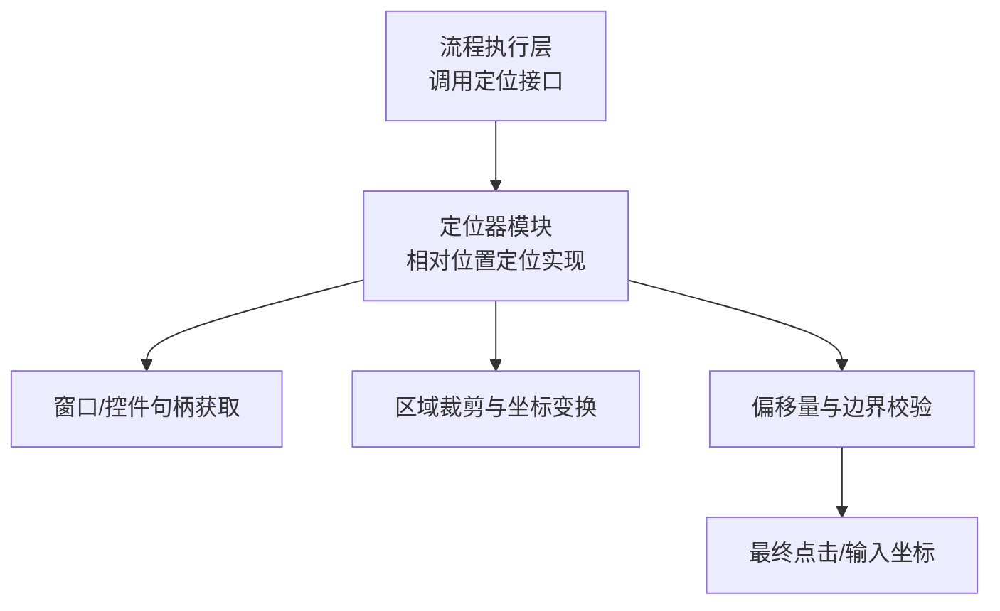
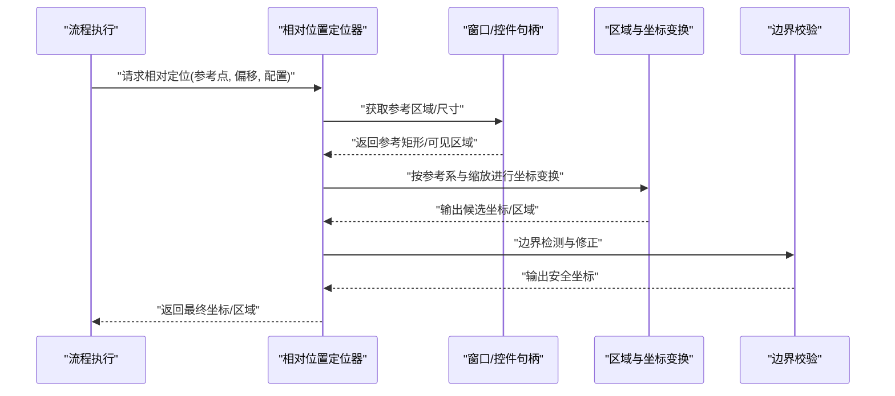
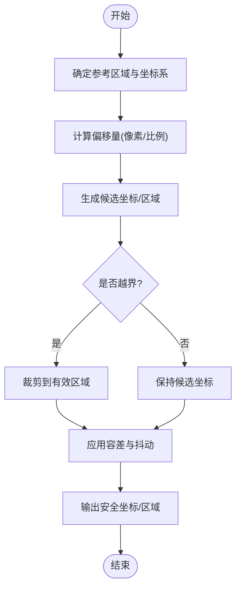
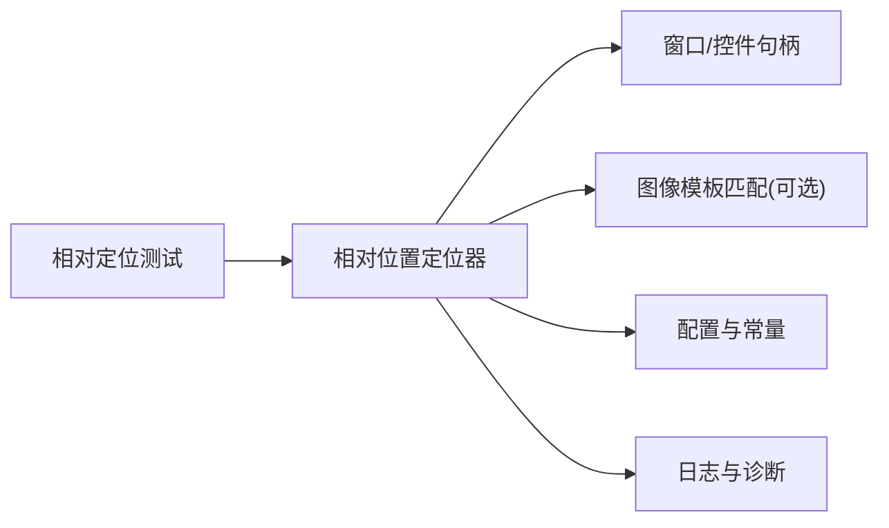

# 相对位置定位器

<cite>
**本文引用的文件**   
- [wt_flow_locator.py](file://wt_flow_locator.py)
- [test_wt_flow_locator_relative_window.py](file://tests/test_wt_flow_locator_relative_window.py)
- [debug-relative-region-offset.md](file://debug-relative-region-offset.md)
- [PROJECT_ARCHITECTURE.md](file://PROJECT_ARCHITECTURE.md)
</cite>

## 目录
1. [简介](#简介)
2. [项目结构](#项目结构)
3. [核心组件](#核心组件)
4. [架构总览](#架构总览)
5. [详细组件分析](#详细组件分析)
6. [依赖关系分析](#依赖关系分析)
7. [性能考量](#性能考量)
8. [故障排查指南](#故障排查指南)
9. [结论](#结论)
10. [附录](#附录)

## 简介
本文件系统性阐述“基于相对位置的控件定位策略”，围绕以下目标展开：
- 解释相对坐标计算原理，包括相对于父控件、屏幕或其他参考点的定位方式。
- 说明偏移量计算与边界检测机制，确保控件操作的准确性与鲁棒性。
- 提供相对位置定位的配置选项，涵盖坐标系定义、缩放适配与分辨率无关性处理。
- 介绍适用场景（动态布局、响应式界面等）并给出实践建议。
- 通过代码片段路径展示如何实现灵活的相对定位逻辑。
- 总结局限性与最佳实践。

## 项目结构
本项目在自动化流程执行中采用多策略定位器体系，其中“相对位置定位”作为关键能力之一，主要实现位于流程定位模块中，并通过测试与调试文档进行验证与问题追踪。

图表来源
- [wt_flow_locator.py](file://wt_flow_locator.py)
- [test_wt_flow_locator_relative_window.py](file://tests/test_wt_flow_locator_relative_window.py)

章节来源
- [PROJECT_ARCHITECTURE.md](file://PROJECT_ARCHITECTURE.md)

## 核心组件
- 相对位置定位器：以参考点为基准，结合偏移量与边界约束，计算目标控件的绝对坐标或可操作区域。
- 参考点选择：支持父控件、窗口客户区、屏幕等参考系。
- 偏移量计算：支持像素级与比例级偏移，兼容不同DPI与缩放。
- 边界检测：防止越界点击，自动回退到安全区域。
- 配置项：坐标系定义、缩放因子、容差阈值、锚点策略等。

章节来源
- [wt_flow_locator.py](file://wt_flow_locator.py)
- [test_wt_flow_locator_relative_window.py](file://tests/test_wt_flow_locator_relative_window.py)

## 架构总览
相对位置定位在整体流程中的角色如下：

图表来源
- [wt_flow_locator.py](file://wt_flow_locator.py)
- [test_wt_flow_locator_relative_window.py](file://tests/test_wt_flow_locator_relative_window.py)

## 详细组件分析

### 相对坐标计算原理
- 参考系定义
  - 父控件：以父控件的客户区左上角为原点，适合层级明确的UI树。
  - 窗口：以当前活动窗口的客户区为参考，适合跨控件但同窗口的定位。
  - 屏幕：以屏幕左上角为原点，适合全局定位或跨进程场景。
- 坐标变换
  - 将相对坐标转换为绝对坐标时，需叠加参考区域的偏移，并考虑DPI缩放与窗口边框/标题栏差异。
- 比例与像素混合
  - 支持按比例（如0.5表示中心）与像素偏移组合，提升在不同分辨率下的稳定性。

章节来源
- [wt_flow_locator.py](file://wt_flow_locator.py)

### 偏移量计算与边界检测
- 偏移量计算
  - 基础偏移：在参考区域内按固定像素或比例移动。
  - 锚点策略：支持左上、右上、左下、右下、中心等锚点，便于对齐与居中。
- 边界检测
  - 越界检查：当候选坐标超出参考区域或窗口可视范围时，自动裁剪至有效区域。
  - 安全回退：若目标区域不可见或被遮挡，回退到最近的安全点击点。
- 容差与抖动
  - 引入容差阈值，容忍渲染误差与轻微漂移，提高命中稳定性。

图表来源
- [wt_flow_locator.py](file://wt_flow_locator.py)
- [debug-relative-region-offset.md](file://debug-relative-region-offset.md)

章节来源
- [wt_flow_locator.py](file://wt_flow_locator.py)
- [debug-relative-region-offset.md](file://debug-relative-region-offset.md)

### 配置选项
- 坐标系定义
  - 参考点类型：父控件、窗口、屏幕。
  - 原点约定：左上角为(0,0)，Y轴向下为正。
- 缩放适配
  - DPI感知：根据系统DPI调整像素与比例的换算。
  - 窗口缩放：针对高分屏与缩放模式进行补偿。
- 分辨率无关性
  - 优先使用比例偏移；必要时辅以像素偏移。
  - 对容器尺寸变化进行自适应。
- 其他参数
  - 容差阈值：控制命中判定宽松度。
  - 锚点策略：决定相对偏移的起始点。
  - 超时与重试：在动态加载场景下增加鲁棒性。

章节来源
- [wt_flow_locator.py](file://wt_flow_locator.py)

### 适用场景
- 动态布局：控件位置随数据或主题变化，相对定位能减少硬编码。
- 响应式界面：不同分辨率与缩放模式下保持稳定命中。
- 跨版本兼容：UI微调不影响定位逻辑。
- 复杂嵌套：父子层级清晰时，基于父控件的相对定位更稳健。

[本节为概念性内容，不直接分析具体文件]

### 实际代码示例（片段路径）
以下为相对定位的关键实现片段路径，便于快速定位源码：
- 相对定位主流程入口与参数解析
  - [wt_flow_locator.py](file://wt_flow_locator.py)
- 参考区域获取与坐标变换
  - [wt_flow_locator.py](file://wt_flow_locator.py)
- 边界检测与安全回退
  - [wt_flow_locator.py](file://wt_flow_locator.py)
- 单元测试用例（相对窗口定位）
  - [test_wt_flow_locator_relative_window.py](file://tests/test_wt_flow_locator_relative_window.py)

章节来源
- [wt_flow_locator.py](file://wt_flow_locator.py)
- [test_wt_flow_locator_relative_window.py](file://tests/test_wt_flow_locator_relative_window.py)

## 依赖关系分析
相对位置定位器与其他模块的耦合关系如下：

图表来源
- [wt_flow_locator.py](file://wt_flow_locator.py)
- [test_wt_flow_locator_relative_window.py](file://tests/test_wt_flow_locator_relative_window.py)

章节来源
- [wt_flow_locator.py](file://wt_flow_locator.py)
- [test_wt_flow_locator_relative_window.py](file://tests/test_wt_flow_locator_relative_window.py)

## 性能考量
- 避免频繁全屏截图：优先使用窗口/控件句柄获取区域，降低IO开销。
- 缓存参考区域：在窗口未重绘前复用已计算的参考矩形。
- 合理设置容差：过大的容差可能误命中，过小则不稳定，需权衡。
- 并行化限制：定位通常串行执行以避免竞态条件。

[本节为通用指导，不直接分析具体文件]

## 故障排查指南
- 常见症状
  - 点击偏移：检查参考区域是否正确、DPI缩放是否生效。
  - 越界失败：确认边界检测逻辑与窗口可视区域。
  - 动态加载导致失败：增加等待与重试策略。
- 定位步骤
  - 打印参考区域与候选坐标，核对坐标系与原点。
  - 逐步缩小偏移量，观察命中变化。
  - 切换参考系（父控件→窗口→屏幕）对比结果。
- 相关调试记录
  - 相对区域偏移问题记录与修复要点
    - [debug-relative-region-offset.md](file://debug-relative-region-offset.md)

章节来源
- [debug-relative-region-offset.md](file://debug-relative-region-offset.md)
- [wt_flow_locator.py](file://wt_flow_locator.py)

## 结论
相对位置定位策略通过参考系、偏移量与边界检测的组合，能够在动态与响应式界面中提供稳定且可维护的定位能力。配合合理的配置与容错机制，可显著降低因分辨率、缩放与UI微调带来的回归风险。建议在项目中统一采用比例优先、像素补充的策略，并结合测试覆盖与调试工具持续优化。

[本节为总结性内容，不直接分析具体文件]

## 附录
- 术语
  - 参考区域：用于计算相对坐标的基础矩形。
  - 锚点：相对偏移的起点（如中心、左上等）。
  - 容差：允许的位置偏差范围。
- 扩展方向
  - 与图像模板匹配融合，增强弱特征控件的定位能力。
  - 引入自适应学习，根据历史命中情况动态调整容差与锚点。

[本节为概念性内容，不直接分析具体文件]