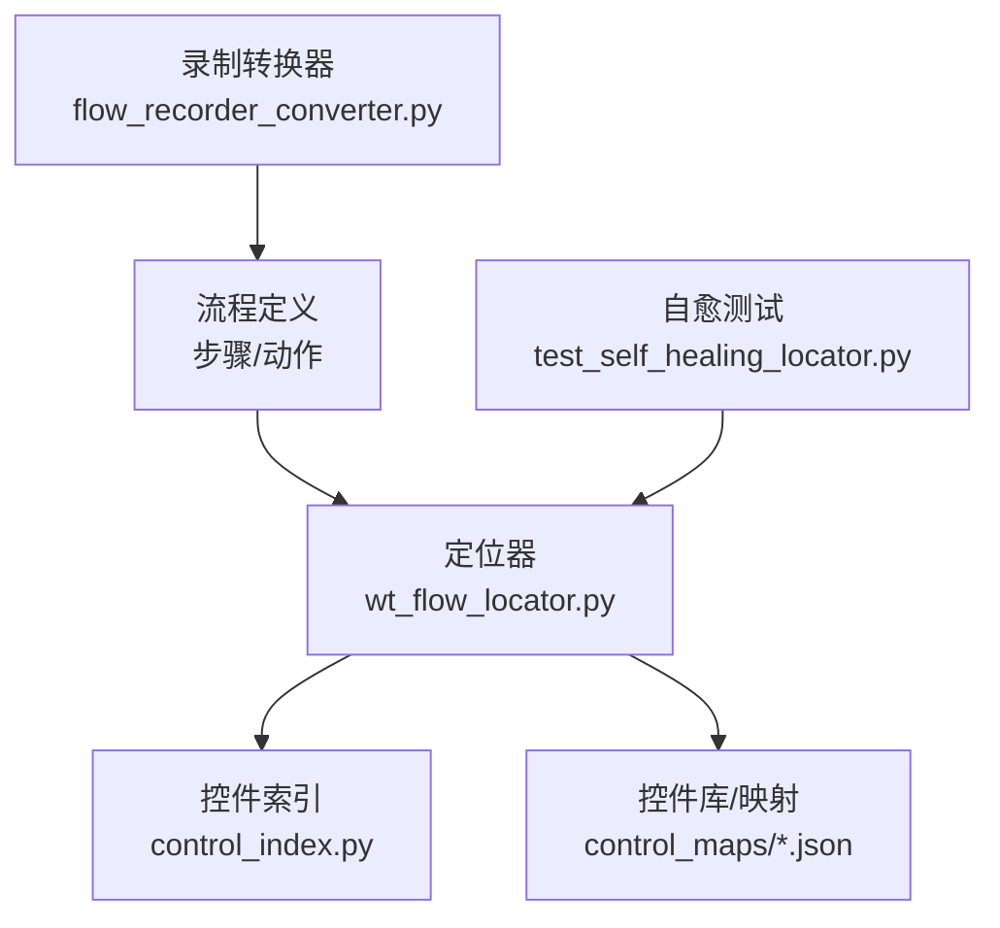
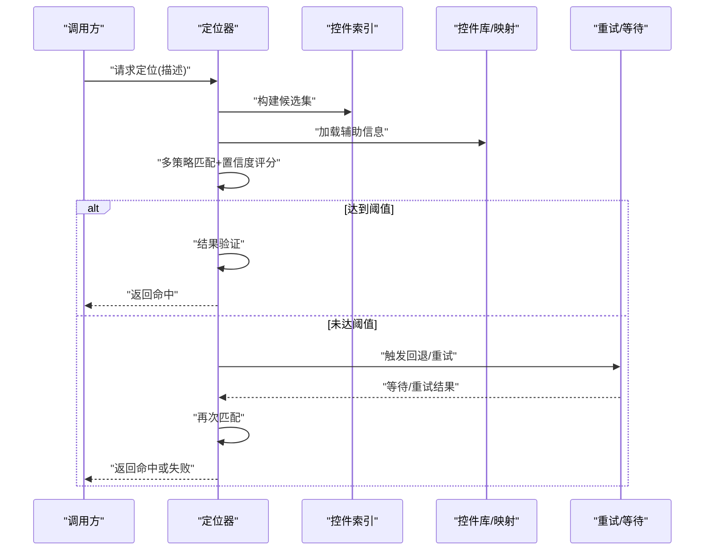
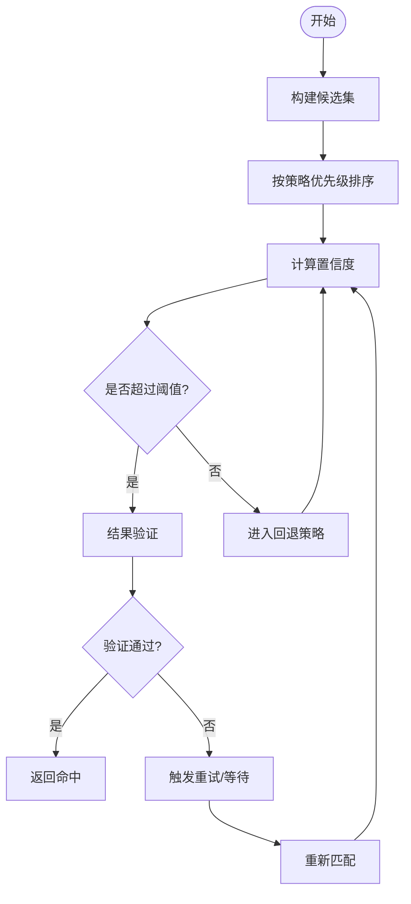
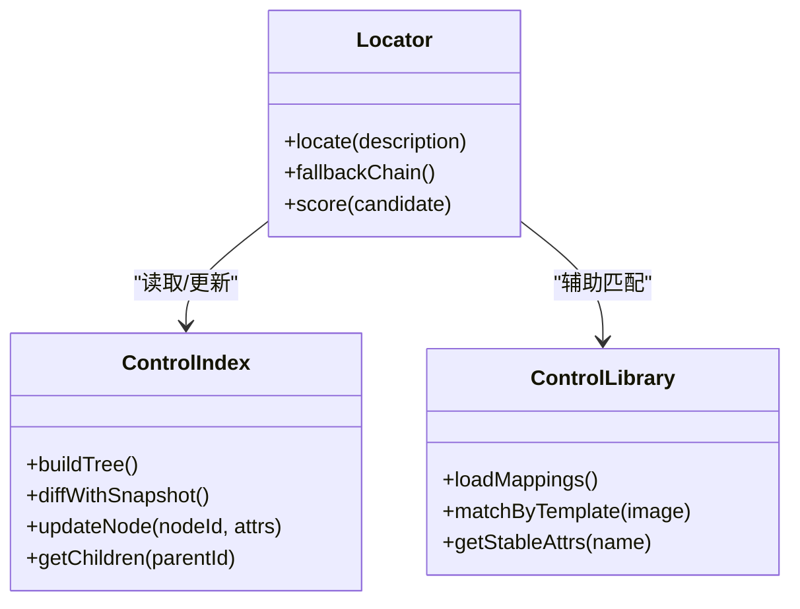
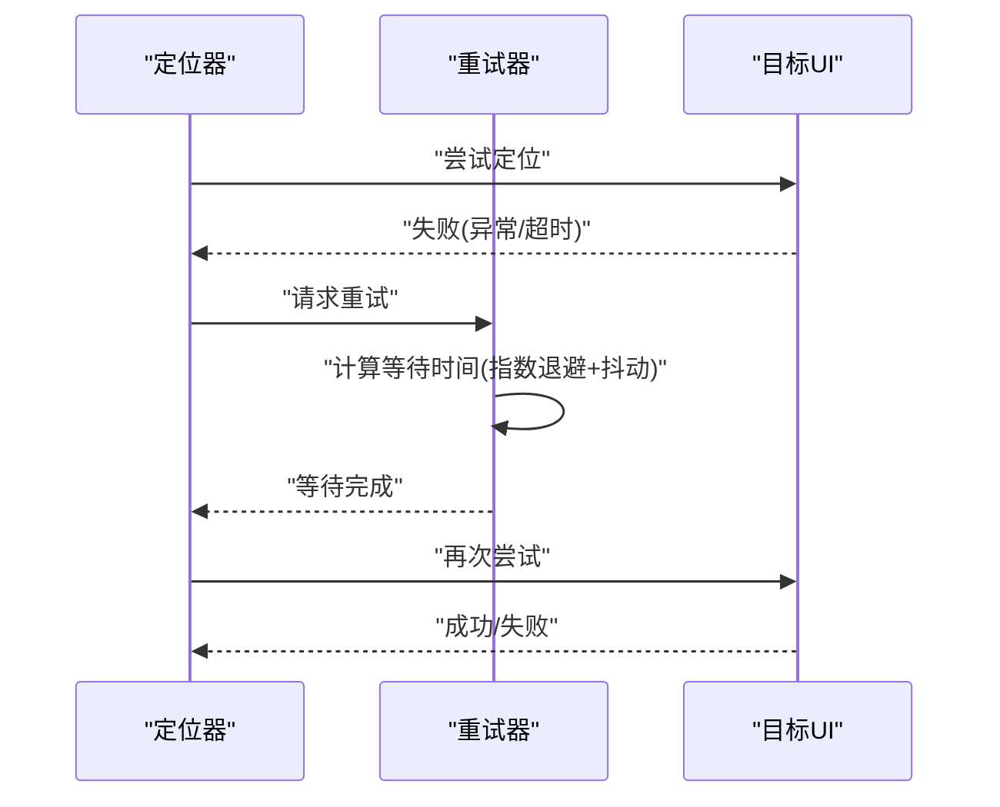
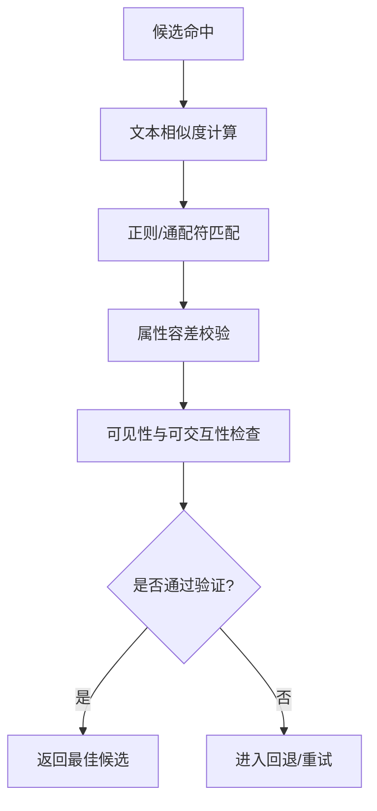
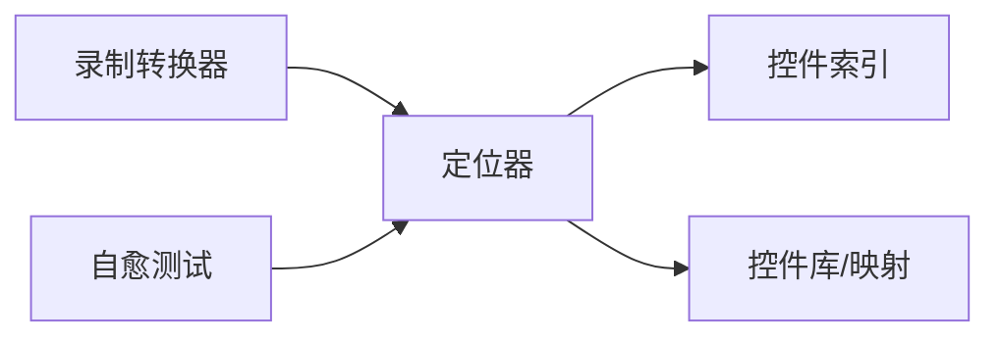

# 自适应定位算法

<cite>
**本文引用的文件**   
- [wt_flow_locator.py](file://wt_flow_locator.py)
- [test_self_healing_locator.py](file://tests/test_self_healing_locator.py)
- [control_index.py](file://WT_AUTOMATION_Agent/control_index.py)
- [control_maps/总控件信息.json](file://control_maps/总控件信息.json)
- [flow_recorder_converter.py](file://flow_recorder_converter.py)
- [debug-click-9-miss.md](file://debug-click-9-miss.md)
- [debug-private-group-click.md](file://debug-private-group-click.md)
- [debug-relative-region-offset.md](file://debug-relative-region-offset.md)
- [debug-default-height-relative-input.md](file://debug-default-height-relative-input.md)
- [debug-time-series-input-regression.md](file://debug-time-series-input-regression.md)
- [debug-start-validation-regression.md](file://debug-start-validation-regression.md)
</cite>

## 目录
1. [简介](#简介)
2. [项目结构](#项目结构)
3. [核心组件](#核心组件)
4. [架构总览](#架构总览)
5. [详细组件分析](#详细组件分析)
6. [依赖关系分析](#依赖关系分析)
7. [性能考量](#性能考量)
8. [故障排查指南](#故障排查指南)
9. [结论](#结论)
10. [附录](#附录)

## 简介
本文件围绕“自适应定位算法”的设计与实现进行深入解析，重点覆盖以下方面：
- 多策略融合的定位策略：优先级排序、置信度评估与回退机制
- UI变化检测与自动适应：布局与控件属性的动态变化处理
- 智能重试机制：重试策略、等待时机与异常恢复
- 定位精度优化：模糊匹配、容错处理与结果验证
- 配置参数调优：阈值设置与性能平衡
- 调试案例与问题解决经验：帮助开发者理解并优化定位效果

## 项目结构
本项目在自动化流程执行中，将“定位器”作为关键子系统，负责根据高层语义或结构化描述，在目标UI上找到并操作控件。与自适应定位相关的核心文件包括：
- wt_flow_locator.py：定位器主实现，包含多策略融合、置信度计算、回退与重试逻辑
- tests/test_self_healing_locator.py：针对自愈定位的测试用例，覆盖边界条件与回归场景
- WT_AUTOMATION_Agent/control_index.py：控件索引构建与管理，支撑快速检索与属性聚合
- control_maps/总控件信息.json：运行时或离线采集的控件元数据集合，用于辅助定位与校验
- flow_recorder_converter.py：录制脚本到流程定义的转换，影响定位描述的结构与稳定性
- 若干调试文档：记录典型问题、根因分析与修复建议

图表来源
- [wt_flow_locator.py](file://wt_flow_locator.py)
- [control_index.py](file://WT_AUTOMATION_Agent/control_index.py)
- [control_maps/总控件信息.json](file://control_maps/总控件信息.json)
- [flow_recorder_converter.py](file://flow_recorder_converter.py)
- [test_self_healing_locator.py](file://tests/test_self_healing_locator.py)

章节来源
- [wt_flow_locator.py](file://wt_flow_locator.py)
- [control_index.py](file://WT_AUTOMATION_Agent/control_index.py)
- [control_maps/总控件信息.json](file://control_maps/总控件信息.json)
- [flow_recorder_converter.py](file://flow_recorder_converter.py)
- [test_self_healing_locator.py](file://tests/test_self_healing_locator.py)

## 核心组件
- 多策略定位器
  - 支持多种定位策略（如名称、类型、层级路径、相对位置、图像模板等），按优先级顺序尝试
  - 对每个候选结果进行置信度评分，选择最高分作为最终命中
  - 当首选策略失败时，触发回退策略链，逐步放宽约束或切换策略
- 控件索引与库
  - 维护控件树与属性快照，提供快速过滤与近似匹配能力
  - 结合控制映射库，提升跨版本/跨主题下的鲁棒性
- 自愈与重试
  - 内置指数退避与抖动等待，避免瞬时状态导致的误判
  - 异常恢复：捕获常见异常（超时、不可见、不可交互），自动降级或重试
- 结果验证
  - 命中后进行二次校验（可见性、可交互性、文本一致性、区域合理性）
  - 失败则进入回退或重试分支

章节来源
- [wt_flow_locator.py](file://wt_flow_locator.py)
- [control_index.py](file://WT_AUTOMATION_Agent/control_index.py)
- [control_maps/总控件信息.json](file://control_maps/总控件信息.json)
- [test_self_healing_locator.py](file://tests/test_self_healing_locator.py)

## 架构总览
自适应定位的整体流程如下：
- 输入：流程步骤中的定位描述（可能包含语义、规则、相对偏移、模板等）
- 预处理：规范化描述、加载索引/库、构建候选集
- 多策略匹配：按优先级依次尝试，计算置信度
- 决策与回退：选择最优候选；若未达阈值，进入回退链
- 重试与等待：遇到瞬态错误时，采用智能重试
- 验证与输出：二次校验通过后返回控件句柄或坐标

图表来源
- [wt_flow_locator.py](file://wt_flow_locator.py)
- [control_index.py](file://WT_AUTOMATION_Agent/control_index.py)
- [control_maps/总控件信息.json](file://control_maps/总控件信息.json)

## 详细组件分析

### 多策略融合与优先级排序
- 策略集合
  - 精确匹配：名称、类名、层级路径
  - 模糊匹配：文本相似度、正则、部分匹配
  - 相对定位：基于父容器或相邻控件的偏移
  - 图像模板：视觉相似性匹配
- 优先级设计
  - 优先使用稳定且高效的策略（如名称+类型）
  - 当不稳定或变更频繁时，降级为相对定位或图像模板
- 置信度评估
  - 综合多个维度：文本相似度、可见性、可交互性、历史命中率、上下文一致性
  - 设定阈值，低于阈值的候选被丢弃或进入回退链

图表来源
- [wt_flow_locator.py](file://wt_flow_locator.py)

章节来源
- [wt_flow_locator.py](file://wt_flow_locator.py)

### UI变化检测与自动适应
- 变化检测
  - 对比当前控件树与索引/库快照，识别新增、删除、重命名、属性漂移
  - 关注高频变更字段：标题、占位符、尺寸、可见性、层级深度
- 自动适应
  - 动态调整策略权重：当某策略命中率下降时，降低其优先级
  - 引入相对定位与图像模板作为兜底，提高鲁棒性
  - 增量更新索引：仅刷新受影响节点，减少全量重建开销

图表来源
- [control_index.py](file://WT_AUTOMATION_Agent/control_index.py)
- [control_maps/总控件信息.json](file://control_maps/总控件信息.json)
- [wt_flow_locator.py](file://wt_flow_locator.py)

章节来源
- [control_index.py](file://WT_AUTOMATION_Agent/control_index.py)
- [control_maps/总控件信息.json](file://control_maps/总控件信息.json)
- [wt_flow_locator.py](file://wt_flow_locator.py)

### 智能重试机制
- 重试策略
  - 指数退避：等待时间随重试次数递增
  - 抖动：加入随机扰动，避免并发竞争
  - 最大重试次数与总超时限制
- 等待时机
  - 页面加载、动画过渡、异步渲染完成
  - 控件可见性与可交互性就绪
- 异常恢复
  - 捕获超时、不可见、不可点击等异常
  - 自动降级策略（从精确到模糊，从绝对到相对）

图表来源
- [wt_flow_locator.py](file://wt_flow_locator.py)

章节来源
- [wt_flow_locator.py](file://wt_flow_locator.py)

### 定位精度优化技术
- 模糊匹配
  - 文本相似度（编辑距离、Jaccard、余弦相似度）
  - 正则表达式与通配符
- 容错处理
  - 忽略大小写、空白字符差异
  - 容忍局部属性漂移（如高度、边距微调）
- 结果验证
  - 二次检查：可见性、可交互性、文本一致性、区域合理性
  - 冲突消解：当多个候选得分接近时，结合上下文与历史命中率择优

图表来源
- [wt_flow_locator.py](file://wt_flow_locator.py)

章节来源
- [wt_flow_locator.py](file://wt_flow_locator.py)

### 配置参数调优指南
- 阈值设置
  - 置信度阈值：过高导致漏命，过低导致误命
  - 相似度阈值：文本/图像匹配的严格程度
  - 容差范围：尺寸、偏移、文本差异的允许区间
- 性能平衡
  - 策略数量与复杂度：过多策略增加耗时
  - 重试次数与等待时长：过长影响整体效率
  - 索引更新频率：全量 vs 增量更新的权衡
- 推荐实践
  - 以业务稳定性优先，逐步放宽阈值
  - 监控命中率与耗时，结合A/B策略对比
  - 定期更新控件库与索引，保持与UI同步

章节来源
- [wt_flow_locator.py](file://wt_flow_locator.py)

### 实际调试案例与问题解决经验
- 点击遗漏问题
  - 现象：特定按钮点击失败或误点
  - 原因：相对偏移计算偏差或控件层级变化
  - 解决：引入更稳健的父容器锚定与二次验证
  - 参考：[debug-click-9-miss.md](file://debug-click-9-miss.md)
- 私有分组点击问题
  - 现象：私有分组内控件无法定位
  - 原因：可见性或层级隐藏导致索引缺失
  - 解决：扩展可见性判断与懒加载适配
  - 参考：[debug-private-group-click.md](file://debug-private-group-click.md)
- 相对区域偏移问题
  - 现象：相对定位偏移不正确
  - 原因：默认尺寸假设与实际不符
  - 解决：动态获取基准控件尺寸，修正偏移计算
  - 参考：[debug-relative-region-offset.md](file://debug-relative-region-offset.md)
- 默认高度相对输入框问题
  - 现象：输入框高度变化导致定位失效
  - 原因：固定高度假设
  - 解决：基于内容自适应高度，更新索引快照
  - 参考：[debug-default-height-relative-input.md](file://debug-default-height-relative-input.md)
- 时间序列输入回归问题
  - 现象：时间序列输入控件定位回归
  - 原因：控件ID或文本动态生成
  - 解决：增强模糊匹配与正则策略
  - 参考：[debug-time-series-input-regression.md](file://debug-time-series-input-regression.md)
- 启动验证回归问题
  - 现象：启动阶段验证失败
  - 原因：初始化时序与UI就绪状态不一致
  - 解决：增加等待与重试，确保状态一致
  - 参考：[debug-start-validation-regression.md](file://debug-start-validation-regression.md)

章节来源
- [debug-click-9-miss.md](file://debug-click-9-miss.md)
- [debug-private-group-click.md](file://debug-private-group-click.md)
- [debug-relative-region-offset.md](file://debug-relative-region-offset.md)
- [debug-default-height-relative-input.md](file://debug-default-height-relative-input.md)
- [debug-time-series-input-regression.md](file://debug-time-series-input-regression.md)
- [debug-start-validation-regression.md](file://debug-start-validation-regression.md)

## 依赖关系分析
- 内部依赖
  - 定位器依赖控件索引与控件库，形成“描述→候选→评分→验证”的闭环
  - 录制转换器影响定位描述的结构，间接影响定位稳定性
- 外部依赖
  - UI框架接口（如UIA、Win32）用于枚举控件与属性访问
  - 图像处理库用于模板匹配（可选）
- 潜在循环依赖
  - 定位器不应反向修改索引的构建逻辑，避免耦合过深
- 接口契约
  - 定位器对外暴露统一的定位API，屏蔽内部策略细节
  - 索引与库提供稳定的查询接口，便于替换实现

图表来源
- [wt_flow_locator.py](file://wt_flow_locator.py)
- [control_index.py](file://WT_AUTOMATION_Agent/control_index.py)
- [control_maps/总控件信息.json](file://control_maps/总控件信息.json)
- [flow_recorder_converter.py](file://flow_recorder_converter.py)
- [test_self_healing_locator.py](file://tests/test_self_healing_locator.py)

章节来源
- [wt_flow_locator.py](file://wt_flow_locator.py)
- [control_index.py](file://WT_AUTOMATION_Agent/control_index.py)
- [control_maps/总控件信息.json](file://control_maps/总控件信息.json)
- [flow_recorder_converter.py](file://flow_recorder_converter.py)
- [test_self_healing_locator.py](file://tests/test_self_healing_locator.py)

## 性能考量
- 策略复杂度
  - 精确匹配O(n)，模糊匹配O(n log n)或更高，需控制候选规模
- 索引更新成本
  - 增量更新优于全量重建，注意缓存失效策略
- 重试与等待
  - 合理设置退避与抖动，避免雪崩效应
- 资源占用
  - 图像模板匹配消耗CPU/GPU，应按需启用
- 监控指标
  - 命中率、平均耗时、重试率、失败分布

## 故障排查指南
- 常见问题
  - 命中率低：检查策略优先级与阈值设置
  - 偶发失败：关注重试与等待配置，排查UI就绪状态
  - 回归问题：核对控件库与索引是否与UI同步
- 诊断方法
  - 开启详细日志，记录候选集与评分过程
  - 使用自愈测试覆盖边界场景
  - 对照调试文档定位根因
- 恢复策略
  - 临时放宽阈值或切换策略
  - 强制刷新索引与控件库
  - 重启应用或重置UI状态

章节来源
- [test_self_healing_locator.py](file://tests/test_self_healing_locator.py)
- [debug-click-9-miss.md](file://debug-click-9-miss.md)
- [debug-private-group-click.md](file://debug-private-group-click.md)
- [debug-relative-region-offset.md](file://debug-relative-region-offset.md)
- [debug-default-height-relative-input.md](file://debug-default-height-relative-input.md)
- [debug-time-series-input-regression.md](file://debug-time-series-input-regression.md)
- [debug-start-validation-regression.md](file://debug-start-validation-regression.md)

## 结论
自适应定位算法通过多策略融合、置信度评估与智能回退，显著提升了在动态UI环境下的鲁棒性与准确性。配合合理的配置调优与完善的调试体系，可在保证性能的同时，持续优化定位效果。建议在生产环境中建立监控与反馈闭环，持续迭代策略与阈值，以适应不断变化的界面与业务需求。

## 附录
- 术语表
  - 置信度：衡量候选命中可靠性的数值
  - 回退链：当首选策略失败时依次尝试的策略序列
  - 自愈：自动检测并修复定位问题的机制
- 参考文件
  - [wt_flow_locator.py](file://wt_flow_locator.py)
  - [control_index.py](file://WT_AUTOMATION_Agent/control_index.py)
  - [control_maps/总控件信息.json](file://control_maps/总控件信息.json)
  - [flow_recorder_converter.py](file://flow_recorder_converter.py)
  - [test_self_healing_locator.py](file://tests/test_self_healing_locator.py)
  - 调试文档集合（见上文各节）