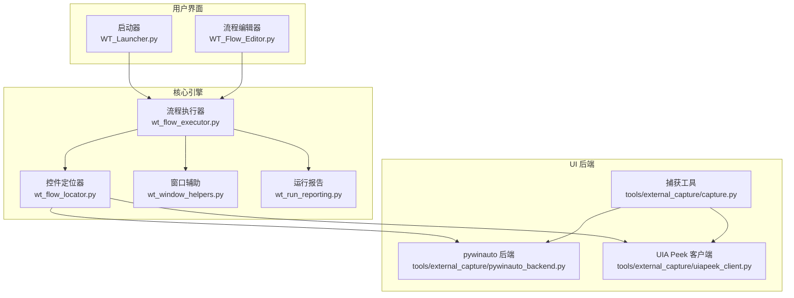
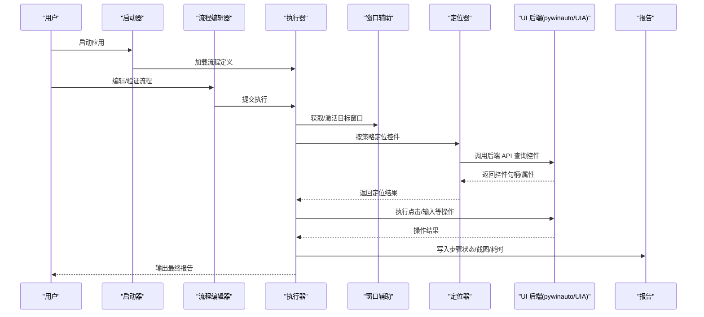
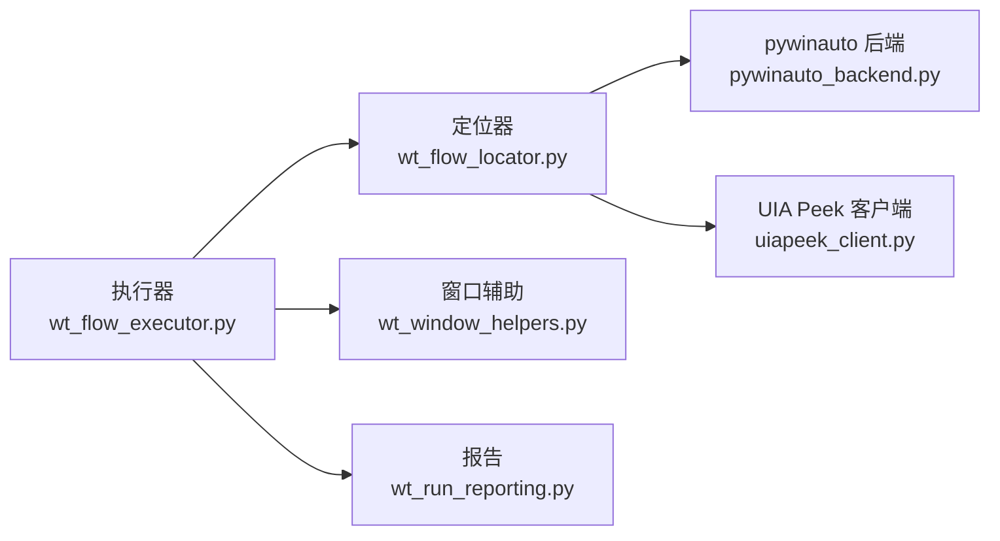

# 故障排除

<cite>
**本文引用的文件**   
- [README.md](file://README.md)
- [PROJECT_ARCHITECTURE.md](file://PROJECT_ARCHITECTURE.md)
- [WT_Launcher.py](file://WT_Launcher.py)
- [WT_Flow_Editor.py](file://WT_Flow_Editor.py)
- [wt_flow_executor.py](file://wt_flow_executor.py)
- [wt_flow_locator.py](file://wt_flow_locator.py)
- [wt_window_helpers.py](file://wt_window_helpers.py)
- [wt_run_reporting.py](file://wt_run_reporting.py)
- [tools/external_capture/pywinauto_backend.py](file://tools/external_capture/pywinauto_backend.py)
- [tools/external_capture/uiapeek_client.py](file://tools/external_capture/uiapeek_client.py)
- [tools/external_capture/capture.py](file://tools/external_capture/capture.py)
- [debug-click-9-miss.md](file://debug-click-9-miss.md)
- [debug-default-height-relative-input.md](file://debug-default-height-relative-input.md)
- [debug-private-group-click.md](file://debug-private-group-click.md)
- [debug-relative-region-offset.md](file://debug-relative-region-offset.md)
- [debug-start-validation-regression.md](file://debug-start-validation-regression.md)
- [debug-time-series-input-regression.md](file://debug-time-series-input-regression.md)
- [debug-cft02-step16-drift.md](file://debug-cft02-step16-drift.md)
</cite>

## 目录
1. [简介](#简介)
2. [项目结构](#项目结构)
3. [核心组件](#核心组件)
4. [架构总览](#架构总览)
5. [详细组件分析](#详细组件分析)
6. [依赖关系分析](#依赖关系分析)
7. [性能考虑](#性能考虑)
8. [故障排除指南](#故障排除指南)
9. [结论](#结论)
10. [附录](#附录)

## 简介
本指南面向使用 WT 自动化框架的测试工程师与运维人员，聚焦于安装、配置、运行时异常、控件定位失败、识别精度低、平台兼容性问题、内存与性能瓶颈、网络超时与外部服务连接问题等常见问题的系统化排查与解决。文档结合仓库中的调试记录与核心模块实现，提供从现象到根因再到修复步骤的完整路径，并给出可操作的日志分析与诊断方法。

## 项目结构
WT 自动化框架采用“流程驱动 + 多后端控件定位”的架构：上层通过流程定义驱动执行器，执行器协调窗口辅助、定位器、报告生成等组件；底层通过 pywinauto 或 UIA Peek 客户端访问目标应用 UI。关键入口包括启动器、流程编辑器、执行器与定位器。

图表来源
- [WT_Launcher.py](file://WT_Launcher.py)
- [WT_Flow_Editor.py](file://WT_Flow_Editor.py)
- [wt_flow_executor.py](file://wt_flow_executor.py)
- [wt_flow_locator.py](file://wt_flow_locator.py)
- [wt_window_helpers.py](file://wt_window_helpers.py)
- [wt_run_reporting.py](file://wt_run_reporting.py)
- [tools/external_capture/pywinauto_backend.py](file://tools/external_capture/pywinauto_backend.py)
- [tools/external_capture/uiapeek_client.py](file://tools/external_capture/uiapeek_client.py)
- [tools/external_capture/capture.py](file://tools/external_capture/capture.py)

章节来源
- [README.md](file://README.md)
- [PROJECT_ARCHITECTURE.md](file://PROJECT_ARCHITECTURE.md)

## 核心组件
- 启动器与编辑器：负责加载流程、初始化环境、触发执行与展示结果。
- 执行器：解析流程定义、调度动作、管理等待与重试、收集断言与指标。
- 定位器：基于 UIA/Win32/AI 模板等多策略进行控件查找与点击。
- 窗口辅助：处理窗口激活、进程发现、相对区域计算等。
- 报告：汇总执行结果、错误堆栈、截图与耗时统计。
- UI 后端：封装 pywinauto 与 UIA Peek 客户端，屏蔽差异并提供统一接口。

章节来源
- [wt_flow_executor.py](file://wt_flow_executor.py)
- [wt_flow_locator.py](file://wt_flow_locator.py)
- [wt_window_helpers.py](file://wt_window_helpers.py)
- [wt_run_reporting.py](file://wt_run_reporting.py)
- [tools/external_capture/pywinauto_backend.py](file://tools/external_capture/pywinauto_backend.py)
- [tools/external_capture/uiapeek_client.py](file://tools/external_capture/uiapeek_client.py)

## 架构总览
下图展示了典型一次“打开窗口并点击按钮”的执行序列，涵盖执行器、定位器、窗口辅助与 UI 后端的交互。

图表来源
- [wt_flow_executor.py](file://wt_flow_executor.py)
- [wt_flow_locator.py](file://wt_flow_locator.py)
- [wt_window_helpers.py](file://wt_window_helpers.py)
- [wt_run_reporting.py](file://wt_run_reporting.py)
- [tools/external_capture/pywinauto_backend.py](file://tools/external_capture/pywinauto_backend.py)
- [tools/external_capture/uiapeek_client.py](file://tools/external_capture/uiapeek_client.py)

## 详细组件分析

### 流程执行器（wt_flow_executor.py）
- 职责：解析流程、调度动作、管理等待与重试、聚合断言与指标、触发报告。
- 常见问题：
  - 流程校验失败：字段缺失、类型不匹配、引用不存在。
  - 执行中断：未捕获异常导致步骤终止。
  - 资源泄漏：未正确释放窗口句柄或线程。
- 建议：
  - 在关键步骤前后增加日志与截图。
  - 对不稳定操作设置合理重试与退避。
  - 将耗时统计与阈值告警纳入报告。

章节来源
- [wt_flow_executor.py](file://wt_flow_executor.py)

### 控件定位器（wt_flow_locator.py）
- 职责：组合多种定位策略（名称、类名、层级、图像模板、相对区域），返回最可靠的控件。
- 常见问题：
  - 定位失败：控件树变化、动态 ID、延迟渲染。
  - 误命中：相似控件无法区分。
  - 性能差：遍历过深或图像匹配尺度过多。
- 建议：
  - 优先使用稳定属性（如 AutomationId）。
  - 引入相对区域与上下文窗口缩小搜索范围。
  - 缓存常用控件索引，减少重复扫描。

章节来源
- [wt_flow_locator.py](file://wt_flow_locator.py)

### 窗口辅助（wt_window_helpers.py）
- 职责：进程发现、窗口枚举、激活、坐标转换、相对区域计算。
- 常见问题：
  - 高 DPI 缩放导致坐标偏移。
  - 多显示器布局差异。
  - 窗口标题动态变化。
- 建议：
  - 使用稳定的窗口标识（类名+进程）。
  - 显式处理 DPI 与缩放因子。
  - 对相对区域做边界检查与容错。

章节来源
- [wt_window_helpers.py](file://wt_window_helpers.py)

### 运行报告（wt_run_reporting.py）
- 职责：汇总步骤状态、错误信息、截图、耗时、重试次数。
- 常见问题：
  - 报告过大影响 IO。
  - 截图路径冲突或权限不足。
- 建议：
  - 按需裁剪截图尺寸与数量。
  - 为不同环境分离报告目录。

章节来源
- [wt_run_reporting.py](file://wt_run_reporting.py)

### UI 后端（pywinauto_backend.py / uiapeek_client.py）
- 职责：封装 pywinauto 与 UIA Peek 客户端，提供统一的控件查询与操作接口。
- 常见问题：
  - pywinauto 后端不可用：缺少依赖或权限不足。
  - UIA Peek 客户端未启动或通信失败。
- 建议：
  - 启动前检测后端可用性并回退。
  - 对网络通信设置超时与重试。

章节来源
- [tools/external_capture/pywinauto_backend.py](file://tools/external_capture/pywinauto_backend.py)
- [tools/external_capture/uiapeek_client.py](file://tools/external_capture/uiapeek_client.py)

### 捕获工具（capture.py）
- 职责：屏幕捕获、控件快照、辅助定位与调试。
- 常见问题：
  - 捕获失败：全屏/多屏/虚拟化桌面。
  - 分辨率不一致导致模板失效。
- 建议：
  - 固定分辨率或使用自适应模板。
  - 捕获时关闭无关弹窗与通知。

章节来源
- [tools/external_capture/capture.py](file://tools/external_capture/capture.py)

## 依赖关系分析
- 执行器强依赖定位器与窗口辅助；定位器依赖 UI 后端；报告独立但被执行器调用。
- 潜在循环依赖：应避免执行器直接依赖后端，而应通过定位器间接访问。
- 外部依赖：pywinauto、UIA Peek 客户端、图像处理库。

图表来源
- [wt_flow_executor.py](file://wt_flow_executor.py)
- [wt_flow_locator.py](file://wt_flow_locator.py)
- [wt_window_helpers.py](file://wt_window_helpers.py)
- [wt_run_reporting.py](file://wt_run_reporting.py)
- [tools/external_capture/pywinauto_backend.py](file://tools/external_capture/pywinauto_backend.py)
- [tools/external_capture/uiapeek_client.py](file://tools/external_capture/uiapeek_client.py)

## 性能考虑
- 定位策略排序：先精确后模糊，减少全树遍历。
- 图像匹配优化：限制尺度与金字塔层数，预缓存模板。
- 并发控制：避免同时操作同一窗口造成竞争。
- 资源回收：及时释放句柄与临时文件。
- 监控指标：步骤耗时、重试次数、定位成功率、截图大小。

## 故障排除指南

### 安装与环境问题
- 症状：启动器或编辑器无法启动、导入失败、缺少模块。
- 排查要点：
  - 确认 Python 版本与依赖包一致。
  - 检查环境变量与路径是否包含必要目录。
  - 以管理员权限运行，确保能访问目标应用进程。
- 参考：
  - 查看 README 的安装说明与依赖清单。
  - 核对 PROJECT_ARCHITECTURE 中对外部工具的依赖。

章节来源
- [README.md](file://README.md)
- [PROJECT_ARCHITECTURE.md](file://PROJECT_ARCHITECTURE.md)

### 配置错误
- 症状：流程无法加载、参数无效、窗口找不到。
- 排查要点：
  - 校验流程 JSON 结构与必填字段。
  - 检查窗口标识（标题/类名/进程）与实际一致。
  - 确认相对区域与 DPI 设置符合当前环境。
- 参考：
  - 使用编辑器内置校验功能。
  - 对比标准流程样例。

章节来源
- [WT_Flow_Editor.py](file://WT_Flow_Editor.py)

### 运行时异常与日志分析
- 症状：步骤中断、无响应、崩溃。
- 排查要点：
  - 定位最近一次成功步骤，缩小范围。
  - 查看执行器日志与报告中的堆栈信息。
  - 关注超时、重试与断言失败的上下文。
- 建议：
  - 在关键步骤前后插入截图与状态打印。
  - 将异常分类记录以便趋势分析。

章节来源
- [wt_flow_executor.py](file://wt_flow_executor.py)
- [wt_run_reporting.py](file://wt_run_reporting.py)

### 控件定位失败与识别精度低
- 症状：点击无效、输入错位、找不到控件。
- 排查要点：
  - 切换定位策略（名称/类名/层级/图像）。
  - 缩小搜索区域至父容器，降低误命中。
  - 检查动态 ID 与延迟渲染导致的时序问题。
- 建议：
  - 建立控件索引库并定期更新。
  - 使用相对区域与锚点控件提升稳定性。
  - 针对高分辨率与缩放调整模板与坐标。

章节来源
- [wt_flow_locator.py](file://wt_flow_locator.py)
- [wt_window_helpers.py](file://wt_window_helpers.py)

### 平台特定与兼容性
- 症状：在多显示器、DPI 缩放、远程桌面下行为异常。
- 排查要点：
  - 固定分辨率与 DPI 设置。
  - 禁用系统动画与通知以减少干扰。
  - 验证目标应用在不同主题下的控件树一致性。
- 建议：
  - 在 CI 中使用一致的虚拟显示与分辨率。
  - 对多显示器场景进行专项回归。

章节来源
- [wt_window_helpers.py](file://wt_window_helpers.py)

### 内存泄漏与性能瓶颈
- 症状：长时间运行后变慢、内存持续增长、卡顿。
- 排查要点：
  - 监控执行器与后端的对象生命周期。
  - 检查是否存在未释放的窗口句柄或线程。
  - 分析热点步骤的耗时分布。
- 建议：
  - 引入资源清理钩子与自动回收。
  - 对图像匹配与控件遍历进行缓存与限流。

章节来源
- [wt_flow_executor.py](file://wt_flow_executor.py)
- [wt_flow_locator.py](file://wt_flow_locator.py)

### 网络请求超时与外部服务连接
- 症状：UIA Peek 客户端连接失败、命令超时、偶发失败。
- 排查要点：
  - 检查客户端是否已启动且端口可用。
  - 增大超时与重试次数，观察失败模式。
  - 确认防火墙与安全软件未拦截通信。
- 建议：
  - 在启动阶段进行健康检查与回退策略。
  - 记录连接质量指标用于容量规划。

章节来源
- [tools/external_capture/uiapeek_client.py](file://tools/external_capture/uiapeek_client.py)
- [tools/external_capture/pywinauto_backend.py](file://tools/external_capture/pywinauto_backend.py)

### 典型问题案例与经验
- 点击偏差与漂移：
  - 现象：点击位置偏移或多次点击无效。
  - 原因：相对区域计算误差、DPI 缩放、窗口滚动。
  - 解决：校准相对区域、固定缩放、添加滚动补偿。
  - 参考：[debug-click-9-miss.md](file://debug-click-9-miss.md)、[debug-cft02-step16-drift.md](file://debug-cft02-step16-drift.md)
- 默认高度与相对输入：
  - 现象：输入框高度默认值导致输入错位。
  - 原因：控件高度未正确读取或样式变化。
  - 解决：显式获取实际高度并修正偏移。
  - 参考：[debug-default-height-relative-input.md](file://debug-default-height-relative-input.md)
- 私有分组点击：
  - 现象：私有分组内控件无法定位。
  - 原因：可见性/启用状态或命名空间隔离。
  - 解决：先展开分组、使用更具体的上下文定位。
  - 参考：[debug-private-group-click.md](file://debug-private-group-click.md)
- 相对区域偏移：
  - 现象：相对区域整体偏移。
  - 原因：父容器坐标基准不一致。
  - 解决：统一坐标系与基准控件。
  - 参考：[debug-relative-region-offset.md](file://debug-relative-region-offset.md)
- 启动校验回归：
  - 现象：启动阶段校验失败导致流程中止。
  - 原因：前置条件未满足或数据不一致。
  - 解决：完善前置检查与自愈逻辑。
  - 参考：[debug-start-validation-regression.md](file://debug-start-validation-regression.md)
- 时间序列输入回归：
  - 现象：时间序列输入格式或顺序错误。
  - 原因：数据源变更或解析逻辑不兼容。
  - 解决：增强输入校验与容错。
  - 参考：[debug-time-series-input-regression.md](file://debug-time-series-input-regression.md)

章节来源
- [debug-click-9-miss.md](file://debug-click-9-miss.md)
- [debug-default-height-relative-input.md](file://debug-default-height-relative-input.md)
- [debug-private-group-click.md](file://debug-private-group-click.md)
- [debug-relative-region-offset.md](file://debug-relative-region-offset.md)
- [debug-start-validation-regression.md](file://debug-start-validation-regression.md)
- [debug-time-series-input-regression.md](file://debug-time-series-input-regression.md)
- [debug-cft02-step16-drift.md](file://debug-cft02-step16-drift.md)

### 调试工具与技巧
- 使用捕获工具生成控件快照与屏幕截图，辅助定位与比对。
- 在定位器中开启详细日志，记录候选控件列表与评分。
- 使用编辑器逐步执行流程，观察每一步的状态与中间结果。
- 对不稳定步骤增加重试与退避，并记录失败样本。

章节来源
- [tools/external_capture/capture.py](file://tools/external_capture/capture.py)
- [wt_flow_locator.py](file://wt_flow_locator.py)
- [WT_Flow_Editor.py](file://WT_Flow_Editor.py)

### 社区支持与帮助渠道
- 查阅 README 与架构文档了解项目背景与依赖。
- 参考仓库中的调试记录与示例流程，对照自身问题。
- 在团队内部共享最佳实践与常见问题解答。

章节来源
- [README.md](file://README.md)
- [PROJECT_ARCHITECTURE.md](file://PROJECT_ARCHITECTURE.md)

## 结论
通过系统化的日志分析、定位策略优化、环境与兼容性治理以及性能监控，可以显著降低 WT 自动化框架的故障率与不稳定因素。建议将上述排查流程沉淀为标准化作业指导书，并在持续集成中引入自动化健康检查与回归用例，保障长期稳定性。

## 附录
- 快速自检清单：
  - 环境：Python 版本、依赖包、管理员权限、DPI 设置。
  - 配置：流程结构、窗口标识、相对区域、超时与重试。
  - 执行：步骤日志、截图、报告路径与大小。
  - 后端：pywinauto 可用性、UIA Peek 客户端状态。
  - 性能：热点步骤、内存占用、句柄数量。
- 建议的监控指标：
  - 定位成功率、平均耗时、重试次数、失败分类占比。
  - 截图数量与大小、IO 吞吐、CPU/内存峰值。