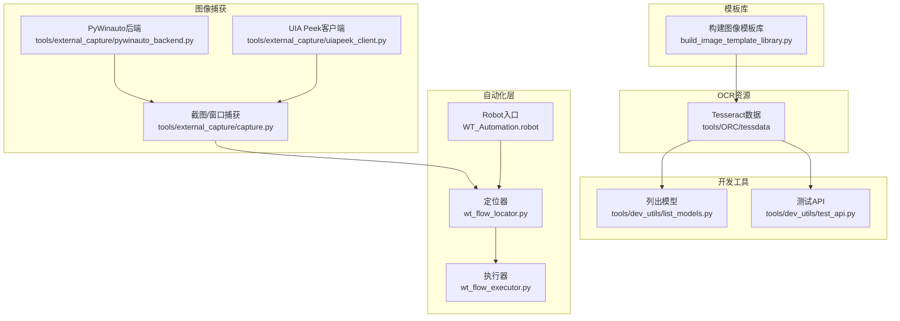
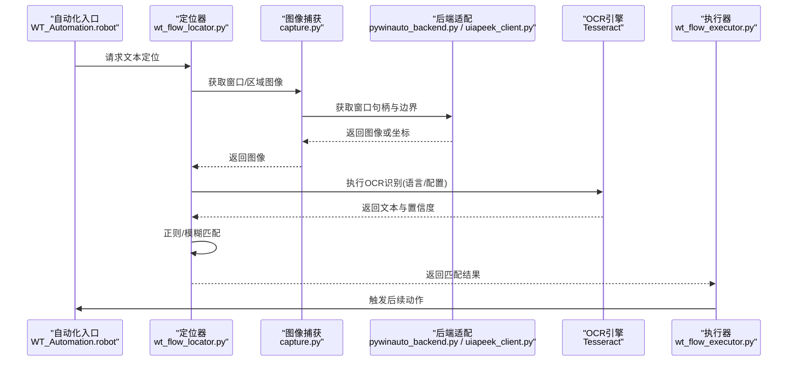
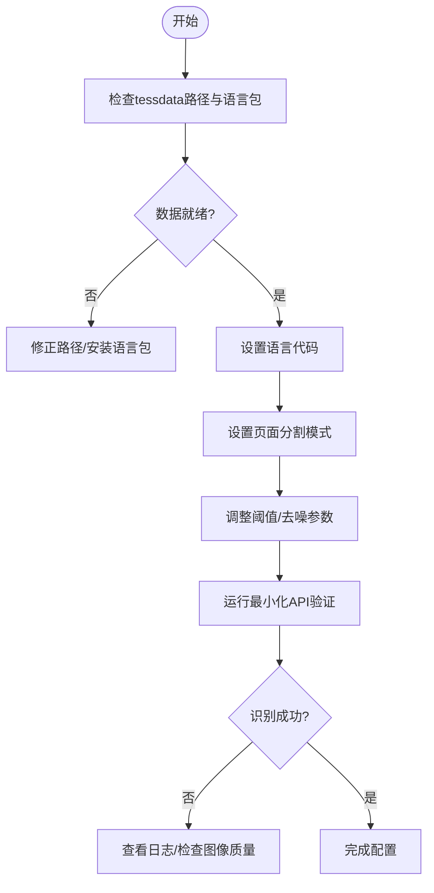
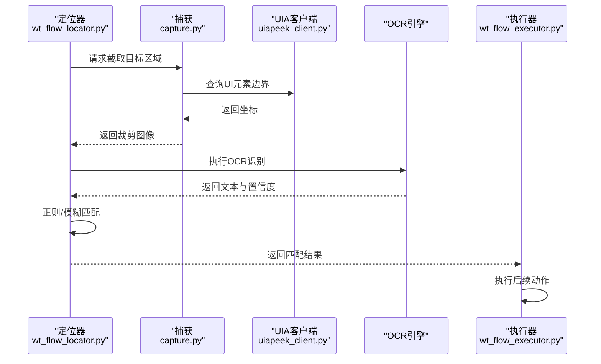
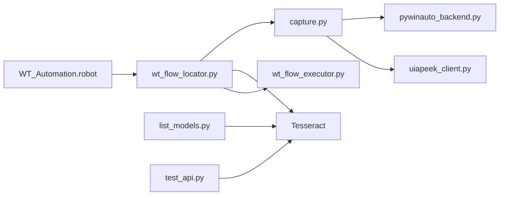

# OCR文本识别

<cite>
**本文引用的文件**   
- [tools/ORC/tessdata/README.md](file://tools/ORC/tessdata/README.md)
- [tools/dev_utils/list_models.py](file://tools/dev_utils/list_models.py)
- [tools/dev_utils/test_api.py](file://tools/dev_utils/test_api.py)
- [tools/external_capture/capture.py](file://tools/external_capture/capture.py)
- [tools/external_capture/pywinauto_backend.py](file://tools/external_capture/pywinauto_backend.py)
- [tools/external_capture/uiapeek_client.py](file://tools/external_capture/uiapeek_client.py)
- [WT_Automation.robot](file://WT_Automation.robot)
- [wt_flow_locator.py](file://wt_flow_locator.py)
- [wt_flow_executor.py](file://wt_flow_executor.py)
- [build_image_template_library.py](file://build_image模板库.py)
</cite>

## 目录
1. [简介](#简介)
2. [项目结构](#项目结构)
3. [核心组件](#核心组件)
4. [架构总览](#架构总览)
5. [详细组件分析](#详细组件分析)
6. [依赖关系分析](#依赖关系分析)
7. [性能考虑](#性能考虑)
8. [故障排除指南](#故障排除指南)
9. [结论](#结论)
10. [附录](#附录)

## 简介
本章节聚焦于WT自动化框架中的OCR文本识别能力，围绕Tesseract OCR引擎的配置与集成、多语言支持与字符集配置、识别精度调优策略展开。同时说明如何在控件定位流程中结合OCR进行文本提取、正则匹配与模糊匹配，并给出图像预处理、区域裁剪与缓存等性能优化建议。最后提供复杂场景（动态内容、小字体、多语言混合）的实战思路与常见问题排查方法。

## 项目结构
仓库中与OCR相关的资源与工具主要分布在以下位置：
- Tesseract数据与文档：tools/ORC/tessdata 及其子目录
- 模型与API辅助脚本：tools/dev_utils 下的 list_models.py、test_api.py
- 屏幕截图与窗口捕获：tools/external_capture 下的 capture.py、pywinauto_backend.py、uiapeek_client.py
- 自动化入口与执行器：WT_Automation.robot、wt_flow_locator.py、wt_flow_executor.py
- 图像模板库构建：build_image_template_library.py

图表来源
- [tools/ORC/tessdata/README.md](file://tools/ORC/tessdata/README.md)
- [tools/dev_utils/list_models.py](file://tools/dev_utils/list_models.py)
- [tools/dev_utils/test_api.py](file://tools/dev_utils/test_api.py)
- [tools/external_capture/capture.py](file://tools/external_capture/capture.py)
- [tools/external_capture/pywinauto_backend.py](file://tools/external_capture/pywinauto_backend.py)
- [tools/external_capture/uiapeek_client.py](file://tools/external_capture/uiapeek_client.py)
- [WT_Automation.robot](file://WT_Automation.robot)
- [wt_flow_locator.py](file://wt_flow_locator.py)
- [wt_flow_executor.py](file://wt_flow_executor.py)
- [build_image_template_library.py](file://build_image_template_library.py)

章节来源
- [tools/ORC/tessdata/README.md](file://tools/ORC/tessdata/README.md)
- [tools/dev_utils/list_models.py](file://tools/dev_utils/list_models.py)
- [tools/dev_utils/test_api.py](file://tools/dev_utils/test_api.py)
- [tools/external_capture/capture.py](file://tools/external_capture/capture.py)
- [tools/external_capture/pywinauto_backend.py](file://tools/external_capture/pywinauto_backend.py)
- [tools/external_capture/uiapeek_client.py](file://tools/external_capture/uiapeek_client.py)
- [WT_Automation.robot](file://WT_Automation.robot)
- [wt_flow_locator.py](file://wt_flow_locator.py)
- [wt_flow_executor.py](file://wt_flow_executor.py)
- [build_image_template_library.py](file://build_image_template_library.py)

## 核心组件
- Tesseract数据与配置
  - tessdata目录包含语言包、训练与配置文件，用于多语言识别与参数调优。
  - README文档提供基础使用说明与路径约定。
- 模型与API工具
  - list_models.py：枚举可用模型与语言，便于验证环境就绪状态。
  - test_api.py：调用OCR API进行最小化验证，确认引擎可正常返回结果。
- 图像捕获与后端
  - capture.py：封装截图与窗口捕获逻辑，为OCR提供输入图像。
  - pywinauto_backend.py：基于PyWinauto的后端适配，获取窗口句柄与区域。
  - uiapeek_client.py：通过UIA Peek客户端获取UI元素边界，辅助精准裁剪。
- 自动化与定位
  - WT_Automation.robot：顶层自动化入口，编排步骤与关键字。
  - wt_flow_locator.py：负责控件定位与文本提取，支持正则与模糊匹配策略。
  - wt_flow_executor.py：执行流程，协调定位、OCR与动作执行。
- 图像模板库
  - build_image_template_library.py：构建与索引图像模板，辅助模板匹配与OCR区域选择。

章节来源
- [tools/ORC/tessdata/README.md](file://tools/ORC/tessdata/README.md)
- [tools/dev_utils/list_models.py](file://tools/dev_utils/list_models.py)
- [tools/dev_utils/test_api.py](file://tools/dev_utils/test_api.py)
- [tools/external_capture/capture.py](file://tools/external_capture/capture.py)
- [tools/external_capture/pywinauto_backend.py](file://tools/external_capture/pywinauto_backend.py)
- [tools/external_capture/uiapeek_client.py](file://tools/external_capture/uiapeek_client.py)
- [WT_Automation.robot](file://WT_Automation.robot)
- [wt_flow_locator.py](file://wt_flow_locator.py)
- [wt_flow_executor.py](file://wt_flow_executor.py)
- [build_image_template_library.py](file://build_image_template_library.py)

## 架构总览
OCR在WT自动化框架中的整体流程如下：
- 使用外部捕获模块获取目标窗口或区域的图像。
- 将图像传入OCR引擎（Tesseract），根据语言与配置进行文本识别。
- 对识别结果进行后处理（清洗、正则匹配、模糊匹配）。
- 将匹配到的文本与控件定位关联，驱动后续自动化动作。

图表来源
- [WT_Automation.robot](file://WT_Automation.robot)
- [wt_flow_locator.py](file://wt_flow_locator.py)
- [tools/external_capture/capture.py](file://tools/external_capture/capture.py)
- [tools/external_capture/pywinauto_backend.py](file://tools/external_capture/pywinauto_backend.py)
- [tools/external_capture/uiapeek_client.py](file://tools/external_capture/uiapeek_client.py)
- [wt_flow_executor.py](file://wt_flow_executor.py)

## 详细组件分析

### Tesseract OCR引擎配置与集成
- 数据与语言包
  - tessdata目录存放语言包与配置文件，确保多语言识别可用。
  - README提供基本用法与路径约定，指导如何放置与引用语言包。
- 模型与API验证
  - list_models.py用于列举已安装的语言与模型，帮助快速检查环境。
  - test_api.py用于最小化调用OCR API，验证识别是否成功返回。
- 配置要点
  - 指定tessdata路径与语言代码，确保引擎能找到对应语言包。
  - 设置识别模式与PSM（页面分割模式），以适配不同布局的界面。
  - 调整阈值与去噪参数，提升小字体与低对比度文本的识别率。

章节来源
- [tools/ORC/tessdata/README.md](file://tools/ORC/tessdata/README.md)
- [tools/dev_utils/list_models.py](file://tools/dev_utils/list_models.py)
- [tools/dev_utils/test_api.py](file://tools/dev_utils/test_api.py)

#### 配置流程图

图表来源
- [tools/ORC/tessdata/README.md](file://tools/ORC/tessdata/README.md)
- [tools/dev_utils/test_api.py](file://tools/dev_utils/test_api.py)

### 控件定位中的OCR应用
- 文本提取
  - 通过capture.py获取目标区域图像，交由OCR引擎识别得到原始文本。
  - 结合uiapeek_client.py提供的UI元素边界，实现更精准的裁剪。
- 正则表达式匹配
  - 在wt_flow_locator.py中对OCR结果进行正则匹配，提取关键信息（如版本号、数值、标签）。
- 模糊匹配策略
  - 当界面存在轻微变化或噪声时，采用相似度比较与容错规则进行模糊匹配，提高鲁棒性。
- 与执行器协作
  - 定位成功后，wt_flow_executor.py根据匹配结果触发点击、输入等动作。

章节来源
- [tools/external_capture/capture.py](file://tools/external_capture/capture.py)
- [tools/external_capture/uiapeek_client.py](file://tools/external_capture/uiapeek_client.py)
- [wt_flow_locator.py](file://wt_flow_locator.py)
- [wt_flow_executor.py](file://wt_flow_executor.py)

#### 定位序列图

图表来源
- [wt_flow_locator.py](file://wt_flow_locator.py)
- [tools/external_capture/capture.py](file://tools/external_capture/capture.py)
- [tools/external_capture/uiapeek_client.py](file://tools/external_capture/uiapeek_client.py)
- [wt_flow_executor.py](file://wt_flow_executor.py)

### 多语言支持与字符集配置
- 多语言
  - 在tessdata中准备所需语言包，并在调用前设置语言代码。
  - 对于混合语言界面，可在同一流程中切换语言或合并识别结果。
- 字符集与白名单
  - 通过配置限制识别字符集（如仅数字、字母），减少误识。
  - 针对特殊符号或业务字段，使用正则进一步过滤。
- 页面分割模式（PSM）
  - 根据界面布局选择合适的PSM，例如单行文本、整页文本或稀疏文本。

章节来源
- [tools/ORC/tessdata/README.md](file://tools/ORC/tessdata/README.md)
- [tools/dev_utils/list_models.py](file://tools/dev_utils/list_models.py)

### 识别精度调优
- 图像预处理
  - 灰度化、二值化、去噪、对比度增强，提升小字体与低对比度文本的可读性。
- 区域裁剪
  - 利用UIA边界或模板匹配缩小识别区域，降低背景干扰。
- 参数调优
  - 调整阈值、去噪强度、PSM与语言组合，平衡速度与准确率。
- 结果后处理
  - 清洗空白与噪声字符，使用正则与模糊匹配提高稳定性。

章节来源
- [tools/external_capture/capture.py](file://tools/external_capture/capture.py)
- [tools/external_capture/uiapeek_client.py](file://tools/external_capture/uiapeek_client.py)
- [wt_flow_locator.py](file://wt_flow_locator.py)

### 实际使用示例（复杂场景）
- 动态内容
  - 对频繁变化的文本（如时间戳、计数），采用正则提取固定格式字段，忽略可变部分。
- 小字体文本
  - 放大目标区域、增强对比度、降低阈值，必要时分块识别再拼接。
- 多语言混合界面
  - 按区域分别设置语言，或在识别后进行语言检测与二次校正。

章节来源
- [wt_flow_locator.py](file://wt_flow_locator.py)
- [tools/external_capture/capture.py](file://tools/external_capture/capture.py)

## 依赖关系分析
OCR相关模块之间的依赖关系如下：
- 自动化入口依赖定位器与执行器。
- 定位器依赖图像捕获与OCR引擎。
- 图像捕获依赖后端适配（PyWinauto/UIA Peek）。
- 模型与API工具独立用于环境与功能验证。

图表来源
- [WT_Automation.robot](file://WT_Automation.robot)
- [wt_flow_locator.py](file://wt_flow_locator.py)
- [tools/external_capture/capture.py](file://tools/external_capture/capture.py)
- [tools/external_capture/pywinauto_backend.py](file://tools/external_capture/pywinauto_backend.py)
- [tools/external_capture/uiapeek_client.py](file://tools/external_capture/uiapeek_client.py)
- [wt_flow_executor.py](file://wt_flow_executor.py)
- [tools/dev_utils/list_models.py](file://tools/dev_utils/list_models.py)
- [tools/dev_utils/test_api.py](file://tools/dev_utils/test_api.py)

章节来源
- [WT_Automation.robot](file://WT_Automation.robot)
- [wt_flow_locator.py](file://wt_flow_locator.py)
- [tools/external_capture/capture.py](file://tools/external_capture/capture.py)
- [tools/external_capture/pywinauto_backend.py](file://tools/external_capture/pywinauto_backend.py)
- [tools/external_capture/uiapeek_client.py](file://tools/external_capture/uiapeek_client.py)
- [wt_flow_executor.py](file://wt_flow_executor.py)
- [tools/dev_utils/list_models.py](file://tools/dev_utils/list_models.py)
- [tools/dev_utils/test_api.py](file://tools/dev_utils/test_api.py)

## 性能考虑
- 图像预处理
  - 优先进行必要的预处理（灰度、二值化、去噪），避免过度处理导致信息丢失。
- 区域裁剪
  - 使用UIA边界或模板匹配精确裁剪，减少无关区域带来的计算开销。
- 缓存机制
  - 对稳定不变的文本区域建立缓存，避免重复识别；对动态区域设置失效策略。
- 并行与批处理
  - 对多个区域并行识别，注意线程安全与资源占用。
- 模型与语言选择
  - 仅加载必要语言，减少内存与启动时间；按需切换语言。

[本节为通用性能建议，不直接分析具体文件]

## 故障排除指南
- 无法找到tessdata或语言包
  - 检查路径是否正确，确认README中的约定与list_models的输出。
- 识别结果为空或乱码
  - 检查图像质量与预处理参数，尝试调整PSM与阈值。
- 多语言混合识别错误
  - 按区域分别设置语言，或使用正则与后处理进行校正。
- 定位失败
  - 使用uiapeek_client获取准确边界，缩小识别区域；增加模糊匹配容错。
- 性能问题
  - 启用缓存、减少不必要的识别次数；优化预处理与裁剪策略。

章节来源
- [tools/ORC/tessdata/README.md](file://tools/ORC/tessdata/README.md)
- [tools/dev_utils/list_models.py](file://tools/dev_utils/list_models.py)
- [tools/dev_utils/test_api.py](file://tools/dev_utils/test_api.py)
- [tools/external_capture/capture.py](file://tools/external_capture/capture.py)
- [tools/external_capture/uiapeek_client.py](file://tools/external_capture/uiapeek_client.py)
- [wt_flow_locator.py](file://wt_flow_locator.py)

## 结论
WT自动化框架通过整合Tesseract OCR与外部图像捕获模块，实现了在控件定位中的文本识别能力。借助多语言支持、字符集配置与识别精度调优，能够应对动态内容、小字体与多语言混合等复杂场景。配合正则与模糊匹配策略，以及图像预处理、区域裁剪与缓存机制，可在保证准确率的同时提升性能。建议在部署前使用模型与API工具进行环境验证，并在日常维护中持续优化参数与策略。

## 附录
- 术语
  - PSM：页面分割模式，控制OCR对页面结构的理解方式。
  - UIA：Windows用户界面自动化接口，用于获取控件边界与属性。
- 参考
  - tools/ORC/tessdata/README.md：Tesseract数据与基础用法说明
  - tools/dev_utils/list_models.py：模型与语言枚举
  - tools/dev_utils/test_api.py：OCR API最小化验证
  - tools/external_capture/*：图像捕获与后端适配
  - wt_flow_locator.py：定位与文本匹配逻辑
  - wt_flow_executor.py：流程执行与动作触发