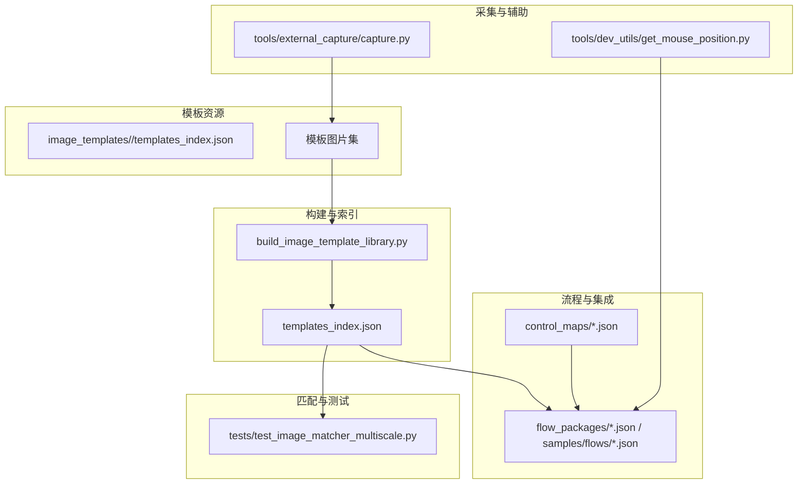
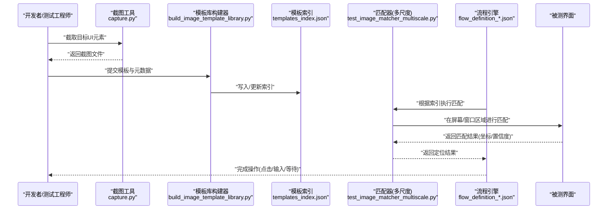
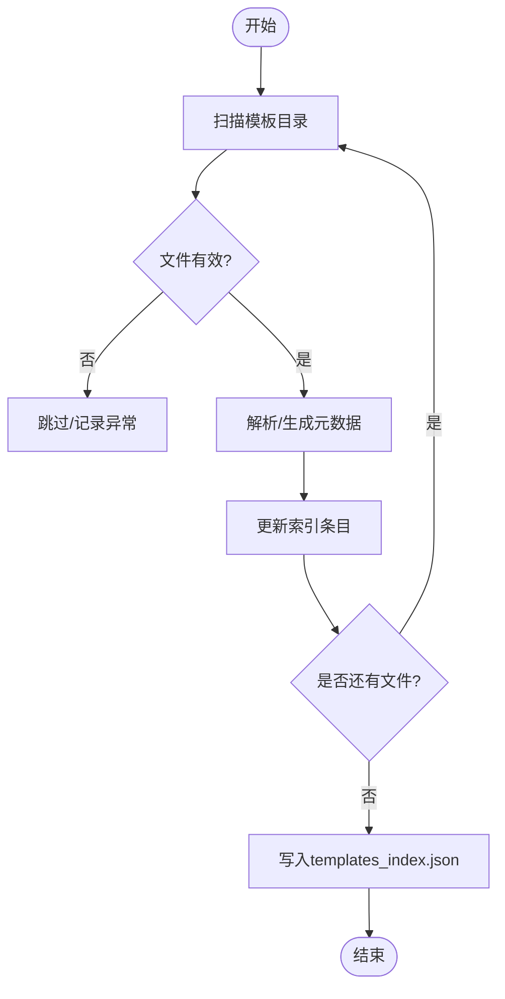
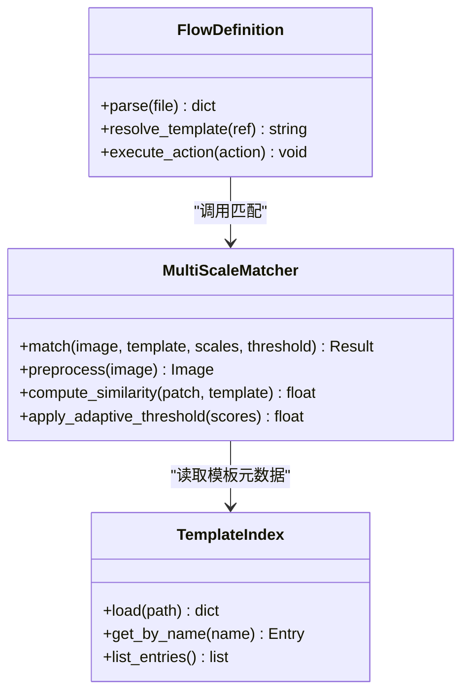
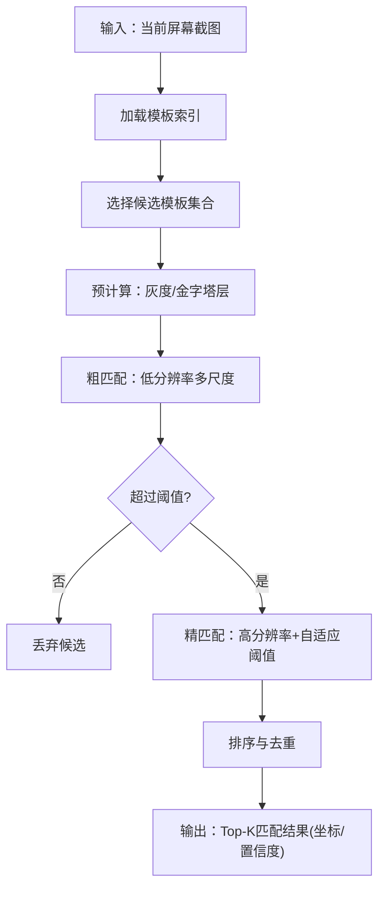
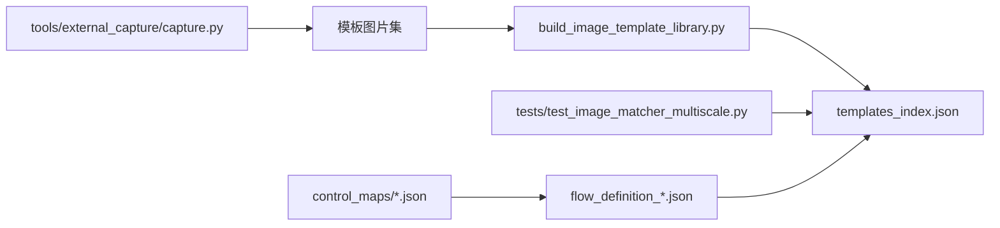

# 图像模板匹配

<cite>
**本文引用的文件**   
- [build_image_template_library.py](file://build_image_template_library.py)
- [test_image_matcher_multiscale.py](file://tests/test_image_matcher_multiscale.py)
- [image_templates/templates_index.json](file://image_templates/templates_index.json)
- [image_templates/Icons/templates_index.json](file://image_templates/Icons/templates_index.json)
- [image_templates/WT_software_Images/templates_index.json](file://image_templates/WT_software_Images/templates_index.json)
- [control_maps/library_window_WPF_controls.json](file://control_maps/library_window_WPF_controls.json)
- [control_maps/library_主面板_WPF_controls.json](file://control_maps/library_主面板_WPF_controls.json)
- [flow_packages/flow_definition_geo_import_data_file.json](file://flow_packages/flow_definition_geo_import_data_file.json)
- [samples/flows/flow_definition_新建风机类型.json](file://samples/flows/flow_definition_新建风机类型.json)
- [tools/external_capture/capture.py](file://tools/external_capture/capture.py)
- [tools/dev_utils/get_mouse_position.py](file://tools/dev_utils/get_mouse_position.py)
</cite>

## 目录
1. [简介](#简介)
2. [项目结构](#项目结构)
3. [核心组件](#核心组件)
4. [架构总览](#架构总览)
5. [详细组件分析](#详细组件分析)
6. [依赖关系分析](#依赖关系分析)
7. [性能与内存优化](#性能与内存优化)
8. [故障排查指南](#故障排查指南)
9. [结论](#结论)
10. [附录：使用示例与最佳实践](#附录使用示例与最佳实践)

## 简介
本章节聚焦于WT自动化框架中的图像模板匹配技术，围绕以下目标展开：
- 算法原理：OpenCV模板匹配、多尺度匹配、自适应阈值处理。
- 模板库构建与管理：模板生成工具、分类组织、版本管理。
- 定位策略：相对位置计算、容错处理、批量匹配优化。
- 模板创建与优化：图像处理、特征增强、背景去除。
- 实际场景：UI元素变化、分辨率适配、动态内容识别。
- 性能调优与内存管理策略。

## 项目结构
WT自动化框架中与图像模板匹配相关的资源与代码主要分布在如下区域：
- image_templates：存放模板图片及其索引（templates_index.json），按功能域或窗口进行子目录划分。
- build_image_template_library.py：用于构建和管理图像模板库的脚本。
- tests/test_image_matcher_multiscale.py：多尺度模板匹配的测试用例，体现匹配流程与参数配置。
- control_maps/*.json：控件映射库，包含窗口级控件信息，可与图像模板结合实现混合定位。
- flow_packages/*.json 与 samples/flows/*.json：流程定义中引用图像模板进行定位与交互。
- tools/external_capture/capture.py：外部截图能力，为模板采集提供基础。
- tools/dev_utils/get_mouse_position.py：辅助工具，便于在录制或调试时获取坐标。

图表来源
- [build_image_template_library.py](file://build_image_template_library.py)
- [image_templates/templates_index.json](file://image_templates/templates_index.json)
- [tests/test_image_matcher_multiscale.py](file://tests/test_image_matcher_multiscale.py)
- [control_maps/library_window_WPF_controls.json](file://control_maps/library_window_WPF_controls.json)
- [flow_packages/flow_definition_geo_import_data_file.json](file://flow_packages/flow_definition_geo_import_data_file.json)
- [tools/external_capture/capture.py](file://tools/external_capture/capture.py)
- [tools/dev_utils/get_mouse_position.py](file://tools/dev_utils/get_mouse_position.py)

章节来源
- [build_image_template_library.py](file://build_image_template_library.py)
- [image_templates/templates_index.json](file://image_templates/templates_index.json)
- [image_templates/Icons/templates_index.json](file://image_templates/Icons/templates_index.json)
- [image_templates/WT_software_Images/templates_index.json](file://image_templates/WT_software_Images/templates_index.json)
- [tests/test_image_matcher_multiscale.py](file://tests/test_image_matcher_multiscale.py)
- [control_maps/library_window_WPF_controls.json](file://control_maps/library_window_WPF_controls.json)
- [control_maps/library_主面板_WPF_controls.json](file://control_maps/library_主面板_WPF_controls.json)
- [flow_packages/flow_definition_geo_import_data_file.json](file://flow_packages/flow_definition_geo_import_data_file.json)
- [samples/flows/flow_definition_新建风机类型.json](file://samples/flows/flow_definition_新建风机类型.json)
- [tools/external_capture/capture.py](file://tools/external_capture/capture.py)
- [tools/dev_utils/get_mouse_position.py](file://tools/dev_utils/get_mouse_position.py)

## 核心组件
- 模板库构建器：负责将原始模板图片整理、校验并生成统一的索引文件，支持按域/窗口分类存储。
- 模板索引：以JSON形式描述模板元数据（名称、路径、尺寸、版本、标签等），供匹配器与流程引擎消费。
- 多尺度匹配测试：验证在不同缩放比例下的匹配稳定性，体现容错与鲁棒性设计。
- 控件映射库：将UI控件树信息与图像模板关联，形成“控件+图像”的混合定位方案。
- 流程集成：在流程定义中以声明式方式引用模板，驱动点击、输入、等待等操作。
- 截图与辅助工具：提供屏幕截图与坐标查询能力，支撑模板采集与调试。

章节来源
- [build_image_template_library.py](file://build_image_template_library.py)
- [image_templates/templates_index.json](file://image_templates/templates_index.json)
- [tests/test_image_matcher_multiscale.py](file://tests/test_image_matcher_multiscale.py)
- [control_maps/library_window_WPF_controls.json](file://control_maps/library_window_WPF_controls.json)
- [flow_packages/flow_definition_geo_import_data_file.json](file://flow_packages/flow_definition_geo_import_data_file.json)
- [tools/external_capture/capture.py](file://tools/external_capture/capture.py)
- [tools/dev_utils/get_mouse_position.py](file://tools/dev_utils/get_mouse_position.py)

## 架构总览
下图展示了从模板采集到匹配定位的整体流程，以及各模块之间的交互关系。

图表来源
- [tools/external_capture/capture.py](file://tools/external_capture/capture.py)
- [build_image_template_library.py](file://build_image_template_library.py)
- [image_templates/templates_index.json](file://image_templates/templates_index.json)
- [tests/test_image_matcher_multiscale.py](file://tests/test_image_matcher_multiscale.py)
- [flow_packages/flow_definition_geo_import_data_file.json](file://flow_packages/flow_definition_geo_import_data_file.json)

## 详细组件分析

### 模板库构建与管理
- 职责
  - 收集模板图片与元数据，统一命名规范与目录结构。
  - 生成并维护templates_index.json，确保索引与模板文件一致。
  - 支持按域（如Icons、WT_software_Images）或窗口维度组织模板。
- 关键流程
  - 扫描模板目录，校验文件完整性与格式。
  - 解析或生成索引条目（名称、路径、尺寸、版本、标签）。
  - 输出索引文件，供后续匹配与流程使用。
- 版本管理建议
  - 在索引中增加版本号字段，配合Git进行变更追踪。
  - 对重要模板保留历史快照，便于回滚与对比。

图表来源
- [build_image_template_library.py](file://build_image_template_library.py)
- [image_templates/templates_index.json](file://image_templates/templates_index.json)

章节来源
- [build_image_template_library.py](file://build_image_template_library.py)
- [image_templates/templates_index.json](file://image_templates/templates_index.json)
- [image_templates/Icons/templates_index.json](file://image_templates/Icons/templates_index.json)
- [image_templates/WT_software_Images/templates_index.json](file://image_templates/WT_software_Images/templates_index.json)

### 多尺度模板匹配与自适应阈值
- 算法要点
  - OpenCV模板匹配：通过滑动窗口计算相似度，常用方法包括平方差匹配、相关系数匹配等。
  - 多尺度匹配：对模板进行多尺度缩放，逐层匹配以提升对不同分辨率与缩放的鲁棒性。
  - 自适应阈值：依据局部图像统计特性动态调整阈值，降低光照与渲染差异带来的误匹配。
- 测试验证
  - 通过多尺度匹配测试用例验证不同缩放比例下的匹配成功率与耗时。
  - 可调节相似度阈值、金字塔层级、搜索区域等参数以获得最佳效果。

图表来源
- [tests/test_image_matcher_multiscale.py](file://tests/test_image_matcher_multiscale.py)
- [image_templates/templates_index.json](file://image_templates/templates_index.json)
- [flow_packages/flow_definition_geo_import_data_file.json](file://flow_packages/flow_definition_geo_import_data_file.json)

章节来源
- [tests/test_image_matcher_multiscale.py](file://tests/test_image_matcher_multiscale.py)
- [image_templates/templates_index.json](file://image_templates/templates_index.json)
- [flow_packages/flow_definition_geo_import_data_file.json](file://flow_packages/flow_definition_geo_import_data_file.json)

### 定位策略：相对位置、容错与批量优化
- 相对位置计算
  - 基于窗口或父控件边界，计算目标元素的相对偏移，减少全局搜索范围。
  - 结合控件映射库（control_maps）提供的控件树信息，缩小匹配区域。
- 容错处理
  - 多尺度匹配容忍缩放差异；自适应阈值容忍亮度与对比度变化。
  - 引入二次确认机制（如邻近区域再匹配）降低误报。
- 批量匹配优化
  - 并行化多尺度匹配任务，合理分配线程/进程。
  - 缓存中间结果（如预处理后的灰度图、金字塔层），避免重复计算。
  - 分阶段筛选：先粗后精，先用低分辨率快速定位，再用高分辨率精修。

图表来源
- [tests/test_image_matcher_multiscale.py](file://tests/test_image_matcher_multiscale.py)
- [image_templates/templates_index.json](file://image_templates/templates_index.json)
- [control_maps/library_window_WPF_controls.json](file://control_maps/library_window_WPF_controls.json)

章节来源
- [tests/test_image_matcher_multiscale.py](file://tests/test_image_matcher_multiscale.py)
- [control_maps/library_window_WPF_controls.json](file://control_maps/library_window_WPF_controls.json)
- [control_maps/library_主面板_WPF_controls.json](file://control_maps/library_主面板_WPF_controls.json)

### 模板创建与优化技巧
- 图像处理
  - 裁剪与对齐：仅保留关键特征区域，去除无关背景。
  - 归一化与去噪：提升一致性，降低噪声干扰。
- 特征增强
  - 边缘增强、对比度拉伸，突出稳定特征点。
- 背景去除
  - 掩膜或颜色阈值分割，剔除动态背景（如滚动条、动画）。
- 版本与命名
  - 采用语义化命名（如“按钮_保存_正常.png”），并在索引中标注版本与适用窗口。

章节来源
- [image_templates/templates_index.json](file://image_templates/templates_index.json)
- [image_templates/Icons/templates_index.json](file://image_templates/Icons/templates_index.json)
- [image_templates/WT_software_Images/templates_index.json](file://image_templates/WT_software_Images/templates_index.json)

### 实际使用示例
- UI元素变化
  - 使用多尺度匹配与自适应阈值应对主题切换、图标微调。
  - 结合控件映射库，优先在已知窗口内定位，提高稳定性。
- 分辨率适配
  - 通过多尺度金字塔覆盖常见DPI与缩放级别。
  - 在流程中根据目标环境自动选择合适模板集合。
- 动态内容识别
  - 对含时间戳或数字变化的区域，采用局部特征匹配或OCR辅助。
  - 在流程中设置重试与超时策略，提升鲁棒性。

章节来源
- [flow_packages/flow_definition_geo_import_data_file.json](file://flow_packages/flow_definition_geo_import_data_file.json)
- [samples/flows/flow_definition_新建风机类型.json](file://samples/flows/flow_definition_新建风机类型.json)
- [control_maps/library_主面板_WPF_controls.json](file://control_maps/library_主面板_WPF_controls.json)

## 依赖关系分析
- 内部依赖
  - 模板库构建器依赖模板目录与索引文件。
  - 匹配器依赖模板索引与测试用例中的参数配置。
  - 流程定义依赖模板索引与控件映射库。
- 外部依赖
  - OpenCV用于模板匹配与图像处理。
  - JSON用于索引与流程定义的序列化。
  - 截图工具用于采集模板与运行时截图。

图表来源
- [build_image_template_library.py](file://build_image_template_library.py)
- [image_templates/templates_index.json](file://image_templates/templates_index.json)
- [tests/test_image_matcher_multiscale.py](file://tests/test_image_matcher_multiscale.py)
- [flow_packages/flow_definition_geo_import_data_file.json](file://flow_packages/flow_definition_geo_import_data_file.json)
- [control_maps/library_window_WPF_controls.json](file://control_maps/library_window_WPF_controls.json)
- [tools/external_capture/capture.py](file://tools/external_capture/capture.py)

章节来源
- [build_image_template_library.py](file://build_image_template_library.py)
- [image_templates/templates_index.json](file://image_templates/templates_index.json)
- [tests/test_image_matcher_multiscale.py](file://tests/test_image_matcher_multiscale.py)
- [flow_packages/flow_definition_geo_import_data_file.json](file://flow_packages/flow_definition_geo_import_data_file.json)
- [control_maps/library_window_WPF_controls.json](file://control_maps/library_window_WPF_controls.json)
- [tools/external_capture/capture.py](file://tools/external_capture/capture.py)

## 性能与内存优化
- 匹配性能
  - 多尺度金字塔层级不宜过多，平衡精度与速度。
  - 使用ROI（感兴趣区域）限制搜索范围，减少无效计算。
  - 并行化多模板匹配，注意线程安全与资源隔离。
- 内存管理
  - 及时释放中间图像对象，避免大数组常驻内存。
  - 复用预处理结果（如灰度图、金字塔层），减少重复开销。
  - 控制并发数量，防止内存峰值过高导致系统抖动。
- 监控与调优
  - 记录匹配耗时与命中率，建立回归基线。
  - 针对热点模板进行专项优化（如更小的模板尺寸、更强的特征）。

[本节为通用指导，不直接分析具体文件]

## 故障排查指南
- 常见问题
  - 匹配失败：检查模板尺寸与分辨率是否匹配，确认阈值与多尺度设置。
  - 误匹配：增加二次确认逻辑，缩小搜索区域，改进模板特征。
  - 性能问题：启用ROI、减少金字塔层级、合并相似模板。
- 调试工具
  - 使用截图工具捕获当前画面，比对模板与目标差异。
  - 借助鼠标位置工具验证坐标是否正确。
  - 查看模板索引，确认路径与版本无误。

章节来源
- [tools/external_capture/capture.py](file://tools/external_capture/capture.py)
- [tools/dev_utils/get_mouse_position.py](file://tools/dev_utils/get_mouse_position.py)
- [image_templates/templates_index.json](file://image_templates/templates_index.json)

## 结论
WT自动化框架通过“模板库构建+多尺度匹配+自适应阈值+控件映射”的组合策略，实现了高鲁棒性的图像定位能力。合理的模板组织、版本管理与性能调优，进一步提升了系统的可维护性与运行效率。在实际工程中，应结合具体UI特点持续优化模板质量与匹配参数，确保在不同环境与动态场景下保持稳定表现。

[本节为总结性内容，不直接分析具体文件]

## 附录：使用示例与最佳实践
- 示例一：处理UI元素变化
  - 在多主题环境下，准备多套模板并按主题分类，流程中根据主题选择对应模板集合。
  - 使用多尺度匹配与自适应阈值，提升跨主题匹配成功率。
- 示例二：分辨率适配
  - 针对不同DPI与缩放级别，预先构建多尺度金字塔，流程中自动选择合适层级。
  - 结合控件映射库，限定匹配区域，降低误匹配概率。
- 示例三：动态内容识别
  - 对于含数字或时间的区域，采用局部特征匹配或OCR辅助，并结合重试与超时策略。
  - 在流程中增加状态校验步骤，确保操作前后状态一致。

章节来源
- [flow_packages/flow_definition_geo_import_data_file.json](file://flow_packages/flow_definition_geo_import_data_file.json)
- [samples/flows/flow_definition_新建风机类型.json](file://samples/flows/flow_definition_新建风机类型.json)
- [control_maps/library_主面板_WPF_controls.json](file://control_maps/library_主面板_WPF_controls.json)
- [tests/test_image_matcher_multiscale.py](file://tests/test_image_matcher_multiscale.py)