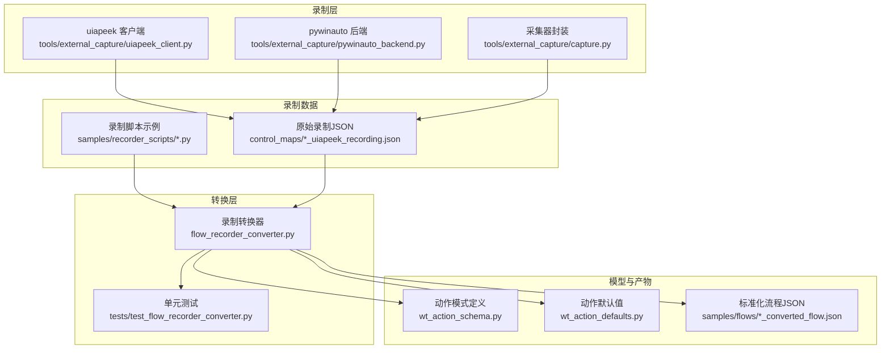
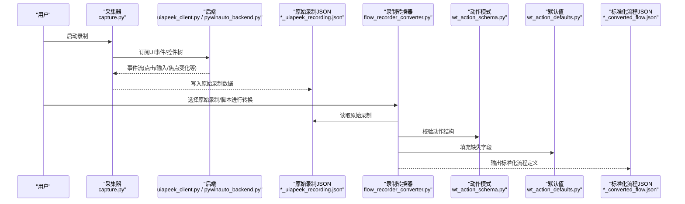
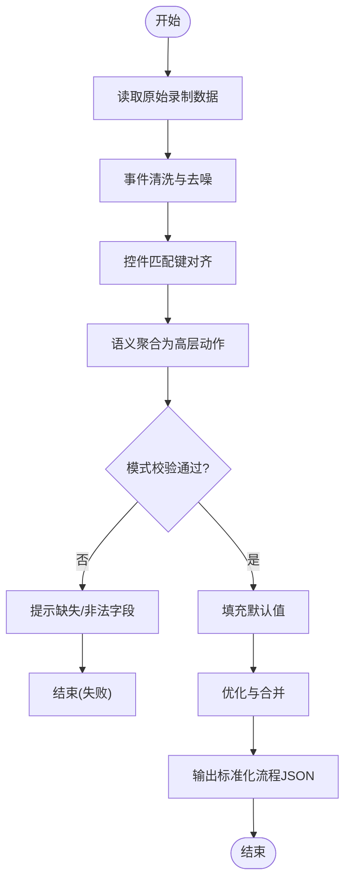
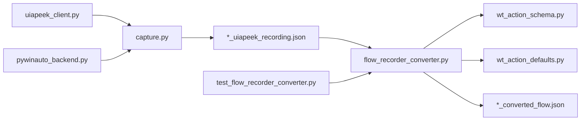

# 录制转换器

<cite>
**本文引用的文件**   
- [flow_recorder_converter.py](file://flow_recorder_converter.py)
- [test_flow_recorder_converter.py](file://tests/test_flow_recorder_converter.py)
- [wt_action_schema.py](file://wt_action_schema.py)
- [wt_action_defaults.py](file://wt_action_defaults.py)
- [samples/recorder_scripts/气象数据录入_20260625.py](file://samples/recorder_scripts/气象数据录入_20260625.py)
- [samples/flows/气象数据录入_20260625_converted_flow.json](file://samples/flows/气象数据录入_20260625_converted_flow.json)
- [control_maps/20260720_153042_uiapeek_recording.json](file://control_maps/20260720_153042_uiapeek_recording.json)
- [tools/external_capture/uiapeek_client.py](file://tools/external_capture/uiapeek_client.py)
- [tools/external_capture/pywinauto_backend.py](file://tools/external_capture/pywinauto_backend.py)
- [tools/external_capture/capture.py](file://tools/external_capture/capture.py)
</cite>

## 目录
1. [简介](#简介)
2. [项目结构](#项目结构)
3. [核心组件](#核心组件)
4. [架构总览](#架构总览)
5. [详细组件分析](#详细组件分析)
6. [依赖关系分析](#依赖关系分析)
7. [性能考虑](#性能考虑)
8. [故障排查指南](#故障排查指南)
9. [结论](#结论)
10. [附录](#附录)

## 简介
本文件系统性介绍WT自动化框架中的“录制转换器”能力，覆盖从操作录制到标准化流程定义的全链路：鼠标与键盘事件捕获、UI状态监控、动作序列记录、原始录制数据的转换、脚本生成与优化、配置选项与扩展点，以及调试分析与维护策略。目标是帮助使用者快速上手录制复杂业务流程，并稳定地将其转换为可执行、可维护的自动化脚本。

## 项目结构
围绕录制与转换的核心代码主要分布在以下位置：
- 录制数据源与外部采集桥接：tools/external_capture 下的客户端与后端实现
- 录制数据样例：control_maps 下的 uiapeek 录制 JSON
- 录制脚本样例：samples/recorder_scripts 下的 Python 脚本
- 转换逻辑与测试：根目录 flow_recorder_converter.py 与 tests/test_flow_recorder_converter.py
- 动作模型与默认值：wt_action_schema.py、wt_action_defaults.py
- 转换产物样例：samples/flows 下的已转换流程 JSON

图表来源
- [tools/external_capture/uiapeek_client.py](file://tools/external_capture/uiapeek_client.py)
- [tools/external_capture/pywinauto_backend.py](file://tools/external_capture/pywinauto_backend.py)
- [tools/external_capture/capture.py](file://tools/external_capture/capture.py)
- [control_maps/20260720_153042_uiapeek_recording.json](file://control_maps/20260720_153042_uiapeek_recording.json)
- [samples/recorder_scripts/气象数据录入_20260625.py](file://samples/recorder_scripts/气象数据录入_20260625.py)
- [flow_recorder_converter.py](file://flow_recorder_converter.py)
- [tests/test_flow_recorder_converter.py](file://tests/test_flow_recorder_converter.py)
- [wt_action_schema.py](file://wt_action_schema.py)
- [wt_action_defaults.py](file://wt_action_defaults.py)
- [samples/flows/气象数据录入_20260625_converted_flow.json](file://samples/flows/气象数据录入_20260625_converted_flow.json)

章节来源
- [flow_recorder_converter.py](file://flow_recorder_converter.py)
- [tests/test_flow_recorder_converter.py](file://tests/test_flow_recorder_converter.py)
- [wt_action_schema.py](file://wt_action_schema.py)
- [wt_action_defaults.py](file://wt_action_defaults.py)
- [samples/recorder_scripts/气象数据录入_20260625.py](file://samples/recorder_scripts/气象数据录入_20260625.py)
- [samples/flows/气象数据录入_20260625_converted_flow.json](file://samples/flows/气象数据录入_20260625_converted_flow.json)
- [control_maps/20260720_153042_uiapeek_recording.json](file://control_maps/20260720_153042_uiapeek_recording.json)
- [tools/external_capture/uiapeek_client.py](file://tools/external_capture/uiapeek_client.py)
- [tools/external_capture/pywinauto_backend.py](file://tools/external_capture/pywinauto_backend.py)
- [tools/external_capture/capture.py](file://tools/external_capture/capture.py)

## 核心组件
- 录制数据源
  - uiapeek 客户端：负责跨进程 UIA 事件抓取与窗口控件树快照，输出结构化事件流。
  - pywinauto 后端：作为备选或补充的事件与控件定位通道。
  - 采集器封装：统一入口，屏蔽底层差异，提供一致的录制接口。
- 录制数据
  - 原始录制 JSON：包含时间戳、事件类型、目标控件属性、坐标等字段，用于回放与转换。
  - 录制脚本示例：由工具生成的 Python 脚本，便于人工二次编辑与参数化。
- 转换引擎
  - 录制转换器：读取原始录制数据与可选脚本，依据动作模式与默认值，生成标准化的流程定义 JSON。
  - 单元测试：覆盖关键转换路径与边界条件，保障稳定性。
- 模型与产物
  - 动作模式定义：约束动作字段、类型、必填项与取值范围。
  - 动作默认值：为缺失字段提供合理缺省，提升鲁棒性。
  - 标准化流程 JSON：最终产物，供执行器消费。

章节来源
- [flow_recorder_converter.py](file://flow_recorder_converter.py)
- [tests/test_flow_recorder_converter.py](file://tests/test_flow_recorder_converter.py)
- [wt_action_schema.py](file://wt_action_schema.py)
- [wt_action_defaults.py](file://wt_action_defaults.py)
- [tools/external_capture/uiapeek_client.py](file://tools/external_capture/uiapeek_client.py)
- [tools/external_capture/pywinauto_backend.py](file://tools/external_capture/pywinauto_backend.py)
- [tools/external_capture/capture.py](file://tools/external_capture/capture.py)
- [control_maps/20260720_153042_uiapeek_recording.json](file://control_maps/20260720_153042_uiapeek_recording.json)
- [samples/recorder_scripts/气象数据录入_20260625.py](file://samples/recorder_scripts/气象数据录入_20260625.py)
- [samples/flows/气象数据录入_20260625_converted_flow.json](file://samples/flows/气象数据录入_20260625_converted_flow.json)

## 架构总览
录制到转换的整体时序如下：

图表来源
- [tools/external_capture/capture.py](file://tools/external_capture/capture.py)
- [tools/external_capture/uiapeek_client.py](file://tools/external_capture/uiapeek_client.py)
- [tools/external_capture/pywinauto_backend.py](file://tools/external_capture/pywinauto_backend.py)
- [control_maps/20260720_153042_uiapeek_recording.json](file://control_maps/20260720_153042_uiapeek_recording.json)
- [flow_recorder_converter.py](file://flow_recorder_converter.py)
- [wt_action_schema.py](file://wt_action_schema.py)
- [wt_action_defaults.py](file://wt_action_defaults.py)
- [samples/flows/气象数据录入_20260625_converted_flow.json](file://samples/flows/气象数据录入_20260625_converted_flow.json)

## 详细组件分析

### 录制数据源与事件捕获
- uiapeek 客户端
  - 职责：通过 UIA 接口获取控件树、事件（如点击、文本变更、焦点切换）与窗口层级信息。
  - 关键点：事件去抖、控件匹配策略（名称/类名/自动化ID）、相对坐标与绝对坐标并存。
- pywinauto 后端
  - 职责：在特定场景下作为补充通道，提供 Win32/WPF/UWP 控件访问能力。
  - 关键点：兼容不同后端时，需对事件语义进行归一化。
- 采集器封装
  - 职责：统一对外暴露 start/stop/save 接口，管理生命周期与异常恢复。
  - 关键点：断线重连、增量写入、录制元数据（会话ID、目标进程、时间基准）。

章节来源
- [tools/external_capture/uiapeek_client.py](file://tools/external_capture/uiapeek_client.py)
- [tools/external_capture/pywinauto_backend.py](file://tools/external_capture/pywinauto_backend.py)
- [tools/external_capture/capture.py](file://tools/external_capture/capture.py)
- [control_maps/20260720_153042_uiapeek_recording.json](file://control_maps/20260720_153042_uiapeek_recording.json)

### 原始录制数据结构
- 典型字段
  - 事件类型：click、double_click、key_press、text_input、focus_change、window_open/close 等
  - 目标控件：标题、类名、自动化ID、索引、可见性、可用性等
  - 坐标：屏幕坐标、相对区域、偏移量
  - 时间戳：毫秒级时间，用于排序与间隔计算
  - 上下文：窗口句柄、进程PID、UIA后端标识
- 用途
  - 回放：按时间顺序重放事件
  - 转换：聚合为高层动作（如“打开菜单”、“输入表单”）
  - 调试：定位失败步骤、分析漂移与误判

章节来源
- [control_maps/20260720_153042_uiapeek_recording.json](file://control_maps/20260720_153042_uiapeek_recording.json)

### 录制转换器核心流程
- 输入
  - 原始录制 JSON
  - 可选：录制脚本（Python），用于注入业务语义与参数化
- 处理
  - 解析与清洗：过滤噪声事件、合并相邻同类事件、对齐控件匹配键
  - 语义聚合：将低层事件聚合成高层动作（如“点击保存”、“填写日期”）
  - 模式校验：依据动作模式定义检查字段完整性与取值合法性
  - 默认值填充：使用默认值补齐缺失字段，保证下游执行器可运行
  - 优化：去重、合并、插入等待、错误回退策略
- 输出
  - 标准化流程 JSON：包含步骤列表、参数表、条件分支、循环控制等

图表来源
- [flow_recorder_converter.py](file://flow_recorder_converter.py)
- [wt_action_schema.py](file://wt_action_schema.py)
- [wt_action_defaults.py](file://wt_action_defaults.py)
- [control_maps/20260720_153042_uiapeek_recording.json](file://control_maps/20260720_153042_uiapeek_recording.json)
- [samples/flows/气象数据录入_20260625_converted_flow.json](file://samples/flows/气象数据录入_20260625_converted_flow.json)

章节来源
- [flow_recorder_converter.py](file://flow_recorder_converter.py)
- [tests/test_flow_recorder_converter.py](file://tests/test_flow_recorder_converter.py)
- [wt_action_schema.py](file://wt_action_schema.py)
- [wt_action_defaults.py](file://wt_action_defaults.py)
- [samples/flows/气象数据录入_20260625_converted_flow.json](file://samples/flows/气象数据录入_20260625_converted_flow.json)

### 动作模式与默认值
- 动作模式
  - 定义每个动作的字段集合、类型、是否必填、枚举取值、正则校验等
  - 作用：确保转换产物具备一致的结构，便于执行器解析
- 默认值
  - 为可选字段提供合理缺省，减少人工补全成本
  - 支持按动作类型差异化默认值

章节来源
- [wt_action_schema.py](file://wt_action_schema.py)
- [wt_action_defaults.py](file://wt_action_defaults.py)

### 录制脚本生成与优化
- 生成
  - 基于原始录制自动生成 Python 脚本，包含定位、交互、断言等骨架
  - 自动插入等待与重试，提高回放稳定性
- 优化
  - 参数化：将硬编码值抽取为参数表，支持多组数据驱动
  - 条件分支：根据 UI 状态动态选择下一步动作
  - 循环逻辑：对重复操作（如批量导入）进行循环抽象
  - 错误处理：捕获常见异常并给出友好提示，支持跳过/重试/终止策略

章节来源
- [samples/recorder_scripts/气象数据录入_20260625.py](file://samples/recorder_scripts/气象数据录入_20260625.py)
- [flow_recorder_converter.py](file://flow_recorder_converter.py)

### 标准化流程定义格式
- 结构要点
  - 步骤列表：每个步骤包含动作类型、目标控件描述、参数、等待与断言
  - 参数表：集中管理可变数据，支持变量引用
  - 控制流：条件分支、循环、子流程调用
  - 元数据：版本、创建时间、作者、备注
- 产物示例
  - 参考已转换流程 JSON，了解字段组织与嵌套方式

章节来源
- [samples/flows/气象数据录入_20260625_converted_flow.json](file://samples/flows/气象数据录入_20260625_converted_flow.json)

### 配置选项与自定义扩展
- 配置项
  - 录制后端选择：uiapeek 或 pywinauto
  - 事件过滤规则：忽略特定控件或事件类型
  - 等待策略：固定等待、智能等待、超时阈值
  - 输出路径与命名规范
- 扩展点
  - 自定义动作映射：将特定事件序列映射为业务动作
  - 自定义定位器：实现新的控件匹配策略
  - 自定义校验器：在转换阶段增加业务规则校验

章节来源
- [flow_recorder_converter.py](file://flow_recorder_converter.py)
- [tools/external_capture/capture.py](file://tools/external_capture/capture.py)
- [tools/external_capture/uiapeek_client.py](file://tools/external_capture/uiapeek_client.py)
- [tools/external_capture/pywinauto_backend.py](file://tools/external_capture/pywinauto_backend.py)

### 实际使用示例
- 录制复杂操作流程
  - 打开主界面 -> 新建对象 -> 填写表单 -> 保存 -> 验证结果
  - 建议开启“智能等待”，避免界面加载导致的误判
- 处理条件分支
  - 若弹窗出现则点击确认，否则继续主流程
  - 在转换后流程中用条件节点表达
- 循环逻辑
  - 批量导入多条记录时，将单条录入步骤抽为子流程，外层循环驱动
- 参数化与数据驱动
  - 将文件名、日期、数值等抽取为参数表，支持多套数据执行

章节来源
- [samples/recorder_scripts/气象数据录入_20260625.py](file://samples/recorder_scripts/气象数据录入_20260625.py)
- [samples/flows/气象数据录入_20260625_converted_flow.json](file://samples/flows/气象数据录入_20260625_converted_flow.json)

### 录制数据的调试与分析方法
- 查看原始录制
  - 打开 *_uiapeek_recording.json，核对事件顺序、控件匹配键与坐标
- 对比转换前后
  - 对照标准化流程 JSON，检查步骤拆分是否正确、参数是否完整
- 定位问题
  - 关注等待不足、控件漂移、权限弹窗未处理等常见问题
  - 结合日志与截图辅助定位

章节来源
- [control_maps/20260720_153042_uiapeek_recording.json](file://control_maps/20260720_153042_uiapeek_recording.json)
- [samples/flows/气象数据录入_20260625_converted_flow.json](file://samples/flows/气象数据录入_20260625_converted_flow.json)
- [tests/test_flow_recorder_converter.py](file://tests/test_flow_recorder_converter.py)

### 录制脚本的维护与更新策略
- 版本化管理
  - 为每次重要变更保留一份转换产物，便于回溯
- 渐进式重构
  - 先修复不稳定步骤，再逐步引入参数化与条件分支
- 回归测试
  - 利用单元测试与端到端用例保障转换质量
- 文档化
  - 在流程元数据中记录变更原因与影响范围

章节来源
- [tests/test_flow_recorder_converter.py](file://tests/test_flow_recorder_converter.py)
- [samples/flows/气象数据录入_20260625_converted_flow.json](file://samples/flows/气象数据录入_20260625_converted_flow.json)

## 依赖关系分析
录制转换器依赖外部采集后端、动作模式与默认值，产出标准化流程。

图表来源
- [tools/external_capture/capture.py](file://tools/external_capture/capture.py)
- [tools/external_capture/uiapeek_client.py](file://tools/external_capture/uiapeek_client.py)
- [tools/external_capture/pywinauto_backend.py](file://tools/external_capture/pywinauto_backend.py)
- [control_maps/20260720_153042_uiapeek_recording.json](file://control_maps/20260720_153042_uiapeek_recording.json)
- [flow_recorder_converter.py](file://flow_recorder_converter.py)
- [wt_action_schema.py](file://wt_action_schema.py)
- [wt_action_defaults.py](file://wt_action_defaults.py)
- [samples/flows/气象数据录入_20260625_converted_flow.json](file://samples/flows/气象数据录入_20260625_converted_flow.json)
- [tests/test_flow_recorder_converter.py](file://tests/test_flow_recorder_converter.py)

章节来源
- [flow_recorder_converter.py](file://flow_recorder_converter.py)
- [tests/test_flow_recorder_converter.py](file://tests/test_flow_recorder_converter.py)
- [wt_action_schema.py](file://wt_action_schema.py)
- [wt_action_defaults.py](file://wt_action_defaults.py)
- [tools/external_capture/capture.py](file://tools/external_capture/capture.py)
- [tools/external_capture/uiapeek_client.py](file://tools/external_capture/uiapeek_client.py)
- [tools/external_capture/pywinauto_backend.py](file://tools/external_capture/pywinauto_backend.py)
- [control_maps/20260720_153042_uiapeek_recording.json](file://control_maps/20260720_153042_uiapeek_recording.json)
- [samples/flows/气象数据录入_20260625_converted_flow.json](file://samples/flows/气象数据录入_20260625_converted_flow.json)

## 性能考虑
- 事件去抖与批处理：减少高频事件的存储与转换开销
- 增量写入：大录制文件分块落盘，降低内存占用
- 选择性录制：仅记录必要控件与事件，避免冗余
- 并行转换：对独立步骤进行并行优化（如等待合并）

[本节为通用指导，不直接分析具体文件]

## 故障排查指南
- 常见问题
  - 控件匹配失败：检查自动化ID、类名、索引与可见性；必要时改用相对区域定位
  - 等待不足：增加智能等待或显式等待；关注页面加载与异步渲染
  - 权限弹窗：在录制阶段主动处理或在转换后添加条件分支
  - 坐标漂移：优先使用控件语义定位而非绝对坐标
- 定位手段
  - 对比原始录制与转换产物，定位步骤拆分与参数填充问题
  - 借助单元测试复现失败路径，缩小问题范围

章节来源
- [tests/test_flow_recorder_converter.py](file://tests/test_flow_recorder_converter.py)
- [control_maps/20260720_153042_uiapeek_recording.json](file://control_maps/20260720_153042_uiapeek_recording.json)
- [samples/flows/气象数据录入_20260625_converted_flow.json](file://samples/flows/气象数据录入_20260625_converted_flow.json)

## 结论
录制转换器将低层 UI 事件高效转化为高层、可执行的标准化流程定义，配合动作模式与默认值机制，显著降低了脚本编写与维护成本。通过合理的配置与扩展点，可适配多种 UI 后端与业务场景。建议在团队内建立录制与转换的规范流程，并结合单元测试与回归用例，持续提升自动化脚本的稳定性与可维护性。

[本节为总结性内容，不直接分析具体文件]

## 附录
- 术语
  - 原始录制：由采集器输出的事件流与控件快照
  - 标准化流程：经转换后的结构化步骤定义，供执行器消费
  - 动作模式：约束动作字段与取值的模式定义
- 最佳实践
  - 优先使用控件语义定位，避免绝对坐标
  - 合理使用智能等待与重试
  - 将可变数据参数化，保持脚本简洁
  - 为关键步骤添加断言，增强可观测性

[本节为概念性内容，不直接分析具体文件]